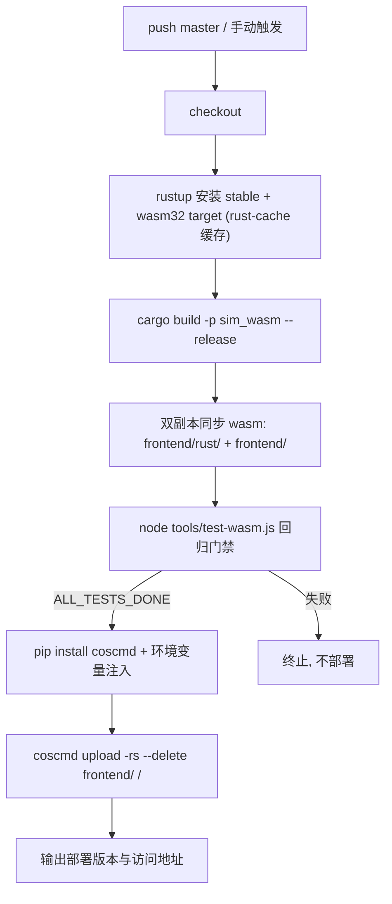

## 用户需求

为 Flow & Accord 项目设计 CI/CD 自动化流程，实现推送代码后自动编译并部署到腾讯云对象存储（COS）。

## 已确认决策

- **CI 平台**：GitHub Actions（仓库托管于 github.com:g39088902/FlowAndAccord，密钥存 GitHub Secrets）
- **构建策略**：CI 内从 Rust 源码重编译 WASM（不依赖仓库中已提交的 sim_wasm.wasm，保证产物与源码一致）
- **触发策略**：仅 push 到 `master` 分支时自动部署，`test` 分支作为开发缓冲不触发；同时支持手动触发（workflow_dispatch）

## 核心功能

- push master 后自动：安装 Rust 工具链 → 编译 WASM → 双副本同步（`frontend/rust/` 与 `frontend/`）→ 运行 `node tools/test-wasm.js` 回归门禁 → 上传 `frontend/` 静态产物至 COS
- 桶地址与 AccessKey 全部通过环境变量（GitHub Secrets）注入，文档说明需配置的变量清单
- 上传工具使用腾讯云官方 coscmd（pip 安装），不引入 CDN 等额外云服务
- 产出《CI/CD 部署指南》文档：环境变量说明、Secrets 配置步骤、COS 静态网站开启指引、排障方法

## 验收标准

- push 到 master 后 GitHub Actions 全流程绿灯，COS 上可访问最新版本页面
- test 分支推送不触发部署
- 密钥不出现在任何代码或日志中

## 技术方案

### 技术选型

- **CI/CD**：GitHub Actions（`.github/workflows/deploy.yml`）
- **构建**：ubuntu-latest + dtolnay/rust-toolchain（stable + wasm32-unknown-unknown）+ Swatinem/rust-cache 加速增量编译；CI 不使用本机 Windows 便携工具链（`.toolchain/`），改用标准 rustup
- **质量门禁**：`node tools/test-wasm.js`（项目唯一长期保留的自动化验证：同种子逐字节确定性、防越界、防 NaN），输出 `ALL_TESTS_DONE` 才允许部署
- **上传**：官方 `coscmd`（pip 安装，零额外 Node 依赖），`coscmd upload -rs --delete frontend/ /` 增量同步；不引入第三方社区 Action，降低供应链风险
- **浏览器访问**：依赖 COS 静态网站托管（用户在腾讯云控制台开启，文档指导），不涉及 CDN

### 流水线架构



### 关键设计决策

1. **测试前置为部署门禁**：与 AGENTS.md §4.10 长期验证策略一致，回归不过不上线；wasm 必须先编译再跑测试（test-wasm.js 依赖构建产物）
2. **wasm 双副本同步在 CI 内完成**：遵循 AGENTS.md §4.1 坑点，编译后同时复制到 `frontend/rust/sim_wasm.wasm`（前端实际 fetch 主路径）与 `frontend/sim_wasm.wasm`（备用路径）
3. **coscmd 命令行工具而非社区 Action**：官方维护、逻辑透明、密钥仅经环境变量传递，避免第三方 Action 供应链风险
4. **concurrency 取消策略**：同一分支连续 push 时取消旧的进行中部署，避免并发上传冲突
5. **纯静态上传**：`frontend/` 目录即部署产物，无前端构建步骤；`server.js`/`package.json` 为本地开发服务器，一并上传无害（也可 exclude）
6. **无回写**：CI 构建的 wasm 不回推仓库，仓库中提交的 wasm 仅作本地开发快照

### 环境变量清单（写入文档，由用户配置为 GitHub Secrets）

| 变量名 | 说明 | 示例 |
| --- | --- | --- |
| `COS_SECRET_ID` | 腾讯云 API 密钥 SecretId（建议使用仅含 COS 权限的子账号密钥） | AKIDxxxxxxxx |
| `COS_SECRET_KEY` | 腾讯云 API 密钥 SecretKey | xxxxxxxx |
| `COS_BUCKET` | 桶名（Name-APPID 格式） | flow-and-accord-1250000000 |
| `COS_REGION` | 桶所在地域 | ap-guangzhou |


### 目录结构

```
FlowAndAccord/
├── .github/
│   └── workflows/
│       └── deploy.yml        # [NEW] CI/CD 主流水线：master push + workflow_dispatch 触发；
│                             #   安装 Rust/wasm32 → 编译 → 双副本同步 → test-wasm.js 门禁 → coscmd 上传
├── docs/
│   └── cicd-guide.md         # [NEW] CI/CD 部署指南：环境变量清单、GitHub Secrets 配置步骤、
│                             #   COS 静态网站开启方法、手动触发、失败排障
├── AGENTS.md                 # [MODIFY] 第 0 节文档地图登记 cicd-guide.md；补充"CI 工具链与本地 .toolchain 差异"坑点说明
├── docs/current/
│   └── 11-changelog.md       # [MODIFY] 追加版本条目
└── frontend/
    └── index.html            # [MODIFY] 版本徽章自增（遵循 AGENTS.md §4.9）
```

### 执行要点

- workflow 中 `CARGO_HOME` 使用 Actions 默认值，勿设置为本仓库 `.cargo-home`（该目录是 Windows 便携缓存，已被 gitignore 且平台不兼容）
- 上传前设置 `--delete` 增量同步并指定 `index.html` 正确 MIME（coscmd 自动处理）；`sim_wasm.wasm` 需确认 COS 返回 `application/wasm`，文档中提示在 COS 控制台或通过 coscmd 设置 Content-Type（若流式编译失败，前端会回退）
- 密钥安全：所有敏感值仅经 `${{ secrets.* }}` 注入环境变量，workflow 中不回显；文档建议创建仅 COS 读写权限的子账号
- blast radius 控制：不改动任何 Rust/前端运行代码，仅新增 CI 文件与文档；版本号变更遵循 §4.9 三处同步（index.html、AGENTS.md、changelog）