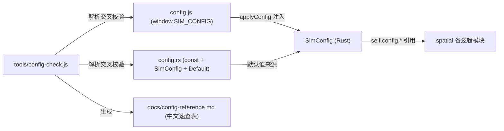

## 用户需求

消除代码、注释与文档中的 magic number，将所有可配置超参数统一收口到 config.js 管理；打通 config.js 与 Rust `SimConfig` 之间存在的字段漂移（孤儿字段、缺字段、数值不一致）；并开发 Node 校验/生成小工具，降低用户调参与检索参数的难度。

## 产品概述

把仿真内核的全部超参数收口到单一可热更新的配置通道（`config.js` → `SimConfig`），消除散落在各逻辑文件与文档中的硬编码字面量；同时提供自动校验与中文速查表，使用户无需翻阅源码即可安全、准确地调参。

## 核心特性

- 全量消除 Rust 仿真逻辑层（spatial 各模块）的硬编码字面量与直引 `const`，统一改为 `self.config.*` 引用
- 打通 config.js 与 `SimConfig` 字段漂移：补齐缺失字段（如 `houseNodePoiOccupyRadius`、`campRestStaminaRecoveryRate`）、删除孤儿字段、统一不一致数值（`decisionFoundHomeDistMin/Max`、`houseMinSpacing`）
- 文档与注释中的可配超参改为引用配置字段名（如 `decisionPoiSeekMinStockRatio`），而非裸数字
- 开发 `tools/config-check.js`：交叉校验字段缺失/拼写/类型/数值漂移并输出报告，自动生成 `docs/config-reference.md` 中文速查表（字段名/类型/默认值/中文说明）

## 技术栈

- 内核：Rust（`crates/sim_core`，确定性仿真，零运行时依赖，serde JSON 反序列化）
- 前端配置：`frontend/js/config.js`（原生 JS，`window.SIM_CONFIG` 对象）
- 校验工具：Node.js（`tools/config-check.js`，纯文本解析，无额外依赖）

## 实现思路

沿用现有"常量双轨制"架构（`config.rs` 中命名 `const` 作为 `SimConfig::default` 的唯一默认值来源，`SimConfig` 经 serde camelCase 由 `config.js` 热更新注入），**不引入新架构模式**。核心策略分三层：

1. **枚举与打通**：用审计先列出全部散落字面量与 `use crate::config::CONST` 直引点；将每一个可配超参映射到一个 `SimConfig` 字段，缺失的补齐 const+字段+`Default` 映射，孤儿字段删除或接入，数值不一致的两端统一定为同一权威值（优先采用 config.js 当前值，同步回 config.rs 的 const，保证 `SimConfig::default` 与 config.js 一致）。
2. **逻辑接线**：在各逻辑文件用 `self.config.字段` 替代字面量/`CONST`；新增字段接入对应逻辑（如 `house_node_poi_occupy_radius` 改为 `self.config.house_node_poi_occupy_radius`；`camp_rest_stamina_recovery_rate` 接入休息恢复速率）。
3. **工具与文档**：开发 `tools/config-check.js` 解析 config.js 与 config.rs，交叉校验并生成速查表；同步更新文档与版本号。

## 关键技术决策

- **保留 const 双轨**：const 是命名常量，非 magic number；保留其作为 `Default` 默认值来源，仅消除逻辑层字面量，避免大规模重构与确定性回归风险。
- **权威值统一**：`decisionFoundHomeDistMin/Max`、`houseMinSpacing` 三处 JS/RS 不一致，统一为 config.js 运行期值并回写 const，避免 `applyConfig` 静默覆盖行为；改后必须跑 `node tools/test-wasm.js` 确认同种子逐字节一致性仍通过。
- **确定性不变量**：新增字段仅扩展 `SimConfig`，不改变 `WorldRng` 消费顺序与 tick 全序；不涉及快照字段，故不需三处快照同步。
- **工具零依赖**：`config-check.js` 仅用正则/文本解析提取字段名/类型/默认值与中文注释，不引入 npm 依赖，契合项目便携工具链理念。

## 实现要点（防回归）

- **性能**：配置为字段直读，无热路径开销；审计与替换属一次性编译期改动。
- **向后兼容**：`SimConfig` 保持 `#[serde(default)]`，旧 config.js 键可继续合并，缺失键回落默认，不破坏现有存档/调用。
- **爆炸半径控制**：本次只动超参来源与引用，不改动状态机语义、快照结构、渲染逻辑；wasm 重新编译后须复制到 `frontend/rust/` 与 `frontend/` 双目录。
- **日志**：工具仅输出结构化校验报告（错误列表/速查表），不写敏感信息。

## 架构设计

配置通道与工具流向：



## 目录结构与文件

```
crates/sim_core/src/config.rs          # [MODIFY] 补齐/修正 SimConfig 字段与对应 const，统一 Default 映射（含 houseNodePoiOccupyRadius、campRestStaminaRecoveryRate；修正 decisionFoundHomeDistMin/Max、houseMinSpacing 数值）
frontend/js/config.js                  # [MODIFY] 与 SimConfig 字段集完全一致：增删字段、对齐数值、保留 camelCase 与中文注释
crates/sim_core/src/spatial/agent.rs   # [MODIFY] 字面量/直引 const → self.config.*
crates/sim_core/src/spatial/ecology.rs # [MODIFY] 同上（含 POI 播撒/交互/休息恢复速率接线）
crates/sim_core/src/spatial/graph.rs   # [MODIFY] 同上（限速/踩踏以 config 为源）
crates/sim_core/src/spatial/poi.rs     # [MODIFY] 同上（储量/再生上限）
crates/sim_core/src/spatial/house.rs   # [MODIFY] 同上（容量/升级门槛/耐久）
crates/sim_core/src/spatial/birth.rs   # [MODIFY] 同上（生命周期阈值）
crates/sim_core/src/spatial/decisions/*.rs  # [MODIFY] evaluate/harvest/needs/routing/seeking/scheduler 中阈值字面量 → self.config.*
crates/sim_core/src/spatial/housing_system/*.rs  # [MODIFY] construction/maintenance/marriage/inheritance/settlement 中 const 直引与字面量 → self.config.*
tools/config-check.js                  # [NEW] 解析 config.js 与 config.rs，交叉校验字段缺失/拼写/类型/数值漂移并报告；生成 docs/config-reference.md
docs/config-reference.md               # [NEW] 由工具生成的中文参数速查表（字段名/类型/默认值/说明）
AGENTS.md                              # [MODIFY] §4/§5 硬编码阈值改为引用配置字段名；Mermaid 版本节点与步骤四版本号自增
docs/current/*.md                      # [MODIFY] 各模块文档中可配超参改为引用字段名
docs/current/11-changelog.md           # [MODIFY] 追加本次版本条目
frontend/index.html                    # [MODIFY] 版本徽章 vX.Y.Z 自增
```

## 关键结构（新增字段示意）

新增超参须在 config.rs 同时出现于 `const`、结构体字段、`Default` 三处（示例）：

```rust
pub const HOUSE_NODE_POI_OCCUPY_RADIUS: f32 = 1.5; // 字段默认值
// SimConfig 内: pub house_node_poi_occupy_radius: f32,
// Default 内: house_node_poi_occupy_radius: HOUSE_NODE_POI_OCCUPY_RADIUS,
```

## Agent Extensions

### SubAgent

- **code-explorer**
- 用途：跨多文件搜索 spatial 下全部 .rs 文件中的硬编码字面量与 `use crate::config::CONST` 直引点，并比对齐 config.js 与 config.rs 的字段漂移，产出可执行的改造清单（文件:行号 + 目标字段）。
- 预期结果：得到一份完整的 magic number / 漂移字段清单，作为后续接线改动的精确依据，避免遗漏与不一致。