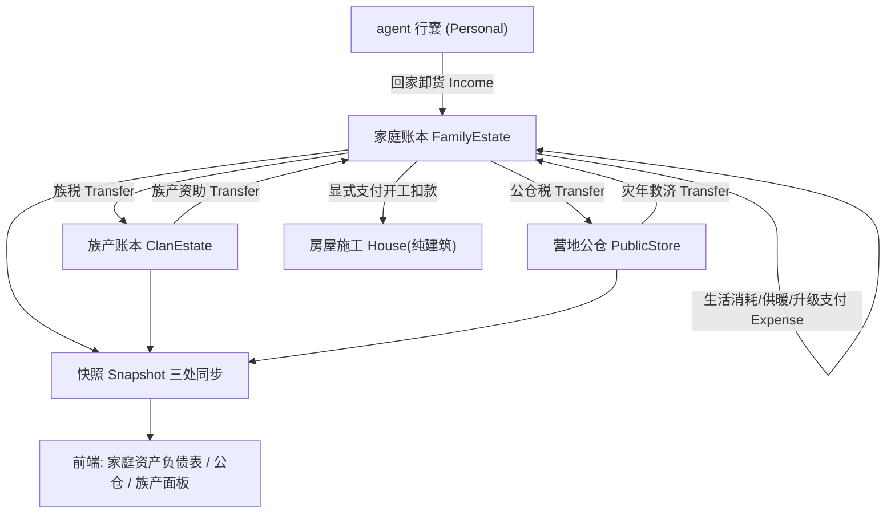

## 产品概述

对《Flow & Accord》进行"经济账本化"重构：把内嵌于房屋（House）的私有仓储拆解为**多级经济账本体系**，让每一份资源的流转都成为可追溯的显式交易，对齐 PLAN.md §3.1 的 DualTreasury（PersonalWallet / PublicTreasury）与资产负债表愿景。

## 账本层级（由用户确认）

- **个人私产**：agent 随身行囊（现有 carried_*，实物流，天然是 PersonalWallet 雏形，纳入账本口径与流水记录）；
- **家庭账本**：按户主家庭持有的独立账本实体（原 House pantry 迁出），承载日常储水粮、冬季烧柴、生活消耗、建房/升级的**显式支付**；
- **族产账本**：按父系血统 clan 聚合，族人按比例向族库缴纳，族库可在族内建房/灾年时资助（预留"有限公司账户"扩展位）；
- **营地公仓**：按营地持有，对辖内家庭收成抽税入仓，**灾年救济**（冬季/家庭粮水告急）时向家庭账本发放。

## 核心功能

- 账本统一模型：AccountKind 可扩展枚举 + 五类资源存量/容量 + 定长环形收支流水；
- 显式经济：升级/建造开工即从家庭账本扣款（不足则不开工），竣工付清；房屋变纯建筑（居住/耐久/等级/代际），0 级"仓库"语义改为"未建成居所"；
- 流水与报表：每笔收支（卸货入账、生活消耗、税收、救济、施工支付）生成流水，快照导出最近 N 条；
- 前端呈现：房屋面板新增"家庭资产负债表"（存量+流水），营地面板展示公仓存量，agent 面板展示族产；config.js 新增账本参数可调。
- 全链条一次完成：内核 + 快照三处同步 + 前端 + config + 文档版本号。

## 技术方案

### 技术栈（沿用现有，不引入新依赖）

- 内核：Rust（crates/sim_core），确定性 tick 驱动；
- 桥接：crates/sim_wasm 零依赖 JSON 快照导出；
- 前端：原生静态（index.html + js/*.js + frontend/server.js），无构建步骤；
- 验证：node tools/test-wasm.js（确定性回归）+ node tools/config-check.js（前后端参数一致）。

### 实现思路

1. **新建经济子系统** `crates/sim_core/src/spatial/economy/`（遵循 §4.6 模块化拆分规范）：

- `ledger.rs`：`Transaction { tick, kind(Income/Expense/Transfer), resource, amount, counterparty }` 定长环形流水（O(1) 写入，内存恒定，防快照膨胀）；
- `estate.rs`：`EconomicAccount` 统一账户（存量/容量/流水）+ `FamilyEstate` 家庭账本（生活消耗、供暖扣柴、生育门槛、升级可付判定 `can_afford_upgrade` 与显式扣款 `pay_for_upgrade`）；
- `clan.rs`：族产账本注册表（HashMap<clan_id, EconomicAccount>，族税缴纳、族产资助流水）；
- `relief.rs`：营地公仓（税收入仓 + 灾年救济结算）。

2. **House 去仓储化**：`house.rs` 移除 5 组 pantry 字段，`HouseTier::Tier0Warehouse` 语义改为"未建成居所/帐幕"（枚举值保留以兼容快照字符串）；家庭账本以 `house_id` 键控挂载于 `world.estates`，房tiers 保留居住功能（容量成长、结婚/生育资格）。
3. **全链路改写（结算方式变更，决策归属不变，遵守 §4.11 严禁扫描指挥）**：

- `ecology.rs::tick_poi_interactions`：卸货改写家庭账本（Income 流水）、生活消耗（Expense 流水）；
- `housing_system/`：construction.rs 开工即扣款、maintenance.rs 冬季烧柴记账、inheritance.rs 账本随父系继承转移、settlement.rs 立宅时创建家庭账本；
- `decisions/*`：harvest/seeking/routing/needs/evaluate 中 `house.pantry_*` 读取全部改为经 `world` 的账本查询（保持施密特触发器与节拍语义不变）；
- `is_pantry_full` 升级门槛 → `can_afford_upgrade`（按 `house_cost_tierN_*` 显式材料价目判定），并新增"族产/公仓资助"可选来源。

4. **族产与公仓**：agent 新增 `clan_id`（初始按父系分配，出生随父，deterministic 不耗 WorldRng）；公仓按 `estate_public_tax_ratio` 抽税、按 `relief_*` 超参在冬季/饥荒触发救济转账。
5. **快照三处同步**（§4.5）：`snapshot.rs` + `world.rs::generate_snapshot()` + `frontend/js/rustworld.js::_applySnapshot()`；HouseSnapshot 的 pantry 字段改为从家庭账本映射（前端旧读法零破坏），另增 EstateSnapshot（存量+最近流水）、clan/公仓字段。
6. **config 新超参**（§4.12 三处同步 + config-check 自动刷新速查表）：账本容量、流水长度、房屋各等级显式价目、族税率、公仓税率、救济触发阈值与速率。

### 关键数据结构

```rust
pub enum AccountKind { Personal, Family, Clan, PublicStore /* 预留 Corporate */ }

pub struct EconomicAccount {
    pub kind: AccountKind,
    pub stock: ResourceStock,          // water/food/wood/stone/gold 五类存量
    pub capacity: ResourceStock,       // 五类容量上限
    pub ledger: LedgerRing,            // 定长收支流水（环形缓冲）
}

pub struct Transaction { pub tick: u64, pub kind: TxKind, pub resource: ResourceKind, pub amount: f32, pub counterparty: TxCounterparty }
```

### 性能与可靠性

- 流水环形缓冲 O(1) 写、内存恒定；账本查询经 `world` 一级 HashMap，避免 decisions 里的线性 houses 扫描放大；
- 不新增任何 WorldRng 消耗，保证 test-wasm.js 同种子逐字节一致；
- 快照字段走"兼容映射 + 增量新增"，控制前端爆炸半径。



### 目录结构

```
crates/sim_core/src/spatial/economy/
├── mod.rs          # [NEW] 经济子系统入口：AccountKind/EconomicAccount/ResourceStock 统一模型
├── ledger.rs       # [NEW] Transaction 定长环形流水账（O(1) 写入，快照导出最近 N 条）
├── estate.rs       # [NEW] FamilyEstate：家庭账本，生活消耗/供暖/生育/升级显式支付结算
├── clan.rs         # [NEW] 族产账本注册表：族税缴纳、族产资助（预留有限公司账户扩展）
└── relief.rs       # [NEW] 营地公仓：税收入仓与灾年救济结算

crates/sim_core/src/spatial/house.rs        # [MODIFY] 移除 pantry 字段，Tier0 语义改为未建成居所，升级改价目判定
crates/sim_core/src/spatial/world.rs        # [MODIFY] estates/clans/public_stores 容器挂载 + generate_snapshot 账本导出
crates/sim_core/src/spatial/ecology.rs      # [MODIFY] 卸货/生活消耗改写家庭账本并记流水
crates/sim_core/src/spatial/agent.rs        # [MODIFY] 新增 clan_id 字段（父系继承）
crates/sim_core/src/spatial/birth.rs        # [MODIFY] 出生随父定 clan_id
crates/sim_core/src/spatial/decisions/      # [MODIFY] harvest/seeking/routing/needs/evaluate 改读账本
crates/sim_core/src/spatial/housing_system/ # [MODIFY] settlement(立宅建账本)/construction(开工扣款)/maintenance(烧柴记账)/inheritance(账本继承)/marriage
crates/sim_core/src/spatial/snapshot.rs     # [MODIFY] EstateSnapshot/流水/族产/公仓快照字段 + HouseSnapshot 兼容映射
crates/sim_core/src/config.rs               # [MODIFY] 新超参三处同步（const + SimConfig + Default）
crates/sim_wasm/                            # [MODIFY] 快照序列化透传新增字段
frontend/js/rustworld.js                    # [MODIFY] _applySnapshot 账本/流水/族产/公仓映射
frontend/js/config.js                       # [MODIFY] 新超参镜像 + 中文行内说明
frontend/js/render.js / main.js / index.html # [MODIFY] 房屋资产负债表面板、营地面板公仓、agent 族产展示
docs/current/02-ecology-poi.md 等 5 篇 + 11-changelog.md  # [MODIFY] 模块文档与版本条目
AGENTS.md / housing_system 局部 AGENTS.md    # [MODIFY] 版本号与机制描述更新
```

## 设计说明

沿用现有深色模拟器风格（Canvas 暗色场景 + 玻璃拟态 Inspector 面板），仅做面板内容增量：

- **房屋面板「家庭资产负债表」区块**：五类资源存量/容量进度条 + 最近 6 条收支流水列表（图标 + 金额 + 对手方 + tick），收入绿色、支出红色、转移蓝紫；
- **营地面板「公仓」区块**：公仓五类存量与救济状态标签（救济中/储备充足）；
- **Agent 面板「族产」行**：所在家族存量概览；
- **config.js 新增参数**：每项带中文行内说明，随现有面板风格展示。
不改动整体布局与配色体系，保持现有 Inspector 视觉语言。

## Agent Extensions

### SubAgent

- **code-explorer**
- Purpose：执行期扫描 decisions/*、housing_system/*、ecology.rs 中所有 pantry/carry 读写点，产出完整改造清单，防止遗漏调用点
- Expected outcome：完整的"仓库耦合点清单"覆盖全部读写路径，供账本改写逐一替换

### Skill

- **playwright-cli**
- Purpose：编译回归后打开 http://localhost:3000 验证家庭资产负债表面板、公仓/族产展示与渲染无报错
- Expected outcome：截图确认新面板渲染正常、Console 无错误