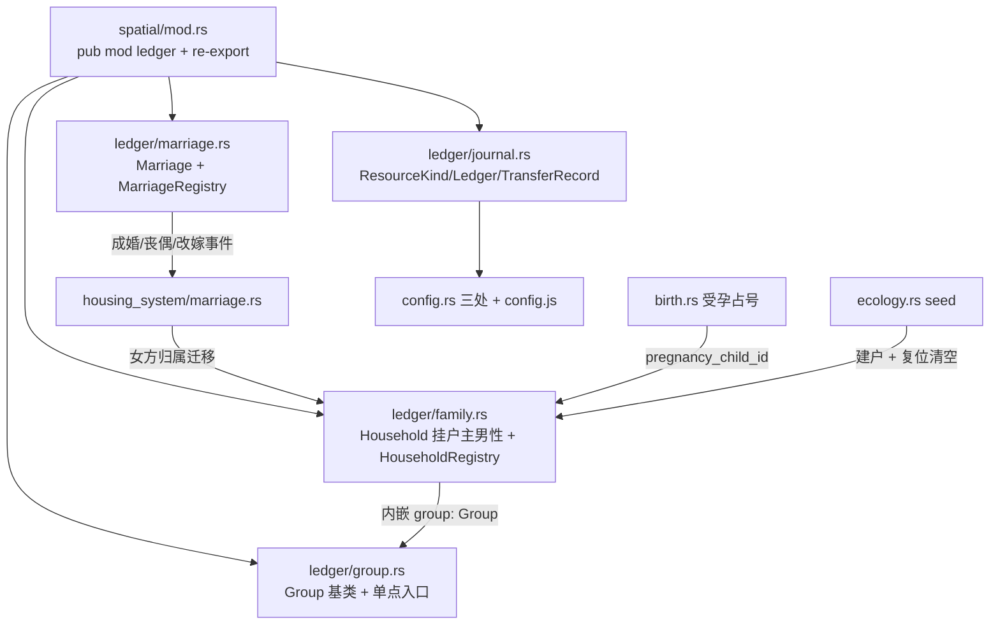

## 需求概述

依据 `docs/PLAN_LEDGER_REFACTOR.md`（v4）实施 **M1 阶段**：建立独立账本子系统骨架 + 婚姻登记系统 + **家户体系（家庭跟着男人走）**，不触碰任何现有物理仓储逻辑。

## 核心交付

1. **账本内核**（M1.1）：`ResourceKind` / `Ledger`（分品类存量 + 双环形流水）/ `TransferRecord` / `TransferReason`（含 `Split` 分家，为 M2-M4 预留 Tax/Tribute/Relief/Inheritance 等）。
2. **团体基类**（M1.2）：`Group { leader, members(含领导), ledger }` + `add_member / remove_member / set_leader` 单点入口，成员与领导变动留审计事件。
3. **婚姻登记**（M1.3）：`Marriage`（不持有 house_id、**不承载账本**）+ `MarriageRegistry`（一人多段婚姻、`by_agent` 索引、存续唯一性、`next_id` 确定性发号）。
4. **★ 家户体系**（M1.4，v4 变更核心）：`ledger/family.rs`——`Household { id, head(必为男性), group: Group, parent_household, founded_tick, is_dissolved }` + `HouseholdRegistry { households, by_agent(每人唯一归属), next_id }`；`GroupKind::Family(HouseholdId)`，领导者 = 户主男性。
5. **婚姻生命周期挂钩**（M1.5）：成婚 → 婚姻登记 + 女方转入夫家家户；丧偶 → 婚姻封账（`Bereaved`）；改嫁 → 封旧开新 + 女方先移出旧家户再加入新家户；`Agent3D.spouse_id` 降级为缓存，登记簿为唯一真实来源。
6. **★ 胎儿预分配 ID**（M1.6）：受孕瞬间即分配 `AgentId` 写入母亲字段，出生时复用，使未出生孩子能计入分家权重与继承分配。
7. **种子建户与重置**（M1.7）：`seed_primitive_ecology` 为始祖男性建户、女性待成婚后转入夫家；世界复位时同步清空两个登记簿。
8. **超参联动**（M1.8）：`ledger_journal_capacity` 同步 `config.rs` 三处（已完成）与 `frontend/js/config.js`（待补），跑 `config-check.js`。
9. **验收收尾**（M1.9）：`cargo build` + `node tools/test-wasm.js` 全绿（胎儿占号改变 ID 序列 → 基准一次性重建）；临时单测覆盖七场景后**删除**；版本号 v0.9.71 → v0.9.72 三处同步 + changelog。

## 家族规则约束（本期只建模、不实现分配算法，M2.4/M2.5 落地）

- 家庭归属：家庭挂在**男性户主**名下，婚姻只是两性关系记录；已婚女性随夫入家户，未成年子女（含胎儿）归父亲家户。
- 分家触发：男人**成年**或**失去父亲**；分家权重：**父亲 = 2，其余子一代（含母亲腹中未出生孩子）各 = 1**，分家男子分走 `1/(2+n)` 的每一类资源，记 `Split` 流水。
- 父亲死亡继承：家户资源**平分给在世子一代（不含配偶）**；无在世子一代 → **全部交入公仓**。

## 边界（明确不做）

- 不改 `house.rs` 仓储字段、`agent.rs` 行囊字段、`ecology.rs` 装卸逻辑、`housing_system/` 物理结算（唯一例外：`birth.rs` 受孕发号）；
- 族长制（M3）、地区团体/国王/夺位（M4）、旁路记账与快照导出（M2）不在本期范围；
- 家户资源分配（分家/继承）本期只预留 `TransferReason::Split` 与账本结构。

## 技术栈

- Rust 确定性内核 `crates/sim_core`（零新增外部依赖），`serde` 派生沿用既有写法；前端仅 `config.js` 调参项；验收走 `tools/config-check.js` + `tools/test-wasm.js`。

## 实施要点

1. **修正已建代码对齐 v4**：`ledger/marriage.rs` 中 `Marriage.family: Group` 与"家庭不挂婚姻"冲突，须移除该字段及对应构造逻辑；`GroupKind::Family(MarriageId)` 改为 `Family(HouseholdId)`。
2. **家户建模**：`Household` 内嵌 `Group`（leader=户主男性，成员=户主+妻子+未成年子女+胎儿），`HouseholdRegistry.by_agent` 保证每人任一时刻唯一归属（改嫁先移后加）；`parent_household` 为 M2 分家抽资预留血缘链。
3. **确定性红线**：`next_id` 顺序发号；集合全用 `BTreeMap/BTreeSet` 保遍历序；钩子不消耗 `WorldRng`、不新增决策相位、不改变 `tick` 内部顺序（§4.3）；一切排序并列取 id 小者。
4. **挂载与可见性**：`World3DEngine` 新增 `pub marriage_registry` / `pub household_registry` 两字段（结构体 15-45 行 + `new_seeded_with_config` 58-89 行全字段字面量）；`tick_counter` 为私有字段，须在 `world.rs` 新增只读访问器供 `housing_system/` 与 `ledger/` 取 tick。
5. **胎儿预分配**：受孕点（`agent.rs` 受孕判定 334-339 行）占号写入母亲新字段 `pregnancy_child_id`，`birth.rs` 分娩时复用该 ID 构造实体；占号会插入 ID 序列，`test-wasm.js` 基准需一次性重建（禁止同批改动其他发号逻辑）。
6. **新旧分离**：`ledger/` 不 import `house.rs` 仓储字段，账本只记"权责"，与物理库存不强制相等。

## 架构关系



## 性能与风险

- 登记簿查询 O(log n)；丧偶/成婚沿用既有 O(n) 扫描，无新增热路径。
- 流水环形缓冲容量由 `ledger_journal_capacity`（默认 64）控制，防长程内存膨胀。
- 主要风险：胎儿占号导致 ID 序列漂移（基准重建）、家户归属并发错乱（先移后加 + 单点入口）、分家权重分母含胎儿（M2 单测覆盖 n=0/1/3）。
- 临时单测七场景跑通后删除，长期验证只依赖 `test-wasm.js`（§4.10）。

## 目录结构

```
crates/sim_core/src/spatial/
├── ledger/
│   ├── mod.rs        # [MODIFY] 挂载 family 子模块 + re-export Household/HouseholdRegistry
│   ├── journal.rs    # [MODIFY] 移除临时测试；保留 ResourceKind/Ledger/Transfer*/transfer 总线
│   ├── group.rs      # [MODIFY] GroupKind::Family(HouseholdId)；移除临时测试
│   ├── marriage.rs   # [MODIFY] 移除 Marriage.family 字段与家庭构造；移除临时测试
│   └── family.rs     # [NEW] Household + HouseholdRegistry（家户挂户主男性、归属迁移、建户/解散）
├── mod.rs            # [MODIFY] 扩展 re-export（Household 等）
├── world.rs          # [MODIFY] 两登记簿字段 + 构造函数初始化 + 只读 tick 访问器
├── agent.rs          # [MODIFY] 新增 pregnancy_child_id 孕期胎儿 ID 字段
├── birth.rs          # [MODIFY] 受孕占号（next_agent_id）、分娩复用该 ID
├── ecology.rs        # [MODIFY] seed 为始祖男性建户、复位清空两登记簿
└── housing_system/
    └── marriage.rs   # [MODIFY] 成婚/丧偶/改嫁三事件挂钩登记簿与家户归属

frontend/js/config.js       # [MODIFY] 新增 ledgerJournalCapacity（分区 10）
frontend/index.html         # [MODIFY] 版本徽章 v0.9.71 → v0.9.72
AGENTS.md                   # [MODIFY] 版本号两处
docs/current/11-changelog.md # [MODIFY] 追加 v0.9.72 条目
```

## SubAgent

- **code-explorer**
- Purpose: 精确核对 `birth.rs` 受孕/分娩链路、`agent.rs` 孕期字段与 `world.rs` 发号点（`next_agent_id`）的全部读写位置，确保胎儿预分配 ID 改造不漏改、不破坏确定性
- Expected outcome: 输出「文件 + 行号 + 现有代码形态」清单，明确受孕判定、分娩构造、ID 发号三处落点及所有引用点