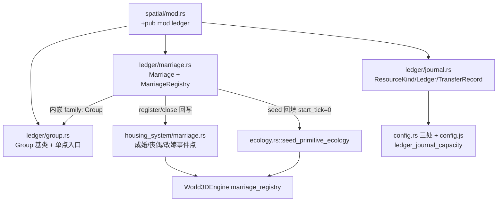

## 需求概述

依据 `docs/PLAN_LEDGER_REFACTOR.md`（v3）启动 **M1 阶段开发**：建立独立账本子系统骨架 + 婚姻登记系统 + 家庭团体，不触碰任何现有物理仓储逻辑。

## M1 核心交付

1. **M1.1 账本内核**：新建 `crates/sim_core/src/spatial/ledger/` 模块——`ResourceKind` / `Ledger`（分品类存量 + 环形流水缓冲）/ `TransferRecord` / `TransferReason`（含 Membership/Succession/Inheritance 等枚举，为 M2-M4 预留）。
2. **M1.2 团体基类**：`ledger/group.rs`——`Group { leader, members(含领导), ledger }` + `add_member / remove_member / set_leader` 单点入口（成员变动记 `Membership` 流水，领导必在成员列表中）。
3. **M1.3 + M1.4 婚姻登记**：`ledger/marriage.rs`——`Marriage` 实体（**不持有 house_id**，内嵌 `family: Group` 家庭团体）+ `MarriageRegistry`（`by_agent` 多段婚姻索引、存续唯一性校验、`next_id` 确定性发号）。
4. **M1.5 生命周期挂钩**（只插入登记调用，不改既有扫描结构）：

- `housing_system/marriage.rs::tick_marriage_and_remarriage` 成婚点 → `registry.register(husband, wife, tick)`（改嫁 = 封旧账 + 开新账）；
- `tick_bereavement_unmarry` 丧偶点 → `registry.close(marriage_id, Bereaved, tick)`（封账只读归档）；
- `Agent3D.spouse_id` 降级为缓存，由登记簿回写，真实来源为登记簿。

5. **M1.6 存量回填**：`ecology.rs::seed_primitive_ecology` 始祖初始化处对已婚 agent 补登记婚姻（`start_tick = 0`）。
6. **M1.7 超参联动**：`config.rs` 三处（const + SimConfig 字段 + Default）+ `frontend/js/config.js` 同步新增 `ledger_journal_capacity` 等，跑 `config-check.js`。
7. **M1.8 验收与收尾**：`cargo build` + `node tools/test-wasm.js` 全绿；临时 `#[cfg(test)]` 单测覆盖五场景（成婚登记/丧偶封账/改嫁开新账/存续唯一性/Group 领导必在成员列表）验证后**删除**；版本号 v0.9.71 → v0.9.72 三处同步 + changelog。

## 边界（明确不做）

- 不修改 `house.rs` 仓储字段、`agent.rs` 行囊字段、`ecology.rs` 装卸逻辑、`housing_system/` 物理结算逻辑（新旧完全分离，无兼容层）；
- 族长制（M3）、地区团体/国王/夺位（M4）、旁路记账（M2）、快照导出（M2.4）均不在本期范围。

## 技术方案

### 技术栈

- Rust 确定性内核（`crates/sim_core`，零外部依赖新增）；前端纯静态（本次仅 config.js 调参项）；验收走 `tools/config-check.js` + `tools/test-wasm.js`。

### 关键设计决策

1. **模块挂载**：`spatial/mod.rs` 追加 `pub mod ledger;` 并 re-export 核心类型；`ledger/` 按单一职责拆 `mod.rs` / `group.rs` / `marriage.rs` / `journal.rs`（遵守根 AGENTS.md §4.6 单文件 ≤800 行与局部 AGENTS.md 惯例）。
2. **确定性保障**：`MarriageRegistry.next_id` 顺序发号；`members` 用 `BTreeSet<AgentId>` 保遍历顺序；`by_agent` 用 `BTreeMap`；所有登记钩子不消耗 `WorldRng`、不新增决策相位，嵌在既有事件点（§4.3 tick 顺序不重排）。
3. **解耦实现**：`Marriage` 不持有任何 house_id 字段；`registry.register/close` 由其回写 `Agent3D.spouse_id` 缓存（登记簿为唯一真实来源）；`housing_system/marriage.rs` 原扫描与资格校验逻辑（男方非0级无主配偶房、双方成年单身、女方非孕期）原样保留，仅在成功点插入登记调用——严禁复活任何扫描器（housing_system/AGENTS.md §4）。
4. **挂载点**：`World3DEngine` 新增 `pub marriage_registry: MarriageRegistry` 字段（world.rs:16-42 结构体 + 构造函数两处）。

### 架构示意

### 性能与风险

- 登记簿查询均 O(log n)（BTreeMap/BTreeSet）；丧偶扫描沿用既有 O(n) 全员遍历，无新增热路径；
- 流水环形缓冲容量由 config 控制（默认 64），防止长程运行内存膨胀；
- 临时单测五场景跑通后删除，长期验证只依赖 test-wasm.js（§4.10）。

## Agent Extensions

### SubAgent

- **code-explorer**
- Purpose: M1 实施前精确核对该阶段涉及的全部调用点与结构体细节（world.rs 构造函数、marriage.rs 全部 spouse_id 读写点、config.js 字段格式、test-wasm.js 门禁要求），避免遗漏引用导致编译失败
- Expected outcome: 产出 M1 改动点的完整清单（文件+行号+现有代码形态），供实施直接对照