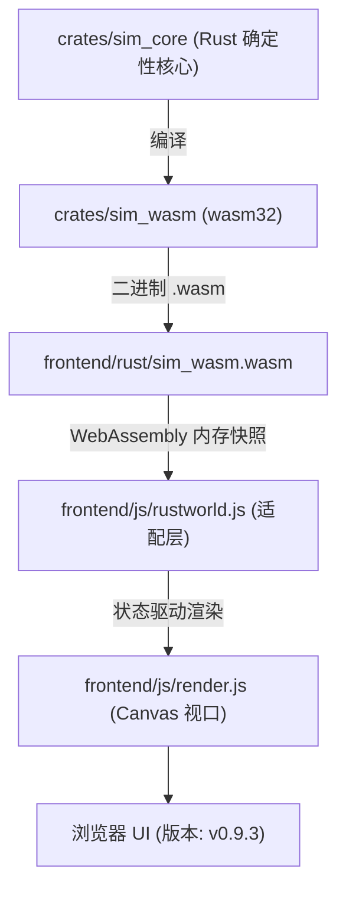

# Flow & Accord · 智能体与模拟系统操作指南 (AGENT.md)

本文档记录了项目的工程架构、内置便携工具链配置、WASM 编译命令、测试套件验证与前端启动方法。

---

## 1. 项目架构概述

`Flow & Accord` 采用 **Rust 核心确定性计算 + WebAssembly 桥接 + Canvas 2D / 3D 前端可视化** 的三层解耦架构：



- **`crates/sim_core`**：核心决策状态机（马斯洛需求层级）、有限生态（水/粮/木/石/金）、空间路网寻路、私宅营建与升级演化；
- **`crates/sim_wasm`**：零依赖 WASM 导出层，负责线性内存 JSON 序列化与 tick 步进；
- **`frontend/`**：原生静态前端，内置 Node.js 开发服务器 `frontend/server.js`，支持 30fps 锁定帧率、动态 Inspector、马斯洛需求徽章与拓扑路网实时绘制。

---

## 2. 完整编译与运行步骤

### 🚀 步骤一：配置便携工具链并编译 WASM

本项目在根目录 `.toolchain/` 下内置了便携式 Rust 工具链，并在 `.cargo-home/` 中缓存了离线依赖。

在 Windows PowerShell 终端中执行以下命令（一键注入工具链路径、编译 release 版 WASM 并复制到前端）：

```powershell
# 1. 注入便携工具链环境变量并编译 WASM
$env:PATH = "$PWD\.toolchain\cargo\bin;$PWD\.toolchain\rustc\bin;$env:PATH"
$env:CARGO_HOME = "$PWD\.cargo-home"
cargo build -p sim_wasm --target wasm32-unknown-unknown --release

# 2. 将编译产物同步复制至前端目录
Copy-Item "target\wasm32-unknown-unknown\release\sim_wasm.wasm" -Destination "frontend\rust\sim_wasm.wasm" -Force
Copy-Item "target\wasm32-unknown-unknown\release\sim_wasm.wasm" -Destination "frontend\sim_wasm.wasm" -Force
```

---

### 🧪 步骤二：自动化回归测试验证

无需启动浏览器，可直接运行 Node.js 测试套件验证 WASM 导出、确定性及长程稳定性：

```powershell
node tools/test-wasm.js
```
> 输出 `ALL_TESTS_DONE` 即代表确定性测试、坐标防越界、数值防 NaN 校验 100% 通过。

---

### 🌐 步骤三：启动前端本地开发服务器

使用项目内置的静态服务器（原生自带 `.wasm` MIME 支持）：

```powershell
node frontend/server.js
```

服务将监听在 **`http://localhost:3000`**（若 3000 被占用会自动递增至 `3001`、`3002` 等）。

---

### 🖥️ 步骤四：浏览器访问与调试

1. 打开浏览器访问：`http://localhost:3000`（或 `http://localhost:3001`）；
2. **强制刷新**：每次重新编译 WASM 后，在浏览器中按下 **`Ctrl + F5`** 强制刷新以清理缓存；
3. **版本确认**：页面顶部标题栏右侧显示版本徽章 **`v0.9.3`**。

---

## 3. 核心快捷键与交互控制

| 操作 / 快捷键 | 功能说明 |
| :--- | :--- |
| **`Space` (空格键)** | 全局一键 **暂停 / 继续** 模拟运行 |
| **鼠标左键点击小人** | 选中部落民，右侧弹出 Inspector，展示**马斯洛当前主导需求、决策原因、饱食/水分/体力/负重** |
| **鼠标左键点击房屋** | 查看私宅等级、耐久度、私有水/粮/木/石/金仓储及家庭成员 |
| **鼠标左键点击地标** | 查看清泉/果丛/森林/采石场/金矿的当前储量与实时产速 |
| **鼠标滚轮 / 右键拖拽** | 缩放与平移地图画布视口 |
| **重置模拟 (顶部按钮)** | 重新播撒 12 名初始族人（带 $\pm 10$ 随机离散状态） |
