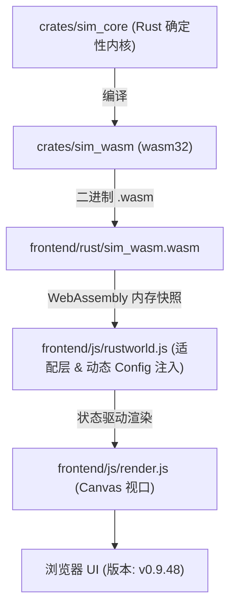

# Flow & Accord · 智能体与模拟系统开发操作指南 (AGENTS.md)

本文档记录了项目的工程架构、便携工具链配置、WASM 编译命令、测试套件验证与前端启动方法，并汇总了开发核心易踩坑清单。

> ⚠️ **改代码前必读**：第 4 节「重要易踩坑清单」汇总了本项目最容易踩的坑（WASM 双向同步、决策节拍、随身搬运、POI 储量门槛、快照三处同步、确定性约束等），由历次开发踩坑沉淀而来。

---

## 0. 📚 项目文档地图与定位

项目根目录核心文档各司其职，**以 CURRENT.md 描述"现状"，PLAN.md / ARCHITECTURE.md 描述"愿景"**：

| 文件 | 定位 | 何时阅读 / 维护 |
| :--- | :--- | :--- |
| **AGENTS.md**（本文档） | 智能体操作指南：架构概述、编译步骤、快捷键 + 第 4 节易踩坑清单 | **改任何代码前必读**；新增机制或踩了新坑必须补充 |
| **CURRENT.md** | **已实现功能全景清单（当前实际状态）**：生态/四季/代谢/房屋/决策/前端特性全收录 | 快速了解"当前现状"时查阅；**改动机制后必须同步更新** |
| **BUILD_GUIDE.md** | 编译与运行深度指南：工具链环境、WASM 编译、测试用例与故障排查 | 深入构建与环境排障时参考 |
| **AGENT_AI_ANALYSIS.md** | 部落民 AI 决策系统深度拆解：马斯洛 FSM、加权 A*、踏路涌现与生命周期闭环 | 理解 AI 状态机、寻路与代际演化逻辑时查阅 |
| **ARCHITECTURE.md** | 宏观技术架构设计愿景书（ECS 内核 / 零拷贝快照 / LLM 认知总线） | 参考分层架构愿景（大部分前沿特性为规划态） |
| **PLAN.md** | 项目长期规划书（空间演化 / 专利经济 / 混合政体 / LLM 认知层） | 了解未来宏观发展方向（大部分内容为规划态） |

### 0.1 📑 嵌套 AGENTS.md（目录级操作指南）

除根 AGENTS.md 外，每个复杂 Rust 代码目录内还维护一份**局部 AGENTS.md**，聚焦该目录的职责边界、文件清单与局部易踩坑；**改哪个目录的代码，先读对应目录的局部 AGENTS.md**，全局规则仍以根 AGENTS.md 为准，两者表述冲突时以根文档为准：

| 目录 | 局部 AGENTS.md | 覆盖范围 |
| :--- | :--- | :--- |
| `crates/sim_core/` | `crates/sim_core/AGENTS.md` | sim_core 内核：crate 布局、SimConfig 参数表、WorldRng 确定性、geo/spatial 模块地图 |
| `crates/sim_wasm/` | `crates/sim_wasm/AGENTS.md` | WASM 导出层：导出函数清单、静态缓冲区、错误码、指针约定、双副本同步 |
| `crates/sim_core/src/spatial/decisions/` | `crates/sim_core/src/spatial/decisions/AGENTS.md` | 决策状态机：马斯洛评估、节拍语义、私有施密特触发器、途中重路由、立宅选址 |
| `crates/sim_core/src/spatial/housing_system/` | `crates/sim_core/src/spatial/housing_system/AGENTS.md` | 房屋系统：5 个单一职责子模块、升级门槛、三条自主决策链路 |

**维护规则**：新增或重构出复杂目录时应同步补充局部 AGENTS.md 并登记到本表；局部文档引用到的类型/方法改名后必须同步修订对应文档，避免文档与现状脱节。

---

## 1. 项目架构概述

`Flow & Accord` 采用 **Rust 确定性计算内核 + WebAssembly 桥接 + Canvas 2D/3D 前端可视化** 的三层解耦架构：



- **`crates/sim_core`**：核心决策状态机（`spatial/decisions/`）、有限生态采收与随身搬运（`spatial/ecology.rs`）、空间拓扑路网寻路（`spatial/graph.rs`）、私宅营建与代际继承（`spatial/housing_system/`）；
- **`crates/sim_wasm`**：零依赖 WASM 导出层，负责线性内存 JSON 序列化、tick 步进与 JS 动态配置注入；
- **`frontend/`**：原生静态前端（`config.js` / `math.js` / `rustworld.js` / `render.js` / `main.js`），内置轻量开发服务器 `frontend/server.js`。数字配置抽离在 `config.js` 中，无需重新编译即可调参。

---

## 2. 完整编译与运行步骤

### 🚀 步骤一：配置便携工具链并编译 WASM

本项目在根目录 `.toolchain/` 下内置了便携式 Rust 工具链，并在 `.cargo-home/` 中缓存了离线依赖。

在 Windows PowerShell 终端中执行一键编译与双端同步：

```powershell
# 1. 注入便携工具链环境变量并编译 WASM
$env:PATH = "$PWD\.toolchain\cargo\bin;$PWD\.toolchain\rustc\bin;$env:PATH"
$env:CARGO_HOME = "$PWD\.cargo-home"
cargo build -p sim_wasm --target wasm32-unknown-unknown --release

# 2. 将编译产物同步复制至前端双目录
Copy-Item "target\wasm32-unknown-unknown\release\sim_wasm.wasm" -Destination "frontend\rust\sim_wasm.wasm" -Force
Copy-Item "target\wasm32-unknown-unknown\release\sim_wasm.wasm" -Destination "frontend\sim_wasm.wasm" -Force
```

---

### 🧪 步骤二：自动化回归测试验证

无需启动浏览器，通过原生单元测试与 Node.js 端到端测试双重校验：

```powershell
# 1. 运行 Rust 原生内核编译与测试（当前源码未内置单元测试用例，命令通过即代表编译无误）
cargo test --lib

# 2. 运行 WASM 导出、确定性及长程稳定性验证
node tools/test-wasm.js
```
> 输出 `ALL_TESTS_DONE` 即代表确定性测试、坐标防越界、数值防 NaN 校验 100% 通过。

---

### 🌐 步骤三：启动前端本地开发服务器

使用项目内置的静态服务器（原生自带 `.wasm` MIME 支持）：

```powershell
node frontend/server.js
```
服务默认监听在 **`http://localhost:3000`**（若 3000 被占用会自动递增至 `3001`、`3002` 等）。

---

### 🖥️ 步骤四：浏览器访问与调试

1. 打开浏览器访问：`http://localhost:3000`；
2. **强制刷新**：每次重新编译 WASM 后，在浏览器中按下 **`Ctrl + F5`** 强制刷新以清理 WebAssembly 缓存；
3. **版本确认**：页面顶部标题栏右侧显示版本徽章 **`v0.9.48`**。

---

## 3. 核心快捷键与交互控制

| 操作 / 快捷键 | 功能说明 |
| :--- | :--- |
| **`Space` (空格键)** | 全局一键 **暂停 / 继续** 模拟运行 |
| **鼠标左键点击小人** | 选中部落民，右侧弹出 Inspector，展示**马斯洛当前主导需求、决策原因、饱食/水分/体力/行囊负重** |
| **鼠标左键点击房屋** | 查看私宅等级、耐久度、私有水/粮/木/石/金仓储及家庭成员 |
| **鼠标左键点击地标** | 查看清泉/果丛/森林/采石场/金矿的当前储量与实时产速 |
| **鼠标滚轮 / 右键拖拽** | 缩放与平移地图画布视口 |
| **重置模拟 (顶部按钮)** | 重新播撒 20 名初始族人（10男10女，带 $\pm 10$ 随机离散状态） |

---

## 4. ⚠️ 重要易踩坑清单 (Pitfalls)

> 以下坑均由实际开发踩坑沉淀而来，**改动代码前先对照本节**。按"最常踩 → 最隐蔽"排序。

### 4.1 🔴 WASM 编译与双副本同步（最常踩）

- **改 Rust 内核（`crates/sim_core` / `crates/sim_wasm`）后，必须重编译 WASM 并复制到两个位置**，否则浏览器仍加载旧逻辑：
  - 副本 1：`frontend/rust/sim_wasm.wasm`（前端 `rustworld.js` 实际 fetch 的主路径）；
  - 副本 2：`frontend/sim_wasm.wasm`（根目录静态备用路径）。
- **不要用 wasm 字节数判断是否更新**：不同构建可能字节完全相同。以 `node tools/test-wasm.js` 的实际输出为准。
- **前端是纯静态文件**（`index.html` + `style.css` + `js/*.js`），无前端构建步骤，改完刷新即生效。切勿用外部 vite/webpack 替代内置 `frontend/server.js`。

### 4.2 🔴 寻路决策门槛、连续采收与中途重路由机制

- **Agent 私有 POI 施密特触发器（开启 $\ge 30\%$ / 关闭 $< 10\%$）**：
  - 每名 Agent 在自身决策相位观察 POI 库存，并在 `Agent3D::poi_seekability` 中维护私有锁存状态：库存升至 $\ge30\%$ 才开放；已开放点仅在跌破 $<10\%$ 时关闭；在 $10\%\sim30\%$ 中间带保持自身前态。相同 POI 可被不同 Agent 判为不同可用性；`decisions/routing.rs` 与 `decisions/seeking.rs` 的路由与重路由只读取 Agent 的触发器结论。
- **采收现场未满连续采收**：
  - 族人在现场采收（水/粮/木/石/金）时，若自己的目标触发器已关闭但自身或背包未满且家宅仍需，自动就近寻路前往下一处**自身触发器已开放**的同类 POI 继续采收，避免提前送货回宅。
- **中途断流熔断与平滑就近重路由（$< 10\%$）**：
  - 在 `decide_seeking_material` 与 `decide_seeking_survival` 中，中途检测**自身对目标**的施密特触发器关闭（观察到跌破 $<10\%$）时，若自身仍有其他已开放同类 POI，立即通过 `turn_around_and_route_to` 原地掉头并平滑重新规划路径赶往就近可用 POI；仅在自身无可用品或体力告警时才折返回家；
  - **严禁闪现瞬移**：中途掉头时通过 `turn_around_and_route_to` 在当前车道原地掉头（反向进度 `rev_len - distance_along_curve`），平滑从当前坐标沿原路往回走，保持坐标连续性。
- **修改相关逻辑时**：自动化验证以 `node tools/test-wasm.js` 的 WASM 回归为准；若临时编写 Rust 单元测试验证（提交前须删除，见 §4.10），需覆盖 Agent 私有施密特中间带保持状态、`test_poi_seekability_is_private_to_each_agent`、`test_abandon_seeking_when_target_poi_below_10_percent`、`test_reroute_to_next_poi_when_target_depleted` 等场景。

### 4.3 🟠 决策节拍语义（行为核心，勿随意改）

- **时间基准**：每个引擎 tick = 1/30 模拟秒，30 tick = 1 模拟秒；前端 30fps 每帧调一次 `sim.tick()`，1x 倍速下 1 模拟秒 = 1 现实秒。
- **错峰决策**：`world.tick()` 每个 tick 内部调用 `tick_decisions()`；每个 agent 仅在 `(tick_counter + agent.id) % 30 == 0` 的相位上决策（平均每 30 tick = 1.0 秒决策一次，全员相位均摊错开）。
  - **单元测试直接调 `tick_decisions()` 前必须先拨 `world.tick_counter = 29`**（使 ID=1 族人在 `(29+1)%30==0` 相位被调度），否则目标 agent 不在相位上不会决策。
- **严禁修改 `dt = 1/30`**：倍速通过 `world_tick_steps(N, 1/30)` 同帧多步实现，改动 `dt` 会导致数值积分发散。
- **`world.tick()` 内部顺序（勿打乱）**：POI 再生 → 代谢/繁衍 → POI 交互(装载/卸货) → 房屋系统 → 决策 → 道路衰减 → 运动。卸货发生在决策**之前**，决策看到的是卸货后的仓库状态。
- **共享 RNG 的确定性约束**：`WorldRng` 全局共享，按 agents 顺序依次消费。**新增任何随机消耗必须保持确定性**，否则 `tools/test-wasm.js` 的同种子逐字节一致性校验会失败。

### 4.4 🟠 随身搬运机制（真实背包，非瞬移）

- **真实随身搬运**：
  - 💧水/🍒食/🌲木/🪨石：在资源点**只装入随身行囊**（每类独立容量 50.0，常量 `CARRY_CAPACITY_RESOURCE`，**互不共享**），回家休整（`RestingAtCamp`）时按 **10/s** 卸货存入家宅仓库；行囊满（$\ge 50$）即返家。
  - 🪙金：**容量无限**，单趟运满 20（`gold_load_full`）回宅存入金库（5/s）。
  - **无家宅**（`home_house_id.is_none()`）的 agent 不装载行囊，只在现场就地自饮自食。
- **改容量/装卸速率必须全链条联动**：`agent.rs` $\rightarrow$ `ecology.rs` $\rightarrow$ `decisions/` $\rightarrow$ `snapshot.rs` $\rightarrow$ `rustworld.js` $\rightarrow$ `render.js`。

### 4.5 🟠 快照与前端字段三处同步

- **给 agent/house/poi 新增字段时，必须三处同步**：
  1. `crates/sim_core/src/spatial/snapshot.rs`（快照结构体定义）；
  2. `crates/sim_core/src/spatial/world.rs`（`generate_snapshot()` 赋值）；
  3. `frontend/js/rustworld.js`（`_applySnapshot()` 映射）。
- **前端 DOM ID 一致性**：`index.html` 中的元素 ID 与 `render.js` / `main.js` 中的 `getElementById` 必须完全匹配。

### 4.6 🟠 模块粒度与单文件行数规范

- **单文件严控在 800 行以内**：当模块功能膨胀时，应及时进行子目录模块化拆分（参考 `crates/sim_core/src/spatial/decisions/` 拆分为 `needs.rs`, `routing.rs`, `evaluate.rs`, `harvest.rs`, `seeking.rs`, `scheduler.rs`, `mod.rs`，以及 `crates/sim_core/src/spatial/housing_system/` 拆分为 5 个单一职责子模块的最佳实践）。

### 4.7 🟡 POI 数量、ID 段位与营地行政区升级

- 当前生态共 **23 处**：营地 5 处 (1-5)、清泉 6 处 (10-15)、浆果 6 处 (20-25)、林木 3 处 (30-32)、石矿 2 处 (40-41)、金矿 1 处 (50)。空间排斥间距 $\text{min\_poi\_distance} = 70\text{m}$。
- **营地县级行政区库与升级界限**：5 处营地在生成时从 `COUNTY_NAMES`（240+ 处真实古雅县名）随机 roll 出专属地名，并随辖内绑定的有效房屋数量自动升级：0~5 间为【营地】、6~11 间为【村】、12~17 间为【乡】、18~23 间为【镇】、24+ 间为【县】。
- **改 POI 数量必须同步**：`ecology.rs` $\rightarrow$ `index.html` 面板文案 $\rightarrow$ `CURRENT.md`。

### 4.8 🟡 行为与生理硬约束

- **冬季供暖**：冬季或气温 $< 5^\circ\text{C}$ 时，非 0 级有主房屋每秒消耗 0.12 木材（`housing_system/maintenance.rs`）；家宅木材 $< 10$ 时禁孕。
- **0 级仓库不扣生活水粮**（`ecology.rs` 中只有 `tier != Tier0Warehouse` 才允许族人从仓库吃喝消耗）。
- **房屋升级材料门槛**：`house.rs` `is_pantry_full()`：
  - 0 级仓库：需水粮各 90%；
  - 1 级茅草房：需木材 85% + 水粮 50%；
  - 2 级半棚屋：需石料 85% + 木材水粮 50%；
  - 3 级木石庄舍：需黄金 85% + 石料 85% + 木材水粮 50%。
- **淘金纪律**：4 级大庄园完全竣工前绝不娱乐淘金（`GoldWealth` 冷却 180s）；盖房备料淘金 `StockGold` 冷却 45s。
- **镜头跟随**：选中小人后 `isCameraFollow` 开启，关闭 Inspector 窗口（✕ 或 Esc 键）时必须同时关闭跟随。

### 4.9 🟢 版本号自增规范（每次 AI 修改代码必改）

- **强制规则**：**每次 AI 修改代码（无论修改 Rust 内核、前端 JS/CSS/HTML 还是文档配置），都必须自增版本号**（例如从 `v0.9.3` $\rightarrow$ `v0.9.4`）。
- **必须同步更新以下位置**：
  1. `frontend/index.html` 顶部品牌卡片内的版本徽章 `<span class="version-tag">vX.Y.Z</span>`；
  2. `AGENTS.md` 第 1 节 Mermaid 流程图节点 `浏览器 UI (版本: vX.Y.Z)` 及第 2 节步骤四 `版本确认：vX.Y.Z`；
  3. 若改动了核心机制或新增了特性，同步在 `CURRENT.md` 中记录更新。

### 4.10 🟢 混沌系统定位与测试策略（持久化测试禁令）

- **项目定位**：本项目旨在搭建**混沌系统**——确定性内核驱动多智能体在代际、社会、经济维度上涌现不可预测的长期演化。因此**短期单元测试无法评价功能正确性**：固定断言既测不出涌现行为，还可能误锁死演化的多样性，与项目目标相悖。
- **持久化测试禁令**：**此后不再持久化保存任何单元测试脚本**（`#[cfg(test)]` / `tests.rs` 等一律不进入提交）。当前仓库源码中无任何测试用例，即为这一策略的有意结果，非缺失。
- **临时验证流程**：每次开发新功能时，可**临时编写**单元测试/调试断言跑一遍，目的仅是**确认功能不跑不通**（能正常运行、无崩溃、核心数值合理）；验证通过后，在**提交前删除临时测试脚本**，保持仓库清洁。
- **长期验证职责**：行为与确定性的持续保障由 `node tools/test-wasm.js`（WASM 回归：同种子逐字节一致性、防越界、防 NaN、长程稳定）承担，该脚本是唯一长期保留的自动化验证。

### 4.11 🏠 建房/升级/修缮均为 Agent 自主决策（严禁系统扫描指挥）

- **设计原则**：系统只当"物理规则执行者"（放置校验 / 路网接入 / 施工计时 / 竣工扩容），一切"盖不盖、何时盖、在哪盖"必须来自 agent 自己的 `evaluate_needs` 输出；**严禁**再引入任何扫描全图并强制改写 `agent.state` 的"指挥式"逻辑。
- **三条自主触发链路（v0.9.43 起，均为必然/确定性触发）**：
  - **立宅（0级仓库）**：`NeedKind::FoundHome`（归属层）——**无家成年男性**且饥渴 ≥ 20、体力 ≥ 60 时必然触发；agent 在自己决策相位掷 12 个候选点自主选址（与现有房屋 ≥28m），存 `agent.pending_house_pos`；系统仅于 `settlement.rs::materialize_founded_houses`（每拍决策循环结束后执行）做放置校验、建门接入最近 3 节点、创建房屋并绑定 `home_house_id`；上述门槛/候选数/距离/间距均已入 `SimConfig`（`decision_found_home_*` / `house_min_spacing`，前端 `config.js` 可直接调参）；
  - **升级施工**：`NeedKind::BuildHouse`——仓满（`is_pantry_full` 各等级门槛）+ 男户主在家休息满体力时，户主自身决策相位触发 `ConstructingHouse`；施工计时与竣工扩容由 `construction.rs::tick_house_construction` 结算；
  - **修缮**：`NeedKind::RepairHouse`——耐久 < 50% 时户主/配偶自身决策相位触发 `RepairingHouse`；`maintenance.rs::tick_house_repair` 仅结算修缮进度。
- **已删除的旧扫描器（勿复活）**：`settlement.rs::tick_warehouse_founding`、`construction.rs::check_start_house_upgrades`、`maintenance.rs` 内强制切换修缮的扫描块。
- **改相关逻辑的验证**：以 `node tools/test-wasm.js` 回归为准；若临时写 Rust 测试验证（提交前须删除，见 §4.10），需覆盖：无家成年男性必然触发 FoundHome 且实体化绑定、仓满男户主自主开工升级、耐久 <50% 户主自主触发修缮。
