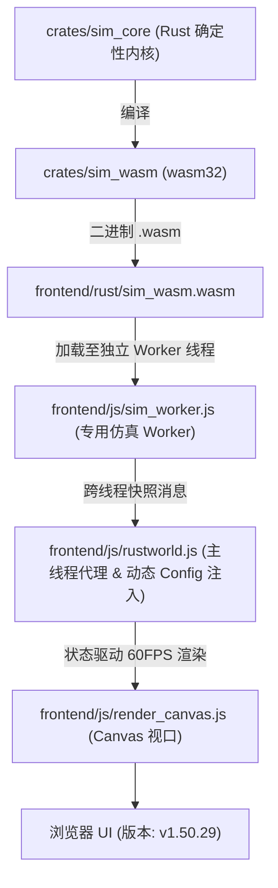

# Flow & Accord · 智能体与模拟系统开发操作指南 (AGENTS.md)

> ⚠️ **改代码前必读**：第 4 节「重要易踩坑清单」汇总了本项目最容易踩的坑（WASM 双向同步、决策节拍、随身搬运、POI 储量门槛、快照四处同步[M4]、确定性约束等），由历次开发踩坑沉淀而来。

---

## 0. 📚 项目文档地图

开发任务从 [Agent 快速入口](./docs/current/tech/30-workflow.md) 按改动类型选择局部指南和门禁；本文件仍为全局规则入口。

除根目录 **README.md**（对外营销宣传）、**AGENTS.md** 和 **TODO.md** 外，其余文档全部在 `docs/` 下，按
**当前 / 计划** 划分，每层再按 **产品设计 / 技术方案** 划分；**每个目录内文档按顺序从 `01` 起连续编号**
（各目录各自成序，编号本身不含层级语义）。`tech/` 内按
总体与基座 → 上层社会与经济 → 中层个体与行为 → 下层世界与物理 → 表现层 → 工程层 → 附录 分层排列。

| 文件 | 定位 | 何时阅读 |
| :--- | :--- | :--- |
| **README.md** | 面向玩家的营销宣传文档：项目定位、八大核心看点、第一局观察指引、三分钟上手、路线图 | 对外宣传 / 新玩家入门时 |
| **AGENTS.md**（本文档） | 架构概述、编译步骤、快捷键 + §4 易踩坑清单 + §5 文档分层策略 | **改任何代码前必读** |
| **`docs/README.md`** | 文档总导航（唯一入口） | 找文档时 |
| **./docs/current/README.md** | **现状总索引**：完整模块导航表 | 快速了解现状 |
| **`docs/current/design/`** | 现状 · 产品设计（玩家视角）：[01 产品总览](./docs/current/design/01-product-overview.md) · [02 世界与地图规则](./docs/current/design/02-world-rules.md) · [03 族人家庭与社会规则](./docs/current/design/03-life-and-society.md) · [04 经济与资源规则](./docs/current/design/04-economy.md) · [05 观察与交互设计](./docs/current/design/05-observation-ux.md) · [06 AI 行为设计](./docs/current/design/06-agent-behavior-design.md) | 讨论玩法、规则与体验时 |
| **./docs/current/tech/01-engine-architecture.md** | 现状 · 技术总体：三层解耦、文档地图、tick 内部顺序、数据流、配置注入 | 入门架构 / 定位模块归属 |
| **./docs/current/tech/02-core-systems-fsm.md** | 三大核心系统状态机全景：马斯洛需求与动作、私产房屋与归宿拓扑、王国与帝国政体演化 | 查阅核心 FSM 与状态转移契约时 |
| **./docs/current/tech/11-decision-engine.md** | 决策引擎：马斯洛六层、16 条分支、私有触发器、错峰节拍（附「为什么这么设计」篇） | 理解决策状态机与寻路逻辑时 |
| **./docs/current/tech/12-m19-architecture.md** | M19 决策架构规格：意图/策略/原语三层解耦、ActiveTask 单一真相源 | 使用意图/策略/原语类型及观察 API 时 |
| **./docs/current/tech/07-ledger-and-polity.md** | 账本与政体（M1~M5 已落地） | 改动 ledger/ 代码时查阅 |
| **./docs/current/tech/28-invariants.md** · [29 影响矩阵](./docs/current/tech/29-impact-matrix.md) | 六类硬约束集中清单 · 改 X 牵动哪些文件 | 改动前对照 |
| **./docs/current/tech/30-workflow.md** | Agent 快速入口 + Commit 检查单 + 文档维护机制 | **提交前必读** |
| **./docs/current/tech/22-build-and-run.md** · [24 无头诊断](./docs/current/tech/24-diagnostics.md) · [25 性能基准](./docs/current/tech/25-benchmarking.md) · [26 CI/CD](./docs/current/tech/26-cicd.md) · [27 浏览器自动化](./docs/current/tech/27-browser-automation.md) · [23 工具箱](./docs/current/tech/23-tools-guide.md) | 工程层：构建 / 诊断 / 基准 / 部署 / 自动化 / 工具速查 | 排障、优化、部署、自动化时 |
| **./docs/current/tech/19-ui-implementation.md** · [20 制度大盘 UI](./docs/current/tech/20-society-ledger-ui.md) · [21 前端开发指南](./docs/current/tech/21-frontend-dev-guide.md) | 表现层：页面全景 + 窗口跳转 · 制度大盘 4 标签页 · 前端实施指南 | 开发新 UI 模块时 |
| **./docs/plan/README.md** | **计划总索引**：在办设计与未落地方案 + 依赖顺序图 | 了解未来方向时 |
| **./docs/plan/design/01-roadmap.md** | 长期规划书（M10~M18：空间演化 / 专利经济 / 混合政体 / LLM 认知层） | 了解宏观方向（多为规划态） |
| **`docs/plan/tech/`** | 计划 · 技术方案：[01 融合契约](./docs/plan/tech/01-integration-contracts.md) · [02 记忆](./docs/plan/tech/02-memory-system.md) · [03 内部市场](./docs/plan/tech/03-internal-market.md) · [04 农田](./docs/plan/tech/04-farmland-agriculture.md) · [05 狩猎防御](./docs/plan/tech/05-hunting-defense.md) · [06 地图模板](./docs/plan/tech/06-terrain-templates.md) · [07 地形美术](./docs/plan/tech/07-terrain-art.md) · [08 性能优化](./docs/plan/tech/08-performance.md) | 设计未落地方案时 |
| **TODO.md** | 待办事项清单 | 开发新特性前 |

### 0.1 📑 嵌套 AGENTS.md（目录级操作指南）

每个复杂代码目录维护一份局部 AGENTS.md，聚焦职责边界、文件清单与局部易踩坑。**改哪个目录的代码，先读对应局部 AGENTS.md**；全局规则以根 AGENTS.md 为准，冲突时以根文档为准。

| 目录 | 局部 AGENTS.md | 覆盖范围 |
| :--- | :--- | :--- |
| `crates/sim_core/` | `crates/sim_core/AGENTS.md` | sim_core 内核：crate 布局、SimConfig、WorldRng 确定性、geo/spatial 模块地图 |
| `crates/sim_wasm/` | `crates/sim_wasm/AGENTS.md` | WASM 导出层：导出函数清单、静态缓冲区、错误码、指针约定 |
| `crates/sim_core/src/spatial/` | `crates/sim_core/src/spatial/AGENTS.md` | spatial 核心层：13 散文件 + 4 子目录职责边界、world.rs tick 调用顺序、agent↔ecology 装载卸货契约、bookkeeping 与 ledger 分工、快照映射责任 |
| `crates/sim_core/src/geo/` | `crates/sim_core/src/geo/AGENTS.md` | geo 地形生成：terrain/hydrology/biome/query/corridor/accents 6 文件职责、generate_with_profile vs generate_with_config 调用链、RNG 隔离 |
| `crates/sim_core/src/spatial/ecology/` | `crates/sim_core/src/spatial/ecology/AGENTS.md` | 生态子模块：7 个单一职责子模块（播撒/落位/始祖/调度/采收/卸货）、RNG 消费顺序契约、榷场支付顺序 |
| `crates/sim_core/src/spatial/decisions/` | `crates/sim_core/src/spatial/decisions/AGENTS.md` | 决策状态机：马斯洛评估、节拍语义、私有施密特触发器、途中重路由、立宅选址 |
| `crates/sim_core/src/spatial/housing_system/` | `crates/sim_core/src/spatial/housing_system/AGENTS.md` | 房屋系统：6 个单一职责子模块、升级门槛、三条自主决策链路 |
| `crates/sim_core/src/spatial/ledger/` | `crates/sim_core/src/spatial/ledger/AGENTS.md` | 独立经济账本子系统：账本内核、团体基类、婚姻登记簿、家户体系（家庭跟着男人走）、宗族（M3）、地区王国（M4） |
| `frontend/` | `frontend/AGENTS.md` | 原生静态前端：31 JS 文件职责边界（含 M4 `snapshot-bin.js`）、脚本加载顺序、渲染管线数据流、DOM ID 共享契约、决策三件套/族谱四件套/制度大盘分工、wasm 接口对照 |

**维护规则**：新增或重构出复杂目录时应同步补充局部 AGENTS.md 并登记到本表；局部文档引用的类型/方法改名后必须同步修订。

---

## 1. 项目架构概述

**Rust 确定性计算内核 + WebAssembly 桥接 + Canvas 前端可视化** 三层解耦：



- **`crates/sim_core`**：决策状态机、生态采收与随身搬运、路网寻路、私宅营建与空置房登记、经济账本；
- **`crates/sim_wasm`**：零依赖 WASM 导出层，线性内存 JSON 序列化 + ★ M4 FABS 二进制帧快照、tick 步进、JS 动态配置注入；
- **`frontend/`**：原生静态前端（34 个 JS 文件，含 Web Worker 仿真线程 `sim_worker.js`、M4 二进制解码器 `snapshot-bin.js` 与 v1.50.23 装饰三件套 `accent-season.js`/`accent-model.js`/`render_accents.js`），内置 `server.js` 开发服务器。数字配置抽离在 `config.js`，无需重编译即可调参。

---

## 2. 编译与运行步骤

> 详细环境配置与故障排查见 `./docs/current/tech/22-build-and-run.md`。

### 步骤一：编译 WASM 并双副本同步

```powershell
# 注入便携工具链
$env:PATH = "$PWD\.toolchain\cargo\bin;$PWD\.toolchain\rustc\bin;$env:PATH"
$env:CARGO_HOME = "$PWD\.cargo-home"
cargo build -p sim_wasm --target wasm32-unknown-unknown --release

# 双副本复制（缺一不可，见 §4.1）
Copy-Item "target\wasm32-unknown-unknown\release\sim_wasm.wasm" -Destination "frontend\rust\sim_wasm.wasm" -Force
Copy-Item "target\wasm32-unknown-unknown\release\sim_wasm.wasm" -Destination "frontend\sim_wasm.wasm" -Force
```

### 步骤二：回归测试验证

```powershell
cargo test --lib                  # 编译校验（源码无持久化单元测试，见 §4.10）
node tools/test-wasm.js           # WASM 确定性/防越界/防 NaN/长程稳定
node tools/test-determinism.js    # 增强型确定性矩阵测试 (6套件：多种子/分批独立性/快照无副作用/存读档)
node tools/config-check.js        # 前后端数值配置一致性校验
node tools/frontend-check.js      # 前端脚本语法与 DOM ID 完整性校验
node tools/doc-link-check.js      # Markdown 相对链接可达性（文档迁移后路径深度未同步即报错）
node tools/cross-doc-check.js     # 跨文档事实指纹一致性校验
node tools/code-map-check.js      # 代码地图与文件树登记一致性校验
```

输出 `ALL_TESTS_DONE` 与 `确定性矩阵测试全通` 即全部通过。性能分析可运行 `node tools/profile-benchmark.js`。

### 步骤三：启动前端服务器

```powershell
node frontend/server.js           # http://localhost:3000
```

> ⚠️ 若 3000 端口已被占用，说明服务已在运行，**无需再启动新实例**——直接访问即可。重复启动会触发端口递增逻辑的已知问题导致卡死。

### 步骤四：浏览器访问

> ⚠️ **必须使用 Chrome 或 Edge**：本地文件存档依赖 **File System Access API**（`showSaveFilePicker` / `showOpenFilePicker`，详见 `./docs/current/tech/06-snapshot-and-save.md` §4.2.1）。Firefox / Safari / CatPaw 内置预览浏览器均不支持——**启动存档门禁会一直阻断模拟（“先建立本地存档文件”弹窗无法关闭）**。能用 Chrome 测试必须优先用 Chrome 测试。

1. 访问 `http://localhost:3000`；
2. 每次重编译 WASM 后按 **`Ctrl + F5`** 强制刷新清缓存；
3. 页面顶部标题栏右侧显示版本徽章 **`v1.50.29`**。

---

## 3. 核心快捷键与交互

| 操作 | 功能 |
| :--- | :--- |
| **`Space`** | 全局暂停 / 继续模拟 |
| **鼠标左键点击小人** | 选中族人，右侧 Inspector 展示马斯洛主导需求、决策原因、饱食/水分/体力/行囊 |
| **鼠标左键点击房屋** | 查看私宅等级、耐久度、仓储及家庭成员 |
| **鼠标左键点击地标** | 查看清泉/果丛/森林/采石场/金矿/榷场互市的储量与产速/单价 |
| **鼠标滚轮 / 右键拖拽** | 缩放与平移视口 |
| **重置模拟（顶部按钮）** | 重新播撒 20 名初始族人（10 男 10 女，±10 随机离散） |

---

## 4. ⚠️ 重要易踩坑清单（速查索引）

> **本章定位**：只做**「一句话要点 + 权威文档指向」的索引**与**跨模块硬约束**。
> 模块内的机制细节、数值口径与调用链一律在**对应模块文档**中维护（同一事实只在一个权威位置，见 §5）。
> 条目按「最常踩 → 最隐蔽」排序，**编号长期稳定**，可安全交叉引用；找细节请顺「详见 →」跳转。

> 🔴 **浏览器测试铁律**：本项目存档依赖 **Chrome 的 File System Access API**（直写磁盘 `.json`，启动存档门禁未建立存档前模拟一直暂停）。一切浏览器验证（手动或自动化）**能用 Chrome 测试必须优先用 Chrome 测试**；Firefox / Safari / CatPaw 内置预览浏览器只能做纯视觉截图，无法走通存档与模拟推进链路。

### 4.0 ✅ 改动前快速自检（10 秒扫完）

> 详细版（含影响面说明）见 [`./docs/current/tech/29-impact-matrix.md`](./docs/current/tech/29-impact-matrix.md) §五。

```
□ 版本号：node tools/bump-version.js --patch（自动同步全部定义点，见 §4.9；仅文档变更可跳过，见 §4.0.1）
□ 双副本：Rust 变更后 sim_wasm.wasm 已复制到 frontend/rust/ + frontend/
□ 四处同步（M4）：快照字段变更时 snapshot.rs / world_snapshot.rs / snapshot_bin/encode.rs / snapshot-bin.js+rustworld.js 一致（门禁：node tools/test-snapshot-bin.js）
□ 跨世界缓存：改动驻留表/STR_TAB 或新增 world_create 调用点时，缓存失效判据仍为 start_index==0（见 §4.5.1，勿改用 epoch）
□ 配置联动：新增超参时 config.rs(字段+doc 注释) + config.js + examples/config.json + config-check.js 通过（含第 5 条「空转参数」消费点门禁）
□ 测试门禁：cargo build + test-wasm.js + config-check.js + frontend-check.js 全绿
□ 文档更新：对应 docs/current/ 下对应模块文档 + ./docs/current/01-changelog.md + 受影响的局部 AGENTS.md
□ 文档维护体检：node tools/doc-maintenance-check.js（发布前追加 --strict）
□ 跨文档一致性：node tools/cross-doc-check.js（文档间冲突 / 配置权威漂移）
□ 文档链接可达：node tools/doc-link-check.js（相对链接失效即退出码 1）
```

### 4.0.1 ✅ Commit 前检查单（提交前必做）

**完整清单已下沉至 [`./docs/current/tech/30-workflow.md`](./docs/current/tech/30-workflow.md) 附篇一（A~G）**，按改动类型选择专项门禁执行。
**⚡ 仅文档变更例外**：diff 只涉及 `docs/`、根/局部 `AGENTS.md` 等纯文档内容（**不含** Rust / 前端 / 配置 / 版本号定义点）时不升版、不重跑测试，只需 ① 工作区/diff 检查；② `doc-maintenance-check.js` 通过；③ `cross-doc-check.js` 无冲突；④ `bump-version.js --check` 零漂移（纯一致性校验，非升版）。详见 `./docs/current/tech/30-workflow.md` §G。

### 4.1 🔴 WASM 编译与双副本同步（跨模块 · 最常踩）

- 改 Rust 内核后必须重编译并复制到**两个位置**：`frontend/rust/sim_wasm.wasm`（主路径）+ `frontend/sim_wasm.wasm`（备用），缺一浏览器仍加载旧逻辑；
- **不要用 wasm 字节数判断是否更新**，以 `node tools/test-wasm.js` 实际输出为准。

→ 详见 [`./docs/current/tech/22-build-and-run.md`](./docs/current/tech/22-build-and-run.md) §2 与 `frontend/AGENTS.md` §5.7。

### 4.2 🟠 寻路决策门槛、连续采收与中途重路由（`decisions/` 模块）

**要点**：Agent 私有 POI 施密特触发器（开启 ≥ `decisionPoiSeekMinStockRatio` / 关闭 < `decisionPoiAbandonStockRatio`，路由只读取结论）→ 连续采收与单趟多品类 → 途中断流**原地平滑掉头重路由，严禁瞬移** → 水/粮/木断流时户主可远程结算直达榷场。

→ 详见 [`./docs/current/tech/11-decision-engine.md`](./docs/current/tech/11-decision-engine.md) §3.2 原则 3、`decisions/AGENTS.md` §4.1/§4.3；榷场兜底见 [`./docs/current/tech/09-market-pricing.md`](./docs/current/tech/09-market-pricing.md)；A\* 局部失效与 APSP 见 [`./docs/current/tech/14-terrain-and-network.md`](./docs/current/tech/14-terrain-and-network.md)。

### 4.3 🟠 决策节拍与 tick 内部顺序（跨模块时序）

- 每 tick = `simulationDt`(1/60) 游戏小时；错峰相位 `(tick_counter + agent.id) % agentDecisionIntervalTicks(120)`；**严禁修改 `simulationDt`**，倍速靠 `world_tick_steps(N, dt)` 同帧多步；
- tick 顺序（POI 再生 → 代谢/繁衍 → POI 交互/卸货 → 房屋 → 道路衰减 → 运动 → 决策及提交结算 → 账本 → 清理）**勿打乱**；**卸货在决策之前**，决策读到的是卸货后的家户账本余额；
- `WorldRng` 全局共享、按 agents 顺序消费，新增随机消耗必须保持确定性。

→ 详见 `crates/sim_core/src/spatial/AGENTS.md` §二、[`./docs/current/tech/11-decision-engine.md`](./docs/current/tech/11-decision-engine.md) §3.4、[`./docs/current/tech/03-determinism.md`](./docs/current/tech/03-determinism.md)。

### 4.4 🟠 随身搬运机制（`ecology/` 模块 · 真实背包，非瞬移）

水/粮/木/石每类**独立容量**、在资源点只装入随身行囊，回家按卸货速率入**家户账本**；金容量无限；**无家宅者不装袋**，只在现场自饮自食。改容量/装卸速率须全链条联动。

→ 详见 [`./docs/current/tech/08-ecology-and-poi.md`](./docs/current/tech/08-ecology-and-poi.md) §2.6、`spatial/AGENTS.md` §3.1、`ecology/AGENTS.md` §4.3、[`./docs/current/tech/29-impact-matrix.md`](./docs/current/tech/29-impact-matrix.md) §1.1（全链条清单）。

### 4.5 🟠 快照四处同步（★ M4 · 跨模块硬约束）

给 agent/house/poi 新增快照字段时必须**四处**同步：① `snapshot.rs`（定义）② `world_snapshot.rs::generate_snapshot()`（赋值）③ `snapshot_bin/encode.rs`（FABS 二进制编码，字段顺序/枚举码位与 ①② 等价）④ `snapshot-bin.js`（解码）+ `rustworld.js::_applySnapshot()`（映射）。
**防漂移自动网 = `node tools/test-snapshot-bin.js`**；新增枚举变体必须同步 `snapshot_bin/dict.rs` 的 `*_code()` / `*_table()`。

→ 详见 [`./docs/current/tech/06-snapshot-and-save.md`](./docs/current/tech/06-snapshot-and-save.md) §7、`spatial/AGENTS.md` §3.3、`frontend/AGENTS.md` §5.2。

### 4.5.1 🔴 跨世界必须让驻留表缓存失效（★ T1 缺陷修复，v1.46.0）

FABS 字符串驻留表（`STR_TAB`）在前端解码器永久缓存。判定「这是不是一张全新的驻留表」的**唯一正确判据是 `STR_TAB.start_index == 0`**——**不能**用 `epoch`（任何新世界恒为 0，会串味），也**不能**改成全局单调递增 epoch（会击穿确定性）。工具侧（`snapshot-reader.js`）在 `world_load` / `world_create` 后必须显式 `resetCaches()`。

→ 详见 [`./docs/current/tech/06-snapshot-and-save.md`](./docs/current/tech/06-snapshot-and-save.md) §7.2、`frontend/AGENTS.md` §5.2。回归门禁 = `node tools/test-snapshot-bin.js` 场景 **[4/4] 换世界后**。

### 4.6 🟡 模块粒度与单文件行数规范（全局）

单文件严控在 **800 行以内**，功能膨胀时及时子目录模块化拆分（先例：`decisions/` / `ecology/` / `housing_system/` 已各自拆为多个单一职责文件，详见对应目录局部 AGENTS.md）。

### 4.7 🟡 POI 数量、ID 段位与营地行政区升级（`ecology/` 模块）

全图 **共 23 处 POI**：营地 4 / 清泉 6 / 浆果 6 / 林木 3 / 石矿 2 / 金矿 1 / 榷场互市 1，由 `config.countCamps` 等字段控制，空间排斥间距 `poiMinDistance`(70m)。ID 段位与营地五级行政区（营地→村→乡→镇→县）升级门槛见模块文档。

→ 详见 [`./docs/current/tech/08-ecology-and-poi.md`](./docs/current/tech/08-ecology-and-poi.md) §2.1 / §2.5，玩家视角见 [`./docs/current/design/02-world-rules.md`](./docs/current/design/02-world-rules.md) §4。

### 4.8 🟡 行为与生理硬约束（按主题下沉到各模块）

本章只登记**去向**，不复制规则：

| 约束 | 权威文档 |
| :--- | :--- |
| 冬季供暖（低温阈值烧柴）、家宅木材不足禁孕、家庭储备 = 家户账本唯一真相源、去采货施密特触发器、升级成本 4×5 固定矩阵 | [`./docs/current/tech/13-housing-system.md`](./docs/current/tech/13-housing-system.md) §2.1 / §2.4、[`./docs/current/tech/08-ecology-and-poi.md`](./docs/current/tech/08-ecology-and-poi.md) §2.4 |
| 生育住宅门槛（男方须有 ≥1 级私宅、流产/产后冷却） | [`./docs/current/tech/10-agent-life-cycle.md`](./docs/current/tech/10-agent-life-cycle.md) |
| 资金采集纪律（`StockGold` 45s vs `GoldWealth` 180s、4 级庄园门禁） | [`./docs/current/tech/11-decision-engine.md`](./docs/current/tech/11-decision-engine.md) §3.2 原则 2 · `decisions/AGENTS.md` §4.5 |
| 镜头跟随（关 Inspector 必须同时关跟随） | `frontend/AGENTS.md` §5.5 |

### 4.9 🟢 版本号自增规范（跨模块定义点）

**严禁手工改版本号**——一律 `node tools/bump-version.js --patch`（`--minor` / 指定版本 / `--check`）。唯一真相源 = `frontend/index.html` 版本徽章；升版器自动同步全部定义点（含 `world_save.rs::SAVE_APP_VERSION`）。
升版后若 `world_save.rs` 变更（几乎每次都会）**必须重编译 WASM 并同步双副本**（§4.1）；`SAVE_APP_VERSION` 变更会**自动废弃全部旧存档**；`SAVE_FORMAT_VERSION`（结构版本）**不随应用版本自增**，仅在 `WorldSave` 不兼容变更时手工 +1 并同改 `save-ui.js`。
**版本字符串无 `v` 前缀**，前端任何比较点必须先过 `save-ui.js::normalizeVer()`。

→ 定义点清单与核对见 [`./docs/current/tech/22-build-and-run.md`](./docs/current/tech/22-build-and-run.md) 附篇 §5；存档门禁与废弃引导见 [`./docs/current/tech/06-snapshot-and-save.md`](./docs/current/tech/06-snapshot-and-save.md) §4.2.2。

### 4.10 🟢 混沌系统定位与测试策略（持久化测试禁令 · 全局）

- **项目定位**：确定性内核驱动多智能体在代际、社会、经济维度涌现不可预测的长期演化；短期固定断言测不出涌现，还可能锁死演化多样性。
- **持久化测试禁令**：不持久化保存任何单元测试脚本（`#[cfg(test)]` / `tests.rs` 一律不进入提交）。当前源码无测试用例是有意结果，非缺失。
- **临时验证**：开发时临时编写断言跑一遍，确认不崩溃、数值合理后**提交前删除**。
- **长期验证**：`node tools/test-wasm.js`（同种子逐字节一致性、防越界、防 NaN、长程稳定）是唯一长期保留的自动化验证。

### 4.11 🏠 建房/升级/修缮均为 Agent 自主决策（`housing_system/` 模块）

设计原则：系统只当「物理规则执行者」（放置校验 / 路网接入 / 施工计时 / 竣工扩容），一切「盖不盖、何时盖、在哪盖」必须来自 agent 自己的 `arbitrate_sustained_task` 输出。**严禁**引入扫描全图并强制改写 `agent.state` 的指挥式逻辑；已删除的旧扫描器（`tick_warehouse_founding`、`check_start_house_upgrades`、修缮强制切换块）勿复活。
三条自主链路：**立宅**（`FoundHome`，生理层最后一档）/**升级**（`BuildHouse`，M6 瞬时化，一次性扣账 + 威望 +1）/**修缮**（`RepairHouse`，耐久 <50%）。

→ 详见 `crates/sim_core/src/spatial/housing_system/AGENTS.md` §1 / §4.1、[`./docs/current/tech/13-housing-system.md`](./docs/current/tech/13-housing-system.md) §2.2。

### 4.11.1 🧠 马斯洛引擎是唯一任务分派入口（跨模块硬约束 · 严禁旁路指挥）

- **唯一入口**：任何「去哪里 / 做什么」的 Agent 任务，必须来自 `Decisioner::arbitrate_sustained_task` → `dispatch_task`；系统 tick、生态层、房屋层和账本层**不得**扫描 Agent 并直接摊派 `Seeking*` / `ReturningToCamp` / `ConstructingHouse` 等行动状态。
- **状态执行边界**：决策器的途中熔断只能执行当前马斯洛层级允许的降级；临界口渴/饥饿等更高优先级生理需求不得被普通疲劳阈值强制改写。
- **物理结算例外**：系统只结算 Agent 已写下的 pending 意图（立宅、升级、成婚、受孕、登基），**不得**借结算流程生成新任务或覆盖当前需求优先级。
- **新增分支/熔断审计**：必须证明任意决策顺序下语义仍由分支自包含条件决定；禁止在分支外新增「看到某状态就强制切换」的旁路指挥逻辑。

→ 详见 `decisions/AGENTS.md` §4.7、[`./docs/current/tech/11-decision-engine.md`](./docs/current/tech/11-decision-engine.md) §3.5。

### 4.12 🔧 超参集中化、配置校验与速查表（跨模块契约）

- 全部 `SimConfig` 字段由 `frontend/js/config.js` **及拆分配置**（`config.house-upgrade-cost.js` / `config.decision-order.js`）驱动，经 `rustworld.js::applyConfig` 注入内核；Rust 逻辑层一律通过 `self.config.<字段>` 引用，**禁止**散落字面量。
- 新增超参须**四处**同步：`config.rs` 增加 `SimConfig` 字段（含 doc 注释；v1.44.9 起 Rust 无 const/手写 Default，`#[derive(Default)]` 零值兑底，**默认值唯一真相源 = 前端 config.js**）+ `frontend/js/config.js` + `crates/sim_core/examples/config.json`（探针用）+ `tools/config-check.js` IMPACT_OVERRIDES 映射；内核必须有真实读取点——`config-check.js` 第 5 条「空转参数」规则拒绝零读取字段。
- **文档化例外**：`decisionEvalOrder` / `decisionEvalLevels` 是「Rust 无顺序」字段——Rust 默认为空 Vec，权威值只存在于前端 `config.decision-order.js`；**严禁**在 Rust 侧写死策展优先级序列。
- 防回归：`config-check.js` 与 `test-wasm.js` 双绿方为可发布状态；`./docs/current/tech/05-config-reference.md` **自动生成，勿手工维护**。

→ 详见 [`./docs/current/tech/04-config-system.md`](./docs/current/tech/04-config-system.md) §3.1~§3.3。

### 4.13 🚀 CI/CD 流水线（GitHub Actions → 腾讯云 COS）

触发（push `master` / `workflow_dispatch`）→ 编译 WASM → 双副本同步 → 三类门禁（test-wasm / cross-doc-check / doc-link-check）→ `coscmd` 增量上传 `frontend/`。
铁律：**CI 用标准 rustup**（严禁 `CARGO_HOME` 指向 `.cargo-home` 或把 `.toolchain/` 加入 PATH）；**wasm MIME 必须 `application/wasm`**；**门禁不过不部署**；桶地址/密钥一律走 GitHub Secrets。

→ 详见 [`./docs/current/tech/26-cicd.md`](./docs/current/tech/26-cicd.md)。

### 4.14 🧠 决策顺序可编排（`decisions/` + 前端）

**内核无序**（按 `branch_order` 迭代 16 条自包含条件分支）+ **前端拖动热注入**（覆层拖卡 → 改 `SIM_CONFIG` → `applyConfig()`）+ **localStorage 持久化**（键 `flowaccord.decision-order.v3`）。
分支自包含铁律：无家守卫、`b13` 的 4 级庄园门禁、`b5/b6/b7` 的 `family_level` 动态默认**必须写在分支条件内部**；层级覆盖编码 `0`=⓪瞬间行为 / `1-5`=①..⑤马斯洛层级 / `6`=保留代码动态默认。

→ 详见 [`./docs/current/tech/11-decision-engine.md`](./docs/current/tech/11-decision-engine.md) §3.5、`decisions/AGENTS.md` §4.7（含层级覆盖与瞬发钳制）、`frontend/AGENTS.md` §5.6（保存与迁移）。

### 4.15 🟠 高频 DOM 重建禁止破坏交互（`frontend/` 模块 · 内容快照缓存）

被高频（每帧 / 10FPS）`innerHTML = ...` 全量重建的容器，其内部可交互元素会在 mousedown 与 mouseup 之间被替换成新节点，`click` 落到共同祖先、`e.target.closest(...)` 落空——表现为「点击无反应」，且**控制台零报错**。
唯一正确姿势：高频刷新容器一律套**内容快照缓存**（生成 HTML 与上次一致即跳过重建）。凡计划在高频重建容器内放可点击元素（chip / 按钮 / 卡片），必须先确认该容器走缓存。

→ 详见 [`./docs/current/tech/21-frontend-dev-guide.md`](./docs/current/tech/21-frontend-dev-guide.md) §4.5（含在红线内的容器清单）、`frontend/AGENTS.md` §0。

### 4.16 🟠 移动由 `current_lane_id` 唯一驱动 · 非移动态切换必须走 `enter_stationary_state()`（v1.25.0 起）

- 不再维护 `is_moving` 白名单：有车道则沿路线积分位移，无车道则清零速度静止；`dispatch()` / `turn_around_and_route_to()` 自动写入 `current_lane_id`，新增移动态零额外成本。
- **硬约束**：所有从移动态切到非移动态的场景**必须**调用 `agent.enter_stationary_state(state)`（统一清空 `current_lane_id` / `current_velocity` / `route_index` 的唯一写入入口），禁止直接 `agent.state = X`，否则会出现「人在家休息但坐标在跑」。
- **配套契约**：`advance_to_next_lane` 走完路线后 `route` Vec **不会清空**，「是否还在移动/重补路」判定必须用 `current_lane_id.is_none()`，**严禁**用 `route.is_empty()`（永不成立 → 到点站死）。立宅时 `settlement.rs` 直接设 `world_pos = site_pos` 是既有设计，不计入异常。

→ 详见 `spatial/AGENTS.md` §4.6（运动系统契约）与 `decisions/AGENTS.md` §4.9（决策层非移动态切换规范）。回归门禁：`node tools/diagnose.js --check all` 的 Rule 5（移动停滞）。

## 5. 📐 文档分层放置策略

> 防文档膨胀的核心守则。新增文档内容前先判断属于哪一层。

### 分层原则

| 层级 | 载体 | 写什么 | 不写什么 |
| :--- | :--- | :--- | :--- |
| **高层** | 根 AGENTS.md / ./docs/current/README.md | 原则、不变量、索引、跨模块硬约束、易踩坑 | 实现细节、函数级逻辑、逐行解释 |
| **中层** | docs/current/ 下对应模块文档 / 嵌套 AGENTS.md | 模块机制、数据结构、模块间接口、关键算法 | 逐行代码解释、临时调试过程 |
| **底层** | 代码内注释 | 函数级实现、局部 trick、为什么这么写 | 上升到文档的机制描述 |

### 操作守则

1. **同一事实只在一个权威位置出现**，其余用交叉引用（如"详见 decisions/AGENTS.md"），禁止多处复制粘贴导致漂移。
2. **禁止往高层文档塞**：会话级临时决策、单次调试过程、已完成的中间步骤、具体函数名清单（除非是跨模块硬约束的一部分）。
3. **历史性 churn 只进 changelog** 的里程碑条目，不进机制文档。机制文档只描述"当前是什么"，不描述"从什么改过来"。
4. **新增模块时**：先在 `docs/current/tech/`（实现视角）与 `docs/current/design/`（玩家视角，若影响可观察规则）建模块文档 + 在对应目录建嵌套 AGENTS.md，再在 `docs/current/README.md` 模块导航表登记，最后在 `./docs/current/01-changelog.md` 追加版本条目。文档编号为**目录内顺序号**（从 `01` 起连续，各目录各自成序），新增文档取该目录下一个可用编号；文档内标题编号约定见 [`docs/README.md`](./docs/README.md)（H1 写文件名前缀、分部内 `##` 从 1 起连续、`## 状态机` 不编号）。
5. **改机制时**：同步更新对应中层文档的机制描述 + changelog 条目；根 AGENTS.md 仅在跨模块硬约束变化时更新。
