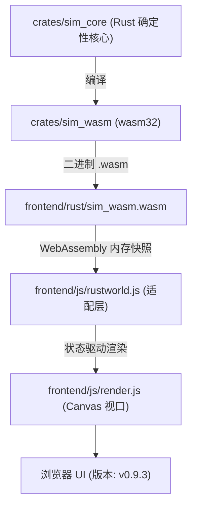

# Flow & Accord · 智能体与模拟系统操作指南 (AGENTS.md)

本文档记录了项目的工程架构、内置便携工具链配置、WASM 编译命令、测试套件验证与前端启动方法。

> ⚠️ **改代码前必读**：第 4 节「重要易踩坑清单」汇总了本项目最容易踩的坑（WASM 同步、决策节拍、随身搬运、快照三处同步、确定性约束等），由历次开发踩坑沉淀而来。
---

## 0. 📚 项目文档地图（所有 .md 的作用）

> 项目根目录共 6 个文档，定位各不相同。**记住一条铁律：CURRENT.md 描述"现状"，PLAN.md / ARCHITECTURE.md 描述"愿景"——别把愿景文档当现状读。**

| 文件 | 定位 | 何时读 / 维护 |
| :--- | :--- | :--- |
| **AGENTS.md**（本文档） | 智能体操作指南：架构概述、编译运行步骤、快捷键 + 第 4 节易踩坑清单 | **改任何代码前必读**；踩了新坑就往第 4 节补 |
| **CURRENT.md** | **已实现功能全景清单（当前实际状态）**：生态/四季/代谢/房屋/决策/前端特性全收录 | 想快速了解"现在到底有什么"时读；**改机制后必须同步更新**（数量、容量、节拍等） |
| **BUILD_GUIDE.md** | 编译与运行指南（面向 AI Agent 与开发者）：工具链、WASM 编译、测试、排障 | 构建/环境问题排查；与本文档第 2 节有重叠但更细。⚠️ 其目录树里提到的 frontend/js/agent.js、simulation.js 等 **JS 移植版文件已不存在**（见下方过时提醒） |
| **PLAN.md** | 项目计划书（宏观愿景）：空间自发生长、动态专利经济、混合政体、LLM 认知层、16 周排期 | 了解项目"未来想做成什么样"；**大部分内容尚未实现，勿当作当前功能** |
| **ARCHITECTURE.md** | 系统技术架构设计说明书（v1.0.0-Draft 愿景）：Rust 20Hz 无头核心 / 零拷贝快照桥接 / 60-120FPS 表现层 / LLM 认知总线 | 参考其分层设计理念；⚠️ 是**愿景架构**——当前实际是 30Hz 前端驱动 + WASM 快照 + 15-tick 错峰决策，LLM 层与 20Hz 核心均未实现 |
| **AGENT_AI_ANALYSIS.md** | Agent AI 逻辑架构分析报告：决策 FSM、加权 A*、踏路涌现、生命周期闭环的深度拆解 | 想深入理解部落民 AI 逻辑时读；⚠️ **部分结论已过时**（见下） |

### ⚠️ 过时结论提醒（避免被误导）

- **AGENT_AI_ANALYSIS.md 已过时的结论**：其报告称 *"agent.rs 字节级文件损坏、Rust 内核无法编译"*、*"JS 移植版是当前唯一可运行实现"*——这两条**均已过时**。当前 Rust 内核（crates/sim_core）编译正常并通过全部测试，是**唯一真实实现**（经 WASM 在浏览器运行）；frontend/js/ 下**不存在** agent.js / simulation.js / graph.js / house.js 等 JS 移植版，实际文件只有 math.js / rustworld.js / render.js / main.js。
- **BUILD_GUIDE.md 目录树同样列了不存在的 JS 移植版文件**，以实际 frontend/js/ 目录为准。
- **ARCHITECTURE.md / PLAN.md 中的 20Hz Tick、LLM 认知层、政治经济子系统均为愿景**：当前实现是确定性 Rust 生态模拟（30Hz 前端步进、每 tick 1/30 模拟秒、(tick+id)%15 错峰决策、21 处 POI、5 级房屋、随身行囊搬运），详见 CURRENT.md。


---

## 1. 项目架构概述

`Flow & Accord` 采用 **Rust 核心确定性计算 + WebAssembly 桥接 + Canvas 2D / 3D 前端可视化** 的三层解耦架构：



- **`crates/sim_core`**：核心决策状态机（马斯洛需求层级）、有限生态（水/粮/木/石/金）、空间路网寻路、私宅营建与升级演化；
- **`crates/sim_wasm`**：零依赖 WASM 导出层，负责线性内存 JSON 序列化与 tick 步进；
- **`frontend/`**：原生静态前端，内置 Node.js 开发服务器 `frontend/server.js`，支持 30fps 锁定帧率、动态 Inspector、马斯洛需求徽章与拓扑路网实时绘制。

---

## 2. 完整编译与运行步骤

### 🚀 步骤一：配置便携工具链并编译 WASM

本项目在根目录 `.toolchain/` 下内置了便携式 Rust 工具链，并在 `.cargo-home/` 中缓存了离线依赖。

在 Windows PowerShell 终端中执行以下命令（一键注入工具链路径、编译 release 版 WASM 并复制到前端）：

```powershell
# 1. 注入便携工具链环境变量并编译 WASM
$env:PATH = "$PWD\.toolchain\cargo\bin;$PWD\.toolchain\rustc\bin;$env:PATH"
$env:CARGO_HOME = "$PWD\.cargo-home"
cargo build -p sim_wasm --target wasm32-unknown-unknown --release

# 2. 将编译产物同步复制至前端目录
Copy-Item "target\wasm32-unknown-unknown\release\sim_wasm.wasm" -Destination "frontend\rust\sim_wasm.wasm" -Force
Copy-Item "target\wasm32-unknown-unknown\release\sim_wasm.wasm" -Destination "frontend\sim_wasm.wasm" -Force
```

---

### 🧪 步骤二：自动化回归测试验证

无需启动浏览器，可直接运行 Node.js 测试套件验证 WASM 导出、确定性及长程稳定性：

```powershell
node tools/test-wasm.js
```
> 输出 `ALL_TESTS_DONE` 即代表确定性测试、坐标防越界、数值防 NaN 校验 100% 通过。

---

### 🌐 步骤三：启动前端本地开发服务器

使用项目内置的静态服务器（原生自带 `.wasm` MIME 支持）：

```powershell
node frontend/server.js
```

服务将监听在 **`http://localhost:3000`**（若 3000 被占用会自动递增至 `3001`、`3002` 等）。

---

### 🖥️ 步骤四：浏览器访问与调试

1. 打开浏览器访问：`http://localhost:3000`（或 `http://localhost:3001`）；
2. **强制刷新**：每次重新编译 WASM 后，在浏览器中按下 **`Ctrl + F5`** 强制刷新以清理缓存；
3. **版本确认**：页面顶部标题栏右侧显示版本徽章 **`v0.9.3`**。

---

## 3. 核心快捷键与交互控制

| 操作 / 快捷键 | 功能说明 |
| :--- | :--- |
| **`Space` (空格键)** | 全局一键 **暂停 / 继续** 模拟运行 |
| **鼠标左键点击小人** | 选中部落民，右侧弹出 Inspector，展示**马斯洛当前主导需求、决策原因、饱食/水分/体力/负重** |
| **鼠标左键点击房屋** | 查看私宅等级、耐久度、私有水/粮/木/石/金仓储及家庭成员 |
| **鼠标左键点击地标** | 查看清泉/果丛/森林/采石场/金矿的当前储量与实时产速 |
| **鼠标滚轮 / 右键拖拽** | 缩放与平移地图画布视口 |
| **重置模拟 (顶部按钮)** | 重新播撒 12 名初始族人（带 $\pm 10$ 随机离散状态） |
---

## 4. ⚠️ 重要易踩坑清单 (Pitfalls)

> 以下坑均由实际开发踩过，**改任何代码前先对照本节**。按"最常踩 → 最隐蔽"排序。

### 4.1 🔴 WASM 编译与前端同步（最常踩）

- **改 Rust 内核（crates/sim_core / crates/sim_wasm）后，必须重编译 WASM 并复制到两个位置**，否则浏览器仍加载旧逻辑：
```powershell
$env:PATH = "$PWD\.toolchain\cargo\bin;$PWD\.toolchain\rustc\bin;$env:PATH"
$env:CARGO_HOME = "$PWD\.cargo-home"
cargo build -p sim_wasm --target wasm32-unknown-unknown --release
Copy-Item "target\wasm32-unknown-unknown\release\sim_wasm.wasm" -Destination "frontend\rust\sim_wasm.wasm" -Force
Copy-Item "target\wasm32-unknown-unknown\release\sim_wasm.wasm" -Destination "frontend\sim_wasm.wasm" -Force
```
  - **两个副本都必须更新**：frontend/rust/sim_wasm.wasm（前端 rustworld.js 实际 fetch 的路径）与 frontend/sim_wasm.wasm。
- **前端是纯静态文件**（index.html + style.css + js/*.js），无构建步骤，改完刷新即生效；不要起替代服务器（本项目唯一正确的静态服务器是 frontend/server.js；DSH 环境另有 dsh web 注入 window.__DSH_BOOT__，不要用 vite 替代）。
- **不要用 wasm 字节数判断是否更新**：不同构建可能字节完全相同（如 153570 → 153571 只差 1 字节）。以 node tools/test-wasm.js 的输出（pois 数量等）为准。
- 改完记得 bump index.html 顶部版本徽章（并同步本节第 2 步的版本引用），提醒用户 **Ctrl+F5 强刷**清理 wasm 缓存。

### 4.2 🔴 git push 在受限沙箱中必须提权

- msys 版 ssh.exe（Git for Windows 自带）在受限沙箱中会因**无法创建信号管道**崩溃（couldn't create signal pipe, Win32 error 5），导致 git push 失败。
- 正确做法：commit 后 push 时以 sandbox_permissions: "danger-full-access" 重试**同一条 push 命令**（这是沙箱规则允许的一次性提权重试，会弹出用户授权）。

### 4.3 🟠 文件编辑工具的坑（本环境特有）

- **edit 的 old_string 前导空格必须逐字符精确**：本项目 HTML/文档缩进是空格（如 index.html 缩进 10 空格而非 11）。不匹配时报 old_string was not found，但**偶尔会出现"已应用但报错"的诡异状态**——改完务必用 grep/read 复核实际内容。
- **最佳实践**：old_string 尽量用**不含前导空白的唯一片段**（如 <span ...>xxx</span>），避免空格数错误。
- run_code 程序内嵌模板字符串时，代码里的反引号需要转义，模板插值（美元符后跟花括号）也会被解析；超长字符串拆成变量再 join，避免解析器误判（或直接用 String.raw + 占位符方案）。
- 用 replace_all 前先 grep 确认替换范围（曾因 replace_all 误伤辅助函数自身的调用导致无限递归）。

### 4.4 🟠 决策节拍语义（行为核心，勿随意改）

- **时间基准**：每个引擎 tick = 1/30 模拟秒，30 tick = 1 模拟秒；前端 30fps 每帧调一次 sim.tick()，1x 倍速下 1 模拟秒 = 1 现实秒。
- **错峰决策**（当前实现）：world.tick() **每个 tick** 都调用 tick_decisions()；每个 agent 仅在 (tick_counter + agent.id) % 15 == 0 的相位上决策。每位小人平均仍每 15 tick 决策一次（1x 下 0.5s），但相位按 id 错开（id=1 在 tick 14/29/44…，id=2 在 tick 13/28/43…）。
  - **改回全体同步或改相位周期（15）时**，必须同步更新：decisions.rs 测试里的 decide_now 辅助（把 world.tick_counter = 14 拨到 id=1 的相位）、AGENT_AI_ANALYSIS.md 的节拍描述。
  - **单元测试直接调 tick_decisions() 前必须先拨 world.tick_counter**，否则目标 agent 不在相位上、不会被决策（会得到"没反应"的假失败）。
- **严禁修改 dt = 1/30**：倍速通过 world_tick_steps(N, 1/30) 同帧多步实现，改 dt 会数值发散（BUILD_GUIDE.md 同样强调）。
- **world.tick() 内部顺序（勿打乱）**：POI 再生 → 代谢/繁衍 → POI 交互(装载/卸货) → 房屋系统 → 决策 → 道路衰减 → 运动。卸货发生在决策**之前**，决策看到的是卸货后的仓库状态。
- **共享 RNG 的隐式耦合**：WorldRng 全局共享，按 agents 顺序依次消费；前一个小人的随机抽取影响后一个小人的结果。序列确定 → 确定性测试逐字节一致。**新增任何随机消耗都必须保持确定性**（种子化、固定顺序），否则 tools/test-wasm.js 的确定性断言失败。

### 4.5 🟠 随身搬运机制（勿改回瞬移）

- 当前是**真实随身搬运**（不是瞬移入仓）：
  - 💧水/🍒食/🌲木/🪨石：在资源点**只装入随身行囊**（每类独立容量 50.0，常量 CARRY_CAPACITY_RESOURCE，**互不共享**），回家休整（RestingAtCamp）时按 **10/s** 卸货存入家宅仓库；行囊满（≥50）即返家（decisions.rs 的水/粮/木/石判定）。
  - 🪙金：**容量无限**，单趟运满 20（gold_load_full）回宅存入金库（5/s）。
  - **无家宅**（home_house_id.is_none()）的 agent 不装载行囊（ecology.rs 里 agent_hid.is_some() 条件），只自饮自食。
- **改容量/装卸速率必须多处联动**：agent.rs 字段与常量 → ecology.rs 装载/卸货 → decisions.rs 满载判定 → snapshot.rs + world.rs 快照 → rustworld.js 映射 → render.js 的 CARRY_CAP_PER_ITEM / CARRY_TOTAL_CAP 显示常量。漏一处就会"显示不对"或"行为不对"。

### 4.6 🟠 快照与前端 id 的三处同步

- **给 agent/house/poi 新增字段**时，必须三处同步：snapshot.rs 的 Snapshot 结构体 → world.rs 的 generate_snapshot() → rustworld.js 的 _applySnapshot() 映射。漏一处前端字段就是 undefined。
- 前端 getElementById('...') 的每个 id 必须真实存在于 index.html（现有 100+ 个 id）。改完面板结构用脚本交叉校验：getElementById 引用集 ⊆ HTML id 集。

### 4.7 🟡 POI 数量与 id 段位

- 当前生态共 **21 处**：营地5(1-5)、清泉5(10-14)、浆果5(20-24)、林木3(30-32)、石矿2(40-41)、金矿1(50)。空间排斥间距 min_poi_distance = 68m。
- **改 POI 数量必须同步**：ecology.rs 的 seed_primitive_ecology 循环次数 → mod.rs 单元测试**两处**断言（world.pois.len() 与 snapshot.pois.len()）→ index.html 图例/全局面板文案（"N处"、"N处 POI"）→ CURRENT.md 表格。漏掉测试断言会导致 cargo test 红。

### 4.8 🟡 测试套件与硬断言

- 两套测试都跑：cargo test -p sim_core（原生单元测试，当前 13 个）+ node tools/test-wasm.js（对 frontend/rust/sim_wasm.wasm 做端到端验证）。
- test-wasm.js 的**硬断言**：开局 12 agents、同种子快照逐字节一致（确定性）、异种子结果不同。输出 ALL_TESTS_DONE 才可交付；agents/houses/births 等计数只是打印、不硬断言，随机制调整而变是正常的。

### 4.9 🟡 行为硬约束（改动时不要破坏）

- **冬季供暖**：冬季或气温 < 5°C 时，非 0 级有主房屋每秒消耗 0.12 木材（housing_system.rs）；家宅木材 < 10 时禁孕（is_fertility_active）。
- **0 级仓库不扣生活水粮**（ecology.rs RestingAtCamp 里 tier != Tier0Warehouse 才允许从仓库吃喝）。
- **房屋升级材料**：house.rs is_pantry_full()——0级需水粮各90%、1级需木85%+水粮50%、2级需石85%+木水粮50%、3级需金+石各85%+木水粮50%。
- **淘金纪律**：4 级大庄园竣工前绝不娱乐淘金（GoldWealth 仅 Tier4Manor 满仓后触发、180s 冷却）；盖房备料淘金 StockGold 为 45s 冷却。
- **镜头跟随**：选中小人后 isCameraFollow 开启，关闭选中窗口（✕/Esc）时需同时关闭跟随。

### 4.10 🟡 本地验证工具限制

- web_fetch 拒绝访问 localhost（非公网 IP）；本地 HTTP 验证用 PowerShell Invoke-WebRequest（如检查服务器是否下发最新 JS/WASM）。
- 前端服务器（node frontend/server.js）以后台 job 方式常驻，用户刷新页面即可；不要重复启动占用端口（会自动递增 3001/3002）。

