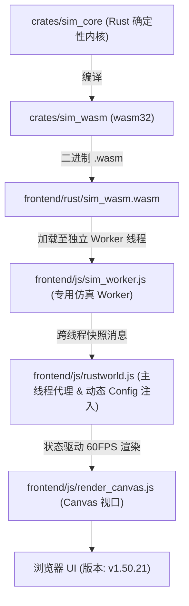

# Flow & Accord · 智能体与模拟系统开发操作指南 (AGENTS.md)

> ⚠️ **改代码前必读**：第 4 节「重要易踩坑清单」汇总了本项目最容易踩的坑（WASM 双向同步、决策节拍、随身搬运、POI 储量门槛、快照四处同步[M4]、确定性约束等），由历次开发踩坑沉淀而来。

---

## 0. 📚 项目文档地图

开发任务从 [Agent 快速入口](./docs/current/tech/30-workflow.md) 按改动类型选择局部指南和门禁；本文件仍为全局规则入口。

除根目录 **README.md**（对外营销宣传）、**AGENTS.md** 和 **TODO.md** 外，其余文档全部在 `docs/` 下，按
**当前 / 计划** 划分，每层再按 **产品设计 / 技术方案** 划分；**每个目录内文档按顺序从 `01` 起连续编号**
（各目录各自成序，编号本身不含层级语义）。`tech/` 内按
总体与基座 → 上层社会与经济 → 中层个体与行为 → 下层世界与物理 → 表现层 → 工程层 → 附录 分层排列。

| 文件 | 定位 | 何时阅读 |
| :--- | :--- | :--- |
| **README.md** | 面向玩家的营销宣传文档：项目定位、八大核心看点、第一局观察指引、三分钟上手、路线图 | 对外宣传 / 新玩家入门时 |
| **AGENTS.md**（本文档） | 架构概述、编译步骤、快捷键 + §4 易踩坑清单 + §5 文档分层策略 | **改任何代码前必读** |
| **`docs/README.md`** | 文档总导航（唯一入口） | 找文档时 |
| **./docs/current/README.md** | **现状总索引**：完整模块导航表 | 快速了解现状 |
| **`docs/current/design/`** | 现状 · 产品设计（玩家视角）：[01 产品总览](./docs/current/design/01-product-overview.md) · [02 世界与地图规则](./docs/current/design/02-world-rules.md) · [03 族人家庭与社会规则](./docs/current/design/03-life-and-society.md) · [04 经济与资源规则](./docs/current/design/04-economy.md) · [05 观察与交互设计](./docs/current/design/05-observation-ux.md) | 讨论玩法、规则与体验时 |
| **./docs/current/tech/01-engine-architecture.md** | 现状 · 技术总体：三层解耦、文档地图、tick 内部顺序、数据流、配置注入 | 入门架构 / 定位模块归属 |
| **./docs/current/tech/02-core-systems-fsm.md** | 三大核心系统状态机全景：马斯洛需求与动作、私产房屋与归宿拓扑、王国与帝国政体演化 | 查阅核心 FSM 与状态转移契约时 |
| **./docs/current/tech/11-decision-engine.md** | 决策引擎：马斯洛六层、18 条分支、私有触发器、错峰节拍（附「为什么这么设计」篇） | 理解决策状态机与寻路逻辑时 |
| **./docs/current/tech/12-m19-architecture.md** | M19 决策架构规格：意图/策略/原语三层解耦、ActiveTask 单一真相源 | 使用意图/策略/原语类型及观察 API 时 |
| **./docs/current/tech/07-ledger-and-polity.md** | 账本与政体（M1~M5 已落地） | 改动 ledger/ 代码时查阅 |
| **./docs/current/tech/28-invariants.md** · [29 影响矩阵](./docs/current/tech/29-impact-matrix.md) | 六类硬约束集中清单 · 改 X 牵动哪些文件 | 改动前对照 |
| **./docs/current/tech/30-workflow.md** | Agent 快速入口 + Commit 检查单 + 文档维护机制 | **提交前必读** |
| **./docs/current/tech/22-build-and-run.md** · [24 无头诊断](./docs/current/tech/24-diagnostics.md) · [25 性能基准](./docs/current/tech/25-benchmarking.md) · [26 CI/CD](./docs/current/tech/26-cicd.md) · [27 浏览器自动化](./docs/current/tech/27-browser-automation.md) · [23 工具箱](./docs/current/tech/23-tools-guide.md) | 工程层：构建 / 诊断 / 基准 / 部署 / 自动化 / 工具速查 | 排障、优化、部署、自动化时 |
| **./docs/current/tech/19-ui-implementation.md** · [20 制度大盘 UI](./docs/current/tech/20-society-ledger-ui.md) · [21 前端开发指南](./docs/current/tech/21-frontend-dev-guide.md) | 表现层：页面全景 + 窗口跳转 · 制度大盘 4 标签页 · 前端实施指南 | 开发新 UI 模块时 |
| **./docs/plan/README.md** | **计划总索引**：在办设计与未落地方案 + 依赖顺序图 | 了解未来方向时 |
| **./docs/plan/design/01-roadmap.md** | 长期规划书（M10~M18：空间演化 / 专利经济 / 混合政体 / LLM 认知层） | 了解宏观方向（多为规划态） |
| **`docs/plan/tech/`** | 计划 · 技术方案：[01 融合契约](./docs/plan/tech/01-integration-contracts.md) · [02 记忆](./docs/plan/tech/02-memory-system.md) · [03 内部市场](./docs/plan/tech/03-internal-market.md) · [04 农田](./docs/plan/tech/04-farmland-agriculture.md) · [05 狩猎防御](./docs/plan/tech/05-hunting-defense.md) · [06 地图模板](./docs/plan/tech/06-terrain-templates.md) · [07 地形美术](./docs/plan/tech/07-terrain-art.md) · [08 性能优化](./docs/plan/tech/08-performance.md) | 设计未落地方案时 |
| **`docs/archive/`** | 已完成或被替代的历史设计稿（[08 决策可视化](docs/archive/08-decision-viz-design.md) / [10 架构愿景](docs/archive/10-architecture.md) / [12 账本重构](docs/archive/12-plan-ledger-refactor.md) / [13 房屋拍卖](docs/archive/13-plan-house-upgrade-auction.md) / [14 v1.27 待办](docs/archive/14-plan-todo-followup-v1.27.md) / [19 M19 基线审计](docs/archive/19-m19-baseline-audit.md)） | 仅追溯，不作开发入口 |
| **TODO.md** | 待办事项清单 | 开发新特性前 |

### 0.1 📑 嵌套 AGENTS.md（目录级操作指南）

每个复杂代码目录维护一份局部 AGENTS.md，聚焦职责边界、文件清单与局部易踩坑。**改哪个目录的代码，先读对应局部 AGENTS.md**；全局规则以根 AGENTS.md 为准，冲突时以根文档为准。

| 目录 | 局部 AGENTS.md | 覆盖范围 |
| :--- | :--- | :--- |
| `crates/sim_core/` | `crates/sim_core/AGENTS.md` | sim_core 内核：crate 布局、SimConfig、WorldRng 确定性、geo/spatial 模块地图 |
| `crates/sim_wasm/` | `crates/sim_wasm/AGENTS.md` | WASM 导出层：导出函数清单、静态缓冲区、错误码、指针约定 |
| `crates/sim_core/src/spatial/` | `crates/sim_core/src/spatial/AGENTS.md` | spatial 核心层：13 散文件 + 4 子目录职责边界、world.rs tick 调用顺序、agent↔ecology 装载卸货契约、bookkeeping 与 ledger 分工、快照映射责任 |
| `crates/sim_core/src/geo/` | `crates/sim_core/src/geo/AGENTS.md` | geo 地形生成：terrain/hydrology/biome/query/corridor/accents 6 文件职责、generate_with_profile vs generate_with_config 调用链、RNG 隔离 |
| `crates/sim_core/src/spatial/ecology/` | `crates/sim_core/src/spatial/ecology/AGENTS.md` | 生态子模块：7 个单一职责子模块（播撒/落位/始祖/调度/采收/卸货）、RNG 消费顺序契约、榷场支付顺序 |
| `crates/sim_core/src/spatial/decisions/` | `crates/sim_core/src/spatial/decisions/AGENTS.md` | 决策状态机：马斯洛评估、节拍语义、私有施密特触发器、途中重路由、立宅选址 |
| `crates/sim_core/src/spatial/housing_system/` | `crates/sim_core/src/spatial/housing_system/AGENTS.md` | 房屋系统：6 个单一职责子模块、升级门槛、三条自主决策链路 |
| `crates/sim_core/src/spatial/ledger/` | `crates/sim_core/src/spatial/ledger/AGENTS.md` | 独立经济账本子系统：账本内核、团体基类、婚姻登记簿、家户体系（家庭跟着男人走）、宗族（M3）、地区王国（M4） |
| `frontend/` | `frontend/AGENTS.md` | 原生静态前端：31 JS 文件职责边界（含 M4 `snapshot-bin.js`）、脚本加载顺序、渲染管线数据流、DOM ID 共享契约、决策三件套/族谱四件套/制度大盘分工、wasm 接口对照 |

**维护规则**：新增或重构出复杂目录时应同步补充局部 AGENTS.md 并登记到本表；局部文档引用的类型/方法改名后必须同步修订。

---

## 1. 项目架构概述

**Rust 确定性计算内核 + WebAssembly 桥接 + Canvas 前端可视化** 三层解耦：



- **`crates/sim_core`**：决策状态机、生态采收与随身搬运、路网寻路、私宅营建与空置房登记、经济账本；
- **`crates/sim_wasm`**：零依赖 WASM 导出层，线性内存 JSON 序列化 + ★ M4 FABS 二进制帧快照、tick 步进、JS 动态配置注入；
- **`frontend/`**：原生静态前端（31 个 JS 文件，含 Web Worker 仿真线程 `sim_worker.js` 与 M4 二进制解码器 `snapshot-bin.js`），内置 `server.js` 开发服务器。数字配置抽离在 `config.js`，无需重编译即可调参。

---

## 2. 编译与运行步骤

> 详细环境配置与故障排查见 `./docs/current/tech/22-build-and-run.md`。

### 步骤一：编译 WASM 并双副本同步

```powershell
# 注入便携工具链
$env:PATH = "$PWD\.toolchain\cargo\bin;$PWD\.toolchain\rustc\bin;$env:PATH"
$env:CARGO_HOME = "$PWD\.cargo-home"
cargo build -p sim_wasm --target wasm32-unknown-unknown --release

# 双副本复制（缺一不可，见 §4.1）
Copy-Item "target\wasm32-unknown-unknown\release\sim_wasm.wasm" -Destination "frontend\rust\sim_wasm.wasm" -Force
Copy-Item "target\wasm32-unknown-unknown\release\sim_wasm.wasm" -Destination "frontend\sim_wasm.wasm" -Force
```

### 步骤二：回归测试验证

```powershell
cargo test --lib                  # 编译校验（源码无持久化单元测试，见 §4.10）
node tools/test-wasm.js           # WASM 确定性/防越界/防 NaN/长程稳定
node tools/test-determinism.js    # 增强型确定性矩阵测试 (6套件：多种子/分批独立性/快照无副作用/存读档)
node tools/config-check.js        # 前后端数值配置一致性校验
node tools/frontend-check.js      # 前端脚本语法与 DOM ID 完整性校验
node tools/doc-link-check.js      # Markdown 相对链接可达性（文档迁移后路径深度未同步即报错）
node tools/cross-doc-check.js     # 跨文档事实指纹一致性校验
node tools/code-map-check.js      # 代码地图与文件树登记一致性校验
```

输出 `ALL_TESTS_DONE` 与 `确定性矩阵测试全通` 即全部通过。性能分析可运行 `node tools/profile-benchmark.js`。

### 步骤三：启动前端服务器

```powershell
node frontend/server.js           # http://localhost:3000
```

> ⚠️ 若 3000 端口已被占用，说明服务已在运行，**无需再启动新实例**——直接访问即可。重复启动会触发端口递增逻辑的已知问题导致卡死。

### 步骤四：浏览器访问

> ⚠️ **必须使用 Chrome 或 Edge**：本地文件存档依赖 **File System Access API**（`showSaveFilePicker` / `showOpenFilePicker`，详见 `./docs/current/tech/06-snapshot-and-save.md` §4.2.1）。Firefox / Safari / CatPaw 内置预览浏览器均不支持——**启动存档门禁会一直阻断模拟（“先建立本地存档文件”弹窗无法关闭）**。能用 Chrome 测试必须优先用 Chrome 测试。

1. 访问 `http://localhost:3000`；
2. 每次重编译 WASM 后按 **`Ctrl + F5`** 强制刷新清缓存；
3. 页面顶部标题栏右侧显示版本徽章 **`v1.50.21`**。

---

## 3. 核心快捷键与交互

| 操作 | 功能 |
| :--- | :--- |
| **`Space`** | 全局暂停 / 继续模拟 |
| **鼠标左键点击小人** | 选中族人，右侧 Inspector 展示马斯洛主导需求、决策原因、饱食/水分/体力/行囊 |
| **鼠标左键点击房屋** | 查看私宅等级、耐久度、仓储及家庭成员 |
| **鼠标左键点击地标** | 查看清泉/果丛/森林/采石场/金矿/榷场互市的储量与产速/单价 |
| **鼠标滚轮 / 右键拖拽** | 缩放与平移视口 |
| **重置模拟（顶部按钮）** | 重新播撒 20 名初始族人（10 男 10 女，±10 随机离散） |

---

## 4. ⚠️ 重要易踩坑清单

> 以下坑均由实际开发沉淀，**改动代码前先对照本节**。按"最常踩 → 最隐蔽"排序。实现细节见对应模块文档与嵌套 AGENTS.md。

> 🔴 **浏览器测试铁律**：本项目存档依赖 **Chrome 的 File System Access API**（直写磁盘 `.json`，启动存档门禁未建立存档前模拟一直暂停）。一切浏览器验证（手动或自动化）**能用 Chrome 测试必须优先用 Chrome 测试**；Firefox / Safari / CatPaw 内置预览浏览器只能做纯视觉截图，无法走通存档与模拟推进链路。

### 4.0 ✅ 改动前快速自检（10 秒扫完）

> 详细版（含影响面说明）见 [`./docs/current/tech/29-impact-matrix.md` §五](./docs/current/tech/29-impact-matrix.md)。

```
□ 版本号：node tools/bump-version.js --patch（自动同步 index.html / SAVE_APP_VERSION / 文档全部定义点，见 §4.9；仅文档变更可跳过，见 §4.0.1）
□ 双副本：Rust 变更后 sim_wasm.wasm 已复制到 frontend/rust/ + frontend/
□ 四处同步（M4）：快照字段变更时 snapshot.rs / world.rs / snapshot_bin/encode.rs / rustworld.js+snapshot-bin.js 一致（防漂移门禁：node tools/test-snapshot-bin.js）
□ 跨世界缓存：改动驻留表/STR_TAB 或新增 world_create 调用点时，缓存失效判据仍为 start_index==0（见 §4.5.1，勿改用 epoch）
□ 配置联动：新增超参时 config.rs(const/字段/Default) + config.js + config-check.js 通过
□ 测试门禁：cargo build + test-wasm.js + config-check.js + frontend-check.js 全绿
□ 文档更新：对应 docs/current/ 下对应模块文档 + ./docs/current/01-changelog.md + 受影响的局部 AGENTS.md
□ 文档维护体检：node tools/doc-maintenance-check.js（发布前追加 --strict）
□ 跨文档一致性：node tools/cross-doc-check.js（文档间冲突 / 配置权威漂移）
□ 文档链接可达：node tools/doc-link-check.js（相对链接失效即退出码 1；docs/archive/ 已按冻结策略排除）
```

### 4.0.1 ✅ Commit 前检查单（提交前必做）

详细清单已拆分至 [`./docs/current/tech/30-workflow.md`](./docs/current/tech/30-workflow.md)。准备 `git commit` 时必须执行该清单：所有提交先做工作区、diff 和文档维护体检；命中 Rust/WASM、前端、配置或行为机制改动时，再执行对应专项门禁。

**最低标准**：基础项全部通过，专项项按改动类型通过；发布或 CI 追加 `node tools/doc-maintenance-check.js --strict`。未执行的门禁必须在提交说明或 PR 中注明原因。

**⚡ 仅文档变更例外（纯文档提交）**：若 diff 只涉及 `docs/`、根/局部 `AGENTS.md` 等纯文档内容（**不含** Rust / 前端 / 配置 / 版本号定义点等任何代码或行为/契约改动），则 commit 时**不需要升版**（跳过 `bump-version.js --patch/--minor`）也**不需要重跑任何测试门禁**（`cargo build/test`、`test-wasm.js`、`config-check.js`、`frontend-check.js`、`test-snapshot-bin.js`、`diagnose.js --check all` 等）。此时只需：① 工作区/diff 检查；② `node tools/doc-maintenance-check.js` 通过；③ `node tools/cross-doc-check.js` 无文档间冲突/权威漂移；④ `node tools/bump-version.js --check` 零漂移（纯一致性校验，非升版）。详细清单见 [`./docs/current/tech/30-workflow.md`](./docs/current/tech/30-workflow.md) §G。

### 4.1 🔴 WASM 编译与双副本同步（最常踩）

改 Rust 内核后必须重编译并复制到**两个位置**，否则浏览器仍加载旧逻辑：
- 副本 1：`frontend/rust/sim_wasm.wasm`（`rustworld.js` 实际 fetch 的主路径）
- 副本 2：`frontend/sim_wasm.wasm`（根目录静态备用）

**不要用 wasm 字节数判断是否更新**——以 `node tools/test-wasm.js` 实际输出为准。前端是纯静态文件，改完刷新即生效，切勿用外部 vite/webpack 替代内置 `server.js`。

### 4.2 🔴 寻路决策门槛、连续采收与中途重路由

- **Agent 私有 POI 施密特触发器**：开启 ≥ `config.decisionPoiSeekMinStockRatio`(0.50) / 关闭 < `config.decisionPoiAbandonStockRatio`(0.10) / 中间带保持前态。每名 Agent 维护私有锁存，相同 POI 可被不同 Agent 判为不同可用性；路由与重路由只读取触发器结论。
- **连续采收**：现场采收时若目标触发器已关闭但行囊未满且家宅仍需，自动前往下一处自身触发器已开放的同类 POI，避免提前返家。
- **★ v1.35.0 单趟多品类连续采收**：现场采收某品类完成（装满、家宅补足或断流）后，若族人拥有私宅且体力 ≥ `config.decision_work_stamina_threshold`，由马斯洛引擎按当前编排顺序依次检索家宅短缺的其他品类（`b5/b6/b7/b9/b10`，分支内置行囊余量自检），有需求且行囊有空余则直接派发前往下一处 POI 继续采收，实现单趟出门连续多品类满载回宅；无短缺或体力不足时平滑返家。
- **中途断流熔断与平滑重路由**：途中检测自身对目标的触发器关闭时，若有其他已开放同类 POI，立即原地掉头并重新规划路径；仅在无可用点或体力告警时折返。**严禁闪现瞬移**——掉头必须在当前车道反向平滑回走，保持坐标连续性。
- **★ v1.27.0 / v1.36.0 断流直达榷场**：**水/粮/木**采集链路断流（无任何同类可用 POI）时，家户户主若家户账本金币 ≥ `config.market_min_family_gold` 且体力 ≥ `config.decision_work_stamina_threshold`，可直接原地掉头赴最近榷场交易——市场支付用家户账本**远程结算**（`try_route_to_market`，不要求随身携带金币）；石/金采集不享受该兜底。
- **★ v1.40.3 / v1.43.0 A\* 局部失效与 APSP 静态查表 (M3 优化)**：A\* 寻路通过 `LaneEdge3D::wear_tier_bucket` 量化道路踩踏加成（0.50x~2.20x）。在 v1.43.0 (M3) 中：① **衰减局部失效**：自然衰减只会增加成本，因此 `tick_wear_decay` 仅对包含跌落车道的路径定向失效，未涉车道路径严格保持最优；② **踩踏几何剪枝**：车道踩踏跃迁仅基于三角不等式失效受影响范围内的路径，消除全图击穿；③ **全源静态查表 (APSP Table)**：未发生踩踏或远端拓扑直接查表获取，全内核吞吐达 97,792 TPS。
- 实现细节见 `decisions/AGENTS.md` 与 `./docs/current/tech/11-decision-engine.md`。

### 4.3 🟠 决策节拍语义（行为核心，勿随意改）

- **时间基准**：每 tick = `config.simulationDt`(1/60) 游戏小时，`config.agentDecisionIntervalTicks`(120) tick = 2 游戏小时；在 1x 基础倍速下，现实 1 秒 = 游戏内 1 小时。仿真由独立 Web Worker `sim_worker.js` 驱动（约 60Hz 心跳步进）。
- **错峰决策**：每个 agent 仅在 `(tick_counter + agent.id) % 120 == 0` 的相位上决策，全员相位均摊错开。
- **严禁修改 `config.simulationDt`**：基准恒为 1/60 游戏小时，倍速通过 `world_tick_steps(N, dt)` 同帧多步实现，改动 dt 会导致数值积分发散。
- **`world.tick()` 内部顺序（勿打乱）**：POI 再生 → 代谢/繁衍 → POI 交互(装载/卸货入账) → 房屋系统 → 道路衰减 → 运动 → 决策及提交结算 → 账本 → 清理。卸货入账在决策之前，决策读到的是卸货后的**家户账本**余额（M6 起决策读账本，不再读房屋仓库）。
- **共享 RNG 确定性**：`WorldRng` 全局共享，按 agents 顺序依次消费。新增任何随机消耗必须保持确定性，否则同种子逐字节一致性校验失败。
- **⓪ 瞬间行为通道**：每名 agent 在自己的决策相位最前运行 `arbitrate_instant_needs`，覆盖 b8 在宅改善、b16 近距求偶、b17 竞购住宅、b18 在宅生育。瞬发只提交或安装当拍可结算事务，不规划移动；b8 若人在异地仍是“返宅改善”的持续任务。需求层级与执行是否瞬发是两个维度。

### 4.4 🟠 随身搬运机制（真实背包，非瞬移）

- 水/粮/木/石：在资源点**只装入随身行囊**（每类独立容量 `config.carryCapacityResource`(100.0)，互不共享），回家休整时按 `config.poiUnloadRateResource`/s(10) 卸货**入家户账本**（M6 起：家户账本为家庭储备唯一真相源，房屋仓库已删除）；行囊满即返家。
- 金：容量无限，单趟运满 20 回宅存入金库（5/s）。
- 无家宅（`home_house_id.is_none()`）的 agent 不装载行囊，只在现场就地自饮自食。
- 改容量/装卸速率必须全链条联动：`agent.rs` → `ecology/` → `decisions/` → `snapshot.rs` → `rustworld.js` → `render.js`。

### 4.5 🟠 快照与前端字段四处同步（★ M4 起，v1.45.3）

给 agent/house/poi 新增字段时，必须**四处**同步：
1. `crates/sim_core/src/spatial/snapshot.rs`（快照结构体定义）
2. `crates/sim_core/src/spatial/world.rs`（`generate_snapshot()` JSON 赋值）
3. `crates/sim_core/src/spatial/snapshot_bin/encode.rs`（**M4 FABS 二进制编码**，字段顺序/枚举码位与 1、2 等价）
4. `frontend/js/snapshot-bin.js`（二进制解码，产物与 JSON 同构）+ `frontend/js/rustworld.js`（`_applySnapshot()` 映射）

**M4 二进制快照要点**：快照主链路已从「JSON 字符串 + `JSON.parse`」改为「FABS 定长二进制帧 + TypedArray 直读」（见 `./docs/plan/tech/08-performance.md` M4 与 `crates/sim_core/src/spatial/snapshot_bin/`）；路网几何/地形按版本号增量下发；枚举名称表由 `world_enum_table_ptr/len` 从 Rust `as_str()` 生成（新增枚举变体必须同步 `snapshot_bin/dict.rs` 的 `*_code()`/`*_table()`）；防漂移自动网 = `node tools/test-snapshot-bin.js`。★ T1（v1.46.0）：JSON 快照通道已从生产与工具链路移除 —— `tools/` 全部工具统一走 `tools/snapshot-reader.js`（FABS 优先），前端 `sim_worker.js` 删除 JSON 回退；`crates/sim_wasm` 仅保留 **test-only** 的 `world_snapshot_json_debug_ptr/len`（仅供 `test-snapshot-bin.js` 做真值比对，**禁止**其它任何代码调用）。前端 DOM ID 必须与 `render.js` / `main.js` 中的 `getElementById` 完全匹配。

### 4.5.1 🔴 跨世界必须让驻留表缓存失效（★ T1 缺陷修复，v1.46.0）

FABS 的**字符串驻留表（`STR_TAB`）在前端解码器里永久缓存**（`snapshot-bin.js` 的 `_strCache`），靠增量 `start_index` 续喂。判定"这是不是一张全新的驻留表"的**唯一正确判据是 `STR_TAB.start_index == 0`**：

- ❌ **不能用 `epoch` 判断换世界**——`StrTab::new()` 的 `epoch` 对任何新世界 / 读档重建都从 `0` 起步，恒为 0，用它做判据会**继续复用上一个世界的 `strid → string` 映射**，表现为重置模拟后地名/人名全部串味（`test-wasm` 的 `SAVE_LOAD_DETERMINISM_FAILED` 就是这样暴露的）。
- ❌ **也不能改成"全局单调递增 epoch"**——那会让同种子两个世界的帧字节不再相等，直接击穿确定性矩阵。
- ✅ 工具侧（`snapshot-reader.js`）在 `world_load` / `world_create` 之后必须显式 `reader.resetCaches()`；浏览器侧由 `start_index == 0` 自动清空。

回归门禁 = `node tools/test-snapshot-bin.js` 场景 **[4/4] 换世界后**（去掉修复会报 129 处不一致）。

### 4.6 🟠 模块粒度与单文件行数规范

单文件严控在 800 行以内，功能膨胀时及时子目录模块化拆分。参考实践：`decisions/` 拆为 7 个文件、`housing_system/` 拆为 6 个文件、`ecology/` 拆为 7 个文件（原 1107 行单文件）。

### 4.7 🟡 POI 数量、ID 段位与营地行政区升级

- **共 23 处 POI**：营地 4 / 清泉 6 / 浆果 6 / 林木 3 / 石矿 2 / 金矿 1 / 榷场互市 1，由 `config.countCamps` 等字段控制。ID 段位：营地 1-4 / 清泉 10-15 / 浆果 20-25 / 林木 30-32 / 石矿 40-41 / 金矿 50 / 榷场互市 60。空间排斥间距 `config.poiMinDistance`(70m)。
- **营地行政区升级**：随辖内有效房屋数量自动升级——0~4 营地 / 5~9 村 / 10~14 乡 / 15~19 镇 / 20+ 县；门槛由 `campLevel*MinHouses` 配置。
- 改 POI 数量须同步：`ecology/` → `index.html` 面板文案 → `./docs/current/tech/08-ecology-and-poi.md`。

### 4.8 🟡 行为与生理硬约束

- **冬季供暖**：气温 < `config.houseWinterColdTemp`(8℃) 时（不再固定冬季消耗，低于阈值即烧），非 0 级有主房屋每秒消耗 `config.houseWinterWoodBurnRate`(0.12) 木材；家宅木材 < 10 时禁孕。
- **家庭储备 = 家户账本（M6 起）**：`House.pantry_*`/仓储容量已删除，吃喝、冬季烧柴全部从**家户账本真实扣减**（账本余额即家庭实有物资，无容量上限）。
- **去采货 = 施密特触发器（M7 起）**：有房（含 0 级）即可采，与房屋等级**彻底脱钩**——每类资源（水/粮/木/石/金统一）家户账本余额 < `decisionFamilyStockTriggerOn`(100) 触发去采，补到 ≥ `decisionFamilyStockTriggerOff`(200) 才停（滞回带）。无房者不触发补货、现场只自用不装袋。
- **升级成本 = 4×5 固定矩阵（M8 起）**：`needs::upgrade_material_cost` 单一真相源，数值来自 **20 个超参**（`config.house-upgrade-cost.js` 的 `houseUpgradeCostTier{1..4}{Water,Food,Wood,Stone,Gold}`，权威默认值三处同步于 `config.rs`）——升到 1 级水粮各 50、2 级木粮水各 75、3 级石木粮水各 100、4 级金石木粮水各 125。统一 b8「改善住宅」覆盖全部等级；在宅瞬发结算，异地先返宅，升级时一次性扣账并令户主威望 +1。
- **生育住宅门槛（★ v1.28.0 重新挂钩房屋等级）**：生育后代由男性户主在 `B18RaiseChild` 分支自主发起，除「已婚、妻子身体指标达标、流产冷却（450s）与产后休养冷却（900s，分娩后触发）均结束」外，**男方（户主）名下须有 ≥1 级私宅**（`tier != Tier0Warehouse`，0 级仓库与无房者不生育）；判定只写在分支内部（`d.houses.iter().any(|h| h.owner_id == Some(a.id) && ...)`），符合 §4.14 分支自包含铁律。
- **资金采集纪律**：4 级大庄园竣工前不触发 `B13AccumWealth`（积累财富，`GoldWealth` 冷却 180s）；家户资金补给由 `B10StockGold`（储备资金，`StockGold` 冷却 45s）负责。
- **镜头跟随**：选中小人后 `isCameraFollow` 开启，关闭 Inspector（✕ 或 Esc）时必须同时关闭跟随。

### 4.9 🟢 版本号自增规范（每次 AI 修改代码必改）

每次 AI 修改代码（Rust 内核、前端 JS/CSS/HTML、文档配置）都必须自增版本号。**严禁手工改版本号**——一律使用统一升版器，一次命令同步全部定义点：

> ⚡ **仅文档变更例外**：diff 只涉及纯文档（`docs/`、根/局部 `AGENTS.md` 内容，不含代码/配置/版本号定义点）时**不升版、不重跑测试**，只需 `doc-maintenance-check` 通过 + `bump-version.js --check` 零漂移（见 §4.0.1 与 `./docs/current/tech/30-workflow.md` §G）。升版只针对会改变行为、契约或版本定义点本身的改动。

```powershell
node tools/bump-version.js --patch          # 默认：1.44.1 → 1.44.2
node tools/bump-version.js --minor          # 1.44.1 → 1.45.0
node tools/bump-version.js 1.45.0           # 指定版本
node tools/bump-version.js --check          # 只校验一致性（漂移即 exit 1，CI / 提交门禁）
```

**唯一真相源** = `frontend/index.html` 的版本徽章（`.version-tag`）。升版器自动同步的全部定义点（清单维护在 `tools/bump-version.js` 的 `SITES`）：

| 定义点 | 说明 |
| :--- | :--- |
| `frontend/index.html` 徽章 | 唯一真相源（玩家可见） |
| `crates/sim_core/src/spatial/world_save.rs` `SAVE_APP_VERSION` | **存档应用版本门禁**，编译进 WASM；经 `world_app_version_ptr` 回传前端 |
| `frontend/js/save-ui.js` `DEFAULT_APP_VERSION` | 引擎未就绪时的版本兜底 |
| `frontend/js/rustworld.js` 版本兜底串 | Worker READY 前的 `getAppVersion()` 返回值 |
| `frontend/js/sim_worker.js` 版本兜底串 | Worker 侧 `world_app_version_*` 不可用时的返回值 |
| `AGENTS.md` §1 Mermaid + §2 步骤四 | 本文档 |
| `./docs/current/README.md` 版本行 / `docs/current/01-changelog.md` 表头 | 现状文档 |
| `./docs/current/tech/06-snapshot-and-save.md` 存档版本说明 | 存档模块文档 |
| `README.md` 版本徽章 | 对外宣传文档 |

**升版后必做**：
1. 若 `world_save.rs` 变更（几乎每次都会），必须重编译 WASM 并同步双副本（§4.1）——否则浏览器里仍是旧版本常量，存档门禁失效；
2. `SAVE_APP_VERSION` 变更会**自动废弃全部旧存档**（v1.37.1 起的设计行为，见 `./docs/current/tech/06-snapshot-and-save.md`）；
3. 在 `docs/current/01-changelog.md` 追加该版本条目（表头已由升版器自动更新，正文条目需手写）；
4. 跑 `node tools/bump-version.js --check` 确认零漂移。

> ⚠️ `SAVE_FORMAT_VERSION`（存档**结构**版本，当前 4）**不随应用版本自增**，仅在 `WorldSave` 字段增删/不兼容变更时手工 +1，且必须同改 `world_save.rs` 与 `save-ui.js`。

> 🔤 **版本字符串格式铁律**：内核 `SAVE_APP_VERSION` 与存档 `app_version` **无 `v` 前缀**（`1.44.2`），`v` 只在 UI 文案里拼接显示。前端任何兜底串（`rustworld.js` / `sim_worker.js`）必须与内核同格式；新增版本比较点必须先过 `save-ui.js::normalizeVer()`，且废弃决策前 `await waitEngineReady()`——否则会重演 v1.44.2 事故（同版本被误判旧档、点「废弃」反而读回旧档）。

### 4.10 🟢 混沌系统定位与测试策略（持久化测试禁令）

- **项目定位**：确定性内核驱动多智能体在代际、社会、经济维度涌现不可预测的长期演化。短期单元测试无法评价功能正确性——固定断言既测不出涌现，还可能锁死演化多样性。
- **持久化测试禁令**：不持久化保存任何单元测试脚本（`#[cfg(test)]` / `tests.rs` 等一律不进入提交）。当前源码无测试用例是有意结果，非缺失。
- **临时验证流程**：开发新功能时可临时编写单元测试/调试断言跑一遍，确认功能不崩溃、核心数值合理；验证通过后提交前删除，保持仓库清洁。
- **长期验证**：`node tools/test-wasm.js`（同种子逐字节一致性、防越界、防 NaN、长程稳定）是唯一长期保留的自动化验证。

### 4.11 🏠 建房/升级/修缮均为 Agent 自主决策（严禁系统扫描指挥）

- **设计原则**：系统只当"物理规则执行者"（放置校验 / 路网接入 / 施工计时 / 竣工扩容），一切"盖不盖、何时盖、在哪盖"必须来自 agent 自己的 `arbitrate_sustained_task` 输出。**严禁**引入扫描全图并强制改写 `agent.state` 的指挥式逻辑。
- **三条自主触发链路**：
  - **立宅**：`NeedKind::FoundHome`——**生理层最后一档**（在解渴/觅食/体力休养之后），无家成年男性且饥渴/体力达标时必然触发，agent 自主掷候选点选址，系统仅做放置校验与实体化绑定；
  - **升级施工（M6 瞬时化）**：`NeedKind::BuildHouse`——家户账本建材达标即由决策自主触发，系统**一次性扣账并瞬时晋升**（无体力、无工时），每晋升一级户主威望 +1；
  - **修缮**：`NeedKind::RepairHouse`——耐久 < 50% 时户主/配偶自主触发，系统仅结算修缮进度。
- **已删除的旧扫描器（勿复活）**：`tick_warehouse_founding`、`check_start_house_upgrades`、修缮强制切换扫描块。
- 详见 `housing_system/AGENTS.md`。

### 4.11.1 🧠 马斯洛引擎是唯一任务分派入口（严禁强制状态执行）

- **唯一入口**：任何“去哪里/做什么”的 Agent 任务，必须来自 `Decisioner::arbitrate_sustained_task` → `dispatch_task`；系统 tick、生态层、房屋层和账本层不得扫描 Agent 并直接摊派 `Seeking*`、`ReturningToCamp`、`ConstructingHouse` 等行动状态。
- **状态执行边界**：决策器的途中熔断只能执行当前马斯洛层级允许的降级；临界口渴/饥饿等更高优先级生理需求不得被普通疲劳阈值强制改写为回家休息。
- **物理结算例外**：系统只结算 Agent 已写下的 pending 意图（如立宅、升级、成婚、受孕、登基），不得借结算流程生成新的任务或覆盖当前需求优先级。
- **新增分支/熔断审计**：必须证明任意决策顺序下语义仍由分支自包含条件决定；禁止在分支外新增“看到某状态就强制切换”的旁路指挥逻辑。

### 4.12 🔧 超参集中化、配置校验与速查表

- **超参唯一入口**：全部 **200** 个 `SimConfig` 字段统一由 `frontend/js/config.js` **及拆分配置**（`config.house-upgrade-cost.js` / `config.decision-order.js`）驱动，经 `rustworld.js::applyConfig` 反序列化注入内核；Rust 逻辑层一律通过 `self.config.<字段>` 引用，**禁止**散落字面量。新增超参须在 `config.rs` 同时出现于「命名 `const`（默认值唯一真相源）+ `SimConfig` 字段 + `Default` 映射」三处。
- **拆分文件规范（v1.6.0 起）**：字段较多/独立语义的配置组可拆到独立 JS 文件（先例：`config.house-upgrade-cost.js` 挂 `window.SIM_HOUSE_UPGRADE_COST`、`config.decision-order.js` 挂 `window.SIM_DECISION_ORDER`），须满足：① `index.html` 加载顺序早于 `rustworld.js`；② `rustworld.js::applyConfig` 用 `Object.assign` 合并进注入对象；③ **同步改造** `tools/config-check.js`（纳入前端字段集比对）与 `tools/test-wasm.js`（合并注入），否则门禁报"缺失字段/0 成本"。
- **文档化例外（v1.3.6 起）**：`decisionEvalOrder: Vec<String>` 与 `decisionEvalLevels: Vec<u8>` 是**「Rust 无顺序」字段**——Rust 默认为空 Vec，权威值只存在于前端 `frontend/js/config.decision-order.js`（启动时合并进 `SIM_CONFIG`）。**严禁**在 Rust 侧写死任何策展优先级序列（`branches.rs::BranchId::ALL` 仅为配置缺失/非法时的中性兜底序）。
- **调参流程**：直接编辑 `config.js`，浏览器 `Ctrl+F5` 强刷即生效；改后运行 `node tools/config-check.js` 校验前后端一致性。
- **一致性校验**：`tools/config-check.js` 交叉解析 `config.js` 与 `config.rs`，捕获孤儿字段、缺失字段、类型错配、数值漂移四类问题。
- **参数速查表**：`./docs/current/tech/05-config-reference.md` 由 `config-check.js` 自动生成，**不要手工维护**。
- **防回归**：`config-check.js` 与 `test-wasm.js` 双绿方为可发布状态。

### 4.13 🚀 CI/CD 流水线（GitHub Actions → 腾讯云 COS）

- **触发与门禁**：`.github/workflows/deploy.yml` 仅在 push `master`（或手动 `workflow_dispatch`）时运行；流程为编译 WASM → 双副本同步 → `test-wasm.js` 门禁 → `cross-doc-check.js` 跨文档一致性门禁 → `coscmd` 增量上传 `frontend/`。门禁不过不部署。详见 `./docs/current/tech/26-cicd.md`。
- **CI 工具链**：使用标准 rustup，**严禁**在 workflow 中设置 `CARGO_HOME` 指向 `.cargo-home` 或把 `.toolchain/` 加入 PATH——它们是 Windows 便携缓存，与 ubuntu-latest 不兼容。
- **wasm MIME**：`.wasm` 必须 `Content-Type: application/wasm`，workflow 上传后对双副本强制覆写 Header。
- **密钥安全**：桶地址/密钥一律走 GitHub Secrets（`COS_SECRET_ID` / `COS_SECRET_KEY` / `COS_BUCKET` / `COS_REGION`），严禁明文写入。

### 4.14 🧠 决策顺序可编排（Rust 无顺序 · 前端拖动热注入 · 落盘持久化）

- **内核无序**：`arbitrate_sustained_task` 按 `Decisioner.branch_order` 迭代 `decisions/branches.rs` 的 16 条自包含条件函数；b11 已合并到 b8「改善住宅」，b15 已下沉为水/粮/木资源意图的市场采购策略。顺序来自 `SIM_CONFIG.decisionEvalOrder`，默认空 = 中性声明序兜底（见 §4.12 例外）。**严禁**在 Rust 写死策展优先级。
- **真相源在文件**：策展顺序唯一真相源为 `frontend/js/config.decision-order.js`，branch 中文名唯一真相源为 `frontend/js/decision-viz-data.js`。启动时由 `decision-viz.js` 合并进 `SIM_CONFIG`（脚本顺序：config.js → config.decision-order.js → decision-viz 三件套 → rustworld.js，必早于首次 applyConfig）。
- **拖动生效链路**：决策引擎覆层（index.html「🧠 决策引擎」）拖卡/拖分界松手 → 改 `SIM_CONFIG` → `rustWorld.applyConfig()` 热注入运行中实例（与模拟共用引擎，故必须内嵌页面而非独立页）→ ★ v1.27.0 起保存到浏览器 `localStorage`（★ v1.29.0 起键 `flowaccord.decision-order.v2`，schema 1，含 `savedAt`；启动时自动把旧键 v1 的编码迁移为 0→6 后写入 v2）；`server.js` 的 `POST /save-decision-order` 端点保留但不再作为正常保存路径。
- **分支自包含铁律**：新增/改分支时，无家守卫、`b13` 的 4 级庄园门禁、`b5/b6/b7` 的 `family_level` 动态默认必须写在分支条件内部——否则重排顺序即破坏语义。层级覆盖（`decision_eval_levels`，★ v1.29.0 编码：`0`=⓪瞬间行为 / `1-5`=①..⑤马斯洛层级 / `6`=保留代码动态默认）与 `current_need` 标签共用 `level_override_for`；非瞬发分支被覆盖为 0 时自动回退代码默认层级。

### 4.15 🟠 高频 DOM 重建禁止破坏交互（内容快照缓存）

- **症状与根因**：任何被高频（每帧 / 10FPS）`innerHTML = ...` 全量重建的容器，其内部可交互元素（`.lineage-chip`、按钮、卡片）会在 mousedown 与 mouseup 之间被替换成新节点，`click` 事件因此落到新旧节点的共同祖先上、`e.target.closest(...)` 落空——表现为「点击无反应 / 无法切换选中项 / 历史跳转失效」，且**控制台零报错**（handler 只是没被命中，并非抛异常）。
- **唯一正确姿势**：高频刷新容器一律套**内容快照缓存**——生成 HTML 与上次一致即跳过 `innerHTML` 重建（先例：`ledger-ui.js::renderHtml` v1.21.1、`auction-ui.js::renderHtml` v1.22.3、`render_inspector.js` 的 `innerHTML !== html` 守卫）。仅内容真正变化时才重建 DOM，`:hover`/`click` 才稳定。
- **新增交互前的审计清单**：凡计划在「每帧 / 高频重建的容器」内放可点击元素（chip / 按钮 / 卡片），必须先确认该容器走快照缓存；`render_hud.js` 的 `eventsList`、`insp-mg-history-list`、家户/婚姻列表等每帧 innerHTML 重建且含 chip 的容器同样在此红线内，动它们前先套缓存。

### 4.16 🟠 移动由 `current_lane_id` 唯一驱动 · 非移动态切换必须走 `enter_stationary_state()`（v1.25.0 起）

**设计原则**：不再维护 `is_moving` 白名单。agent 是否物理移动完全由 `current_lane_id.is_some()` 决定——有车道则沿路线积分位移，无车道则清零速度并静止。`dispatch()` / `turn_around_and_route_to()` 自动写入 `current_lane_id`，因此**新增任何移动态（`Seeking*` / 途中等）无需更新任何白名单**，dispatch 成功即会移动。

**硬约束**：所有从移动态切到非移动态的场景，**必须调用 `agent.enter_stationary_state(state)`**，禁止直接 `agent.state = X` 而不清 `current_lane_id`——否则 `tick_movement` 会沿残留路线继续移动，出现"人在家休息但坐标在跑"的异常。`enter_stationary_state()` 统一清空 `current_lane_id` / `current_velocity` / `route_index`，是该不变量的唯一写入入口。

**配套契约**：
- `advance_to_next_lane` 走完路线后，`route` Vec **不会清空**（仅 `route_index` 越界、`current_lane_id` 置 `None`）。凡"走完后保持原态、等待决策器结算"的状态（如 `SeekingCourtship` / `SeekingThrone`），其决策层"是否还在移动/重补路"判定必须用 `current_lane_id.is_none()`，**严禁**用 `route.is_empty()`（永不成立 → 到点站死）。
- 立宅时 `settlement.rs` 直接设置 `world_pos = site_pos` 是已有设计（FoundHome 需求触发的位置瞬移），与移动系统无关，不计入异常。

- 实现细节见 `spatial/AGENTS.md` §4.6（运动系统契约）与 `decisions/AGENTS.md` §4.9（决策层非移动态切换规范）。
- 改动后用无头诊断复现：`node tools/diagnose.js --check all` 的 Rule 5（移动停滞：`Seeking*` 连续 60 tick 位移 < 0.05m）是回归门禁之一。

---

## 5. 📐 文档分层放置策略

> 防文档膨胀的核心守则。新增文档内容前先判断属于哪一层。

### 分层原则

| 层级 | 载体 | 写什么 | 不写什么 |
| :--- | :--- | :--- | :--- |
| **高层** | 根 AGENTS.md / ./docs/current/README.md | 原则、不变量、索引、跨模块硬约束、易踩坑 | 实现细节、函数级逻辑、逐行解释 |
| **中层** | docs/current/ 下对应模块文档 / 嵌套 AGENTS.md | 模块机制、数据结构、模块间接口、关键算法 | 逐行代码解释、临时调试过程 |
| **底层** | 代码内注释 | 函数级实现、局部 trick、为什么这么写 | 上升到文档的机制描述 |

### 操作守则

1. **同一事实只在一个权威位置出现**，其余用交叉引用（如"详见 decisions/AGENTS.md"），禁止多处复制粘贴导致漂移。
2. **禁止往高层文档塞**：会话级临时决策、单次调试过程、已完成的中间步骤、具体函数名清单（除非是跨模块硬约束的一部分）。
3. **历史性 churn 只进 changelog** 的里程碑条目，不进机制文档。机制文档只描述"当前是什么"，不描述"从什么改过来"。
4. **新增模块时**：先在 `docs/current/tech/`（实现视角）与 `docs/current/design/`（玩家视角，若影响可观察规则）建模块文档 + 在对应目录建嵌套 AGENTS.md，再在 `docs/current/README.md` 模块导航表登记，最后在 `./docs/current/01-changelog.md` 追加版本条目。文档编号为**目录内顺序号**（从 `01` 起连续，各目录各自成序），新增文档取该目录下一个可用编号；文档内标题编号约定见 [`docs/README.md`](./docs/README.md)（H1 写文件名前缀、分部内 `##` 从 1 起连续、`## 状态机` 不编号）。
5. **改机制时**：同步更新对应中层文档的机制描述 + changelog 条目；根 AGENTS.md 仅在跨模块硬约束变化时更新。
