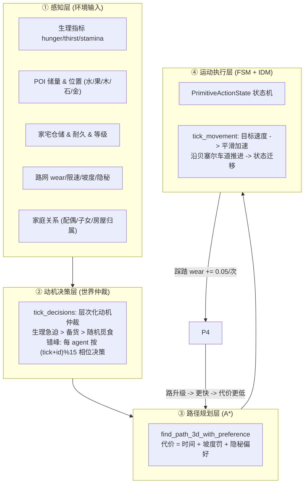

# 🤖 Agent AI 逻辑架构分析报告

> **分析对象**：`FlowAndAccord` 中"部落民 (Agent)"的全部 AI 逻辑
> **分析范围**：Rust 确定性内核 `crates/sim_core/src/spatial/` 与浏览器端 `frontend/js/`（JS 移植版）
> **结论先行**：当前 Agent 的"AI"是**纯确定性规则系统**——层次化动机有限状态机 (FSM) + A\* 加权寻路 + 踩踏拓路涌现 (Stigmergy) + 生理/家庭/房屋生命周期闭环。**不包含任何 LLM/神经网络/学习成分**（ARCHITECTURE.md 中规划的 LLM 认知层尚未实现）。同时发现 `agent.rs` 存在**字节级文件损坏**，Rust 内核当前无法编译。

---

## 1. 全景：一套 AI，双轨代码

| 轨 | 位置 | 状态 |
| :--- | :--- | :--- |
| **Rust 内核**（愿景中的确定性无头核心） | `crates/sim_core/src/spatial/{agent,world,graph,house,poi}.rs` | ⚠️ `agent.rs` 已损坏，无法编译（见 §7） |
| **JS 移植版**（浏览器实际运行） | `frontend/js/{agent,simulation,graph,house}.js` | ✅ 与 Rust 逻辑近乎 1:1 镜像，当前唯一可运行实现 |

两者是同一套 AI 逻辑的两种语言实现；Cargo workspace 仅包含 `sim_core`，`sim_llm` / Wasm 桥等愿景模块**尚不存在**。

---

## 2. 分层 AI 架构（四层 + 一个反馈环）



- **感知层**：数据全部挂在 `Agent3D` 结构体与全局 `World3DEngine` 上，无独立感知系统，属于"上帝视角直接读状态"。
- **决策层**（AI 的"大脑"）：`world.rs::tick_decisions()` / `simulation.js::tickDecisions()`，见 §4。
- **规划层**（AI 的"导航"）：`graph.rs::find_path_3d_with_preference()`（petgraph 的 `astar`）/ `graph.js::findPath()`，见 §5。
- **执行层**（AI 的"躯体"）：`agent.rs::tick_movement()` + 14 态 FSM，见 §3/§6。
- **涌现反馈环**：行走 → 道路踩踏升级 → 速度提升 → 路径代价下降 → 更多人走该路（"踏路成道"正反馈）；闲置则退化衰减。

---

## 3. 状态机：`PrimitiveActionState`（14 态，线性分层）

| 类别 | 状态 | 说明 |
| :--- | :--- | :--- |
| 静止态 | `RestingAtCamp` | 营地/家宅休息：回体力、从家宅取用水粮、触发受孕 |
| 出行态 | `SeekingWater/Food/Wood/Stone/Gold` | 正在赶往目标 POI（沿 route 推进） |
| 作业态 | `DrinkingAtWater / ForagingFood / GatheringWood / MiningStone / MiningGold` | 到达资源点后的持续采集/吃喝，并回填家宅仓储 |
| 归返态 | `ReturningToCamp` | 采集完成/生理告急/资源枯竭后回家 |
| 家宅态 | `ConstructingHouse / RepairingHouse` | 30s 施工升级 / 耐久<85% 修缮 |
| 异常态 | `OffRoadDetour / Dead` | 车道失效越野寻路 / 死亡（12s 风化） |

> ⚠️ 逻辑上还存在 `SeekingFood`、`DrinkingAtWater`、`ForagingFood` 三个变体（world.rs / agent.rs 大量引用），但 **Rust 枚举声明中这三行因文件损坏丢失**，且 `SeekingGold/MiningGold` 被重复声明——这是编译必失败的硬伤（见 §7）。

核心迁移路径（作业态 × 到达）：

```text
SeekingWater  --到达--> DrinkingAtWater --喝满/枯竭--> ReturningToCamp --> RestingAtCamp
SeekingFood   --到达--> ForagingFood    --吃满/枯竭--> (顺路补水) --> ReturningToCamp
SeekingWood/Stone/Gold --到达--> Gathering/Mining* --满仓/枯竭/告急--> ReturningToCamp
RestingAtCamp --触发决策--> Seeking*
RestingAtCamp --耐久<85%--> RepairingHouse --修满--> RestingAtCamp
RestingAtCamp --备料完成--> ConstructingHouse --30s--> RestingAtCamp (升级)
```

---

## 4. 动机决策层：层次化仲裁（AI 的核心算法）

`tick_decisions()` 采用**错峰调度**：每 tick 调用一次，但每个 agent 仅在 `(tick + id) % 15 == 0` 的相位上决策（每位小人平均仍每 15 Tick = 0.5s@30Hz 决策一次，但相位按 id 错开，消除全员同 tick 齐步走），**优先级从高到低**：

### 4.1 生理急迫第一原则（最高优先级）
仅当处于 `RestingAtCamp` 时：
- `thirst < 20.0`（孕妇 27.5）→ 就近水源
- `hunger < 24.0`（孕妇 30.0）→ 就近浆果
- 目标选择：按到 Agent 的**欧氏距离排序取最近**，然后 A\* 寻路

### 4.2 备货与扩产动机（次优先级，概率 40%）
条件：`stamina ≥ 65` 且拥有房屋，检查家宅仓储缺口，按 水→粮→木→石→金 的顺序以 40% 概率出发采集：
- 石料仅在房屋等级 ≥ Tier2 时采集（石头只用于盖房）
- 黄金仅在 Tier3 木石庄舍时采集（升级大庄园专用）
- 目的地仍为"最近优先"

### 4.3 随机觅食（低优先级，概率 4%）
`stamina ≥ 95 && hunger < 35` 时 4% 概率随机选浆果丛。

### 4.4 执行中状态的自适应
各作业态每帧检查：
- **生理熔断**：外出途中 `hunger < 20.0 || thirst < 20.0` → 立即中断作业，转向就近水/粮，或折返回家
- **满值/枯竭**：`thirst ≥ 48`、`hunger ≥ 48`、POI 储量 ≤ 0.05、家宅该品仓储已满 → 折返回家（有房回房、无房回最近营地）
- **顺路补给**：`DrinkingAtWater` 喝饱后若饥饿则直接转 `SeekingFood`（同理由觅食转补水）

### 4.5 目的归属规则
`home_camp_node` 在"有房"时指向房屋门前节点，无房时指向最近营地——决定了"家"的概念随房屋系统动态漂移。

---

## 5. 路径规划层：加权 A\*

### Rust 版（`graph.rs`，petgraph::algo::astar）
```text
边代价 = (curve.length / effective_speed) + grade_penalty
        × hidden_modifier
```
- `effective_speed = speed_limit × (0.50 + 0.333 × wear)`——道路等级（踩踏度）直接进入寻路代价，形成"走好路"的涌现偏好
- `grade_penalty = Δz × 1.5`（上坡惩罚）
- `hidden_modifier`：潜行特工（`is_covert`）偏好隐藏暗道 ×0.4 / 避公开路 ×1.2；普通市民避暗道 ×2.5
- 启发式：欧氏距离 / 80（admissible）

### JS 版（`graph.js`，手写 Dijkstra+启发式）
- 同一代价模型（时间 + 坡度 + offroad 罚 ×2.0），无隐秘偏好维度
- **额外涌现**：若无可达路径，**当场动态加一条土路**（`addLane(start, goal)`）——"无路就开路"

---

## 6. 运动执行层：IDM 风格跟车 + 车道推进

`tick_movement(dt, network)`（非运动态速度为 0）：

```text
road_level_factor = clamp(0.50 + 0.333 × wear, 0.50, 2.20)   // 0.50x 越野 ~ 2.17x 大道
stamina_factor    = clamp(stamina / 25.0, 0.2, 1.0)           // 疲劳限速
target_speed      = max_desired_speed × road_level_factor × stamina_factor
accel             = (target_speed − velocity) × 4.0           // 一阶平滑逼近
```

- 每帧扣除体力：`0.6 × (1 + 上坡比 × 3.5)`，孕妇 +0.3——体力枯竭会限速，形成疲劳约束
- 沿 `route`（车道 ID 数组）逐条推进，走完一条 → `wear += 0.05`（双向同步，上限 5.0）→ 下一条
- 到达终点 → 状态迁移（§3）；车道失效 → `OffRoadDetour`

---

## 7. 家庭 / 房屋 / 社会层 AI（`tick_housing`）

这是"社会性 AI"的载体，全部是确定性规则：

| 行为 | 触发条件 | 效果 |
| :--- | :--- | :--- |
| 自发建 0级仓库 | 男性、成年(≥120s)、饱暖≥18、体力≥75、15% 概率、空间不重叠 | 门前生成路网节点+支路，默认 5水5粮5木 |
| 自动婚姻 | 0→1级升级竣工时 | 自动迎娶单身成年女性，激活生育 |
| 受孕 | 已婚女性、在宅休息、水粮≥37.5、体力≥75、家宅水粮木≥10 | 120s 孕期 |
| 流产保护 | 孕期水粮<7.5 或体力<20 | 60s 调养冷却 |
| 自动施工 | 家宅仓储满足升级门槛（各等级门槛不同）且主人在家休息 | 30s 后升级扩容 |
| 自动修缮 | 耐久 < 85% 且主人/配偶在宅、体力≥35 | 8.0/s 修复至 100% |
| 冬季取暖 | Winter 或气温 < 5°C | 非 0 级房屋消耗 0.12 木材/s |
| 代际继承 | 户主去世 | 直系无房后代(长者优先) → 无房族人 → 变废墟 |
| 婚姻解除 | 配偶死亡 | 双方恢复单身 |

---

## 8. 调度时序（确定性 Tick 流水线）

`world.rs::tick(dt)`（显式 dt；ARCHITECTURE.md 目标 20Hz，JS 端 `dt = 1/30`，speedMult=2 默认每帧跑 2 步）：

```text
tick()
 ├─ ① POI 自然再生 (tick_regenerate)
 ├─ ② 代谢与繁衍 (tick_metabolism: 饥饿/脱水死亡、受孕/流产/分娩)
 ├─ ③ POI 提取/回填家宅 + 分娩出生 + 尸骸风化 (tick_poi_interactions)
 ├─ ④ 房屋系统 (tick_housing: 季节/取暖/折旧/修缮/施工/升级/建仓/继承)
 ├─ ⑤ 决策调度 (每 Tick 调度, 按 (tick+id)%15 相位错峰)  ← AI 大脑，低频
 ├─ ⑥ 道路退化衰减 (tick_wear_decay)
 └─ ⑦ 动力学运动 (tick_movement)                     ← AI 躯体，高频
```

设计要点：**决策节流**（15 Tick 一次）把计算密集的排序+寻路摊薄；**决策与运动分离**保证动作连续性。

---

## 9. 与 ARCHITECTURE.md 愿景的差距（重要）

| 愿景 (ARCHITECTURE.md) | 现状 |
| :--- | :--- |
| LLM 认知层：希腊合唱队/议会辩论/心声日记 | ❌ 未实现，无 `sim_llm` crate |
| ECS 内核 (hecs/bevy_ecs) | ❌ 实际用 `Vec<Agent3D>` + 顺序遍历 |
| Wasm 零拷贝快照 + 双缓冲 + 插值 | ❌ 无 Wasm，snapshot 为全量 serde 序列化 |
| 确定性 PRNG (wyrand 种子) | ❌ 用 `rand::thread_rng()`，**不可重放** |
| 2,000+ Agent / Tick ≤2.5ms | ❌ 未验证（决策节流但寻路未优化） |
| 六维政治/经济/专利系统 | ❌ 未实现（当前为"原始生态生存"阶段） |

---

## 10. 发现的问题清单

1. **🔴 `agent.rs` 字节级损坏（编译必失败）**，由最近提交 b0c69d6 引入：
   - **行 18**：`SeekingWater,       // 🚶 正在赶往�    SeekingWood,`——注释中混入 U+FFFD，原文件中 `SeekingFood`、`DrinkingAtWater`、`ForagingFood` 三个枚举变体被吞掉，而全工程代码都在引用它们；
   - **行 156**：`} > 0.0 {`——`tick_metabolism` 中出现重复代码块 + 非法语法（该函数体被重复粘贴了一次）；
   - **重复变体**：`SeekingGold/MiningGold` 各声明两次（Rust 中同名变体是硬错误 E0428）。
   - 修复方向：以 `frontend/js/agent.js` 为参照回填枚举与函数体（两版逻辑一致）。
2. **🔴 cargo 未安装或不在 PATH**：无法执行 `cargo check` 验证（`where.exe cargo` 与用户目录搜索均未找到）。
3. **🟠 确定性缺口**：`thread_rng()` 未种子化，同参数重跑结果不同，与"确定性核心"目标冲突；JS 版用 `Math.random()`，双轨不可对齐。
4. **🟠 双轨节流不一致**：决策相位 (tick+id)%15，Rust 20Hz=0.75s vs JS 30Hz=0.5s，同一逻辑在两端行为节奏漂移。
5. **🟡 代码重复**：水/粮/木/石/金五个资源分支各复制一份"排序+寻路+状态迁移"（world.rs 约 8 处、simulation.js 20+ 处），宜抽象为数据驱动的资源表。
6. **🟡 性能**：决策触发的寻路按 agent 相位错峰重算 + 每帧全量遍历，Agent 数量增大后无空间索引/寻路缓存。

---

## 11. 结论

当前 Agent AI 的"智能"来自三层确定性机制的组合：**优先级动机仲裁（决策）→ 加权 A\*（规划）→ IDM 平滑运动（执行）**，再叠加**踩踏拓路涌现**与**家庭/房屋生命周期规则**，形成"个体求生 → 自发聚居 → 代际传承"的自组织叙事。它没有学习与生成能力，一切行为可解释、可调参；LLM 叙事层、Wasm 桥与 ECS 化属于后续愿景。**当务之急是修复 `agent.rs` 的文件损坏并恢复 Rust 内核编译**，否则双轨实现将越漂越远。
