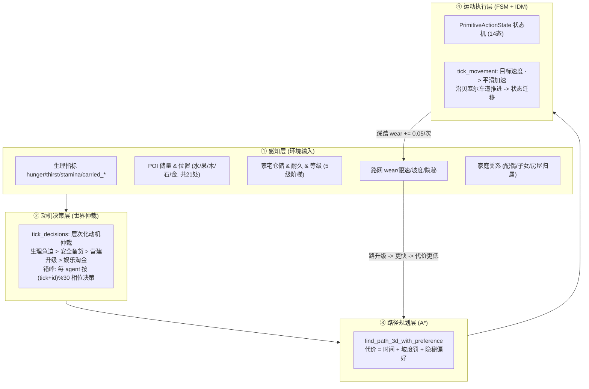

# 🤖 Agent AI 逻辑架构分析报告

> **分析对象**：`FlowAndAccord` 中"部落民 (Agent)"的全部 AI 逻辑  
> **分析范围**：Rust 确定性内核 `crates/sim_core/src/spatial/` 与 WebAssembly 桥接层 `crates/sim_wasm/`  
> **结论先行**：当前 Agent 的"AI"是**纯确定性规则系统**——层次化动机有限状态机 (FSM) + A* 加权寻路 + 踩踏拓路涌现 (Stigmergy) + 生理/家庭/房屋生命周期闭环。**不包含任何 LLM/神经网络/学习成分**（ARCHITECTURE.md 中规划的 LLM 认知层为愿景设计）。Rust 内核 `crates/sim_core` 编译正常并通过 WASM 回归测试，是**唯一真实仿真实现**；前端 `frontend/js/` 仅为表现与交互层（`math.js`、`rustworld.js`、`render.js`、`main.js`），不存在独立 JS 移植版仿真逻辑。

---

## 1. 全景：单轨 Rust 核心 + WebAssembly 快照导出

| 层次 | 模块位置 | 职责与状态 |
| :--- | :--- | :--- |
| **Rust 确定性内核** | `crates/sim_core/src/spatial/{agent,world,decisions,ecology,housing_system,graph,house,poi}.rs` | ✅ 纯 Rust 实现，状态机、A* 寻路、生态流转，WASM 回归测试通过 |
| **WASM 桥接层** | `crates/sim_wasm/src/lib.rs` $\rightarrow$ `frontend/rust/sim_wasm.wasm` | ✅ 零依赖 C-ABI 导出，线性内存 JSON 快照与多步 tick 调度 |
| **前端表现/适配层** | `frontend/js/{math,rustworld,render,main}.js` | ✅ Canvas 2D/3D 投影渲染、Inspector 监控与视口交互，无重复业务逻辑 |

---

## 2. 分层 AI 架构（四层 + 一个反馈环）



- **感知层**：数据全部挂在 `Agent3D` 结构体与全局 `World3DEngine` 上，无独立感知系统，属于"上帝视角直接读状态"。
- **决策层**（AI 的"大脑"）：`crates/sim_core/src/spatial/decisions.rs::tick_decisions()`，详见 §4。
- **规划层**（AI 的"导航"）：`crates/sim_core/src/spatial/graph.rs::find_path_3d_with_preference()`（基于 `petgraph` 的 `astar`），详见 §5。
- **执行层**（AI 的"躯体"）：`crates/sim_core/src/spatial/agent.rs::tick_movement()` + 14 态 FSM，详见 §3/§6。
- **涌现反馈环**：行走 $\rightarrow$ 道路踩踏升级（`wear += 0.05`）$\rightarrow$ 速度提升（$0.50\times \sim 2.20\times$）$\rightarrow$ 路径代价下降 $\rightarrow$ 更多人走该路（"踏路成道"正反馈）；闲置则退化衰减。

---

## 3. 状态机：`PrimitiveActionState`（14 态）

| 类别 | 状态 | 说明 |
| :--- | :--- | :--- |
| 静止态 | `RestingAtCamp` | 营地/家宅休息：回体力至 100%、从家宅取用水粮、家宅卸货、触发受孕 |
| 出行态 | `SeekingWater / SeekingFood / SeekingWood / SeekingStone / SeekingGold` | 正在赶往目标 POI（沿 route 推进） |
| 作业态 | `DrinkingAtWater / ForagingFood / GatheringWood / MiningStone / MiningGold` | 到达资源点后的持续采集/吃喝，并装载随身行囊（搬运） |
| 归返态 | `ReturningToCamp` | 采集满载/生理告急/资源枯竭后返家卸货 |
| 家宅态 | `ConstructingHouse / RepairingHouse` | 30s 施工升级 / 耐久 < 50% 修缮至 100% |
| 异常态 | `OffRoadDetour / Dead` | 车道失效越野寻路 / 死亡（12s 风化消散） |

核心迁移路径（作业态 $\times$ 到达）：

```text
SeekingWater           --到达--> DrinkingAtWater   --喝满/装满/枯竭--> ReturningToCamp --> RestingAtCamp (卸货存水)
SeekingFood            --到达--> ForagingFood      --吃满/装满/枯竭--> (顺路补水)      --> ReturningToCamp --> RestingAtCamp (卸粮)
SeekingWood/Stone/Gold --到达--> Gathering/Mining* --满载/枯竭/告急--> ReturningToCamp --> RestingAtCamp (卸货入库)
RestingAtCamp          --触发决策--> Seeking*
RestingAtCamp          --耐久<50%--> RepairingHouse --修至100%--> RestingAtCamp
RestingAtCamp          --备料充足--> ConstructingHouse --30s--> RestingAtCamp (升级)
```

---

## 4. 动机决策层：马斯洛需求层次化仲裁

`tick_decisions()` 采用**错峰调度**：每 tick (1/30 模拟秒) 调用一次，但每个 agent 仅在 `(tick_counter + agent.id) % 30 == 0` 的相位上决策，**优先级从高到低**：

### 4.1 生理急迫第一原则（最高优先级，第 ① 层）
处于 `RestingAtCamp` 时若体力或水粮告急：
- 体力恢复：若处于休息态，必须回满至 $100\%$ 才重新出门；体力 $\ge 50\%$ 前不主动休息。
- `thirst < 20.0`（孕妇 27.5）$\rightarrow$ 就近清泉
- `hunger < 24.0`（孕妇 30.0）$\rightarrow$ 就近浆果
- 目标选择：按到 Agent 的**欧氏距离排序取最近**，然后 A* 寻路

### 4.2 安全与家宅备货（第 ② 层，优先级次之）
- **修缮私宅**：私宅耐久度 $< 50\%$ 时触发修缮，一旦动工修至 $100\%$。
- **仓库水粮与过冬木柴保底**：私宅水、粮、木储量低于 $50\%$ 时优先外出搬运填满仓库，**绝对优先于升级建房**。

### 4.3 营建升级与建材储备（第 ③/④ 层）
- **0 级建仓**：成年单身男性且身体充沛时立项营建。
- **采石备料 (`StockStone`)**：仅 2 级私宅且石料未满 85% 时采石。
- **盖房淘金 (`StockGold`)**：3 级木石庄舍升 4 级大庄园的建材储备，冷却时间为 **45 秒**。

### 4.4 娱乐淘金与闲暇富余（第 ⑤ 层）
- **娱乐淘金 (`GoldWealth`)**：仅在 4 级氏族大庄园完全竣工后触发，冷却时间为 **180 秒**；未建至顶级大庄园前绝不娱乐淘金。

### 4.5 POI 储量门槛与执行中自适应熔断
各作业态与寻路每帧检查：
- **启动寻路门槛（$\ge 30\%$）**：若某处 POI 储量 $< 30\%$，决策层不启动对该地标的寻路（排除在候选池外）；
- **中途放弃熔断与平滑掉头（$< 10\%$）**：赶往 POI 途中若目标点储量跌破 $< 10\%$，立即直接放弃当前寻路；通过 `turn_around_and_route_to` 原地切换反向车道并继承平滑进度（$L - s$），**绝不发生节点瞬移闪现**，平滑往回走；
- **生理熔断**：外出途中 `hunger < 20.0 || thirst < 20.0` 或体力 $< 50.0$ $\rightarrow$ 立即中断作业，降级折返就近补给或回家；
- **满载/枯竭**：行囊装满（$\ge 50.0$）、POI 储量 $\le 0.05$、家宅该品仓储已满 $\rightarrow$ 折返回家（有房回房、无房回最近营地）；
- **顺路补给**：`DrinkingAtWater` 喝饱后若饥饿则直接转 `SeekingFood`（同理觅食后转补水）。

---

## 5. 路径规划层：加权 A*

Rust 拓扑路网（`crates/sim_core/src/spatial/graph.rs`，基于 `petgraph::algo::astar`）：

```text
边代价 = (curve.length / effective_speed) + grade_penalty
        × hidden_modifier
```

- `effective_speed = speed_limit × (0.50 + 0.333 × wear)`——道路等级（踩踏度）直接进入寻路代价，形成"走好路"的涌现偏好；
- `grade_penalty = Δz × 1.5`（上坡惩罚）；
- `hidden_modifier`：潜行特工偏好隐藏暗道 $\times 0.4$ / 避公开路 $\times 1.2$；普通市民避暗道 $\times 2.5$；
- 启发式函数：欧氏距离 / 80（admissible，保证最短路性质）。

---

## 6. 运动执行层：IDM 风格平滑加速 + 车道推进

`tick_movement(dt, network)`（非运动态速度为 0）：

```text
road_level_factor = clamp(0.50 + 0.333 × wear, 0.50, 2.20)   // 0.50x 荒野越野 ~ 2.20x 极品大道
stamina_factor    = clamp(stamina / 25.0, 0.2, 1.0)           // 疲劳限速
target_speed      = max_desired_speed × road_level_factor × stamina_factor
accel             = (target_speed − velocity) × 4.0           // 一阶平滑逼近
```

- 每帧扣除体力：`0.6 × (1 + 上坡比 × 3.5)`，孕妇 +0.3——体力枯竭会限速，形成疲劳约束；
- 沿 `route`（车道 ID 数组）逐条推进，走完一条 $\rightarrow$ `wear += 0.05`（双向同步，上限 5.0）$\rightarrow$ 下一条；
- 到达终点 $\rightarrow$ 状态迁移（§3）；车道失效 $\rightarrow$ `OffRoadDetour`。

---

## 7. 家庭 / 房屋 / 社会层规则（`housing_system/`）

| 行为 | 触发条件 | 效果 |
| :--- | :--- | :--- |
| 自发建 0级仓库 | 男性、成年($\ge 120\text{s}$)、饱暖$\ge 18$、体力$\ge 75$、15% 概率、空间不重叠 | 门前生成路网节点+支路，自主搬运建材 |
| 自动婚姻 | 0$\rightarrow$1级升级竣工时 | 自动迎娶单身成年女性，激活生育 |
| 受孕 | 已婚女性、任意任务期间（不要求在家）、水粮$\ge 40.0$、体力$\ge 80$、家宅水粮木$\ge 50\%$ 容量 | 900s 孕期，头顶展示孕育进度环 |
| 流产保护 | 孕期水粮 $< 10.0$ 或体力 $< 20.0$ | 450s 调养冷却 |
| 自动施工 | 家宅仓储满足升级门槛且主人在家休息 | 30s 施工后升级扩容 |
| 自动修缮 | 耐久 $< 50\%$ 且主人/配偶在宅、体力充足 | 8.0/s 修复至 100% |
| 冬季取暖 | Winter 或气温 $< 5^\circ\text{C}$ | 非 0 级房屋消耗 0.12 木材/s |
| 代际继承 | 户主去世 | 直系无房后代(长者优先) $\rightarrow$ 无房族人 $\rightarrow$ 变废墟 |
| 婚姻解除 | 配偶死亡 | 双方恢复单身 |

---

## 8. 调度时序（30Hz 确定性 Tick 流水线）

`world.rs::tick(dt)`（固定物理步长 `dt = 1.0 / 30.0`）：

```text
tick()
 ├─ ① POI 自然再生 (tick_regenerate: 水/粮/木/石/金 储量回补)
 ├─ ② 代谢与繁衍 (tick_metabolism: 饥渴消耗、受孕/流产/分娩、冻馁死亡)
 ├─ ③ POI 交互与装卸 (tick_poi_interactions: 采收装载行囊、在家卸货入库、遗骸风化)
 ├─ ④ 房屋系统 (tick_housing: 四季气温、冬季供暖、耐久折旧/修缮/施工/升级/代际继承)
 ├─ ⑤ 决策调度 (tick_decisions: 每 tick 调度, 按 (tick+id)%15 相位错峰)  ← AI 大脑
 ├─ ⑥ 道路退化衰减 (tick_wear_decay: 闲置道路自然衰减)
 └─ ⑦ 动力学运动 (tick_movement: IDM 目标速度平滑推进与踩踏加固)         ← AI 躯体
```

---

## 9. 现状与长程愿景对比

| 模块维度 | 当前实际落地状态 (Current) | 宏观规划愿景 (Vision - ARCHITECTURE.md / PLAN.md) |
| :--- | :--- | :--- |
| **内核架构** | 确定性 Rust 核心 (`Vec<Agent3D>` + 空间调度) | 20Hz Headless ECS (`hecs`/`bevy_ecs`) |
| **WASM 桥接** | `sim_wasm` 零依赖 C-ABI 导出，线性内存 JSON 快照 | 零拷贝双缓冲共享内存快照 + Hermite 时间戳插值 |
| **AI 决策** | 马斯洛 5 层动机 FSM + (tick+id)%15 错峰决策 | 混合政体 6 维权力仲裁 + 异步 LLM 认知总线 |
| **空间路网** | 贝塞尔曲线 3D 拓扑图 + A* 寻路 + 踩踏成道 | 欲望线热度场 (`DesireGrid`) + 时空冲突预约 FIFO |
| **生态/经济** | 21 处 POI (水/粮/木/石/金) + 5 级房屋 + 随身行囊搬运 | 痛点动态专利 + 双轨金库 + 民间野生黑科技投机 |
| **社会政治** | 婚姻/受孕/120s妊娠/血脉代际继承 | 六维权力光谱 (民意/技术/资本/强制/宗法/霸权) + 议会大辩论 |

---

## 10. 验证与工程规范

1. **测试双保险**：
   - 原生 Rust 内核编译校验：`cargo test -p sim_core`（当前源码未内置单元测试用例，命令通过即代表编译无误）；
   - WASM 端到端自动化回归测试：`node tools/test-wasm.js`（验证 WASM 导出、种子一致性、防 NaN、防越界）。
2. **确定性约束**：
   - 依赖 `WorldRng`（基于固定种子 PRNG），所有随机消耗顺序确定，禁止使用未种子化的 `thread_rng()` 或前端 `Math.random()` 扰动模拟核心。
3. **物理步长铁律**：
   - 固定 `dt = 1.0 / 30.0`，倍速通过 `world_tick_steps(N, 1/30)` 实现，禁止修改 `dt`。

---

## 11. 结论

当前 Agent AI 的"智能"来自**确定性规则的涌现组合**：**马斯洛优先级动机仲裁（决策）$\rightarrow$ 加权 A*（规划）$\rightarrow$ IDM 平滑运动（执行）**，叠加**踏路成道正反馈**与**家庭/房屋进阶规则**，构建了"个体求生 $\rightarrow$ 随身搬运 $\rightarrow$ 筑巢成家 $\rightarrow$ 代际传承"的自组织叙事闭环。Rust 内核是唯一真实实现并通过全部回归测试，为后续演进奠定了坚实基础。