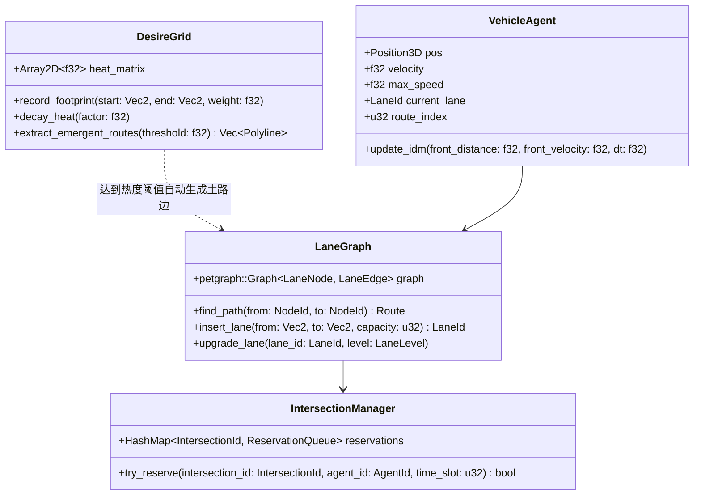
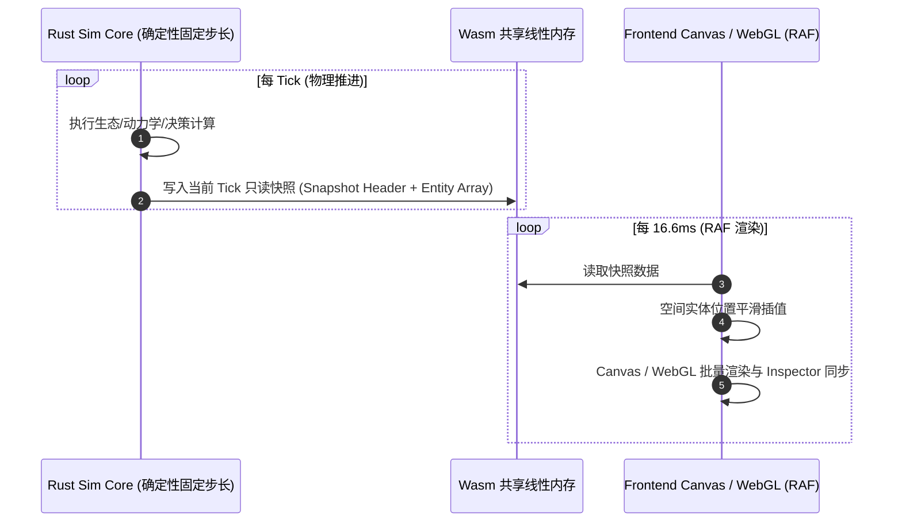
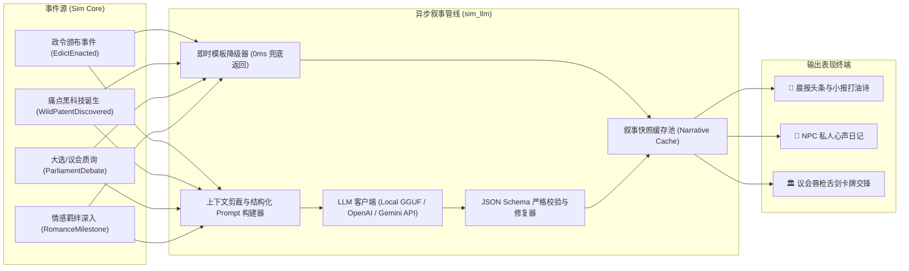

# 🏗️ Flow & Accord（动线与协约）系统技术架构设计说明书

> ⚠️ **重要架构说明（愿景 vs 现状）**：  
> 本文档记录了系统的**宏观目标架构设计说明（v1.0.0-Draft 愿景）**。  
> - **当前实际状态（已落地实现）**：基于 Rust 确定性核心（`crates/sim_core`）与 WebAssembly 桥接（`crates/sim_wasm`），采用 **30Hz 固定步进（`dt = 1/30` 模拟秒）**、`(tick_counter + agent.id) % 15 == 0` 错峰决策、21 处有限生态 POI、5 阶私宅演进、随身行囊真实搬运与家宅卸货，详见 [CURRENT.md](file:///c:/Users/Lima/RustroverProjects/FlowAndAccord/CURRENT.md) 与 [AGENTS.md](file:///c:/Users/Lima/RustroverProjects/FlowAndAccord/AGENTS.md)。  
> - **愿景模块（后续阶段规划）**：下述 20Hz Headless ECS 内核、LLM 异步认知与叙事总线（希腊合唱队/议会大辩论/心声日记）、六维政治资本（民意/技术/资本/强制/宗法/霸权）、双轨金库与动态专利经济均为**长程演进愿景**，请勿将愿景设计当作当前已有功能。

---

## 1. 总体架构设计与分层拓扑（宏观愿景）

系统遵循**“核心确定性物理/政治演化”与“外部表现/大模型生成”完全解耦**的单向数据流架构。整个系统分为四大层次：

```mermaid
graph TB
    subgraph Layer4_LLM ["🧠 异步认知与叙事层 (Async LLM Cognitive Bus - 愿景)"]
        LLM_Router["LLM 调度路由器 (Local GGUF / Cloud API)"]
        GreekChorusEng["希腊合唱队生成器 (街头小报 / 打油诗 / 沙龙闲聊)"]
        DebateArena["议会辩论裁决器 (Prompt 插值 & 立场漂移演算)"]
        DiaryNarrator["NPC 心声日记与微表情生成器"]
        DecreeCompiler["复合政令檄文渲染器"]
    end

    subgraph Layer1_Core ["⚙️ 确定性模拟核心 (Headless Sim Core - 规划 20Hz / 现状 30Hz)"]
        direction TB
        subgraph ECS_Kernel ["ECS 状态内核 (hecs / bevy_ecs - 规划)"]
            WorldState["World State (Components, Resources)"]
            CommandQueue["Deterministic Command Queue (指令队列)"]
        end

        subgraph SpatialPhysics ["空间拓扑与微观动线 (已落地基础)"]
            DesireGrid["欲望线热度场 (Heatmap Grid)"]
            LaneGraph["有向车道拓扑图 (petgraph)"]
            SpatialIndex["3D 空间索引 (rstar R-Tree)"]
            TrafficSim["IDM 跟车 + 冲突区预约 (FIFO)"]
        end

        subgraph PoliticalEconomy ["六维权力与双轨经济 (愿景)"]
            DecayEngine["政治资本年化指数衰减演算器 (8%/yr)"]
            EdictMatrix["特权法案交叉路由器"]
            DualTreasury["市政公库 (Public) vs 私人钱包 (Personal)"]
            PatentRegistry["痛点专利股权与野生黑科技池"]
        end

        SnapshotWriter["双缓冲快照生成器 (Double-Buffered Snapshot Buffer)"]
    end

    subgraph Layer2_Bridge ["🌉 跨边界数据与事件桥 (Wasm / FFI Bridge - 已落地)"]
        WasmBindgen["wasm-bindgen / Memory View (零拷贝视图)"]
        EventChannel["Crossbeam / Async MPSC Channel"]
        StateSerializer["Serde / Bincode 原生序列化器 (SL 读档支持)"]
    end

    subgraph Layer3_Presentation ["🎨 表现与渲染层 (Visualizer Layer - 60/120 FPS - 已落地)"]
        RenderPipeline["Canvas 2D / Pixi.js / WebGL 渲染管线"]
        LerpInterpolator["Tick 状态时间戳插值器 (Hermite Lerp)"]
        AudioEngine["WebAudio / FMOD 自适应声景引擎"]
        UI_View["六维具身 HUD + 复合宝座 + 报刊日记窗"]
    end

    %% 数据流动线
    CommandQueue --> WorldState
    WorldState --> SpatialPhysics & PoliticalEconomy
    SpatialPhysics & PoliticalEconomy --> SnapshotWriter
    SnapshotWriter -->|零拷贝共享内存 / 指针快照| WasmBindgen
    WasmBindgen --> LerpInterpolator
    LerpInterpolator --> RenderPipeline & UI_View & AudioEngine

    WorldState -.->|Emit NarrativeEvent| EventChannel
    EventChannel --> Layer4_LLM
    Layer4_LLM -.->|Async Callback / Narrative Snapshot| WasmBindgen

    UI_View -->|用户操作 (法令/规划/做空)| CommandQueue
    StateSerializer <-->|全量状态持久化| WorldState
```

---

## 2. 核心子系统架构与数据模型（愿景规范）

### 2.1 Cargo Workspace 模块划分

```text
FlowAndAccord/
├── Cargo.toml                    # Workspace 根配置
├── crates/
│   ├── sim_core/                 # 核心确定性模拟库 (纯 Rust, no_std 友好, 无 GUI 依赖)
│   │   ├── src/
│   │   │   ├── ecs/              # 组件、资源、系统调度 (规划)
│   │   │   ├── spatial/          # 拓扑图、欲望线、空间索引、微观交通 (已落地)
│   │   │   ├── politics/         # 六维政治资本、指数衰减、法案路由、诨号判定 (规划)
│   │   │   ├── economy/          # 痛点追踪、专利股权、野生黑科技、双轨账本 (规划)
│   │   │   ├── social/           # 情感羁绊、阶级微表情、私人日记数据契约 (规划)
│   │   │   ├── snapshot.rs       # 只读对外紧凑内存快照定义 (已落地)
│   │   │   └── lib.rs
│   │   └── tests/                # 确定性回归测试 & 压力测试 (规划)
│   ├── sim_wasm/                 # WebAssembly 胶水层与零拷贝内存视图 (已落地)
│   │   ├── src/
│   │   │   ├── bridge.rs         # JS API 导出与内存指针映射
│   │   │   └── lib.rs
│   │   └── Cargo.toml
│   ├── sim_cli/                  # 命令行调试、性能 Benchmark 与大批量蒙特卡洛仿真 (规划)
│   └── sim_llm/                  # 异步 LLM 适配器、结构化 Prompt 模板与 JSON 解析 (规划)
└── frontend/                     # 前端表现层 (Canvas 2D/3D + Inspector, 已落地)
```

---

### 2.2 确定性物理与空间拓扑系统 (`spatial`)



1. **欲望线热度累积与自发筑路（Desire Lines）**：
   - 采用 $1\text{m} \times 1\text{m}$ 的离散网格 `DesireGrid` 记录 NPC 在非道路区域通行产生的热度。
   - 每 Tick 自然蒸发 $\delta_{\text{heat}} = 0.999$；当某连通路径热度超过阈值 $\tau_{\text{path}}$ 时，触发 `CreateDirtRoadEvent`，在 `LaneGraph` 中动态插入新的低等级边。
2. **微观交通跟车与冲突区防死锁（IDM & Reservation FIFO）**：
   - 行驶采用智能驾驶模型（IDM, Intelligent Driver Model），计算车辆加速度：
     $$a = a_{\text{max}} \left[ 1 - \left(\frac{v}{v_0}\right)^4 - \left(\frac{s^*(v, \Delta v)}{s}\right)^2 \right]$$
   - 交叉路口采用**时空预约机制（Time-Space Reservation FIFO）**：进入冲突区前 50m 向路口管网申请时间窗口，未命中预约则提前平滑减速，杜绝自发路网死锁。

---

### 2.3 六维政治资本与双轨经济系统 (`politics` & `economy` - 愿景)

#### ① 连续向度与年化 8% 自然衰减引擎

```rust
#[repr(C)]
#[derive(Debug, Clone, Copy, Serialize, Deserialize)]
pub struct GovernanceSpectrum {
    pub civic: f32,      // 0.0 ~ 100.0 (民意协商)
    pub tech: f32,       // 0.0 ~ 100.0 (技术理性)
    pub capital: f32,    // 0.0 ~ 100.0 (资本寡头)
    pub dread: f32,      // 0.0 ~ 100.0 (铁腕强制)
    pub dynasty: f32,    // 0.0 ~ 100.0 (宗法传承)
    pub hegemony: f32,   // 0.0 ~ 100.0 (意识形态)
}

impl GovernanceSpectrum {
    pub const ANNUAL_DECAY_RATE: f32 = 0.08; // 年化 8%
    
    /// 每 Tick 执行一次高精度指数衰减
    pub fn tick_decay(&mut self, dt_years: f32) {
        let decay_multiplier = (-(Self::ANNUAL_DECAY_RATE * dt_years)).exp();
        self.civic *= decay_multiplier;
        self.tech *= decay_multiplier;
        self.capital *= decay_multiplier;
        self.dread *= decay_multiplier;
        self.dynasty *= decay_multiplier;
        self.hegemony *= decay_multiplier;
    }
}
```

#### ② 双轨金库机制（Dual-Treasury Ledger）

```rust
#[derive(Debug, Clone, Serialize, Deserialize)]
pub struct RegimeFinancialState {
    pub public_treasury: u64,    // 市政公共财政 (下台/政变后移交新政府)
    pub player_personal_wallet: u64, // 玩家个人私产钱包 (永久保留，下台后作为在野启动金)
    pub land_deeds: Vec<PlotId>, // 个人名下持有的私有路权地契 (下台后可设置收费关卡)
    pub patent_stocks: HashMap<PatentId, f32>, // 玩家持有的专利股权份额 (0.0 ~ 1.0)
}
```

---

## 3. 跨边界通信：Wasm 零拷贝快照与 60FPS 平滑渲染

为了在浏览器端实现数千实体无 GC 卡顿的 60/120 FPS 流畅渲染，架构采用**紧凑内存布局与快照导出**：



---

## 4. 异步 LLM 认知与叙事系统架构（愿景）

游戏规划采用**双轨响应机制**：核心循环由模板引擎（Slot-Filler）即时完成（0ms 延迟），背景叙事、报刊、日记与辩论由 **LLM 异步润色生成**：



---

## 5. 技术选型与规划性能指标

| 模块 | 推荐技术方案 | 现状与验收标准 |
| :--- | :--- | :--- |
| **模拟核心 (Sim Core)** | **Rust + 确定性调度 (规划引入 `hecs`/`bevy_ecs`)** | 当前以 30Hz (1/30s) 稳定运行，单 Tick 计算耗时 $\le 1\text{ms}$，通过 WASM 回归测试验证。 |
| **拓扑与空间** | **`petgraph` (Directed Graph) + 3D 贝塞尔曲线** | 动态加边与 A\* 寻路毫秒级响应，支持坡度与隐秘加权。 |
| **Wasm 桥接** | **`sim_wasm` C-ABI + 线性内存快照** | 前后端数据零拷贝传递，通过 Node.js 回归测试验证。 |
| **前端渲染** | **Canvas 2D/3D + Inspector 仪表盘** | 30~60 FPS 稳定渲染，支持视口缩放平移与小人/房屋选中监控。 |
| **大模型推理 (规划)** | **Local WebLLM / Cloud API + Async Channel** | 核心玩法无感知后台生成，模板兜底延迟 $\le 1\text{ms}$。 |