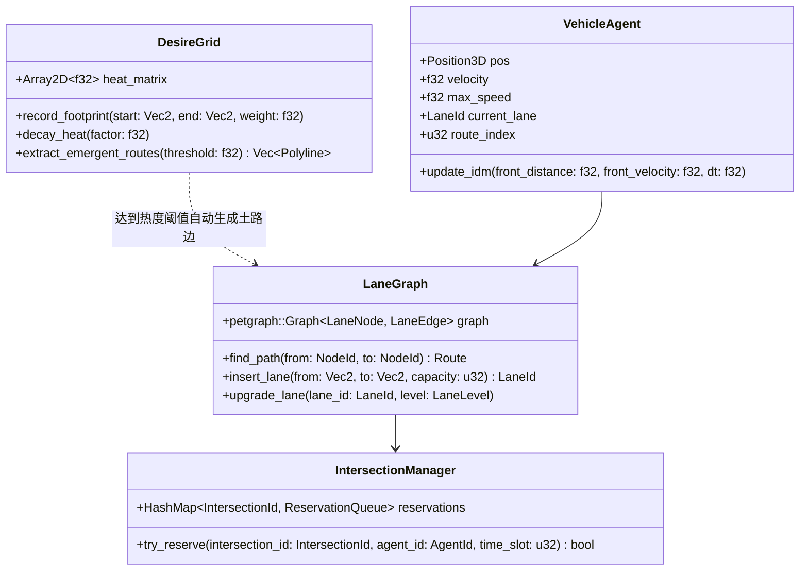
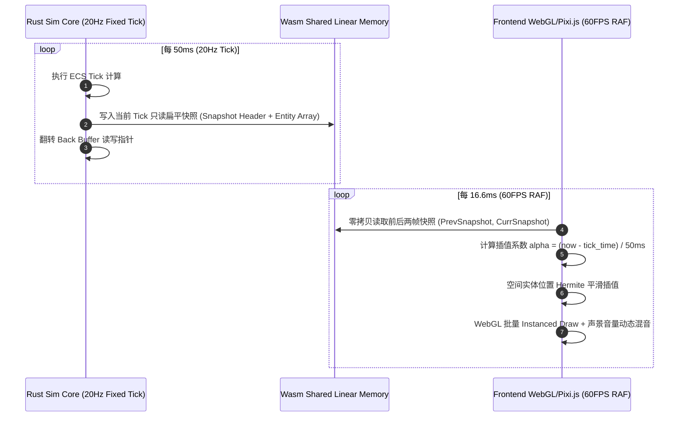
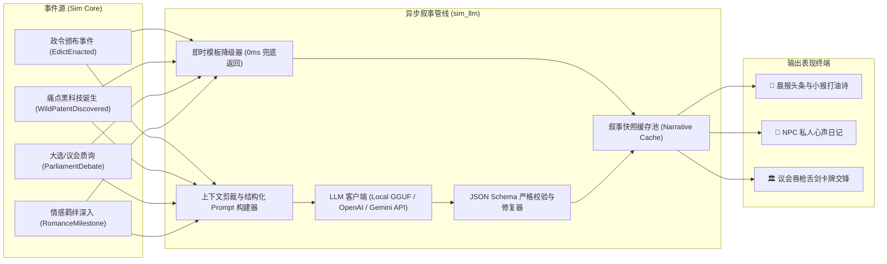
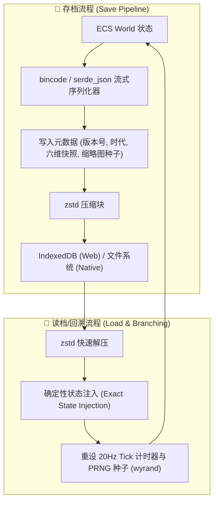

# 🏗️ Flow & Accord（动线与协约）系统技术架构设计说明书
> **版本**：v1.0.0-Draft  
> **设计目标**：高性能纯数据确定性无头核心（Rust 20Hz Tick） + 零拷贝快照桥接 + 表现层 60/120FPS 平滑插值 + 异步 LLM 认知与叙事总线 + 原生多档 SL 回溯

---

## 1. 总体架构设计与分层拓扑

系统遵循**“核心确定性物理/政治演化”与“外部表现/大模型生成”完全解耦**的单向数据流架构。整个系统分为四大层次：

```mermaid
graph TB
    subgraph Layer4_LLM ["🧠 异步认知与叙事层 (Async LLM Cognitive Bus)"]
        LLM_Router["LLM 调度路由器 (Local GGUF / Cloud API)"]
        GreekChorusEng["希腊合唱队生成器 (街头小报 / 打油诗 / 沙龙闲聊)"]
        DebateArena["议会辩论裁决器 (Prompt 插值 & 立场漂移演算)"]
        DiaryNarrator["NPC 心声日记与微表情生成器"]
        DecreeCompiler["复合政令檄文渲染器"]
    end

    subgraph Layer1_Core ["⚙️ 确定性模拟核心 (Headless Sim Core - Rust 20Hz)"]
        direction TB
        subgraph ECS_Kernel ["ECS 状态内核 (hecs / bevy_ecs)"]
            WorldState["World State (Components, Resources)"]
            CommandQueue["Deterministic Command Queue (指令队列)"]
        end

        subgraph SpatialPhysics ["空间拓扑与微观动线"]
            DesireGrid["欲望线热度场 (Heatmap Grid)"]
            LaneGraph["有向车道拓扑图 (petgraph)"]
            SpatialIndex["3D 空间索引 (rstar R-Tree)"]
            TrafficSim["IDM 跟车 + 冲突区预约 (FIFO)"]
        end

        subgraph PoliticalEconomy ["六维权力与双轨经济"]
            DecayEngine["政治资本年化指数衰减演算器 (8%/yr)"]
            EdictMatrix["特权法案交叉路由器"]
            DualTreasury["市政公库 (Public) vs 私人钱包 (Personal)"]
            PatentRegistry["痛点专利股权与野生黑科技池"]
        end

        SnapshotWriter["双缓冲快照生成器 (Double-Buffered Snapshot Buffer)"]
    end

    subgraph Layer2_Bridge ["🌉 跨边界数据与事件桥 (Wasm / FFI Bridge)"]
        WasmBindgen["wasm-bindgen / Memory View (零拷贝视图)"]
        EventChannel["Crossbeam / Async MPSC Channel"]
        StateSerializer["Serde / Bincode 原生序列化器 (SL 读档支持)"]
    end

    subgraph Layer3_Presentation ["🎨 表现与渲染层 (Visualizer Layer - 60/120 FPS)"]
        RenderPipeline["Canvas 2D / Pixi.js / WebGL 渲染管线"]
        LerpInterpolator["Tick 状态时间戳插值器 (Hermite Lerp)"]
        AudioEngine["WebAudio / FMOD 自适应声景引擎"]
        UI_View["六维具身 HUD + 复合宝座 + 报刊日记窗"]
    end

    %% 数据流动线
    CommandQueue --> WorldState
    WorldState --> SpatialPhysics & PoliticalEconomy
    SpatialPhysics & PoliticalEconomy --> SnapshotWriter
    SnapshotWriter -->|零拷贝共享内存 / 指针快照| WasmBindgen
    WasmBindgen --> LerpInterpolator
    LerpInterpolator --> RenderPipeline & UI_View & AudioEngine

    WorldState -.->|Emit NarrativeEvent| EventChannel
    EventChannel --> Layer4_LLM
    Layer4_LLM -.->|Async Callback / Narrative Snapshot| WasmBindgen

    UI_View -->|用户操作 (法令/规划/做空)| CommandQueue
    StateSerializer <-->|全量状态持久化| WorldState
```

---

## 2. 核心子系统架构与数据模型

### 2.1 Cargo Workspace 模块划分

```text
FlowAndAccord/
├── Cargo.toml                    # Workspace 根配置
├── crates/
│   ├── sim_core/                 # 核心确定性模拟库 (纯 Rust, no_std 友好, 无 GUI 依赖)
│   │   ├── src/
│   │   │   ├── ecs/              # 组件、资源、系统调度
│   │   │   ├── spatial/          # 拓扑图、欲望线、空间索引、微观交通
│   │   │   ├── politics/         # 六维政治资本、指数衰减、法案路由、诨号判定
│   │   │   ├── economy/          # 痛点追踪、专利股权、野生黑科技、双轨账本
│   │   │   ├── social/           # 情感羁绊、阶级微表情、私人日记数据契约
│   │   │   ├── snapshot.rs       # 只读对外紧凑内存快照定义
│   │   │   └── lib.rs
│   │   └── tests/                # 确定性回归测试 & 压力测试
│   ├── sim_wasm/                 # WebAssembly 胶水层与零拷贝内存视图
│   │   ├── src/
│   │   │   ├── bridge.rs         # JS API 导出与内存指针映射
│   │   │   └── lib.rs
│   ├── sim_cli/                  # 命令行调试、性能 Benchmark 与大批量蒙特卡洛仿真
│   └── sim_llm/                  # 异步 LLM 适配器、结构化 Prompt 模板与 JSON 解析
└── frontend/                     # 前端表现层 (Vite + TypeScript + Pixi.js/WebGL + WebAudio)
    ├── src/
    │   ├── core/                 # Wasm 实例生命周期与内存读取
    │   ├── renderer/             # 空间渲染、流光导轨、微表情装配
    │   ├── audio/                # 声景混音器
    │   └── ui/                   # 具身视听 HUD、合唱队小报、议会辩论
```

---

### 2.2 确定性物理与空间拓扑系统 (`spatial`)



1. **欲望线热度累积与自发筑路（Desire Lines）**：
   - 采用 $1\text{m} \times 1\text{m}$ 的离散网格 `DesireGrid` 记录 NPC 在非道路区域通行产生的热度。
   - 每 Tick 自然蒸发 $\delta_{\text{heat}} = 0.999$；当某连通路径热度超过阈值 $\tau_{\text{path}}$ 时，触发 `CreateDirtRoadEvent`，在 `LaneGraph` 中动态插入新的低等级边。
2. **微观交通跟车与冲突区防死锁（IDM & Reservation FIFO）**：
   - 行驶采用智能驾驶模型（IDM, Intelligent Driver Model），计算车辆加速度：
     $$a = a_{\text{max}} \left[ 1 - \left(\frac{v}{v_0}\right)^4 - \left(\frac{s^*(v, \Delta v)}{s}\right)^2 \right]$$
   - 交叉路口不依赖复杂红绿灯逻辑，采用**时空预约机制（Time-Space Reservation FIFO）**：进入冲突区前 50m 向路口管网申请时间窗口，未命中预约则提前平滑减速，杜绝自发路网死锁。

---

### 2.3 六维政治资本与双轨经济系统 (`politics` & `economy`)

#### ① 连续向度与年化 8% 自然衰减引擎

```rust
#[repr(C)]
#[derive(Debug, Clone, Copy, Serialize, Deserialize)]
pub struct GovernanceSpectrum {
    pub civic: f32,      // 0.0 ~ 100.0 (民意协商)
    pub tech: f32,       // 0.0 ~ 100.0 (技术理性)
    pub capital: f32,    // 0.0 ~ 100.0 (资本寡头)
    pub dread: f32,      // 0.0 ~ 100.0 (铁腕强制)
    pub dynasty: f32,    // 0.0 ~ 100.0 (宗法传承)
    pub hegemony: f32,   // 0.0 ~ 100.0 (意识形态)
}

impl GovernanceSpectrum {
    pub const ANNUAL_DECAY_RATE: f32 = 0.08; // 年化 8%
    
    /// 每 Tick (20Hz, 假设 1 年 = 72,000 Tick) 执行一次高精度指数衰减
    pub fn tick_decay(&mut self, dt_years: f32) {
        let decay_multiplier = (-(Self::ANNUAL_DECAY_RATE * dt_years)).exp();
        self.civic *= decay_multiplier;
        self.tech *= decay_multiplier;
        self.capital *= decay_multiplier;
        self.dread *= decay_multiplier;
        self.dynasty *= decay_multiplier;
        self.hegemony *= decay_multiplier;
    }
}
```

#### ② 双轨金库机制（Dual-Treasury Ledger）

```rust
#[derive(Debug, Clone, Serialize, Deserialize)]
pub struct RegimeFinancialState {
    pub public_treasury: u64,    // 市政公共财政 (下台/政变后移交新政府)
    pub player_personal_wallet: u64, // 玩家个人私产钱包 (永久保留，下台后作为在野启动金)
    pub land_deeds: Vec<PlotId>, // 个人名下持有的私有路权地契 (下台后可设置收费关卡)
    pub patent_stocks: HashMap<PatentId, f32>, // 玩家持有的专利股权份额 (0.0 ~ 1.0)
}
```

---

## 3. 跨边界通信：Wasm 零拷贝快照与 60FPS 平滑渲染

为了在浏览器端实现数千实体无 GC 卡顿的 60/120 FPS 流畅渲染，架构采用**双缓冲紧凑内存布局（Double-Buffered Flat Snapshot）**：



### 紧凑内存快照结构 (`repr(C)`)

```rust
#[repr(C)]
#[derive(Clone, Copy)]
pub struct AgentSnapshot {
    pub agent_id: u32,
    pub pos_x: f32,
    pub pos_y: f32,
    pub pos_z: f32,
    pub heading_rad: f32,
    pub velocity: f32,
    pub visual_state: u16,  // 包含表情 ID、动作 ID
    pub class_rank: u8,     // 阶级
    pub _padding: u8,
}

#[repr(C)]
pub struct WorldSnapshotHeader {
    pub tick: u64,
    pub timestamp_ms: f64,
    pub agent_count: u32,
    pub spectrum: GovernanceSpectrum,
    pub public_treasury: u64,
    pub personal_wallet: u64,
    // 紧随其后为定长数组: [AgentSnapshot; agent_count]
}
```

---

## 4. 异步 LLM 认知与叙事系统架构

游戏采用**双轨响应机制**：核心循环与关键玩法反馈由**模板引擎（Slot-Filler）即时完成（0ms延迟）**，背景叙事、报刊、日记与辩论由 **LLM 异步润色生成**，彻底规避网络等待卡顿。



### LLM 结构化输出契约 (JSON Schema 规范)

```json
{
  "$schema": "http://json-schema.org/draft-07/schema#",
  "title": "GreekChorusPayload",
  "type": "object",
  "properties": {
    "newspaper_headline": { "type": "string", "maxLength": 30 },
    "editorial_summary": { "type": "string", "maxLength": 120 },
    "tavern_ballad": { "type": "string", "maxLength": 60 },
    "noble_salon_gossip": { "type": "string", "maxLength": 80 },
    "emergent_moniker": { "type": "string", "maxLength": 20 },
    "sentiment_spectrum": {
      "type": "object",
      "properties": {
        "irony": { "type": "number", "minimum": 0.0, "maximum": 1.0 },
        "reverence": { "type": "number", "minimum": 0.0, "maximum": 1.0 }
      },
      "required": ["irony", "reverence"]
    }
  },
  "required": [
    "newspaper_headline",
    "editorial_summary",
    "tavern_ballad",
    "noble_salon_gossip",
    "emergent_moniker",
    "sentiment_spectrum"
  ]
}
```

---

## 5. 原生多档 SL (Save/Load) 与确定性状态持久化

系统利用 Rust 强类型结构与 `serde` 生态，实现毫秒级无损存档与时间旅行调试：



---

## 6. 技术选型与性能指标标准

| 模块 | 推荐技术方案 | 关键指标 / 验收标准 |
| :--- | :--- | :--- |
| **模拟核心 (Sim Core)** | **Rust 2024 Edition + `hecs` / `bevy_ecs`** | 支撑 2,000+ Agent 动线与微观物理模拟，单个 Tick 计算耗时 $\le 2.5\text{ms}$（占 20Hz 预算的 5%）。 |
| **拓扑与空间** | **`petgraph` (Directed Graph) + `rstar` (3D R-Tree)** | 动态加边/拓扑更新 $\le 0.5\text{ms}$，微观空间范围查询 $\le 0.1\text{ms}$。 |
| **Wasm 桥接** | **`wasm-bindgen` + 共享线性内存 (SharedArrayBuffer)** | 前后端数据交互 0 内存拷贝（Zero-Copy），GC 压力为 0。 |
| **前端渲染** | **Pixi.js v8 / WebGL 2.0 (Instanced Mesh) + Vite** | 1080P/2K 分辨率下恒定 **60~120 FPS**，支持视口缩放与平滑镜头跟随。 |
| **声景系统** | **WebAudio API (动态多轨滤波器与空间衰减)** | 六维政治资本对应 6 个自适应 Stem 音轨，平滑 Crossfade 混合无爆音。 |
| **大模型推理** | **Local WebLLM (Wasm/WebGPU) 或 Cloud API + Async Channel** | 核心玩法无感知后台生成，模板兜底延迟 $\le 1\text{ms}$，LLM 润色返回 $\le 3\text{s}$。 |
| **存档持久化** | **`bincode` + `zstd-wasm` + IndexedDB** | 全量城市状态存档体积 $\le 1.5\text{MB}$，保存/加载耗时 $\le 100\text{ms}$。 |
