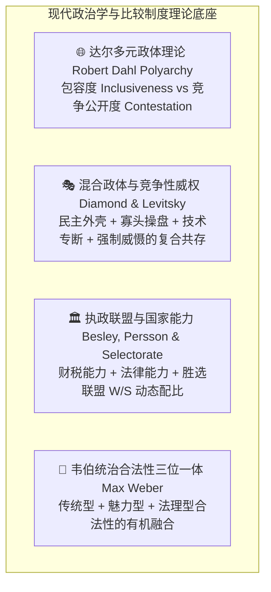
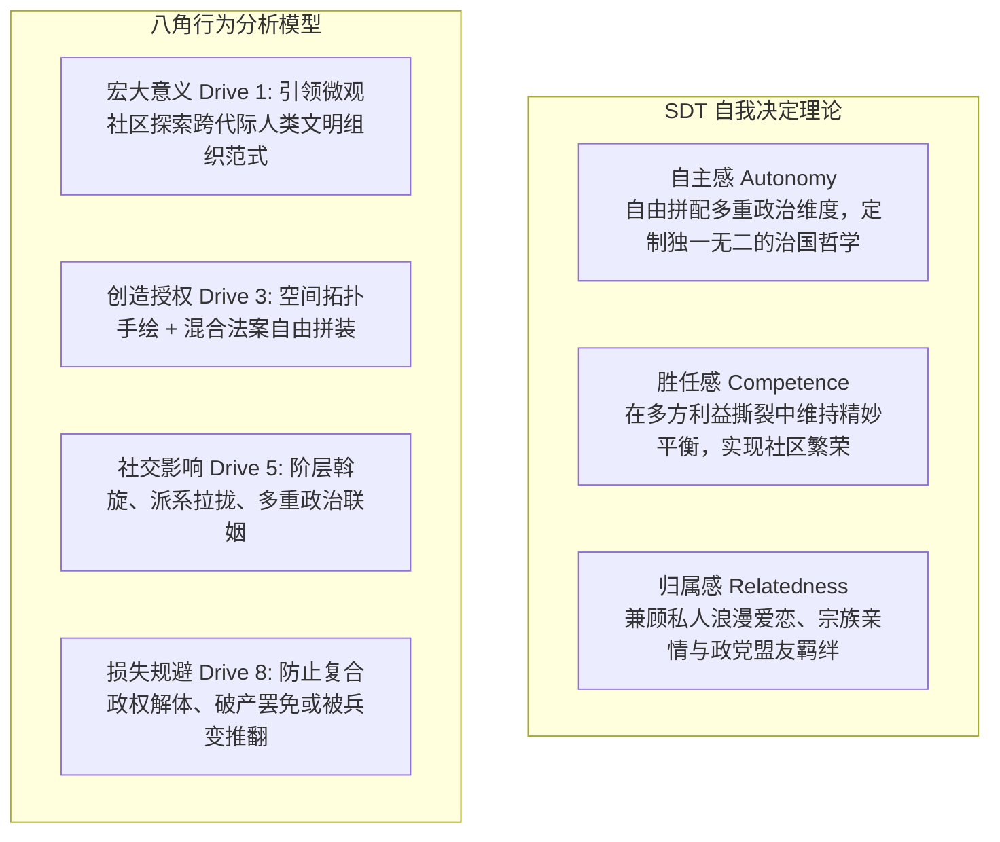
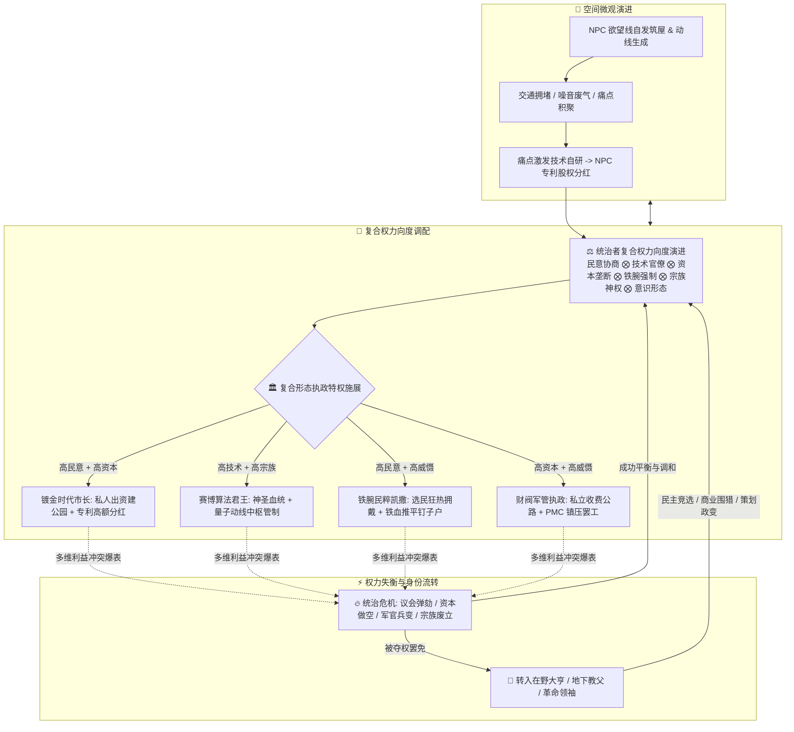
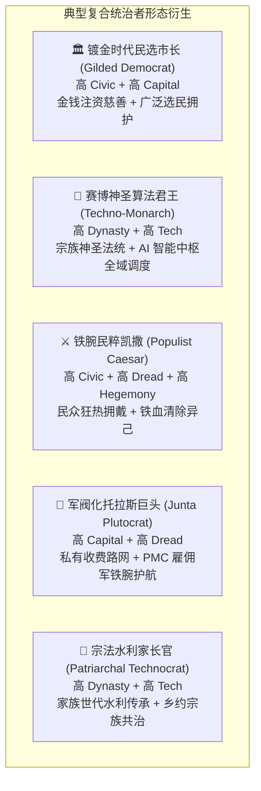
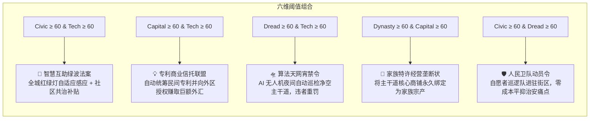
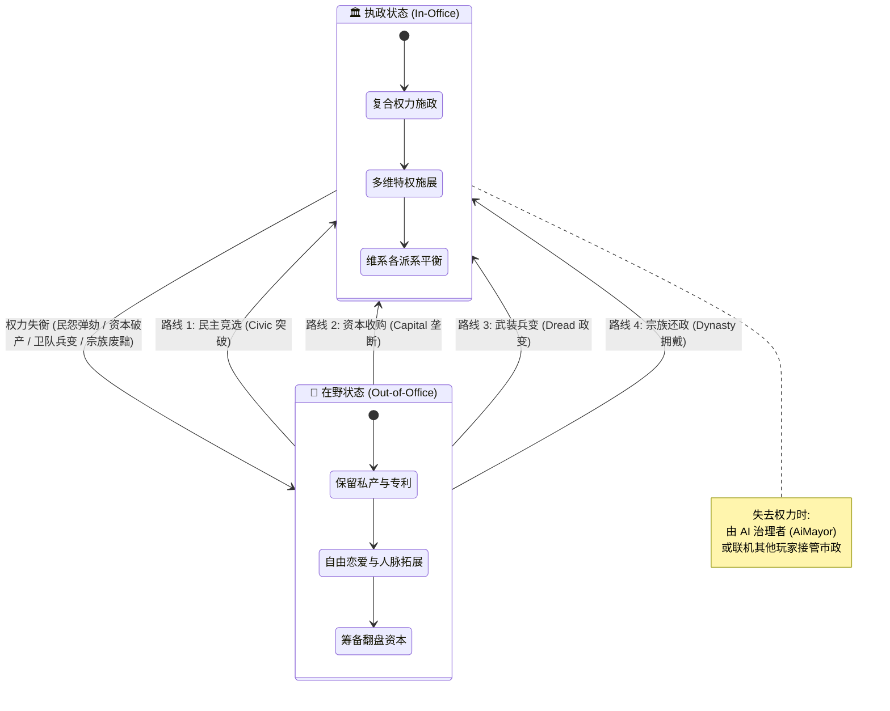
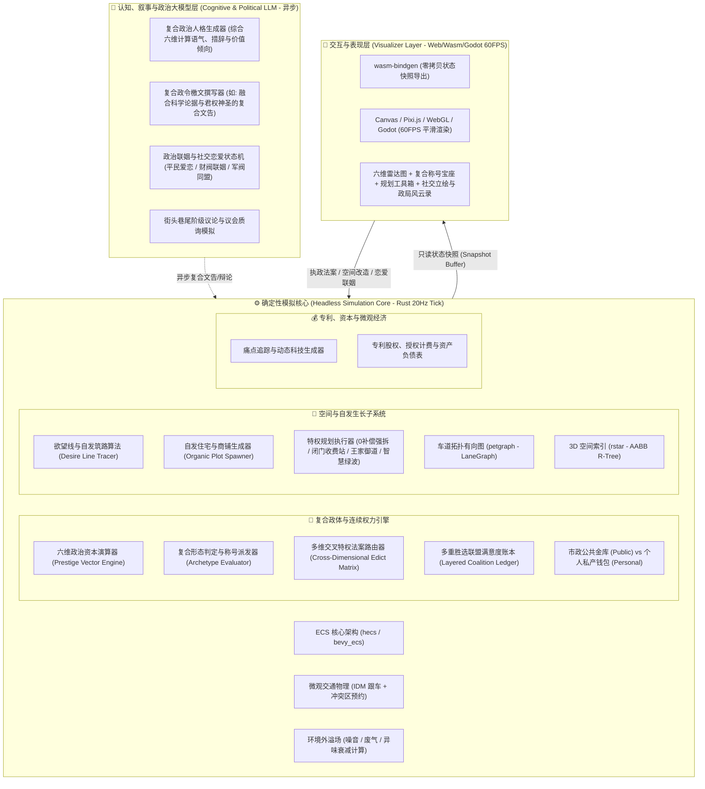
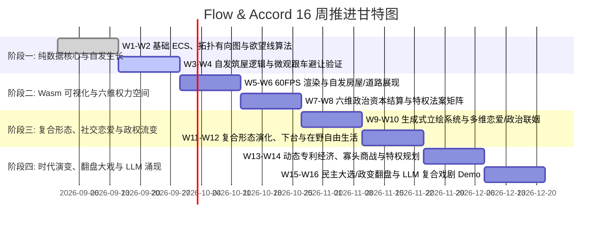

# 🌊 Flow & Accord（动线与协约）项目计划书
> **原项目代号**：Project OmnisCity  
> **核心定位**：社区尺度空间自发生长 × 微观动线与动态专利经济 × 现代混合政体光谱（兼具民主/技术/寡头/军阀/君主复合形态） × 生成式立绘社交恋爱引擎  
> **架构范式**：纯数据无头核心（Headless Core） + 表现层完全解耦 + 确定性 Tick 驱动 + 异步认知大模型驱动  

---

## 目录
1. [项目愿景与现代政治学设计哲学](#1-项目愿景与现代政治学设计哲学)
   - 1.1 [核心玩法体验愿景](#11-核心玩法体验愿景)
   - 1.2 [现代混合政体与国家能力理论框架（Hybrid Regimes & State Capacity）](#12-现代混合政体与国家能力理论框架hybrid-regimes--state-capacity)
   - 1.3 [游戏心理学理论指导框架（SDT & Octalysis）](#13-游戏心理学理论指导框架sdt--octalysis)
   - 1.4 [政体流转与社会演化大闭环（Core Gameplay Loop）](#14-政体流转与社会演化大闭环core-gameplay-loop)
2. [六维权力空间与复合统治者形态库](#2-六维权力空间与复合统治者形态库)
   - 2.1 [六维连续政治资本模型（Continuous Political Spectrum）](#21-六维连续政治资本模型continuous-political-spectrum)
   - 2.2 [非互斥复合统治者形态矩阵（Hybrid Ruler Archetypes）](#22-非互斥复合统治者形态矩阵hybrid-ruler-archetypes)
   - 2.3 [多维特权法案组合解锁机制（Multi-Dimensional Edict Matrix）](#23-多维特权法案组合解锁机制multi-dimensional-edict-matrix)
   - 2.4 [跨时代经济契合与复合制度演进谱系（Era Alignment）](#24-跨时代经济契合与复合制度演进谱系era-alignment)
   - 2.5 [执政与在野流变机制（政权交接、大选与政变）](#25-执政与在野流变机制政权交接大选与政变)
3. [系统架构与关键子系统设计](#3-系统架构与关键子系统设计)
   - 3.1 [分层架构设计](#31-分层架构设计)
   - 3.2 [空间自发生长与特权规划权（Organic Growth & Edict Planning）](#32-空间自发生长与特权规划权organic-growth--edict-planning)
   - 3.3 [痛点动态专利与微观资产经济（Patent & Equity Subsystem）](#33-痛点动态专利与微观资产经济patent--equity-subsystem)
   - 3.4 [生成式立绘社交、复合政治联姻与派系网络（Avatar & Romance）](#34-生成式立绘社交复合政治联姻与派系网络avatar--romance)
   - 3.5 [LLM 认知层：复合统治者宣誓、街头辩论与意识形态涌现](#35-llm-认知层复合统治者宣誓街头辩论与意识形态涌现)
   - 3.6 [关键技术栈](#36-关键技术栈)
4. [16周阶段里程碑与排期规划](#4-16周阶段里程碑与排期规划)
5. [核心风险与应对策略（工程 + 经济与复合政治博弈体验）](#5-核心风险与应对策略工程--经济与复合政治博弈体验)
6. [首周启动行动清单（Sprint 1 Action Items）](#6-首周启动行动清单sprint-1-action-items)

---

## 1. 项目愿景与现代政治学设计哲学

### 1.1 核心玩法体验愿景

《Flow & Accord》构筑了一个**微观空间动线、自发生态演化、微观专利经济与现代混合政体光谱深度交织的社区尺度微型社会**。

- **空间与微观自治**：居民（NPC）依据生活通勤“欲望线”自发筑屋拓路，痛点倒逼发明并持有专利股权。
- **权力向度的非互斥性（Non-Binary Hybrid Regimes）**：告别传统游戏非黑即白的政体标签（“纯民主” vs “纯独裁”）。在现代政治学中，统治者往往**兼具多种统治手段与合法性来源**——你可以既是受市民投票拥戴的“民选市长”，又是手握全城关键干道专利的“商业巨鳄”，同时依靠强力防暴特勤铁腕压制局部暴乱，甚至背靠古老宗族血统获得宗法尊崇。
- **复合执政体验与制度代价**：多重维度的兼具为玩家带来极高的策略组合自由度（如“技术+君主”的赛博神圣算法君王、“民主+寡头”的镀金时代市长），但不同维度的冲突也会引发复合反噬（如民意诉求与资本分红的撕裂）。

---

### 1.2 现代混合政体与国家能力理论框架（Hybrid Regimes & State Capacity）

本系统深度融入现代比较政治学与国家能力理论四大基石：



1. **混合政体理论（Hybrid Regimes & Competitive Authoritarianism - Diamond, Levitsky & Way）**：
   - 现代真实政体多处于完全民主与封闭独裁之间的广阔灰色光谱。
   - 统治者可以**同时动用合法选举（民主）、算法管网优化（技术）、专利垄断收益（寡头）、防暴特勤执法（威慑）与家族威望（宗族）**来维系统治秩序。
2. **国家能力与法理治理（State Capacity - Besley & Persson）**：
   - 治理不仅关乎意识形态，更关乎**基建规划落地能力、税收汲取效率与产权保护质量**。
3. **多重胜选联盟叠加（Layered Winning Coalitions）**：
   - 玩家的执政合法性不是单一群体的赋予，而是由**普通选民、极客工程师、商会股东、宗族长老与军警部队**等多方满意度加权合成。

---

### 1.3 游戏心理学理论指导框架（SDT & Octalysis）



---

### 1.4 政体流转与社会演化大闭环（Core Gameplay Loop）



---

## 2. 六维权力空间与复合统治者形态库

### 2.1 六维连续政治资本模型（Continuous Political Spectrum）

玩家在社区中的权力形态由**六维连续政治资本向量** $\vec{\mathcal{P}}$ 实时表征（每项取值范围 $0 \sim 100$）：

$$\vec{\mathcal{P}} = \langle \mathcal{P}_{\text{civic}}, \mathcal{P}_{\text{tech}}, \mathcal{P}_{\text{capital}}, \mathcal{P}_{\text{dread}}, \mathcal{P}_{\text{dynasty}}, \mathcal{P}_{\text{hegemony}} \rangle$$

```mermaid
radar-chart
    title 六维政治权力空间
    "民意协商 (Civic)" : 75
    "技术理性 (Tech)" : 85
    "资本寡头 (Capital)" : 60
    "铁腕强制 (Dread)" : 40
    "宗族血统 (Dynasty)" : 55
    "意识形态 (Hegemony)" : 70
```

1. **民意协商度（Civic Inclusiveness, $\mathcal{P}_{\text{civic}}$）**：源于公民投票满意度、公共品丰富度、草根议事参与度。
2. **技术理性度（Technocratic Rationality, $\mathcal{P}_{\text{tech}}$）**：源于自动化管网覆盖度、无死锁率、自研专利与算法效率。
3. **资本集中度（Plutocratic Concentration, $\mathcal{P}_{\text{capital}}$）**：源于个人及盟友专利估值、私有收费站租金、商会控制力。
4. **铁腕强制力（Coercive Dread, $\mathcal{P}_{\text{dread}}$）**：源于防暴治安武装规模、强拆执行力、宵禁与动线戒严严格度。
5. **宗法传承度（Dynastic Legitimacy, $\mathcal{P}_{\text{dynasty}}$）**：源于宗族辈分威望、家族世袭领地、历史神圣功勋与贵族血统。
6. **意识形态统御度（Ideological Hegemony, $\mathcal{P}_{\text{hegemony}}$）**：源于社区报刊/广播喇叭掌控力、神圣宗教/思想感召力、LLM 宣传话语主导权。

---

### 2.2 非互斥复合统治者形态矩阵（Hybrid Ruler Archetypes）

一个统治者可以**同时兼具多个维度的优势**，并在满足特定向度组合时，动态获得对应的**复合称号与组合统治被动**：



| 复合统治者形态 | 主导向度组合 | 权力运作模式与日常治理特征 | 复合执政专属收益 | 核心矛盾与撕裂点 |
| :--- | :--- | :--- | :--- | :--- |
| **🏛️ 镀金民选市长**<br>*(Gilded Democrat)* | $\mathcal{P}_{\text{civic}} \ge 60$<br>$\mathcal{P}_{\text{capital}} \ge 60$ | 一手抓选票一手抓钞票。利用名下专利分红大建公共公园，以金钱游说平息抗议。 | **政商双轨护航**：<br>大选支持率稳固，同时坐享私人专利帝国暴利。 | **利益输送暴雷**：若私有收费站被爆出侵害公共利益，民意将发生毁灭性断崖下跌。 |
| **🤖 赛博算法君王**<br>*(Techno-Monarch)* | $\mathcal{P}_{\text{dynasty}} \ge 60$<br>$\mathcal{P}_{\text{tech}} \ge 70$ | 将宗族神圣血统与量子交通算法结合。以“天命与科学”的双重威严发布神圣算法敕令。 | **全域极速调度**：<br>市民既视其为神明后裔，又信服其科技效率，道路改造阻力 -80%。 | **传统与革新冲突**：老派宗族遗老与前沿技术极客在继承人路线上爆发不可调和的派系斗争。 |
| **⚔️ 铁腕民粹凯撒**<br>*(Populist Caesar)* | $\mathcal{P}_{\text{civic}} \ge 65$<br>$\mathcal{P}_{\text{dread}} \ge 60$<br>$\mathcal{P}_{\text{hegemony}} \ge 60$ | 借助广场狂热演讲点燃大众情绪，以人民的名义宣布紧急军管，雷霆镇压投机奸商与钉子户。 | **绝对行动权威**：<br>0 补偿强拆阻碍主干道的建筑不仅不扣民意，反而大幅提高民粹狂热度。 | **法治崩塌与暴民政治**：一旦遭遇经济硬着陆，狂热民意会迅速演化为暴乱噬主。 |
| **🏢 军阀化托拉斯巨头**<br>*(Junta Plutocrat)* | $\mathcal{P}_{\text{capital}} \ge 70$<br>$\mathcal{P}_{\text{dread}} \ge 65$ | 建立纯粹的资本雇佣军统治。全城主干道私有化收费，防暴 PMC 荷枪实弹封锁抗税工人。 | **极致财政汲取**：<br>私库利润最大化，任何罢工企图均被迅速物理平息。 | **全城窒息与武装起义**：资本与人才大逃亡，底层极端组织策划高烈度市政厅爆破与刺杀。 |
| **🌾 宗族立宪调和人**<br>*(Patriarchal Mediator)* | $\mathcal{P}_{\text{dynasty}} \ge 60$<br>$\mathcal{P}_{\text{civic}} \ge 60$ | 依托百年世家声望调解邻里纠纷，主持祠堂公投与业主代表大会，实行德治与自治结合。 | **极高道德粘性**：<br>社区居民忠诚度极高，自发维护公物与道路整洁。 | **宗派裙带与排外**：外来新移民难以融入，引发新老居民空间权利对立。 |

---

### 2.3 多维特权法案组合解锁机制（Multi-Dimensional Edict Matrix）

特权法案（Edicts）不再按单一政体解锁，而是依据**六维政治向度的阈值交叉组合**解锁：



---

### 2.4 跨时代经济契合与复合制度演进谱系（Era Alignment）

在不同历史时代，六维向度的表现载体与复合形态自然契合时代的生产力与经济形态：

| 时代阶段 | 生产力与经济基础 | 典型复合形态 A（包容/技术向） | 典型复合形态 B（寡头/强制向） | 典型复合形态 C（宗法/神权向） |
| :--- | :--- | :--- | :--- | :--- |
| **🌾 农耕时代** | 水权、土地、牛马车队、宗法宗祠 | **水利乡约公社**（Civic + Tech）<br>修渠筑坝，乡绅自治议事 | **坞堡粮帮霸主**（Capital + Dread）<br>私设过路关卡，家丁武装护粮 | **神圣宗族世袭族长**（Dynasty + Hegemony）<br>宗祠族规，祖训御赐水权 |
| **🏭 工业时代** | 煤铁、蒸汽机车、铁路路权、工会 | **市政工程师议会**（Civic + Tech）<br>标准公制道路，平价公共交通 | **铁路托拉斯军政长官**（Capital + Dread）<br>垄断铁路线路，私家骑警镇压工运 | **立宪君主重工世家**（Dynasty + Capital）<br>王室持股巨型矿业，特许专营 |
| **🏙️ 现代社区** | 沥青路网、燃油/电车、物业产权 | **智慧社区管委会**（Civic + Tech）<br>APP 民主报修，绿波算法自适应 | **物业安保联合财阀**（Capital + Dread）<br>高额停车抬杆费，特勤驱逐抗议者 | **名门家族信托理事长**（Dynasty + Capital）<br>老钱家族控股街区商业街与学校 |
| **🌌 赛博巨构** | 悬浮航线、算力矩阵、义体安保 | **网络全域 DAO 调度者**（Civic + Tech）<br>量子算力实时公投，动态分配空域 | **义体 PMC 财阀最高执政官**（Capital + Dread）<br>高空快速路专属通行权，机甲封锁底层 | **基因神圣克隆算力君主**（Dynasty + Tech）<br>纯血始祖基因库，算力神权网络 |

---

### 2.5 执政与在野流变机制（政权交接、大选与政变）

无论玩家构建出何种复杂的复合形态，政权更迭始终遵循动态平衡：



---

## 3. 系统架构与关键子系统设计

### 3.1 分层架构设计



---

### 3.2 空间自发生长与特权规划权（Organic Growth & Edict Planning）

在 ECS 中，根据六维向量动态组合玩家的规划权限：

```rust
// 六维政治向度与规划特权组合
pub struct GovernanceSpectrum {
    pub civic: f32,      // 0.0 ~ 100.0 (民意)
    pub tech: f32,       // 0.0 ~ 100.0 (技术)
    pub capital: f32,    // 0.0 ~ 100.0 (资本)
    pub dread: f32,      // 0.0 ~ 100.0 (强制)
    pub dynasty: f32,    // 0.0 ~ 100.0 (宗法)
    pub hegemony: f32,   // 0.0 ~ 100.0 (意识形态)
}

impl GovernanceSpectrum {
    // 动态研判是否具备特定特权
    pub fn can_instant_demolish(&self) -> bool {
        self.dread >= 60.0 || (self.civic >= 70.0 && self.hegemony >= 60.0) // 军阀或民粹凯撒
    }
    
    pub fn can_build_private_toll(&self) -> bool {
        self.capital >= 60.0 // 具备资本寡头实力
    }
    
    pub fn can_auto_sync_greenwave(&self) -> bool {
        self.tech >= 60.0 // 具备技术官僚实力
    }

    pub fn can_declare_royal_reserve(&self) -> bool {
        self.dynasty >= 60.0 // 具备宗法王室法统
    }
}
```

---

### 3.3 痛点动态专利与微观资产经济（Patent & Equity Subsystem）

- **技术向度高**：推动专利标准化与公共网络互联，极大提升全区通行流动性。
- **资本向度高**：允许将专利打包为信托基金，在市场上做空对手，收取高额垄断通行租金。
- **宗法向度高**：专利可作为家族“传家宝”世袭继承，绑定宗族产业。
- **强制向度高**：以国家安全/战备名义强制无偿征用关键专利。

---

### 3.4 生成式立绘社交、复合政治联姻与派系网络（Avatar & Romance）

1. **生成式立绘表征（Generative Visual Genome）**：
   - NPC 依据所属阶层佩戴动态阶级徽章（工会勋章、商会领结、学者怀表、军官肩章、王室冠冕）。
2. **多向度社交与战略联姻**：
   - 玩家可自由追求任何 NPC，亦可基于复合统治策略推进政治联姻：
     - *与工会领袖恋爱* $\rightarrow$ 暴涨 $\mathcal{P}_{\text{civic}}$，免疫罢工；
     - *与军火/安保千金恋爱* $\rightarrow$ 暴涨 $\mathcal{P}_{\text{dread}}$，武装部队军费减半；
     - *与专利巨头贵公子恋爱* $\rightarrow$ 暴涨 $\mathcal{P}_{\text{capital}}$，全城专利分红共享；
     - *与宗族老王爷后裔恋爱* $\rightarrow$ 暴涨 $\mathcal{P}_{\text{dynasty}}$，继承古老封邑地权。

---

### 3.5 LLM 认知层：复合统治者宣誓、街头辩论与意识形态涌现

分层 LLM 会根据玩家当前的六维具体数值，自动合成极具个性与戏剧张力的复合文风：

- **当玩家是“高技术 + 高君主”的赛博神圣君王时**：
  > *LLM 生成的法令公告*：“奉天承运，王上御鉴：量子超算中枢已推演全城最优动线流场。兹命第三街区于今夜子时完成管线智能重构，顺天应理，钦此。”
- **当玩家是“高民意 + 高资本”的镀金民选市长时**：
  > *LLM 生成的演讲文告*：“亲爱的街坊邻里们！本人名下产业本季度分红已全额捐入‘社区绿色干线基金’！我们将用最优质的沥青重铺南区主干道，让每一位市民享受繁荣红利！”
- **当玩家是“高强制 + 高民粹”的铁腕凯撒时**：
  > *LLM 生成的动员令*：“全体公民们！阻碍我们救护动线的那座违建别墅已被防暴队依法推平！人民的通行权神圣不可侵犯，任何敢于挑战秩序者皆是全城公敌！”

---

### 3.6 关键技术栈

| 模块 | 技术选型 | 选用理由与体验支撑 |
| :--- | :--- | :--- |
| **Core 逻辑核心** | **Rust** (`hecs`/`bevy_ecs`, `petgraph`, `rstar`, `serde`) | **极致性能与确定性**：无 GC 停顿，支撑六维连续权力空间、复合特权动态路由与 20Hz 微观物理仿真。 |
| **Hybrid Political Engine** | **Rust 连续向量空间 + 多重胜选联盟清算模型** | 毫秒级计算六维向度动态衰减、法案组合生效与政变动员率。 |
| **Generative Avatar & UI** | **Canvas 2D / WebGL 模块化分层合成 + 六维雷达图透视** | 极速拼装阶级立绘，六维动态雷达图直观展现权力倾斜。 |
| **Cognitive / LLM** | **Local GGUF (轻量模型) / Cloud API + 严格 JSON Schema** | **复合语气生成**：根据六维权重精准合成兼具多重视角的政令、情书与议会辩论词。 |

---

## 4. 16周阶段里程碑与排期规划



---

### 阶段一：纯数据核心、拓扑骨架与自发生长算法（Weeks 1 – 4）
> **体验目标**：建立自发空间演化的物理数学基础，验证“人走多了自然成为路”的生命感。

#### 📅 W1 – W2：基础数据结构与欲望线追踪（Headless）
- [ ] 初始化 Rust Cargo Workspace（`sim_core`, `sim_wasm`, `sim_cli`）。
- [ ] 定义基础 ECS 组件：`Position3D`, `MotionState`, `AgentIdentity`, `AvatarGenome`, `PersonalWallet`, `PublicTreasury`。
- [ ] 抽象 `LaneGraph`（基于 `petgraph`）与 3D AABB 空间索引（基于 `rstar`）。
- [ ] 实现 **Desire Line 算法**：记录无道路区域的行走热度网格，热度超标自动衍生基础土路拓扑边。

#### 📅 W3 – W4：自发筑屋逻辑与交通冲突区预约
- [ ] 实现 NPC 自发选址与建筑生成逻辑（`OrganicPlotSpawner`）。
- [ ] 实现微观跟车（IDM）与路口冲突区预约系统（Reservation FIFO），保证自生路网下的无死锁通行。
- [ ] **自动化测试验收**：编写单测模拟 50 个 NPC 在空地上自发踩出路网并自建 20 栋房屋，交通运转 10,000 Tick 无崩溃。

---

### 阶段二：Wasm 可视化与六维权力空间（Weeks 5 – 8）
> **体验目标**：所见即所得的微观社区生活画卷，初窥六维政治资本的动态起伏与特权规划快感。

#### 📅 W5 – W6：Wasm 状态导出与 60FPS 渲染
- [ ] 导出核心快照（房屋轮廓、道路等级、车辆/行人位置与航向）。
- [ ] 前端（Vite + TypeScript + Canvas/Pixi.js）实现社区视口漫游与 60 FPS 插值平滑渲染。

#### 📅 W7 – W8：六维政治资本结算与特权法案矩阵
- [ ] 实现 **六维政治资本演算引擎（PrestigeVectorEngine）**：依据市民满意度、算法效率、专利财富、治安防暴、宗族声望与宣传矩阵动态输出六维数值。
- [ ] 实现 **特权法案组合解锁器（EdictUnlockMatrix）**：多维阈值交叉解锁智慧绿波、私立收费站、人民卫队、王家御道等指令。

---

### 阶段三：复合形态、社交恋爱与政权流变（Weeks 9 – 12）
> **体验目标**：让社区充满爱恨情仇与多维权谋，体验从单一执政到复合兼具、以及下台在野东山再起的传奇。

#### 📅 W9 – W10：生成式立绘系统与多维恋爱/政治联姻
- [ ] 实现基于基因种子的 **生成式 2D 立绘合成管线**（根据阶层徽章动态追加服饰配件）。
- [ ] 建立 NPC 交互面板：展示立绘、生活履历、所属派系与好感度条。
- [ ] 编写社交恋爱与多维战略联姻状态机（工会联姻、财阀联姻、军警联姻、王室联姻）。

#### 📅 W11 – W12：复合形态演化、下台与在野自由生活
- [ ] 实现复合统治者称号判定机（镀金市长、算法君王、民粹凯撒等动态形态）。
- [ ] 完善执政失败流转逻辑：公投罢免或政变废黜后，由 AI 治理者（AiMayor）接管，玩家保留私产转入在野大亨/地下领袖状态。

---

### 阶段四：时代演变、翻盘大戏与 LLM 涌现（Weeks 13 – 16）
> **体验目标**：打通跨时代复合制度演化与权谋翻盘大戏，体验“专利商战 $\rightarrow$ 民主竞选 $\rightarrow$ 铁血兵变 $\rightarrow$ 算法加冕”的完整史诗。

#### 📅 W13 – W14：动态专利经济、寡头商战与特权规划
- [ ] 痛点聚类自动合成科技方案，NPC 自主或众筹出资点亮。
- [ ] 专利确权写入股东资产表，支持在野做空收购、垄断收费或特权征用。
- [ ] 落地道路私有化收费站、王室采邑区与军管宵禁路障。

#### 📅 W15 – W16：大选/政变翻盘闭环与 LLM 复合戏剧 Demo
- [ ] **多轨翻盘系统**：实现民主大选注资拉票、商业做空围猎、武装政变占领等多种重夺政权路径。
- [ ] **LLM 异步复合政令与戏剧集成**：
  - 自动生成符合当前复合向度的文告（如科学神权文告、民粹动员令）。
  - 生成街头巷尾阶级议论与议会质询。
- [ ] **交付物与展示**：打包输出完整 Demo，生动呈现从农耕水利公社到赛博算法王国的波澜壮阔演进全貌。

---

## 5. 核心风险与应对策略（工程 + 经济与复合政治博弈体验）

| 风险类别 | 风险表现 | 心理学/体验与工程后果 | 应对与规避策略 |
| :--- | :--- | :--- | :--- |
| **维度全满导致数值通胀** | 玩家在中后期把六维属性全刷满，成为“全知全能神”，失去策略抉择。 | 丧失权衡（Trade-off）乐趣，游戏体验扁平化。 | **向度拮抗与边际消耗机制**：<br>1. 某些维度天然存在摩擦系数（如极度推行强制 $\mathcal{P}_{\text{dread}}$ 会天然侵蚀民意 $\mathcal{P}_{\text{civic}}$）。<br>2. 高数值维持需要高昂的日常维护成本（军费开支、舆论公关费）。 |
| **复合称号过于晦涩** | 玩家不清楚当前处于何种形态，无法预判特权解锁条件。 | 认知负荷过载，界面杂乱。 | **直观六维雷达图 + 称号高亮卡片**：UI 上以彩色雷达图直观呈现，并清晰展示“下一形态距离所需维度的差值”。 |
| **LLM 复合语气紊乱** | LLM 在处理多重身份时产生逻辑自相矛盾或语言错乱。 | 破坏角色扮演沉浸感。 | **结构化 Prompt 多权重插值**：明确指定主辅基调（如 70% 严谨科学论述 + 30% 皇家威严祈使句）。 |
| **AI 治理接管破坏城市** | 玩家下台后，AI 治理者过度胡乱改造破坏玩家心血。 | 产生强烈的挫败感。 | AI 默认采用“保守维稳算法”，优先保障交通基本通行与财政平衡，不擅自强拆高等级建筑。 |

---

## 6. 首周启动行动清单（Sprint 1 Action Items）

> [!TIP]
> 第一周核心聚焦于建立干净、高性能的 Rust 数据基础结构，同时在 Agent 与空间网格中预留“六维政治资本”、“欲望线热度”、“私产/公库隔离”与“生成式形象种子”接口。

- [ ] **环境与工程脚手架**
  - [ ] 初始化 Cargo 工作区 `sim_core`，配置最新稳定版 Rust 工具链。
  - [ ] 配置核心依赖项：`hecs = "0.10"`, `petgraph = "0.6"`, `rstar = "0.12"`, `serde = { version = "1.0", features = ["derive"] }`。
- [ ] **核心数据模型定义（预留六维权力空间、私产与社交接口）**
  - [ ] 定义基础强类型 ID：`LaneId(u64)`, `IntersectionId(u64)`, `AgentId(u64)`, `PlotId(u64)`, `PatentId(u64)`。
  - [ ] 定义六维政治资本组件：
    ```rust
    pub struct GovernanceSpectrum {
        pub civic: f32,      // 民意协商
        pub tech: f32,       // 技术理性
        pub capital: f32,    // 资本寡头
        pub dread: f32,      // 铁腕强制
        pub dynasty: f32,    // 宗法传承
        pub hegemony: f32,   // 意识形态
    }
    ```
  - [ ] 定义基础 Agent 组件：
    - `Position3D`、`MotionState`（物理移动）
    - `AvatarGenome { seed: u64, gender: u8, style_traits: u32, class_rank: u8 }`（生成式立绘与阶级种子）
    - `PersonalityProfile`、`AffectionState`（性格与好感度）
    - `PersonalWallet`（私有财富，下台不损失）、`PainRecord`（痛点记录）
  - [ ] 定义空间拓扑结构：`LaneNode`、`LaneEdge`、`DesireGrid`（欲望线热度网格）。
  - [ ] 定义政权实体组件：`RegimeEntity { spectrum: GovernanceSpectrum, treasury: u64 }`。
- [ ] **首个可运行单元测试（Unit Test）**
  - [ ] 编写测试用例 `test_desire_line_to_lane_generation`：模拟多个 Agent 在空地网格上频繁沿直线往返，验证热度累积达到阈值后自动在 `LaneGraph` 中插入新的车道拓扑边。
