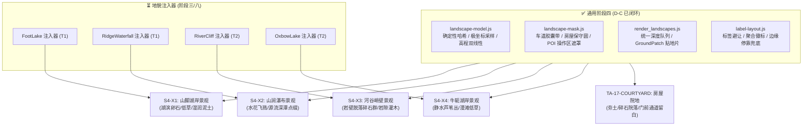

# STAGE-04-SUBFEATURE-LANDSCAPES-TODO · 地图模板阶段四特定地貌专属景观群与院地任务列表

> **定位与前置关系**：
> - 本文件继承自原 `STAGE-04-TODO.md`；
> - **通用阶段四（D-C）已收口交付（v1.50.46~53，S4-01~S4-08 全闭环）**：Water/Wood/Berry/Stone/Gold 五类通用 POI 派生景观群、最终世界几何遮罩自适应避让（车道/房屋/POI 操作区）、标签候选布局、同类房屋编号聚合徽标（`🏠 N舍`）、选中/悬浮双目标强制保留与边缘停靠虚线引线兜底全部落地。通用架构与机制实现详见 [16-frontend-overview.md](docs/current/tech/16-frontend-overview.md) §2.16～§2.18。
> - **本文范围**：聚焦特定地貌专属景观群（S4-X1～X4）与房屋院地（TA-17 院地部分）的待完成任务、前置依赖条件、技术接入规范与验收标准。

---

## 1. 待完成任务列表

| 状态 | 任务 ID | 交付物 | 直接前置条件 | 关联设计/计划 |
| :---: | :--- | :--- | :--- | :--- |
| [ ] | **S4-X1** | **山脚湖岸专属景观** | 阶段三/八 FootLake 几何注入器验收 + 真实 WaterBody 特征 | [06 号文](docs/plan/tech/06-terrain-templates.md) §5.4.A |
| [ ] | **S4-X2** | **山涧瀑布专属景观** | 阶段三/八 RidgeWaterfall 注入器验收 + 供水/尺度契约 | [06 号文](docs/plan/tech/06-terrain-templates.md) §5.4.B |
| [ ] | **S4-X3** | **河谷峭壁专属景观** | 阶段三/八 RiverCliff 注入器验收 + 侧壁尺度探针准入 | [06 号文](docs/plan/tech/06-terrain-templates.md) §5.4.D |
| [ ] | **S4-X4** | **牛轭湖岸专属景观** | 阶段三/八 OxbowLake 注入器验收 + R0-4 几何贯通 | [06 号文](docs/plan/tech/06-terrain-templates.md) §5.4.C |
| [ ] | **TA-17-COURTYARD** | **聚落房屋院地与门前留白** | 房屋实际朝向与门洞矢量或保守门前走廊通道确认 | [07 号文](docs/plan/tech/07-terrain-art.md) §8 |



---

## 2. 核心技术规范与接入契约

### 2.1 地貌事实与关联铁律
1. **真实特征关联**：各地貌景观群必须读取内核下发的真实 `TerrainSubFeature`（或关联的 `WaterBody` / `River` / `Cliff` 轮廓），**禁止选择器命中即生成景观**（选择器命中 ≠ 几何成功注入）。若注入因坡度/空间冲突被拒绝，表现层绝对不生成孤立景观。
2. **严禁虚构水体与资源**：
   - 山脚湖与牛轭湖的 `WaterBody` 属性为 `resource_pool_id = 0`（静态非采水水体），**严禁**为其生成取水入口、`WaterAccessPoint` 或库存环标签；
   - 景观群纯属视觉构图点缀，严禁改变地表可通行性（`NO_WALK`）或可建性（`NO_BUILD`）。

### 2.2 景观模型派生复用 (`landscape-model.js`)
特定地貌景观群完整复用通用景观的数据流水线：
- **数据结构**：
  ```text
  LandscapeGroup {
    key: "subfeature:<kind>:<id>",
    recipe, recipeVersion, anchor, geometrySignature, children[], bounds
  }
  LandscapeChild {
    key: "subfeature:<kind>:<id>/<role>/<slot>",
    modelKind, visualSeed, dx, dy, x, y, z, rot, scale, footprint, bounds, stockRole: 'skeleton'
  }
  ```
- **哈希种子派生**：子图元种子由世界 `seed`、`subFeature.id`、地貌固定盐值、`role` 与 `slot` 经 MurmurHash3 纯整数算法派生，保证跨平台、同种子逐字节绝对复现；禁止消费 `Math.random` 或 `WorldRng`。
- **高程落地与坡度校验**：沿用双线性插值采样静态高程场；贴地片落点坡度 > 16° 时整片拒绝（防止悬浮穿山）。

### 2.3 几何遮罩自适应避让复用 (`landscape-mask.js`)
- 专属景观子图元必须受 `LandscapeMask` 保护区约束：
  - 自动避让穿经湖岸或峭壁脚下的车道贝塞尔采样胶囊带；
  - 自动避让邻近营地、房屋及采收 POI 的操作保护区；
  - 空间网格分桶（`binSize` 96）窄相检测，不引入全量扫描。
- 去重优先级：特定地貌景观 ≥ 通用 POI 景观 > 基础 accents 装饰。

### 2.4 房屋院地接入规范 (TA-17 院地部分)
- 房屋院地仅作为私宅建筑落地的贴地图元补充（类似于 POI 底座与营地暖光），走地面 pass 绘制；
- 必须严格避让车道与门前出入路径，不得与主干道重叠；
- 随房屋等级（Tier 1~5）及耐久度状态变化（如破损废弃时杂草丛生、高阶庄园拥有平整铺石地面），但严禁修改物理占地判定。

---

## 3. 待办任务详细规格

### 3.1 S4-X1 · 山脚湖岸专属景观
- **前置依赖**：[06 号文](docs/plan/tech/06-terrain-templates.md) §5.4.A `FootLake` 注入器交付，且快照包含闭合湖面轮廓与湖岸 `GeoCell` 标志位。
- **配方设计**：
  - 湖滨沿岸带极坐标散布陆侧岸石（`RockCluster`）与丛草（`GrassTuft`）；
  - 水陆交界处铺设狭长贴地湿润土片（`wet` 贴地色差片），沿真水面多边形法线陆侧外扩，禁止伸入深水区；
  - 湖面静止无采水作业区，HUD 资源统计不计入。

### 3.2 S4-X2 · 山涧瀑布专属景观
- **前置依赖**：[06 号文](docs/plan/tech/06-terrain-templates.md) §5.4.B `RidgeWaterfall` 注入器交付，明确 source（水源跌落点）与 basin（下方承接水潭）高程差 ≥ 8m。
- **配方设计**：
  - 上游跌水处：两侧收口花岗岩露头巨石；
  - 下游深潭处：环形低草与湿润卵石堆，中央受水区微水花扩散图元（纯表现层，走墙钟驱动微动画）；
  - 跌落崖面：若高差显著，绘制垂直水幕拉伸图元与水雾遮罩，不阻挡前景树木。

### 3.3 S4-X3 · 河谷峭壁专属景观
- **前置依赖**：[06 号文](docs/plan/tech/06-terrain-templates.md) §5.4.D `RiverCliff` 注入器交付，且崖壁离散尺度探针准入通过。
- **配方设计**：
  - 峭壁基底脚线：脱落碎石堆（`RockCluster`）与抗旱岩隙灌木（`Bush`），强化深切河谷峡谷感；
  - 绝壁垂直段：依托连续坡度法线受光与岩壁材质，严禁悬挂浮空树木；
  - 避让走廊：峭壁脚下若紧贴主干车道，严格执行车道胶囊遮罩，碎石图元不得侵入车道路面。

### 3.4 S4-X4 · 牛轭湖岸专属景观
- **前置依赖**：[06 号文](docs/plan/tech/06-terrain-templates.md) §5.4.C `OxbowLake` 注入器交付，河道截弯取直断开后残留静水月牙水体。
- **配方设计**：
  - 遗留静水沿岸散布密集丛草（`GrassTuft`）与湿地水草斑块；
  - 与主河道隔断的砂坝处生成淤砂贴地色带（`SoftGround` 色差片）；
  - 保持静水镜面反光，无游鱼群与流水波光（与主河 `river_life.js` 巡航游鱼区分）。

### 3.5 TA-17-COURTYARD · 聚落房屋院地与门前留白
- **前置依赖**：确认房屋正面朝向与出入口向量坐标。
- **配方设计**：
  - 房屋基座下方及侧后方生成贴地院地碎片（Tier 1 杂草夯土 / Tier 2~3 压实碎石 / Tier 4~5 规则石板地面）；
  - 正面保留 3~5 米门前通道空白，连接附近主干道路网；
  - 院地随房屋升降级、摧毁与修缮实时更新，不改变房屋包围盒物理尺寸。

---

## 4. 验收门禁与发布标准

每项专属景观在开发完成时需通过以下统一验收门禁：

1. **模拟隔离**：开启/关闭专属景观，同种子创世与推进 600 ticks 的地形高程、坡度、地表类别、路网拓扑、Agent 行为及家户账本**逐字节差分恒为 0**；
2. **确定性与无串味**：同种子多次加载、世界重置（RESET）、读档（LOAD）后景观几何与坐标 100% 逐位复现；换世界后旧地貌景观缓存彻底清除，零残留；
3. **避让无违例**：车道保护区与房屋保护区内禁入图元违例为 0；
4. **性能预算**：新增专属景观绘制链路在 60FPS 下主线程增量消耗 p95 ≤ 0.5ms（整套景观系统 p95 ≤ 3.0ms）；
5. **代码规范**：严格遵守单文件 800 行红线（根 AGENTS.md §4.6）；临时验证脚本/断言按 §4.10 使用后删除。
