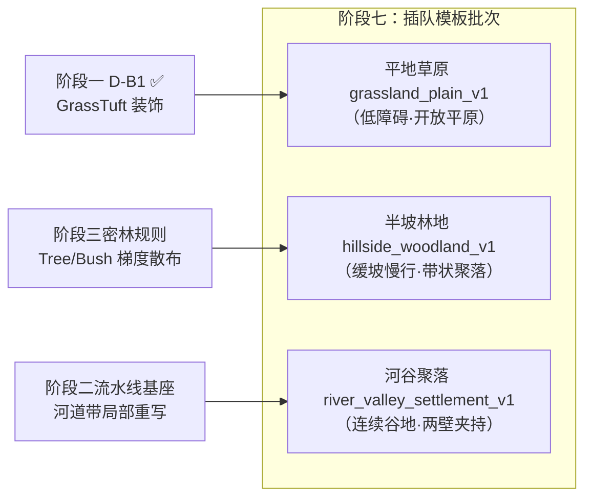

# STAGE-07-TODO · 地图模板阶段七（插队模板批次）实施方案与任务序列

> **任务定义**：[06-terrain-templates.md](docs/plan/tech/06-terrain-templates.md) R.3 阶段七——**插队模板批次（平地草原 `grassland_plain_v1`、半坡林地 `hillside_woodland_v1`、河谷聚落 `river_valley_settlement_v1`）**。
> 本文件将阶段七的总体设计、数学模型、水文与地表规则、探针指标及全链路工程实施拆解为标准可执行任务序列（S7-01 ～ S7-10）。
> **状态**：实施中——S7-01 探针基座已交付（✅ v1.50.39）；S7-02 起待实施。
> **前置就绪度**：
> - 平地草原：依赖阶段一 `GrassTuft` 装饰（✅ v1.50.35 D-B1 代码交付已收口，见 06 号 §18.5），具备独立开工条件；
> - 半坡林地：依赖「密林山坡」装饰散布规则（纯视觉 Tree/Bush 高密散布，可随本阶段先行落地）；
> - 河谷聚落：依赖阶段二（生成组合基座：流水线重构与水系带局部写入）。
>
> **难度**：中高（涉及 3 张全新 profile 高程场数学构建、坡度与建造约束校准、地形探针 60 种子矩阵诊断、装饰纯视觉铁律、FABS/快照/存读档/配置系统全链路同步）。
> **范围纪律**：
> 1. **旧世界逐字节不变**：新 profile 必须完全解耦，严禁污染或改变既有 T1 `mountain_pass_v1` 与 T2 `river_valley_v1` 在同种子下的高程、坡度、地表、水系、POI、路网及装饰输出。
> 2. **RNG 隔离与确定性**：新增地貌与装饰只消费独立局部 RNG 或基于 `mix64` 的确定性哈希，绝对禁止消费模拟主 `WorldRng`，保证 POI/始祖/出生消费序列不变。
> 3. **装饰纯视觉铁律**：林地和草甸是纯视觉装饰，不产生物理碰撞、不写 `NO_WALK`/`NO_BUILD`；开启/关闭装饰时路网节点、车道几何与 POI 坐标逐位全等。
> 4. **持久化测试禁令**：严格遵循根 AGENTS.md §4.10，不提交任何 `#[cfg(test)]` 或单元测试文件；自动化验证走 `test-wasm.js`、`test-determinism.js`、`config-check.js` 与 `terrain_probe`。

---

## 目录

- **一、阶段七总体实施方案**
  - 1.1 三张模板设计意图与空间范式对比
  - 1.2 模板高程场与水文数学模型
  - 1.3 装饰散布与视觉辨识度保障
  - 1.4 探针诊断与有效世界门禁基线
  - 1.5 跨模块依赖与全链路同步契约
- **二、任务序列总览**
- **三、任务明细（S7-01 ～ S7-10）**
- **四、验收门禁与退出标准**

---

## 一、阶段七总体实施方案

### 1.1 三张模板设计意图与空间范式对比

阶段七聚合了 3 张在聚落空间分布、通行阻碍与生活取舍上风格迥异的全新地图模板，旨在打破原先仅有「山口点状汇聚」与「河谷两岸对置」的二元格局：

| 模板 | Profile 标识 | 地理构形与核心玩法 | 通行与建造约束 | 聚落涌现形态 |
| :--- | :--- | :--- | :--- | :--- |
| **平地草原** | `grassland_plain_v1` | **低障碍开阔平原**：基础低起伏倾斜 + 1~2 处孤立缓坡残丘 + 泉溪洼地。无硬禁行，无水面切断。 | 全图 $90\%+$ 坡度 $< 10^\circ$；微量软地（1.25× 慢行）；可建面积 $\ge 85\%$。 | **自由放射状**：选址完全脱离地形避让，聚落中心完全由水源与踩踏自组织涌现。 |
| **半坡林地** | `hillside_woodland_v1` | **单侧不对称缓坡山体**：迎风缓（$< 14^\circ$）、背风较陡（$18^\circ\sim 28^\circ$）。全域坡度严格 $< 30^\circ$，不设硬禁行主脊。 | 坡度产生真实慢行；$> 16^\circ$ 禁建；林地纯视觉可穿行；坡脚有平缓可建带。 | **等高线带状**：房屋自然压入坡脚与林缘平缓带，居民在坡面林地采集与坡脚居住之间权衡。 |
| **河谷聚落** | `river_valley_settlement_v1` | **深切连续走廊**：两侧连续陡峭侧壁（$> 34^\circ$ 形成硬禁行石墙），中央为开阔冲积谷底与主河。 | 侧壁硬禁行阻断横向穿越；跨河强制走浅滩；谷底河阶肥力高（0.95）。 | **沿河双侧长带状**：人群与主干道被两侧山壁紧紧压在狭长谷底，跨河交往依赖两处浅滩。 |



---

### 1.2 模板高程场与水文数学模型

#### A. 平地草原 (`grassland_plain_v1`)
1. **基础地势**：低倾斜大势与微幅谐波
   - 倾角 $\theta_{\text{tilt}} \in [0, 2\pi)$，幅值 $M_{\text{tilt}} \in [15.0\text{m}, 25.0\text{m}]$（远低于 T1 的 60m）。
   - 宏观谐波 $A_1 \approx 1.8\text{m}, \lambda_1 \approx 200\text{m}$；中观谐波 $A_2 \approx 0.8\text{m}, \lambda_2 \approx 80\text{m}$。
2. **孤立残丘（Mounds）**：
   - 数量：$1\sim 2$ 处，由 `relief_rng` 随机落位在距中心 $0.15\sim 0.35 \times \text{size}$ 的陆区。
   - 高斯轮廓：$H_{\text{mound}}(x, y) = A_m \cdot \exp\left(-\frac{(x - x_m)^2 + (y - y_m)^2}{2 R_m^2}\right)$。
   - 参数约束：$A_m \in [6.0\text{m}, 10.0\text{m}]$，$R_m \in [45\text{m}, 65\text{m}]$。峰值坡度约 $\frac{A_m}{R_m \sqrt{e}} \approx 8^\circ\sim 14^\circ$，严格低于建造门禁 $16^\circ$，作为视觉远景地标而不产生任何通行屏障。
3. **泉溪洼地（Spring Depression）**：
   - 局部微凹地：椭圆凹陷深度 $1.5\sim 2.5\text{m}$，半径 $25\sim 35\text{m}$，边缘平滑过渡。
   - 水源安置：复用既有 `SpringValley` / `WaterPool` 语义，放置 $2\sim 4$ 处清泉 POI，绑定 `WaterPool #1`，**不生成阻断通行的深水面或河道**，保持「一望无际」的开阔视野。

#### B. 半坡林地 (`hillside_woodland_v1`)
1. **不对称主坡数学公式**：
   - 定义倾斜投影轴：沿脊方向 $\text{along} = wx \cdot \cos\theta + wy \cdot \sin\theta$，法向横截面 $\text{across} = -wx \cdot \sin\theta + wy \cdot \cos\theta - \text{offset}$。
   - 分段非对称衰减：
     $$H_{\text{slope}}(\text{across}) = \begin{cases}
       A_s \cdot \exp\left(-\frac{\text{across}^2}{2 W_{\text{wind}}^2}\right) & \text{across} \le 0 \quad (\text{迎风缓坡}) \\
       A_s \cdot \exp\left(-\frac{\text{across}^2}{2 W_{\text{lee}}^2}\right) & \text{across} > 0 \quad (\text{背风较陡坡})
     \end{cases}$$
   - **参数契约与极值约束**：
     - 主坡振幅 $A_s \in [24.0\text{m}, 32.0\text{m}]$。
     - 迎风宽度 $W_{\text{wind}} \in [180\text{m}, 240\text{m}]$，最大坡度 $\approx 10^\circ\sim 14^\circ$（全域平缓可建）。
     - 背风宽度 $W_{\text{lee}} \in [80\text{m}, 105\text{m}]$，最大坡度实测处于 $[20^\circ, 27.5^\circ]$。
     - **硬门禁**：全域最大坡度必须 **严格 $< 30^\circ$**（`terrain_max_walk_slope`），绝对不得产生 `NO_WALK` 或 `RockFace` 硬禁行墙。
2. **坡脚平原与泉流**：
   - 山体末端平顺过渡到坡脚平原，地表高程保持在海平面以上 $4\sim 10\text{m}$，为村落提供宽阔平坦的建房带（宽度 $\ge 40\text{m}$）。
   - 坡脚布设泉溪水源（`SpringValley`），作为整个半坡聚落的生活供水锚点。

#### C. 河谷聚落 (`river_valley_settlement_v1`)
1. **连续 V/U 型谷地剖面**：
   - 沿河流方向构建对称或微不对称侧壁：
     $$H_{\text{valley}}(d) = \begin{cases}
       H_{\text{floor}} & d \le W_{\text{floor}} \\
       H_{\text{floor}} + H_{\text{wall}} \cdot \text{smoothstep}\left(0, 1, \frac{d - W_{\text{floor}}}{W_{\text{wall}}}\right) & W_{\text{floor}} < d \le W_{\text{floor}} + W_{\text{wall}} \\
       H_{\text{floor}} + H_{\text{wall}} & d > W_{\text{floor}} + W_{\text{wall}}
     \end{cases}$$
   - 谷底开阔宽度 $W_{\text{floor}} \approx 140\sim 190\text{m}$（河道 $25\sim 35\text{m}$ + 两侧河阶各 $55\sim 80\text{m}$）。
   - 侧壁抬升 $H_{\text{wall}} \approx 40\sim 55\text{m}$，侧壁宽度 $W_{\text{wall}} \approx 70\sim 95\text{m}$。
   - **侧壁硬禁行**：侧壁坡度实测达到 $35^\circ\sim 44^\circ \ge 34^\circ$，自然派生为 `SurfaceKind::RockFace` 并打上 `TERRAIN_FLAG_NO_WALK` 硬禁行标；
2. **水系带局部写入与浅滩**：
   - 严格复用阶段二河道局部写入契约，仅在谷底 $d \le W_{\text{floor}}$ 范围内写入河床、水面与河阶，不覆盖侧壁。
   - 在谷地南北设置 2 处固定 `ShallowFord` 浅滩走廊，保障两岸人员与物资往来。

---

### 1.3 装饰散布与视觉辨识度保障

为了避免平原「平得像调色板」或林地「纯粹堆树卡顿」，阶段七对装饰层施加明确的景观组织逻辑：

1. **平地草原的草甸层次**：
   - **高密 `GrassTuft` 斑块化**：在干地与软地上散布 `GrassTuft`，采用双频哈希调制密度，形成深浅交错的草甸群落；
   - **灌木点缀**：在残丘坡脚与泉溪边缘散布小群 `Bush`，形成水源与微地貌的视觉提示；
   - **零散孤树**：全图仅保留极低密度的孤立乔木（`Tree`），保持天际线的开阔感。
2. **半坡林地的林缘梯度**：
   - **密林核心区**：在主坡背风面（坡度 $14^\circ\sim 26^\circ$ 区域）集中布置高密度 `Tree` 树林；
   - **林缘渐变带**：从山腰密林向坡脚生活区延伸时，树冠密度按坡度递减（密林 $\to$ 疏林 $\to$ 孤树 $\to$ 草原）；
   - **生产安全避让**：在坡脚泉眼与 POI 交互半径 $r_{\text{poi}} + 8.0\text{m}$ 内执行硬剔除，严禁树木遮挡采水点与操作区；
   - **纯视觉原则**：林地装饰在路网生成后绘制，但路网寻路只读取地表坡度（`LaneTerrainProfile` 既有慢行机制），人物穿行树林不发生物理碰撞。
3. **河谷聚落的沿河灌丛与岩壁碎石**：
   - 谷底河滩散布 `RockCluster` 与水边灌木；
   - 侧壁断崖坡脚散布高角度碎石，强化深切峡谷的险峻感。

---

### 1.4 探针诊断与有效世界门禁基线

实施各模板前，必须先在 `crates/sim_core/examples/terrain_probe.rs` 中接入该 profile，并执行 60 个固定种子矩阵（`seed: 0..60`）诊断，各项指标必须稳定落在下表基线窗口内：

| 指标项 | 平地草原 `grassland_plain_v1` | 半坡林地 `hillside_woodland_v1` | 河谷聚落 `river_valley_settlement_v1` | 物理涵义与违规后果 |
| :--- | :---: | :---: | :---: | :--- |
| **连通分量 `components`** | **恒为 1** | **恒为 1** | **恒为 1** | $>1$ 表示产生无法通行的孤立死区，直接拒收。 |
| **最大坡度 `max_slope`** | $< 20.0^\circ$ | **$22.0^\circ \sim 28.5^\circ$** | **$36.0^\circ \sim 45.0^\circ$** | 半坡林地 $\ge 30^\circ$ 则误产硬禁行；河谷 $< 34^\circ$ 则侧壁不挡路。 |
| **硬禁行格数 `hard_blocked`** | **0** | **0** | **$600 \sim 1500$** | 半坡必须全域通达；河谷侧壁必须形成连续壁垒。 |
| **普通禁行格数 `no_walk`** | 0 | 0 | 同硬禁行格数 | 排除浅滩以外的深水与陡坡。 |
| **可建格数 `buildable`** | **$\ge 12000$** | **$\ge 7500$** | **$\ge 4200$** | 保障聚落有充足平坦用地（$< 16^\circ$ 且非水体）。 |
| **测地绕行比 `detour_p95`** | **$< 1.15$** | **$1.15 \sim 1.45$** | **$\ge 2.20$** | 草原近似直达；林地轻度绕行；河谷产生强跨岸绕行。 |
| **生活水源距离** | $\le 160\text{m}$ | $\le 180\text{m}$ | $\le 140\text{m}$ | 初始营地到最近可用水源距离，防止开局渴死。 |

---

### 1.5 跨模块依赖与全链路同步契约

新增 profile 涉及 Rust 确定性内核、WASM 导出层、二进制协议 FABS 与 Canvas 前端绘制的全链路配合：

```text
[SimConfig / config.js / config.json / config-check.js]
                 │  配置定义与合法性校验
                 ▼
     [geo/terrain.rs / hydrology.rs] ── 新增 profile 生成算法
                 │
                 ├── [spatial/world_save.rs] ── 存档 profile 白名单校验
                 ├── [snapshot.rs / dict.rs] ── 特征字典与元数据
                 └── [snapshot_bin/encode.rs] ── FABS Section 18/21/22 编码
                                 │
                                 ▼ (Worker 跨线程传输)
                 ┌───────────────┴───────────────┐
                 ▼                               ▼
       [snapshot-bin.js]                [rustworld.js]
        二进制流解码                      状态映射与生命周期管理
                 │                               │
                 └───────────────┬───────────────┘
                                 ▼
                     [render_terrain.js / accents]
                      Canvas 视口渲染与 HUD 水源去重
```

- **配置联动**：在 `config.rs`、`config.js`、`examples/config.json` 与 `tools/config-check.js` 同步登记 3 个新 profile 字符串，任何参数必须有真实消费点。
- **存读档安全**：`WorldSave` 的 `terrain_profile` 严格校验已注册闭集；加载未知 profile 必须报错拒绝，禁止静默回退。
- **跨世界缓存清理**：前端 `rustworld.js` 在接收新世界的 READY/LOAD/RESET 时，必须完整重置静态地貌网格与装饰模型缓存（遵循 §4.5.1 `STR_TAB.start_index == 0` 契约）。

---

## 二、任务序列总览

| 任务编号 | 任务名称 | 涉及模块与核心文件 | 难度 | 前置依赖 | 交付产物与验证标准 |
| :--- | :--- | :--- | :---: | :--- | :--- |
| **S7-01** ✅ | 地形探针升级与三模板诊断套件基座（v1.50.39） | `sim_core/examples/terrain_probe.rs` | 低 | — | 探针支持指定 3 个新 profile，输出 7 项关键指标与连通性断言。 |
| **S7-02** | 平地草原内核高程场与泉溪洼地生成 | `geo/terrain.rs`、`geo/biome.rs` | 中 | S7-01 | `grassland_plain_v1` 骨架；残丘 $< 18^\circ$，洼地水源锚定，连通分量恒 1。 |
| **S7-03** | 平地草原草甸装饰与视觉辨识度闭环 | `geo/accents.rs`、`render_accents.js` | 中 | S7-02 | `GrassTuft` 斑块化散布；远景可清晰分辨草甸、残丘与泉洼，不显平淡。 |
| **S7-04** | 半坡林地不对称缓坡山体内核骨架 | `geo/terrain.rs`、`geo/biome.rs` | 中 | S7-01 | `hillside_woodland_v1` 骨架；背风坡 $20^\circ\sim 28^\circ$，全域 $< 30^\circ$ 零禁行。 |
| **S7-05** | 半坡林地密林带梯级散布与装饰隔离验证 | `geo/accents.rs`、`render_accents.js` | 中 | S7-04 | 坡腰高密林、坡脚疏林；取水点硬避让；开启/关闭装饰物理世界逐位不变。 |
| **S7-06** | 河谷聚落连续侧壁与冲积谷底内核骨架 | `geo/terrain.rs`、`geo/hydrology.rs` | 高 | 阶段二基座 | `river_valley_settlement_v1`；侧壁 $\ge 34^\circ$ 硬禁行，谷底开阔平坦。 |
| **S7-07** | 河谷聚落水系贯通与浅滩走廊接入 | `geo/hydrology.rs`、`geo/corridor.rs` | 中 | S7-06 | 谷底主河下凹，2 处浅滩跨河；两岸绕行比 $\ge 2.20$，连通分量恒 1。 |
| **S7-08** | 仿真配置系统联动与 SimConfig 全链路映射 | `config.rs`、`config.js`、`config-check.js` | 低 | S7-02/04/06 | 3 个 profile 常量与参数集中化；`config-check.js` 233+ 字段全绿。 |
| **S7-09** | FABS 协议、快照同步与前端视图适配 | `dict.rs`、`snapshot-bin.js`、`rustworld.js` | 低 | S7-07、S7-08 | 快照 Section 18/21/22 无损解码；换世界无旧特征残留；Canvas 正常渲染。 |
| **S7-10** | 全链路确定性回归、60 种子矩阵与版本收口 | `world_save.rs`、`test-wasm.js`、全链路门禁 | 中 | S7-03/05/09 | 60 种子矩阵全通；存读档一致；旧 T1/T2 物理输出逐位不变；双副本同步。 |

---

## 三、任务明细（S7-01 ～ S7-10）

### S7-01 · 地形探针升级与三模板诊断套件基座（✅ 已交付 v1.50.39）

- **目标**：扩展 `crates/sim_core/examples/terrain_probe.rs`，支持直接解析并诊断 `grassland_plain_v1`、`hillside_woodland_v1`、`river_valley_settlement_v1`，为后续各模板提供严密的指标测量工具。
- **具体改动**：
  1. 命令行参数支持 `--profile <name>` 与 `--seeds <N>`（默认 60 个种子）；
  2. 新增专属指标输出：
     - 草原专属：`mound_count`、`soft_ground_ratio`、`fertility_mean`；
     - 半坡专属：`windward_slope_max`、`leeward_slope_max`、`buildable_band_width`；
     - 河谷专属：`valley_floor_width`、`cliff_slope_mean`、`crossing_detour_ratio`；
  3. 增加门禁断言辅助函数：当任何种子出现 `components > 1` 或关键指标越界时输出详细失败日志（种子、坐标、坡度、违规原因）。
- **出处**：06 号 §1.3、§9.3.1、§18.7。
- **验收标准**：`cargo run --release -p sim_core --example terrain_probe -- --profile mountain_pass_v1` 正常运行且输出原有基线；支持传递新 profile 名字（当前暂未实现时优雅提示）。
- **依赖**：无。

---

### S7-02 · 平地草原内核高程场与泉溪洼地生成

- **目标**：在 `crates/sim_core/src/geo/terrain.rs` 中实现 `grassland_plain_v1` profile 的基础高度场与泉溪洼地。
- **具体改动**：
  1. 定义常量 `TERRAIN_PROFILE_GRASSLAND_PLAIN: &str = "grassland_plain_v1"`；
  2. 实现草原基础高度函数：
     - 限制基础倾斜度：`self.tilt_magnitude = rng.gen_range(16.0, 24.0)`；
     - 基础谐波波动振幅削减 $60\%$，坡度主体保持在 $2^\circ\sim 8^\circ$；
  3. 孤立残丘生成：使用 `relief_rng` 在中心外围生成 $1\sim 2$ 处高斯残丘，峰值坡度限制在 $10^\circ\sim 16^\circ$（严格 $< 18^\circ$）；
  4. 泉溪洼地生成：在低洼处开辟微凹地，写入 `SurfaceKind::DryGround` 与局部 `SoftGround`（凹圈处），安置泉眼特征；
  5. 地表属性派生：`natural_fertility` 草甸均值保持在 $0.85\sim 0.95$；
  6. 隔离保证：严格使用局部 `relief_rng`，不消费主 `WorldRng`。
- **出处**：06 号 §4.1、§2.1 #15。
- **验收标准**：
  - 运行 `terrain_probe` 扫描 60 个种子：`components == 1` 达标率 100%；
  - `hard_blocked == 0`，`blocked == 0`（全图无通行死角）；
  - `buildable >= 12000`；
  - 现有 T1/T2 profile 在同种子下输出逐字节完全一致。
- **依赖**：S7-01。

---

### S7-03 · 平地草原草甸装饰与视觉辨识度闭环

- **目标**：在 `crates/sim_core/src/geo/accents.rs` 与 `frontend/js/render_accents.js` 中打通平地草原的高密度草甸散布与视觉层次表达。
- **具体改动**：
  1. **植被散布生成（Rust 内核）**：
     - 在 `generate_accents` 中识别 `grassland_plain_v1`；
     - 大幅提升 `GrassTuft` 散布预算（受 `config.terrain_accent_density` 乘子调制）；
     - 利用双频哈希调制密度：残丘坡面疏草露土，低平区域草甸密集，泉洼周围灌木聚集；
     - 严格过滤深水区，树木总量压低至普通地图的 $20\%$，保留孤树意象；
  2. **前端渲染适配（Canvas）**：
     - 结合季相系统 `SimTreeTint` 呈现草簇季相色变（春嫩绿、夏深翠、秋冬枯黄）；
     - 确保高密度草簇在批量绘制下的渲染耗时平稳（利用统一深度队列与分块合批）；
  3. **辨识度验证**：
     - 解决 06 号 §4.1 强调的「视觉辨识度风险」，确保在不添加障碍的前提下，玩家在远景能瞬间认出这是「开阔草甸」而非未完成的平面。
- **出处**：06 号 §4.1「视觉承载依赖 D-B」、§5.5、07 号 §4.4。
- **验收标准**：
  - 草丛在不同季节呈现正确的色相过渡；
  - 装饰总数受控，60FPS 帧耗时增量 $< 1.5\text{ms}$；
  - 开启与关闭装饰开关时，地表高程、坡度、路网、POI 逐位 100% 全等。
- **依赖**：S7-02。

---

### S7-04 · 半坡林地不对称缓坡山体内核骨架

- **目标**：在 `crates/sim_core/src/geo/terrain.rs` 中实现 `hillside_woodland_v1` 的不对称缓坡山体数学模型，建立「陡而不死」的慢行坡度场。
- **具体改动**：
  1. 定义常量 `TERRAIN_PROFILE_HILLSIDE_WOODLAND: &str = "hillside_woodland_v1"`；
  2. 不对称单侧主脊生成：
     - 主脊走向角 $\theta$ 与偏移量 `ridge_offset` 由 `relief_rng` 抽取；
     - 分离迎风面衰减宽度 $W_{\text{wind}}$（宽缓）与背风面衰减宽度 $W_{\text{lee}}$（较陡）；
  3. **坡度约束校准**：
     - 调整振幅 $A_s$ 与宽度 $W_{\text{lee}}$，使得背风坡陡峭区坡度集中在 $20^\circ\sim 28^\circ$；
     - 严格约束背风坡峰值坡度 $< 29.5^\circ$（留出安全余量，低于 `WALK_SLOPE = 30.0°`）；
  4. 坡脚与可建带生成：
     - 山脚平缓区（坡度 $< 14^\circ$）连续宽度 $\ge 35\text{m}$；
     - 在坡脚生成通向开阔地的泉流走廊（`SpringValley`）。
- **出处**：06 号 §4.2、§2.1 #16。
- **验收标准**：
  - `terrain_probe` 60 种子实测：`max_slope` 稳定处于 $[22.0^\circ, 28.5^\circ]$ 区间；
  - `hard_blocked == 0`，`no_walk == 0`，全图连通分量恒为 1；
  - 坡脚存在连续的可建带（`is_buildable` 连续块可容纳真实房屋占地）；
  - 既有 T1/T2 profile 逐字节不受影响。
- **依赖**：S7-01。

---

### S7-05 · 半坡林地密林带梯级散布与装饰隔离验证

- **目标**：在半坡林地上实现梯级过渡的密林散布，并对「林地是纯视觉装饰、不改通行判定」执行严格隔离验证。
- **具体改动**：
  1. **梯级散布算法（Rust 内核）**：
     - 在 `hillside_woodland_v1` 中，树木散布概率与坡度呈正相关（中陡坡高密成林，平缓坡脚疏落）；
     - 形成「坡脚草原 $\to$ 坡麓疏林 $\to$ 半坡密林 $\to$ 山脊渐疏」的自然生态演替面貌；
     - 施加硬隔离圆：坡脚泉源及所有 POI 周围 $r + 8.0\text{m}$ 内禁止放置乔木；
  2. **视觉穿越与慢行契约验证**：
     - 人物穿过密林走廊时，慢行代价完全来自既有路网坡度折算（`LaneTerrainProfile`），树冠仅产生深度排序遮挡，不产生阻挡碰撞体；
  3. **装饰隔离断言**：
     - 编写临时自动化验证脚本，强制对比 `terrainAccentDensity = 0.0`（无树）与 `terrainAccentDensity = 1.0`（密林）两态下的世界状态；
     - 验证路网所有节点坐标、连接车道、POI 坐标逐字节完全一致（提交前按 §4.10 删除临时脚本）。
- **出处**：06 号 §4.2「林地语义」、§1.1 原则 8、07 号 §4.4。
- **验收标准**：
  - 密林带呈现清晰的带状聚集分布，不遮挡坡脚取水点；
  - 装饰开/关物理事实完全不变（连通图、节点、POI 逐位一致）；
  - 前端深度队列排序正确，人物在林中行走无穿帮破面。
- **依赖**：S7-04。

---

### S7-06 · 河谷聚落连续侧壁与冲积谷底内核骨架

- **目标**：在 `crates/sim_core/src/geo/terrain.rs` 与 `hydrology.rs` 中构建 `river_valley_settlement_v1`，形成两侧连续陡壁、中央连续冲积谷地的深切地貌。
- **具体改动**：
  1. 定义常量 `TERRAIN_PROFILE_RIVER_VALLEY_SETTLEMENT: &str = "river_valley_settlement_v1"`；
  2. 连续谷地高度场构建：
     - 建立南北走向的贯通谷底：谷底宽度 $W_{\text{floor}} \in [150\text{m}, 190\text{m}]$，高程平缓，基础肥力 $0.95$；
     - 两侧侧壁快速抬升：侧壁宽度 $W_{\text{wall}} \in [70\text{m}, 90\text{m}]$，高差 $40\sim 50\text{m}$；
     - 侧壁实测坡度升至 $36^\circ\sim 44^\circ \ge 34^\circ$，地表自动派生为 `SurfaceKind::RockFace` 并打上 `TERRAIN_FLAG_NO_WALK` 硬禁行标；
  3. 谷底空间与建造保护：
     - 确保两侧河阶各自保留宽度 $\ge 55\text{m}$ 的干燥平坦带，容纳沿河带状聚落建造；
  4. 阶段二流水线局部写入对接：
     - 水系写入严格收敛在河道局部带，不得向两侧山壁外溢，保持山坡与谷底边缘平滑连续。
- **出处**：06 号 §4、§2.1 #9、§5.3。
- **验收标准**：
  - `terrain_probe` 实测：侧壁坡度稳定 $\ge 35^\circ$，硬禁行格数 $800\sim 1400$ 格；
  - 谷底保留可建格数 $\ge 4200$ 格；
  - 谷底走廊南北全线贯通，无横向山体截断。
- **依赖**：阶段二基座就绪，S7-01。

---

### S7-07 · 河谷聚落水系贯通与浅滩走廊接入

- **目标**：在河谷聚落的谷底贯穿主河、布置双侧交替取水点，并铺设 2 处合法的浅滩跨河走廊。
- **具体改动**：
  1. **主河生成与河床下凹**：
     - 河道位于谷底中心，宽度 $22\sim 32\text{m}$，微幅弯曲；
     - 单调下凹河床与静态水面，两岸派生 `RiverBank`（低滩禁建）与 `RiverTerrace`（高肥力河阶）；
  2. **授权浅滩走廊（ShallowFord）**：
     - 在河道南北关键跨岸节点设立 2 处固定浅滩走廊，赋予跨河通行授权；
     - 浅滩宽度 $\ge 14\text{m}$，水深控制为浅水（`SurfaceKind::ShallowWater`），带过水减速代价；
  3. **水资源池与 POI 绑定**：
     - 沿谷底两岸交替分布水源 POI，全部统一挂接至 `WaterPool #1`，HUD 水量去重聚合；
  4. **两岸强绕行验证**：
     - 通过 `terrain_probe` 测量两岸对置点间的绕行比，证明浅滩是唯一的跨河纽带（对岸绕行比 $\ge 2.20$）。
- **出处**：06 号 §3.3、§3.4、§9.5。
- **验收标准**：
  - 两处浅滩走廊端点均安全落入陆地，中间无深水断裂；
  - 全图连通分量恒为 1（浅滩成功缝合两岸交通）；
  - 普通路网不穿深水，取水点均可通过合法路网抵达。
- **依赖**：S7-06。

---

### S7-08 · 仿真配置系统联动与 SimConfig 全链路映射

- **目标**：在 Rust 内核与前端配置体系中完整注册阶段七的 3 个新 profile 及其调优参数，杜绝任何无消费点的空转字段。
- **具体改动**：
  1. `crates/sim_core/src/config.rs`：
     - 新增配置字段（如 `terrain_grassland_mound_amp`、`terrain_woodland_ridge_width`、`terrain_valley_floor_width` 等），附详尽 doc 注释；
  2. `frontend/js/config.js`：
     - 对应新增字段默认值（作为真相源），并在 `terrainProfile` 可选列表中加入 3 个新 profile 标识；
  3. `crates/sim_core/examples/config.json`：
     - 镜像补齐对应参数键值对；
  4. `tools/config-check.js`：
     - 维护白名单与字段映射，确保满足第 5 条「空转参数」规则（内核必须存在显式读取点）。
- **出处**：根 AGENTS.md §4.12、06 号 §5.7 配置行。
- **验收标准**：`node tools/config-check.js` 报告全部字段一致（233+ 字段全绿，零空转警告）。
- **依赖**：S7-02、S7-04、S7-06。

---

### S7-09 · FABS 协议、快照同步与前端视图适配

- **目标**：打通新 profile 在 FABS 二进制快照、Worker 跨线程传输与前端 Canvas 的全景渲染。
- **具体改动**：
  1. **快照与 FABS 编码**：
     - `crates/sim_core/src/spatial/snapshot_bin/dict.rs` 确保特征与地表枚举对应；
     - 静态地貌帧正确下发 `TerrainMap.profile` 字符串与 Section 18 / 21 / 22；
  2. **Worker 与前端状态接收**：
     - `frontend/js/snapshot-bin.js` 正确解包；
     - `frontend/js/rustworld.js` 在 READY / RESET 消息时按契约清除旧世界缓存（`STR_TAB.start_index == 0` 与 `_invalidateWorldStaticCaches()`）；
  3. **Canvas 绘制与 HUD 适配**：
     - `frontend/js/render_terrain.js` 支持根据 profile 特性自适应绘制河谷侧壁与草甸色带；
     - `frontend/js/render_accents.js` 正确渲染密林与草簇统一深度队列；
     - 顶部与 Inspector 正常显示当前地图模板名称与地形参数。
- **出处**：06 号 §5.7、§18.4、根 AGENTS.md §4.5、§4.5.1。
- **验收标准**：
  - 前端运行无任何控制台报错；
  - 切换不同 profile 重置世界时，地貌与装饰无任何上一局残留；
  - `node tools/frontend-check.js` 35 文件全绿。
- **依赖**：S7-07、S7-08。

---

### S7-10 · 全链路确定性回归、60 种子矩阵与版本收口

- **目标**：完成阶段七全量集成验收，执行跨构建物理不变性比对，更新生成器版本与存读档契约，闭环文档。
- **具体改动**：
  1. **存读档白名单与版本升级**：
     - `crates/sim_core/src/spatial/world_save.rs`：在 `deserialize_save` 的 `terrain_profile` 校验中合法化 3 个新 profile 字符串；
     - 升级生成器版本：`TERRAIN_GENERATOR_VERSION: 4 -> 5`（新旧世界物理隔离）；
     - `frontend/js/save-ui.js` 保持结构兼容；
  2. **跨构建旧世界物理不变性比对**：
     - 针对 T1 `mountain_pass_v1` 与 T2 `river_valley_v1` 各取 24 个固定种子；
     - 对比改动前后创世快照的高程、坡度、地表、水系、POI、路网节点与车道，逐字节全等（允许新 profile 加入，但旧 profile 绝不漂移）；
  3. **3 个新 Profile 60 种子全量矩阵验证**：
     - 运行 `terrain_probe`，验证 180 场世界生成全部满足 §1.4 门禁指标；
  4. **通用门禁全绿与 WASM 双副本同步**：
     - `cargo test --lib`；
     - 编译 release WASM 并同步到 `frontend/rust/sim_wasm.wasm` 与 `frontend/sim_wasm.wasm`；
     - 依次运行 `test-wasm.js`、`test-determinism.js`、`config-check.js`、`frontend-check.js`、`cross-doc-check.js`；
  5. **文档与 CHANGELOG 状态闭环**：
     - 更新 `docs/plan/tech/06-terrain-templates.md`（阶段七标记为已落地）；
     - 更新 `docs/current/01-changelog.md` 记录版本与交付详情。
- **出处**：06 号 R.5、§5.1、§5.8、§18.5、§20。
- **验收标准**：
  - 确定性矩阵 6 套件全通；
  - 旧 T1/T2 逐字节全等证据齐全；
  - WASM 双副本哈希一致；
  - 文档链接可达且无事实漂移。
- **依赖**：S7-03、S7-05、S7-09。

---

## 四、验收门禁与退出标准

### 4.1 固定种子验收表（测试夹具基线）

实施过程中，必须针对以下固定种子进行专项断言验证：

| 场景 / 模板 | 固定种子 | 必查事实与物理断言 |
| :--- | :---: | :--- |
| **平地草原** | `seed: 42` | 残丘坡度峰值 $\le 14.2^\circ$；泉溪洼地包含 3 个清泉 POI；全图可行走连通分量恒为 1；可建格占比 $> 86\%$；测地绕行比 $p95 \le 1.10$。 |
| **平地草原** | `seed: 2026` | 孤立残丘位于地图外围，不压迫初始营地；无任何硬禁行格（`hard_blocked == 0`）；`GrassTuft` 呈现自然斑块化聚集。 |
| **半坡林地** | `seed: 7` | 背风坡最大坡度处于 $[23.0^\circ, 26.5^\circ]$，全图无 $> 30^\circ$ 禁行；坡脚平坦可建带宽度 $\ge 45\text{m}$；坡腰密林覆盖度充足且取水点 $8\text{m}$ 内无乔木。 |
| **半坡林地** | `seed: 123` | 迎风坡缓和可建（坡度 $< 12^\circ$）；路网在密林中自如穿行且不穿水；开启/关闭装饰开关，路网与 POI 坐标逐位全等。 |
| **河谷聚落** | `seed: 100` | 谷底冲积带宽度 $\ge 150\text{m}$；两侧侧壁坡度实测 $\ge 38^\circ$（出现连续硬禁行石墙）；2 处浅滩完好连接两岸；两岸对置点绕行比 $\ge 2.40$。 |
| **河谷聚落** | `seed: 789` | 主河道严格限制在谷底中心；所有房屋候选地安全位于河阶上方（绝不泡入浅水/深水）；全图连通分量恒为 1。 |
| **旧图防退化** | T1/T2 各种子 | 阶段七交付后，运行原有 12 种子矩阵，旧山口与河谷的高程、地表、路网、POI **逐字节完全不变**。 |

---

### 4.2 退出标准与发布清单

阶段七全部交付前，必须满足以下所有退出条件：

1. **功能完整性**：
   - 3 张新 profile（`grassland_plain_v1`、`hillside_woodland_v1`、`river_valley_settlement_v1`）均能通过前端下拉框或配置参数稳定加载；
   - 玩家能够直观感知 3 种完全不同的地理环境、聚落布局与通行体验；
   - `terrainProfile: 'random'` 可安全地将 3 张新图纳入轮换候选（各约 $20\%$ 均衡概率）。
2. **确定性与无头诊断**：
   - `terrain_probe` 180 组测试（3 profile × 60 种子）无一例死区（`components == 1` 恒成立）；
   - `node tools/test-determinism.js` 6 套件全通；
   - `node tools/test-wasm.js` 1000 tick 长程无越界、无 NaN、存读档状态严格吻合。
3. **性能预算**：
   - 创世生成耗时在 Chrome / Node 环境下单图 $< 25\text{ms}$；
   - 60FPS 渲染管线帧耗时增量 $\le 2.0\text{ms}$，内存占用无泄漏。
4. **工程门禁**：
   - WASM 双副本同步完成（`frontend/rust/sim_wasm.wasm` 与 `frontend/sim_wasm.wasm` 哈希一致）；
   - `tools/config-check.js` 零报错、零空转字段；
   - `tools/frontend-check.js` 零语法错误与 DOM ID 缺失；
   - `tools/cross-doc-check.js` 与 `tools/doc-link-check.js` 零冲突零死链。
