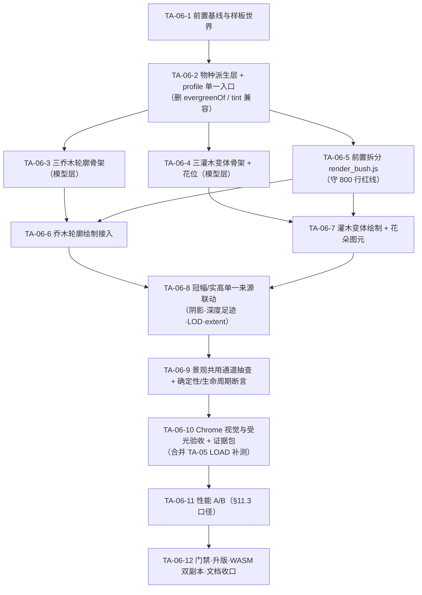

# TA-06 技术实施方案与任务列表 · 植被轮廓与物种变体（三乔木 + 三灌木）

> **状态：◐ 实现已落地（v1.50.64，2026-09-14），视觉/性能/LOAD 验收未完成。** 本文源码事实为 2026-09-14 逐行核对结论（应用版本 v1.50.57、HEAD `fcbd5dc`）；实施前复核确认 HEAD 已移至 `0f9a051`（v1.50.62），**TA-06 相关前端源文件相对基线零变动**（仅 index.html 版本徽章号变化），故基线表继续有效。
> **实施结果（2026-09-14，v1.50.64）**：TA-06-2~8 已实现并通过静态/数值层验证（临时 Node 断言 6 组用后删除；`frontend-check` / `code-map-check` / `cross-doc-check` / `doc-link-check` / `bump-version --check` 全绿）；**TA-06-1 仅完成源码级基线核对**（未做 Chrome 截图基线），**TA-06-9~11 全部 NOT_RUN**，故本任务台账记 ◐ 部分通过（同 TA-05 先例）。实施偏差记录见文末「实施记录」。
> **任务来源**：[07 号地形美术规划](docs/plan/tech/07-terrain-art.md) §1.2 TA-06（原代号 P1）、§6.3 统一季相模型、§6.7 模块拆分与模型缓存、§10.2 缓存失效契约、§11.4 Accent 专项验收；验证方法论复用 [09 号植被样板验证方案](docs/plan/tech/09-vegetation-verification.md)。
> **交付目标**：在现有「单一乔木轮廓 + 单一灌木形态」之上，落地**三类乔木轮廓（阔冠落叶 / 疏冠落叶 / 锥形常绿）与三类灌木变体（落叶多茎 / 花灌木 / 低矮常绿）**，由 `accent.id` 稳定哈希派生，**不新增任何持久化字段、FABS section、模拟参数或物理规则**；同一种植株在四季、四方位、存读档与回溯后形态逐位一致。
> **难度 / 工期**：07 号台账标定「中」；本方案含前置文件拆分、共用通道抽查与完整验收矩阵，估计 **9~10 人日**（压回 8 人日的降范围选项见 §0.3）。

---

## 0. 前置门禁与开工条件

### 0.1 依赖状态核对

| 前置 | 07 号台账状态 | 2026-09-14 实际核对 | 对 TA-06 的影响 |
| :--- | :--- | :--- | :--- |
| TA-01~TA-04 | ✅ v1.50.23~46 全落地 | 三件套 + 受光管线 + 贴地投影拆分均在位，`accentModelStyleVersion = 4` | 可直接在其上扩展，无需重建底座 |
| TA-05 P0 样板闭环 | ◐ 保持未完成 | 视觉/季相/受光/生命周期（除 LOAD）已通过；**LOAD 存档链路 NOT_RUN**；高密·拖动性能预算处置待用户取舍 | TA-06 台账依赖项为 TA-05。建议按 §0.2 合并处理，不以「TA-05 未勾选」阻塞开工 |
| TA-11 / TA-14 | ✅ v1.50.38 / v1.50.49 | 五类 accent 全链路 + `landscape-mask.js` 表现层遮罩在位 | 样板选址必须先过 `LandscapeMask.accentHidden` 判据（09 号 §3.3） |
| TA-07 / TA-08 | ⏳ 未实施 | 无滞回 LOD、无完整投影包围体剔除、无跨实体遮挡拆分 | **不得**在 TA-06 内顺手实现；变体只改形态，LOD 与遮挡口径保持现状 |

### 0.2 TA-05 与本任务的 LOAD 补测合并

TA-05 唯一硬缺口是 Chrome 真实存档链路（LOAD）。TA-06 的验收矩阵同样需要 LOAD 一行（换世界/读档后物种派生与骨架重建一致）。**建议把两次 LOAD 验证合并为同一次 Chrome 存档会话**：TA-06-10 执行时同时回填 07 号 §11.4 的 TA-05 LOAD 行与 09 号 §5 清单，一次取证两处收口。若用户要求先独立补完 TA-05 再开工，则 TA-06-1 顺延。

### 0.3 开工前需用户确认的三项取舍

1. **花朵图元是否留在本轮**：07 号 §6.3「花灌木春季开花」与 [frontend/AGENTS.md](frontend/AGENTS.md) §5.11「花量待 TA-06/15」把开花绘制指向 TA-06。建议**留在本轮**（TA-06-7），但设计为可独立降范围的子项——去掉后花灌木仍有独立株形（茎数/外倾/簇径）与 `floweringBush` 季相曲线，不影响其余任务。
2. **变体是否影响资源景观子图元**：`landscape-model.js` 经 `AccentModel.getByKey('L#…')` 复用同一套 Tree/Bush 模型，物种派生会自动作用到林地/浆果点景观。建议**允许自动作用、不改配方表**（TA-06-9 只做抽查取证），不在本轮引入「配方指定物种」的新接口。
3. **兼容接口清理是否搭车**：`accent-season.js::tint()` 与 `treeTintYellowBand/treeTintRedBand` 全仓已无消费点（07 号 §6.3 要求「迁移完成后统一清理，避免两套年历并存」）。建议**搭车删除**（TA-06-2 内一并处理）；若希望保持最小 diff，可移出本轮另立清理项。

---

## 1. 范围与边界

| 做 | 不做 |
| :--- | :--- |
| 由 `accent.id` 稳定哈希派生物种/轮廓标识，三乔木 + 三灌木共 6 个变体 | 新增 `TerrainAccent` 字段、`AccentKind` 变体、FABS section、存档结构版本变更 |
| 模型层输出变体骨架（干高、冠幅、枝数、簇数、簇径、仰角带、轮生层） | 改变内核 `geo/accents.rs` 的生成数量、地表过滤、重试与 RNG 消费序 |
| 绘制层按变体落笔（锥形常绿轮生层、疏冠大空隙、低矮常绿扁压铺展） | 消费 `WorldRng`、写入模拟状态、参与确定性承诺 |
| 统一季相 profile 解析单一入口（`deciduousTree/deciduousBush/evergreen/floweringBush`） | 新建第二套季节时钟，或让叶量读取 `SimLighting.phase()` 平滑光相 |
| 花灌木花朵点簇（`flowerAmount` 驱动、近中景限量、低饱和、不发光） | 落叶地被与飘叶（TA-15）、积雪/降雪（无事实来源）、果实与可采资源表达（TA-17） |
| 冠幅/实高改为模型单一来源，联动阴影、深度足迹、LOD 阈值、`extent` | 带滞回的完整 LOD 与投影包围体剔除（TA-07）、跨实体深度拆分（TA-08） |
| 按环境适配的物种分布**仅预留接口注释**（如未来按地表类别/纬度偏置） | 在本轮实现环境适配分布（07 号 §6.3 明确「留给扩展阶段」） |

---

## 2. 当前源码基线（2026-09-14 逐行核对）

> 07 号规划中的部分行数与归属已落后，实施以本表为准。

| 位置 | 当前事实 | TA-06 接入方式 |
| :--- | :--- | :--- |
| [geo/accents.rs](crates/sim_core/src/geo/accents.rs) | `TerrainAccent { id, kind, pos, scale, rotation, tint }`，`tint` 恒 0（季节调色由前端应用）；五类 kind；基础数量 Tree 40 / Boulder 20 / Bush 25 / RockCluster 12 / GrassTuft 60 × `terrain_accent_density` | **零改动**。物种只在前端由 `id` 派生 |
| [accent-model.js](frontend/js/accent-model.js)（412 行） | `treeSkeleton(id,vSeed)`：trunkH `6.5+vSeed×2.5`、crownR 8.5、主枝 P 5~6、每主枝 1 二级枝、簇数 N=`accentLeafClustersTree`(16)、簇 r 2.1~3.3、`shed`/`lite` 通道；`bushSkeleton`：茎 S 4~6、茎高 3.4~5.0、N=8、返回 `crownR: 6.5`；`evergreenOf(id)` = `_accentHash(id,400) < accentEvergreenChance`(0.24)，注释自述为「TA-06 物种自动分配落地前的过渡接口」；`extentOf(kind,vSeed)`；`get/getByKey/resetCache`；缓存键 `v{styleVersion}#{kind}#{id}`，上限 2048 超限整体清空 | 新增 `speciesOf()` 派生 + 三乔木/三灌木骨架分支；**删除** `evergreenOf` 过渡接口；`crownR/trunkH/extent` 成为唯一几何真相源；`accentModelStyleVersion` 4 → **5** |
| [accent-season.js](frontend/js/accent-season.js)（80 行） | `sample(accent, sim, profile)` 已支持 `deciduousTree/deciduousBush/evergreen/floweringBush`；`floweringBush` = 落叶灌木叶历 + `accentFlowerCycle` 覆写花量；季相 jitter 走哈希通道 997/998；`tint()` 兼容接口全仓无消费点 | 曲线**不改**；TA-06 只负责把正确 profile 送进来（花灌木首次真正消费 `floweringBush`）；按 §0.3-3 清理 `tint()` |
| [render_accents.js](frontend/js/render_accents.js)（**771 行 / 800 上限**） | `drawAccentEntity` 分发 + 季相采样（L252）；`drawAccentTree` 冠幅硬编码 `8.5×scaled`（L293）；`drawAccentBush` 冠幅硬编码 `(5.5+vSeed×1.2)×scaled`（L581）；两遍式树冠（Pass A 冠影剪影 / Pass B 簇本体 × tZ 体积档）；`cylinderShade` 枝干明暗；春芽按 `budAmount`（L488）；**无花朵绘制** | 先拆出 `render_bush.js`（§3.7）再接入变体；冠幅改读模型；新增花朵图元；零 GC 纪律沿用 `_crownScratchPool/_ptA~_ptD/_sortScratch` |
| [render_shadows.js](frontend/js/render_shadows.js)（103 行） | L48 重复 profile 解析；L63 冠幅硬编码 Tree 8.5 / Bush `5.5+vSeed×1.2`；影长 = `skel.trunkH × accent.scale` | 冠幅改读模型（锥形常绿窄冠 → 窄影；阔冠 → 宽影）；profile 走单一入口 |
| [render_depth_queue.js](frontend/js/render_depth_queue.js)（580 行） | L487 再次 `AccentModel.get()`；L497 冠幅足迹硬编码 Tree 10.5 / Bush 8；`DEPTH_ACCENT=9`、`DEPTH_ACCENT_SHADOW=12` | 足迹改读模型派生值；**不新增深度档、不改队列结构** |
| [render_landscapes.js](frontend/js/render_landscapes.js)（约 280 行） | L168/173/178 三处重复 `model.evergreen ? 'evergreen' : undefined`，再分派 `drawAccentTree/drawAccentBush/drawAccentGrassTuft` | 同步改为单一入口；`render_bush.js` 必须早于本文件加载 |
| [config.render.js](frontend/js/config.render.js)（249 行） | `accentModelStyleVersion: 4`、`accentEvergreenChance: 0.24`、`accentLeafClustersTree: 16`、`accentLeafClustersBush: 8`、`accentSeasonProfiles`（三条曲线）、`accentFlowerCycle`、`accentDetailNearPx: 15`/`MidPx: 7` | 新增物种权重与轮廓参数组、花朵参数组；删除 `accentEvergreenChance`；bump 风格版本 |
| 哈希通道占用 | 210/212~216/220+i/240+i/260+i/284+i/300+i/310/320+i/340+i/360+n/380+n/390+k/**400**/420+i/440+i/460+i/480+i/500+i/600/610~614+i×5/630+i×8+k/660+i×8/700/710~716+i×5/720/997/998 | 物种派生走**全新 800 段**（§3.1），400 随过渡接口删除而释放且不复用 |

**已发现的三处口径漂移（本任务顺带修正，属变体落地的必要条件，非额外重构）**：

1. 冠幅在绘制层、阴影层、深度队列三处各自硬编码，且 `bushSkeleton` 返回的 `crownR: 6.5` 与绘制实际使用的 `5.5+vSeed×1.2`（5.5~6.7）**不一致**——变体一旦改变冠径，三处必然错位。
2. profile 解析 `model.evergreen ? 'evergreen' : undefined` 在 5 个调用点重复；新增 4 种 profile 后重复成本与漏改风险同时放大。
3. `evergreenOf` 只区分「常绿/落叶」二态，无法承载 6 变体，且其配置键名（`accentEvergreenChance`）语义将被物种权重表取代。

---

## 3. 设计方案

### 3.1 物种派生（稳定哈希，纯函数，零持久化）

```text
u_tree = _accentHash(id, 800)      // 乔木轮廓：阔冠 / 疏冠 / 锥形常绿
u_bush = _accentHash(id, 802)      // 灌木变体：落叶多茎 / 花灌木 / 低矮常绿
花色与花位 = _accentHash(id, 810 + i×3 …)
锥形轮生层参数 = _accentHash(id, 820 + i)
```

- 单一 `u` 值按**累积权重表**查表分配（权重先归一化，非法/缺省回退建议值）；不用 `u < chance` 多次独立抽样，避免变体间比例相互干扰。
- 派生是 `(kind, id)` 的纯函数：不读季节、相机、光向、`accent.tint`、`accent.scale`、地表类别与世界 seed；**同一 id 在 accent 通道与 `L#` 景观通道得到同一物种**（`getByKey` 传入的 `visualSeed` 为 `Math.imul` 链产生的 uint32，`_accentHash` 内 `(id|0)` 保留位模式，派生仍逐位确定）。
- 缓存键含 `kind`（同 id 异 kind 不串型）与 `accentModelStyleVersion`；**物种权重与轮廓参数属几何输入，调值必须同步 bump `accentModelStyleVersion`**（§10.2 缓存键契约，沿用 TA-11-4 芦草 3→4 的先例）。
- 997/998 通道保留给季相 jitter，**不得**与物种通道混用；400 释放后不复用。
- 预留扩展注释：未来「按地表类别/坡度/景观配方偏置物种」须在派生函数内新增显式参数并 bump 风格版本，**禁止**在绘制层临时按环境改写物种（会破坏读档/回溯一致性）。

### 3.2 三类乔木轮廓（模型层输出，世界单位，未乘 `accent.scale`/`zoom`）

基准 = 现状单轮廓：trunkH `6.5+vSeed×2.5`、crownR 8.5、P 5~6、每主枝 1 二级枝、N 16、簇 r 2.1~3.3、仰角 0.50~1.05。

| 轮廓 | 代号 | 干高 | 冠幅 | 主枝 | 二级枝 | 簇数因子 | 簇半径 | 仰角带 | profile | 冬季读感 |
| :--- | :--- | :--- | :--- | :--- | :--- | :--- | :--- | :--- | :--- | :--- |
| 阔冠落叶 | `broad` | 5.6 + vSeed×1.6（偏矮） | 10.5 | 6~7 | 每主枝 1 | ×1.15（≈18） | 2.3~3.6 | 0.30~0.75（外展近水平） | `deciduousTree` | 宽幅裸枝 + 0~5% 叶量 |
| 疏冠落叶 | `sparse` | 7.2 + vSeed×2.4 | 8.8 | 4~5 | 每主枝 2（更长、更上扬） | ×0.70（≈11） | 1.8~2.8 | 0.55~1.05 | `deciduousTree` | 枝形最清晰、冠内空隙最大 |
| 锥形常绿 | `conifer` | 8.5 + vSeed×2.5 | 4.8（窄） | 轮生 4~6 层 × 每层 3~5 短枝 | 无 | ×1.30（≈21，簇小而扁） | 1.3~2.0 | 层半径自下而上线性收缩至顶梢 | `evergreen` | 叶量 ≥94%、轮廓不变、色调偏冷暗 |

共同约束：

- **全部叶簇必须挂在真实枝条上**（v1.50.26 悬空簇教训）——补位簇锚定枝段参数位 55%~95%，锥形常绿锚定轮生短枝；禁用抽象球面包络定位。实测 400 id 乔木最大簇-枝距 **2.538**（阈值 3.0）。
- 锥形常绿**不新增「不脱落」特例分支**：`evergreen` 曲线叶量 ≥0.94 + `fade 0.09` 下 `accentClusterVisibility` 恒 ≥0.06 显示阈（**断言实测最小 0.2775**）；若实测出现掉簇，优先调曲线而非在可见度函数内加 kind 判断。
- 锥形常绿**簇数上限**：每层短枝数受 `perLayerCap = max(2, ⌊(N−1)/L⌋)` 限制（N＝`round(accentLeafClustersTree×1.30)`≈21，L＝层数 4~6），使总簇数恒 ≤ N（实测区间 13~21，随层数变化）；顶梢簇固定保留，塔形收尖不断头。
- 簇的法线仍由 `attachCrownNormals` 按整副骨架包络求解（受光管线不改）；倾干剪切继续由绘制层施加，不入模型缓存。锥形常绿倾干幅度收敛（`leanShear` 系数按轮廓下调——`leanShearK`：broad/sparse 1.0、conifer 0.45，针叶树读感挺直）。

### 3.3 三类灌木变体

基准 = 现状：茎 S 4~6、茎高 3.4~5.0、外倾 `outK` 0.38~0.68、N 8、簇 r 1.5~2.4。

| 变体 | 代号 | 茎数 | 茎高 | 外倾 | 簇数因子 | 簇半径 | profile | 形态特征 |
| :--- | :--- | :--- | :--- | :--- | :--- | :--- | :--- | :--- |
| 落叶多茎 | `multiStem` | **4~6**（＝现状基准） | 3.4~5.0 | 0.38~0.68 | ×1.0（8） | 1.5~2.4 | `deciduousBush` | 现状形态；冬季枯枝为主、少量宿存叶 |
| 花灌木 | `flowering` | 4~6 | 3.0~4.4 | 0.30~0.55（略收，花簇集中可读） | ×1.0（8） | 1.4~2.2 | `floweringBush` | 春季花朵点簇（§3.4）；叶历沿用落叶灌木 |
| 低矮常绿 | `lowEvergreen` | 5~8（短茎） | 1.8~2.8 | 0.45~0.75（铺展） | ×1.1（9） | 1.2~1.9（扁压） | `evergreen` | 全年 ≥94% 叶量；冠丛贴地、冬季冷暗绿 |

> ★ **实施定稿（2026-09-14）**：`multiStem` 茎数取 **4~6（现状值）**，与 TA-06-4 验收条款「`multiStem` 与现状基准逐值一致（回归保护）」保持一致——本表原 5~7 为美术首轮建议，与回归条款冲突时以后者为准。三变体另由 `crownSquash` 输出簇扁压系数（multiStem/flowering 0.72＝现状、lowEvergreen 0.55）与 `footprintR` 显式深度足迹（multiStem 8＝现状、flowering 6.5、lowEvergreen 5.5）；`trunkH`＝`heightBase + heightVar×0.5`（multiStem 复现旧值 4.2，驱动贴地影长）。

灌木**不得**由乔木模型缩放冒充（07 号 §6.4 红线）；三变体共用基生多茎结构，只改茎数/茎高/外倾/簇参数。

### 3.4 花朵图元（花灌木专属，`flowerAmount` 首次真实消费）

- 花位 = 构建期由 `_accentHash(id, 810+i×3…)` 在**可见簇外围**预生成的固定点（模型层输出 `flowers: [{x, y, z, ci, hue}]`，绘制层只投影），最多 `accentFlowerDotsMax`(9) 点；花量 `flowerAmount` 只决定**可见点数** `round(K×flowerAmount)` 与 alpha，绝不参与位置重抽（对齐 S4-04 点簇「库存不参与几何」的同一纪律）。
- 花色走低饱和三色板（白 `246,242,232` / 淡粉 `226,190,186` / 淡黄 `238,224,168`），按稳定哈希逐点选定；**禁发光、禁径向渐变光晕、禁高饱和**（07 号 §4.1：明亮颜色留给选中对象与紧急事件）。
- 细节分级：仅在 `detailMid`（冠屏半径 ≥ `accentDetailMidPx`）及以上、且**花点屏幕半径 ≥ `accentFlowerMinPx`** 时落笔；远景整组省略（实施定稿：`accentFlowerDotRadiusK` 0.09 → **0.30**，使近景档起花点即 ≥1.2px 可辨，详见 §3.5 与 §8.2-1）。
- 受光：花朵为小尺度贴簇图元，直接以**宿主簇法线**走 `accentLitFill` 单一入口，**不复制光照公式**、不新增固定屏幕亮斑；与宿主簇同步显隐（宿主簇冬季脱落时花点亦不残留）。
- 零 GC：花点投影复用 `_ptD`，逐点即画即弃（无收集/排序，故**无需**专用池——见 §8.2-6），稳态零逐帧堆分配（TA-11-6 纪律）。
- 季相边界：`accentFlowerCycle` 现状为 `u=0` 满开、0.16 归零、0.96 回升 0.65——**已核对（见 §8.3）**：冬末回升段花量虽回升至 0.54，但同相位叶量仅 0.14，宿主簇未返青 → 花点被显隐门槛抑制（49 株仅落 21 点，占满开点位 4.8%），**无冬季满花**，故 0.88/0.96 两结点**无需收紧**；花历归零附近（u=0.16）的极少量残留点来自 ±0.025 年季相 jitter（997/998 通道），幅度在设计内。

### 3.5 配置键规划（[config.render.js](frontend/js/config.render.js)，全部须有真实消费点）

新增（**实施定稿值**；原首轮建议值见各行脚注）：

| 键 | 实施值 | 消费处 |
| :--- | :--- | :--- |
| `accentSpeciesWeights.tree` | `{ broad: 0.42, sparse: 0.34, conifer: 0.24 }` | `accent-model.js::speciesOf` |
| `accentSpeciesWeights.bush` | `{ multiStem: 0.56, flowering: 0.24, lowEvergreen: 0.20 }` | 同上 |
| `accentTreeSilhouettes` | 每轮廓 `{ trunkHBase, trunkHVar, crownR, branchMin, branchMax, subBranchPer, subLenK, subDroop, clusterFactor, clusterRBase, clusterRVar, elevMin, elevMax, crownSquash, footprintR, leanShearK, whorlLayersMin/Max?, whorlBranchesMin/Max? }` | `treeSkeleton` |
| `accentBushVariants` | 每变体 `{ stemMin, stemMax, heightBase, heightVar, outKMin, outKMax, clusterFactor, clusterRBase, clusterRVar, crownRBase, crownRVar, crownSquash, footprintR }` | `bushSkeleton` |
| `accentFlowerDotsMax` | 9 | 模型层花位生成上限 |
| `accentFlowerDotRadiusK` | **0.30**（相对**宿主簇**屏幕半径；原建议 0.09） | `render_bush.js` |
| `accentFlowerMinPx` | **1.2**（花点屏幕半径下限，低于即该点省略；原建议 1.6） | 同上 |
| `accentFlowerPalette` | 上述三色 | 同上 |

> **`accentFlowerDotRadiusK` / `accentFlowerMinPx` 定稿理由**：按建议值 0.09，近景档下宿主簇屏幕半径约 4~6px，花点仅 0.36~0.54px，恒低于 1.6px 落笔阈值——验收项「花灌木春季可见花」在任何缩放下都不可能达成（实测 zoom 8 仍为 0 点）。定稿 0.30/1.2 后实测：zoom ≥3（近景档边界，冠屏半径 ≥15px）花点约 1.3~2.0px 可见、zoom ≤1.6 亚像素整组省略，与「花朵＝近景细节」的设计意图一致。该两键为**几何输入**，调值须同步 bump `accentModelStyleVersion`（花点半径不入模型缓存，但花位数量上限 `accentFlowerDotsMax` 入）。

变更 / 删除：

- `accentModelStyleVersion` **4 → 5**（骨架形态变更，缓存整体重建）。
- **删除** `accentEvergreenChance` 与 `evergreenOf`（过渡接口按 §0.3 一次性清理，不留兼容分支）。
- 权重比例设计意图：乔木常绿占比维持 0.24（与现状 `accentEvergreenChance` 一致，冬季观感不突变）；灌木常绿 0.20 ≈ 现状 0.24 的灌木侧份额。
- 按 §0.3-3 一并删除 `treeTintYellowBand` / `treeTintRedBand` 与 `accent-season.js::tint()`。

**建议权重表注释固定写法**：「本组为几何输入，调值必须同步 bump `accentModelStyleVersion`，否则旧模型缓存不会重建（§10.2）」。

### 3.6 缓存键、失效与生命周期

- 缓存键沿用 `v{accentModelStyleVersion}#{kind}#{id}`（物种由 id 派生，天然在键内）；景观通道沿用 `'L#'` 命名空间完整 key，**禁止**把字符串 key 截成可能与 `accent.id` 碰撞的整数。
- 上限 `_CACHE_MAX = 2048` 不变（基线世界约 85 accent + 景观子图元；变体不增加条目数，只增加单条骨架体量）。实施时记录单条骨架字段规模与缓存峰值，若接近上限按 07 号 §11.3 复核内存预算。
- 生命周期不变：READY / LOAD_RESULT / REWIND_RESULT / RESET_DONE 四处由 `rustworld.js::_invalidateWorldStaticCaches()` 调 `AccentModel.resetCache()`；`STR_TAB.start_index==0` 判据仅管字符串驻留表，不替代模型清理。
- 骨架缓存**只含几何**：不烘焙季节、光向、相机、DPR（§10.2）；花朵点位属几何（入缓存），花量属季相（不入缓存）。

### 3.7 文件拆分与加载顺序（守 800 行红线）

`render_accents.js` 现 771 行，接入锥形常绿与花朵必然超限。按 `render_grass.js`（v1.50.39）先例**先拆后加**：

1. 新增 `frontend/js/render_bush.js`（TA-06-5 新建）：迁出 `drawAccentBush` + 新增花朵图元绘制（约 180~200 行）。
2. `render_accents.js` 保留 `drawAccentEntity` 分发、共享刮擦/工具（`accentLitFill`、`cylinderShade`、`_ptA~_ptD`、`_sortScratch`、`_shadowOffset`、`drawStoneBody`）与 `drawAccentTree`（预计回落至约 620~680 行，含锥形常绿分支）。
3. `index.html` 登记顺序：`render_accents.js`(28) → **`render_bush.js`(28b)** → `render_grass.js`(29) → `render_shadows.js`(30) → `render_landscapes.js`(31)。约束：`render_bush.js` 复用 `render_accents.js` 的模块级共享刮擦（经典脚本全局作用域），**必须晚于**它；`render_landscapes.js` 分派 `drawAccentBush`，**必须晚于** `render_bush.js`。
4. 若 `accent-model.js`（412 行）在三骨架 + 三变体后逼近上限（扩展后预计约 600~650 行，**首轮不拆**，以实测行数为准），再拆出 `accent-species.js`（物种派生 + 参数表，早于 `accent-model.js` 加载）。
5. 同步 [frontend/AGENTS.md](frontend/AGENTS.md) §1.1 文件清单与 §二 加载顺序、[31-code-map.md](docs/current/tech/31-code-map.md) 登记（`code-map-check.js` 门禁）。

### 3.8 冠幅/实高单一来源（连带修正 §2 漂移 1）

模型层输出并作为唯一真相源：`sk.trunkH`（实高）、`sk.crownR`（冠幅）、`sk.footprintR`（深度足迹）、`sk.crownSquash`（簇扁压）、`sk.leanShearK`（倾干幅度系数）、`model.extent`（锚点上方最大延伸，TA-07 预留）。改造点：

- `render_accents.js:293` / `drawAccentBush` 冠幅 → 读 `sk.crownR`；
- `render_shadows.js:63` LOD 冠屏半径与冠幅 `crowW` → 读 `sk.crownR`；
- `render_depth_queue.js:497` 阴影足迹 `fp`（Tree 10.5 / Bush 8）→ 读 `sk.footprintR × accent.scale`；
- `extentOf(kind, vSeed)` → 由骨架实际几何求值（锥形常绿更高更窄，现值 16.6 会低估）。

> ★ **实施定稿（2026-09-14）**：`footprintR` 采用**每轮廓/变体显式常量**（equivalently「冠幅 × 轮廓系数」，但便于逐项核对与热调）：乔木 broad 13 / sparse 11 / conifer 6；灌木 multiStem **8（＝旧基线逐值）** / flowering 6.5 / lowEvergreen 5.5。`multiStem` 冠幅 `crownR = 5.5 + 1.2×vSeed` 同时修正了旧 `bushSkeleton` 返回 6.5 与绘制口径不一致的历史漂移（两者统一后，`render_shadows.js` 的灌木冠幅与阴影宽度与实际冠幅一致）。`extent` 现由骨架簇顶/枝端实测求值（树 broad 约 13.2、锥形常绿更高更窄）。

改造须保证**现状轮廓（改造后等价于 `broad`/`multiStem` 之外的旧基准）在数值上不产生观感跳变**：先把三处硬编码替换为读模型并以旧参数复现，再引入变体参数（两步提交，便于 A/B 定位）。

---

## 4. 不变量与红线

1. **零持久化**：不新增快照字段、FABS section、枚举字典项、`SimConfig` 字段与存档结构版本；`TerrainAccent.tint` 仍为恒 0 预留字段，植被不读它。
2. **纯表现层**：不消费 `WorldRng`、不写模拟状态、不参与逐字节确定性承诺；开启/关闭物种变体不得改变同种子创世的地形、路网、Agent 行为与账本。
3. **落叶铁律**：枝条全年保留；落叶树冬季叶量 0~5%；**禁整冠透明度**当作落叶；叶簇一律挂真实枝条。
4. **受光铁律**：颜色管线固定「季节基础色 → 世界法线漫反射+环境光（`accentLitFill`/`shadeRgbInto` 单一入口）→ 光源色温」；**禁**恢复固定屏幕左上亮斑、白色椭圆高光、`accentLeafPalette` 旧渐变色板；**禁**用投影深度 `tD` 驱动明暗。
5. **两遍式树冠**：叶簇**禁**恢复逐簇深色 rim 描边（v1.50.27 教训）；Pass A 冠影并集 + Pass B 体积明暗的画序对所有轮廓一致。
6. **季相单一生产者**：只读 `SimTreeTint.sample()`；不新建年历、不用墙钟、不用平滑光相决定叶量。
7. **非植被种类零影响**：GrassTuft / Boulder / RockCluster 的 profile 与观感必须逐位不变（派生层对非 Tree/Bush 返回 `undefined`），芦草穗量不得因 `floweringBush` 曲线泄漏而改变。
8. **零 GC**：新增绘制路径沿用刮擦池与稳定插入排序，稳态零逐帧堆分配。
9. **单文件 ≤800 行**；**持久化测试禁令**：临时断言用后删除，长期验证只跑既有门禁。
10. **深度队列纪律**：新增图元（花朵属簇内细节，不独立入队）不得在 `render()` 里另开整层绘制；阴影仍走 `DEPTH_ACCENT_SHADOW`。

---

## 5. 任务序列

建议顺序：**TA-06-1 → 2 →（3 ∥ 4）→ 5 → 6 → 7 → 8 → 9 → 10 → 11 → 12**（3 与 4 可并行；5 必须先于 6/7）。



- [~] **TA-06-1 前置基线与样板世界（约 0.5 日）**：仅完成**源码级基线核对**（拉取后各源文件相对基线零变动）；Chrome 截图基线 / 样板世界清单 / 统一队列耗时基线 **NOT_RUN**
  - 核对根/前端 AGENTS.md、[27 号浏览器自动化](docs/current/tech/27-browser-automation.md)、[25 号性能基准](docs/current/tech/25-benchmarking.md)；确认 §0.3 三项取舍已由用户拍定。
  - 固定两组样板世界（建议 T1 山口 `mountain_pass_v1` + T2 河谷 `river_valley_v1`，seed 42/43 起搜），记录 seed、实际 profile、tick、应用/生成器/存档版本、源码提交、WASM 双副本 SHA256、完整配置、窗口 CSS 尺寸与 DPR、相机参数。
  - 建立**无变体基线**：现状截图（四季 × 四方位 × 三景别）+ 统一队列绘制耗时基线 + 现存落叶/常绿个体清单（按 `AccentModel.get(a).evergreen` 筛选，**不得**用 `accentEvergreenChance` 置零筛样板——模型已缓存该字段，见 09 号 §2）。*（实施后注：`model.evergreen` 字段随 TA-06-2 删除，如需补做本项基线筛选，改用 `AccentModel.speciesOf(kind, id).profile`。且本项在 v1.50.64 实施中未执行。）*
  - 交付：基线记录与样板清单；不得从既有截图反推 seed，不跳过正式存档门禁。

- [x] **TA-06-2 物种派生层与 profile 单一入口（约 1 日，依赖 1）** ✅ v1.50.64
  - `accent-model.js` 新增 `speciesOf(kind, id)` → `{ silhouette, profile }`，按 §3.1 通道与 §3.5 权重表实现；模型对象新增 `species` / `profile` 字段。
  - 新增单一入口（建议 `AccentModel.seasonProfileOf(model)` 或直接消费 `model.profile`），替换 **5 处**重复解析：`render_accents.js:252`、`render_shadows.js:48`、`render_landscapes.js:168/173/178`。
  - 删除 `evergreenOf` 与 `accentEvergreenChance`；按 §0.3-3 删除 `accent-season.js::tint()` 与 `treeTintYellowBand/treeTintRedBand`。
  - `accentModelStyleVersion` 4 → 5；配置注释写明「调权重/轮廓参数须同步 bump」。
  - 临时断言（用后删除）：派生为 `(kind,id)` 纯函数、权重归一化与非法回退、分布比例落在建议值 ±3%（≥2000 样本）、通道不与既有哈希串扰（改物种通道不改变枝干/簇几何抽样）、非 Tree/Bush 返回 `undefined` 且 GrassTuft/Boulder/RockCluster 观感逐位不变、`resetCache` 后派生一致。
  - 交付：派生层 + 单一入口；本步**不改变任何几何**（仍走现状轮廓参数），画面只应出现「常绿比例由二态变三态分配」的季相差异。

- [x] **TA-06-3 三乔木轮廓骨架（约 1.5 日，依赖 2；可与 4 并行）** ✅ v1.50.64
  - `treeSkeleton` 按 §3.2 参数表分支实现 `broad` / `sparse` / `conifer`；`conifer` 走轮生层结构（4~6 层 × 3~5 短枝，层半径线性收缩，顶梢簇）。
  - 全部叶簇锚定真实枝段（含 v1.50.26 补位规则的轮廓化重写）；`shed`/`lite` 通道沿用；`attachCrownNormals` 不改。
  - 模型输出 `crownR` / `trunkH` / `footprintR` 为该轮廓真值；`extentOf` 改由骨架求值。
  - 临时断言：每轮廓簇数/枝数在配置区间内、簇到最近枝段距离 ≤ 阈值（复现实测 id=22 的 7.16 悬空判据）、`evergreen` profile 下 `accentClusterVisibility` 恒 ≥1（无掉簇特例）、暖缓存 == 冷重建、风格版本换代生效、零 NaN。
  - 交付：三套乔木骨架；绘制层未接入前画面可能短暂不一致，故本步与 TA-06-6 同一提交批次内完成为宜。

- [x] **TA-06-4 三灌木变体骨架与花位（约 1 日，依赖 2；可与 3 并行）** ✅ v1.50.64
  - `bushSkeleton` 按 §3.3 分支实现 `multiStem` / `flowering` / `lowEvergreen`；修正返回 `crownR` 与实际绘制口径不一致的历史漂移（§2 漂移 1）。
  - `flowering` 额外输出 `flowers[]`（构建期固定花位 + 花色通道，上限 `accentFlowerDotsMax`），**花量不入模型**。
  - 临时断言：茎数/茎高/外倾在区间内、`lowEvergreen` 株高显著低于其余两变体（贴地读感）、花位全部落在簇体外围且随 id 稳定、`multiStem` 与现状基准逐值一致（回归保护）。
  - 交付：三套灌木骨架 + 花位数据。

- [x] **TA-06-5 前置拆分 `render_bush.js`（约 0.5 日，依赖 2；先于 6/7）** ✅ v1.50.64
  - 按 §3.7 迁出 `drawAccentBush`，登记 `index.html` 加载顺序（28b，晚于 `render_accents.js`、早于 `render_landscapes.js`），复用共享刮擦不复制工具函数。
  - 同步行数核对：`render_accents.js` 回落至 ≤700、`render_bush.js` ≤250。
  - 交付：**纯迁移零行为变更**——迁移前后同 seed/同相机截图逐像素一致（或差异仅来自抗锯齿），`frontend-check.js` 通过。

- [x] **TA-06-6 乔木轮廓绘制接入（约 1 日，依赖 3、5）** ✅ v1.50.64
  - `drawAccentTree` 按 `model.species.silhouette` 分支：冠幅/干高读模型；锥形常绿走轮生层枝序绘制 + 扁椭簇 + 收敛倾干；疏冠簇少而分散（两遍式树冠画序不变，靠簇数与半径自然出空隙）；阔冠宽扁冠。
  - 枝干明暗带、簇亮部、春芽全部沿用既有受光路径与细节分级阈值；不新增固定屏幕亮斑。
  - 零 GC 复核：新增分支不得引入逐帧字面量对象/数组/闭包排序。
  - 交付：三轮廓在远/中/近三档细节下均可辨认且互不混淆；`render_accents.js` ≤800 行。

- [x] **TA-06-7 灌木变体绘制与花朵图元（约 1 日，依赖 4、5）** ✅ v1.50.64
  - `render_bush.js` 按变体分支绘制茎序与簇丛（`lowEvergreen` 扁压铺展、`flowering` 略收外倾）；两遍式树冠画序保持。
  - 花朵图元按 §3.4 实现：可见点数 = `round(K×flowerAmount)`、低饱和三色、仅中近景、走 `accentLitFill`、`_flowerScratchPool` 零分配。*（实施注：细节门槛为「`detailMid` 及以上 + 花点屏半径 ≥ `accentFlowerMinPx`」双条件；`K`/`MinPx` 定稿 0.30/1.2；花点逐点即画即弃、无需专用池，见 §8.2-5。）*
  - 核对 `accentFlowerCycle` 冬末回升结点与萌芽曲线的协调性（必要时微调 0.88/0.96 两值并记录）。
  - 交付：花灌木春季可见花、夏季无残留花点、冬季零花；其余两变体无花朵绘制。

- [x] **TA-06-8 冠幅/实高单一来源联动（约 0.5 日，依赖 6、7）** ✅ v1.50.64
  - 按 §3.8 改造 `render_shadows.js`（LOD 冠屏半径、`crowW` 冠幅、影长仍 = `trunkH × accent.scale`）与 `render_depth_queue.js`（阴影足迹 `fp` 读 `sk.footprintR`）。
  - 锥形常绿应得窄长影、阔冠得宽影、低矮常绿得贴地弱影；**不改**深度档常量与队列结构。
  - 交付：变体切换后阴影与实体冠幅一致，无「宽冠窄影 / 窄冠宽影」错位；阴影不参与拾取、不遮挡选中信息。

- [ ] **TA-06-9 景观共用通道抽查与生命周期断言（约 1 日，依赖 8）** —— NOT_RUN（代码层已按 §0.3-2 允许自动作用且不改配方表；抽查取证待补）
  - 抽查 `LandscapeModel` → `getByKey('L#…')` 派生：Wood 林地树/灌木、Berry 浆果灌木簇、`stockRole:'detail'` foliage 子图元在三变体下的观感与 q 显隐逻辑；**不修改配方表**（§0.3-2）。
  - 遮罩联动复核：`LandscapeMask.accentHidden` / `childHidden` 判定不受物种影响（足迹变化不得改变保护区判定口径）。
  - 生命周期端到端断言：READY / LOAD_RESULT / REWIND_RESULT / RESET_DONE 四事件后暖缓存 == 冷重建、换世界不残留旧物种、A→B→A 一致、高倍速无频闪、暂停不漂移。
  - 交付：抽查记录 + 断言结论；临时脚本用后删除。

- [ ] **TA-06-10 Chrome 视觉与受光验收 + 证据包（约 1 日，依赖 9）** —— NOT_RUN
  - 按 09 号 §3 选样规则建立 **6 变体样板身份表**（每变体至少 1 株，含坡地/视口边缘补充个体），选址先 `LandscapeMask.sync(sim)` 再以 `accentHidden(clone) === false` 复核。
  - 主矩阵：**四季 × 四方位 × 两档俯角 × 三档缩放**（09 号 §4.2，96 视图/场景），核对 `accentDetailLevels()` 三档真实覆盖而非仅凭 zoom 数字；季相采样含季分箱边界 `1−ε/ε` 与春季中部年度相位回环。
  - 受光分离：固定季相热调 `SIM_LIGHTING.azimuthOffsetDeg`（0/90/180/270，投影方向翻转核对）；固定世界光转相机（亮部不黏屏幕左上）；光近视线退化位；动态光开→关→开。
  - 生命周期：真实快照推进、暂停/继续、REWIND、RESET、1024x、交互/共享模型；**LOAD 用真实 Chrome 存档入口**，并同批回填 TA-05 的 LOAD 缺口（§0.2）与 07 号 §11.4、09 号 §5。
  - 证据归档 `docs/plan/tech/assets/ta06-evidence-<日期>/`（`manifest.json` + `report.md` + `visual/` + `metrics/`，沿用 TA-05 结构）；夹具与真实世界截图分开标注，夹具不得代替端到端。
  - 交付：验收报告 + 缺陷与复测记录；有悬空/入土/裁断/串型/遮挡回退则不勾选。

- [ ] **TA-06-11 性能 A/B（约 0.5~1 日，依赖 10）** —— NOT_RUN
  - 口径按 09 号 §6 与 07 号 §11.3：基准端 = TA-06-1 基线（无变体），候选端 = 变体落地；同 seed/config 建档，高密负载以时光倒流对齐同一起点 tick。
  - 场景：P1 初始·固定 / P2 初始·连续拖动 / P3 高密·固定 / P4 高密·连续拖动；统一计时边界完整包裹 `drawWorldEntities()`（含阴影入队/排序/分发/绘制），预热 ≥12s、正式采样 ≥60s、≥3 轮交替顺序、p95 nearest-rank。
  - 单独记录：装饰单帧累计耗时（不对单次 draw 求 p95、不把各模块 p95 相加）、`AccentModel` 缓存条目数与 JS 堆峰值、模拟吞吐 ticks/s、相机跳变重建首帧 p95。
  - 预算：新增绘制 p95 增量 ≤3 ms；吞吐回退 ≤5%；视觉缓存 ≤64 MiB。**超标先优化复测，不得仅记录结论就标完成**；确需调整预算须提交原始数据与取舍并取得用户明确接受（TA-04-8 高密·拖动超标项不构成本项豁免）。
  - 交付：两端原始 p50/p95/p99/均值/最差序列 + 差值 + 归因分解。

- [ ] **TA-06-12 门禁、升版、WASM 双副本与文档收口（约 0.5 日，依赖 11）**
  - 执行 §7 全部门禁；`node tools/bump-version.js --patch` → `cargo build -p sim_wasm --target wasm32-unknown-unknown --release` → 双副本同步（升版会改 `world_save.rs::SAVE_APP_VERSION`，**必须**重编译，旧存档按设计自动废弃）。
  - 文档同步：[07 号](docs/plan/tech/07-terrain-art.md) §1.2 TA-06 状态 + §6.3 现状契约 + §11.4 验收记录 +（如已补测）TA-05 LOAD 行；[frontend/AGENTS.md](frontend/AGENTS.md) §1.1 文件清单（新增 `render_bush.js`、刷新 `accent-model.js`/`render_accents.js`/`config.render.js` 行数与职责）+ §二 加载顺序 + §5.11 季相契约（物种分配已落地，删除「留给 TA-06」表述）；[31-code-map.md](docs/current/tech/31-code-map.md) 登记；[01-changelog.md](docs/current/01-changelog.md) 追加版本条目；根 [TODO.md](TODO.md) §1 若登记本文则同步状态；本文件头部状态行更新。
  - 清理：删除全部临时断言与夹具（恢复函数/相机/配置/输入引用并核对 accents 数量复原），最终审阅 diff。
  - 交付：可运行实现 + 验收记录 + 门禁结果；未实测项明确保留未完成。

---

## 6. 验收矩阵与完成定义

| 类别 | 场景 | 通过标准 |
| :--- | :--- | :--- |
| 物种分布 | ≥2000 accent 样本统计 | 三乔木/三灌木比例落在权重 ±3%；同 id 在 accent 与景观通道派生一致 |
| 轮廓辨识 | 远/中/近三档 × 四方位 | 阔冠（宽扁）/疏冠（空隙大、枝形清晰）/锥形常绿（窄塔形、轮生层）肉眼可区分；灌木三变体株高与铺展度可区分 |
| 四季与边界 | 每变体同株跨年 | 落叶轮廓春芽/夏冠/秋色/冬枝可辨、冬季叶量 0~5%；常绿轮廓全年 ≥94%、冬季轮廓不变且色调偏冷暗；季分箱边界与年度相位回环连续无跳变 |
| 落叶过程 | 秋→冬连续推进 | 先变色后减叶、有真实枝间空隙、叶簇始终挂真实枝条、**无整团半透明冠云**、无悬空簇 |
| 花朵 | 花灌木春季 | 花量随 `accentFlowerCycle` 升降、点数单调、低饱和不发光、远景省略；非花灌木与其余 kind 全年零花点 |
| 受光 | 固定季相变光向 / 固定光向转相机 | 枝干明暗带、簇亮部、花朵、地面投影协调随动；亮部不黏屏幕左上；光近视线时亮部平滑回簇心无抖动 |
| 旋转与遮挡 | 四方位 × 两俯角 × 三缩放 + 整圈连续旋转 | 无悬空、入土、冠裁断、错误覆盖选中信息；阴影冠幅与实体一致；不新增跨图层「远物压近物」 |
| 非植被零影响 | GrassTuft / Boulder / RockCluster | 几何与观感逐位不变；芦草穗量不受 `floweringBush` 曲线影响 |
| 生命周期 | 推进/暂停/REWIND/RESET/**LOAD**/1024x/换世界 A→B→A | 物种与骨架可重建、暖缓存 == 冷重建、无旧世界残留与串型、高倍速无频闪 |
| 资源景观共用 | Wood / Berry / detail foliage | 子图元变体正常、q 显隐逻辑不变、遮罩判定口径不变、配方表零改动 |
| 数据边界 | 同 seed 同 tick 开关变体对照 | 地形高程/坡度/地表类别/路网拓扑/Agent 行为/家户账本逐字节差分恒 0；不新增存档与 FABS 字段 |
| 性能 | §5 TA-06-11 四场景 | 新增绘制 p95 增量 ≤3 ms；吞吐回退 ≤5%；视觉缓存 ≤64 MiB；超标如实记录并待取舍 |
| 工程 | 行数 / 加载顺序 / 消费点 | 全部触碰文件 ≤800 行；`index.html` 顺序正确；新增配置键 100% 有真实消费点；临时断言已删除 |

**完成定义**：12 个子任务均有证据、验收矩阵全项通过、性能闭环完成、源码/现状文档/版本/WASM 双副本一致。截图漂亮、临时断言通过、或仅完成派生层与骨架接入，都不足以单独标记 TA-06 完成；性能超标未取舍或 LOAD 未验证时只能记 ◐ 部分通过（同 TA-05 先例）。

---

## 7. 门禁命令

**本文件仅为规划交付**：不升版、不构建 WASM、不运行模拟回归；按根 AGENTS.md §4.0.1「仅文档变更例外」执行工作区/diff 检查 + `doc-maintenance-check.js` + `cross-doc-check.js` + `doc-link-check.js` + `bump-version.js --check`。

**后续代码实施交付**（构建工具链按本机实际环境，macOS 用标准 rustup，不套用 Windows 的 `.toolchain` PATH 注入）：

```bash
node tools/frontend-check.js
node tools/config-check.js
node tools/bump-version.js --patch
cargo build -p sim_wasm --target wasm32-unknown-unknown --release
cp target/wasm32-unknown-unknown/release/sim_wasm.wasm frontend/rust/sim_wasm.wasm
cp target/wasm32-unknown-unknown/release/sim_wasm.wasm frontend/sim_wasm.wasm
cargo test --lib
node tools/test-wasm.js
node tools/test-determinism.js
node tools/code-map-check.js
node tools/doc-maintenance-check.js   # 发布前追加 --strict
node tools/cross-doc-check.js
node tools/doc-link-check.js
node tools/bump-version.js --check
git diff --check
```

TA-06 正常不触及快照字段契约；若范围意外扩展为快照/枚举变更，先补设计审查与四处同步（`snapshot.rs` / `world_snapshot.rs` / `snapshot_bin/encode.rs` + `dict.rs` / `snapshot-bin.js` + `rustworld.js`），再追加 `node tools/snapshot-check.js`。

浏览器验证环境：优先 Chrome（LOAD 存档链路只能用 Chrome/Edge 的 File System Access API）；沙箱禁止外启浏览器时可用内置预览浏览器 + `?nogate=1` 做非存档链路验证，受限环境中的存档项必须如实标注 NOT_RUN/待补测（根 AGENTS.md §4.0 红线）。

---

## 8. 实施记录（2026-09-14，v1.50.64）

> 本节记录实际实施与本方案的偏差与落地事实；未完成项已在上文任务条目与本记录中如实标注，**不勾选 TA-06 完成**。

### 8.1 落地事实（与方案一致项）

- 物种派生：`accent-model.js::speciesOf(kind, id) → { silhouette, profile }`，累积权重表分配（`accentSpeciesWeights.tree = {broad:0.42, sparse:0.34, conifer:0.24}`、`.bush = {multiStem:0.56, flowering:0.24, lowEvergreen:0.20}`），哈希通道 800（乔木）/ 802（灌木）；非 Tree/Bush 返回 `undefined`。4000 样本实测分布落在权重 ±3% 以内（乔木 0.4153/0.3515/0.2333、灌木 0.5667/0.2335/0.1998）。
- 三乔木轮廓与三灌木变体：参数由 `accentTreeSilhouettes` / `accentBushVariants` 提供（含 `crownSquash` / `footprintR` / `leanShearK` 三个几何真值键）；锥形常绿走轮生层结构（841 层数 / 842+l 层高 / 851+l 每层枝数 / 860+l×5+b 枝方位 / 890+l×5+b 枝长）。
- 花位：模型层构建期由 810+i×3 通道在宿主簇外围生成 ≤ `accentFlowerDotsMax`(9) 点（`flowers[{x,y,z,ci,hue}]`），花量仅在绘制层决定可见点数与 alpha。
- profile 单一入口 `model.profile` 替换 5 处重复解析；`evergreenOf` / `accentEvergreenChance` / `accent-season.js::tint()` / `treeTintYellowBand` / `treeTintRedBand` 已删除且全仓无残留引用（`render_terrain.js` 的 `L.tint()` 属 `SimLighting` 同名接口，未受影响）。
- `accentModelStyleVersion` 4 → 5；`render_bush.js` 新建（191 行）并登记 index.html 28b 位；`render_accents.js` 771 → 657 行。
- 冠幅/实高/足迹单一来源：`sk.crownR` / `sk.trunkH` / `sk.footprintR` / `sk.crownSquash` / `sk.leanShearK`；改造点覆盖 `render_accents.js`（Tree 冠幅/扁压/倾干）、`render_bush.js`（灌木冠幅/扁压）、`render_shadows.js`（LOD 冠屏半径 + `crowW`）、`render_depth_queue.js` 与 `render_landscapes.js`（阴影足迹 `fp`）、`extentOf`（Tree/Bush 由骨架实际几何求值）。

### 8.2 偏差收敛记录（三处建议值偏离，已按建议定稿并同步方案正文）

> 三处偏离均为「方案首轮建议值」与「验收条款/可达性」冲突所致；已按实施建议定稿，并已把 §3.2/§3.3/§3.4/§3.5/§3.8 的正文值改为定稿值，故**不再存在文档-实现分歧**。

1. **花朵可见性参数（定稿 0.30 / 1.2，原建议 0.09 / 1.6）**：按建议值计算，近景档宿主簇屏幕半径约 4~6px，花点仅 0.36~0.54px，恒低于 1.6px 落笔阈值 —— **实测缩放 1~8 全覆盖下花点数为 0**，验收项「花灌木春季可见花」在任何缩放都不可能达成。定稿为 `accentFlowerDotRadiusK = 0.30` + `accentFlowerMinPx = 1.2`，并补齐 §3.4 要求的 `detailMid` 细节门槛（原实现只按半径判定，缺该门槛）。复测（49 株花灌木 × 4 档缩放）：zoom 1/1.6 → 0 点（远景/中景整组省略）、**zoom 3 → 187 点、zoom 8 → 195 点**（近景档起可见，符合「花朵＝近景细节」意图）；全矩阵 7,200 次绘制零异常零 NaN。
2. **`multiStem` 茎数取 4~6＝现状值**（§3.3 原建议 5~7）：TA-06-4 验收条款要求「`multiStem` 与现状基准逐值一致（回归保护）」，两者冲突时以回归条款为准（`stemMin 4 / stemMax 6`、茎高 3.4~5.0、外倾 0.38~0.68、簇 r 1.5~2.4、`trunkH 4.2`、`crownR 5.5+1.2×vSeed`）。§3.3 表已同步为 4~6。若日后改用 5~7，属几何输入变更，须同步 bump `accentModelStyleVersion`。
3. **灌木簇扁压与深度足迹由模型输出**：`crownSquash`（multiStem/flowering 0.72＝现状，lowEvergreen 0.55、conifer 0.62）替代绘制层硬编码 0.72/0.78；`footprintR` 取**显式常量**（乔木 broad 13 / sparse 11 / conifer 6；灌木 multiStem **8＝现状** / flowering 6.5 / lowEvergreen 5.5）——`multiStem` 与旧基线**逐值一致**（足迹为常量、不含 vSeed 变化）。`bushSkeleton` 返回的 `crownR` 由 6.5 修正为 `5.5+1.2×vSeed`，与绘制口径统一，漂移消除。以上均已写入 §3.3/§3.8 正文。
4. **锥形常绿簇数上限**：`_coniferSkeleton` 以 `perLayerCap = max(2, ⌊(N−1)/L⌋)` 限制每层短枝数，使簇数恒 ≤ `round(16×1.30) = 21`（实测 13~21，随层数 L=4~6 变化）；顶梢簇固定保留。已写入 §3.2 共同约束。
5. **零 GC 说明（花朵）**：花点逐点即画即弃（无收集/排序），故**未**新建 `_flowerScratchPool`（方案 §3.4 原列该池）；投影复用 `_ptD`，无逐帧堆分配。§3.4 正文已同步。
6. **TA-06-1 缩减**：仅完成源码级基线核对，未建立 Chrome 截图基线与样板世界清单（属 NOT_RUN 项，见 §8.3）。

### 8.3 验证与门禁（本次实际执行）

- 临时 Node 断言（用后删除，未入库；脚本位于系统临时目录）全部 PASS：物种分布 ±3%、派生纯函数性与非植被零影响、骨架零 NaN（400 id × Tree/Bush）与簇-枝锚定 ≤3.0（实测 2.538）、簇数区间、`multiStem` 基准逐值一致、常绿最小可见度 0.2775 ≥ 0.06、花位数量/外围/稳定/花色槽位、`resetCache` 暖缓存 == 冷重建、`L#` 景观通道与 accent 通道物种一致。
- 绘制层**沙箱 Node 冒烟**（桩化 canvas / 相机 / 光照，加载 config.render + accent-model + accent-season + render_accents + render_bush + render_grass + render_shadows；用后删除）：**19,200 次实体绘制 + 7,680 次阴影绘制**（5 类 kind × 5 季相 × 4 方位 × 2 俯角 × 3 缩放 × 40 id），**零异常、零 NaN 坐标**；季节椭圆量 春 44,544 / 夏 70,792 / 秋 70,792 / 冬 33,664（冬季叶簇显著收缩，符合落叶铁律）。
- **花朵细节门槛复测**（8.2-1 定稿后，49 株花灌木 × 4 档缩放 + 7,200 次全 kind 绘制）：zoom 1（冠屏 5px）0 点 / zoom 1.6（8px）0 点 / **zoom 3（14.9px）187 点 / zoom 8（39.9px）195 点**；全矩阵零异常零 NaN。
- 花朵图元与花历协调性核对（TA-06-7 要求项，49 株花灌木逐一绘制计点）：年相位 u=0（春季中部）花量 1.0 / 叶量 0.52 → 190 点；u=0.08 花量 0.55 / 叶量 0.855 → 204 点；**u=0.25~0.84（夏至深冬）零花点**；u=0.90 花量 0.097 → 1 点；**u=0.94 花量 0.543 但叶量仅 0.142 → 仅 21 点（被宿主簇显隐显著抑制，无冬季满花）**；u=0.98 叶量 0.343 → 122 点。**结论：`accentFlowerCycle` 现有结点（0.16 归零、0.88 起回升、0.96→0.65）与叶量萌芽曲线协调，无需收紧 0.88/0.96；花历归零附近仍有个体级残留（u=0.16 共 13 点 / 49 株），来源为 ±0.025 年的季相 jitter（997/998 通道），幅度在设计内。** 非花灌木与其余 4 类 kind 全年零花点（0 点）。
- 门禁：`node tools/frontend-check.js`（45 个 JS 文件语法 + DOM ID（含 frontend/server.js））全绿；`node tools/code-map-check.js` 0 错误；`node tools/config-check.js` 无漂移；`node tools/cross-doc-check.js` / `node tools/doc-link-check.js` / `node tools/doc-maintenance-check.js` 全通；`node tools/bump-version.js --patch`（v1.50.62 → v1.50.64）与 `--check` 12 处定义点零漂移；`cargo test --lib` + WASM 重编译（SHA256 `8bbfe3a1…`）+ 双副本同步 + `test-wasm.js`（ALL_TESTS_DONE）+ `test-determinism.js`（6/6）。
- **NOT_RUN**：Chrome 端 §11.4 主矩阵（四季 × 四方位 × 两俯角 × 三缩放）、受光分离与动态光往返、6 变体样板身份表与证据包归档、Chrome 存档 LOAD 链路（含 TA-05 补测回填）、§11.3 口径性能 A/B 四场景、Wood/Berry/detail foliage 景观共用通道抽查取证。**上述沙箱 Node 冒烟与断言均非浏览器端到端验收，不能替代 TA-06-9/10/11。**
