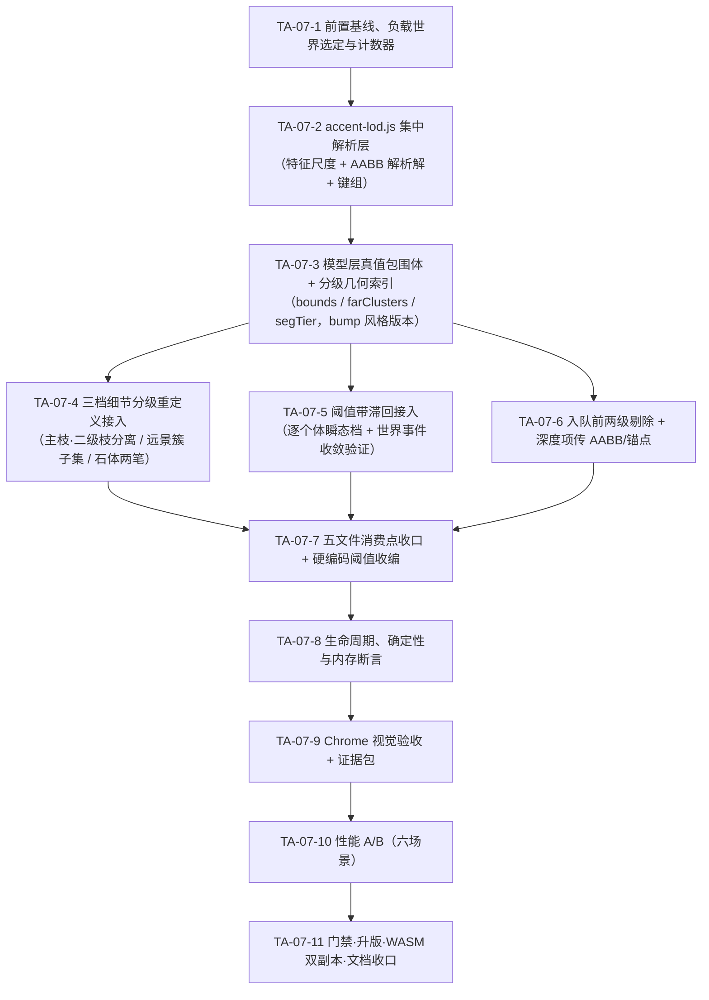

# TA-07 技术实施方案与任务列表 · 细节分级 LOD（滞回）+ 完整投影包围体剔除 + 局部几何模型缓存

> **状态：◐ 部分实施（2026-09-14 实施，v1.50.65，HEAD 后续提交）。** 规划态源码事实为 2026-09-14 逐行核对结论（应用版本 v1.50.61、HEAD `c884c94`）；**实施后事实以各任务「实施记录」为准**。
> **实施范围（TA-07-1~8 实现 + 静态/数值层验证、TA-07-11 门禁与文档收口已落地；TA-07-9 视觉验收与 TA-07-10 性能 A/B NOT_RUN，故按 §6 完成定义记 ◐）**：TA-07-2/3/4/5/6/7 全部落地并通过临时断言（AABB 保守性 722,736 点零越界、一级常数表 15,000 条目零越界、滞回四项零失败、分级几何纯函数性零失败、**漏画 0 例**）与绘制层沙箱冒烟（40,000 实体 + 16,000 阴影 + 320 景观 + 4,800 关态回退绘制零异常零 NaN）；TA-07-1 基线采集、TA-07-8 四事件端到端/内存/DPR 实测、TA-07-9 Chrome 视觉与证据包、TA-07-10 六场景 A/B 均 NOT_RUN。详见 [07 号 §11.4 TA-07 实施记录](docs/plan/tech/07-terrain-art.md) 与 [01-changelog v1.50.65](docs/current/01-changelog.md)。
> **任务来源**：[07 号地形美术规划](docs/plan/tech/07-terrain-art.md) §1.2 TA-07（原代号 M3、P1）、§4.2 尺度与信息层级、§6.7 模块拆分与模型缓存、§10.2 缓存失效契约、§11.3 性能预算、§11.4 Accent 专项验收；验证方法论复用 [09 号植被样板验证方案](docs/plan/tech/09-vegetation-verification.md)。
> **交付目标**：把现有「分散、无滞回、锚点式启发余量」的装饰细节控制，升级为**单一口径的三档 LOD（远/中/近，阈值带滞回）+ 入队前完整投影包围体剔除 + 模型层分级几何缓存**；同一种植株/岩石/草丛在四季、四方位、存读档与回溯后形态逐位一致，缩放穿越阈值不闪烁，屏外装饰不再支付深度计算与模型构建成本。
> **难度 / 工期**：07 号台账标定「中」（3~8 人日）；本方案含五文件消费点收口、口径统一与完整验收矩阵，估计 **11~12 人日**（降范围选项见 §0.3-4，最小集可压至约 7.5 人日但只能记 ◐ 部分完成）。

---

## 0. 前置门禁与开工条件

### 0.1 依赖状态核对

| 前置 | 07 号台账状态 | 2026-09-14 实际核对 | 对 TA-07 的影响 |
| :--- | :--- | :--- | :--- |
| TA-01~TA-04 | ✅ v1.50.23~46 全落地 | accent 三件套 + `render_grass.js` / `render_shadows.js` / `render_depth_queue.js` 拆分均在位，`accentModelStyleVersion = 4` | 可直接在其上扩展，无需重建底座 |
| **TA-06** | ⏳ 未实施（方案已出 [TA-06-TODO.md](TA-06-TODO.md)，2026-09-14） | 台账 TA-07 依赖 TA-06。TA-06 将交付：`render_bush.js` 拆分、**冠幅/实高/足迹改模型单一来源**（`sk.crownR` / `sk.footprintR`）、`extentOf` 由骨架求值、三乔木轮廓（冠幅 4.8~10.5 差异显著）、`accentModelStyleVersion` 4→5 | **包围体与 LOD 尺度必须读模型真值**。若在 TA-06 前开工，包围体只能取现状三处硬编码常数（`render_accents.js:293` 冠幅 8.5、`:581` 灌木 `5.5+vSeed×1.2`、`render_shadows.js:63` 同款），TA-06 一落地即全部错位。**建议严格按台账顺序 TA-06 → TA-07**；若必须先做性能部分，只可提前 TA-07-6（入队剔除，用 kind 级保守常数）与 TA-07-5（滞回），三档重定义与真值包围体等 TA-06 |
| TA-05 | ◐ 保持未完成 | LOAD 存档链路 NOT_RUN；TA-04-8「高密·拖动」p95 超标（+5.8~14.8 ms）处置待用户取舍（07 号 §11.3） | TA-07 不直接依赖。TA-07-10 的六场景 A/B 会为超标处置**提供数据**，但不得据此宣称 TA-05 / TA-04-8 已收口（07 号明写「不构成本项豁免」） |
| TA-08 | ✔ 已删除视为完成（2026-09-17：重定向后仅剩测量工作、无功能开发任务，经用户确认删除） | 无跨实体遮挡拆分 | 原计划以 TA-07 真值包围体为遮挡实测底座，实测随任务删除不再执行。★ 遮挡的**技术解**由全量 WebGL 深度缓冲承担（[31 号 §8](docs/plan/tech/31-canvas-to-webgl-migration.md)），验收矩阵并入该文 §8.5，**不得**在 TA-07 内实施 |
| TA-18 | ⏳ 未实施 | 无分块缓存、无远景减量、无缓存内存上限治理 | TA-07 只做**个体级**剔除与分级；地形/装饰分块缓存、远景减量、离屏精灵预渲染一律归 TA-18，不重复实施 |
| TA-11 / TA-14 | ✅ v1.50.38 / v1.50.49 | 五类 accent 全链路 + `landscape-mask.js` 表现层遮罩在位 | 剔除与 LOD 必须在遮罩判定**之后**（被遮罩个体已 `continue`，不付剔除成本）；样板选址仍先过 `LandscapeMask.accentHidden` |
| S7-03 / S7-05（**工作区未提交**） | — | `crates/sim_core/src/geo/accents.rs` 已改：草原 `grassland_plain_v1` GrassTuft 预算 ×8（60→**480**）、Tree ×0.2（40→**8**）；半坡 `hillside_woodland_v1` Tree ×4（40→**160**）。通用世界基线仍为 Tree 40 / Boulder 20 / Bush 25 / RockCluster 12 / GrassTuft 60 = 157 | 直接决定 TA-07 的收益量级与样板世界选择（§2.2 量化）。若该批改动**未合入**，用既有配置 `terrainAccentDensity = 2.0`（内核 `clamp(0.0, 2.0)`）造等效高负载，**零内核改动** |

### 0.2 与相邻任务的边界（防重复实施）

- **TA-12（地表纹样 LOD）不回改**：`terrain-texture.js` 的 `detailFadePx: [2,5]` smoothstep 连续淡入已收口（v1.50.53，含 TA-12-7 热调 live 化）。TA-07 只**参照其「CSS px 特征尺度」口径**，不改其实现、不把纹样纳入装饰 LOD。
- **标签 LOD 不回改**：`labelPoiNameMinZoom`(0.50) / `labelStockRingMinZoom`(0.70) / `labelHouseNumberMinZoom`(1.05) 走 `camera.zoom` 口径且已由 `label-layout.js` 统一接管（TA-16 ✅），本任务**不动**——装饰族的像素尺度口径与标签的缩放口径并存属设计取舍，强行统一会牵动 TA-16 验收。
- **TA-13（季节地表调色）/ TA-15（落叶地被）无交集**：TA-07 不改颜色公式、不改季相曲线。
- **TA-04 受光管线不回改**：`accentLitFill` / `cylinderShade` / `shearNormalInto` 全部沿用；LOD 只决定**画不画**，不决定**怎么着色**。

### 0.3 开工前需用户确认的四项取舍

1. **滞回状态载体**（§3.3）
   - **建议：逐个体瞬态字段** `accent._lodT` / `child._lodT`（0/1/2）。先例充分：`landscape-mask.js` 的 `accent._lm`、`render_landscapes.js` 的 `child._view` / `child._q` 都是「源数组不变、只挂表现层瞬态字段」；且字段**随对象生命周期自然失效**（换世界时 `terrain.accents` 整组替换 → 新对象无字段 → 首帧按无滞回裸判档收敛），无需新增清理钩子。
   - 备选：全局尺度滞回（只存一个数值，同屏个体档位交错时仍会各自抖动）。
   - **红线**：严禁用模块级 `Map<id, tier>` 存滞回——那需要显式清理钩子，漏一处就跨世界残留。
2. **中景是否停画二级枝**（§3.2，文档与实现冲突）
   - 现状：`render_accents.js:378` 的 `detailMid` 分支遍历**全部** `sk.segments`，而 `accent-model.js:152/160` 把主枝（`wK 0.42`）与二级枝（`wK 0.24`）交替 push 进同一数组 → 中景实际已画二级枝，近景只多「簇亮部」，与 07 号 §6.7「中景绘制主要枝簇、近景增加细枝」**不一致**。
   - **建议：按文档口径改**（模型层给枝条分 tier，中景只画主枝、二级枝移入近景）。代价：中景枝量约减半，观感变化可见。
   - 备选：保持现状实现，改为修订 07 号 §6.7 文字（则本项无观感变化，但「三档」的信息层级差异仅剩亮部与簇子集）。
3. **远景是否做减量简化**（§3.2/§3.6）
   - **建议做两项**：① 远景石体走「顶面 + 剪影描边」两笔，省 `drawStoneBody` 的 7 次侧面片受光（`render_accents.js:538-549`）；② 远景树冠取**簇子集**（按簇半径降序前 K 个，模型层预生成索引表），Pass A 并集剪影观感不变。
   - 明确**不做**「远景整株画成单个椭圆剪影」——那会让 TA-06 的三乔木轮廓在远景完全不可辨，直接抵消 TA-06 成果。
   - 若担心观感风险，可只保留 ①（石体），把 ② 移出本轮。
4. **降范围与否**
   - **全量（建议）**：§5 全部 11 个子任务，约 11~12 人日。
   - **B 档**：去掉观感变化项（取舍 2、3）→ 约 10 人日，07 号 TA-07 可记 ✅。
   - **A 档（性能优先最小集）**：只做 TA-07-1/2/3(部分)/5/6/8/9/10/11 → 约 7.5 人日，画面**零观感变化**，但 07 号 TA-07 只能记 ◐（同 TA-05 / TA-17 先例）。

---

## 1. 范围与边界

| 做 | 不做 |
| :--- | :--- |
| 新建 LOD 集中解析层（统一「世界→CSS px」特征尺度、三档判档、滞回、屏幕 AABB 解析解），供装饰/景观/阴影/草丛/队列五处共用 | 新增内核字段、FABS section、`SimConfig` 字段、存档结构版本变更（纯前端表现层） |
| 模型层输出**真值包围体**（水平 reach + z 范围，由骨架几何求值）与**分级几何索引表**（远景簇子集、主枝/二级枝分 tier） | 缓存「相机 × 季节 × 光向」组合精灵、离屏 Canvas 预渲染（07 号 §10.2 明令禁止 / 收益归 TA-18 实测） |
| 入队前**两级视口剔除**（kind 级保守常数粗剔 → 模型真值 AABB 精剔），屏外个体不付 `_decalDepth` 地形格查询、不付模型构建 | 地形格 / 道路分段 / POI / 房屋 / 族人的剔除策略变更（仅装饰族 + 景观子图元 + 树灌木阴影） |
| 三档细节分级重定义（远景树形与叶量 / 中景主要枝簇 / 近景细枝叶片），阈值带滞回消除缩放闪烁 | 跨实体遮挡处理（★ 2026-09-17 起改由全量 WebGL 深度缓冲承担，见 [31 号 §8](docs/plan/tech/31-canvas-to-webgl-migration.md)；原 2D 侧遮挡拆分策略已取消）；分块缓存与远景减量（TA-18） |
| 分散阈值收编进 `config.render.js` 单一键组，未进配置的两处硬编码（芦花穗 2px、贴地片 1px）一并收编 | 回改 `terrain-texture.js::detailFadePx` 与标签 zoom 口径（§0.2） |
| 剔除与 LOD 的计数器（dev 模式限频输出，验收用后删除） | 持久化单元测试（根 AGENTS.md §4.10 禁令） |
| 六场景性能 A/B（含草原 480 丛 / 半坡 160 树高负载） | 以此宣称 TA-04-8 高密·拖动超标项已解决（该处置仍归用户取舍） |

---

## 2. 当前源码基线（2026-09-14 逐行核对）

### 2.1 LOD 与剔除的现有实现

| 位置 | 当前事实 | TA-07 处置 |
| :--- | :--- | :--- |
| [render_accents.js](frontend/js/render_accents.js):270-276 | `accentDetailLevels()` → 模块级复用对象 `_detailLv{mid:7, near:15}`，读 `accentDetailMidPx` / `accentDetailNearPx`；**无滞回**，直接 `>=` 比较 | 迁出为 `accent-lod.js` 的滞回判档入口；键名与缺省值不变 |
| 同上:293、297-299 | Tree：`crownR = 8.5 * scaled`（`scaled = accent.scale × camera.zoom`），`detailMid = crownR >= 7`、`detailNear = crownR >= 15` | 尺度改读模型真值（依赖 TA-06 `sk.crownR`）；判档走滞回 |
| 同上:581、584-585、601 | Bush：`r = (5.5+vSeed×1.2) × scaled`，`detailNear = r >= 15`，茎绘制条件 `r >= lv.mid` | 同上 |
| 同上:378-410 | `detailMid` 分支遍历**全部** `sk.segments`（主枝 `wK 0.42` 与二级枝 `wK 0.24` 混在同一数组，`accent-model.js:152/160`）→ 中景已画二级枝 | §0.3-2 取舍点；模型层分 tier 后按档取子集 |
| 同上:419-431、463-485 | 叶簇：全量遍历 + 全量投影 → `v < 0.06` / `rr < 0.5` 过滤 → Pass A 单 path 并集 + Pass B 逐簇受光；`_crownScratchPool` 零 GC + `_sortScratch` 稳定插入排序 | 远景档改取模型预生成簇子集；零 GC 纪律沿用 |
| 同上:425 | 簇级剔除**只判 y**（`p.y < -40 \|\| p.y > h+40`），不判 x；Bush 侧（:643-653）**无**簇级剔除 | 由实体级 AABB 精剔取代；保留簇级作二级兜底并补 x 判据 |
| 同上:244-246 | 视口粗剔除 = **锚点 + 固定启发余量** `upMargin = 24+44×zoom`、`xMargin = 24+14×zoom`、下方仅 `h+20`；与个体尺度、冠幅、影长、俯角均无关 | 替换为解析式屏幕 AABB（§3.4），口径唯一 |
| 同上:349、398、623 | 枝干明暗带阈值 `accentBarkBandMinWidthPx`(2.0)：主干带按干宽、枝/茎高光按线宽 | 收编进统一键组；判据不变（子图元级 px 阈值保留） |
| 同上:478、693 | 簇亮部 `accentCrownLitMinPx`(2.2) + `detailNear` | 同上 |
| 同上:718、754、765 | RockCluster 子石 `accentRockClusterLODMinRadius`(0.6) 逐石省略（本体与接触阴影各判一次） | 同上；另加**远景整簇简化**（§0.3-3） |
| 同上:524-566 `drawStoneBody` | Boulder / RockCluster 子石共用：7 侧面片逐片 `accentLitFill` + 顶面 + 剪影描边；**无分档**，恒全量 | 远景档走两笔简化 |
| [render_grass.js](frontend/js/render_grass.js):76-78 | `accentGrassTuftLODMinPx`(1.4)：草叶屏长 `hBaseLod × scaled < 1.4px` 整丛省略（S7-03 高密草甸）；**无滞回** | 纳入滞回；阈值口径改为统一特征尺度 |
| 同上:144 | 芦花穗 `pl >= 2`（**硬编码 2px，未进配置**） | 收编为配置键 |
| [render_shadows.js](frontend/js/render_shadows.js):63-65 | LOD：`crownR = (Tree 8.5 / Bush 5.5+vSeed×1.2) × accent.scale × zoom`，`< accentShadowMinPx`(2.5) 整组省略；冠幅**硬编码**（TA-06 §3.8 已列为待修） | 冠幅改读模型；阈值纳入统一档 |
| 同上:71-73 | 剔除：`ext = crownR×1.8 + \|so.x\| + \|so.y\|` 后 AABB 判——**已有包围体雏形**，但冠幅硬编码、`so` 含 zoom、系数 1.8 为经验值 | 换为 §3.4 解析 AABB（冠影 + 影梢并集），系数由几何求值 |
| 同上:48 | profile 解析 `model.evergreen ? 'evergreen' : undefined`（TA-06 将改单一入口） | 随 TA-06，不在本任务重复改 |
| [render_landscapes.js](frontend/js/render_landscapes.js):104-112、161-163 | 入队与绘制**各写一遍**同款 `44/14` 启发余量剔除（与装饰层重复）；:130 阴影足迹 `fp` 硬编码 Tree 10.5 / Bush 8；:225 贴地片 `r < 1` 硬编码 | 改用共享 `AccentLOD` 入口；`fp` 随 TA-06 读模型；`r < 1` 收编配置 |
| [render_depth_queue.js](frontend/js/render_depth_queue.js):465-473 | 装饰入队：遍历**全部** `terrain.accents`，遮罩判定后逐个 `_decalDepth(accent.x, accent.y, 8)`；**无任何视口剔除** | 前置两级剔除（§3.5），屏外零成本 |
| 同上:481-504 | 阴影入队：Tree/Bush 逐个 `AccentModel.get()` + `_decalDepth` ×2（基点 + 影梢）；**无剔除** | 同上；复用已取模型与实体 AABB |
| 同上:95-132 | `_ownCellCenterDepth()`（4 格访问 + clamp + floor）；`_decalDepth()` 每次调它 **3 次**（格心 + 朝相机 0.5/1.0 两采样） | 不改公式（v1.50.13 贴面防埋契约）；只减少**调用次数** |
| 同上:56-66 | `_depthItem` 池字段 `{kind,a,b,c,d,depth,s1x,s1y,s2x,s2y,dash}`（道路分段在用 s1/s2/dash） | 装饰/景观项复用 `s1x/s1y/s2x/s2y` 存屏幕 AABB，新增 `ex/ey` 存锚点屏幕坐标 → 绘制端零重算（§3.5） |
| [accent-model.js](frontend/js/accent-model.js):354-363 | `extentOf(kind,vSeed)` 返回**硬编码常数**（Tree `trunkH+8.5×1.3`、Bush 8、Boulder 7、RockCluster 10、GrassTuft 7），注释自述「TA-07 包围体剔除的预留字段」，**当前全仓无消费点** | 由骨架几何求真值并首次接入消费（与 TA-06 §3.8 协同，避免两处重复改） |
| 同上:48、366-397、400-402 | `_CACHE_MAX = 2048`（超限**整体清空**，非 LRU）；键 `v{styleVersion}#{kind}#{id}`；`resetCache()` 挂 `rustworld.js::_invalidateWorldStaticCaches()` 四事件 | 上限与生命周期**不变**；只增模型字段（§3.6） |
| [main.js](frontend/js/main.js):19-26 | `dpr = min(devicePixelRatio, 1.25)`；`canvas.width = innerWidth × dpr`；`ctx.setTransform(dpr,0,0,dpr,0,0)` → **全部绘制坐标为 CSS px**，DPR 由变换承担 | 确认 LOD「像素尺寸」口径 = **CSS px**（与 TA-12-3 一致），阈值天然 DPR 无关 |
| [rustworld.js](frontend/js/rustworld.js):317-323 | `_invalidateWorldStaticCaches()`：`_terrainCached=false` + `terrain` 整体重建（accents 换新对象）+ `AccentModel/LandscapeModel/LandscapeMask.resetCache()`；READY/LOAD_RESULT/REWIND_RESULT/RESET_DONE 四处调用 | 滞回瞬态字段随对象替换自然失效（§3.3）；断言验证首帧收敛 |

### 2.2 量化基线：屏外个体当前照付的成本

`_decalDepth` = 3 次 `_ownCellCenterDepth`；阴影入队 = 基点 + 影梢共 6 次。每帧固定支出（**与视口无关**）：

| 世界 | accent 总量 | 装饰入队格查询 | 阴影入队格查询（Tree+Bush ×6） | 合计/帧 |
| :--- | :--- | :--- | :--- | :--- |
| 通用（T1/T2，density 1.0） | 157（Tree 40 / Boulder 20 / Bush 25 / RockCluster 12 / GrassTuft 60） | 157×3 = 471 | 65×6 = 390 | **861** |
| 通用 × `terrainAccentDensity 2.0` | 314 | 942 | 780 | **1,722** |
| 半坡密林（S7-05，Tree ×4） | 277 | 831 | 185×6 = 1,110 | **1,941** |
| 草原草甸（S7-03，GrassTuft ×8） | 545 | 1,635 | 33×6 = 198 | **1,833** |

典型视口（1600×900、zoom 1.0）覆盖世界约 1/4~1/2 → 入队前剔除可直接省下**约一半至四分之三**的上述格查询，外加：屏外个体不再 `AccentModel.get()`（冷缓存/相机跳变时**不构建屏外骨架**，直接改善 07 号 §11.3「相机跳变重建首帧 p95 46.0→60.2 ms」项）、不进 `list.sort()`、不进分发循环。装饰总量越高收益越大——这正是 S7-03/S7-05 抬预算后的主战场。

### 2.3 已发现的四处口径漂移（本任务顺带修正，属 LOD 落地的必要条件）

1. **判档尺度不统一**：冠屏半径（Tree/Bush/阴影）、干宽与线宽（明暗带）、子石屏半径（碎石）、草叶屏长（草丛）、穗屏长（芦花）、贴片屏半径（GroundPatch）、`camera.zoom`（标签）七种口径并存，无法回答「这一株现在处于哪一档」。
2. **剔除口径三套**：装饰/景观用 `44/14` 启发余量（且景观入队与绘制各写一遍），阴影用 `crownR×1.8+|so|`，地形格用 `±20px` 顶点 AABB（`render_depth_queue.js:237`，本任务不动）；装饰与阴影**入队阶段完全不剔除**。
3. **两处阈值未进配置**：芦花穗 `pl >= 2`（`render_grass.js:144`）、贴地片 `r < 1`（`render_landscapes.js:225`）——违反根 AGENTS.md §4.12「禁止散落字面量」的表现层同源要求（`config.render.js` 内全部键均有缺省回退）。
4. **文档与实现的档位语义冲突**：07 号 §6.7 与 `render_accents.js:15` 注释都写「中景画主枝、近景加二级枝」，实现是中景画全部枝条（§0.3-2）。

---

## 3. 设计方案

### 3.1 统一特征尺度口径（`accent-lod.js` 唯一入口）

```text
lodScale = camera.zoom                       // 世界单位 → CSS px（main.js:23 setTransform 承担 DPR）
特征尺度 featurePx(个体) = 主体特征世界尺寸 × accent.scale × lodScale
  Tree / Bush      → sk.crownR（TA-06 后的模型真值；TA-06 前退化为现状常数）
  Boulder          → 石半径 6（现状 drawStoneBody 入参）
  RockCluster      → 主石半径 + spread（整簇外接）
  GrassTuft        → 株高 hBase（现状 render_grass.js 口径）
  GroundPatch      → child.radius
```

- **判档只用 `featurePx`**；子图元级阈值（明暗带干宽、簇亮部簇半径、子石半径、穗长）保留各自 px 判据，但键名与缺省值统一收进 `RENDER_CONFIG.accentLOD` 键组，便于一次性调参与审计。
- 尺度口径 = **CSS px**，与 `terrain-texture.js::detailFadePx` 同源；DPR 变化不改档位（`ctx.setTransform` 已承担），需在验收中实测确认（§6「DPR 无关」行）。
- 严禁在 LOD 层读 `devicePixelRatio`、`canvas.width`、季节、光向或模拟状态——LOD 是 `(个体几何, camera.zoom)` 的函数（滞回收敛后）。

### 3.2 三档细节分级重定义

档位判据：`featurePx < mid(7)` → **far**；`mid ≤ featurePx < near(15)` → **mid**；`≥ near(15)` → **near**（阈值沿用现键值，首轮不改数值，只改语义与滞回）。

| 图元 | far（远景：树形与叶量） | mid（中景：主要枝簇） | near（近景：细枝叶片） |
| :--- | :--- | :--- | :--- |
| Tree 主干 | ✅ 锥形剪影（明暗带仅 `bw ≥ 2px`） | ✅ + 迎光/背光带 | ✅ 同 mid |
| Tree 枝条 | ❌ 全略 | ✅ **仅主枝**（tier 0） | ✅ 主枝 + **二级枝**（tier 1） |
| Tree 叶簇 | ✅ **簇子集**（半径降序前 `clustersFarMax` 8）Pass A 并集 + Pass B 受光 | ✅ 全簇 | ✅ 全簇 + **簇亮部**（`rr ≥ 2.2px`） |
| Tree 春芽 | ❌ | ✅ `budAmount > 0.12` | ✅ |
| Tree 花朵（TA-06-7 产物） | ❌ | ✅ | ✅ |
| Bush 茎 | ❌ | ✅ | ✅ |
| Bush 叶簇 / 亮部 | 子集 / ❌ | 全簇 / ❌ | 全簇 / ✅ |
| Boulder | **两笔**：顶面 + 剪影描边 | 完整 `drawStoneBody`（侧面片受光） | 完整 |
| RockCluster | 主石两笔，伴生碎石全略 | 逐石完整（`r ≥ 0.6px`） | 逐石完整 + 接触阴影 |
| GrassTuft | 整丛省略（`< 1.4px`，现状保留） | 草叶 + 穗（`≥ 2px`） | 草叶 + 穗 |
| 贴地投影（Tree/Bush） | 省略（`< accentShadowMinPx 2.5px`，现状保留） | 三段影 | 三段影 |
| GroundPatch | `r < 1px` 省略 | 两遍式色差 + 点簇 | 同 mid |

- 分档**只增删图元**，不改任何颜色公式、几何公式、深度口径与画序（Pass A → Pass B 两遍式树冠纪律不变，07 号 §6.4 / v1.50.27 红线）。
- 远景簇子集必须走 **Pass A 并集剪影**（子集内簇仍单 path 一次填充），否则远景树冠会退化成离散气泡（v1.50.27 教训）。
- 子集选取是 `accent.id` 纯函数（按簇 `r` 降序、同径按数组序稳定 tie-break），**入模型缓存**，读档/回溯逐位一致。

### 3.3 滞回机制（阈值带，消除缩放闪烁）

```text
// 逐个体：tier ∈ {0=far, 1=mid, 2=near}；h = accentLODHysteresis（建议 0.12）
升档（tier → tier+1）条件： featurePx ≥ T(tier+1)                 // 上行用裸阈值
降档（tier → tier-1）条件： featurePx <  T(tier) × (1 − h)          // 下行留 12% 死区
首帧（无 _lodT 字段）    ： 按裸阈值直接判档（= 上行路径）
```

- 滞回带 = `[T×(1−h), T)`：`camera.zoom` 在该带内往复时档位**保持不变**，滚轮微调与临界缩放不再让枝条/亮部反复开关。
- 状态载体 = 个体对象瞬态字段 `accent._lodT` / `child._lodT`（§0.3-1）；**随对象生命周期失效**：READY/LOAD_RESULT/REWIND_RESULT/RESET_DONE 时 `rustworld.js:319` 重建 `terrain.accents` 与景观组 → 新对象无字段 → 首帧裸判档收敛。
- 滞回是**有界历史依赖**，必须在文档与验收中明确其边界：① 只影响档位（画哪些图元），不影响几何、颜色、深度、排序；② 收敛后（相机静止 ≥1 帧）同 `(个体, zoom)` 判档唯一，截图可复现；③ 不进快照、不入存档、不消耗 `WorldRng`、不参与逐字节确定性承诺；④ 高倍速与连续拖动下不得产生频闪（07 号 §11.4 生命周期行）。
- 相机 `zoom` 由滚轮离散步进，实测滞回带需覆盖「单档滚轮步进 × 个体 `accent.scale` 离散度（0.7~1.4）」——首轮 `h = 0.12` 为建议值，TA-07-9 用缩放扫掠实测调优并记录终值。

### 3.4 完整投影包围体（解析式屏幕 AABB，非 8 角枚举）

模型层输出**真值局部包围体**（世界单位，未乘 `accent.scale`/`zoom`）：

```text
bounds = { rH, zMin, zMax }   // rH = 水平最大 reach（簇/枝/石顶点的 max hypot(x,y) + 该点半径）
                              // zMin/zMax = 竖直范围（Tree 含冠顶，zMin 通常 0）
```

倾干剪切 `wx = dx + s·dz`（`s = cos(rotation) × 0.22`，绘制层施加、不入模型缓存）使水平 reach 变为 `rH + |s| × zMax` → 屏幕 AABB 解析解（与 `render_*` 全族同一套相机变换）：

```text
R  = (rH + |s|·zMax) × accent.scale × zoom            // 剪切补偿后的水平屏幕半径
zx1 = −zMin·sinX,  zx2 = −zMax·sinX                    // 符号安全：不假设 sinX > 0
syLo = sy + min(zx1, zx2)·accent.scale·zoom − R·cosX
syHi = sy + max(zx1, zx2)·accent.scale·zoom + R·cosX
AABB = [sx − R, sx + R] × [syLo, syHi]
```

- **保守上界**：水平圆盘经 `rotZ` 仍是圆盘、经 `rotX` 压成 `cosX` 系数 → 无需枚举 8 角，4 次乘加即得，成本低于现状启发余量。
- 贴地投影另算：以 `(sx, sy)` 与影梢 `(sx+so.x, sy+so.y)` 为两中心、半径 `crowW × shadowK × 1.12`（冠影长半轴，`render_shadows.js:101` 现值）的圆之并集 AABB → 覆盖接地弱影、枝影与冠影三段。
- **`extent` 字段归宿**：`extentOf()` 的硬编码常数由 `bounds` 真值取代（与 TA-06 §3.8 同一改造点，**只改一次**：谁先落地谁改，后者复核）。
- 严禁把 `poiMarkerFootprintR` / `accentFootprintR` 这类**深度辅助半径**当视觉包围体用（`landscape-mask.js` 已有同款红线先例）。

### 3.5 入队前两级剔除 + 深度项传递（消除绘制端重算）

```text
一级（粗剔，零模型访问）：kindBounds(kind) 保守常数表 → 解析 AABB → 屏外 continue
                          ⇒ 屏外个体不付 AccentModel.get()（冷缓存不构建屏外骨架）
                                     不付 _decalDepth（省 3~6 次 _ownCellCenterDepth）
                                     不进 list.sort()、不进分发循环
二级（精剔，模型真值）  ：get() 命中 → bounds 真值 AABB → 屏外 continue
入队：_depthItem 存 s1x/s1y/s2x/s2y = AABB 四值，新增 ex/ey = 锚点屏幕坐标
分发：drawAccentEntity(accent, it) / drawLandscapeChild(child, it) / drawAccentShadowGround(accent, it)
      第二参可选——传入则直接消费（零重投影、零重剔除）；缺省则内部自算（保持独立可调用与可测性）
```

- 一级常数表建议值（保守，宁可多画不可漏画）：Tree `rH 12 / zMax 17`、Bush `rH 7 / zMax 5`、Boulder `rH 6 / zMax 2`、RockCluster `rH 10 / zMax 4`、GrassTuft `rH 3 / zMax 7.5`（芦草株高 6.0 + 穗 1.5，与现状 `extentOf` 的 7 对齐）；TA-07-3 以骨架实测最大值校核并记录。
- **口径唯一红线**：入队端与绘制端必须消费**同一个** AABB（由深度项传递），严禁两处各算一套——否则会出现「入队了却被绘制端剔掉」（浪费）或「没入队但绘制端本会画」（**漏画**，可见缺陷）。现状 `render_landscapes.js:104-112` 与 `:161-163` 重复两份正是这个隐患的样本。
- 遮挡关系不变：剔除只减少入队项，不改 `DEPTH_*` 常量、不改 `_surfaceDepth`/`_decalDepth` 公式、不改稳定排序（07 号 §3.2 渲染确定性）。被剔除个体本就在屏外，深度序无影响。
- 遮罩判定（`LandscapeMask.accentHidden` / `childHidden`）保持在剔除**之前**（现状顺序），被遮罩个体不付剔除成本。

### 3.6 分级几何缓存（模型层，入现有缓存条目）

每个模型条目新增（全部为 `(kind, id)` 纯函数，随现有键 `v{styleVersion}#{kind}#{id}` 缓存）：

| 字段 | 内容 | 用途 |
| :--- | :--- | :--- |
| `bounds` | `{rH, zMin, zMax}` 真值 | §3.4 精剔与 LOD 尺度 |
| `farClusters` | `Uint8Array` 簇索引（半径降序前 `clustersFarMax`） | 远景簇子集，免每帧排序/筛选 |
| `segTier` | `Uint8Array` 逐段 tier（0 主枝 / 1 二级枝；Bush 恒 0） | 中景只遍历 tier 0，免每帧按 `wK` 判 |
| `stoneMain` | 主石索引（恒 0，显式登记） | 远景 RockCluster 只画主石 |

- **不新增缓存池、不改上限、不改生命周期**：`_CACHE_MAX = 2048` 与 `resetCache()` 四事件契约不变。
- 内存量化（TA-07-8 实测记录）：草原世界 accent 545 + 景观子图元约 60 ≈ **605 条** ≪ 2048；新增字段每条 ≤ 64 B → 总增量约 **39 KB**，相对 07 号 §11.3 的 64 MiB 预算可忽略。
- **新增配置键属几何输入** → 必须 bump `accentModelStyleVersion`（TA-06 后为 5 → **6**；若 TA-06 未落地则 4 → 5），沿用 TA-11-4 芦草 3→4 先例与 07 号 §10.2 缓存键契约。
- 严禁缓存：投影结果、屏幕 AABB、档位（滞回状态挂个体对象，不挂模型）、季节/光向/相机派生的任何精灵。

### 3.7 配置键规划（[config.render.js](frontend/js/config.render.js)，全部须有真实消费点）

新增 `accentLOD` 键组（集中管理，逐键缺省回退与集中值一致）：

| 键 | 建议值 | 消费处 |
| :--- | :--- | :--- |
| `accentLODHysteresis` | 0.12 | `accent-lod.js` 滞回死区比例 |
| `accentLODFarMaxClusters` | 8 | `accent-model.js` 远景簇子集上限 |
| `accentLODStoneFarSides` | true | `render_accents.js` 远景石体两笔简化开关（§0.3-3） |
| `accentLODPlumeMinPx` | 2.0 | `render_grass.js`（收编硬编码 `pl >= 2`） |
| `accentLODGroundPatchMinPx` | 1.0 | `render_landscapes.js`（收编硬编码 `r < 1`） |
| `accentLODCullEnabled` | true | 入队前剔除总开关（false = 完整回退现状路径，A/B 与排障用） |
| `accentLODHysteresisEnabled` | true | 滞回总开关（false = 裸阈值判档，A/B 用） |
| `accentKindBounds` | §3.5 一级常数表 | `accent-lod.js` 粗剔 |

沿用并迁入键组（**键名与数值首轮不变**，只改归属与注释）：`accentDetailMidPx` 7 / `accentDetailNearPx` 15 / `accentBarkBandMinWidthPx` 2.0 / `accentCrownLitMinPx` 2.2 / `accentRockClusterLODMinRadius` 0.6 / `accentGrassTuftLODMinPx` 1.4 / `accentShadowMinPx` 2.5。

- 两个总开关是**纯渲染开关**：关态必须完整回退现状画面与路径（同 `landscapeEnabled` / `labelLayoutEnabled` / `landscapeMaskEnabled` 先例），**严禁**经 `applyConfig()` 写模拟事实。
- 变更：`accentModelStyleVersion` +1（§3.6）；键组注释固定写法「本组含几何输入（`FarMaxClusters` / `accentKindBounds`），调值必须同步 bump `accentModelStyleVersion`；纯阈值键（`Hysteresis` / `*MinPx`）不入缓存键，热调即生效」（对齐 TA-12-7 的 live 化教训）。

### 3.8 文件拆分与加载顺序（守 800 行红线）

| 文件 | 现状行数 | TA-06 后预估 | TA-07 后预估 | 处置 |
| :--- | :--- | :--- | :--- | :--- |
| **`accent-lod.js`（新建）** | — | — | ~180 | LOD 集中解析层：特征尺度、滞回判档、解析 AABB、阈值键读取、dev 计数器 |
| `render_accents.js` | 771 | ~680（拆出 `render_bush.js`） | ~640 | 阈值读取与视口剔除迁出（−60~80），新增分档取子集（+20~40） |
| `accent-model.js` | 412 | ~600-650（三轮廓 + 三变体） | ~700-760 | +`bounds`/`farClusters`/`segTier`（+80~110）。**若逼近 800 → 拆 `accent-species.js`**（TA-06 §3.7-4 已预留该预案） |
| `render_depth_queue.js` | 580 | 580 | ~640 | 两级剔除 + 深度项传 AABB/锚点（+40~60） |
| `render_shadows.js` | 103 | ~110 | ~110 | 冠幅读模型 + AABB 换解析式（±10） |
| `render_grass.js` | 166 | 166 | ~160 | 阈值收编 + 滞回（−10） |
| `render_landscapes.js` | 280 | ~290 | ~270 | 剔除改共享入口，删重复余量式（−20） |
| `config.render.js` | 249 | ~300 | ~340 | 新增 `accentLOD` 键组 |

加载顺序（`index.html`）：`accent-season.js`(23) → `accent-model.js`(24) → **`accent-lod.js`(24b)** → `landscape-model.js`(25) → `landscape-mask.js`(26) → `render_terrain.js`(27) → `render_accents.js`(28) → `render_bush.js`(28b，TA-06) → `render_grass.js`(29) → `render_shadows.js`(30) → `render_landscapes.js`(31) → … → `render_depth_queue.js`(33)。

- `accent-lod.js` 必须早于全部消费者；运行时只依赖 `window.RENDER_CONFIG`（7 位已加载）、`camera`/`w`/`h`（渲染期可用）与 `window.AccentModel`（24 位，函数体内运行时解析，加载期不触碰）。
- 同步登记：[frontend/AGENTS.md](frontend/AGENTS.md) §1.1 文件清单 + §二 加载顺序、[31-code-map.md](docs/current/tech/31-code-map.md)（`code-map-check.js` 门禁）、07 号 §3.3「关键实现入口」补 `accent-lod.js` 一行。

---

## 4. 不变量与红线

1. **零持久化 / 纯表现层**：不新增快照字段、FABS section、枚举字典项、`SimConfig` 字段与存档结构版本；不消费 `WorldRng`、不写模拟状态、不参与逐字节确定性承诺；LOD 开关切换不得改变同种子创世的地形、路网、Agent 行为与账本。
2. **口径唯一**：特征尺度、档位判据、屏幕 AABB 各只有一个实现（`accent-lod.js`）；**严禁**在装饰/景观/阴影/草丛四处各留一份余量公式或阈值字面量（现状漂移 §2.3-1/2 即为反例）。
3. **入队端与绘制端消费同一 AABB**（经深度项传递）；漏画（未入队却本应可见）是**可见缺陷**，验收零容忍。
4. **不改深度与画序契约**：`DEPTH_*` 常量、`_surfaceDepth`/`_decalDepth` 公式、稳定排序、两遍式树冠画序（Pass A 并集 → Pass B 受光）全部不变；剔除只减少入队项。
5. **不改受光与季相公式**：`accentLitFill` / `cylinderShade` / `shearNormalInto` / `SimTreeTint.sample()` 零改动；LOD 只决定画不画，**严禁**按档位改颜色、改法线、改用 `tD` 驱动明暗（TA-04 红线）。
6. **落叶铁律不因分档松动**：枝条全年保留（far 档略去枝条属**细节省略**，主干与冠仍在，冬季裸枝读感由 mid/near 档承担；验收须在 mid 档核对冬枝）、禁整冠透明度、叶簇挂真实枝条。
7. **滞回边界**：只影响档位；瞬态字段挂个体对象（随世界生命周期自然失效），**严禁**模块级 `Map` 存滞回；收敛后判档唯一、截图可复现。
8. **包围体保守性**：一级粗剔常数必须 ≥ 真值上界（宁多画不漏画）；`extent`/`bounds` 由骨架几何求值，不得回填经验系数（现状 `crownR×1.8`、`44/14` 余量属此类）。
9. **零 GC**（TA-11-6 纪律）：新增路径沿用刮擦池与稳定插入排序，AABB 与档位写入复用对象/深度项字段，稳态零逐帧堆分配；dev 计数器只累加数值，不建字符串（输出时限频拼装）。
10. **单文件 ≤800 行**；**持久化测试禁令**：临时断言与计数钩子用后删除，长期验证只跑既有门禁。
11. **不越界实施**：跨实体遮挡处理（★ 2026-09-17 起归 TC-03 全量 WebGL 迁移，2D 侧策略已取消）、分块缓存与远景减量（TA-18）、离屏精灵预渲染、GPU 迁移（TC-03，现为既定路线）一律不在本任务内。

---

## 5. 任务序列

建议顺序：**TA-07-1 → 2 → 3 →（4 ∥ 5）→ 6 → 7 → 8 → 9 → 10 → 11**（4 与 5 可并行；6 必须先于 7）。



**★ 实施状态速览（2026-09-14，v1.50.65）**：

| 子任务 | 状态 | 说明 |
| :--- | :--- | :--- |
| TA-07-1 前置基线 | ◐ | 门禁与依赖核对完成、三组样板世界与**浏览器基线采集 NOT_RUN**（无可用 Chrome）；计数钩子保留至 TA-07-10 |
| TA-07-2 `accent-lod.js` | ✅ | 206 行落地；AABB 保守性 722,736 点零越界、滞回四项零失败 |
| TA-07-3 模型层包围体 | ✅ | `bounds`/`farClusters`/`segTier`/`stoneMain` 落地，`accentModelStyleVersion` 5→6；一级常数表 15,000 条目零越界 |
| TA-07-4 三档分级 | ✅ | 主枝/二级枝分档、远景簇子集、石体两笔、RockCluster 远景只画主石 |
| TA-07-5 滞回 | ✅ | `_lodT` 瞬态字段 + 死区；**缩放扫掠实测调优 `accentLODHysteresis` NOT_RUN**（值暂用建议 0.12） |
| TA-07-6 入队剔除 | ✅ | 两级剔除 + 深度项 `ex/ey`/`lod`；**漏画 0 例**（43,200 样本） |
| TA-07-7 消费点收口 | ✅ | 四处旧启发余量零残留；两处硬编码收编为配置键 |
| TA-07-8 生命周期/确定性/内存 | ◐ | 纯函数性、暖缓存==冷重建、滞回收敛已断言；**四事件端到端、内存峰值、DPR 无关性 NOT_RUN** |
| TA-07-9 Chrome 视觉验收 | ⬜ NOT_RUN | 主矩阵、缩放扫掠、边缘扫掠、LOAD 链路与证据包归档待补 |
| TA-07-10 性能 A/B | ⬜ NOT_RUN | P1~P6 六场景待补（含草原 480 丛 / 半坡 160 树） |
| TA-07-11 门禁·升版·文档 | ✅ | 升版 v1.50.64→v1.50.65、WASM 重编译并双副本同步（MD5 一致 E79829AD…）、`cargo test --lib`/`test-wasm.js`/`test-determinism.js` 全过、`frontend-check`/`config-check`/`cross-doc`/`doc-link`/`bump-version --check` 全绿、文档四条线收口；临时脚本按 TA-07-8 保留 2 个（其余已删），TA-07-11 终清理待 TA-07-10 后执行 |

- [x] **TA-07-1 前置基线、负载世界选定与计数器（约 0.5 日）**
  - 核对根/前端 AGENTS.md、[27 号浏览器自动化](docs/current/tech/27-browser-automation.md)、[25 号性能基准](docs/current/tech/25-benchmarking.md)、[09 号植被样板验证](docs/plan/tech/09-vegetation-verification.md)；确认 §0.3 四项取舍已由用户拍定；确认 TA-06 落地状态（未落地则按 §0.1 缩范围）。
  - 固定**三组样板世界**：① 通用 T1/T2（seed 42 起）② 高装饰负载（草原 `grassland_plain_v1` 480 丛 或 `terrainAccentDensity 2.0` 等效）③ 密林负载（半坡 `hillside_woodland_v1` 160 树）。记录 seed、实际 profile、tick、应用/生成器/存档版本、源码提交、WASM 双副本 SHA256、完整配置、窗口 CSS 尺寸与 DPR、相机参数。
  - 采集基线：三档当前分布（按 `featurePx` 统计各档个体数）、每帧 `_ownCellCenterDepth` 调用次数、`drawAccentEntity` 调用次数、簇遍历总数、统一队列绘制耗时（四场景，口径同 07 号 §11.3 / TA-04-8）。
  - 建立**临时计数钩子**（dev 模式 `sim.debugMode` 限频输出，TA-07-11 删除）：剔除命中率、档位分布、深度计算次数、模型缓存条目数。
  - 交付：基线记录 + 样板清单 + 计数器；不得从既有截图反推 seed，不跳过正式存档门禁。

- [x] **TA-07-2 `accent-lod.js` 集中解析层（约 1.5 日，依赖 1）**
  - 新建 `frontend/js/accent-lod.js`（`window.AccentLOD`）：`featurePxOf(kind, model, accent, zoom)`（§3.1）、`tierOf(featurePx, prevTier, cfg)`（§3.3 滞回，纯函数）、`screenAabb(...)`（§3.4 解析解，写入调用方复用对象）、`kindBounds(kind)`（§3.5 一级常数）、`shadowAabb(...)`（冠影 + 影梢并集）、配置键读取（缺省回退逐键一致）。
  - `config.render.js` 新增 `accentLOD` 键组（§3.7）并迁移既有 7 键的归属注释（**键名与数值首轮不变**）；`index.html` 登记 24b 加载位。
  - **本步不接消费点**（纯新增，画面零变化）；临时断言：AABB 保守性（对 200 个随机个体 × 16 组相机，解析 AABB 必须包含全部骨架顶点投影）、符号安全（`sinX` 取正负两侧）、滞回单调性与死区宽度、纯函数性、缺省回退与集中值逐键一致。
  - 交付：LOD 层 + 键组；`frontend-check.js` 通过，画面逐像素不变。

- [x] **TA-07-3 模型层真值包围体与分级几何（约 1.5 日，依赖 2）**
  - `accent-model.js`：新增 `boundsOf(skeleton, kind)` 由骨架几何求 `{rH, zMin, zMax}` 真值（Tree 含冠顶簇 + 剪切前水平 reach；RockCluster 含 spread + 子石半径；GrassTuft 含芦草穗高位）；`extent` 改由 `bounds` 派生（**与 TA-06 §3.8 同一改造点，谁先落地谁改**）。
  - 新增 `farClusters`（簇半径降序前 `accentLODFarMaxClusters`，`Uint8Array`）、`segTier`（主枝 0 / 二级枝 1；按 `accent-model.js:152/160` 的 push 次序或 `wK` 判）、`stoneMain`。
  - `accentModelStyleVersion` +1（§3.6）；配置注释写明「`FarMaxClusters` / `accentKindBounds` 属几何输入，调值须同步 bump」。
  - 以一级常数表校核：实测各 kind 的 `bounds` 最大值必须 ≤ `kindBounds` 保守常数（否则上调常数并记录）。
  - 临时断言：真值 ≥ 骨架顶点实际范围（保守性）、暖缓存 == 冷重建、`resetCache()` 后一致、风格版本换代生效、零 NaN、子集选取为 id 纯函数（同 id 跨帧/跨世界一致）、非 Tree/Bush 的 `segTier` 恒 0。
  - 交付：模型层包围体与分级索引；画面仍零变化（消费点在 4/6）。

- [x] **TA-07-4 三档细节分级重定义接入（约 1.5 日，依赖 3；可与 5 并行）**
  - `render_accents.js`：Tree 枝条按 `segTier` 分档遍历（mid 只画 tier 0，near 加 tier 1）；远景簇循环改走 `farClusters` 子集（**Pass A 仍单 path 并集**）；`drawStoneBody` 增 `farSimplified` 入参（远景两笔：顶面 + 剪影描边）；RockCluster 远景只画主石。
  - `render_bush.js`（TA-06 产物）/ `render_grass.js`：Bush 簇子集与茎档；草丛档位沿用现状整丛省略 + 穗阈值收编。
  - 判档入口全部改走 `AccentLOD`（删 `accentDetailLevels()` 本地实现）；**颜色/几何/画序公式零改动**。
  - 零 GC 复核：分档遍历不得引入逐帧字面量对象/数组/闭包排序。
  - 交付：三档语义与 §3.2 表一致、远/中/近肉眼可辨且互不混淆；`render_accents.js` ≤800 行。

- [x] **TA-07-5 阈值带滞回接入（约 1 日，依赖 3；可与 4 并行）**
  - 档位状态写入 `accent._lodT` / `child._lodT`（§3.3）；首帧无字段走裸判档。
  - 验证瞬态字段随世界生命周期失效：READY/LOAD_RESULT/REWIND_RESULT/RESET_DONE 后 `terrain.accents` 与景观组为新对象 → 首帧档位 == 裸判档（断言固化）。
  - 缩放扫掠实测调优 `accentLODHysteresis`：以「单档滚轮步进 × `accent.scale` 0.7~1.4 离散度」不触发档位往复为达标线，记录终值与实测死区。
  - 交付：临界缩放零闪烁；滞回开关关态完整回退裸判档（A/B 可用）。

- [x] **TA-07-6 入队前两级剔除与深度项传递（约 1.5 日，依赖 3）**
  - `render_depth_queue.js`：装饰段（:465-473）与阴影段（:481-504）前置一级粗剔（`kindBounds`，零模型访问）→ 二级精剔（`bounds` 真值 AABB）；屏外个体不付 `AccentModel.get()` / `_decalDepth` / 排序 / 分发。
  - `_depthItem` 池：装饰/景观项复用 `s1x/s1y/s2x/s2y` 存屏幕 AABB，新增 `ex/ey` 存锚点屏幕坐标（道路分段用法不变）；分发签名扩展为 `drawAccentEntity(accent, it)` / `drawLandscapeChild(child, it)` / `drawAccentShadowGround(accent, it)`，**第二参可选**（缺省内部自算，保持独立可调用）。
  - 阴影入队改用 `AccentLOD.shadowAabb()`（冠影 + 影梢并集）取代现状不剔除。
  - 剔除总开关 `accentLODCullEnabled=false` 时完整回退现状路径（零剔除、绘制端自算）。
  - 临时断言：**漏画零容忍**——对 3 组样板世界 × 16 组相机 × 三档缩放，逐个体比对「关态绘制集合」与「开态绘制集合」在屏内部分完全一致（屏外差异即剔除收益）；剔除命中率与深度计算次数下降量记录。
  - 交付：入队前剔除生效；屏内画面与关态逐像素一致。

- [x] **TA-07-7 五文件消费点收口与硬编码收编（约 1 日，依赖 4、5、6）**
  - `render_accents.js:244-246` 启发余量式删除 → 改消费深度项 AABB（含簇级 x/y 兜底剔除补齐）；`render_bush.js` 补簇级剔除。
  - `render_shadows.js:63-73` 冠幅读模型 + AABB 换 `AccentLOD.shadowAabb()`；`:65` 阈值纳入统一档。
  - `render_landscapes.js:104-112` 与 `:161-163` 两份重复余量式删除 → 共用 `AccentLOD`；`:130` 阴影足迹随 TA-06 读模型；`:225` `r < 1` 收编为 `accentLODGroundPatchMinPx`。
  - `render_grass.js:144` 穗阈值收编为 `accentLODPlumeMinPx`；`:76-78` 判据改走 `AccentLOD`。
  - 全仓 grep 复核：`44 *`、`14 *`、`* 1.8`、`accentDetailLevels` 等旧口径**零残留**；新增配置键 100% 有真实消费点（根 AGENTS.md §4.12「空转参数」同源纪律）。
  - 交付：口径唯一，五文件全部走 `AccentLOD`；全部触碰文件 ≤800 行。

- [ ] **TA-07-8 生命周期、确定性与内存断言（约 0.5 日，依赖 7）**
  - 四事件端到端：READY / LOAD_RESULT / REWIND_RESULT / RESET_DONE 后暖缓存 == 冷重建、滞回字段随对象换新、换世界 A→B→A 一致、无旧世界残留。
  - 确定性：相机静止收敛后同 `(世界, 相机, 季节)` 逐帧像素一致；滞回引入的历史依赖只在阈值带内、收敛后唯一（断言固化）；暂停不漂移、1024x 无频闪。
  - 内存与缓存：`AccentModel` 条目峰值、新增字段字节量、JS 堆峰值 vs 07 号 §11.3 的 64 MiB 预算；`_CACHE_MAX = 2048` 是否仍充裕（草原 605 条基线）。
  - DPR 无关性：DPR 1.0 / 1.25 两档下同 zoom 档位一致（`ctx.setTransform` 承担 DPR，§3.1）。
  - 交付：断言结论；临时脚本与计数钩子保留至 TA-07-10 后统一删除。

- [ ] **TA-07-9 Chrome 视觉验收 + 证据包（约 1 日，依赖 8）**
  - 主矩阵：三组样板世界 × **四季 × 四方位 × 两档俯角 × 三档缩放**（09 号 §4.2，96 视图/场景），核对三档**真实覆盖**（按 `featurePx` 统计而非 zoom 数字）。
  - 专项：**缩放扫掠**（连续 zoom 穿越 7px / 15px 阈值各 20 次往复）零闪烁、零枝条/亮部抖动；**视口边缘**（四边 + 整圈旋转 + 连续平移扫掠）无弹跳、无半株突现、无漏画；高负载世界（草原 480 丛 / 半坡 160 树）远景观感不糊成一片、近景不缺细节。
  - 受光与季相零回退：固定季相变光向、固定光向转相机（沿用 07 号 §11.1 TA-04 口径）；冬季 mid 档裸枝可辨（红线 6）。
  - 生命周期：真实快照推进、暂停/继续、REWIND、RESET、1024x、动态光开关往返；**LOAD 用真实 Chrome 存档入口**（沙箱受限时如实标 NOT_RUN，并可与 TA-05/TA-06 的 LOAD 缺口合并同批补测）。
  - 证据归档 `docs/plan/tech/assets/ta07-evidence-<日期>/`（`manifest.json` + `report.md` + `visual/` + `metrics/`，沿用 TA-05 结构）；夹具与真实世界截图分开标注。
  - 交付：验收报告 + 缺陷与复测记录；有漏画/弹跳/闪烁/档位错乱则不勾选。

- [ ] **TA-07-10 性能 A/B（约 1 日，依赖 9）**
  - 口径按 09 号 §6 与 07 号 §11.3：基准端 = TA-07-1 基线（LOD/剔除关态），候选端 = 全量落地；同 seed/config 建档，高密负载以时光倒流对齐同一起点 tick。
  - **六场景**：P1 通用·固定 / P2 通用·连续拖动 / P3 高密·固定 / P4 高密·连续拖动（对齐 TA-04-8 四场景便于纵向比较）/ **P5 草原 480 丛·拖动** / **P6 半坡 160 树·拖动**；统一计时边界完整包裹 `drawWorldEntities()`（含入队剔除、阴影入队、排序、分发、绘制），预热 ≥12s、正式采样 ≥60s、≥3 轮交替顺序、p95 nearest-rank。
  - 分解报告：剔除收益（`_ownCellCenterDepth` 调用次数、入队项数、绘制调用数下降量）、LOD 收益（簇遍历数、枝条绘制数、石体侧面片数下降量）、滞回开销、装饰单帧累计耗时、模型缓存条目数与 JS 堆峰值、模拟吞吐 ticks/s、相机跳变重建首帧 p95。
  - 预算：新增绘制 p95 增量 ≤3 ms（本任务**预期为负值**，即改善）；吞吐回退 ≤5%；视觉缓存 ≤64 MiB。**超标先优化复测，不得仅记录结论就标完成**；确需调整预算须提交原始数据与取舍并取得用户明确接受。
  - 对 TA-04-8「高密·拖动」超标项：如实记录改善量与剩余差值，**不宣称已解决**（处置仍归用户取舍）。
  - 交付：两端原始 p50/p95/p99/均值/最差序列 + 差值 + 归因分解。

- [ ] **TA-07-11 门禁、升版、WASM 双副本与文档收口（约 0.5 日，依赖 10）**
  - 执行 §7 全部门禁；`node tools/bump-version.js --patch` → `cargo build -p sim_wasm --target wasm32-unknown-unknown --release` → 双副本同步（升版会改 `world_save.rs::SAVE_APP_VERSION`，**必须**重编译，旧存档按设计自动废弃）。
  - 文档同步：[07 号](docs/plan/tech/07-terrain-art.md) §1.2 TA-07 状态 + §4.2 尺度层级行 + §6.7 现状契约（含 §0.3-2 的档位语义结论）+ §10.2 缓存键与滞回状态条目 + §11.3 实测记录 + §11.4 验收行 + §3.3 实现入口补 `accent-lod.js`；[frontend/AGENTS.md](frontend/AGENTS.md) §1.1 文件清单（新增 `accent-lod.js`、刷新触碰文件行数与职责）+ §二 加载顺序 + §5.9 深度队列契约（深度项新增 `ex/ey` 与 AABB 复用字段）；[31-code-map.md](docs/current/tech/31-code-map.md) 登记；[01-changelog.md](docs/current/01-changelog.md) 追加版本条目；根 [TODO.md](TODO.md) 若登记本文则同步状态；本文件头部状态行更新。
  - 清理：删除全部临时断言、计数钩子与夹具（恢复函数/相机/配置/输入引用并核对 accent 数量复原），最终审阅 diff。
  - 交付：可运行实现 + 验收记录 + 门禁结果；未实测项明确保留未完成。

---

## 6. 验收矩阵与完成定义

| 类别 | 场景 | 通过标准 |
| :--- | :--- | :--- |
| 剔除正确性 | 3 样板世界 × 16 相机 × 三档缩放，关态/开态绘制集合比对 | **屏内集合完全一致（漏画 0 例）**；屏外剔除命中率与深度计算下降量如实记录 |
| 边缘稳定 | 视口四边 + 整圈连续旋转 + 连续平移扫掠 | 无弹跳、无半株突现、无个体在边缘反复进出；贴边个体仍被边界侧壁正确遮盖（v1.50.14 契约不回退） |
| 滞回 | 连续 zoom 穿越 7px / 15px 阈值各 20 次往复 | 档位零往复抖动；死区宽度实测 ≥ 单档滚轮步进 × `accent.scale` 离散度；关态回退裸判档 |
| 三档辨识 | 远/中/近三档 × 四方位 × 四季 | far 保留树形与叶量（不糊成一片、不失 TA-06 轮廓差异）；mid 主要枝簇可辨；near 二级枝 + 簇亮部 + 春芽/花朵齐备；档位按 `featurePx` 统计真实覆盖 |
| 分级几何 | 远景簇子集 / 主枝 tier / 石体两笔 | 子集为 id 纯函数、Pass A 仍并集剪影（无离散气泡）；中景枝量按 tier 收敛；远景石体无侧面片但轮廓与受光顶面仍在 |
| 观感零回退 | 四季 × 四方位 × 两俯角 × 三缩放 | 无悬空、入土、冠裁断、错误覆盖选中信息；两遍式树冠画序不变；阴影冠幅与实体一致 |
| 受光与季相 | 固定季相变光向 / 固定光向转相机 | 明暗带、簇亮部、地面投影协调随动；亮部不黏屏幕左上；LOD 档位不改颜色（同档同个体转相机不变色） |
| 冬季裸枝 | mid/near 档落叶树 | 枝条全年保留、冬季叶量 0~5%、无整团半透明冠云（红线 6 不因分档松动） |
| 非植被与景观 | GrassTuft / Boulder / RockCluster / GroundPatch / 景观子图元 | 阈值收编后行为与现状一致（除分档简化）；景观入队与绘制共用同一 AABB，无重复口径 |
| 生命周期 | 推进/暂停/REWIND/RESET/**LOAD**/1024x/换世界 A→B→A | 暖缓存 == 冷重建；滞回字段随对象换新（首帧 == 裸判档）；无旧世界残留；高倍速无频闪 |
| 确定性 | 相机静止收敛后重复帧 | 逐帧像素一致；滞回历史依赖仅在阈值带内、收敛后判档唯一；不消耗 `WorldRng`、不入快照/存档 |
| 数据边界 | 同 seed 同 tick 开关 LOD/剔除对照 | 地形高程/坡度/地表类别/路网拓扑/Agent 行为/家户账本逐字节差分恒 0；DPR 1.0 与 1.25 档位一致 |
| 性能 | §5 TA-07-10 六场景 | 新增绘制 p95 增量 ≤3 ms（预期为改善）；吞吐回退 ≤5%；视觉缓存 ≤64 MiB；TA-04-8 高密·拖动改善量如实记录且不宣称豁免 |
| 工程 | 行数 / 加载顺序 / 消费点 / 口径唯一 | 全部触碰文件 ≤800 行；`index.html` 24b 顺序正确；新增配置键 100% 有真实消费点；旧余量式与本地阈值实现零残留；临时断言与计数钩子已删除 |

**完成定义**：11 个子任务均有证据、验收矩阵全项通过、性能闭环完成、源码/现状文档/版本/WASM 双副本一致。截图漂亮、临时断言通过、或仅完成 LOD 层与模型层（未接消费点）都不足以单独标记 TA-07 完成；性能超标未取舍、LOAD 未验证或降范围（§0.3-4 A 档）时只能记 ◐ 部分通过（同 TA-05 / TA-17 先例）。

---

## 7. 门禁命令

**本文件仅为规划交付**：不升版、不构建 WASM、不运行模拟回归；按根 AGENTS.md §4.0.1「仅文档变更例外」执行工作区/diff 检查 + `doc-maintenance-check.js` + `cross-doc-check.js` + `doc-link-check.js` + `bump-version.js --check`。

**后续代码实施交付**（构建工具链按本机实际环境，Windows 用仓库内 `.toolchain` PATH 注入 + `CARGO_HOME`，macOS/CI 用标准 rustup）：

```bash
node tools/frontend-check.js
node tools/config-check.js
node tools/bump-version.js --patch
cargo build -p sim_wasm --target wasm32-unknown-unknown --release
cp target/wasm32-unknown-unknown/release/sim_wasm.wasm frontend/rust/sim_wasm.wasm
cp target/wasm32-unknown-unknown/release/sim_wasm.wasm frontend/sim_wasm.wasm
cargo test --lib
node tools/test-wasm.js
node tools/test-determinism.js
node tools/code-map-check.js
node tools/doc-maintenance-check.js   # 发布前追加 --strict
node tools/cross-doc-check.js
node tools/doc-link-check.js
node tools/bump-version.js --check
git diff --check
```

TA-07 正常不触及快照字段与内核（纯前端表现层）；若范围意外扩展为快照/枚举/`SimConfig` 变更，先补设计审查与四处同步（`snapshot.rs` / `world_snapshot.rs` / `snapshot_bin/encode.rs` + `dict.rs` / `snapshot-bin.js` + `rustworld.js`），再追加 `node tools/snapshot-check.js`。**即使只改前端，统一升版仍会修改 Rust 应用版本常量，交付仍需重编译并同步 WASM 双副本**（07 号 §11.5）。

浏览器验证环境：优先 Chrome（LOAD 存档链路只能用 Chrome/Edge 的 File System Access API）；沙箱禁止外启浏览器时可用内置预览浏览器 + `?nogate=1` 做非存档链路验证（视觉/LOD/滞回/剔除/性能/生命周期），受限环境中的存档项必须如实标注 NOT_RUN/待补测（根 AGENTS.md §4.0 红线）。
