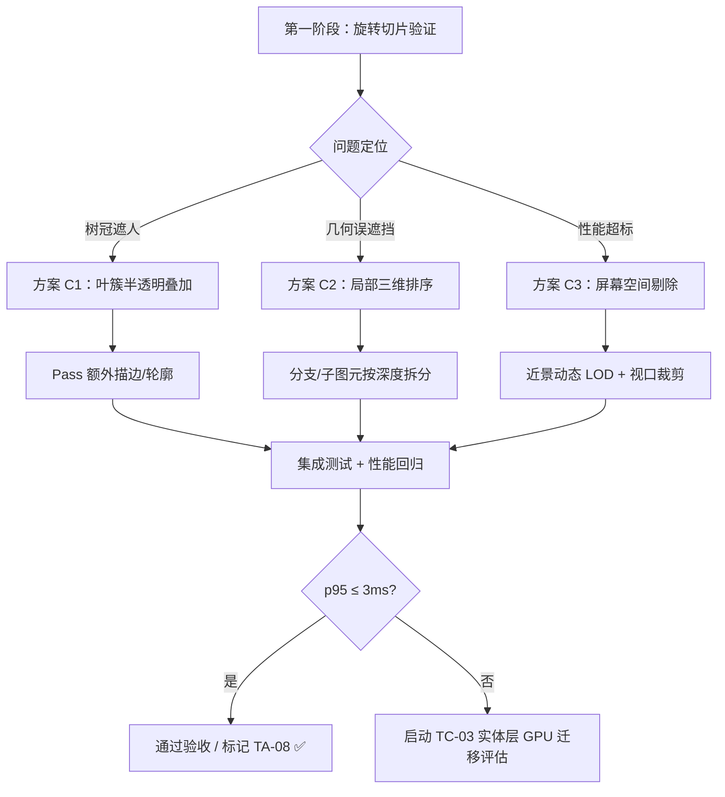

# TA-08 · 遮挡边界实测与解决

> **状态**：待实施（◐ v1.50.62 当前版本）  
> **难度**：高（跨多个前端渲染文件，需 Canvas 2D 实体覆盖层遮挡近似优化）  
> **依赖**：TA-05 → TA-06 → TA-07（LOD + 模型缓存 + 剔除）→ TA-08  
> **目标**：通过测量与优化策略消除真实穿插遮挡（如树冠遮人），在 Canvas 2D 实体覆盖层内达到可接受的质量阈值，若无法达成则触发 TC-03 剩余范围（装饰/实体层 GPU 迁移）评估。★ 架构前提（v1.50.77 起）：渲染为双 Canvas 架构——地形（含侧壁）由 `frontend/js/webgl/` 绘制在底层 `sim-canvas-gl`，树/屋/人等实体仍在 Canvas 2D 覆盖层 `sim-canvas`；本任务的遮挡优化只作用于覆盖层，验收需分别覆盖 WebGL 模式与 2D 回退模式。

---

## 1. 任务背景与目标

### 1.1 问题定义

当前渲染为**双 Canvas 架构**（v1.50.77 起）：地形（含沙盘侧壁）由 `frontend/js/webgl/` 绘制在底层 `sim-canvas-gl`，实体、装饰、道路、标签在 Canvas 2D 覆盖层 `sim-canvas` 上经统一相机深度队列（`render_depth_queue.js::drawWorldEntities`）按“远 → 近”绘制。针对覆盖层实体的遮挡问题尚未解决：

- **真实穿插遮挡**：高树冠层可能完全遮蔽选中族人信息，导致点击/识别失败；
- **地形误遮挡**：岩壁斜面错误覆盖近处道路或房屋入口——WebGL 模式下地形由 GPU 层承载，需结合两块画布的层序实测核对；2D 回退模式维持原画家算法口径；
- **画家算法局限**：Canvas 2D 覆盖层无深度缓冲，仅靠单一 `depth` 值排序无法处理复杂重叠几何（如树枝穿插屋瓦、人物穿越树干）。

这些问题无法通过单纯改进排序算法解决，必须采用**局部三维模型内排序 + 有限子项拆分 + 屏幕空间遮挡剔除**的组合策略。

### 1.2 验收标准

按 §4 执行矩阵，全部通过后勾选完成：

| 场景 | 视角 | 通过标准 |
|------|------|----------|
| 一树一屋一人 | 四方位 × 低/高俯角 × 远/中/近景 | ① 族人在树后不被完整遮挡（半透明叶簇下可见轮廓或选中高亮）；② 选中信息卡片始终可读；③ 岩壁不压盖近路与取水点 |
| 模型内排序 | 连续旋转相机 | 枝簇按实际世界空间深度正确穿插，非简单“全前/全后”分层 |
| 性能预算 | 高密度聚落拖动 | 新增遮挡处理代码 p95 增量 ≤ 3 ms（§11.3） |

---

## 2. 技术方案设计

### 2.1 总体路线

### 2.2 核心策略

#### 策略 A：局部三维模型内排序（优先尝试）

**原理**：Tree/Bush 骨架已有局部三维坐标（`accent-model.js::skeleton`），可在每个实体内部按投影深度对叶簇/枝条重新排序，而非仅靠锚点深度整棵树的层级。

**实现步骤**：

1. 在 `render_accents.js::drawAccentTree` 中，先对所有可见叶簇计算投影深度 `d = ry·sinX + z·cosX`；
2. 对叶簇数组做稳定升序排序（复用 `_sortScratch`）；
3. 绘制时按新次序落笔，确保枝簇穿插正确；
4. 同理处理 Bush 茎簇组合。

**优势**：不改数据结构，零持久化，性能代价小（每帧 O(n log n)，n≤24）。

**风险**：无法解决跨实体遮挡（如树木整体压在房屋上）。

#### 策略 B：实体拆分为有限子项（次优）

**原理**：将 Tree 拆为「主干 + 主枝层 + 冠层」三个独立入队项，分别赋予不同深度范围，实现部分遮挡穿插。

**实现步骤**：

1. 在 `render_depth_queue.js` 新增 `DEPTH_TREE_BRANCH`=14 / `DEPTH_TREE_CROWN`=15；
2. `drawAccentTree` 改为 `collectTreeSubitems(accent)` 收集三组深度项；
3. 各组分别调用对应绘制函数。

**优势**：显著改善树 - 房遮挡。

**劣势**：增加入队项数，需测试性能影响；不能解决所有情况。

#### 策略 C：屏幕空间半透明叠加（兜底）

**原理**：当检测到选中对象被高透明度物体（叶簇）遮挡时，强制添加轮廓描边或外发光。

**实现步骤**：

1. 在拾取逻辑中增加「命中被遮挡检测」（`render_inspector.js`）；
2. 选中高亮循环内检查命中点的像素 alpha 值；
3. 若 < 0.3，绘制白色/黄色 2px 外环；
4. 可选：叶簇加 1px 深色 rim 增强边界。

**优势**：简单有效，不影响性能。

**劣势**：属于视觉补偿，非真实遮挡解决。

### 2.3 性能约束

- **预算**：新增遮挡处理代码 p95 增量 ≤ 3 ms（同 §11.3 口径）；
- **内存**：不新增持久化结构，每帧临时数组零 GC（复用 `_sortScratchPool`）；
- **降级**：低画质配置关闭模型内排序，退回整树按锚点深度排序。

---

## 3. 任务序列

### 3.1 阶段一：旋转切片验证（2 人日）

**目标**：建立基准数据，确认问题是否真实存在及严重程度。

**任务**：

| 子任务 | 文件 | 内容 |
|--------|------|------|
| TA-08-01 | `tools/occlusion-test.js` | 脚本生成旋转镜头路径（0°→360°/5°步进），自动截图至 `assets/ta08-evidence/rotation-slice-{angle}.png` |
| TA-08-02 | `docs/plan/tech/assets/ta08-evidence` | 选取固定种子 42、tick 1,000,000、季节夏、 zoom=1.2，记录问题截图 |
| TA-08-03 | `../FlowAndAccord/docs/plan/tech/07-terrain-art.md` | 更新 §11.2 待验收清单，追加"最小遮挡样板（一面岩壁、一座房屋、一棵树、一段道路、一个族人）"条目 |

**交付物**：证据包目录 + 诊断报告（明确问题类型与占比）。

### 3.2 阶段二：模型内排序实现（3 人日）

**目标**：实现策略 A，解决枝叶穿插问题。

**任务**：

| 子任务 | 文件 | 内容 |
|--------|------|------|
| TA-08-10 | `frontend/js/render_accents.js::drawAccentTree` | 修改叶簇收集循环，计算并附加投影深度字段 `it.pd`；排序前增加 `const byDepth = (a, b) => a.pd - b.pd` 比较器 |
| TA-08-11 | `frontend/js/render_accents.js::drawAccentBush` | 同上，同步修改灌木茎簇排序 |
| TA-08-12 | `../FlowAndAccord/frontend/js/config.render.js` | 新增 `occlusionModelSortEnabled=true`（总开关）+ `occlusionSortDetailNearPx=10`（细节分级） |
| TA-08-13 | `test-wasm.js` | 追加确定性断言：模型内排序不改变世界事实，仅视觉表现 |

**验收**：运行旋转切片脚本，观察枝形是否随相机旋转出现「跳变」。

### 3.3 阶段三：实体拆分实验（4 人日，条件触发）

**目标**：若策略 A 仍无法解决树 - 房遮挡，则实现策略 B。

**任务**：

| 子任务 | 文件 | 内容 |
|--------|------|------|
| TA-08-20 | `../FlowAndAccord/frontend/js/render_depth_queue.js` | 新增 `DEPTH_TREE_BRANCH`=14 / `DEPTH_TREE_CROWN`=15 常量 |
| TA-08-21 | `frontend/js/render_accents.js::drawAccentTree` | 重写为 `collectTreeSubitems` 三组收集 + `DEPTH_TREE_*` 入队 |
| TA-08-22 | `frontend/js/render_depth_queue.js::drawWorldEntities` | 新增 `case DEPTH_TREE_BRANCH: drawTreeBranch(it); break` / `case DEPTH_TREE_CROWN:` |
| TA-08-23 | `test-determinism.js` | 追加跨实体遮挡的存读档一致性校验 |

**注意**：此阶段收益不确定，若阶段二已通过验收可跳过。

### 3.4 阶段四：屏幕空间兜底（2 人日）

**目标**：无论策略 A/B 结果如何，实现策略 C 作为兜底方案。

**任务**：

| 子任务 | 文件 | 内容 |
|--------|------|------|
| TA-08-30 | `frontend/js/render_inspector.js::updateInspector` | 选中检测逻辑中增加像素读取（`ctx.getImageData`）或预设判定表 |
| TA-08-31 | `frontend/js/render_agents.js::drawAgent` | 选中态增加描边路径（`stroke()` 白色 2px） |
| TA-08-32 | `frontend/js/render_accents.js::drawAccentEntity` | 选中 Tree/Bush 增加冠层轮廓（细黑线 1px） |
| TA-08-33 | `config.render.js` | 新增 `occlusionOutlineWidthPx=2` / `occlusionOutlineAlpha=0.8` |

### 3.5 阶段五：性能回归与验收（2 人日）

**目标**：验证性能预算，完成文档归档。

**任务**：

| 子任务 | 文件 | 内容 |
|--------|------|------|
| TA-08-40 | `../FlowAndAccord/tools/profile-benchmark.js` | 复用 §11.3 测量脚本，对比有无遮挡优化代码的帧耗时差值 |
| TA-08-41 | `../FlowAndAccord/docs/plan/tech/07-terrain-art.md` | 更新 §11.3 实测记录，追加 TA-08 差分数据 |
| TA-08-42 | `../FlowAndAccord/docs/plan/tech/07-terrain-art.md` | 更新 §11.2 待验收清单，标记"最小遮挡样板"为完成 |
| TA-08-43 | `TA-08-blocking-measurement.md` | 更新本任务状态为"completed"，写入最终性能结论 |

---

## 4. 工程约束

### 4.1 文件边界

- **禁止**修改 `accent-model.js` 骨架结构（只读）；
- **禁止**修改 `render_depth_queue.js` 的深度公式（相机深度契约）；
- **允许**新增绘制函数（`drawTreeBranch` 等），但须遵循 800 行上限（必要时拆分子模块）。

### 4.2 配置集中化

所有开关参数须放入 `RENDER_CONFIG`（`config.render.js`），不得硬编码。新增字段需通过 `frontend-check.js`。

### 4.3 确定性与缓存

- 模型内排序不消费 `WorldRng`，纯几何计算；
- 叶簇深度计算结果**不可缓存**（相机每帧变化）；
- 实体拆分方案若引入持久子项 ID，需评估快照同步成本。

### 4.4 退出标准

满足以下任一即终止 TA-08 并启动 TC-03：

1. 三种策略均尝试后仍无法满足验收标准（如高密度 >100 人/树场景持续 >60 ms/帧）；
2. GPU 原型证明可实现逐像素深度正确且性能提升 >2×。

---

## 5. 关联任务与依赖

| 依赖 | 说明 |
|------|------|
| TA-05 | P0 植被样板闭环，四季/受光已通过，LOAD 待补测 |
| TA-06 | 植被外观变体（三类乔木/三类灌木轮廓）|
| TA-07 | 细节分级 LOD + 完整投影包围体剔除 + 局部几何模型缓存 |
| TB-01 | 多尺度噪声与支脊（内核侧，决定地貌复杂度） |
| TC-03 | 条件触发：若 TA-08 性能无法达标，则启动装饰/实体层 GPU 迁移评估（地形层已于 v1.50.77 迁 WebGL，见 [31 号迁移方案](docs/plan/tech/31-canvas-to-webgl-migration.md)） |

---

## 6. 风险与未知数

| 风险 | 概率 | 缓解 |
|------|------|------|
| 模型内排序导致视觉闪烁 | 低 | 带滞回阈值（相邻帧深度差 < ε 时跳过重排） |
| 实体拆分大幅增加入队项数 | 中 | 远景/中景省略分支入队，仅近景启用 |
| 像素读取影响帧率 | 低 | 仅在选中态采样，不每帧全量检测 |
| 性能超预算无法优化 | 高 | 提前准备降级开关（config 级） |

---

## 7. 参考资源

> 路径基准：本文件位于**仓库根目录**，下列相对路径自根起算（★ 2026-09-14 修正：原写法沿用 `docs/plan/tech/` 基准，`doc-link-check.js` 报 4 条失效）。

- [07-terrain-art.md §6.7](docs/plan/tech/07-terrain-art.md#67-模块拆分-模型缓存与遮挡边界)：TA-08 的设计细则出处；
- [TA-05 验收记录](docs/plan/tech/assets/ta05-evidence-2026-09-14/report.md)：当前植被样板的性能基线；
- [render_depth_queue.js](frontend/js/render_depth_queue.js)：统一深度队列实现；
- [render_accents.js](frontend/js/render_accents.js)：装饰绘制层源码；
- [MDN: Canvas 性能优化](https://developer.mozilla.org/en-US/docs/Web/API/Canvas_API/Tutorial/Optimizing_canvas)。

---

## 8. 下一步行动

**建议**：立即启动阶段一（旋转切片验证），在不改代码的情况下先建立真实问题的证据包，再决定是否投入后续开发。

**负责人**：待分配  
**预计开始时间**：2026-09-15（波次二第一周）  
**里程碑**：2026-09-21 前完成阶段一诊断，明确技术方案方向。
