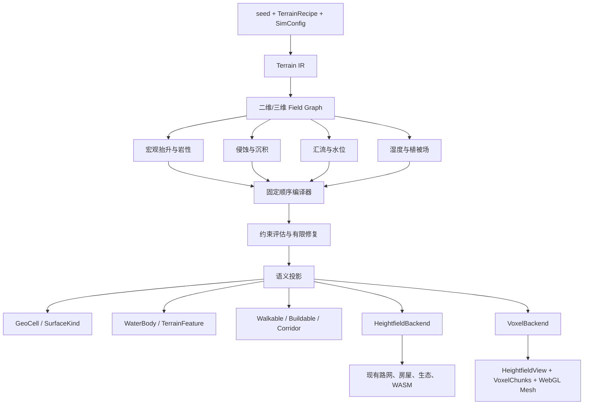

# Flow & Accord 统一地形场编译器与体素后端设计

> **文档状态**：规划稿，不修改运行时行为。
>
> **实施目标**：把 `docs/plan/tech/06-terrain-templates.md` 中的“模板 × 地形要素 × 景观风格”落到一套可复用的地形场编译器上。新增地图只提供数据配方、目标约束和参数；生成器代码只实现可复用的地形算子与地理过程。
>
> **当前基线**：现有 `TerrainMap`、`GeoCell`、`hydrology`、`query`、路网和 FABS 继续作为兼容接口。迁移期间先保持高度场输出，再接入稀疏体素后端。旧 profile 不在迁移完成前删除。

## 0. 给实现模型的最短指令

按以下顺序执行，不跳步：

1. 新建 `crates/sim_core/src/geo/procedural/`，先实现字段类型、配方类型和固定顺序编译器。
2. 让编译器输出当前 `TerrainMap` 所需的二维高度、坡度、地表和水系数据；此阶段不改路网、快照和前端。
3. 用同一套算子把 `grassland_plain_v1` 和 `mountain_pass_v1` 写成两个 recipe。生成器中不得新增 `if profile == ...` 的几何分支。
4. 加入通用约束评估器：可建面积、可行走连通分量、必经走廊、取水点数量和路径绕行比。
5. 将河流、河阶、冲积扇和湖泊改成“汇流、侵蚀、沉积、水位和识别过程”的结果，保留现有语义输出。
6. 再实现 `backend::voxel`：稀疏 chunk、密度场、材质场、网格提取和 `HeightfieldView` 兼容层。
7. 体素静态数据由 `seed + recipe + generator_version` 重建；存档只保存版本、配方和动态 chunk delta，不把完整体素数组写入每个快照。
8. 每个阶段都运行固定 seed 矩阵、WASM/native 对拍、无 NaN/越界检查和性能探针。失败时回退到旧生成器或显式降级 recipe，不在运行中修改 Agent、道路或居民位置。
9. UGC-06~10 依次补齐地层材料、断层褶皱、静态地下水、剖面诊断/有限不确定性和多层寻路；UGC-11 外部数据、UGC-12 专业物理后端保持独立。

实现模型不应自行改变下列事项：`WorldRng` 消费顺序、tick 顺序、`TerrainMap` 的现有查询语义、FABS 字段顺序、`STR_TAB.start_index == 0` 缓存失效判据、版本门禁和 `random` 准入规则。

## 1. 目标、边界与不可变契约

### 1.1 目标

- 用一套通用字段图和过程图生成丘陵、山口、河谷、盆地、台地、湖泊、冲积扇等地图。
- 让水系和局部地貌尽量由高程、降水、岩性、侵蚀和沉积关系产生。
- 保留模板的玩法目标：可建空间、自然瓶颈、浅滩、取水点、绕行成本和聚落候选地。
- 为悬崖、洞穴、悬挑、多层地形预留三维密度场，而不是继续扩展二维特判。
- 让诊断输出“哪一个字段或约束失败”，减少每张地图单独调参和 debug。

### 1.2 不在第一阶段做的事

- 不实现实时流体、洪水、动态地形改造、船舶或桥梁施工。
- 不立即删除 `terrain.rs` 中的旧生成器。
- 不要求一次性把路网、房屋、生态和前端全部改成三维体素查询。
- 不把景观材质、装饰或前端视觉推断当成地理事实。
- 不用机器学习模型替代确定性的地理过程；输入、迭代次数和结果必须可复现。
- 不把多相流、反应输运、热传导、地质力学、地震反演或大规模并行求解器混入创世主线；这些属于 UGC-12 独立后端。
- 不把专业建模器的“输入真实观测并反演地下结构”误写成程序化 recipe 已具备的能力；外部数据适配属于 UGC-11。

本方案把“接近专业系统”拆成可交付层级：

| 能力层 | 本项目路线 | 处理方式 |
|---|---|---|
| 程序化三维结构 | 地层柱、断层、褶皱、不整合、洞穴和悬挑 | UGC-06/07，进入统一 Field Graph |
| 地表—地下水—生态关系 | 水位、储水、渗透、湿度、草地/沙地 | UGC-08，先做静态创世状态 |
| 不确定性和可解释性 | 有限候选、confidence、字段切片、剖面 | UGC-09，不引入黑箱模型 |
| 多层游戏语义 | 地下碰撞、洞口、跨层寻路 | UGC-10，逐步接入 Agent |
| 真实地质数据 | DEM、接触点、钻孔、断层线 | UGC-11，只读适配器 |
| 专业物理求解 | 多相流、反应、热、力学、地震反演 | UGC-12 独立后端，默认不阻塞游戏路线 |

专业系统通常同时处理地层接触点、地层方向、层序、厚度和断层属性；本方案先用 recipe 生成同样的结构字段，再为真实观测保留输入适配口。专业地下物理系统还会求解流动、传输、化学和地质力学；这些过程不属于当前创世编译器的默认职责。

### 1.3 不可变契约

1. 同一 `generator_version + recipe_hash + seed + config` 必须得到相同结果。
2. 地形事实只由 Rust 生成；前端只消费快照或网格。
3. 物理地表、地貌特征、水体、水池和装饰保持分层。
4. 路网、房屋、农业、防务都通过统一地表查询，不直接读取 recipe 名称绕过规则。
5. 每个过程使用自己的确定性 RNG 域或无状态哈希，不插入共享模拟 RNG。
6. 任何改变高度、地表、水体、通行或选址的算法都必须递增 `TERRAIN_GENERATOR_VERSION` 并重新跑验收矩阵。
7. 结构候选必须先在隔离事务中计算，再统一派生坡度、地表和 flags；失败只能整块丢弃。

## 2. 总体架构



生成器代码只认识 `FieldOp`、`ProcessOp`、`Constraint` 和后端接口。`mountain_pass_v2`、`river_valley_v2` 等名称只是在 recipe 注册表中的数据 ID。

## 3. 文件布局与职责

第一阶段新增以下文件，单文件保持在根 `AGENTS.md` 要求的 800 行以内：

```text
crates/sim_core/src/geo/
  procedural/
    mod.rs              # 模块入口与公开重导出
    ir.rs               # recipe、节点 ID、参数和序列化
    fields.rs           # ScalarField2/3、MaskField、MaterialField
    operators.rs        # Ridge/Valley/Noise/Blend 等通用算子
    processes.rs        # Uplift/Erosion/Flow/Deposition 通用过程
    hydrology.rs        # 汇流、河道、岸带和浅滩候选
    strata.rs           # 地层柱、材料属性和地下储水参数
    structures.rs       # 断层、褶皱、不整合位移场
    groundwater.rs      # 静态地下水位、补给、排泄和水的可达性
    uncertainty.rs      # 有限候选、排序、confidence 和候选 hash
    semantics.rs        # SurfaceKind、WaterBody、TerrainFeature 投影
    constraints.rs      # 通用玩法约束与诊断结果
    diagnostics.rs      # 字段切片、剖面、候选对比和证据包
    compiler.rs         # 固定顺序、RNG 域、事务和编译入口
    recipes.rs          # 内置配方；只放数据，不放生成分支
  backend/
    mod.rs              # TerrainGeometry 后端接口
    heightfield.rs      # 当前 TerrainMap/GeoCell 兼容后端
    voxel.rs            # 稀疏体素 chunk 与密度采样
    meshing.rs          # Surface Nets/Dual Contouring 网格提取
    layers.rs           # 多层区间查询、洞口和跨层连接
  adapters/
    mod.rs              # 外部数据适配边界
    observations.rs     # DEM、接触点、钻孔和断层线输入
```

迁移后的职责：

| 现有文件 | 迁移后的职责 |
|---|---|
| `terrain.rs::generate_base_relief` | 调用 `procedural::compiler`；不再按 profile 编写形状公式 |
| `plateau.rs`、`basin.rs`、`alluvial_fan.rs`、`volcanic_lake.rs` | 拆成可复用算子，或转成 recipe 参数；不得继续作为模板专用入口 |
| `hydrology.rs` | 汇流、侵蚀、沉积、水位和语义投影的实现 |
| `geometry_transaction.rs` | 从整图 clone 逐步扩展为字段/voxel chunk copy-on-write 事务 |
| `validation.rs` | 保留结构 ID 校验，新增通用约束评估器 |
| `TerrainMap` | 过渡期的高度场视图和兼容序列化容器 |
| `GeoCell` | 由 Field/Backend 派生的二维查询缓存，不再是唯一底层表示 |

## 4. 数据模型

### 4.1 节点与 recipe

所有节点必须有稳定的 `NodeId`。节点排序不能依赖 HashMap 遍历顺序。

```rust
pub type NodeId = u16;
pub type RecipeId = String;

#[derive(Debug, Clone, Serialize, Deserialize)]
pub struct TerrainRecipe {
    pub id: RecipeId,
    pub schema_version: u16,
    pub nodes: Vec<TerrainNode>,
    pub stratigraphy: StratigraphicColumn,
    pub structures: Vec<StructuralEvent>,
    pub uncertainty: UncertaintySpec,
    pub constraints: Vec<TerrainConstraint>,
    pub output: OutputSpec,
}

#[derive(Debug, Clone, Serialize, Deserialize)]
pub struct TerrainNode {
    pub id: NodeId,
    pub op: FieldOp,
    pub inputs: Vec<NodeId>,
    pub strength: f32,
    pub mask: Option<NodeId>,
}
```

`nodes` 在载入时按 `id` 升序校验并建立拓扑顺序。重复 ID、未知输入、环依赖、非有限参数直接返回稳定错误码。

### 4.2 字段类型

第一阶段只需要二维字段；三维体素阶段复用同一接口：

```rust
pub trait ScalarField<P> {
    fn sample(&self, p: P) -> f32;
}

pub struct Field2 {
    pub width: usize,
    pub height: usize,
    pub values: Vec<f32>,
}

pub struct Field3Chunk {
    pub coord: ChunkCoord,
    pub size: u8,             // 初版固定 32
    pub halo: u8,             // 初版固定 1
    pub density_q16: Vec<i16>,
    pub material: Vec<u8>,
}
```

逻辑字段至少包括：

```text
elevation       高程或密度表面
hardness        岩性/抗侵蚀强度
rainfall        降水量
moisture        地表湿度
flow            汇流量
sediment        沉积物浓度
water_level     静态水位
water_table     地下水位
aquifer_mask    地下储水层候选
recharge        地下水补给量
discharge       地下水排泄量
water_access    可在合理距离和坡度内取得水的程度
soil_moisture   土壤湿润度
vegetation_ok   是否满足植被生长条件
stratum_id      地层单元 ID
surface_material 地表材料类别
surface_palette  地表调色类别
confidence      候选生成稳定度
roughness       表面粗糙度
build_mask      可建造候选权重
walk_mask       可行走候选权重
```

字段值在过程之间传递；`SurfaceKind`、`NO_BUILD`、`NO_WALK` 等闭集事实在最后的语义投影阶段一次性产生。

### 4.3 地表颜色、材质和植被必须由同一条因果链产生

地形引擎同时负责“地面是什么”和“地面应该呈现什么颜色”。前端只把调色类别叠加季节、光照和纹理细节，不自行猜测草地或沙地。

固定关系如下：

```text
降水 / 汇流 / 静态水体
        ↓
水的可达性与土壤湿润度
        ↓
植被资格、土壤类别、地表材料
        ↓
地表调色类别、草地/灌木候选和体素材质
```

首版规则可以配置阈值，但必须由引擎统一计算：

- `water_access < dry_threshold` 时，不得生成草地事实；地表进入沙、裸土或砾石候选。
- `water_access >= grass_water_threshold` 且坡度、土壤厚度和温度满足条件时，才允许 `vegetation_ok = true`。
- 视觉上的绿色、黄色或棕色只能来自 `surface_palette` 与季节/光照叠加，不能反过来改变水、通行或建造规则。
- 体素后端读取同一套 `surface_material` 和 `surface_palette`；洞穴内部可以得到岩壁、湿岩或地下水材质，不另写模板专用着色器。

这使“干旱地图是沙地、靠水区域才长草”成为通用字段关系，而不是每个模板的一段绘图代码。干旱地区仍可通过 recipe 参数调整阈值、沙地颜色和少量耐旱植物，但不能绕过水分条件直接把整片地面标成草地。

### 4.3 通用算子

首批只实现以下算子：

| 算子 | 输入 | 输出 | 用途 |
|---|---|---|---|
| `Plane` | 方向、坡度 | 高程 | 世界倾斜基线 |
| `NoiseFbm` | seed、频率、倍频 | 标量场 | 多尺度自然起伏 |
| `Ridge` | 轴线、宽度、幅度 | 高程增量 | 山脊和支脊 |
| `Valley` | 轴线、宽度、深度 | 高程减量 | 谷地和沟槽 |
| `Depression` | 中心、半径、深度 | 高程减量 | 盆地、湖盆、洼地 |
| `Cone` | 中心、半径、高度 | 高程增量 | 火山锥、孤立山体 |
| `Plateau` | 平台、边缘带 | 高程增量/掩码 | 台面和台缘 |
| `SmoothUnion` | 两个字段 | 混合场 | 平滑连接 |
| `SmoothSubtract` | 主场、扣除场 | 混合场 | 雕刻河道、湖盆 |
| `DomainWarp` | 输入场、低频场 | 坐标变换 | 弯曲和不对称 |

每个算子只接收显式参数和节点输入。算子不能读取 profile 字符串、POI、Agent 或路网。

### 4.4 过程算子

首批过程按以下顺序运行：

1. `Uplift`：生成低频抬升和构造坡度。
2. `Lithology`：生成硬度、沉积物和材料基础场。
3. `ThermalRelaxation`：把过陡邻域向相邻格缓慢搬运，固定迭代次数。
4. `HydraulicErosion`：按降水、坡度和硬度削低高程，累积沉积物。
5. `FlowAccumulation`：固定 D8 邻域和 tie-break 规则计算流向、汇流量。
6. `Deposition`：在坡度断点和流速下降处沉积，形成河阶、扇面和滩地。
7. `WaterLevelSolve`：根据封闭洼地、出水口和静态水位生成水体。
8. `BiomeClassification`：根据湿度、硬度、坡度、沉积物生成材料和植被权重。

第一版不追求物理精确，追求稳定、可调、可诊断。过程必须使用固定遍历顺序和固定迭代次数；不得依赖线程调度或不稳定的浮点归约。

### 4.5 地层、结构变形和地下属性

体素后端不能只存“实心/空气”。每个 recipe 还应声明可复用的地下结构数据。它们是生成输入，不是模板专用代码。

```rust
pub struct StratigraphicColumn {
    pub units: Vec<StratumSpec>, // 从年轻到古老，顺序固定
}

pub struct StratumSpec {
    pub id: u16,
    pub thickness_m: f32,
    pub material: u8,
    pub hardness: f32,
    pub soil_storage: f32,
    pub permeability: f32,
    pub palette: u8,
}

pub enum StructuralEvent {
    Fault { plane: PlaneSpec, displacement_m: f32 },
    Fold { axis: AxisSpec, amplitude_m: f32, wavelength_m: f32 },
    Unconformity { surface: NodeId },
}
```

实现顺序固定为：地层柱 → 抬升与断层/褶皱 → 侵蚀和沉积 → 水文 → 土壤与植被 → 体素材料。断层先用可重复的位移场实现，不引入通用偏微分方程求解器；褶皱先用轴线、振幅和波长控制。这样可以生成地层错动、峡谷、断陷盆地和洞穴岩壁，同时保留统一算子边界。

地下属性使用“类别加数值”的轻量表示：

- `material`：岩石、砂、黏土、表土、砾石等稳定类别；
- `hardness`：侵蚀和开挖阻力；
- `soil_storage`：可保存的水量；
- `permeability`：水向下渗透的相对速度；
- `porosity_class`：可选的孔隙类别，首版只影响储水和生态，不做真实多相流。

### 4.6 静态地下水和生态因果

首版地下水只求稳定的创世状态，不在每个 tick 解完整地下流体方程。编译器从降水、汇流、土壤储水、渗透性和出水口推导：

```text
recharge → water_table → aquifer_mask → water_access → soil_moisture
```

输出增加 `water_table`、`aquifer_mask`、`recharge` 和 `discharge` 诊断字段。地下水可以提供泉水、湿地、洞穴湿岩和草地资格；它不能凭空改变地表高度，也不能绕过水源数量和通行约束。

### 4.7 多候选生成和不确定性

同一个 recipe 可以声明一组有限参数候选。每个候选使用独立的确定性哈希，不重抽共享 RNG：

```rust
pub struct UncertaintySpec {
    pub candidate_count: u8,
    pub parameter_jitter: Vec<ParameterRange>,
    pub keep_top_n: u8,
}
```

编译器记录每个候选的 `candidate_hash`、约束得分和字段 hash，输出 `confidence` 场。运行时只选择通过约束且排名最高的候选；诊断工具可以显示候选之间最不稳定的区域。这样提供可解释的不确定性，不引入机器学习或黑箱采样。

### 4.8 约束与诊断

```rust
pub enum TerrainConstraint {
    WalkableComponents { min: u32, max: u32 },
    BuildableArea { min_cells: u32 },
    MandatoryCorridor { start: Anchor, end: Anchor, width_m: f32 },
    WaterSourceCount { min: u32, max: u32 },
    CrossingCount { min: u32, max: u32 },
    DetourRatio { min: f32, max: f32 },
    MaxSlope { max_deg: f32 },
    FeatureSeparation { kind: FeatureKind, min_m: f32 },
}

pub struct ConstraintReport {
    pub passed: bool,
    pub code: &'static str,
    pub measured: f32,
    pub expected: String,
    pub affected_nodes: Vec<NodeId>,
}
```

约束失败必须记录：约束代码、实测值、目标值、相关节点、seed、recipe hash 和阶段字段 hash。失败修复只能使用固定候选序列，例如降低噪声、增加出口宽度、换用下一个已声明的参数候选；不能在循环里随机重抽。

## 5. 固定创世流水线

编译器入口：

```rust
pub fn compile_terrain(
    seed: u64,
    recipe: &TerrainRecipe,
    config: &SimConfig,
    backend: BackendKind,
) -> Result<CompiledTerrain, TerrainCompileError>;
```

固定阶段：

| 阶段 | 名称 | 读写边界 | 输出 |
|---:|---|---|---|
| 0 | `resolve_recipe` | 只读 seed/config/recipe | 已校验 recipe、拓扑顺序 |
| 1 | `allocate_fields` | 新建字段，不读世界状态 | 初始 Field2 或 chunk 计划 |
| 2 | `macro_relief` | 只写高程、硬度、降水 | 宏观地形字段 |
| 3 | `strata_and_structure` | 读 recipe 地层柱和结构事件，写地层/位移场 | 地层、断层、褶皱和不整合候选 |
| 4 | `erosion_and_deposition` | 只写高程、沉积物 | 侵蚀后的地形字段 |
| 5 | `drainage_and_water` | 读高程/降水，写流量/水位 | 河道、湖盆、水体候选 |
| 6 | `groundwater_and_storage` | 读土壤储水、渗透性、补给和出水口 | 地下水位、储水层、排泄点 |
| 7 | `landmark_detection` | 只读字段 | 脊、谷、扇、湖、崖、浅滩候选 |
| 8 | `soil_and_surface` | 读水的可达性、湿润度、坡度、硬度和温度 | 土壤、草地资格、沙地/裸土/岩石材料与调色类别 |
| 9 | `semantic_projection` | 读取全部稳定字段 | `GeoCell`、通行/建造标记、植被候选和水体事实 |
| 10 | `voxel_material_projection` | 读取密度表面与语义字段 | 体素材料、洞穴内壁材质和可渲染调色输入 |
| 11 | `constraint_and_diagnostics` | 读取最终结果和候选集 | 约束报告、字段 hash、置信度和失败原因 |
| 12 | `backend_finalize_and_accents` | 写高度场/voxel chunks，独立 accent RNG | 可查询后端、网格计划和纯视觉装饰 |

伪代码：

```rust
let recipe = resolve_recipe(seed, config, recipe_registry)?;
let domains = RngDomains::from_seed(seed);
let mut fields = allocate_fields(&recipe, config)?;

macro_relief(&mut fields, &recipe, &domains.macro_relief)?;
strata_and_structure(&mut fields, &recipe, &domains.structure)?;
erosion_and_deposition(&mut fields, &recipe, &domains.processes)?;
let hydro = drainage_and_water(&fields, &recipe, &domains.hydrology)?;
let groundwater = groundwater_and_storage(&fields, &hydro, &recipe)?;
let landmarks = detect_landmarks(&fields, &hydro, &recipe)?;
let surface = soil_and_surface(&fields, &hydro, &groundwater, &landmarks, &recipe)?;
let semantics = project_semantics(&fields, &hydro, &groundwater, &landmarks, &surface, &recipe)?;
let material = project_voxel_material(&fields, &semantics, &recipe)?;
let candidates = evaluate_candidates(&fields, &semantics, &recipe.uncertainty)?;
let report = evaluate_constraints(&semantics, &surface, &candidates, &recipe.constraints)?;

if !report.passed {
    return Err(TerrainCompileError::Constraint(report));
}

let backend = finalize_backend(fields, semantics, material, backend)?;
let accents = generate_accents(seed, &backend, config.terrain_accent_density);
Ok(CompiledTerrain { backend, semantics, accents })
```

`WorldRng` 不进入编译器。新编译器使用以下固定域：

```text
macro_relief = mix64(seed ^ 0x5445525241494E01)
structure    = mix64(seed ^ 0x5445525241494E02)
processes     = mix64(seed ^ 0x5445525241494E03)
hydrology    = mix64(seed ^ 0x5445525241494E04)
uncertainty  = mix64(seed ^ 0x5445525241494E05)
semantics    = mix64(seed ^ 0x5445525241494E06)
accents      = 现有 ACCENT_RNG_SALT
```

盐值一旦发布不得修改；改盐值必须递增生成器版本。

## 6. 从 recipe 得到现有地图

模板仍然可以被玩家识别，但实现方式改成数据配方：

| 当前 profile | 新 recipe 组合 | 主要约束 |
|---|---|---|
| `mountain_pass_v1` | `Plane + Ridge + SaddleMask + NoiseFbm + ThermalRelaxation` | 山口走廊、连通分量、绕行比、坡度区间 |
| `river_valley_v1` | `Uplift + Rainfall + HydraulicErosion + FlowAccumulation + Terrace` | 主河、两岸、浅滩、普通道路避水 |
| `grassland_plain_v1` | `Plane(low) + NoiseFbm(low) + Depression + Moisture` | 高可建面积、低绕行比、泉溪洼地 |
| `hillside_woodland_v1` | `Plane(asymmetric) + Ridge(offset) + NoiseFbm(damped)` | 迎风坡可建、背风坡成本、坡脚水源 |
| `plateau_v1` | `Uplift + HardLayer + PlateauMask + RampMask` | 台面面积、台缘阻路、入口走廊 |
| `basin_oasis_v1` | `Depression + SurroundingUplift + FlowOutlet` | 盆底面积、环山屏障、至少一个出口 |
| `alluvial_fan_v1` | `ChannelExit + SedimentDeposition + GullyDetection` | 扇面面积、干沟、山口到扇缘走廊 |
| `volcanic_lake_v1` | `Cone + Crater + WaterLevel + Outlet` | 湖面比例、环湖干岸、两个出口、两个岸点 |

旧名称在存档中可以继续作为兼容 alias，但编译器内部只处理 recipe ID 和节点图。

## 7. 体素后端

### 7.1 密度和材质

体素后端使用稀疏 32³ chunk，带一格 halo。静态生成阶段可以按 chunk 请求；未访问的 chunk 不分配。

```rust
pub struct VoxelChunk {
    pub coord: ChunkCoord,
    pub density_q16: Vec<i16>,
    pub material: Vec<u8>,
    pub water_q16: Vec<u16>,
    pub flags: Vec<u16>,
    pub revision: u32,
}
```

推荐密度约定：实体内部为正，空气为负，零面为表面。`density_q16` 只保存量化密度，避免不同平台的浮点序列化差异。

二维高度场可作为三维密度的初始形式：

```text
density(x, y, z) = quantize(surface_height(x, y) - z)
```

洞穴、悬挑和断崖由额外的 `SmoothSubtract`/`SmoothUnion` 密度节点加入。

### 7.2 高度场兼容视图

迁移期间保留：

```rust
pub struct HeightfieldView<'a> {
    pub volume: &'a dyn TerrainGeometry,
    pub grid_width: usize,
    pub grid_height: usize,
}
```

它负责：

- 沿竖直方向 raycast 得到顶部表面；
- 生成当前 `GeoCell` 的高程、坡度、材质和水体归属；
- 为 `sample_cell`、`validate_footprint` 和现有路网提供兼容结果；
- 把多层体素世界暂时投影为顶部可居住层。

在多层导航实现前，洞穴和地下层只作为网格/视觉事实，不自动成为 Agent 可行走区域。

### 7.3 网格提取和 WebGL

第一版可使用 Surface Nets，确认锐利岩壁需求后切换 Dual Contouring。网格生成在 Worker 中按可见 chunk 执行；Rust/WASM 只提供 chunk 数据或压缩网格，不在每个 tick 重新生成静态地形。

前端约束：

- 地形、岩壁、水体和实体继续进入统一 WebGL 深度管线；
- GPU 网格不能创建内核没有的可走区域；
- LOD 只改变网格细节，不改变语义字段；
- chunk 边界必须使用 halo 或邻块采样，避免裂缝和法线跳变；
- 静态 mesh 以 `recipe_hash + chunk_coord + generator_version` 缓存。

### 7.3.1 多层查询和地下通行

`HeightfieldView` 只保留顶部兼容投影；VoxelBackend 同时提供真正的分层查询：

```rust
pub struct SolidInterval {
    pub z_min: f32,
    pub z_max: f32,
    pub material: u8,
    pub walkable: bool,
}

pub trait LayeredTerrainQuery {
    fn solid_intervals(&self, x: f32, y: f32) -> Vec<SolidInterval>;
    fn surface_at(&self, x: f32, y: f32, layer: u16) -> Option<SurfaceHit>;
}
```

第一版只把顶部层接入现有路网和 Agent。地下层先支持碰撞、体素材质和剖面查看；多层寻路需要独立的 `NavigationLayerId`、竖井/洞口连接点和跨层成本，完成后才能让 Agent 真正进入洞穴。

### 7.3.2 外部数据适配边界

为了接近专业建模器，未来可以增加只读输入适配器：数字高程、地层接触点、地层方向、钻孔柱状记录和断层线。适配器只转换成 `TerrainRecipe` 的地层柱、结构事件和约束，不直接修改编译器内部字段。首版不做地震反演和自动解释；输入数据必须带单位、坐标系、来源和时间戳。

### 7.4 存档和快照

静态体素不作为每 tick 的完整快照字段。存档保存：

```text
terrain_recipe_id
terrain_recipe_hash
terrain_generator_version
voxel_backend_version
modified_chunk_deltas[]
```

若未来允许挖洞、填土或建筑改地形，只保存被修改 chunk 的压缩 delta；载入时先按 seed 生成基线，再应用 delta。新增真正的快照字段时，必须同步 `snapshot.rs`、`world_snapshot.rs`、`snapshot_bin/encode.rs`、`snapshot-bin.js` 和 `rustworld.js`。

## 8. 迁移波次

### UGC-00：基线和工具

**输入**：当前 `terrain.rs`、8 个 random profile、固定 seed 矩阵。

**产物**：

- 每个 seed 的高程 hash、地表 hash、水系 hash、可建面积、连通分量、绕行比；
- `terrain_probe` 的字段层诊断格式；
- `TERRAIN_GENERATOR_VERSION`、文档基线和存档门禁的统一记录。

**退出条件**：旧生成器在 native/WASM 内部逐字节稳定；基线文件不进入运行时。

### UGC-01：Field IR 和 HeightfieldBackend

**输入**：`grassland_plain_v1`、`mountain_pass_v1` 的现有行为。

**修改范围**：

```text
crates/sim_core/src/geo/procedural/*.rs
crates/sim_core/src/geo/mod.rs
crates/sim_core/src/geo/terrain.rs  # 只增加调用适配器
```

**退出条件**：两个 recipe 能生成 `TerrainMap`；生成器没有新增 profile 几何分支；约束报告完整。

### UGC-02：通用水文过程

实现 `FlowAccumulation`、`HydraulicErosion`、`Deposition`、`WaterLevelSolve`，将主河、河阶、冲积扇和湖盆的几何生产从 profile 分支迁出。

**退出条件**：固定矩阵中水体不越界、普通道路不穿深水、浅滩候选可解释、连通性和取水点门禁通过。

### UGC-03：全部静态模板迁移

依次迁移半坡、河谷、台地、盆地、冲积扇和火山湖。每次只迁移一个 recipe；旧生成器作为比较基准，任何物理差异都通过新生成器版本记录，不覆盖基线。

### UGC-04：VoxelBackend

**产物**：稀疏 chunk、密度采样、Surface Nets/Dual Contouring、`HeightfieldView`。

**退出条件**：顶部表面的 `GeoCell` 与 HeightfieldBackend 在允许量化误差内一致；chunk 边界无裂缝；静态网格不进入 tick 热路径。

### UGC-05：快照、存档和前端接入

只在 UGC-04 稳定后接入 FABS 和 WebGL。先传 chunk/mesh 请求结果，再考虑体素 delta。不要把完整体素数组塞进现有 cell section。

### UGC-06：地层柱和材料属性

为 recipe 增加 `StratigraphicColumn`、`StratumSpec` 和材料属性表。先让高度场输出地层 ID、硬度、储水量、渗透性和调色类别，再让 VoxelBackend 把这些字段写入体素材料。

**退出条件**：固定剖面上的地层顺序、厚度、材料和颜色稳定；洞穴剖面不丢失层间关系；改变颜色映射不会改变物理字段。

### UGC-07：断层、褶皱和不整合

实现 `StructuralEvent` 的确定性位移场。第一版只支持有限断层和褶皱参数，不做反演，不读取 profile 分支。结构变形必须在侵蚀前完成，并在诊断图中显示位移前后地层。

**退出条件**：断层两侧地层错动方向正确，褶皱峰谷连续，结构事件不产生 NaN、孤立浮空体或不可解释的水系断裂。

**当前实现注记（2026-09-25）**：UGC-07 已落地 Fault/Fold/Unconformity 的 scratch 事务字段与 Heightfield/Voxel 传递。地图图鉴提供 `fault_scarp_demo_v1`、`folded_basin_demo_v1` 两个只读 recipe，用同一 WASM/WebGL 链路直接显示断层陡坎和褶皱脊谷；它们不进入 `random` 候选池，也不作为正式游戏存档 profile。

### UGC-08：静态地下水与植被因果

实现补给、储水、渗透、地下水位和排泄点的创世计算，把 `water_access`、`soil_moisture`、`vegetation_ok`、`surface_material` 和 `surface_palette` 接入统一字段图。

**退出条件**：干旱阈值以下没有草地事实；泉水、湿地和地下水位可由字段诊断解释；颜色、装饰和资源落位不再根据模板名称猜测。

### UGC-09：剖面诊断与有限不确定性

增加开发者剖面查看器、字段切片、候选对比、`confidence` 场和候选 hash。每个候选都记录约束得分、失败原因和字段 hash，只选择固定排序中的最佳通过候选。

**退出条件**：同一输入的候选顺序稳定；任意失败区域能定位到字段或节点；诊断工具不进入运行时快照。

### UGC-10：多层查询和地下寻路

在 `LayeredTerrainQuery` 上增加洞口、竖井、坡道和跨层连接点。先让碰撞和查询支持多层，再把地下层接入局部寻路；顶部 `HeightfieldView` 继续作为兼容接口。

**退出条件**：Agent 只有通过合法连接点才能进入地下层；洞穴、地表和悬挑的碰撞与网格一致；旧路网结果不因未启用地下层而改变。

### UGC-11：外部数据适配器

增加数字高程、地层接触点、地层方向、钻孔柱状记录和断层线的只读导入。输入先转换成 recipe、地层柱、结构事件和约束；不在这一阶段实现地震反演、自动地质解释或专业 GIS 编辑器。

**退出条件**：单位、坐标系、来源、时间戳和输入 hash 可追踪；没有输入时，程序化 recipe 的结果完全不变。

### UGC-12：专业物理扩展（长期候选）

多相流、反应输运、热传导、地质力学、地震反演和大规模并行求解器不进入游戏创世主线。只有当玩法明确需要地下水流动、矿物反应、滑坡或地热时，才以独立后端和独立存档契约立项；它们不能阻塞 UGC-06~10。

## 9. 小任务执行卡

每个实现任务必须用以下格式写在 TODO 或提交说明中：

```text
任务 ID：UGC-xx.yy
目标：一句话说明唯一行为变化
输入：文件、recipe、配置字段、seed 矩阵
修改：允许修改的文件和公开接口
禁止：不允许顺手修改的模块
产物：源码、诊断 JSON、截图或性能数据
失败：稳定错误码、回退 recipe 或禁用开关
验收：明确数值区间和命令
```

推荐的最小任务拆分：

1. `UGC-01.1`：`NodeId`、`TerrainRecipe`、拓扑排序和非法输入错误码。
2. `UGC-01.2`：`Field2`、`Plane`、`NoiseFbm`、固定 hash 和字段 hash。
3. `UGC-01.3`：`Ridge`、`Valley`、`SmoothUnion`、`SmoothSubtract`。
4. `UGC-01.4`：HeightfieldBackend 和 `GeoCell` 语义投影。
5. `UGC-01.5`：草原 recipe；固定 seed 通过后再做山口 recipe。
6. `UGC-02.1`：D8 流向和汇流量；先输出诊断，不写水体。
7. `UGC-02.2`：河道/岸带/河阶语义投影。
8. `UGC-02.3`：侵蚀和沉积；固定迭代次数和无 NaN 门禁。
9. `UGC-04.1`：`VoxelChunk` 和密度量化。
10. `UGC-04.2`：顶部 raycast、HeightfieldView 和 chunk halo。
11. `UGC-04.3`：网格提取与 WebGL chunk 缓存。

小模型执行这些任务时，完成一个任务即停，先运行任务的局部门禁，再进入下一个任务；不要一次性重写 `terrain.rs`、`hydrology.rs` 和前端。

### 9.1 逐任务技术实施方案

下面的方案把每个波次拆成可直接开工的实现单元。所有新增公开类型先放在 `procedural` 或 `backend` 内部；只有标记为“兼容出口”的类型才在 `geo/mod.rs` 重导出。示例接口使用 Rust 伪代码，实际实现应保持 `serde`、WASM 和现有错误码风格。

#### UGC-00：基线、探针和版本冻结

- **接口**：`TerrainBaseline { seed, profile, generator_version, elevation_hash, surface_hash, water_hash, metrics }`；`fn capture_baseline(map: &TerrainMap) -> TerrainBaseline`；`fn compare_baseline(a: &TerrainBaseline, b: &TerrainBaseline) -> BaselineDiff`。
- **算法**：使用现有生成入口逐个遍历固定 profile×seed 矩阵；hash 输入按 `y` 外层、`x` 内层的行优先顺序写入量化后的 `i32 elevation_mm`、闭集 `SurfaceKind`、水体 ID。指标复用现有查询：BFS 计算 walkable components，扫描 `NO_BUILD` 计算 buildable cells，Dijkstra 计算 detour p95。
- **实现顺序**：先增加 `terrain_probe --baseline <path>`，再冻结 `TERRAIN_GENERATOR_VERSION` 和探针输出 schema；基线只放 `target/terrain-baseline/`，不进运行时和存档。
- **失败/验收**：hash 不一致返回 `BASELINE_MISMATCH`；运行 `cargo run --release -p sim_core --example terrain_probe -- --baseline 60`，并对 native/WASM 输出做逐字节比较。

#### UGC-01：Field IR、算子和 HeightfieldBackend

- **UGC-01.1 IR**：实现 `validate_recipe(recipe) -> Result<ResolvedRecipe, RecipeError>`。用 `BTreeMap<NodeId, usize>` 建索引，Kahn 拓扑排序；DFS 只用于生成 `Cycle { path }` 诊断。错误码固定为 `DuplicateNode`、`UnknownInput`、`Cycle`、`NonFiniteParameter`、`UnsupportedOp`。
- **UGC-01.2 字段**：`Field2::new(width,height,fill)`、`Field2::hash_quantized(scale)`；所有写入通过 `FieldWriter::set(x,y,v)` 做有限值和边界检查。`Plane` 直接计算 `dot(p, direction)*slope+base`；`NoiseFbm` 使用现有无状态 `mix64` 梯度哈希、五次插值和固定倍频循环。
- **UGC-01.3 形状算子**：`Ridge`/`Valley` 先把点投影到轴线，使用 `exp(-(d/width)^2)`；`SmoothUnion`/`SmoothSubtract` 使用 polynomial smooth-min，`k<=0` 直接返回 `InvalidSmoothing`。每个算子只读 `FieldView`，不访问 profile、世界或 `WorldRng`。
- **UGC-01.4 兼容后端**：`HeightfieldBackend::from_fields(fields, semantics)` 将高程按现有网格写入 `TerrainMap`；`project_geocell(x,y)` 复用 `hydrology::slope_from_elevation` 和现有 `SurfaceKind` 规则，保证旧查询最近邻语义不变。
- **UGC-01.5 recipe**：先实现草原，再实现山口。recipe 注册表返回静态数据，禁止 `match profile` 几何分支。验收为两个 recipe 的约束报告通过、`TerrainMap` 基线差异可解释、无 `NaN`。

#### UGC-02：水文过程

- **汇流**：`compute_flow_direction(elevation) -> FlowField` 对每格检查 8 邻域；按 `(drop, neighbor_index)` 最大值选下游，平地按固定 `y,x` 顺序 tie-break。按 `elevation` 降序稳定排序后累加 `flow[cell] += rainfall[cell]`。
- **侵蚀/沉积**：`hydraulic_erosion(state, iterations, dt)` 固定扫描顺序；每格搬运量为 `min(capacity(flow,slope,hardness), sediment)`，从上游扣除并向下游加；`thermal_relaxation` 对超过角度阈值的相邻差值按固定比例搬运。每轮后 clamp 高程和沉积物到 recipe 范围。
- **水位**：用优先队列从边界执行 priority-flood，得到封闭洼地 spill elevation；`WaterLevelSolve` 将低于 spill 的连通格归入同一 `WaterBodyId`，以最小格索引作为稳定 ID。
- **语义**：河道由 `flow >= channel_threshold` 连通分量生成，岸带按法向距离扩张，浅滩候选从两侧陆格向法向扫描并验证。所有水体写入先进入 `GeometryTransaction`，验证通过后一次性提交。
- **验收**：`cargo run --release -p sim_core --example terrain_probe -- --hydrology 60`；门禁包括水体不越界、深水不可走/不可建、浅滩端点在陆侧、无负面积和无孤立 walkable component。

#### UGC-03：静态模板迁移

- **迁移协议**：每个 profile 建立 `recipes/<id>.ron`（或等价 Rust 常量）和 `RecipeGate`；旧生成器只作为 `LegacyReference`，由 `compare_recipe_to_legacy` 输出差异，不被新编译器调用。
- **顺序**：河谷→台地→盆地→冲积扇→火山湖→半坡；一次只启用一个 recipe。每个 recipe 只能组合既有 `FieldOp`、`ProcessOp` 和约束，不能新增 profile 专用函数。
- **门禁**：复用 `run_creation_gates` 的 Geometry/RoadNetwork/Survival 前缀；失败时按 recipe 的 `fallback_candidates` 固定排序降级，并将 `requested/effective` 写入 `WorldCreationDiagnostic`。

#### UGC-04：VoxelBackend 和网格提取

- **数据接口**：`trait TerrainGeometry { fn sample_density(&self,p:Vec3)->i16; fn sample_material(&self,p:Vec3)->u8; fn load_chunk(&mut self,c:ChunkCoord)->Result<&VoxelChunk,VoxelError>; }`；chunk 尺寸固定 32³，halo 固定 1。
- **密度算法**：高度场初始密度为 `surface_height-z`；结构节点以 `SmoothUnion/Subtract` 组合。量化使用固定 `DENSITY_SCALE` 和 round-to-nearest，写入前 clamp 到 `i16`。
- **兼容视图**：`HeightfieldView::surface_at(x,y)` 从最高 z 向下采样并二分定位零面；随后调用同一 slope/material 投影。顶部表面与旧高度场允许的误差写成常量 `HEIGHTFIELD_QUANTUM_M`。
- **网格**：首版 Surface Nets：每格 8 角符号变化则按边交点平均求顶点，按固定轴顺序生成面；chunk 边界读取 halo。Worker 只在可见或请求 chunk 生成 mesh，缓存键为 `(recipe_hash, generator_version, coord, lod)`。
- **验收**：随机抽样比较 VoxelBackend/HeightfieldBackend 的高程和 flags；邻接 chunk 法线连续、无裂缝；性能探针确认 mesh 不在 tick 调用栈。

#### UGC-05：快照、存档和前端接入

- **存档接口**：`TerrainStaticKey { recipe_id, recipe_hash, seed, generator_version, voxel_backend_version }`；`ChunkDelta { coord, base_hash, runs: Vec<DeltaRun> }`。读取顺序为“重建基线→校验 base_hash→应用 delta”。
- **WASM 接口**：新增 `terrain_chunk_request(coord,lod)` 和 `terrain_chunk_read()`，返回压缩后的 density/material buffer；不把完整 chunk 放入 FABS cell section。
- **兼容**：只有需要持久化的语义字段才同步 `snapshot.rs`、`world_snapshot.rs`、`encode.rs`、`snapshot-bin.js`、`rustworld.js`；静态网格属于请求结果，不进 tick 快照。
- **验收**：旧存档在版本不匹配时稳定拒绝；新存档重建后 `base_hash` 一致；Chrome/Edge File System Access 流程和 `node tools/snapshot-check.js` 通过。

#### UGC-06：地层柱和材料属性

- **接口**：`StratigraphicColumn::validate()` 检查 ID 唯一、厚度正、单位范围；`sample_stratum(column, depth) -> StratumSample`；`MaterialTable::get(id) -> MaterialProps`。
- **算法**：从地表向下累计厚度定位地层；侵蚀后的地表覆盖层以沉积物厚度优先，未覆盖处沿地层柱采样。`hardness`、`soil_storage`、`permeability` 作为字段，不从颜色反推。
- **体素投影**：每个体素先按深度选 `stratum_id`，再写 material；洞穴壁读取零面附近最近实体体素的材料。颜色改变只替换 `palette` 映射。
- **验收**：固定剖面逐层比较 ID/厚度/材料；改变 palette 后 terrain hash（物理字段）不变；`terrain_probe --section x,y` 输出剖面 JSON。

#### UGC-07：断层、褶皱和不整合

- **接口**：`apply_structures(fields, events, seed) -> StructureField`；`Fault`、`Fold`、`Unconformity` 各自返回位移/截断场和 affected node IDs。
- **算法**：断层用有符号平面距离 `s` 和平滑阶跃位移 `displacement * smoothstep(-w,w,s)`；褶皱用到轴线距离的正弦位移 `amplitude*sin(2πd/wavelength)`；不整合把低于指定 surface 的年轻层截断。事件按 recipe 顺序应用，先结构后侵蚀。
- **局部事务**：结构候选写入 scratch chunk，检查实体连通、最高/最低界和水系连续性；失败返回 `StructureInvalid`，不重抽事件。
- **验收**：断层两侧位移符号、褶皱峰谷和剖面 hash 稳定；固定 seed 不出现 NaN、浮空实体或无出口水体。

#### UGC-08：静态地下水和植被因果

- **接口**：`solve_groundwater(fields, hydro, materials) -> GroundwaterFields`；输出 `recharge/water_table/aquifer_mask/discharge/water_access/soil_moisture`。
- **算法**：补给 `recharge = rainfall * infiltration(permeability, soil_storage)`；按下游/邻域固定 Gauss-Seidel 次序传播储水，迭代次数由 recipe 固定；遇低渗透层截断，遇地形出口生成 discharge。`water_access` 为地表到最近水体/泉点的坡度加权距离的指数衰减。
- **植被投影**：`vegetation_ok = water_access>=grass_threshold && slope<=max_grass_slope && soil_storage>=min_soil`；失败时按 moisture/hardness 选择沙、裸土或砾石。palette/material 由同一函数返回。
- **验收**：干旱阈值以下 `vegetation_ok=false`；泉点、湿地和草地均可由字段切片解释；模板名不出现在分类函数中。

#### UGC-09：剖面诊断和有限不确定性

- **接口**：`generate_candidates(base, spec) -> Vec<CandidateResult>`；`CandidateResult { hash, score, report, fields_hashes }`；`DiagnosticsBundle::write(path)`。
- **算法**：第 `i` 个候选参数由 `mix64(seed ^ candidate_salt ^ i)` 映射到声明的 range；候选按 `(passed desc, score desc, candidate_hash asc)` 稳定排序，超过 `keep_top_n` 丢弃。confidence 为局部候选字段方差的反函数，并量化到 `u8`。
- **诊断**：字段切片统一带 header（宽、高、stride、单位、seed、recipe hash、generator version、quantization）；剖面沿任意两点 Bresenham/定步长采样，输出地层、水位、材料和节点证据。
- **验收**：同输入候选顺序和 hash 恒定；失败报告能回溯到 constraint code、affected nodes 和阶段 hash；诊断文件不进入 snapshot。

#### UGC-10：多层查询和地下寻路

- **接口**：`NavigationLayerId`、`LayerConnector { from, to, kind, cost }`；`LayeredTerrainQuery::connectors(layer)`；`build_layer_graph()`。
- **算法**：从洞口/竖井/坡道候选生成连接点，检查两端实体间隙、坡度和最小净空；每层先做局部 walkability flood fill，再以 connector 边连接层图。A* 状态为 `(node, layer)`，跨层边增加固定 cost。
- **启用策略**：UGC-10 前只暴露顶部 `NavigationLayerId=0`；地下层必须同时满足合法 connector 和局部连通，不能因 mesh 存在自动可走。
- **验收**：Agent 无 connector 不可跨层；碰撞 raycast、网格和 walk flags 一致；旧 profile 未启用地下层时路网 hash 不变。

#### UGC-11：外部数据适配器

- **接口**：`ObservationSource` 只读返回带 `units, crs, source, timestamp, content_hash` 的记录；`to_recipe(source, policy) -> Result<RecipePatch, ImportError>`。
- **算法**：DEM 重采样到固定网格并记录插值方法；接触点/钻孔按坐标投影到地层柱约束；断层线拟合为有限 `PlaneSpec` 候选。适配器只产生 recipe patch、结构事件和约束，不直接写 Field2。
- **验收**：输入 metadata 和 hash 可追踪；单位/坐标系缺失返回 `MissingMetadata`；无外部输入时 recipe 序列化和生成结果逐字节不变。

#### UGC-12：专业物理独立后端

- **边界接口**：`trait PhysicsBackend { fn initialize(&mut self, snapshot:&StaticTerrain) -> Result<(),PhysicsError>; fn step(&mut self, dt:f32); fn export_delta(&self)->PhysicsDelta; }`，与 `TerrainCompiler`、tick、FABS 分离。
- **实现策略**：多相流、反应输运、热、力学和反演各自独立 crate/feature；默认 feature 不编译、不链接。后端只通过显式 delta 更新允许的地下字段，不能直接改 Agent、道路或地表事实。
- **立项门槛**：先有明确玩法需求、基准数据、稳定存档契约和性能预算；没有这些输入时保持禁用，不阻塞 UGC-06～10。

## 10. 验收与调试

### 10.1 必跑门禁

纯规划阶段不运行代码门禁。实现阶段按改动范围运行：

```bash
node tools/test-wasm.js
node tools/test-determinism.js
node tools/config-check.js
node tools/frontend-check.js
node tools/snapshot-check.js
node tools/doc-link-check.js
node tools/cross-doc-check.js
```

地形专项还必须运行固定 seed 探针，例如：

```bash
cargo run --release -p sim_core --example terrain_probe -- 60
```

### 10.2 每阶段应输出的诊断层

```text
01_macro_relief.bin/png
02_hardness_rainfall.bin/png
03_erosion_sediment.bin/png
04_flow_accumulation.bin/png
05_water_level.bin/png
06_water_table_aquifer.bin/png
07_soil_moisture_vegetation.bin/png
08_strata_material.bin/png
09_surface_kind_palette.bin/png
10_walk_build_masks.bin/png
11_uncertainty_confidence.bin/png
12_constraint_report.json
13_chunk_hashes.json
```

诊断文件只用于本地和证据包，不进入存档。所有数组必须记录宽、高、步长、seed、recipe hash、generator version 和字段量化方式。

### 10.3 关键验收项

- 同版本同 seed 的 native/WASM 结果逐字节一致，或明确记录量化后的允许误差。
- 所有输出为有限值；没有越界 cell、负面积水体、重复 feature ID 或不连续 chunk。
- 可行走连通分量、可建面积、取水点、浅滩和路线绕行比符合 recipe 约束。
- `water_access` 低于干旱阈值的区域不得出现 `vegetation_ok=true` 或草地调色；满足水分、坡度和土壤条件的区域才可出现草地。
- 相同 seed、recipe、配置和生成器版本必须得到相同的水分、材料、调色和体素结果；改变颜色映射不能改变通行、建造或水体事实。
- 地形视觉网格与内核语义一致；LOD 和 mesh 不改变 `SurfaceKind`、flags 或查询结果。
- 编译成本、内存和首屏 mesh 生成时间有基线；生成器不进入 tick 热路径。

## 11. 失败处理和回退

失败分三类：

| 类型 | 例子 | 处理 |
|---|---|---|
| 输入错误 | recipe 环、未知算子、非有限参数 | 返回稳定错误码，不生成世界 |
| 候选失败 | 连通分量过多、可建地不足、河道越界 | 按固定候选顺序调整参数；超过预算使用降级 recipe |
| 后端失败 | chunk 内存不足、网格提取失败、FABS 不支持版本 | 保留已生成的高度场或拒绝本次 voxel 后端，不修改世界状态 |

回退必须发生在创世事务内。不得在 tick 中扫描居民、强制搬家、修改决策状态或重写道路拓扑。

## 12. 完成定义

统一地形场编译器达到以下条件才允许成为默认生成器：

1. 至少两个旧模板由同一编译器和同一套算子生成。
2. 新增地图只需要 recipe、约束和参数，生成器不增加模板分支。
3. 水系、岸带、河阶、冲积扇和湖泊至少有一条来自通用过程链，而不是模板专用几何入口。
4. 现有房屋、路网、生态和存档接口可继续工作。
5. 固定 seed 矩阵、WASM/native 对拍、约束门禁、无 NaN/越界和性能基线全部通过。
6. VoxelBackend 可以重建静态世界，HeightfieldView 能在迁移期提供现有 `GeoCell` 查询。
7. 地层、材料、湿度、地下水位、地表颜色和植被资格来自同一字段链；干旱阈值以下没有草地事实。
8. 断层/褶皱、不确定性、剖面诊断和多层查询都有稳定输入、字段 hash、失败原因和局部门禁。
9. 文档、版本门禁、FABS 结构和前端 WebGL 接口已分别记录；未实现能力不得写入 `docs/current/` 的现状章节。
