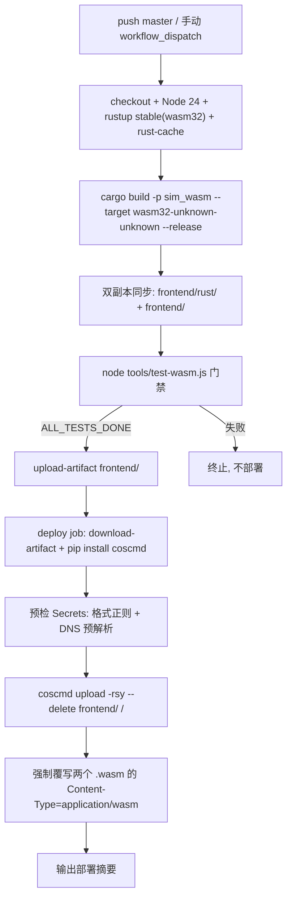

# CI/CD 自动部署指南（GitHub Actions → 腾讯云 COS）

> push 到 `master` 后自动完成：WASM 编译 → 回归测试 → 上传 `frontend/` 到腾讯云 COS。
> 工作流文件：[`.github/workflows/deploy.yml`](../.github/workflows/deploy.yml)
> 当前版本：v1.0.1

---

## 1. 流水线架构



| 环节 | 说明 |
| :--- | :--- |
| 触发 | `push` 到 `master`；支持 Actions 页手动 `Run workflow` |
| 构建 | 标准 rustup（**非**便携 `.toolchain/`），`Swatinem/rust-cache` 加速增量编译 |
| 门禁 | `node tools/test-wasm.js`，不通过则不上线 |
| 上传 | `coscmd upload -rsy --delete` 增量同步整目录 |
| 并发 | 同分支连续 push 自动取消旧的进行中部署（`cancel-in-progress: true`） |

> CI 运行在 `ubuntu-latest`，**严禁**在 workflow 中设置 `CARGO_HOME` 指向仓库 `.cargo-home` 或把 `.toolchain/` 加入 PATH——它们是 Windows 便携缓存，已被 gitignore 且与 ubuntu 不兼容。

---

## 2. GitHub Secrets（4 个，必填）

配置入口：仓库 → Settings → Secrets and variables → Actions → New repository secret

| Secret | 说明 | 示例 |
| :--- | :--- | :--- |
| `COS_SECRET_ID` | 腾讯云 API 密钥 SecretId | `AKIDxxxxxxxxxxxxxxxx` |
| `COS_SECRET_KEY` | 腾讯云 API 密钥 SecretKey | `xxxxxxxxxxxxxxxx` |
| `COS_BUCKET` | 桶名，格式 `名称-APPID`，全小写 | `flow-and-accord-1250000000` |
| `COS_REGION` | 桶所在地域简称 | `ap-guangzhou` / `ap-shanghai` |

### 子账号最小权限

不要用主账号密钥。在 [CAM 子账号](https://console.cloud.tencent.com/cam) 创建专用子用户，仅授予目标桶的 `cos:PutObject` / `cos:DeleteObject` / `cos:ListBucket`（或简化为该桶 `cos:*`）。

### 格式踩坑

- `COS_BUCKET` 必须**全小写** `名称-APPID`——含大写会导致 DNS 解析失败（`Failed to resolve *.myqcloud.com`）
- 勿填完整域名或 `https://` 前缀，勿用下划线 / 中文
- `COS_REGION` 填地域**简称**（`ap-guangzhou`），不是中文名
- 值首尾不要带空格或引号——流水线预检步骤会自动去空白并做格式 + DNS 预解析校验，错误时秒级报出中文指引

---

## 3. COS 侧一次性准备

1. **桶权限**：静态网站访问需设为「公有读私有写」（或在静态网站设置中开启公开访问）
2. **开启静态网站**：桶 → 基础配置 → 静态网站 → 开启
   - 索引文档：`index.html`
   - 错误文档：`index.html`（单页兜底）
3. 记下静态网站域名（形如 `https://<bucket>.cos-website.<region>.myqcloud.com`），即访问地址

---

## 4. .wasm MIME 配置

浏览器流式编译 WebAssembly 要求 `Content-Type: application/wasm`，否则失败。

工作流在上传后**强制覆写**两个 wasm 副本的 Content-Type：

```bash
coscmd upload -f -H "Content-Type: application/wasm" frontend/rust/sim_wasm.wasm /rust/sim_wasm.wasm
coscmd upload -f -H "Content-Type: application/wasm" frontend/sim_wasm.wasm /sim_wasm.wasm
```

若仍遇 `CompileError: Invalid WebAssembly`，在 COS 控制台对应对象 → 自定义 Header 检查。

---

## 5. 使用方式

| 操作 | 方法 |
| :--- | :--- |
| 自动部署 | 推送代码到 `master` |
| 手动部署 | Actions 页 → Deploy to COS → Run workflow |
| 查看进度 | Actions 页查看 Job 日志；成功后 Job Summary 显示提交、分支、桶信息 |
| 版本确认 | 打开静态网站域名，页面右上角版本徽章与 `frontend/index.html` 一致 |

> COS 与浏览器均有缓存，更新后如页面未变化按 `Ctrl+F5` 强刷；可在 COS 控制台为 `index.html` 设 `Cache-Control: no-cache`。

---

## 6. 故障排查

| 现象 | 原因与处理 |
| :--- | :--- |
| `test-wasm.js` 门禁失败 | 代码问题（确定性 / 越界 / NaN），修复后再推送；日志关键词 `DETERMINISM FAILED` / `NAN FOUND` |
| `coscmd` 403 / 签名错误 | 检查 4 个 Secrets 是否齐全、密钥有效、子账号有该桶写权限、`COS_BUCKET` 为 `名称-APPID` 完整格式 |
| **exit 253 + `please make sure [y/N]`** | `coscmd upload --delete` 删除远端多余文件前会交互确认，runner 无 stdin 导致失败；workflow 已加 `-y`（Skip confirmation），勿移除 |
| **`Failed to resolve *.cos.*.myqcloud.com`（DNS 失败）** | 几乎必为 Secret 格式错误：① 桶名含大写 / 下划线；② 缺 `-APPID` 或误填完整域名；③ 地域填了中文；④ 值首尾带空格。流水线预检会秒级报出中文指引 |
| **`coscmd: error: unrecognized arguments: -f`** | `-f`（强制覆盖）是 `upload` **子命令**的选项，必须写在 `upload` 之后（`coscmd upload -f -H ...`）；`-r/-b` 等全局参数才放在子命令之前 |
| 页面 404 | 静态网站未开启，或索引文档未设为 `index.html` |
| 页面能开但模拟器不运行 | MIME 问题（§4），或 `rust/sim_wasm.wasm` 未上传 |
| 页面是旧版本 | 确认最新一次 Actions 运行成功；浏览器强刷 |
| 编译缓慢 | 首次无缓存正常，后续 `rust-cache` 命中 |
