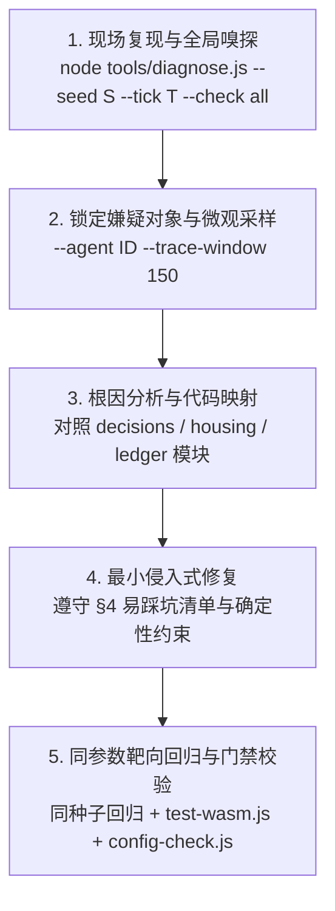

# Flow & Accord · 确定性无头诊断与 Bug 排查使用指南

> **定位**：面向开发者与 AI Agent（Antigravity/LLM）的本地高精度确定性诊断方案。通过在本地命令行输入特定种子（Seed）与目标截止世界时间（Tick），高速无头推进模拟内核，提取深层时空切片并自动嗅探系统异常，实现 Bug 的靶向复现、根因归因、代码修复与闭环验证。

---

## 1. 为什么需要无头确定性诊断？

Flow & Accord 是一个强确定性的多智能体生命演化系统（同种子 + 同配置输入 $\rightarrow$ 逐字节快照一致）。然而长程演化涉及马斯洛 16 个决策分支、私有施密特滞回带、家户账本流水、房屋营建升级等复杂非线性耦合，常规调试手段存在痛点：
- **浏览器调试耗时慢**：等待数千至数万 tick 演进需要长时间倍速挂机；
- **渲染快照信息损失**：前端视口主要服务于视觉呈现，内部施密特触发器、决策分支阻断原因等深层数据未充分透传；
- **静态推导失真**：多智能体并发涌现难以单靠静态阅读 Rust 代码还原。

**`tools/diagnose.js`** 利用 Node.js V8 对 `sim_wasm.wasm` 的 JIT 加速，运行 **20,000 tick（~667 秒模拟时间）仅耗时约 1 秒**，且 100% 保持与生产环境相同的确定性执行轨迹与动态配置合并。

---

## 2. 快速上手

### 2.1 基本命令

```bash
# 1. 基础诊断：在种子 42 下推进至 tick 3000，输出宏观大盘与异常告警
node tools/diagnose.js --seed 42 --tick 3000

# 2. 全局异常嗅探：自动识别生理险境死锁、寻路停滞、建房受阻、非自然死亡潮
node tools/diagnose.js --seed 42 --tick 3000 --check anomalies

# 3. 族人显微追踪：专项查看族人 1 号的微观档案及截止前 150 tick 的逐拍决策/生理时间序列
node tools/diagnose.js --seed 42 --tick 3000 --agent 1 --trace-window 150

# 4. 房屋专项诊断：查看房屋 2 号的耐久、等级、施工工时及关联家户账本储备
node tools/diagnose.js --seed 10086 --tick 4500 --house 2

# 5. 导出完整快照与诊断报告
node tools/diagnose.js --seed 42 --tick 3000 --export-json snapshot.json --export-report report.md
```

### 2.2 CLI 选项速查表

| 参数 | 缩写 | 默认值 | 详细说明 |
| :--- | :---: | :---: | :--- |
| `--seed` | `-s` | `42` | 确定性随机数种子 |
| `--tick` | `-t` | `3000` | 截止世界 Tick（内核积分基准：$dt = 1/30$ 秒，即 30 tick = 1 模拟秒） |
| `--sample` | | `500` | 宏观大盘与嗅探器的采样间隔步长 |
| `--agent` | `-a` | `null` | 重点观察的族人 ID（生成微观档案与窗口时序表） |
| `--house` | `-h` | `null` | 重点观察的房屋 ID（输出等级、工时、耐久及关联家户资产） |
| `--household` | | `null` | 重点观察的家户 ID（输出账本明细与触发器） |
| `--check` | `-c` | `all` | 异常嗅探范围：`all` / `anomalies` / `starvation` / `deaths` / `none` |
| `--trace-window`| `-w` | `150` | 重点 Agent 窗口高频时序采样的长度（tick 数） |
| `--export-json` | | `null` | 导出最终时刻完整世界快照到指定 JSON 文件 |
| `--export-report`| | `null` | 导出 Markdown 格式的诊断报告到指定文件 |

---

## 3. 内置异常嗅探规则（Anomaly Sniffer）

诊断工具在推进世界时，会自动对以下异常模式进行嗅探并输出警告：

1. **Rule 1: 生理险境死锁 (Physiological Hazard)**
   - **判定**：族人饥饿值或水分值降至极危区间（$< 5.0$ 单位，上限 50.0），但连续处于 `RestingAtCamp` 且未转换到求生状态。
   - **可能根因**：附近 POI 判定为关闭，或寻路节点池无可用点。
2. **Rule 3: 房屋建材就绪但晋升停滞 (Construction Blockage)**
   - **判定**：家户账本 5 类建材（水/粮/木/石/金）均达到对应等级升级成本矩阵，但房屋持续超过 900 tick 未发生晋升。
   - **可能根因**：户主威望门槛未满足、非户主无法触发升级、或决策分支被截胡。
3. **Rule 5: 空间移动阻断/停滞 (Movement Stagnation)**
   - **判定**：族人处于移动/寻路状态，但连续 60 tick 位移距离 $< 0.05$ 米。
   - **可能根因**：加权 A* 路网断连、荒野越野碰撞卡住、或重路由震荡。
4. **Rule 6: 短时非自然死亡潮 (Unnatural Death Surge)**
   - **判定**：采样间隔内新增非自然死亡（饥荒/渴死）人数 $\ge 3$。
   - **可能根因**：冬季严寒烧柴枯竭导致恶性降温；或基本生活物资采收断流。

---

## 4. AI Agent 自主排障 SOP（五步闭环流程）

当用户向 AI Agent 提报 Bug 或自身开发新特性遇到问题时，按以下 5 步标准操作流程执行：



### 步骤 1：现场复现与全局嗅探
执行带有用户提报种子与 tick 的命令：
```bash
node tools/diagnose.js --seed <SEED> --tick <TICK> --check all
```
查看报告顶部的生态大盘及**“异常嗅探器告警”**，确认 Bug 是否在目标时刻发生，锁定涉及的 AgentID 或 HouseID。

### 步骤 2：嫌疑对象微观下钻
针对嫌疑对象追加追踪参数：
```bash
node tools/diagnose.js --seed <SEED> --tick <TICK> --agent <ID> --trace-window 200
```
观察时序切片中的生理指标波动、行动状态转换、马斯洛需求标签（`Need`）以及家庭补货触发器状态（`family_stock_active`）。

### 步骤 3：代码映射与假设验证
根据异常类型定位到 Rust 内核对应子模块：
- **需求不执行 / 优先级倒挂** $\rightarrow$ `crates/sim_core/src/spatial/decisions/branches.rs` 与 `frontend/js/config.decision-order.js`
- **补货施密特触发器异常** $\rightarrow$ `crates/sim_core/src/spatial/decisions/evaluate.rs`
- **建房 / 升级门槛** $\rightarrow$ `crates/sim_core/src/spatial/decisions/needs.rs` 与 `config.house-upgrade-cost.js`
- **婚姻 / 繁衍 / 冷却** $\rightarrow$ `crates/sim_core/src/spatial/housing_system/marriage.rs` 与 `birth.rs`
- **采收与行囊装卸** $\rightarrow$ `crates/sim_core/src/spatial/ecology.rs`

### 步骤 4：代码修复与双副本同步
编辑 Rust 代码。必须严格遵守 `AGENTS.md` 第 4 节易踩坑清单：
- **严禁修改** `simulationDt`（只能调步数，不能改步长）；
- **保持确定性**：新增随机数必须使用 `self.rng`；
- **双副本同步**：编译后复制到 `frontend/rust/sim_wasm.wasm` 和 `frontend/sim_wasm.wasm`。

### 步骤 5：双环回归闭环
1. **靶向回归**：使用完全相同的种子与 tick 重新运行 `diagnose.js`，确认异常告警消失，目标智能体行为恢复正常。
2. **门禁回归**：
   ```bash
   node tools/test-wasm.js      # 确定性、长程稳定性、防 NaN
   node tools/config-check.js   # 校验前后端配置一致性
   ```
3. **版本管理**：更新版本号（`index.html` 与 `AGENTS.md`），在 `docs/current/11-changelog.md` 记录修改。

---

## 5. 常见实战排查排错速查

| 现象 | 排查切入点 | 诊断命令 |
| :--- | :--- | :--- |
| **小人渴死却不去喝水** | 检查 POI 水源库存充盈率是否 $< 10\%$（施密特关闭阈值）；检查 `thirst < 25` 时是否有更高优先级分支持续霸占。 | `node tools/diagnose.js --seed S --tick T --agent ID` |
| **房屋材料充足不晋升** | 检查户主是否存活；检查是否为 0 级建 1 级所需水粮各 50；检查 `b11BuildHouseUpgrade` 分支是否在决策顺序中被前置分支短路。 | `node tools/diagnose.js --seed S --tick T --house ID` |
| **金币从不被开采** | 查看家户五类补货触发器；若水/粮/木/石任何一项持续 ON，则 b10 备金不会被执行；检查 4 级庄园是否存在（b13 娱乐淘金门禁）。 | `node tools/diagnose.js --seed S --tick T` |
| **长期无人结婚生子** | 查看存活适龄男女数（$\ge 18$ 岁）；检查女性 `miscarriage_cooldown` 与 `postpartum_cooldown` 是否未归零；检查是否有成年男性拥有独立家宅（0级亦可）。 | `node tools/diagnose.js --seed S --tick T --check all` |
