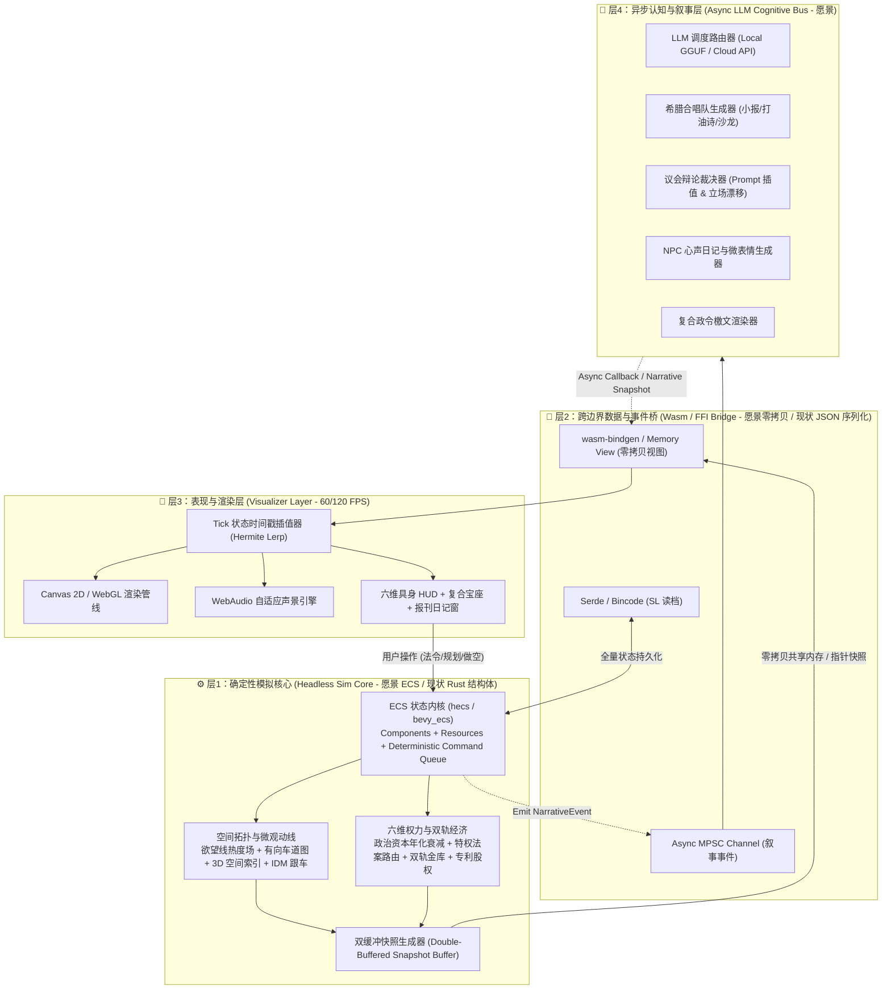

# 🏗️ Flow & Accord 宏观技术架构设计愿景书

> ⚠️ 本文档为**规划态/愿景**，描述未来架构演进方向，不代表当前已实现。当前已实现架构见根目录 [AGENTS.md](../AGENTS.md) §1（Rust 确定性内核 + WASM 桥接 + Canvas 前端三层解耦）。
>
> **版本**：v1.0.1

---

## 1. 愿景架构总览

系统遵循**"核心确定性物理/政治演化"与"外部表现/大模型生成"完全解耦**的单向数据流架构。愿景分为四大层次：



---

## 2. 各层职责

| 层 | 愿景职责 | 现状 |
| :--- | :--- | :--- |
| **层1 确定性核心** | ECS 组件化实体 + 系统调度；确定性 Command Queue；空间拓扑/微观动线/六维权力/双轨经济全部以组件+系统形式组织 | Rust 结构体数组（`Vec<Agent3D>` + `World3DEngine`），30Hz 固定步进，已通过 WASM 回归 |
| **层2 跨边界桥** | 零拷贝共享内存快照（双缓冲）+ 异步叙事事件通道 + Bincode 持久化 | 零依赖 C-ABI 导出，线性内存 JSON 序列化快照 |
| **层3 表现渲染** | 60/120 FPS 平滑渲染 + Hermite 时间戳插值 + 自适应声景 + 六维具身 HUD | Canvas 2D/3D 渲染 + Inspector + 视口交互，30~60 FPS |
| **层4 认知叙事** | 异步 LLM 生成：希腊合唱队/议会辩论/心声日记/政令檄文；模板引擎 0ms 兜底 | 未实现（纯确定性规则系统，无 LLM） |

---

## 3. 愿景核心子系统

### 3.1 ECS 内核（层1）

从当前 `Vec<Agent3D>` 大结构体迁移至 ECS：组件化实体（`Position3D`/`MotionState`/`GovernanceSpectrum`/`PersonalWallet` 等）+ 资源（`LaneGraph`/`DesireGrid`/`WorldRng`）+ 固定顺序系统调度 + 确定性 Command Queue（所有状态变更通过命令队列提交，保证回放与 SL 逐字节一致）。

### 3.2 零拷贝快照（层2）

双缓冲共享内存快照：核心写 buffer A 时前端读 buffer B，下一 tick 交换，消除锁与拷贝；`#[repr(C)]` 紧凑布局，前端通过 Memory View 直接读取零序列化；Hermite 时间戳插值实现 60/120 FPS 渲染而核心仍跑 30Hz。

### 3.3 异步 LLM 认知总线（层4）

双轨响应：模板引擎 0ms 即时兜底核心事件；LLM 异步润色背景叙事（小报/日记/辩论/檄文），完成后写入叙事快照缓存池；结构化 Prompt 多权重插值 + JSON Schema 严格校验；事件驱动（`NarrativeEvent`），不轮询。

---

## 4. Cargo Workspace 愿景布局

```text
FlowAndAccord/
├── crates/
│   ├── sim_core/          # 核心确定性模拟库 (纯 Rust, no_std 友好)
│   │   ├── src/
│   │   │   ├── ecs/       # 组件、资源、系统调度 (愿景)
│   │   │   ├── spatial/   # 拓扑图、欲望线、空间索引、微观交通 (已落地基础)
│   │   │   ├── politics/  # 六维政治资本、指数衰减、法案路由 (愿景)
│   │   │   ├── economy/   # 账本 M1~M4 已落地 (ledger/ + bookkeeping)；痛点追踪、专利股权 (M5+ 愿景)
│   │   │   ├── social/    # 情感羁绊、阶级微表情、私人日记 (愿景)
│   │   │   └── snapshot.rs # 只读对外紧凑内存快照 (已落地)
│   ├── sim_wasm/          # WebAssembly 胶水层与零拷贝内存视图 (已落地)
│   ├── sim_cli/           # 命令行调试、Benchmark 与蒙特卡洛仿真 (愿景)
│   └── sim_llm/           # 异步 LLM 适配器、Prompt 模板与 JSON 解析 (愿景)
└── frontend/               # 前端表现层 (Canvas 2D/3D + Inspector, 已落地)
```

---

## 5. 性能指标愿景

| 指标 | 现状 | 愿景目标 |
| :--- | :--- | :--- |
| 核心步进频率 | 30Hz (dt=1/30) | 30Hz（保持，倍速通过同帧多步） |
| 单 Tick 耗时 | ≤1ms（WASM 回归验证） | ≤1ms（ECS 后目标 ≤0.5ms） |
| 实体规模 | ~20~数百（部落民+房屋+POI） | 数千实体（ECS + 零拷贝后） |
| 前端帧率 | 30~60 FPS | 60/120 FPS（Hermite 插值） |
| WASM 边界开销 | JSON 序列化/反序列化 | 零拷贝共享内存（消除序列化） |
| LLM 延迟 | 不适用 | 模板兜底 ≤1ms，异步叙事后台生成 |
