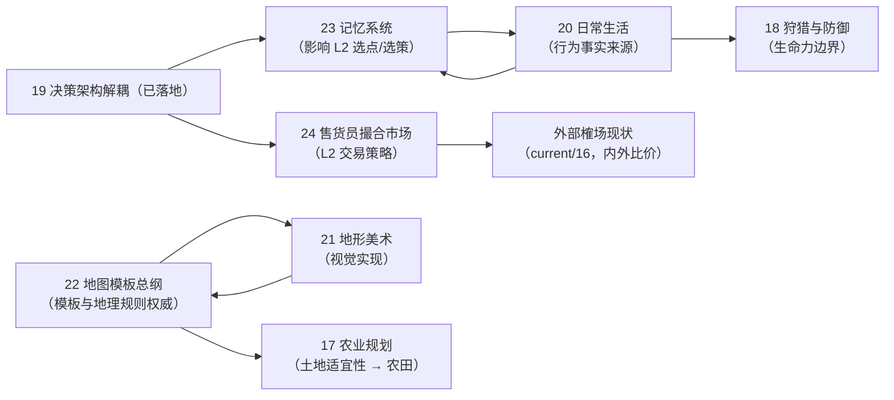

# 🌊 Flow & Accord（流动公约）项目长期规划书

> ⚠️ 本文档为**规划态/愿景**，描述未来方向，不代表当前已实现。当前已实现功能见 [docs/01-current.md](./01-current.md)。
>
> **版本**：v1.44.6 · **当前基线**：v1.44.5（确定性 Rust/WASM 内核 + 有限生态 + 四季气候 + 代谢繁衍 + 5 级私宅 + 家户/宗族/王国账本 + 决策编排 + 族谱 + 市场拍卖 + 时光倒流 + Canvas 前端）
>
> **专项规划**：docs 根目录编号 19 及以后的专项规划信息已并入本文档第 8 节（原 `docs/plan.md` 已合并删除）。

---

## 1. 项目愿景

构筑一个**玩家规划环境与制度、居民自主组成社会、历史可以回看和分支比较**的社区尺度模拟游戏。玩家不逐个操控族人，而是通过营地规划、公共政策、资源投入和有限的危机决策改变条件；族人依据自身需求、关系、资产和继承规则生活，几代之后把这些条件演化成道路、家族、宗族与王国。

游戏的第一吸引力不是“有多少系统”，而是玩家能在短时间内认领一个具体家族，并持续追问：谁会活下来、哪座房屋会传下去、哪一条路会成为大道、哪个陌生人会改变历史。

**核心设计哲学**：

- **确定性是因果实验**：同一种子、同一 Tick、同一组干预产生同一结果；玩家可以保存、回滚、分支和复演，而不是只看一次随机演出。
- **玩家规划，Agent 自治**：玩家只改变环境、公共规则和观察焦点，不直接扫描全图替居民派发任务；所有个人行动仍由决策引擎产生。
- **家族故事是主线**：资源、道路、账本和政治都应最终回答“哪个人、哪个家庭、哪个世代因此改变”。
- **信息逐步展开**：首局先呈现生存、房屋和关系；玩家产生兴趣后再打开账本、王国、决策编排和经济分析。
- **历史可比较**：回滚不是调试按钮，而是玩家比较“如果当时做了另一种选择”的核心玩法。

---

## 2. 已完成阶段（v0.x → 当前）

以下能力已经落地，未来里程碑应优先复用它们，而不是重复建设底层系统：

| 领域 | 已交付内容 |
| :--- | :--- |
| 确定性内核 | Rust `sim_core`、共享 `WorldRng`、固定 Tick、多步推进、长程确定性矩阵验证 |
| 空间与生态 | 3D 地形、23 处有限 POI、A* 路网、踩踏成道、道路衰减、资源再生与断流 |
| 生存与代际 | 饥渴/体力/健康、四季气温、供暖、受孕/流产/分娩、遗传禀赋、自然与非自然死亡 |
| 房屋与家庭 | 0~4 级私宅、自主选址、瞬时升级、折旧修缮、家户账本、继承与分家 |
| 社会制度 | 婚姻登记簿、宗族/族税/互助、营地王国/国王/继承/夺位远征、公仓税与救济 |
| 经济互动 | 榷场动态价格、断流采购、二手房屋拍卖、资源流水和市场历史 |
| 叙事基础 | 族谱时间轴、人物 Inspector、营地/家户/宗族/王国大盘、事件日志、历史国王档案 |
| 玩家工具 | 决策顺序热注入、资源产速调节、倍速/无头模式、Checkpoint + Replay 时光倒流、主题切换、本地存档 |
| 工程底座 | Worker 与 Canvas 解耦、WASM 双副本、配置校验、确定性/快照/前端门禁、CI/CD |
| 决策架构（M19） | 意图/策略/执行三层解耦（v1.46.8~v1.46.10）：`ActiveTask` 单一真相源、分级任务抢占矩阵、禀赋与家资个性化选策、多品类采收预排队列与 TSP 行程优化、决策行动中枢三栏看板（详见 §8.2） |

> 现状判断：内核的“社会模拟宽度”已经足够形成独特卖点；当前缺口是首次进入门槛、观察焦点、事件因果可读性和有限但有意义的玩家规划。

---

## 3. 未来里程碑（规划态）

> 以下顺序按**玩家价值与验证成本**排列，不承诺具体日期。每个里程碑都应先以可玩的垂直切片验证，再扩展机制规模。

人物与家庭生活的专项方向见 [人物日常生活细化规划](./20-plan-everyday-life.md)：以家庭分工、做饭、幼儿照料和生活观察组成首期“一家人的一天”，再评估邻里互惠、技能传承与康复等内容。该规划连接下述家族故事、记忆与分工方向，尚未实现或排期。

地形与画面表现的专项方向见 [地形美术与世界景观提升规划](./21-plan-terrain-art.md)及[地图模板总纲](./22-plan-terrain-features.md)：短期改善地表、道路和标注，中期山口聚落与静态两岸河谷已落地（T1/T2，v1.47.5），并已引入地表装饰系统（D-A，v1.49.1）；再逐步扩展湖畔盆地、台地、河口三角洲、海湾、峡湾、河谷、半岛、海岛、沙漠绿洲、山前冲积扇与喀斯特等未来地图模板。长期连接动态水文、生态与历史变化，并按性能证据评估渲染升级。后者以地图模板为主轴组织，负责模板清单与地理规则/技术契约，仅 T0/T1/T2/D-A 已实现。

### M10 · 第一局与家族故事入口

**目标**：让新玩家不处理文件、不读文档，也能在 5 分钟内看懂一个家族并看到一次有意义的变化。

- 首次进入先创建浏览器临时世界；本地 JSON 存档改为可选的长期保存，不阻挡试玩。
- 提供 3 个精选种子：寒冬求生、金矿争夺、长路迁徙；种子只改变初始条件，不写死剧情。
- 开局选择一个观察对象：家户、族人、宗族或营地；镜头、Inspector 和事件卡围绕该对象聚焦。
- 制作 5 分钟导览：第一条路、第一间房、第一次婚姻/出生、第一次资源危机各有明确提示。
- 增加“正在发生”卡片和最近事件回放；每条事件可跳转到人物、房屋、营地或族谱。
- 事件先使用确定性模板，明确给出“发生了什么 / 直接原因 / 影响了谁”；LLM 不作为核心依赖。

**验收信号**：新玩家能在首局说出一个家族的名字、当前目标和最近一次转折，并愿意继续运行或重新打开游戏。

### M11 · 营地规划与有限干预

**目标**：吸收城市：天际线的规划快感，同时守住居民自主行动。

- 玩家可以提出营地发展方向：水源优先、贸易、繁衍、道路枢纽或资源储备。
- 增加道路候选线、公共道路和营地扩张倾向；居民是否使用、何时使用仍由自身决策决定。
- 在冬季、断流、王位空缺等关键时刻提供低频公共决策：动用公仓、调整再生投入、开放市场储备或改变营地政策。
- 每项干预都有延迟、资源成本或声望后果，不能直接修改某个 Agent 的状态。
- 增加道路流量、人口迁徙、家户分布和资源流向的城市级视图，支持当前/历史对比。

### M12 · 家族记忆与历史时间线

**目标**：吸收 RimWorld 的角色依恋，把现有账本和族谱变成玩家能讲出来的故事。

行为层记忆的技术方案见 [人物记忆与经验传承系统](./23-plan-memory-system.md)：首批 10 种亲历记忆、有限行为修正、遗忘与后续代际传承。该方案尚未实现、未排期；活跃记忆影响决策，历史年表只记录事实，两者分开管理。

- 家族、房屋、道路和营地允许玩家命名；支持立碑、书签和追踪。
- 建立按 Tick/游戏年排列的家族年表：婚姻、出生、死亡、分家、继承、建房、升级、迁徙、夺位和拍卖均可回看。
- 为关键事件增加因果链：资源短缺 → 行动选择 → 路线/账本变化 → 家庭结果。
- 记录家族倾向的可读总结，例如“连续三代提前囤柴”“多名成员成为远征者”，不把总结伪装成额外随机人格。
- 支持导出家族年表、族谱片段和一局摘要，方便玩家分享故事。

### M13 · 时隙来客：NPC 穿越

**目标**：把确定性、族谱、继承和时光倒流转化为独有的世界事件。

第一批穿越者采用少量、可辨识、可复现的角色原型：

- **灭族少爷**：来自未来灭亡王国的最后继承人，带着家徽、残缺王谱和不完整的灭族记忆；当前时代没有家族、房屋或继承权，他必须自行立户、结盟或争夺王位。
- **旧世饥饿少女**：来自 200 年前，抵达时饥饿且没有资产，携带旧币、失传作物或已经消失的姓氏；她可能被收留、死亡、成婚，并成为当前某个显赫家族的祖先。

实现约束：

- 穿越者是正式 Agent，接受饥渴、体力、关系、家户、账本、房屋和王国规则；不能是脱离世界的剧情 NPC。
- 快照记录 `origin_tick`、`arrival_tick`、来源时间线、记忆片段和因果目标；新增字段遵循[根指南的完整快照同步链](../AGENTS.md#45--快照与前端字段四处同步-m4-起v1453)与[影响矩阵](./current/13-impact-matrix.md)，包含 FABS 编解码。
- 穿越者只知道碎片化事实，不拥有完整未来答案；预言必须来自已确定的模拟结果，不能随意剧透。
- 穿越产生明确的新时间线，原历史保留可比较；相同种子、Tick、时间线和玩家干预必须可复现。
- 第一阶段先做“偶遇、收留、观察和后果”，第二阶段再做真正的未来回溯任务和因果闭环。

### M14 · 交换、分工与资源政治

**目标**：在玩家已经关心家族和营地之后，让经济系统产生更清楚的比较优势与社会冲突。

内部市场的专项方案见 [内部市场方案：黄金本位、居民互通与生存交换](./24-plan-internal-market.md)：四个资源—黄金恒定乘积池（AMM）实现居民间双向交换，濒危家庭可用木石金换水粮、富余家庭可用余水余粮换木石金，首期全图只设一个独立居民市集，尚未实现或排期（详见 §8.7）。

- 将黄金逐步扩展为通用交换媒介，允许供需形成价格和专业化分工。
- 让高力量、高智力、不同家族传统与道路条件影响职业倾向，但不绕过 Agent 自主决策。
- 将固定税率、救济和 POI 公地规则变成可观察的制度变量，提供分配、贫富差距、资源诅咒和冬季存储视图。
- 先实现一个资源或一座营地的纵向切片，再决定是否扩大为完整专利经济。

### M15 · 政治资本与混合政体

**目标**：让王国制度成为玩家可以比较的社会实验，而不是先增加一层抽象数值。

- 民意、技术、资本、强制、宗法和意识形态六维政治资本按事件、税制、财富与继承积累。
- 特权法案必须改变道路、贸易、救济或继承的实际反馈，并带来维护成本。
- 支持国王下台、隐退、复仇和重新夺位的多条路径，避免单一胜负条件。
- 先展示制度对家族生活的影响，再考虑生成式称号和长篇政治文本。

### M16 · 生成式社交与编年史（可选）

**目标**：让生成式文本润色已经发生的事实，不替代模拟器制造事实。

- 模板即时生成事件摘要，LLM 异步生成小报、日记和人物口吻版本。
- 所有文本引用可追溯的 Agent、Tick、账本流水和关系变化；生成失败时不影响核心游戏。
- 先支持家族年表和重大事件，暂不把 LLM 作为每日决策器或隐藏随机源。

### M17 · 规模化内核（按需）

**目标**：只有当玩家内容和性能数据证明需要时，才进行 ECS、零拷贝快照和更大人口规模重构。

- 继续用现有性能基准决定是否迁移 ECS；架构升级不能先于玩家价值验证。
- 保持 WASM Worker、存档、回放和快照的确定性契约。
- 任何底层重构都必须以旧种子逐字节回归为发布门槛。

### M18 · 生态狩猎、流寇危机与武力公约演化

**目标**：引入生产型武力（打猎）与防御型武力（御寇），以外部生存危机推动公仓契约与社会秩序的建立。（详细设计稿见 [18-plan-conflict-hunting-defense.md](./18-plan-conflict-hunting-defense.md)）

- **生态狩猎（PvE 生产）**：引入野鹿/猛兽等轻量漫游 POI，青壮年男性自主追踪围猎；产出高能肉食与御寒兽皮（削减寒冬 50% 烧柴消耗），搏斗失败面临负伤与猛兽扑杀风险。
- **流寇掠夺（PvE 防御）**：边境游寇与极寒濒死堕落流民沿 A* 路网入侵，劫道、破门洗劫私宅账本乃至攻打营地公仓。
- **公约与防卫制度**：警钟拉响时老弱避难入 1~4 级坚固私宅（坞堡效应）；民兵自主动员阻击；公仓支付击杀赏金并抚恤战死孤寡，确立“税赋换安全”的社会契约。
- **生命力与伤病解耦**：解耦自然寿命与实战血量（`vitality`），阵亡因果链与功勋记入族谱与家族时间轴。

---

## 4. 跨里程碑核心设计原则

| 原则 | 说明 |
| :--- | :--- |
| **确定性红线** | 新随机消耗走 `WorldRng`，同一种子/配置/时间线/干预必须可复现；穿越者不能拥有未入档的隐藏随机状态 |
| **玩家规划、Agent 自治** | 玩家改变环境、公共规则和观察焦点；禁止系统扫描全图强制切换个人状态 |
| **时间线明确** | 回滚、穿越和实验均标注原时间线与新分支；不静默覆盖原历史 |
| **故事事实优先** | 先由内核产生事件，再由模板或 LLM 描述；文本不能改变账本、关系、死亡或继承事实 |
| **家族可追踪** | 重要事件都能从事件卡跳转到人物、房屋、家户、营地、王国或族谱 |
| **渐进复杂度** | 首局展示生存/房屋/关系，中期展示家户/道路/市场，长期运行后再展开政治/经济分析 |
| **快照完整同步** | 新增字段遵循[根指南 §4.5](../AGENTS.md#45--快照与前端字段四处同步-m4-起v1453)与[影响矩阵](./current/13-impact-matrix.md)，覆盖结构、生产者、FABS 编解码及前端映射 |
| **配置集中化** | 新增规则参数同时进入 `config.rs`、前端配置和 `config-check.js`；不散落行为字面量 |
| **持久化测试禁令** | 不提交临时单元测试；长期验证使用 `test-wasm.js`、`test-determinism.js`、`frontend-check.js` 等门禁 |

---

## 5. 核心风险与应对

| 风险 | 应对策略 |
| :--- | :--- |
| 首次进入被文件权限挡住 | 临时世界立即可玩，本地文件保存改为主动选择 |
| 信息很多但玩家不在意 | 首局认领一个家族，围绕该对象聚焦镜头、事件和时间线 |
| 纯观察导致无力感 | 采用低频、带成本、带延迟的环境和公共政策干预 |
| 复杂度吓退新玩家 | 渐进式解锁高级面板；首局不展示全部账本和配置工具 |
| 事件日志变成流水账 | 只提升关键事件，记录原因、受影响对象和后续结果 |
| 穿越造成因果悖论 | 采用来源时间线 + 新分支；穿越者记忆不等于当前时间线必然未来 |
| LLM 文案与事实不一致 | 模板先行、结构化事实输入、异步失败可降级、LLM 不消耗 RNG |
| 继续堆系统却没有留存 | 每个里程碑先做垂直切片，以首局完成率、再次打开率、家族追踪和分享率验证 |
| 底层重构消耗大量时间 | 只有性能数据和人口规模明确证明需要时才启动 M17 |

---

## 6. 玩家体验验证计划

每个涉及新玩法的里程碑都先验证四个问题：

1. 玩家是否在第一次进入后立即开始观察，而不是先处理设置和存档。
2. 玩家是否能说出一个具体人物或家族，而不只是人口、资源和 Tick 数字。
3. 玩家是否能理解一次关键事件的直接原因和后果。
4. 玩家是否愿意回到同一世界、尝试另一种规划，或分享一个可复现的历史分支。

测试优先观察行为而非询问“你喜不喜欢”：首次点击族人的时间、第一次打开族谱的时间、首次使用回放的时间、首局运行时长、重新打开同一存档的比例，以及玩家能否复述一个家族转折。小规模测试用于发现理解障碍，扩大测试后再判断留存和传播。

---

## 7. 远期定位

Flow & Accord 不需要成为 RimWorld 的战斗版，也不需要成为城市：天际线的建筑版。更清晰的定位是：

> **玩家规划一个社会，居民自主活出一段可以回放、比较和分享的家族史。**

道路、房屋、账本、市场、王国和 NPC 穿越都服务于这个定位。未来最有价值的新内容，应优先回答一个问题：它是否让玩家更关心某个人、某个家庭或某个历史分支。

---

## 8. 专项规划信息汇总（docs 19 及以后）

> 本节聚合 `docs/` 根目录编号 **19 及以后**的规划信息，由原 `docs/plan.md` 合并而来（2026-09-09）。
> **状态总览**：19 / 19-1（M19 决策架构解耦）**已全阶段落地**；20 / 21 / 22 / 23 / 24 为**方向设计或实施方案，尚未实现、未排期**；25 为跨专项融合契约，已确定设计但尚未实现。
> 各专项的详细权威定义以源文档为准，本节只做结构化整理，不替代原文。

### 8.1 一览表

| 文档 | 主题 | 状态 | 关键版本 / 阶段 |
| :--- | :--- | :--- | :--- |
| [19](./19-plan-agent-intent-strategy-decoupling.md) | 部落民 AI 决策架构重构：意图与执行策略解耦（M19） | ✅ 全阶段落地完成 | v1.46.8（M19.0~M19.3）· v1.46.9~v1.46.10（M19.4a~d） |
| [19-1](./19-1-spec-intent-strategy-split-result.md) | M19 技术规格书（类型、分支映射、时序、验收矩阵） | ✅ 已落地（权威定义） | 随 19 落地 |
| [20](./20-plan-everyday-life.md) | 人物日常生活细化 | 📋 方向设计，未实现、未排期 | 建议首期「一家人的一天」+ 四阶段扩展 |
| [21](./21-plan-terrain-art.md) | 地形美术与世界景观提升 | 📋 方向设计，未实现、未排期 | 短期 S1~S3（5~10 人日）→ 中期 M1~M4（3~6 周）→ 长期 L1~L3（2~6 个月+） |
| [22](./22-plan-terrain-features.md) | 新地形特征、地理玩法与实施技术方案 | ◐ T0/T1/T2/D-A 已落地；D-B/D-C 与 T4 未排期 | T0~T4 分阶段（山口聚落 ✅ → 两岸河谷 ✅ → 装饰与子特征注入 ⏳ → 动态地理 ⏳） |
| [23](./23-plan-memory-system.md) | 人物记忆与经验传承系统实施方案 | 📋 规划设计，未实现、未排期 | P0 只记事实 → P1 最小行为切片 → P2 首批十种 → P3 家庭传承 |
| [24](./24-plan-internal-market.md) | 内部市场：黄金本位、居民互通与生存交换 | 📋 规划设计，未实现、未排期 | P0 经济模型 → P1 最小生存闭环 → P2 双向资源循环 → P3 长程平衡 |
| [25](./25-plan-system-integration.md) | 在办方案融合设计 | 📋 跨专项规划契约，尚未实现 | 家庭资源/预约、L2 选策、物资/身体、土地/通行与事实观察 |

### 8.2 M19 意图与执行策略解耦（19 / 19-1）—— 已落地

#### 8.2.1 规划目标与问题

原 `Need { level, kind, target_state }` 同时描述需求与动作，`seeking.rs` / `harvest.rs` / `market.rs` 分别处理选点、断流、返航，修改一种兜底规则需检查多个入口。规划目标：将**需求仲裁（L1）→ 策略选择（L2）→ 执行适配（L3）**三层解耦，让规则有明确所有者和反馈接口，同时**100% 保持确定性、错峰决策与系统吞吐量**。

**基础重构范围**：保留 b1~b18 的稳定 ID、条件守卫、层级覆盖、配置顺序、选择规则与冷却语义；集中同一意图内的选点、策略失败与重路由；显式区分瞬发提交、持续任务、物理动作与结算反馈；记录行为基线证明迁移未改变资源流、RNG 消费与行动时点。

#### 8.2.2 三层架构与并行瞬发通道

| 层级 | 拥有的决策 | 不拥有的决策 |
| :--- | :--- | :--- |
| L1 意图仲裁 | 需求是否成立、完成条件、顺序与层级、保持/取消目标、允许的抢占、失败后下一需求 | 具体 POI、路线、移动积分、资源扣账 |
| L2 策略规划 | 合法目标与可行性、实现方式、阶段推进、同意图内重选与策略替代 | 越过 L1 新增返家任务、忽略分支守卫、直接改变资源或亲属关系 |
| L3 执行适配 | 安装导航命令、沿原车道改道、进入驻留、写 pending、转述物理结果 | 需求排序、世界资源结算、系统扫描派任务 |

- **瞬发通道**：不占持续任务槽位、不替换活动原语；命中后只写 pending，不改运动状态、不扣资源、不消费 RNG，继续检查后续瞬发分支。最终物理结算由既有结算规则完成并回写控制状态。
- **分层纪律**：L1 不依赖路网算法、不选具体 POI，可读取只读查询提供的语义事实；不能为了层间纯度删除条件或让高优先级意图永久阻塞其他需求。

#### 8.2.3 核心机制

- **ActiveTask 控制器**：持续任务单一真相源，打包 `intent / strategy / primitive` 三层控制字段；`transition.rs` 是唯一修改入口，位置/车道归运动系统、pending 与结算归世界系统，`state` 仅为执行兼容视图。
- **持续任务生命周期**：需求成立 ≠ 策略可执行（L2 只读探测返回 `Applicable / NotApplicable / Blocked`，选中前不消费 RNG、不扣款、不写 pending）；目标、策略、动作**分别终止**；补货可多趟，任务关闭后需求仍可再次成立；基础阶段不引入暂停任务栈。
- **生存优先级与失败边界**：普通体力不足是 L2 提供的事实而非统一切换休息；临界口渴/饥饿仍受求生守卫保护；市场准入仍检查户主身份、账本余额、体力与品类。
- **连续采收**：保留动态连续采收与 L1 连续采收仲裁入口；每次转换重验私宅、家户触发器、生理、独立行囊容量、POI 私有可用性与体力。
- **b1~b18 映射**：全部 18 条分支保持稳定 ID 与自包含守卫，逐分支保留资格/失败出口/冷却语义，映射细节以规格书 §4 为权威，不得按摘要重写守卫。

#### 8.2.4 M19.4 独立增强（四大维度，已全量落地）

| 增强 | 版本 | 内容 | 验收工具 |
| :--- | :--- | :--- | :--- |
| M19.4a 表现层透视 | v1.46.9 | Inspector「🧠 决策行动中枢」三栏看板（🎯 意图 / 🧭 策略 / ⚡ 原语）+ ⓪ 瞬发微光 Pill；快照四处同步新增 `active_task` | test-m19-differential.js |
| M19.4b 仲裁增强 | v1.46.9 | 分级任务抢占矩阵（`preemption.rs`）：娱乐淘金可被生理/修缮/登基抢占，建材采收可被临界饥渴/断柴/危房抢占，登基仅受濒死抢占，施工修缮受求生与登基抢占；沿原车道连续 U-turn，保全行囊 | `tools/test-preemption.js`（5/5） |
| M19.4c 策略增强 | v1.46.9 | 力量调节装载速率（≥110 快 +25%，≤90 慢 -15% 且倾向早修缮）；智力权衡路途 vs 牌价、偏好成熟通衢；豪绅家户（金币 ≥200）80% 概率市场代采 | `tools/test-personalization.js`（5/5） |
| M19.4d 规划增强 | v1.46.10 | 定长 4 站多品类采收预排队列 `harvest_queue: [Option<BranchId>; 4]`（零堆分配、兼容读旧档）+ 最近邻贪心 TSP 行程优化；候选失效自动跳过，队列耗尽回退 `branch_order` | `tools/test-itinerary.js`（5/5） |

#### 8.2.5 里程碑与落地状态

| 阶段 | 交付 | 状态 |
| :--- | :--- | :--- |
| M19.0 基线与契约冻结 | 状态/pending 读写者清单、时序、分支资格/失败路径；固定 seed/config/tick 差分样本、RNG 与性能基线可复现 | ✅ v1.46.8（87,631 TPS 基线与 239 项断言冻结） |
| M19.1 类型与观察适配 | 领域类型（`intent/` `strategy/` `primitive/` `observation.rs`）与只读执行视图，保留旧驱动 | ✅ v1.46.8 |
| M19.2 策略与执行收口 | 逐条链路移交写入权（先资源链，再社会/房屋链）；`ActiveTask` 控制器、`transition.rs`、`projection.rs` | ✅ v1.46.8（SAVE_FORMAT_VERSION 5） |
| M19.3 仲裁独立 | L1 统一持续任务入口、瞬发旁路与连续采收接口；清理迁移代码 | ✅ v1.46.8 |
| M19.4 独立增强 | 表现层/仲裁/策略/规划四维度增强 | ✅ v1.46.9 ~ v1.46.10 |

#### 8.2.6 关键契约要点

- **确定性**：决策相位沿用 `agent_decision_interval_ticks`（默认 120）错峰；不改 `simulationDt`；原语适配不新增第二套物理步进。新增随机走 `WorldRng`。
- **状态迁移三阶段**：M19.1 旧字段权威（新记录只观察，影子路径不得调用有副作用规划器）→ M19.2 逐条迁移接管（无双驱动）→ M19.3 控制器为唯一真相源（投影只读、不调导航、不清车道、不消费 RNG）。
- **存档**：`SAVE_FORMAT_VERSION` 5；必须完整保存任务、策略阶段、活动原语、未消费结果及路线/pending/RNG/触发器，读档不得重新规划或重新掷点；旧应用版本存档明确拒绝。
- **性能预算**：配对相对基线（同机器/同工具链/release/同 seed/config/tick，预热后 ≥3 次取中位数）；Phase 6 决策耗时与全内核每 tick 耗时增长均 ≤5%；新增控制对象定长结构、不引入 `Box<dyn Strategy>`。
- **验收矩阵（13 项）**：同版本确定性、长程稳定、新旧行为等价、快照同构、瞬发并行、生存与可行性、多品类与搬运、社会/房屋、状态同步与导航、同版本中途存读档、顺序/覆盖/热配置、性能/内存、工程一致性。规格 §8 为唯一详细验收清单。

### 8.3 人物日常生活细化规划（20）—— 规划中

#### 8.3.1 目标

让「这个家庭有多少资源」进一步变成「家里的每个人今天怎样生活，又怎样互相影响」。日常行为应产生可观察的时间成本、关系变化和长期后果，让玩家记住一个人、理解一个家庭的处境。现有生存代谢、真实搬运、家户账本、私宅、婚姻、出生、继承与族谱是基础，新增内容优先连接这些机制。

#### 8.3.2 八个深化方向（含最小起点）

| 方向 | 生活变化 | 最小起点 |
| :--- | :--- | :--- |
| ① 家庭分工与照料（优先） | 按身体状态、路程、擅长与眼前需求自主承担采集/做饭/育儿/照料；不按性别固定分派 | 照料一名家人占用自身行动时间；先验证照料与采集取舍 |
| ② 饮食与厨房 | 生食快捷、熟食需原料燃料设施与时间；一次烹饪供多人；节庆待客可消耗更多食材 | 一条「原粮 → 熟食」加工链；加工消耗/产出/进食扣减明确记账，防原粮与熟食重复计入 |
| ③ 作息与闲暇 | 起床/劳动/用餐/休息形成日常节奏；富裕能否换来更多休息与陪伴 | 先梳理昼夜/季节/年龄/孕育/决策节拍的压缩比例；**不得改变固定 `simulationDt` 与决策节拍** |
| ④ 熟人关系与互惠 | 记得具体接触过的人；缺粮时优先向熟人求助；长期单方索取使关系疏远 | 一类求助与赠予行为 + 关系记忆；送物经真实搬运交付；稀疏记录避免全人口两两更新 |
| ⑤ 童年、学习与衰老 | 人生阶段改变能力与依赖；技能经实际劳动增长、共同劳动传授；老人转向加工照料授艺 | 一种劳动技能 + 一种跟随学习行为；年龄划分与成长速度单独校准 |
| ⑥ 房屋内部与生活用品 | 床铺/灶台/水缸/工具/独立睡眠空间等影响生活 | 房屋拥有少量功能位置可实际使用；自由装修与室内网格后评估；**不得另建与家户账本冲突的储备真相源** |
| ⑦ 身体状况与康复 | 暂时的身体困难改变劳动安排并产生照料关系 | 一种可恢复的身体状态；与 18 规划的生命力设计统一边界，避免重复建模 |
| ⑧ 生活记忆与仪式 | 看到、追踪、回看日常行为的意义 | 结构化行为事实 + 可跳转入口；记忆机制复用 23 方案；模板文本优先，生成式文本仅润色事实 |

#### 8.3.3 建议首期：一家人的一天

- **最小范围**：① 原粮→熟食加工链（明确原料/燃料/耗时/产出）；② 幼儿有限照料需求并校准未满足反馈与生存平衡；③ 成年成员自主选择采集/做饭/照料并处理重复承担冲突；④ 家庭观察面板展示成员在做什么、为何选择、物资与照料结果。
- **暂缓**：完整昼夜、食谱大全、复杂疾病、全套人格、室内自由装修、长篇生成式日记。
- **观察场景**：储备充裕且有幼儿（有人照料且仍有合理休息）；储备下降且有幼儿（采集与照料形成可解释取舍，不全家永久等待）；多名成人同时可做饭（不重复扣料）；照料者需紧急自救（高优先级生理可中断任务）；存读档后行为/物资/记录可复现。

#### 8.3.4 建议扩展顺序

| 阶段 | 内容 | 进入依据 |
| :--- | :--- | :--- |
| 第一 | 家庭分工、基础做饭、幼儿照料、近期生活记录 | 一家人的日常选择可读，生存与资源闭环稳定 |
| 第二 | 邻里求助、赠予、熟悉与互惠记忆 | 家庭内部机制稳定，跨家庭互动动机明确 |
| 第三 | 技能学习、年龄分工、基础生活用品 | 日常行为提供足够学习与使用场景 |
| 后续深化 | 康复照料、作息闲暇、仪式与重要物品传承 | 时间尺度与性能允许 |

> 顺序为优先级建议，近期待办统一进 TODO，不作为排期承诺。

#### 8.3.5 实施约束与风险

- **Agent 自治**：所有「做什么、去哪里」仍由决策引擎产生；家庭协调只提供需求与事务占用事实，禁止系统扫描强制派工。
- **优先级与中断**：新分支条件自包含、不写死策展顺序；做饭/照料/社交不得阻止紧急生理自救；中断后原料、进度、占用释放必须有明确结算规则。
- **经济一致性**：家户账本为家庭储备唯一权威；加工/搬运/赠予/消费明确扣减与入账位置；新增物资种类评估账本、市场、税收与存档影响。
- **时间与性能**：先校准活动时长再扩充行为数量；关系稀疏存储、事件限量、界面按变化刷新，避免逐 tick 全图配对。
- **生活压力**：家务与照料减少采集时间，需观察不同家庭规模/季节/路程下的生存变化，避免内容细化只增加负担。

### 8.4 地形美术与世界景观提升规划（21）—— 规划中

#### 8.4.1 目标

将世界做成**有柔和光照、自然地表与聚落生活痕迹的斜俯视微缩景观**：远看能分辨草地、林地、坡地和村落，近看能观察族人在土路上往返、泉边取水、房屋间生活。精美程度取决于色彩、形状、尺度与信息层级的统一；**增加网格密度或换 3D 引擎不能自动解决当前问题**。

#### 8.4.2 当前画面诊断要点

| 截图可见问题 | 改进方向 |
| :--- | :--- |
| 大片绿/黄/灰渐变像倾斜色板，坡地辨识弱 | 先增强现有形体的明暗与材质分区 |
| 地面偏暗缺细部、背景透出 | 稳定底色 + 统一光照 + 少量地表纹理，合并颜色规则防缓存/兜底漂移 |
| 地图边界笔直悬在黑色背景中 | 普通观察隐藏网格；用侧壁、底部阴影与底色建立微缩沙盘感 |
| 黄/青/紫道路比地貌抢眼 | 普通观察用土/砂砾/石板材质；等级颜色留给道路分析视图 |
| POI 像发光标记缺面积体积 | 做成小型景观群（树林、泉池、浆果灌丛、岩石露头） |
| 门牌/拍卖牌/状态标记重叠 | 标注避让与缩放分级；道路先于建筑绘制，建立遮挡排序 |

#### 8.4.3 统一美术规则

- **色彩与材质**：自然偏暖、低至中饱和度地面色，明亮颜色留给选中对象与紧急事件。草地苔绿 `#71845A` / 浅草绿 `#91A56C`，裸土 `#927454`，岩石暖灰 `#8C8980`，泉水灰青蓝 `#557F87`；固定世界光向统一受光面与投影。
- **尺度、遮挡与信息**：远景读地貌聚落、中景读资源房屋、近景读人物细节；世界物体统一接地锚点与阴影；普通观察仅突出选中/悬浮/关键异常，保留全部信息访问入口；树冠遮人时局部淡化或画轮廓，命中检测与绘制排序一致。

#### 8.4.4 分阶段方案

| 阶段 | 范围 | 内容 | 工作量 |
| :--- | :--- | :--- | :--- |
| 短期 S1 | 地表、光照和边界 | 统一地形着色入口 + 环境光/方向光；草土岩连续遮罩 + 低对比纹理（锁世界坐标）；普通视图关网格 + 地块侧壁底影；秋季植被有限过渡并显式失效颜色缓存 | 5~10 人日 |
| 短期 S2 | 道路与标注减噪 | 土路/石路材质（保持真实贝塞尔路径与坐标）；绘制顺序调整为地表→贴地道路→场景物体→人物→交互层；等级颜色移入可切换分析层；标签分级避让 | 同上 |
| 短期 S3 | 资源点与聚落样板 | 一组树木/岩石/草丛/泉边素材，POI 周围生成景观群；房屋接地阴影与院地；纯装饰树不成为额外资源点 | 同上 |
| 中期 M1 | 宏观地貌 | 丘陵/山脊山口连续起伏（对接 22 的 T1，不含台地）；多尺度噪声打散规则感；高度变化须核对物理采样/路网曲线/POI/房屋接地 | 3~6 周（不含 22 的内核工作） |
| 中期 M2 | 资源区成为地景 | 泉池湿润土色、主树群林缘灌木、果实对应库存、岩脊露头小面积金色点缀、聚落院地门前路 | 同上 |
| 中期 M3 | 季节、素材和渲染组织 | 统一视角/接地点/色板/光向素材集；四季材质（只消费已有季节事实）；相机深度排序 + 稳定 ID 破并列；分块缓存与 LOD | 同上 |
| 中期 M4 | 两岸河谷完整切片 | 对接 22 的 T2：静态主河、浅滩、河滩与河阶；内核认可的固定浅滩连接，不依赖桥梁施工与完整水文；未来桥面作为独立高程连接设施预留 | 同上 |
| 长期 L1 | 地形与生态因果 | 按 22 的 T4 评估枯丰水期、洪水、桥梁、土壤湿度；与 17 农业共享地块定义 | 2~6 个月+ |
| 长期 L2 | 景观记录时间 | 道路变宽/荒废、聚落扩展、林地采伐恢复、废宅遗址形成年代感；土地变化入档或确定性重建，前端不得凭当前人口猜测过去 | 同上 |
| 长期 L3 | 渲染升级 | 仅当性能预算持续超标或真实遮挡/水面/大规模植被无法实现时，评估独立 GPU 渲染层；先做单地形块+树群+房屋+人物原型对比再定技术栈 | 同上 |

**真实水系的准入门槛**：流向与出口、静态水域、合法跨水连接、共享取水语义、建房禁区及连通性/生存诊断一同通过，未完成前不增加横穿现有道路的大河、深湖或不可达悬崖。

#### 8.4.5 验收与性能预算

- **视觉验收**：固定种子/配置/Tick/相机/窗口/DPR/视觉时刻前后对照；远中近三档 + 四季 + 初始与高密度聚落；普通视图约 5 秒内指出主要聚落、水源区与主路；缩放/旋转/读档/重置/回溯后无纹理漂移、旧世界残留、悬空或点击错位。
- **性能预算（待验证工程目标）**：主线程渲染与 UI 耗时 p95 ≤16ms（争取 60FPS，低画质保 30FPS）；新增地表/装饰绘制增量 ≤3ms；纯美术改动仿真吞吐下降 ≤5%；新增视觉缓存内存初始上限 64MiB。
- **数据约束**：高程/坡度/真实地表来自 Rust 经 FABS 链路传递；装饰由世界坐标 + 稳定对象 ID + 视觉种子派生，不消费共享模拟 RNG；缓存键含世界实例代次/地形版本/素材版本/季节档位，**不得用 FABS 字符串表 epoch 判断跨世界**。

#### 8.4.6 首个可实施切片

第一批只交付：**自然草土地表、统一坡面光照、土石道路、普通视图标签减噪、一处泉边和林地样板**。优先级：S1 + S2 → S3 →（T0 契约通过后）M1/T1 山口聚落 → M4/T2 两岸河谷 → 按需 T3 → L1/L2。GPU 渲染升级始终按性能证据启动。

### 8.5 地图模板总纲（22）—— T0/T1/T2/D-A 已落地

> 该文已合并原 26 号《新增地形实施技术方案》，并已改以**地图模板为核心**组织：模板总表在前（§2.1），八类地形作为拼装词汇（§3），技术章节按「服务对象」归入共用基座。它是地形领域唯一权威文档。

#### 8.5.1 目标与责任边界

让地图拥有可以被记住的地方：分隔聚落的河、绕山必经的山口。地形同时改变画面轮廓、路线选择与聚落条件。**本文是地形种类、生成关系、通行、选址、水资源语义与实施技术契约的规划权威**；21 负责材质/光照/素材/遮挡/缓存等视觉；土地适宜性由地形提供，农田产权/投资/产出归 17 农业规划。

#### 8.5.2 建议优先建设的八类基础地形

| 地形 | 主要玩法价值 | 落地路径 |
| :--- | :--- | :--- |
| 丘陵 | 建房地点与绕行距离取舍 | ✅ T1 已落地 |
| 山脊与山口 | 形成交通走廊与资源距离差异 | ✅ T1 已落地 |
| 河流与浅滩 | 分隔聚落并形成跨岸通道 | ✅ T2 已落地 |
| 河滩与河阶 | 安家位置与取水距离取舍 | ✅ T2 已落地 |
| 湖泊与出水口 | 环湖聚落与绕湖交通 | ⏳ 子特征注入（山脚湖/牛轭湖，未排期） |
| 湿地与泥泽 | 通行代价与土地利用差异 | ❌ v1.48.0 已删除（视觉辨识度过低） |
| 峡谷与断崖 | 少量强地标与路线瓶颈（限制占比） | ⏳ 子特征注入（河谷峭壁，未排期） |
| 泉谷与瀑布 | 将现有水源 POI 与山地联系 | 泉谷 ✅ T2 已落地；瀑布 ⏳ 子特征注入 |

关键规则示例：缓坡可通行、房屋须完整占地校验（非只查中心点）；超阈值坡段禁行、山口是合法缓坡通道而非传送节点；普通水面禁行禁建、跨河只经内核认可的浅滩连接；湖面/出水口同一水系共享水量，不重复创建；河岸软地只增加通行成本，不引入疾病；每张图选一个主地貌 + 至多两种辅助特征。

#### 8.5.3 未来地图组合库

详细形态、边界与前置契约以[22 专项规划的模板组合库](./22-plan-terrain-features.md#4-未落地地图模板的组合库)为准；本表只汇总路线图层面的分期，除已落地的山口聚落与两岸河谷外均为未排期方向。v1.48.0 起**取消独立 T3 profile 阶段**，原 T3 内容重组为 T1/T2 子特征注入 + 地表装饰系统。

| 地图模板 | 地形构成 | 建议阶段 / 前置 | 现状 |
| :--- | :--- | :--- | :--- |
| 山口聚落 | 丘陵、主脊、山口、山脚泉源 | T1 | ✅ 已落地（v1.47.1/v1.47.2） |
| 两岸河谷 | 主河、浅滩、河阶、少量丘陵 | T2 首选 | ✅ 已落地（v1.47.5） |
| 湖畔盆地 | 湖泊、出水口、湿地、外缘山坡 | 未排期；复用山脚湖/牛轭湖子特征 | ⏳ |
| 台地聚落 | 平缓台面、台缘、坡脚水源、缓坡入口 | 未排期（与已删除的 T1 平顶方案无关） | ⏳ |
| 河谷聚落 | 谷底河道、冲积带、两侧山坡、跨谷连接 | T2 后扩展 | ⏳ |
| 盆地绿洲 / 沙漠绿洲 / 山前冲积扇 | 低地汇水或泉源、干旱/山前过渡地表与可建扇缘 | 未排期；先静态地表、通行和选址，动态洪水/地下水后置 | ⏳ |
| 河口三角洲 / 海湾 / 峡湾 / 半岛 | 分汊河网或海陆边界、岸带、陆桥/谷口等地形节点 | T4；须先完成水体、淡水、通行与生存契约 | ⏳ |
| 海岛 | 岛内淡水、有限资源区、海岸边界 | T4 以后；航运/补给与孤岛生存模型完成后再作为常规开局 | ⏳ |
| 喀斯特地貌 | 岩丘、洼地、泉眼与安全禁入边界 | T4；洞穴和地下交通另立项 | ⏳ |


组合只约束初始环境；聚落兴衰、道路流量与家庭选择由模拟涌现，不预设某岸必富、某山口必成王都，也不因水体外观自动增加航运、渔业或无限淡水。

#### 8.5.4 生成顺序与有效世界保障

```
种子 + 生成器版本 + 配置
  → 主地貌骨架与高程 → 排水方向、河道/湖盆、水位与出口 → 通行表面、岸带与可建区域
  → 营地与必要资源候选、浅滩与山口连接 → 合法导航走廊与贴地曲线路网
  → 连通性、占地、资源距离校验 → 固定世界事实与快照 → 美术装饰
```

- **有效世界至少满足**：初始居民落在干燥可达区域；每个营地可达所需水粮；全局关键资源与市场在预期陆路连通分量内；每个营地有配置规定的可建面积与扩张余量；必要资源路径成本不超生存诊断上限（连通 ≠ 能活下来，必须测往返时间与饥渴/体力消耗）。
- **失败处理**：候选搜索/同成本排序/重试次数/修复顺序必须固定；初始化阶段按固定次序调整浅滩、缓坡或候选 POI；超有界重试则用通过校验的简化模板并记录原因；禁止无限重抽种子、禁止运行中移动居民修地形。

#### 8.5.5 必须一同落地的系统契约

- **路网与运动**：新世界路网生成与新增住宅接入都经过同一通行校验（先找合法走廊再拟合曲线，拟合后检查完整曲线穿过的栅格，不能只看端点）；干地/软地/浅滩各自通行成本，深水/陡壁硬禁行且不被道路加速抵消；地形进入基础成本后复核 A* 启发式下界、坡度成本、APSP 查表与缓存失效假设；短期保持静态地形。
- **取水与生态预算**：区分「水体几何 / 可采水资源池 / 岸边交互点」；多个岸点引用同一资源池，首期只重新组织既有水源额度、不增发；私有 POI 施密特触发器读资源池比例，切换岸点不能绕过资源耗尽判定；静态水位与可采水储量分开（库存环表示可采额度，不代表整条河的体积）。
- **房屋、农业与自主性**：共用地块查询回答高差/坡度/地表类别/水域覆盖/岸带约束/占用/路网接入；天然土壤适宜性与农业可投资的 `fertility` 明确分开；地形只筛选候选与提供成本，建房/迁移/采集仍走既有自主决策，不由地形系统强制安排居民。
- **状态、快照与存档**：高程/坡度/掩码等内核地形静态版本增量传输；河湖轮廓首期静态、资源库存走动态生态状态；浅滩/桥梁几何与路网同步；装饰前端派生可重建、不进入模拟 RNG；地形生成沿独立 `WorldRng::new(seed)` 派生固定子流，**装饰不得消耗世界共享 RNG**。

#### 8.5.6 分阶段落地

| 阶段 | 实施内容 | 前置条件 |
| :--- | :--- | :--- |
| T0 统一地表查询 | 占地/通行查询、完整曲线合法性、生成校验与固定诊断场景 | 建立旧场景基线 |
| T1 山口聚落 | 丘陵、山脊和山口连续起伏，适配选址与路网 | T0 通过 |
| T2 两岸河谷 | 静态主河、浅滩、河滩/河阶、泉谷与共享取水语义 | T1 稳定；水系/资源/快照契约就绪 |
| T3 更多组合 | 湖泊、湿地、峡谷、瀑布逐个验证 | T2 连通性、生存与性能达标 |
| T4 动态地理 | 枯丰水期、洪水、桥梁工程、土地演化；航运单独立项 | 动态状态存档、道路失效及决策恢复先完成 |

建议第一张有水的新地图采用「一条主河 + 两处静态浅滩 + 两岸可建河阶 + 少量丘陵」。T2 不以完整水文、桥梁建造或 GPU 渲染器为前置条件。

#### 8.5.7 验收与风险控制

- **验收维度**：几何（河道出口、同湖水位、山口缓坡、完整曲线过水/穿壁、栅格边界）、连通与生存（每营地到水粮成本、携物往返）、扩张（占地跨水、无有效地块正常放弃/重试、不瞬移绕过）、资源（多岸点同时采水不重复扣减或增发、背包账本守恒）、确定性（同种子逐字节、分批步进、存读档回放、换世界无缓存残留）、表现、性能（初始化耗时与重试次数有界、曲线校验不进每帧）。
- **重点风险**：窄水体漏检 → 完整走廊/栅格穿越校验；山地致饥渴死亡 → 资源路径成本与长程生存诊断；新水面造成无限水 → 共享资源池；高度场无法表达悬挑 → 限制地貌范围；动态洪水切断路线 → 延后至 T4。

### 8.6 人物记忆与经验传承系统实施方案（23）—— 规划中

#### 8.6.1 目标与边界

让人物过去经历的事情改变下一次选择，并让玩家看得见这种因果（例如两位户主同有金币，一人因多次交易成功倾向采购，另一人因白跑倾向就近采收）。**记忆系统不能单独保证长期结局多样**：若资源、制度与收益结构始终相同，学习仍可能使所有人收敛到同一策略——验收须分别观察「记忆是否改变行为」与「差异是否延续到宏观演化」。

**与现有架构关系**：L1 持续任务仍按配置分支顺序首个命中，首期不引入全分支效用排序；记忆主要影响 L2 的采集/采购与候选地点选择及分支内部个性化阈值；`ActiveTask` 继续是持续任务真相源，记忆不能写 `state`/路线/pending/直接扣账；POI 私有触发器负责可用性，记忆只在可用可达候选之间表达偏好。

#### 8.6.2 三类信息分开管理

| 信息 | 职责 | 是否影响决策 |
| :--- | :--- | :--- |
| 结算事实 | 谁在何时何处获得/失去什么，由真实执行器产生 | 经记忆编码后间接影响 |
| 活跃记忆 | 有限容量、可衰减的个人经验，保存来源与适用对象 | 是，必须持久化 |
| 历史年表 | 重要事实的长期展示，可筛选归档 | 否，不从年表反推行为状态 |

人物只记得亲历或有明确传播来源的事情；不能读取全图日志就知道陌生人的遭遇。

#### 8.6.3 最小数据模型

- **MemoryFact**（输入事实）：`fact_id (tick, phase_code, producer_id, local_sequence)`、`recipient_id`、`kind/reason`、`subject (Self/Poi/Market/House/Group)`、`resource`、`episode_id`、`evidence`（最低生理比例、持续 tick、成交量、价格、返程原因）。事实只描述**完成的变化**。
- **MemoryEntry**（活跃记忆）：合并键 `(kind, subject, resource)`；强度 `0..1000`、首次/最近 tick、衰减锚点、强化次数、证据摘要、来源 `Direct / Taught`。每人最多 **24 条**，地点记忆合计最多 **12 条**；同一合并键只有一条。另保存危机锁存、站次累计、市场成交、旅行时长等识别过程状态（否则存读档会重复强化或丢失半次经历）。
- **MemoryEffects**（只读效果）：决策相位开始时以当时记忆计算的临时视图；输出限于备货阈值偏移、候选成本修正、采购倾向、出发体力与远途成本修正、修缮阈值；每项附来源记忆键、基准值、修正值与钳制原因。

#### 8.6.4 首批 10 种记忆（强度上限 1000）

| 编号 | 类型 | 形成条件（摘要） | 行为效果（满强度上限） | 寿命 / 强化间隔 |
| :--- | :--- | :--- | :--- | :--- |
| M01 | 挨饿经历 | 饱食 <20% 连续 2D，恢复 50% 结束 | 粮备货双阈值 +≤20% | 240D / 新危机且 ≥8D |
| M02 | 缺水经历 | 水分 <20% 连续 2D | 水备货双阈值 +≤20% | 240D / ≥8D |
| M03 | 寒期缺柴 | 低温下烧柴需求未足额支付连续 2D | 木备货双阈值 +≤25% | 480D / 足额供暖或暖期 2D 后重置 |
| M04 | 资源点扑空 | 到访后有效采收 <计划量 10% | 同 POI/资源候选成本 +≤25% | 80D / 每站次 ≥4D |
| M05 | 熟悉的丰产地 | 采得计划量 ≥80% 且无危机中断 | 同 POI/资源候选成本 -≤10% | 160D / ≥8D |
| M06 | 顺利采购 | 成交量达计划量 80% 且结算成功 | 同市场/资源采购成本 -≤10% | 160D / ≥8D |
| M07 | 榷场白跑 | 无库存/超预算导致成交量 <10% | 同市场/资源采购成本 +≤25% | 80D / ≥4D |
| M08 | 远途劳顿 | 途中因体力触发真实抢占/取消且旅行 >4D | 非紧急出发体力门槛 +≤5 百分点，远途成本 +≤15% | 120D / 每任务 ≥8D |
| M09 | 险些失修 | 住宅耐久降至修缮阈值一半以下 | 该房修缮阈值 +≤10 百分点（合计 ≤95%） | 320D / ≥16D |
| M10 | 获得救济 | 家户确实收到宗族/地区水粮救济 | 抵消水粮额外储备 ≤5 百分点（不低于基准） | 120D / ≥8D |

- **衰减规则**：整数线性衰减 `effective(t) = max(0, anchor_strength - floor((t - anchor_tick) * 1000 / lifetime_ticks))`；强化前先算当前强度再加增量并限幅 1000；基础增量 250、危机最多 500；重复事件须完成一个 episode 并经最短间隔。
- **正反经验并存**：同一 POI/市场可同时有正反记忆，按衰减后强度算净偏移并钳制，UI 展示两条证据；容量满先删零强度条目，再按固定顺序淘汰。
- **归因约束（关键）**：M01/M02 仅对能自主决策的非胎儿启用；M03 是「供暖燃料不足」而非「冻伤」；M04/M05 使用进站冻结的计划量并设最低有效量；M08 不宣称某段道路导致劳顿；M09 不传染给新房或陌生人；M10 不创造拒税/赠礼/迁籍行为。

#### 8.6.5 决策消费契约

- **个人备货与家庭账本**：家庭库存仍只有家户账本一份真相源；统一只读 `effective_stock_band(agent, resource)` 合并 M01/M02/M03 加成与 M10 抵消，保证 `0 <= on < off`；总加成水粮 ≤20%、木 ≤25%、M10 抵消 ≤5 百分点；执行中的站次/采购计划量冻结，下一任务再读新阈值。
- **选点与选策**：候选先过资格/可用性/可达性/支付能力；在既有成本上乘记忆修正系数，正反相抵后地点/策略总系数钳制 `[0.75, 1.35]`；跨采购与采收比较依照25的统一选择器，先硬可行性/求生时效，再普通成本/有限偏好；只有一个可行方案时忽略负面偏好；紧急自救与断流市场兜底不受恐惧否决；偏好不改变 A* 边权和共享路径缓存。
- **防锁定**：不设永久黑名单；第二阶段实验项（默认关闭）为每 32 次同类安全决策按稳定 ID 轮换基础成本相近（差 ≤10%）候选以重新学习，复查计数必须存档。

#### 8.6.6 家庭影响与代际传承（后续阶段 P3）

- 首期个人记忆不随成婚/分家/继承自动复制；采用**长期同住学习**而非出生复制：儿童期记录共同生活监护人暴露时间 → 成年时选共处最长的至多两位监护人（并列按 ID）→ 初版仅传水/粮/木准备倾向，加权平均 ×0.25、总强度 ≤250、标记「家庭教导」。
- 传授型寿命为亲历的一半，允许与亲历合成但不重复叠满；纯传授记忆不再传授，避免无限代复制；成婚保留双方个人经验，新家户不生成额外集团记忆。

#### 8.6.7 实现顺序

| 阶段 | 内容 | 完成标准 |
| :--- | :--- | :--- |
| P0 只记事实 | `memory/` 模型、M01/M04/M06/M07 编码、去重衰减、存档、只读观察；效果开关关闭 | 同一段经历只记一次，存读档与分批推进一致，来源可追溯 |
| P1 最小行为切片 | M04 POI 偏好、M01 备粮及家庭保护；统一 L2 选择器就绪后启用 M06/M07 采购偏好 | 相同当前条件、不同历史下可解释不同选择；无自救阻断 |
| P2 首批十种完整接入 | 其余六种、合并限幅、失效对象、满容量、必要时复查 | 每种均有触发/退出/消费者/观察证据；长程成本可接受 |
| P3 家庭传承 | 共同生活摘要、成年传授、来源与衰减 | 子代存在有限历史影响，不永久复制家族标签 |

#### 8.6.8 验证与防趋同实验

- **工程不变量**：危机持续数千 tick 后恢复再复发每 episode 一次强化；小步成功与同总量访问结果一致；站次中途存读档与直接继续一致；连续/分批推进逐字节一致；地点失效/换世界/死亡/成婚分家无悬空解引用或复制经验；唯一可用水源有负面记忆仍可自救；效果关闭不改变原有行动与 RNG 消费。
- **长期实验**：先 12 个固定种子筛查，再 ≥30 个种子比较四组（无记忆 / 只记录 / 个人记忆生效 / 记忆+传承）；输入成对相同，覆盖多季节与至少三个成年周期；观察人口与灭绝比例、家族存续更替、财富集中度、采购占比、POI 访问分布等；对灭绝世界单列，**不能把大量灭绝误报为多样性**。
- **预算**：首期记忆形成/衰减/合并/淘汰**不消耗 RNG**；每人记忆及探测器平均 ≤2 KiB（实测）；同负载新增 tick 耗时 ≤5%；复杂度接近 `O(事实数 + 本拍决策人数 × 24)`，不逐 tick 扫描全部记忆，不做全人口两两矩阵。

### 8.7 内部市场方案：黄金本位、居民互通与生存交换（24）—— 规划中

#### 8.7.1 目标与内外市场分工

让缺水缺粮的家庭用积存的木材、石料和黄金换命；让水粮富余的家庭在木石金采集断流时用余粮换回建材或黄金。内部市场负责**跨家庭、跨时间调剂真实存量**，市集库存承担交易时间差（双方不必同时到场）；市场不解决全社会已无水粮的物理短缺，也不保证无资产者获救，无偿救济仍由现有社会互助机制承担。

| 维度 | 外部市场：边境榷市（现状） | 内部市场：居民市集（拟新增） |
| :--- | :--- | :--- |
| 对手方 | 世界外商贸供给 | 由真实储备支持的内部做市池 |
| 货物来源 | 既有外部补货规则 | 有限开局资本、居民出售及明确记录的注资 |
| 买卖方向 | 居民用黄金买水粮木 | 水粮木石分别与黄金双向交换 |
| 黄金去向 | 流出本地经济 | 留在居民行囊与内部池之间流转 |
| 价格依据 | 既有库存幂律价格 | 各资源与黄金的恒定乘积池（AMM） |
| 运输 | 远程黄金支付、购货装袋 | 出售物和支付黄金均需实际携带到场 |
| 生存功能 | 引入额外生存资源 | 让家庭已有资产转成可用生存资源 |

首期全图只设一个独立居民市集（独立类型、图标、库存、流水和 ID，不复用外部 `Market` 再生逻辑，不混入免费采收 NodePool），接入一处营地附近可达路网；多市集的地区价差与运输贸易属后续范围。

#### 8.7.2 两类交易场景与家庭权限

- **濒危交换（木石金换水粮）**：触发来自原有解渴、觅食或家庭水粮储备需求；进入饥渴警戒或预计补给撑不到下一次正常获得时，内部市场成为 L2 候选策略（不等生理归零，也不要求全图水源枯竭）。可行性须在策略内完整检查：① 资格与缺口未被行囊/在宅储备/可及时到达的自然点解决；② 有可售物资或家户提货权、有可达市集与可成交库存和预算；③ 回家、装货、赴市、结算等待全部计入首次获得水粮时间并留安全余量；④ 在可活着到达的方案中先满足最紧迫缺口，**更便宜但赶不及的市场不可胜出**。出售候选顺序为石料 → 超供暖/修缮保留量的木材 → 与黄金采购比较；危机未解除时每次只出售足以支付下一笔救命购买的数量。
- **反向交换（余水余粮换木石金）**：仅当目标资源没有可达且触发器开放的采集点、且家中水或粮有可售盈余时启动（任一品类断流即可，不要求三种齐枯）。`可出售量 = max(0, 家户余额 − 保护储备 − 已承诺未提取量)`，保护储备按25统一查询，计入合格成员有效停止阈值最大值（含记忆）与全家安全期耗用，预约不重复计入预测；使用滞回与失败冷却，避免「卖到短缺 → 马上补货 → 再出售」震荡；达到原需求目标即退出，不因行情有利无限贸易；b13 积累财富的住宅等级等守卫不绕过。
- **家庭权限与救急边界**：常规交换首期沿用户主支配；**新增紧急自救权限**——有自主行动能力的成年家庭成员可在家提取一笔受限救命预算（仅限本人水粮自救与必要返程量，须留用途、原家户与预算记录）。同户同时至多一笔有效市场提货预约，复用25共享预约并与做饭/投资共同校验余额，预约只限制尚未提取的余额、不计第二份库存，其他成员可消费救命水粮（预算不足则缩单/取消）。无家户者只能用合法随身物资自救；儿童与胎儿首期通过家庭补给/照料/救济受益。濒危变卖时石料、黄金可突破普通储备保护，木材仍保留安全期供暖最低量；救不起则明确记录，不暗中扣走全家最后燃料。

#### 8.7.3 市集资本与四个资源—黄金池

- 建立**水/金、粮/金、木/金、石/金四池**，每池独立资源储备 `X_r` 与独立黄金储备 `G_r`；市集黄金总量是四个 `G_r` 之和（不是四池共用一笔钱）；只有资源与黄金直接报价，不设水/粮、木/石等资源间交易对。池库存是市场资产唯一真相源，与营地公仓、国王私库分离。
- **冷启动**：市集为地区公共经营资产，采用创建世界时一次性配置的有限开局资本，计入初始黄金与物资总量、展示并随档保存；缺货、重置缓存、读档、换国王时**绝不补发**。演示资本（非平衡默认值）：四池各 200 单位资源，黄金分别 20/20/40/60（合计 140 金，初始边际价 0.10/0.10/0.20/0.30）；允许配置为零，零侧池保持关闭、不得以虚拟黄金启动。
- 首期不启用补仓、自动抽税注资、LP 份额交易或赎回；手续费留在对应池、不自动进入国王家户；地区无主时自动兑换可继续、注资提取等管理动作冻结；市集关闭保全资产、停止新单、不清零。

#### 8.7.4 AMM 定价与原子换货

- **恒定乘积做市**：每池 `X_r × G_r = k_r`；边际参考价 `p_r = G_r / X_r`，黄金价格恒为 1；试验输入手续费率 `f = 0.003`（须长程校准）。卖入资源则该资源金价下降、买走则反向涨价；黄金无独立再生，持续卖货换金会逐步消耗对应池黄金流动性。
- **可执行报价**（`a = 1−f`）：卖入 `q` 收金 `g = G·a·q/(X + a·q)`；付 `g` 金得货 `q = X·a·g/(G + a·g)`；恰好买到 `q` 需金 `g = G·q/[a(X−q)]`（要求 `q < X`）；恰好筹到 `g` 需资源 `q = X·g/[a(G−g)]`（要求 `g < G`）。成交必须走完整曲线，禁止用 `q × p_r` 批量成交或把出发价冻结至到场。
- **实物换实物 = 原子复合交易**：「出售 A → 从 A/金池得 g → 用 g 向 B/金池买 B」，先在临时状态计算两腿（最小收货量、支付上限、池余额、资格、可装载量），一起提交；**第二腿失败则第一腿也不发生**。黄金经交易暂存账户过账、结算后归零，无须穷人先有黄金；未使用余款归交易者，同一笔中介黄金不得同时记入人物资产与目标池。
- **无三角套利的适用范围**：内部兑换图只有以黄金为中心的四条边且实时更新，边际价满足 `p_A/p_B × p_B/p_C × p_C/p_A = 1`；但这只是边际一致性，验收须覆盖有限量的 A→金→B→金→C→金→A 闭环。内外市场之间因补货机制、路程不同客观存在价差，不强行钉价，也不宣称世界绝无套利。
- **流动性与精度保护**：每侧设最小可交易余额，触及只关闭对应方向；单笔最多取走目标池可用库存的 10%，大需求分笔按新库存重报价；救急允许小于外部市场 5 单位步长的有效成交；固定最小计量单位、宽整数中间乘积、输入上取整/输出下取整，与浮点账本行囊交界处单次转换；报价携带市场修订号与最大输入/最小输出，余额变化递增修订号；同 tick 按稳定 Agent 顺序处理，每人每交互阶段最多一笔，后一笔必须读新余额。

#### 8.7.5 内外市场比价

- 只比较双方共同提供的**水、粮、木**（石料无外部报价，黄金无对外出售行情）：`C_in(r,q)` 按内部 AMM 全曲线、费率、单笔限额与当前流动性算累计金成本；`C_out(r,q)` 按外部离散成交规则逐笔模拟（不得用单位价乘大单量）；`T_in / T_out` 为当前位置到首次获得救命量的预计游戏时间（内部含回家提款装货，外部沿用远程黄金支付优势）。
- 先排除超出存活时间、库存/预算不足或不可达路线；危机下按「及时获得最低救命量 → 更早获得 → 更少牺牲家庭资产」排序，常规交易比同量成本、再以路程和固定 ID 破平；价格切换滞回只约束普通交易，不能阻止危机抢占。
- 外部报价只供选策、不改内部池余额或 `k`；「内部筹金 → 赴外部采购」的跨市两段任务放第二阶段，两地间不能原子结算，必须实际携金赶路、到场再报价。

#### 8.7.6 搬运、记账与中断

- **完整过程**：资源需求 → 选择内部交换 → 必要时返家 → 装载出售物 → 前往市集 → 重报价 → 原子交易 → 就地自救/装袋 → 返家卸货。木石水粮均不远程扣家户余额、黄金也实际携带且需数量预算；四类行囊独立容量不共享；预约本身不扣账；购买水粮的必要部分按现有生理规则就地消费（同样真实扣市场库存并支付），其余装袋；未售货物随身返回，取消任务时不直接加回家户账本；同品类售出又买回拒绝作为单任务计划。
- **守恒**：内部市场不新增也不销毁全世界黄金；手续费只是池内留存，不同时记成系统消耗与市场收入；中介黄金两腿合计守恒；逐资源核对行囊、家户、市场、消费与明确外部流量。
- **中断处理**：被更高需求抢占时释放未提取预约、保留已携货物并平滑改道（不瞬移、不重置库存）；人物死亡只走既有死亡资产处置一次，不以「订单退款」复制回旧家户；家户解散/分家/改嫁时未执行提货权立即取消、已取货按继承财产规则结算；缺货或价格超限则本次零资产变化、可缩到有效自救量，失败冷却与库存修订号关联、不永久拉黑；返程中家宅消失则重选合法归属、行囊不清零。

#### 8.7.7 决策接入、持久化与观察

- L1 继续回答「解渴、觅食、储备木石金」；L2 比较自用、采收、外部采购、内部交换；L3 执行回家、装货、行走、成交、自用与卸货。交易计划存入 `ActiveTask` 及策略阶段、走统一 transition 入口，不另造竞争状态机；**交易不是瞬发意图**（现场原子结算，但前往与搬运是持续任务）；不新增市场线程、不新增全图扫描的「救命管理器」，不复活独立 b15 商贸需求。
- **持久化最小状态**：市场（稳定 ID/地点/管理归属、四池真实余额、启用状态、修订号、有限流水与累计统计）；交易任务（来源意图、目标资源与剩余量、市场、出售预算、货物来源/委托归属、阶段、最小收货量/最大支出）；家户（共享预约中的唯一市场提货预约及剩余额度、失效判据，实际库存仍在原账本）；人物（普通出售滞回、失败冷却及失败时修订号，已提取货物仍在原行囊）。读档不得重发启动资本、重提货、重成交或丢失半段任务；快照按四处同步链落地、枚举同步二进制字典。
- **配置集中化**：开局各池资本、交易费率、储备下限、单笔限额、最小计量单位、救急安全余量、家庭出售保护与滞回、取货速率、报价切换阈值、失败冷却统一进入既有配置体系，优先复用已有生理警戒、容量、耗用与运输参数。
- **玩家观察**：市集 Inspector 展示四池储备、各池黄金及总量，行情用「金/单位」并给出固定数量的实际买入价与卖出所得（不能只展示 AMM 边际价）；人物卡解释「缺水，家中有石，带 12 石去市集换水」式因果，黄金采购同时显示内外预计成本、时间与选择原因；一笔复合交易两腿关联展示；宏观观察按家庭记录净卖出/净买入、濒危交易后存活、池金变化与外部黄金流失——「救急成交」不等于「成功救命」，必须观察交易后生存结果。

#### 8.7.8 实施阶段与验收

| 阶段 | 范围 | 完成条件 |
| :--- | :--- | :--- |
| P0 经济模型 | 单市集四池、有限资本、双向报价、原子换货、舍入与守恒 | 演示账目可复算，封闭循环不能获利，无零库存除法 |
| P1 最小生存闭环 | 家户提货、木石金换水粮、现场自救、直接黄金内外比价、存档与基础观察 | 至少一个濒危家庭实际携货成交、自救并带余货回家；权限/中断不复制资产 |
| P2 双向资源循环 | 余水余粮换木石金、家庭保护、失败退出；跨市筹金采购 | 断流需求能通过居民库存解决，出售不导致机械补货震荡 |
| P3 长程平衡 | 多季节多代、资本与费率敏感性、财富分配、市场关闭场景 | 结论区分库存注入效应、再分配效应与外部进口效应 |

验收至少覆盖：① 无金有木/石家庭完成两腿自救，第二腿失败则两边余额全不变；② 富余家庭分品类断流可换货且保护量不被突破，无需求时不倒买倒卖；③ 池内无水/无粮/黄金触下限/容量不足/极小交易/大单分笔均有限步退出，无负余额、NaN 或虚空补货；④ 同目标量内外成本比较准确，更便宜但来不及的路线不选中；⑤ 同户多人取货、途中死亡、分家、家户解散、吃掉预约粮、途中存读档均不超额取货、不重复结算、不遗留永久预约；⑥ 所有封闭交换循环无外部干预下收益不为正；⑦ 同种子连续/分批/存读档确定性一致，只读报价不消费 RNG；⑧ 「无内部交易 / 同量物资留家庭公仓 / 四池市场」三组对照控制初始总资源与黄金一致，观察多季节至少三代的死亡率、家族存续、财富集中、救急后存活与内部成交比例，单列灭绝样本。

**首期明确不包含**：信用借贷、负库存、凭空铸金、自动按外部价重置池子、随时赎回公共资本、独立套利机器人、跨营地多个内部池、无偿救济和新的税收政策——后续须单独设计，不得以「完善市场」为由隐式加入。

### 8.8 跨文档共性约束

| 约束 | 说明 | 适用 |
| :--- | :--- | :--- |
| 确定性红线 | 新随机消耗走 `WorldRng`；同种子/配置/Tick/干预逐字节可复现；装饰/视觉/记忆/只读报价不消费共享 RNG | 全部 |
| Agent 自治 | 一切「去哪里/做什么」由决策引擎产生；禁止系统扫描全图强制派任务或改写状态 | 19 / 20 / 22 / 23 / 24 |
| 家户账本唯一真相源 | 家庭储备只有账本一份；记忆不建虚拟库存、设施不另建储备真相源、市场池库存独立于家户账本 | 20 / 23 / 24 |
| 快照同步链 | 新字段同步 `snapshot.rs` → `world_snapshot.rs` → `snapshot_bin/encode.rs` → `snapshot-bin.js` + `rustworld.js` | 全部 |
| 配置集中化 | 新超参进入 `config.rs`（命名 const + 字段 + Default 三处）+ 前端配置 + `config-check.js` | 全部 |
| 存档纪律 | `SAVE_FORMAT_VERSION` 仅在结构不兼容时升级并同步前端；新增行为状态必须持久化，读档不得重规划/重掷点/重发资本；旧应用版本存档拒绝加载 | 19 / 23 / 24 |
| 版本与 WASM 双副本 | 改动后统一升版器升版、重编译并同步 `frontend/rust/` 与 `frontend/` 双副本 | 全部 |
| 持久化测试禁令 | 临时验证脚本/断言用后即删；长期验证走 `test-wasm.js` / `test-determinism.js` / `test-snapshot-bin.js` / `config-check.js` / `frontend-check.js` | 全部 |
| 性能配对基线 | 同机器/同配置配对相对基线，决策与内核耗时增长 ≤5%；报价只在决策/交易发生时计算，不逐 tick 全人口扫描 | 19 / 21 / 23 / 24 |
| 文档纪律 | 规划不写入现状文档；机制落地后再更新 `docs/current/`、局部 AGENTS、changelog 与版本 | 全部 |

### 8.9 文档间关系



- **19 ↔ 23**：记忆效果注入 L2 选点/选策与个性化阈值，但 `ActiveTask` 仍是持续任务真相源，记忆不得写 `state`/路线/pending。
- **19 ↔ 24**：内部交换是 L2 候选策略之一，交易计划存入 `ActiveTask` 走统一 transition，不另造竞争状态机；交易属持续任务而非瞬发，不复活独立 b15 商贸需求。
- **21 ↔ 22**：22 是地形种类/生成/通行/选址/水资源语义的权威；21 只做材质、光照、素材、遮挡、缓存与视觉性能，装饰不得反向决定地理规则。
- **22 ↔ 17**：共用地块查询；天然土壤适宜性与农业 `fertility` 资产状态分开，避免同一肥力优势重复计算。
- **20 ↔ 18**：可恢复身体状态与 18 的生命力（`vitality`）统一边界，避免重复建模。
- **20 ↔ 23**：进餐、照料、授艺等记忆需对应日常行为落地后接入；记忆方案首期复用既有生存/采收/采购/房屋事实。
- **24 ↔ 外部市场**：内部四池与外部榷场分工互补——外部向世界供给水粮木、黄金流出，内部在居民间双向调剂真实存量、黄金留居民间；只对共有水粮木做内外比价，外部报价只供选策、不改内部池余额。
- **23 ↔ 24**：共用25的 L2 选择器与家庭保护/预约查询；记忆不能被富裕选策提前返回绕过，危机时效不受偏好改变。首期行情只读且标「预计」，不改变真实成交余额。
- **与本文档里程碑的关系**：20 连接 M12 家族记忆与家族故事主线；21/22 服务于世界景观与地理玩法方向；23 是 M12「家族记忆与历史时间线」的行为层技术方案；24 是 M14「交换、分工与资源政治」的首个纵向切片（先验证一个市集的经济闭环，再决定是否扩大为完整专利经济）；19 已为 M16 等后续叙事类功能提供可解释的决策透视基础。

### 8.10 在办方案融合与依赖顺序

跨专项规则统一以[25 融合设计](./25-plan-system-integration.md)为权威，领域正文保留自身生产、交易和表现规则；本节摘要不另定接口或数值。

- **16 性能**：取消按需求层级再错峰，维持个人决策相位、层级评估时机及结算顺序，只做等价查询/索引/缓存优化。
- **17 农业**：首期补齐投资运料、真实劳动、留田收获与返家卸货，产出税在实际卸货时结算；与库存税并存，不承诺免除后续税负；公田所有者可空且首期保全冻结。
- **20/23/24/17 家庭资源**：共享包含记忆阈值的家庭保护线和资源预约；生存用途可用保护储备，照料/设施占用独立，禁止一个总锁阻塞全家。
- **23/24 选策**：先硬可行性与救命时效，再普通成本和有限偏好；采购偏好须等待统一选择器，记忆事实记录可先行。
- **20/18 物资与身体**：普通粮、熟食、生肉身份分开，市场首期四池不自动扩张；兽皮/被褥不重复保暖；康复共用生命力与伤势，不能恢复自然寿命或逆转衰弱。
- **22/17/18 土地通行**：T0 查询为农田与静态防务设施共同前置；动态路卡须等通行版本、缓存失效和在途恢复。21 短期视觉改善可独立推进。
- **共同事实与观察**：执行器提供一次事实，记忆和年表分别消费；生产状态、货物来源、预约、任务和计税进度随档保存。

建议先随首个消费者落实共享契约，再分别验证内部市场最小闭环与记忆事实记录；农业完成劳动运输与土地查询后接入，生活/狩猎复用物资与身体模型。实际排期仍由 TODO 管理，不把本次设计修订写成已实现功能。
