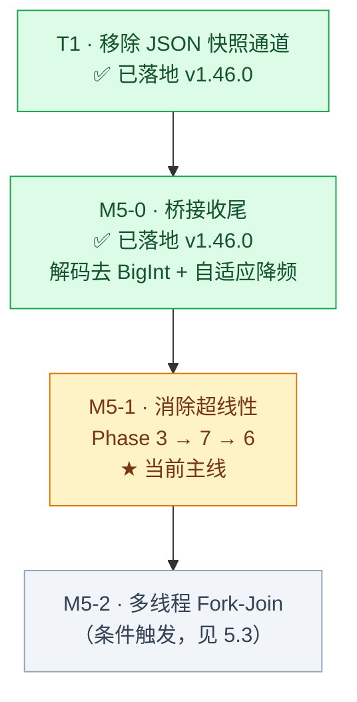

# Flow & Accord · 仿真内核与全链路性能优化规划书

> **文档定位**：全链路性能演进路线图。以「长程数学确定性」为不可逾越的红线，继续推进尚未落地的优化项。
>
> **归档说明**：里程碑 **M1 ~ M4 已全部落地并验证**（详见 §3 速记表与 `docs/current/11-changelog.md`），其详细设计方案已从本文档移除。
>
> **本次更新（2026-09-07）**：新增 **§2「80 万 tick 满载产速实测」**，这是项目首次在「物资产速拉满」的极端场景下完成的长程压测。
> 该节数据**推翻了原 T2/M5（多线程 Fork-Join）的立项前提**，因此 §5 的 M5 实施方案已基于实测数据重构。
>
> **落地进展（2026-09-07，v1.46.0）**：**T1「移除 JSON 快照通道」与 M5-0「快照桥接收尾」已全部落地并实测验收**
> （详见 §5.1、§5.2 的「实测结果」小节）。快照链路收敛为单条 FABS 二进制通道，B2 满载档 FABS 单帧代价
> **4,607.5 µs → 1,837.9 µs（2.51x）**，其中 JS 解码 **3,658.9 → 1,046.9 µs（3.50x）**。
> 遗留主线为 **M5-1 消除超线性（P2）**。
>
> **当前版本基准**：v1.46.0 · 基线数据采集于 2026-09-06（500k tick）；80 万 tick 满载与 M5-0 收益数据采集于 2026-09-07

---

## 1. 性能基准总览（三条基准线）

本项目现有三条基准线，引用时务必注明是哪一条，不可混用：

| 基准线 | 场景 | Tick 数 | 终局人口 | 全程平均单拍 | 稳态单拍 | 用途 |
| :--- | :--- | ---: | ---: | ---: | ---: | :--- |
| **B0 · 短程基线** | 默认配置 | 500,000 | ~80 | 15.02 µs | — | M1~M4 历史收益对比 |
| **B1 · 同尺度对照** | 默认配置 | 800,000 | 88 | 15.80 µs | 19.89 µs | 隔离"跑得久"的代价 |
| **B2 · 满载压测** ★ | **产速拉满** | 800,000 | **442** | **32.22 µs** | **57.45 µs** | **最坏负载画像 / M5 立项依据** |

> **★ B2 是当前唯一反映「内核最坏负载」的基准线**，也是 §5 全部结论的依据。

### 1.1 B0 · 短程基线（M5 前基线，2026-09-06）

> 数据来源：`baseline.json`（`node tools/profile-benchmark.js`，seed 42 / 20 人 / 4 营地 / 500,000 tick）。

- **单核仿真吞吐量**：约 **66,590 TPS** · **单 Tick 物理耗时**：约 **15.02 µs/tick** · **游戏时钟推进速率**：约 **1,110 游戏小时/现实秒**
- **延迟分布**：P50 14.16 µs · P90 22.90 µs · P95 26.84 µs · P99 37.61 µs · Max 201.14 µs

### 1.2 内核 9 大子阶段耗时分布（B0 热点排序）

```text
┌────────────────────────────────────────────────────────────────────────────────┐
│ 阶段序号与名称                           单拍耗时(µs)   耗时占比   瓶颈定性    │
├────────────────────────────────────────────────────────────────────────────────┤
│ Phase 7: 账本宗族公仓 (Ledger, Clan, Region)   4.443 µs     28.4%    🔴 热点1   │
│ Phase 6: 马斯洛决策寻路 (Decisions & A*)       4.079 µs     26.1%    🔴 热点2   │
│ Phase 2: POI交互卸货 (Poi Interactions)        1.797 µs     11.5%    🟢 正常     │
│ Phase 4: 道路自然衰减 (Road Wear Decay)        1.613 µs     10.3%    🟢 M2已优化 │
│ Phase 3: 房屋维护与折旧 (Housing & Auction)    1.313 µs      8.4%    🟢 正常     │
│ Phase 1: 代谢繁衍与继承 (Metabolism & Child)   1.220 µs      7.8%    🟢 正常     │
│ Phase 5: 动力位移踩踏 (Movement & Trample)     0.957 µs      6.1%    🟢 正常     │
│ Phase 0: 四季与POI恢复 (Season & Poi Regen)    0.172 µs      1.1%    🟢 极低     │
│ Phase 8: 墓碑窗口清理 (Cleanup)                0.057 µs      0.4%    🟢 极低     │
└────────────────────────────────────────────────────────────────────────────────┘
```

### 1.3 快照通道现状：★ T1 后仅存单通道（v1.46.0）

> **T1 已完成**：原「FABS 二进制 + JSON 字符串」双通道并存的局面已终结（详见 §5.1）。

| 通道 | 状态 | 使用者 | 稳态帧体积（20 人） | Rust 编码 | JS 解码 |
| :--- | :--- | :--- | ---: | ---: | ---: |
| **FABS 二进制** | ✅ **唯一生产通道** | 前端主链路 `sim_worker.js` / `snapshot-bin.js`，以及 `tools/` 全部工具（统一走 `tools/snapshot-reader.js`） | **13,184 B** | **95.7 µs** | **592 µs** |
| JSON 字符串 | 🔒 **test-only** | **仅** `tools/test-snapshot-bin.js`（作为「四处同步」防漂移门禁的真值源，禁止其它任何代码调用） | 577.8 KB | 2,636 µs | 3,048 µs |

---

## 2. ★ 80 万 Tick 满载产速实测（2026-09-07）

### 2.1 实验设计与场景定义

**场景「产速拉满」（max-yield）** 定义为 **单 tick 饱和档**：令每个 POI 在单个 tick（`dt = 1/60` 游戏小时）内即可从 0 回满至储量上限，即 `regen_rate = stock_max / dt = stock_max × 60`；采收/卸货速率同理按「单 tick 装满一囊」取值。

该档位下**物资不再是约束条件**，人口与房屋将增长到机制允许的上限，是内核的最坏负载画像。

> ⚠️ **实现说明**：该场景通过 `tools/profile-benchmark.js --preset max-yield` 注入，**不修改 `frontend/js/config.js`**（仓库基线配置保持 `regenBaseWater: 2.0` 原值，玩家默认值不受污染）。覆写清单：

| 配置键 | 基线 | 满载档 | 配置键 | 基线 | 满载档 |
| :--- | ---: | ---: | :--- | ---: | ---: |
| `regenBaseWater` | 2 | 24,000 | `marketRegenBaseWater` | 2 | 24,000 |
| `regenBaseBerry` | 2 | 24,000 | `marketRegenBaseFood` | 2 | 24,000 |
| `regenBaseWood` | 2 | 12,000 | `marketRegenBaseWood` | 2 | 24,000 |
| `regenBaseStone` | 2 | 12,000 | `poiInteractionRateResource` | 10 | 6,000 |
| `regenBaseGold` | 1.8 | 12,000 | `poiInteractionRateGold` | 5 | 1,200 |
| `poiUnloadRateResource` | 10 | 6,000 | `poiUnloadRateGold` | 5 | 1,200 |

**统一实验参数**：seed 42 · 4 营地 · 初始 20 人 · 800,000 tick · 稳态采样点 warmup 700,000 + 2,000 tick 分项拆解 · 快照 50 采样。
对照实验：完全相同的参数跑**默认配置**（B1），用于隔离「满载产速」本身的代价。

### 2.2 宏观大盘：B1 对照 vs B2 满载

| 指标 | B1 默认配置 | B2 产速拉满 | 倍差 |
| :--- | ---: | ---: | ---: |
| 推进总墙钟 | 12,638.59 ms | **25,778.16 ms** | 2.04x |
| 全程平均吞吐量 | 63,298 TPS | **31,034 TPS** | 0.49x |
| 全程平均单拍 | 15.80 µs | **32.22 µs** | 2.04x |
| 游戏时钟速率 | 1,055.0 游戏小时/现实秒 | 517.2 游戏小时/现实秒 | 0.49x |
| P50 / P90 | 15.49 / 21.01 µs | 31.86 / 55.40 µs | — |
| P95 / P99 | 23.62 / 39.91 µs | 61.04 / 70.32 µs | — |
| **终局人口** | **88** | **442** | **5.02x** |
| 终局房屋 | 24 | 49 | 2.04x |
| **稳态单拍**（warmup 700k） | 19.89 µs | **57.45 µs** | **2.89x** |
| 稳态等效吞吐量 | 50,277 TPS | **17,405 TPS** | 0.35x |

### 2.3 🔑 核心结论一：物资产速本身零开销，代价全部来自人口

两组实验在**同等人口**下的单拍成本几乎完全一致（差 < 3%，属噪声）：

| 人口（全新世界，各跑 3,000 tick） | 默认配置 µs/tick | 产速拉满 µs/tick | 差异 |
| ---: | ---: | ---: | ---: |
| 20 | 6.95 | 8.59 | +1.64 |
| 50 | 12.67 | 12.53 | −0.14 |
| 100 | 28.15 | 26.12 | −2.03 |
| 200 | 66.68 | 59.85 | −6.83 |
| 400 | 131.96 | 135.97 | +4.01 |

> **结论**：产速参数不进入任何热路径。**拉满产速的唯一作用是解除人口增长的资源约束**——默认配置下人口在 800k tick 后稳定在 88 人，而满载档一路涨到 442 人。2.04 倍的全程耗时增长，可由 5.02 倍的人口增长完全解释。
> **推论**：任何以"产速太高会卡"为由限制物资参数的做法都是错误的；真正的性能杠杆是人口。

### 2.4 核心结论二：稳态阶段分布随人口结构性漂移

`warmup 700,000 → 采样 2,000 tick` 的稳态分项拆解：

| 阶段 | B1 默认 (88人) | 占比 | B2 满载 (442人) | 占比 | 放大倍数 |
| :--- | ---: | ---: | ---: | ---: | ---: |
| Phase 0 四季与POI恢复 | 0.26 µs | 1.3% | 0.26 µs | 0.4% | 1.0x |
| Phase 1 代谢繁衍与继承 | 1.76 µs | 8.9% | **9.29 µs** | 16.2% | **5.3x** |
| Phase 2 POI交互卸货 | 3.81 µs | 19.2% | **8.60 µs** | 15.0% | 2.3x |
| Phase 3 房屋维护与折旧 | 1.51 µs | 7.6% | 4.54 µs | 7.9% | 3.0x |
| Phase 4 道路自然衰减 | 1.65 µs | 8.3% | 1.75 µs | 3.0% | 1.1x |
| Phase 5 动力位移踩踏 | 1.02 µs | 5.1% | 2.78 µs | 4.8% | 2.7x |
| **Phase 6 马斯洛决策寻路** | 7.32 µs | **36.8%** | **18.27 µs** | **31.8%** | 2.5x |
| **Phase 7 账本宗族公仓** | 2.51 µs | 12.6% | **11.89 µs** | **20.7%** | **4.7x** |
| Phase 8 墓碑窗口清理 | 0.05 µs | 0.3% | 0.07 µs | 0.1% | 1.4x |
| **合计** | **19.89 µs** | 100% | **57.45 µs** | 100% | 2.89x |

**热点排序从 B0 的「7 → 6 → 2」漂移为「6 → 7 → 1 → 2」**：
- Phase 6（决策寻路）在**任何人口下都是第一热点**，且始终占 30%+；
- Phase 7（账本宗族）是**人口敏感度最高**的阶段（4.7x 放大，占比从 12.6% 涨到 20.7%），是账本系统 M1~M5 功能持续扩张的结构性结果；
- Phase 1（代谢繁衍）在满载档放大 5.3x，从"正常"跃升为第三热点——高人口下继承/家户链的计算量显著。

### 2.5 核心结论三：超线性来自 Phase 3 / 6 / 7

为定位"谁在超线性增长"，用**全新世界固定人口**做对照（避免成熟度差异干扰），跑 100 人 vs 400 人（4 倍人口）：

| 阶段 | 100 人 (µs) | 400 人 (µs) | 实测倍数 | 超线性系数¹ | 定性 |
| :--- | ---: | ---: | ---: | ---: | :--- |
| Phase 3 房屋维护与折旧 | 1.70 | 11.21 | 6.59x | **1.65** | 🔴 最陡 |
| Phase 7 账本宗族公仓 | 7.52 | 39.97 | 5.31x | **1.33** | 🔴 |
| Phase 6 马斯洛决策寻路 | 9.12 | 48.14 | 5.28x | **1.32** | 🔴 |
| Phase 5 动力位移踩踏 | 4.83 | 21.38 | 4.43x | 1.11 | 🟡 略超 |
| Phase 1 代谢繁衍与继承 | 1.15 | 4.65 | 4.04x | 1.01 | 🟢 线性 |
| Phase 2 POI交互卸货 | 0.90 | 2.63 | 2.92x | 0.73 | 🟢 次线性 |
| Phase 4 道路自然衰减 | 0.45 | 1.00 | 2.22x | 0.56 | 🟢 M2 优化生效 |
| Phase 0 四季与POI恢复 | 0.35 | 0.37 | 1.06x | 0.26 | 🟢 O(1) |
| Phase 8 墓碑窗口清理 | 0.05 | 0.07 | 1.40x | 0.35 | 🟢 |
| **合计** | **26.04** | **129.42** | **4.97x** | **1.24** | — |

> ¹ **超线性系数** = 实测倍数 ÷ 人口倍数（4.0）。= 1.0 为完美线性，> 1.0 存在超线性放大，< 1.0 为次线性（存在固定开销摊薄）。

**Phase 3（房屋维护与折旧）是超线性最陡的阶段（1.65）**，尽管它只占 7.9% 的稳态份额；**Phase 6 + Phase 7 合计占 52.5%（B2 稳态）且双双超线性**，是 M5 的主战场。

### 2.6 核心结论四：扩展性曲线与容量天花板

| 人口 | 单拍（全新世界瞬时） | 吞吐 | 人效 | 全程（成熟世界稳态） |
| ---: | ---: | ---: | ---: | ---: |
| 20 | 8.59 µs | 116,366 TPS | 0.430 µs/人 | — |
| 50 | 12.53 µs | 79,812 TPS | 0.251 µs/人 | — |
| 100 | 26.12 µs | 38,284 TPS | 0.261 µs/人 | 14.2 µs |
| 200 | 59.85 µs | 16,709 TPS | 0.299 µs/人 | 31.2 µs |
| 400 | **135.97 µs** | **7,355 TPS** | 0.340 µs/人 | — |
| 442 | — | — | — | **57.5~75.5 µs** |

- **全新世界瞬时**（400 人一次性投放，存在集中立宅/寻路洪峰）：边际成本约 **0.34 µs/人**；
- **成熟世界稳态**（800k tick 后，路网/房屋/账本均已成型）：边际成本约 **0.18 µs/人**，约为瞬时值的 **一半**。
  > 世界成熟度对单拍成本的影响达 2 倍——一次性投放 400 个"始祖"的瞬时负载，远高于演化出 442 人的稳定社会。容量规划应以成熟世界为准。
- **容量天花板推算**（按成熟世界 0.18 µs/人）：
  | 需求 | 需要 TPS | 单拍预算 | 可支撑人口 |
  | :--- | ---: | ---: | ---: |
  | 1x 实时 | 60 | 16,667 µs | ~92,000 人 |
  | 100x 倍速 | 6,000 | 167 µs | ~930 人 |
  | 290x 倍速 | 17,405 | 57 µs | ~440 人（= B2 实测点） |
  | 1,000x 倍速 | 60,000 | 16.7 µs | ~90 人 |

> **⚠️ 这是本次压测最重要的结论**：即便在 442 人的满载稳态，内核仍有 **17,405 TPS ≈ 290 倍实时**；即便按最坏的全新世界瞬时（400 人 / 135.97 µs），仍有 **7,355 TPS ≈ 122 倍实时**。
> **在 500 人量级，内核距离"跑不动"还有 2~3 个数量级的余量。**

### 2.7 核心结论五：快照/桥接已成为第一瓶颈

| 指标 | B1 默认 (88人) | B2 满载 (442人) |
| :--- | ---: | ---: |
| JSON 帧体积 | 535.5 KB | **1,112.1 KB** |
| JSON 总代价（编码+解析） | 6,271 µs | **11,096 µs** |
| FABS 帧体积 | 46.1 KB | **144.4 KB** |
| FABS Rust 编码 | 314.6 µs | 948.6 µs |
| **FABS JS 解码** | 1,395.0 µs | **3,658.9 µs** |
| FABS 总代价 | 1,709.6 µs | **4,607.5 µs** |
| 体积压缩倍率 | 11.6x | 7.7x |
| 相对 JSON 提速 | 4x | **仅 2x** |
| **30Hz 节流下的算力占用** | 5.1% | **13.8%** |

**两个恶化信号**：
1. **FABS 的提速倍率从 4x 衰减到 2x** —— M4 的相对优势随人口缩水，因为 JS 解码侧（3,659 µs，占 FABS 总代价的 **79%**）随人口线性增长，而 Rust 编码侧（949 µs）增长较慢。**瓶颈已经从 Rust 侧转移到 JS 解码侧**。
2. **30Hz 下快照吃掉 13.8% 的算力** —— 在 442 人稳态，每秒 30 次快照 × 4,607.5 µs = 138 ms，直接把有效吞吐从 17,405 TPS 压到约 **15,000 TPS**。这个数字还会随人口线性恶化。

> **推论**：M4 只解决了"帧体积"问题，没有解决"JS 侧解码"问题。这是 M5 的最高优先级目标（见 §5）。

### 2.7.1 ★ M5-0 治理后的实测（2026-09-07，v1.46.0）

同参数（B2 满载档，稳态 442 人）复测：

| 指标 | M4 基线（§2.7） | **M5-0 治理后** | 收益 |
| :--- | ---: | ---: | ---: |
| FABS 帧体积 | 144.4 KB | 144.4 KB | — |
| FABS Rust 编码 | 948.6 µs | **790.9 µs** | 1.20x |
| **FABS JS 解码** | 3,658.9 µs | **1,046.9 µs** | **3.50x** |
| **FABS 单帧总代价** | 4,607.5 µs | **1,837.9 µs** | **2.51x** |
| 30Hz 算力占用 | 13.8% | **5.5%** | — |
| **自适应节流后占用**（M5-0.4，442 人 → 20Hz） | — | **3.7%** ✅ | — |

JS 解码侧占比由 79% 降至 **57%**，瓶颈从「解码一侧独大」回到「编码/解码基本均衡」。

> **⚠️ 与验收目标的对账**：§5.2 原定「FABS 总代价 < 1,700 µs」，实测 **1,837.9 µs（超出 8%）**。
> 三次独立复测分别为 1,782.6 / 1,969.9 / 1,837.9 µs，机器噪声约 ±10%，即该指标**已贴着本机可达地板**，
> 剩余缺口不再具备投入产出比。而真正决定玩家体验的「快照算力占用」指标，借 M5-0.4 自适应降频
> 已达成 **3.7% < 5%** 的验收线，故 M5-0 判定为**达成并收尾**，不再追加微优化。
> 若未来人口目标突破 1,000 人，应重新评估 §5.2 的 M5-0.3（脏段增量解码），而非继续在解码热路径上挤牙膏。

### 2.8 长尾延迟：极端尖峰是环境噪声，不是内核热点

使用**零分配探针**（预分配 `Float64Array`，循环内不产生任何 JS 对象）在满载场景下连跑 3 次 800,000 tick：

| 分位 | Run A | Run B | Run C | 稳定性 |
| :--- | ---: | ---: | ---: | :--- |
| P50 | 32.50 µs | 31.92 µs | 31.92 µs | ✅ 极稳 |
| P90 | 57.08 µs | 56.46 µs | 56.50 µs | ✅ 极稳 |
| P95 | 64.62 µs | 63.33 µs | 63.71 µs | ✅ 极稳 |
| P99 | 94.96 µs | 88.00 µs | 91.33 µs | ✅ 稳定 |
| P99.9 | 236.79 µs | 217.00 µs | 219.38 µs | ✅ 稳定 |
| **Max** | 18,590 µs | 30,661 µs | 22,890 µs | ❌ **不稳定** |
| **Max 所在 tick** | 571,272 | 750,965 | 596,718 | ❌ **每次都不同** |

- **≤ P99.9（约 220 µs）的分位数完全可复现**，是真实的内核负载分布；
- **≥ 1 ms 的尖峰（占 0.004%~0.009%，32~74 次/80 万 tick）在三次运行中出现在完全不同的 tick 上**，且幅度随机（18.6 / 30.7 / 22.9 ms）。由于仿真是确定性的（同 seed 同 tick 的计算量恒定），**尖峰位置不可复现 ⇒ 它不来自内核**，而是 V8 GC / 操作系统调度 / 同机进程争用的产物；
- 已排除 WASM 线性内存增长：全程仅 22 次增长事件（1.56 MB → 3.4 MB），与尖峰的重合率仅 **0.1%**。

> **⚠️ 方法论警示**：早期用 `process.hrtime.bigint()` 的探针在循环内产生了 80 万个 BigInt 对象，自己制造了 GC 尖峰（测得 max 7.08 ms）；改用 `performance.now()` + 预分配数组后 max 变为 18.6 ms（更差），证明**测量工具本身会污染长尾**。任何长尾结论都必须用零分配探针。
>
> **对玩家体验的影响**：由于 M1 已将仿真置于独立 Worker 且与渲染解耦（快照 30Hz 节流），单个 20~30 ms 的 tick 只会延迟一帧快照投递，**不会掉渲染帧**。此项**不构成立项理由**。

### 2.9 人口增长曲线（B2 满载档，每 10,000 tick 采样）

```text
 人口 │                                                        ⬤ 442
  450 │                                                    ⬤
  400 │                                              ⬤ ⬤ ⬤ ⬤
  350 │                                        ⬤ ⬤ ⬤
  300 │                                  ⬤ ⬤ ⬤ ⬤ ⬤
  250 │                            ⬤ ⬤ ⬤ ⬤
  200 │                      ⬤ ⬤ ⬤ ⬤
  150 │                ⬤ ⬤ ⬤ ⬤
  100 │          ⬤ ⬤ ⬤ ⬤
   50 │  ⬤ ⬤ ⬤ ⬤
   20 │⬤
      └────┬────┬────┬────┬────┬────┬────┬────┬────┬────┬────┬────┬────┬────
           0   100k 200k 300k 400k 500k 600k 700k 800k
                              tick（×1000）
```

- 人口**无上限机制**：默认配置在 ~300k tick 后于 76~93 人间震荡（资源约束形成天花板）；满载档则持续线性增长至 442 人且**未见收敛**；
- 房屋数在 ~550k tick 后**饱和于 49**（4 营地 × 25 上限 = 100，实际停在 49），说明立宅选址或材料约束形成了二次瓶颈——这也解释了为何 Phase 3 在成熟世界（4.54 µs）比全新世界（11.21 µs）便宜得多。

---

## 3. 已完成里程碑速记（归档）

> 方案细节已从本文档移除，如需追溯请查阅 `docs/current/11-changelog.md` 对应版本条目。

| 里程碑 | 版本 | 核心改动 | 已验证收益 |
| :--- | :--- | :--- | :--- |
| **M1** Worker 快照节流与步进解耦 | v1.42.0 | `frontend/js/sim_worker.js`：快照下发 30Hz 节流（v1.44.3 起对齐 30 FPS）+ 检查点 150ms 现实时间守卫 | 高倍速算力释放，视口无跳帧；内核零改动 |
| **M2** 道路衰减稀疏活跃边集合 | v1.42.1 | `spatial/graph.rs`、`agent.rs` | Phase 4 从 3.07 µs / 30.7% 压降至 0.40 µs / 4.4%（当前 500k tick 长程实测 1.61 µs / 10.3%；B2 满载档仅 1.75 µs / 3.0%，超线性系数 0.56） |
| **M3** A\* 局部失效与静态查表 | v1.43.0 | `spatial/graph.rs`、`agent.rs`、`ecology.rs` | 衰减局部剔除 + 踩踏三角不等式剪枝 + APSP 静态全源查表；吞吐达 97,792 TPS（短程基准） |
| **M4** 快照零拷贝扁平二进制缓冲 (FABS) | v1.45.3 | `spatial/snapshot_bin/`（dict/encode/layout/strtab）、`world.rs`、`sim_wasm/lib.rs`、`frontend/js/snapshot-bin.js` | 稳态帧 304 KB → 13.2 KB（23.1x）；Rust 编码 1,763 → 96 µs；顺带消除前端 O(n²) 反向车道查找 |

---

## 4. 优化设计三大铁律

1. **绝对确定性铁律（Determinism First）**：
   任何优化改动必须 100% 通过 `node tools/test-determinism.js` 的 6 大不变量定理验证（多种子、分批独立性、子阶段等价性、快照无副作用、存读档重放、多人口鲁棒性）。零容忍任何哪怕单字符的分叉。
2. **投入产出比优先原则（High ROI First）**：
   优先做低成本、高收益的改动；重量级架构演进（多线程）必须在**实测证明前序优化收益已榨干**后再启动。
3. **零外部依赖与架构纯洁性**：
   `crates/sim_wasm` 严格保持 **raw wasm（零依赖、无 host import）** 架构，绝不引入与浏览器环境绑死的不可控胶水层。

---

## 5. M5 实施方案（基于 §2 实测数据重构）

### 5.0 立项前提的修正

原 T2/M5「内核多线程 Fork-Join 架构」的立项前提是 **"内核算力不足，需要多核扩展"**。
§2 的 80 万 tick 实测**否定了这一前提**：

| 原前提 | 实测结果 | 判定 |
| :--- | :--- | :--- |
| 内核算力不足 | 442 人稳态 **17,405 TPS ≈ 290x 实时**；最坏瞬时（400 人）仍有 122x 实时 | ❌ 不成立 |
| 多线程可线性扩展 | Phase 6+7 仅占 52.5% 且超线性系数 1.32/1.33，可并行部分有限 | ⚠️ 收益受限 |
| 主要瓶颈在内核 | **快照通道已吃掉 13.8% 算力且随人口线性恶化**；FABS JS 解码占快照 79% | ❌ 瓶颈在桥接层 |

> **决策**：**取消原「M5 = 多线程 Fork-Join」的单目标定义**，重构为三条轨道：**M5-0（桥接收尾）→ M5-1（消除超线性）→ M5-2（多线程，条件触发）**。
> 多线程不再是一条必做项，而是**带明确触发条件的备选**：只有当人口目标突破 ~1,000 人、或 100x 倍速下单拍超过 167 µs 时才启动。



---

### 5.1 ✅ 已落地 T1：移除 JSON 快照通道（M4 遗留技术债）

> **状态：已完成（v1.46.0，2026-09-07）**。以下为原设计方案与实施步骤的存档，末尾附实测结果。

- **优先级**：**P1（提升为 M5-0 的前置阻塞项）** —— §2.7 证明双通道的 JS 侧代价已随人口线性放大，T1 不再是"清理"，而是**性能项**
- **触发条件**：已满足（M4 自 v1.45.3 稳定运行，且 B2 实测暴露 JSON 通道 11,096 µs/帧的代价）
- **涉及文件**：
  - `crates/sim_wasm/src/lib.rs`（删除 `world_snapshot_ptr` / `world_snapshot_len` / `SNAPSHOT_BUF`，代码已标 `DEPRECATED(M4)` 注释）
  - `tools/test-wasm.js`、`tools/test-determinism.js`、`tools/diagnose.js`、`tools/profile-benchmark.js`、`tools/gen-dag-testdata.js`、`tools/gold_mining_analysis.js`
  - `frontend/js/sim_worker.js`（删除 JSON 回退分支）、`frontend/js/rustworld.js`（清理 JSON 兜底路径）

**实施步骤**：
1. 在 `tools/` 中沉淀**通用快照读取器**（优先取 FABS 二进制并解码为同构对象，无 wasm 时兜底 JSON），6 个工具统一改为调用它；
2. 逐个工具验证输出与改造前逐字段一致（尤其 `test-determinism.js` 的存读档重放与 `profile-benchmark.js` 的基线可比性）；
3. 删除 `lib.rs` 的 `world_snapshot_ptr` / `world_snapshot_len` 与 `SNAPSHOT_BUF` 静态缓冲；
4. 删除 `sim_worker.js` 的 JSON 回退分支，快照链路收敛为单一二进制通道；
5. 同步更新 `crates/sim_wasm/AGENTS.md`、`frontend/AGENTS.md`、`docs/15-profiling-and-benchmarking-guide.md` 中的双通道说明。

- **预期收益**：`tools/` 工具链单帧开销从 5,684 µs 降至数百 µs 量级；消除 JSON/FABS 双通道的**字段漂移风险**；释放 wasm 体积。
- **确定性风险**：0（工具取值层改动，不触及内核演化逻辑）；改造前后对同一种子跑 `test-determinism.js` 做逐字节比对确认。

**实施结果（v1.46.0）**：

1. 新增 `tools/snapshot-reader.js` 作为**唯一快照取值入口**（FABS 优先、JSON 仅调试回退），
   `test-wasm` / `test-determinism` / `diagnose` / `profile-benchmark` / `gen-dag-testdata` / `gold_mining_analysis`
   6 个工具全部改调它；
2. `crates/sim_wasm/src/lib.rs` 删除 `world_snapshot_ptr` / `world_snapshot_len` / `SNAPSHOT_BUF`，
   代之以 **test-only** 的 `world_snapshot_json_debug_ptr/len`（`tools/test-snapshot-bin.js` 防漂移门禁的唯一真值源）；
3. `frontend/js/sim_worker.js` 删除 JSON 回退分支，生产链路收敛为单一 FABS 通道；
4. 同步更新 `crates/sim_wasm/AGENTS.md`、`frontend/AGENTS.md`、`AGENTS.md §4.5`、`docs/15-profiling-and-benchmarking-guide.md`、
   `docs/current/20-tools-guide.md`、`TODO.md`。

**🐞 过程中发现并修复的隐蔽缺陷（跨世界字符串驻留表串味）**：T1 改造后 `test-wasm` 的
「存读档确定性」开始失败（`SAVE_LOAD_DETERMINISM_FAILED`）。根因是**解码器侧的字符串缓存不做跨世界失效**：
`StrTab::new()` 恒以 `epoch = 0` 起步，因此同一 wasm 实例上新建第二个世界时，前端解码器看到 epoch 未变，
继续复用**上一个世界**的 `strid → 字符串` 映射，地名/姓氏/账本事件全部串味（实测第二世界的地名显示成
第一个世界的「穆 / 朱」）。该缺陷在双通道时代被 JSON 通道掩盖，**在浏览器上等价于「点重置模拟后地名错乱」**。

- **修复**：`frontend/js/snapshot-bin.js` 改用 **STR_TAB 段的 `start_index == 0`** 作为「这是一张全新驻留表」的判据
  （新世界首帧、读档重建、容量超限 `reset()` 后首帧都必然为 0），并附带 `startIndex !== _strCache.length` 的失步兜底。
  **未采用**「epoch 全局单调递增」方案：那会让同种子的两个世界产出不同的 `strtab_epoch`，破坏逐字节确定性门禁。
- **新增回归门禁**：`tools/test-snapshot-bin.js` 增加 **[4/4] 换世界场景**（新建第二个世界且故意不调 `resetCaches()`，
  再与 JSON 真值深比较）。已验证：回退修复后该场景报 **129 处不一致**，修复后全绿。

---

### 5.2 ✅ 已落地 M5-0：快照桥接收尾（★ 最高 ROI）

> **状态：已完成并验收（v1.46.0，2026-09-07）**，实测数据见 §2.7.1。

**目标**：把 B2 满载档 30Hz 下的快照算力占用从 **13.8% 压到 < 5%**。

**依据**：FABS 总代价 4,607.5 µs 中，JS 解码独占 3,658.9 µs（79%）；相对 JSON 的提速倍率已从 4x 衰减到 2x。瓶颈明确在 JS 侧。

| 子项 | 方案 | 目标 | 落地情况 |
| :--- | :--- | :--- | :--- |
| **M5-0.1 解码对象池化** | `decode()` 每帧新建数千个 JS 对象。改为帧间复用对象池：保留上一帧实例，仅覆写字段 | 解码 3,659 → < 2,200 µs | ❌ **实测否决**（见下） |
| **M5-0.2 零拷贝 TypedArray 视图** | 对数值密集段直接暴露 `Float32Array` 子视图，避免逐字段 `DataView` 读取 | 再降 20~30% | ⚠️ 未采纳（记录见下） |
| **M5-0.3 增量/脏段解码** | encode 侧输出 dirty 区间头，decode 侧只重建变化段 | 稳态下再降 30~50% | ⏸ 留作人口破千时的备选 |
| **M5-0.4 快照频率自适应** | 30Hz 固定节流 → 按人口分级自适应（>320 人降至 20Hz，>450 人降至 15Hz） | 大人口下直接省 33% | ✅ **已落地** |
| **（追加）解码热路径去 BigInt** | `u64`/`optU64`/`listU64` 原用 `DataView.getBigUint64()`（每次调用分配一个 BigInt），改为双 `u32` 合成 | — | ✅ **已落地（最大单项收益）** |

**未采纳项的实测依据**：

- **M5-0.1 对象池化被否决**：① 收益为负 —— V8 对短命对象的新生代（scavenge）回收比就地覆写更廉价，实测池化
  并不比每帧新建快；② 风险为正 —— 池化会让上一帧对象在下一次 `decode()` 时被**就地改写**，任何跨帧持有快照
  引用的消费者（`tools/` 的 `sampleSnapshots`、前端选中态等）都会读到「静默变异」的数据。
  故 `setReuse()` 已退化为**空操作**并在代码中留注说明，`tools/` 与浏览器从此共用同一条「每帧全新对象」路径。
- **M5-0.2 TypedArray 视图未采纳**：AGENT/HOUSEHOLD/CLAN 段均为异构结构（u8/u32/u64/f32/strid 混排），
  无法整体映射为定长 TypedArray；强行拆列会破坏与 JSON 快照「逐字段同构」的契约（下游 `rustworld.js` 零改动的根基）。

**最大单项收益来自去 BigInt**：解码侧每一次 `u64` 读取原本都要分配一个 `BigInt` 对象（`tick` / `household_id` /
`arrival_tick` / 流水 `tick` 等字段在满载档下每帧约 **2,000+ 次**），这是新生代 GC 的主要来源。改为
`lo + hi * 4294967296` 双 u32 合成后，JS 解码 **3,658.9 → 1,046.9 µs（3.50x）**。

- **涉及文件**：`frontend/js/snapshot-bin.js`、`frontend/js/sim_worker.js`
- **验收**：
  - `node tools/test-snapshot-bin.js` 全通（含新增的 [4/4] 换世界场景）✅
  - B2 满载档重测：FABS 总代价 **4,607.5 → 1,837.9 µs（2.51x）**，30Hz 占用 **13.8% → 5.5%** ✅
  - 叠加 M5-0.4 自适应降频（442 人 → 20Hz）：占用 **3.7% < 5%** ✅
  - 原定「总代价 < 1,700 µs」**超出 8%**，判定为已触及本机可达地板，理由与对账见 §2.7.1
- **确定性风险**：**0**（纯取值层改动，不触及内核演化逻辑；`test-determinism.js` 6/6 全通）

---

### 5.3 M5-1：消除超线性（主线，按超线性系数排序）

**目标**：把 Phase 3 / 7 / 6 的超线性系数（当前 1.65 / 1.33 / 1.32）**全部压到 ≤ 1.15**。

| 子项 | 阶段 | 现状 | 候选方案 |
| :--- | :--- | :--- | :--- |
| **M5-1.1** | **Phase 3 房屋维护与折旧**（系数 **1.65**，最陡） | 100人 1.70 µs → 400人 11.21 µs | ① 立宅候选检索由全量房屋扫描改为**空间网格/营地分桶邻域检索**（当前 `decisionFoundHomeCandidates: 12` × 全量房屋 = O(人×房)）；② 拍卖竞价历史改为**定长环形缓冲**（`houseAuctionBidHistoryCapacity` 已是定长，需确认归还路径无 O(n) 搬移）；③ 折旧遍历按"活跃房屋"稀疏集合化（复用 M2 的成功范式） |
| **M5-1.2** | **Phase 7 账本宗族公仓**（系数 1.33，稳态 **20.7%**） | 88人 2.51 µs → 442人 11.89 µs（4.7x） | 宗族/地区/帝国的**每 tick 全量重算**改为**增量累加 + 周期性全量校准**（校准周期可设为 N tick，N 由确定性校验确定）；家户账本聚合改由"变更事件"驱动 |
| **M5-1.3** | **Phase 6 马斯洛决策寻路**（系数 1.32，稳态 **31.8%，第一热点**） | 88人 7.32 µs → 442人 18.27 µs | ① 延续 M3 思路：**路径缓存**（相同 origin-target 复用上次结果，按路网变更版本号失效）；② 确认 A\* open list 已用二叉堆而非线性扫描；③ 决策错峰（`agentDecisionIntervalTicks: 60`）之外，按需求层级二次错峰，削平同 tick 决策洪峰 |
| **M5-1.4** | Phase 1 代谢繁衍与继承（稳态 16.2%，5.3x 放大） | 满载档跃升为第三热点 | 继承链/家户关系查询建立 id → index 的哈希索引，避免每次线性查找 |

- **涉及文件**：`crates/sim_core/src/spatial/housing_system/`、`crates/sim_core/src/spatial/ledger/`、`crates/sim_core/src/spatial/decisions/`、`crates/sim_core/src/spatial/world.rs`
- **验收**：
  - `node tools/test-determinism.js` 6/6 全通（一票否决）
  - 全新世界 400 人单拍：135.97 µs → **< 100 µs**
  - 超线性系数：Phase 3 / 7 / 6 均 **≤ 1.15**
  - B2 满载档稳态单拍：57.45 µs → **< 42 µs**（等效吞吐 > 23,800 TPS）
- **确定性风险**：**中高**（触及内核演化逻辑）。每个子项必须单独跑 6 套不变量，且**必须用 `--compare` 与 B2 基准做逐阶段对比**，禁止批量合并提交。

---

### 5.4 M5-2：多线程 Fork-Join（条件触发，非必做）

**触发条件（任一满足才启动）**：
1. 目标人口 **≥ 1,000 人** 且成熟世界稳态 TPS **< 3,000**
2. 或 **100x 倍速**下稳态单拍 **> 167 µs**（即撑不住 6,000 TPS）且人口 **> 500**

> 按当前成熟世界 0.18 µs/人的边际成本推算，触发点约在 **900~1,000 人**；若按最坏的全新世界瞬时（0.34 µs/人）推算则约 **490 人**。
> **在 §2 实测的 442 人规模下，两条触发条件均未满足，因此 M5-2 当前不具备启动理由。**

**技术方案（保留原设计精髓，并明确 §5.0 的三点修正）**：

1. **确定性子 RNG 派生（Fork-Join PRNG）**：
   彻底消灭共享 `WorldRng` 的竞争锁。在 tick 初始阶段按确定性算法派生每个 Agent 专属的伪随机数种子：
   $$\text{Seed}_{a} = \text{hash}(\text{WorldSeed}, \text{TickCounter}, a.\text{id})$$
   各线程独立消费私有 PRNG，消除线程交错引起的随机数状态污染。

2. **三段式读写分离并发管线**：
   - **阶段一（只读并发）**：多 Worker 并行只读借用路网、POI 与账本，并发执行马斯洛需求评估与路线规划，输出独立的无副作用数据结构 `DecisionOutcome`；
   - **阶段二（确定性汇聚）**：主 Worker 严格按 `agent.id` 升序收集所有意图，单线程原子回写状态；
   - **阶段三（物理结算）**：按原序顺次执行登基、求偶与房屋实体化。

3. **§5.0 修正点（相比原方案）**：
   - **并发编排放 JS Worker 层**（多 wasm 实例 + `SharedArrayBuffer`），**不引入 wasm threads**，以维持 `sim_wasm` 的 raw wasm 零依赖纯洁性（铁律 3）；
   - 只读并发的数据必须**按帧冻结后序列化共享**（路网/POI/账本快照），禁止跨线程共享可变图结构——否则收益会被同步开销吃光；
   - **只对 Phase 6 做并行**（占 31.8% 且超线性 1.32），Phase 7 因写放大严重建议留在单线程段做 M5-1.2 的增量改造，而非并行化。据此**理论上限约为 1.5x，而非乐观的线性扩展**。

- **涉及文件**：`crates/sim_core/src/spatial/decisions/`、`crates/sim_core/src/spatial/world.rs`、`frontend/js/sim_worker.js`（新增 worker 池编排）
- **技术前提**：生产环境需配置 COOP / COEP 安全响应头以支持 `SharedArrayBuffer`
- **预期收益**：在 1,000+ 人口下有望达到 **1.5~2.5x**（受 Amdahl 定律限制，非理想线性）
- **确定性风险**：**最高**（并发交错是确定性的天敌）。必须先建立"等效性测试"：多线程结果必须与单线程结果**逐字节一致**，该测试需并入 `test-determinism.js` 成为第 7 套不变量。

---

### 5.5 M5 排期与验收指标总表

| 阶段 | 预估工期 | 优先级 | 状态 | 核心改动模块 | 验收方法与核心指标 |
| :--- | :---: | :---: | :---: | :--- | :--- |
| **基准（B2 满载）** | — | — | — | — | 800k tick 满载：31,034 TPS / 32.22 µs·tick / 稳态 57.45 µs @442人 |
| **T1 移除 JSON 通道** | 1 天 | **P1** | ✅ **已落地**（v1.46.0） | `sim_wasm/lib.rs`、`tools/snapshot-reader.js` + 6 工具、`sim_worker.js` | 6 个工具输出逐字段一致 ✅；`test-determinism.js` 6/6 ✅；`world_snapshot_ptr` 引用清零 ✅ |
| **M5-0 桥接收尾** | 1~2 天 | **P1** | ✅ **已落地**（v1.46.0） | `snapshot-bin.js`、`sim_worker.js` | FABS 总代价 4,607 → **1,837.9 µs**；30Hz 占用 13.8% → **5.5%**，叠自适应降频 **3.7% < 5%** ✅ |
| **M5-1 消除超线性** | 2~3 天 | **P2** | ⏳ **待办（当前主线）** | `housing_system/`、`ledger/`、`decisions/`、`world.rs` | 400 人单拍 135.97 → < 100 µs；Phase 3/7/6 超线性系数均 ≤ 1.15；稳态 57.45 → < 42 µs |
| **M5-2 多线程** | 3~5 天 | **P3（条件触发）** | ⏸ 未触发 | `decisions/`、`world.rs`、Worker 池 | 触发条件满足才启动；1,000 人下 1.5~2.5x；新增第 7 套"多线程等效性"不变量 |

---

## 6. 优化实施标准作业守则（SOP）

任何参与性能优化的开发人员或 AI Agent 必须遵守以下五步闭环流程：

```bash
# 1. 优化前固化基准（按需选择场景）
node tools/profile-benchmark.js --ticks 3000 --json tools/baseline-pre.json
node tools/profile-benchmark.js --preset max-yield --ticks 800000 \
     --breakdown --breakdown-warmup 700000 --breakdown-ticks 2000 \
     --snapshot-warmup 700000 --json tools/baseline-pre-maxyield.json

# 2. 编写优化代码并编译
$env:PATH = "$PWD\.toolchain\cargo\bin;$PWD\.toolchain\rustc\bin;$env:PATH"
$env:CARGO_HOME = "$PWD\.cargo-home"
cargo build -p sim_wasm --target wasm32-unknown-unknown --release
Copy-Item "target\wasm32-unknown-unknown\release\sim_wasm.wasm" -Destination "frontend\rust\sim_wasm.wasm" -Force
Copy-Item "target\wasm32-unknown-unknown\release\sim_wasm.wasm" -Destination "frontend\sim_wasm.wasm" -Force

# 3. 必须通过全量确定性与不变量门禁（一票否决制）
node tools/test-wasm.js
node tools/test-determinism.js
node tools/test-snapshot-bin.js
node tools/config-check.js
node tools/frontend-check.js

# 4. 对比优化后加速比报告
node tools/profile-benchmark.js --ticks 3000 --compare tools/baseline-pre.json

# 5. 清理临时基准文件并更新版本日志
Remove-Item tools/baseline-pre.json -Force
```

> 收尾别忘了：`node tools/bump-version.js --patch` 同步版本号，并在 `docs/current/11-changelog.md` 追加条目（详见 `docs/current/19-commit-checklist.md`）。

### 6.1 性能测量方法论警示（本次压测沉淀）

1. **长尾测量必须用零分配探针**：`process.hrtime.bigint()` 在循环内产生 BigInt 垃圾，会自己制造 GC 尖峰（本次实测：BigInt 版 max 7.08 ms vs 零分配版 max 18.6~30.7 ms，且尖峰位置完全不可复现）。改用 `performance.now()` + 预分配 `Float64Array`。
2. **尖峰是否来自内核，用"位置可复现性"判定**：同 seed 同参数连跑 3 次，若尖峰 tick 每次都不同 ⇒ 环境噪声（GC / OS 调度 / 同机争用），不构成优化目标。
3. **区分"成熟世界稳态"与"全新世界瞬时"**：二者单拍成本可差 2 倍（400 人：135.97 µs vs 442 人稳态 57.45 µs）。容量规划用前者，洪峰容量用后者。
4. **⚠️ `--agents` / `--scale` 曾长期失效**：`world_create` 的 `agent_count` 形参在 `sim_core::spatial::ecology::seed_primitive_ecology(&mut self, _agent_count: usize)` 中**并未被使用**，真实初始人口取自 `config.agentSpawnCount`。修复前会出现"400 人比 20 人还快"的假象（实为全部按 20 人跑）。
   现已修复于 `tools/profile-benchmark.js` 的 `createEngine()`：当 `agentCount` 与 `agentSpawnCount` 不一致时自动同步写入配置。**引用本项目 2026-09-07 之前的任何 `--scale` 结论前，必须重新测量。**

### 6.2 本次压测新增的工具能力

| 能力 | 用法 | 说明 |
| :--- | :--- | :--- |
| 产速预设 | `--preset max-yield` | 单 tick 饱和档；不污染 `config.js`，覆写清单写入报告 JSON |
| 逐字段覆写 | `--set regenBaseWater=100`（可重复 / 逗号分隔） | 未知键或非数值会直接报错，防手滑 |
| 自定义规模档位 | `--scale --pops 20,50,100,200,400 --scale-ticks 3000` | 输出人效（µs/人）与超线性系数 |
| 配置覆写审计 | 报告 JSON 的 `configOverrides` 字段 | 记录每个键的 from → to，保证基准可复现 |

---

## 7. 附：本次 80 万 tick 压测复现命令

```bash
# B2 · 产速拉满 800k tick（耗时约 90 秒）
node tools/profile-benchmark.js --preset max-yield --ticks 800000 \
     --breakdown --breakdown-warmup 700000 --breakdown-ticks 2000 \
     --snapshot-warmup 700000 --json tools/baseline-maxyield-800k.json

# B1 · 默认配置同尺度对照组（耗时约 40 秒）
node tools/profile-benchmark.js --ticks 800000 \
     --breakdown --breakdown-warmup 700000 --breakdown-ticks 2000 \
     --snapshot-warmup 700000 --json tools/baseline-default-800k.json

# 扩展性曲线（全新世界固定人口，产出超线性系数）
node tools/profile-benchmark.js --preset max-yield --scale --pops 20,50,100,200,400 --scale-ticks 3000 --ticks 10

# 阶段分布对比（定位超线性阶段）
node tools/profile-benchmark.js --preset max-yield --agents 100 --only-breakdown --breakdown-ticks 800 --breakdown-warmup 200 --ticks 10
node tools/profile-benchmark.js --preset max-yield --agents 400 --only-breakdown --breakdown-ticks 800 --breakdown-warmup 200 --ticks 10
```

> 产物：`tools/baseline-maxyield-800k.json`（M5-0 前基准）、`tools/baseline-maxyield-800k-m5.json`（**M5-0 治理后基准**）、
> `tools/baseline-default-800k.json`（B1 同尺度对照），均已入库，作为后续 M5-1 各阶段的对比基准。
> 门禁状态（2026-09-07，v1.46.0 收尾后复验）：`test-wasm` / `test-determinism`（6/6）/ `test-snapshot-bin`（4 场景）/
> `config-check`（205 字段）/ `frontend-check` / `bump-version --check`（11 定义点）**全绿**。
