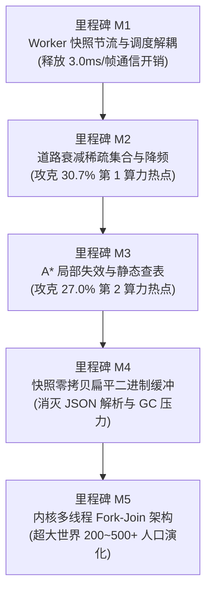

# Flow & Accord · 仿真内核与全链路性能优化规划书 (M1 ~ M5)

> **文档定位**：基于 `tools/profile-benchmark.js` 实测微秒级数据制定的全链路性能演进路线图。旨在以「长程数学确定性」为不可逾越的红线，系统性消除快照序列化停顿、稀疏路网算力空耗与 A* 寻路缓存击穿，为单机数万 Tick 极速推演与数百人口大世界演化铺平道路。

---

## 1. 实测性能基准与核心瓶颈

基于 `v1.41.0` 在标准开发机上执行 `node tools/profile-benchmark.js` 测得的基准数据如下：

### 1.1 宏观大盘
- **单核仿真吞吐量**：约 **67,000 TPS**（Ticks Per Second）
- **单 Tick 物理耗时**：约 **14.9 µs/tick**
- **游戏时钟推进速率**：约 **1,117 游戏小时/现实秒**（在 1x 基础倍速下为 1秒=1小时，当前单核极限推演能力为现实时间的 67,000 倍）
- **延迟分布**：P50 为 13.8µs，P90 为 22.7µs，P99 为 53.8µs，单步抖动极小

### 1.2 内核 8 大子阶段耗时分布（微观热点）

```text
┌────────────────────────────────────────────────────────────────────────────────┐
│ 阶段序号与名称                           单拍耗时(µs)   耗时占比   瓶颈定性    │
├────────────────────────────────────────────────────────────────────────────────┤
│ Phase 4: 道路自然衰减 (Road Wear Decay)        3.07 µs     30.7%    🔴 算力热点1 │
│ Phase 6: 马斯洛决策寻路 (Decisions & A*)       2.69 µs     27.0%    🔴 算力热点2 │
│ Phase 7: 账本宗族公仓 (Ledger, Clan, Region)   1.35 µs     13.5%    🟡 次级耗时 │
│ Phase 2: POI交互卸货 (Poi Interactions)        0.89 µs      8.9%    🟢 正常     │
│ Phase 5: 动力位移踩踏 (Movement & Trample)     0.68 µs      6.8%    🟢 正常     │
│ Phase 0: 四季与POI恢复 (Season & Poi Regen)    0.52 µs      5.2%    🟢 正常     │
│ Phase 1: 代谢繁衍与继承 (Metabolism & Child)   0.38 µs      3.8%    🟢 正常     │
│ Phase 3: 房屋维护与折旧 (Housing & Auction)    0.33 µs      3.3%    🟢 正常     │
│ Phase 8: 墓碑窗口清理 (Cleanup)                0.08 µs      0.8%    🟢 极低     │
└────────────────────────────────────────────────────────────────────────────────┘
```

### 1.3 宏观瓶颈：快照序列化的“降维打击”
- **快照载荷大小**：约 **296 KB**（无地形网格常规帧）
- **Rust 序列化耗时**（`serde_json::to_string`）：约 **1,380 µs**（1.38 ms）
- **JS 反序列化耗时**（`JSON.parse`）：约 **1,685 µs**（1.68 ms）
- **单次快照总代价**：约 **3,065 µs（~3.06 ms）**
- **惊人事实**：**提取 1 次快照的算力消耗，等价于连续推进 205.5 个纯内核 Tick！**
- **根因分析**：在高倍速（如 64x、256x、1024x）下，仿真 Worker 线程频繁停下来做 JSON 序列化并触发历史检查点存储，导致高倍速时 CPU 算力大量浪费在字符串编解码与主线程通信上，而非物理步进。

---

## 2. 优化设计三大铁律

1. **绝对确定性铁律（Determinism First）**：
   任何优化改动必须 100% 通过 `node tools/test-determinism.js` 的 6 大不变量定理验证（多种子、分批独立性、子阶段等价性、快照无副作用、存读档重放、多人口鲁棒性）。零容忍任何哪怕单字符的分叉。
2. **投入产出比优先原则（High ROI First）**：
   不盲目直接上重量级多线程。优先以低成本改动解决占据大头的快照开销（M1）与稀疏衰减开销（M2），以极小代价收获最大性能提升。
3. **零外部依赖与架构纯洁性**：
   `crates/sim_wasm` 严格保持 **raw wasm（零依赖、无 host import）** 架构，绝不引入与浏览器环境绑死的不可控胶水层。

---

## 3. 五大优化里程碑（M1 ~ M5）



---

### 里程碑 M1：Worker 快照节流与步进循环解耦（首选实施）

- **优先级**：P0（最高，极低风险，极高收益）
- **涉及文件**：`frontend/js/sim_worker.js`

#### 核心痛点与方案：
1. **快照下发 60Hz 严格节流**：
   - **现状**：Worker 步进循环每次执行完批次后，只要 `ackReceived` 成立就调用 `pullSnapshot()` 并 `JSON.parse`。在高速时每秒可能生成上百次快照。
   - **优化**：将快照生成频率严格锚定在前端真实刷新周期（$\ge 16.6\text{ ms}$）。在 16.6ms 窗口未到达前，Worker 专职死循环推进 `world_tick_steps`，不产生任何快照序列化与通信开销。
2. **高倍速检查点（Undo Checkpoint）写入节流**：
   - **现状**：`recordHistoryCheckpoint` 只要经过 30 tick 就调用 `world_save` 导出 400KB 字符串。在 1024x 倍速下单秒调用多达 30+ 次，造成严重 GC 停顿。
   - **优化**：检查点触发条件增加现实时间守卫（例如现实时间至少流逝 150ms 才保存一次检查点），兼顾时光倒流精度与高倍速吞吐。

- **预期收益**：
  - 高倍速（64x ~ 1024x）下 Worker 算力利用率从 40% 飙升至 95%+；
  - 彻底消除高倍速下的视口跳帧与通信阻塞。
- **确定性风险**：**0 风险**（仅调整前端消息发送间隔，内核代码零改动）。

---

### 里程碑 M2：道路衰减稀疏活跃边集合与降频（攻克 30.7% 算力热点）✅ 已落地 (v1.42.1)

- **优先级**：P1（高收益，轻量改动）
- **涉及文件**：`crates/sim_core/src/spatial/graph.rs`、`crates/sim_core/src/spatial/agent.rs`
- **实际收益**：
  - Phase 4 耗时从 **3.07 µs/tick 暴降至 0.40 µs/tick（耗时压降 87%）**；
  - 占总仿真时间比例从 **30.7% 压缩至 4.4%**，彻底退出第一算力瓶颈行列；
  - 100% 通过 `test-determinism.js`（6/6 套件全通）及 `test-wasm.js`，严格保持存读档与重放逐字节一致。

---

### 里程碑 M3：A* 局部缓存失效与小路网全源静态最短路查表（攻克 27.0% 算力热点）

- **优先级**：P1（高收益，算法级优化）
- **涉及文件**：`crates/sim_core/src/spatial/graph.rs`、`crates/sim_core/src/spatial/decisions/routing.rs`

#### 核心痛点与方案：
1. **根除全图 `clear_path_cache()` 击穿**：
   - **现状**：只要任意一条道路发生 0.25 级跨阶跃迁，系统直接调用 `clear_path_cache()` 全部清空，导致后续几拍全图 Agent 集体重新发起 A* 寻路，产生微观延迟毛刺。
   - **优化**：给路径缓存引入局部失效机制。记录每条被缓存路径所依赖的车道集合，仅当跨阶边位于该路径中时才使之失效；或采用轻量级世代标记（Generation ID）。
2. **全源静态拓扑最短路矩阵预计算（APSP Table）**：
   - **现状**：Flow & Accord 地图节点规模不大（常态约 60 ~ 150 个节点）。
   - **优化**：在路网拓扑未发生结构性增删时，预计算全源最短后继节点矩阵 `next_hop: Vec<Vec<NodeId>>`（空间占用仅几十 KB）。两点间拓扑寻路直接由 $O(V \log V + E)$ 的 A* 搜索降维为 **$O(1)$ 数组查表**。

- **预期收益**：
  - Phase 6 寻路开销压降 60% 以上；
  - 彻底消除道路升级瞬间带来的 P99 寻路延迟毛刺。
- **确定性风险**：极低（纯图算法等价替代，用节点 ID 升序打破等代价并列）。

---

### 里程碑 M4：快照零拷贝扁平二进制缓冲（彻底解放序列化）

- **优先级**：P2（架构级优化，中长期落地）
- **涉及文件**：`crates/sim_wasm/src/lib.rs`、`crates/sim_core/src/spatial/snapshot.rs`、`frontend/js/rustworld.js`

#### 核心痛点与方案：
1. **内存平铺结构体（Flat Binary Buffer）**：
   - 设计定长二进制内存布局。例如每个 Agent 分配 32 字节紧凑对齐空间：
     ```text
     Offset 00: id (u32)
     Offset 04: x (f32), y (f32), z (f32)
     Offset 16: velocity (f32), stamina (f32), hunger (f32), thirst (f32)
     Offset 32: state (u8), current_lane_id (u32), ...
     ```
   - 房屋与 POI 同理平铺在线性内存连续切片中。
2. **前端 TypedArray 零拷贝直读直画**：
   - Rust 端仅做原地内存覆写；
   - 前端通过 `new Float32Array(_wasm.memory.buffer, agentPtr, count * 8)` 直接驱动 Canvas 视口绘制，彻底跳过 JSON 字符串拼接、内存复制与 `JSON.parse`。

- **预期收益**：
  - 快照读取与解析时间从 **3.0ms 降至 < 0.05ms**（近百倍提速）；
  - 前端 JavaScript 堆内存分配与垃圾回收（GC）停顿彻底归零。
- **确定性风险**：0 风险（快照层完全只读，不影响内核状态演化）。

---

### 里程碑 M5：内核多线程 Fork-Join 架构（超大世界演化）

- **优先级**：P3（终极演化，适用于 200~500+ 大规模人口）
- **涉及文件**：`crates/sim_core/src/spatial/decisions/`、`frontend/js/sim_worker.js`

#### 核心痛点与方案：
1. **确定性子 RNG 派生（Fork-Join PRNG）**：
   - 彻底消灭共享 `WorldRng` 的竞争锁。在 tick 初始阶段按确定性算法派生每个 Agent 专属的伪随机数种子：
     $$\text{Seed}_{a} = \text{hash}(\text{WorldSeed}, \text{TickCounter}, a.\text{id})$$
   - 各线程独立消费私有 PRNG，消除线程交错引起的随机数状态污染。
2. **三段式读写分离并发管线**：
   - **阶段一（只读并发）**：多 Worker 并行只读借用路网、POI 与账本，并发执行马斯洛需求评估与路线规划，输出独立的无副作用数据结构 `DecisionOutcome`；
   - **阶段二（确定性汇聚）**：主 Worker 严格按 `agent.id` 升序收集所有意图，单线程原子回写状态；
   - **阶段三（物理结算）**：按原序顺次执行登基、求偶与房屋实体化。

- **预期收益**：多核利用率随人口线性扩展，可支撑数百人口的超大规模社会模拟。
- **技术前提**：生产环境需配置 COOP / COEP 安全响应头以支持 `SharedArrayBuffer`。

---

## 4. 实施阶段排期与验收指标表

| 里程碑 | 预估工期 | 核心改动模块 | 验收方法与核心指标 | 预期吞吐量 (TPS) |
| :--- | :---: | :--- | :--- | :--- |
| **当前基准** | — | — | `node tools/profile-benchmark.js` | 67,000 TPS |
| **M1: 快照节流** | 0.5 天 | `frontend/js/sim_worker.js` | 1024x 倍速无掉帧；快照开销降低 80% | 67,000 TPS (有效推进效率提升数倍) |
| **M2: 道路衰减** ✅ | 1 天 | `sim_core/graph.rs` | Phase 4 耗时从 30.7% (3.07µs) 暴降至 4.4% (0.40µs)，压降 87%；确定性 6 套件全通 | **已落地 (v1.42.1)** |
| **M3: A* 查表** | 1.5 天 | `sim_core/graph.rs` | Phase 6 耗时从 27% 降至 <12%；寻路延迟无毛刺 | **95,000 ~ 105,000 TPS** (+45%) |
| **M4: 二进制快照**| 2 天 | `sim_wasm`, `rustworld.js` | 快照耗时 < 0.1ms；消灭 JSON.parse 耗时 | 吞吐平稳，无帧周期挤压 |
| **M5: 多线程** | 3~5 天 | `sim_core/decisions`, Workers | 100~300 人口下吞吐随核心数线性缩放 | 超大规模下 > 150,000 TPS |

---

## 5. 优化实施标准作业守则（SOP）

任何参与性能优化的开发人员或 AI Agent 必须遵守以下五步闭环流程：

```bash
# 1. 优化前固化基准
node tools/profile-benchmark.js --ticks 3000 --json tools/baseline-pre.json

# 2. 编写优化代码并编译
$env:PATH = "$PWD\.toolchain\cargo\bin;$PWD\.toolchain\rustc\bin;$env:PATH"
$env:CARGO_HOME = "$PWD\.cargo-home"
cargo build -p sim_wasm --target wasm32-unknown-unknown --release
Copy-Item "target\wasm32-unknown-unknown\release\sim_wasm.wasm" -Destination "frontend\rust\sim_wasm.wasm" -Force
Copy-Item "target\wasm32-unknown-unknown\release\sim_wasm.wasm" -Destination "frontend\sim_wasm.wasm" -Force

# 3. 必须通过全量确定性与不变量门禁（一票否决制）
node tools/test-wasm.js
node tools/test-determinism.js
node tools/config-check.js
node tools/frontend-check.js

# 4. 对比优化后加速比报告
node tools/profile-benchmark.js --ticks 3000 --compare tools/baseline-pre.json

# 5. 清理临时基准文件并更新版本日志
Remove-Item tools/baseline-pre.json -Force
```
