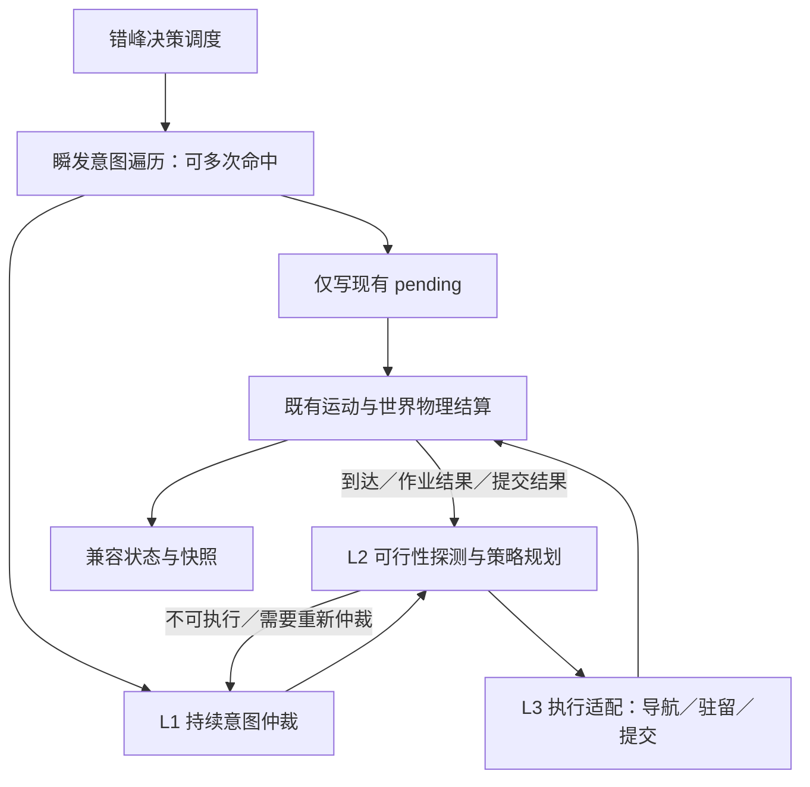

# 部落民 AI 决策架构重构规划：意图与执行策略解耦（M19）

> **状态**：规划态，尚未实施。
>
> **源码审查基准**：v1.46.6。本文规定架构边界与实施范围；[技术规格书](./19-1-spec-intent-strategy-split-result.md) 是类型、分支映射、阶段时序和验收条件的唯一详细定义，本文不重复维护 Rust 枚举。
>
> **目标**：将需求仲裁、策略选择和执行适配分离，同时保留确定性、错峰决策、真实搬运与现有世界结算规则。先完成行为等价重构，再单独评审批量规划、个性化选择等行为增强。

相关入口：[决策现状](./current/06-motivation-ai.md)、[核心 FSM](./current/24-three-core-systems-fsm.md)、[决策局部规则](../crates/sim_core/src/spatial/decisions/AGENTS.md)、[性能验证指南](./15-profiling-and-benchmarking-guide.md)。

## 1. 问题与范围

当前 `Need { level, kind, target_state }` 同时描述需求与动作，`seeking.rs`、`harvest.rs`、`market.rs` 分别处理选点、断流、返航和需求标签，修改一种兜底规则常需要检查多个入口。拆分的价值是让这些规则有明确的所有者和反馈接口，而不是删除所有跨模块调用。

现有连续采收再次调用分支评估，承担了根据最新生理、家户储备及配置顺序重新选择任务的职责；瞬发前置遍历承担了“多个瞬发与一个持续行动并行”的职责。两者都必须保留语义，只调整接口和组织方式。立宅 RNG 目前在 `fulfill_resting_need` 内消费，并非分支条件函数直接掷点。

### 1.1 M19 基础重构范围

- 保留 b1～b18 的稳定 ID、条件守卫、层级覆盖、配置顺序、选择规则与冷却语义。
- 集中同一意图内部的选点、策略失败和重路由处理。
- 显式区分瞬发提交、持续任务、物理动作和结算反馈。
- 分阶段收口状态写入，覆盖运动、生态、房屋、生命周期、存档和快照消费者。
- 记录现有行为基线，证明迁移未改变资源流、RNG 消费和行动时点。

### 1.2 后续行为增强（不混入等价重构）

- 新增跨任务抢占规则、重试冷却或长期暂停/恢复。
- 多品类预排队列、距离成本优化、基于个性或资本的策略选择。
- 新增家庭饮食路径、配偶分水等现有机制之外的策略。
- Inspector 意图／策略／动作三栏展示。

这些功能可使用本架构扩展，但必须明确行为差异、配置来源与独立验收。不能用“重构后确定性测试通过”代替行为变更审查。

## 2. 三层架构与并行瞬发通道

| 层级 | 拥有的决策 | 不拥有的决策 |
|---|---|---|
| L1 意图仲裁 | 需求是否成立、完成条件、顺序与层级、是否保持或取消当前目标、允许的抢占、失败后下一需求 | 具体 POI、路线、移动积分、资源扣账 |
| L2 策略规划 | 合法目标与可行性、同一目标的实现方式、阶段推进、同意图内重选与策略替代 | 越过 L1 新增返家任务、忽略分支守卫、直接改变资源或亲属关系 |
| L3 执行适配 | 安装导航命令、沿原车道改道、进入驻留、写 pending、转述物理结果 | 需求排序、世界资源结算、系统扫描后派发任务 |
| 世界系统 | 代谢、移动、真实采收与卸货、升级修缮、婚姻与政体等结算、生命周期 | 替 Agent 决定新的任务 |

L1 不依赖路网算法、不选择具体 POI，但可以读取由只读查询提供的“是否存在合法候选”“是否满足近距瞬发条件”等语义事实。近距求偶和在宅育儿的资格仍属于分支自包含守卫。不能为了层间纯度删除条件或让不可执行的高优先级意图永久阻塞其他需求。

瞬发通道不占用持续任务槽位，也不替换活动原语。命中后只写决心/pending，不改运动状态、不扣资源、不消费 RNG，继续检查后续瞬发分支，再执行持续任务决策。最终物理结算可改变婚姻、住宅或行动状态；这种变化来自既有结算规则，必须回写控制状态，不能与“提交不打断”混为一谈。

## 3. 持续任务生命周期

### 3.1 需求成立不等于策略可执行

L1 按配置顺序评估分支。L2 只读探测候选返回可执行、当前受阻或不适用；候选未选中前不得消费 RNG、扣款、写 pending 或安装路线。同一仲裁回合内每个分支最多尝试一次，尝试数受注册表长度限制，避免 L1/L2 无限互调。

基础重构保留原来的仲裁入口与状态保持规则，不把所有状态改为每个决策相位全量抢占。某个旧入口原本会继续分支遍历，新的不可执行反馈也继续；原本会等待、重新寻路或返家，则由 L1 的兼容政策产生相同结果。更积极的全局抢占或自动重试属于后续增强。

### 3.2 目标、策略、动作分别终止

- **动作完成**：例如到达 POI，只结束导航原语，尚未满足解渴或补货意图。
- **策略阶段完成**：例如背包装满，转入后续仲裁或返家卸货，不能当成家庭储备已达标。
- **目标满足**：由最新生理值、家户触发器、房屋/婚姻/政体事实等类型化条件判断。
- **策略失败**：同意图内可重选目标或备选手段；没有可行策略时交回 L1。
- **任务取消**：死亡、失去资格或 L1 允许的抢占。清理本任务控制字段，不删除已携带资源，不撤销已完成的账本结算。

补货可能需要多趟；不能为了“达成意图”无条件锁住 Agent 直到家户余额补满。保持原有返家、卸货与再次评估行为，任务关闭后需求仍可能再次成立。基础阶段不引入暂停任务栈；再次执行时用最新世界事实重建方案。

### 3.3 生存优先级与失败边界

普通体力不足是 L2 向 L1 提供的事实，不是统一切换为休息的命令。临界口渴/饥饿仍受既有求生守卫保护。市场准入仍检查户主身份、家户账本金余额、体力及资源品类；失败原因不豁免这些条件。

| 情形 | L2 的权限 | 需要 L1 决定的事项 |
|---|---|---|
| 单点 POI 关闭 | 在本人的触发器开放集合内重选同类点 | 无合法手段时是否等待、返家或转其他需求 |
| 水/粮/木同类点全部关闭 | 按既有资格尝试市场策略 | 市场不可达/不准入后的目标选择 |
| 石/金断流 | 按既有规则报告受阻，保留淘金用途与冷却 | 不得自行新增市场兜底 |
| 求偶/夺位目标失效 | 在原分支全部资格约束内重选 | 无目标时结束任务及下一行动 |
| 体力告警 | 报告当前策略不能继续的原因 | 结合临界求生守卫和既有入口决定下一任务 |

有房者夺位仍受自家营地限制，求偶仍使用现有合法候选与选择规则；不能用泛化的“全图最优”替代。

## 4. 连续采收

基础阶段保留动态连续采收，不引入 `Batch` 意图或预排队列。L2 在采收完成/断流的原时点请求 L1 的“连续采收仲裁入口”；该入口仍按配置顺序检查现有允许分支，包括当前源码中已有的 b1/b2 生存分支。

每次转换必须重新检查私宅有效性、家户补货触发器、自身生理、各品类独立行囊容量、POI 私有可用性与体力。金币保留无限容量、单趟采集目标和两类冷却的区别。回到家门只表示抵达，卸货仍按速率逐 tick 入家户账本。

后续若增加预排队列，队列只是可失效的候选提示：每次转阶段仍需上述仲裁；还需定义定长容量、重规划、保存恢复及取消规则，另行扩展技术规格。

## 5. 状态所有权与运行时频率

### 5.1 渐进迁移

`PrimitiveActionState` 当前被代谢、运动到达、POI 交互、房屋结算和快照共同读写，不是单纯 UI 字段。因此不在 M19.1 新增三个字段后就每 tick 覆盖 `state`。

1. **迁移期**：现有状态、路线、pending 为执行真相源；新控制记录只观察和验证，不反向驱动物理。影子路径不得调用有副作用的规划器。
2. **接管期**：逐条迁移任务，每条任务及其世界写入点全部接入同一个转换接口后才接管，旧实现只服务未迁移任务，不能双驱动。
3. **完成期**：控制器是持续任务真相源；位置/车道仍归运动系统、pending 与结算仍归世界系统。`state` 为执行兼容视图，由转换接口在实际事件时同步。投影只读、不调用导航、不清车道、不消费 RNG。

死亡和胎儿生命周期优先于任务投影；返家阶段必须投影为返家；到达/离路/结算结果不能等到下一个 120 tick 相位才同步。具体映射与合法组合见规格书。

### 5.2 决策与物理结算分频

- 决策相位使用 `agent_decision_interval_ticks`（当前默认 120），不得改 `simulationDt`。
- L1/L2 在原错峰决策入口运行；每 tick 的运动、代谢、装卸、交易、房屋结算维持既有频率。
- 原语适配不新增第二套物理步进，也不把结算移进 `decisions/`。
- 到达事件在原运动阶段更新执行视图；阶段事件反馈不能提前触发下一轮需求选择或多消耗一次 RNG。
- 写 pending 不代表当场成功，消费时必须重查资格；成功/失败结果与对应请求关联，避免重复消费。

**已识别的文档与源码差异**：根 AGENTS §4.3 的概括顺序将决策写在道路衰减/运动之前，而审查基准 `world_tick.rs::tick()` 实际先道路衰减、运动，后决策。M19 不借此调整管线；实施 M19.0 时先核实并同步现状说明，再冻结具体阶段基线。源码逐阶段清单和 pending 时点见规格 §5。

## 6. 外部契约、存档和可观测性

基础重构保持 WASM 导出签名、FABS 字段布局及枚举码位；这不自动等于新旧运行结果逐字节一致。状态/目标/需求标签及派生统计必须做行为差分，快照生产与解码的同构性另由快照门禁证明。

旧应用版本存档仍明确拒绝。新增持久化控制状态时按项目规则升级存档结构版本；不能用 `serde(default)` 默默恢复一个未知的进行中任务。新版本必须完整保存任务、策略阶段、活动原语、未消费结果及既有路线/pending/RNG/触发器，读档不能重新规划或重新掷点。当前源码 `SAVE_FORMAT_VERSION` 为 4，实施时重新核实，不采用历史说明中的 3。

Inspector 三栏属于后续展示增强；基础阶段保留 `current_need` 的来源分支和标签规则，包括瞬发标签被常规标签覆盖的原时序。新增可见字段时完成快照结构、生产者、二进制编码、JS 解码与映射全链路同步。

## 7. 里程碑与退出条件

| 阶段 | 交付 | 退出条件 |
|---|---|---|
| M19.0 基线与契约冻结 | 所有状态/pending 读写者、现有时序、分支资格/失败路径清单；修正现状文档漂移 | 固定 seed/config/tick 的差分样本、RNG 与性能基线可复现；未覆盖的分支不能进入接管 |
| M19.1 类型与观察适配 | 引入规格中的领域类型及只读执行视图，保留旧驱动 | 不新增任务选择或 RNG 消费；观察结果与现状逐项一致；若入档则完成结构版本与恢复验证 |
| M19.2 策略与执行收口 | 先资源链，再社会/房屋链；逐条移交写入权 | 每条链路的状态、物理结算、到达、失败与读档门禁通过；无双驱动 |
| M19.3 仲裁独立 | L1 统一持续任务入口、瞬发旁路与连续采收请求；清理迁移桥梁 | 全部 18 分支及重排/覆盖语义保持；全套验收通过；更新模块地图与局部 AGENTS |
| M19.4 独立增强 | 另行规格化个性化策略、预排队列、抢占增强、Inspector | 明确获接受的行为差异；不再声称相对旧版本行为等价 |

## 8. 验收原则

[规格 §8](./19-1-spec-intent-strategy-split-result.md#8-验收矩阵) 为唯一详细验收清单。

- 分别证明同版本确定性、新旧行为等价、快照同构、同版本存读档连续性，不能互相替代。
- 基础重构保留 RNG 消费顺序与既有候选并列规则；不能一律改成“距离 + ID”后仍宣称等价。
- 导航成功才安装新任务执行状态；车道上重定向沿现有车道连续处理，节点/现场出发正常 dispatch，无车道时不强制 U-turn。
- 固定枚举只约束新增控制对象不使用动态派发；不承诺现有上下文、路线和 pending 集合全部零分配。
- 内存大小用目标平台布局实测，性能以同机器同配置的配对基线判断，不采用跨机器绝对 TPS 或未经测量的缓存驻留结论。
- 临时差分脚本/断言按项目规则验证后删除，不新增持久化单元测试。
