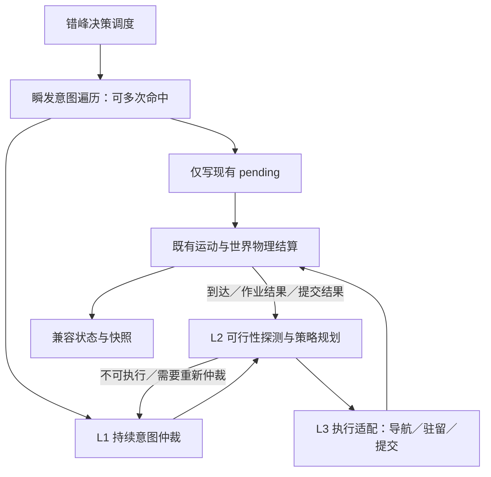

# 部落民 AI 决策架构重构规划：意图与执行策略解耦（M19）

> **状态**：**全阶段落地完成**（M19.0～M19.3 基础解耦重构于 v1.46.8 落地；M19.4a～M19.4d 独立增强于 v1.46.9～v1.46.10 落地）。
>
> **源码与落地版本**：v1.46.10。本文规定架构边界、实施范围与增强全景；[技术规格书](./19-1-spec-intent-strategy-split-result.md) 是类型、分支映射、阶段时序和验收条件的详细权威定义。
>
> **核心成果**：成功将需求仲裁（L1）、策略选择（L2）与执行适配（L3）三层解耦，以 `ActiveTask` 控制器为持续任务单一真相源；在此解耦架构之上，全面落地了 Inspector 决策行动中枢三栏看板、分级任务抢占与平滑改道、先天禀赋与家资个性化选策、多品类采收候选预排队列与 TSP 行程优化，100% 保持确定性、错峰决策与系统吞吐量。

相关入口：[决策现状](./current/06-motivation-ai.md)、[核心 FSM](./current/24-three-core-systems-fsm.md)、[决策局部规则](../crates/sim_core/src/spatial/decisions/AGENTS.md)、[性能验证指南](./15-profiling-and-benchmarking-guide.md)。

## 1. 问题与范围

当前 `Need { level, kind, target_state }` 同时描述需求与动作，`seeking.rs`、`harvest.rs`、`market.rs` 分别处理选点、断流、返航和需求标签，修改一种兜底规则常需要检查多个入口。拆分的价值是让这些规则有明确的所有者和反馈接口，而不是删除所有跨模块调用。

现有连续采收再次调用分支评估，承担了根据最新生理、家户储备及配置顺序重新选择任务的职责；瞬发前置遍历承担了“多个瞬发与一个持续行动并行”的职责。两者都必须保留语义，只调整接口和组织方式。立宅 RNG 目前在 `fulfill_resting_need` 内消费，并非分支条件函数直接掷点。

### 1.1 M19 基础重构范围

- 保留 b1～b18 的稳定 ID、条件守卫、层级覆盖、配置顺序、选择规则与冷却语义。
- 集中同一意图内部的选点、策略失败和重路由处理。
- 显式区分瞬发提交、持续任务、物理动作和结算反馈。
- 分阶段收口状态写入，覆盖运动、生态、房屋、生命周期、存档和快照消费者。
- 记录现有行为基线，证明迁移未改变资源流、RNG 消费和行动时点。

### 1.2 独立行为增强（已于 M19.4 全量落地）

在 M19.0～M19.3 基础等价重构完成并经严格差分门禁封板后，原先规划的独立行为增强已按“四个独立维度”作为 **M19.4** 全量落地，并经专门的测试矩阵独立验收：

1. **M19.4a 表现层透视 (v1.46.9)**：Inspector 呈现「🧠 决策行动中枢」三栏透视看板（🎯 意图 / 🧭 策略 / ⚡ 原语）与 ⓪ 瞬发待结微光 Pill，决策动机透明可解释；
2. **M19.4b 仲裁增强 (v1.46.9)**：分级任务抢占矩阵（`preemption.rs`），支持危机生理、暴雪断柴、危房修缮对常规任务的平滑中断与沿原车道连续掉头；
3. **M19.4c 策略增强 (v1.46.9)**：力量调节重体力装载速率与轻体力修缮偏好、智力权衡路途耗时与现货牌价、富户与平民家资阶层分化选策；
4. **M19.4d 规划增强 (v1.46.10)**：定长 4 站多品类采收候选预排队列（`harvest_queue`）与最近邻贪心 TSP 行程优化，实现单趟顺路多品类连续满载回宅。

各增强项均拥有独立验收脚本，在保持底层确定性与存读档兼容的前提下明确放飞差异化行为。

## 2. 三层架构与并行瞬发通道

| 层级 | 拥有的决策 | 不拥有的决策 |
|---|---|---|
| L1 意图仲裁 | 需求是否成立、完成条件、顺序与层级、是否保持或取消当前目标、允许的抢占、失败后下一需求 | 具体 POI、路线、移动积分、资源扣账 |
| L2 策略规划 | 合法目标与可行性、同一目标的实现方式、阶段推进、同意图内重选与策略替代 | 越过 L1 新增返家任务、忽略分支守卫、直接改变资源或亲属关系 |
| L3 执行适配 | 安装导航命令、沿原车道改道、进入驻留、写 pending、转述物理结果 | 需求排序、世界资源结算、系统扫描后派发任务 |
| 世界系统 | 代谢、移动、真实采收与卸货、升级修缮、婚姻与政体等结算、生命周期 | 替 Agent 决定新的任务 |

L1 不依赖路网算法、不选择具体 POI，但可以读取由只读查询提供的“是否存在合法候选”“是否满足近距瞬发条件”等语义事实。近距求偶和在宅育儿的资格仍属于分支自包含守卫。不能为了层间纯度删除条件或让不可执行的高优先级意图永久阻塞其他需求。

瞬发通道不占用持续任务槽位，也不替换活动原语。命中后只写决心/pending，不改运动状态、不扣资源、不消费 RNG，继续检查后续瞬发分支，再执行持续任务决策。最终物理结算可改变婚姻、住宅或行动状态；这种变化来自既有结算规则，必须回写控制状态，不能与“提交不打断”混为一谈。

## 3. 持续任务生命周期

### 3.1 需求成立不等于策略可执行

L1 按配置顺序评估分支。L2 只读探测候选返回可执行、当前受阻或不适用；候选未选中前不得消费 RNG、扣款、写 pending 或安装路线。同一仲裁回合内每个分支最多尝试一次，尝试数受注册表长度限制，避免 L1/L2 无限互调。

基础重构保留原来的仲裁入口与状态保持规则，不把所有状态改为每个决策相位全量抢占。某个旧入口原本会继续分支遍历，新的不可执行反馈也继续；原本会等待、重新寻路或返家，则由 L1 的兼容政策产生相同结果。更积极的全局抢占或自动重试属于后续增强。

### 3.2 目标、策略、动作分别终止

- **动作完成**：例如到达 POI，只结束导航原语，尚未满足解渴或补货意图。
- **策略阶段完成**：例如背包装满，转入后续仲裁或返家卸货，不能当成家庭储备已达标。
- **目标满足**：由最新生理值、家户触发器、房屋/婚姻/政体事实等类型化条件判断。
- **策略失败**：同意图内可重选目标或备选手段；没有可行策略时交回 L1。
- **任务取消**：死亡、失去资格或 L1 允许的抢占。清理本任务控制字段，不删除已携带资源，不撤销已完成的账本结算。

补货可能需要多趟；不能为了“达成意图”无条件锁住 Agent 直到家户余额补满。保持原有返家、卸货与再次评估行为，任务关闭后需求仍可能再次成立。基础阶段不引入暂停任务栈；再次执行时用最新世界事实重建方案。

### 3.3 生存优先级与失败边界

普通体力不足是 L2 向 L1 提供的事实，不是统一切换为休息的命令。临界口渴/饥饿仍受既有求生守卫保护。市场准入仍检查户主身份、家户账本金余额、体力及资源品类；失败原因不豁免这些条件。

| 情形 | L2 的权限 | 需要 L1 决定的事项 |
|---|---|---|
| 单点 POI 关闭 | 在本人的触发器开放集合内重选同类点 | 无合法手段时是否等待、返家或转其他需求 |
| 水/粮/木同类点全部关闭 | 按既有资格尝试市场策略 | 市场不可达/不准入后的目标选择 |
| 石/金断流 | 按既有规则报告受阻，保留淘金用途与冷却 | 不得自行新增市场兜底 |
| 求偶/夺位目标失效 | 在原分支全部资格约束内重选 | 无目标时结束任务及下一行动 |
| 体力告警 | 报告当前策略不能继续的原因 | 结合临界求生守卫和既有入口决定下一任务 |

有房者夺位仍受自家营地限制，求偶仍使用现有合法候选与选择规则；不能用泛化的“全图最优”替代。

## 4. 连续采收

基础阶段保留动态连续采收，不引入 `Batch` 意图或预排队列。L2 在采收完成/断流的原时点请求 L1 的“连续采收仲裁入口”；该入口仍按配置顺序检查现有允许分支，包括当前源码中已有的 b1/b2 生存分支。

每次转换必须重新检查私宅有效性、家户补货触发器、自身生理、各品类独立行囊容量、POI 私有可用性与体力。金币保留无限容量、单趟采集目标和两类冷却的区别。回到家门只表示抵达，卸货仍按速率逐 tick 入家户账本。

> **★ M19.4d 规划增强落地（v1.46.10）**：
> 在保留 L1 动态连续采收仲裁的基础上，已正式引入定长 4 站预排队列 `Agent3D::harvest_queue: [Option<BranchId>; 4]`（零堆分配、`#[serde(default)]` 兼容读旧档）与 `harvest.rs::plan_harvest_itinerary` 最近邻贪心 TSP 启发式链路优化。
> 出发时规划最优顺路站点，采满现场转站优先消费预排队列，候选失效自动跳过并回退 `branch_order` 兜底。
> 预排行程微光条透传至 Inspector，全套行为由 `tools/test-itinerary.js` 验证通过。

## 5. 状态所有权与运行时频率

### 5.1 渐进迁移

`PrimitiveActionState` 当前被代谢、运动到达、POI 交互、房屋结算和快照共同读写，不是单纯 UI 字段。因此不在 M19.1 新增三个字段后就每 tick 覆盖 `state`。

1. **迁移期**：现有状态、路线、pending 为执行真相源；新控制记录只观察和验证，不反向驱动物理。影子路径不得调用有副作用的规划器。
2. **接管期**：逐条迁移任务，每条任务及其世界写入点全部接入同一个转换接口后才接管，旧实现只服务未迁移任务，不能双驱动。
3. **完成期**：控制器是持续任务真相源；位置/车道仍归运动系统、pending 与结算仍归世界系统。`state` 为执行兼容视图，由转换接口在实际事件时同步。投影只读、不调用导航、不清车道、不消费 RNG。

死亡和胎儿生命周期优先于任务投影；返家阶段必须投影为返家；到达/离路/结算结果不能等到下一个 120 tick 相位才同步。具体映射与合法组合见规格书。

### 5.2 决策与物理结算分频

- 决策相位使用 `agent_decision_interval_ticks`（当前默认 120），不得改 `simulationDt`。
- L1/L2 在原错峰决策入口运行；每 tick 的运动、代谢、装卸、交易、房屋结算维持既有频率。
- 原语适配不新增第二套物理步进，也不把结算移进 `decisions/`。
- 到达事件在原运动阶段更新执行视图；阶段事件反馈不能提前触发下一轮需求选择或多消耗一次 RNG。
- 写 pending 不代表当场成功，消费时必须重查资格；成功/失败结果与对应请求关联，避免重复消费。

**已识别的文档与源码差异**：根 AGENTS §4.3 的概括顺序将决策写在道路衰减/运动之前，而审查基准 `world_tick.rs::tick()` 实际先道路衰减、运动，后决策。M19 不借此调整管线；实施 M19.0 时先核实并同步现状说明，再冻结具体阶段基线。源码逐阶段清单和 pending 时点见规格 §5。

## 6. 外部契约、存档和可观测性

基础重构保持 WASM 导出签名、FABS 字段布局及枚举码位；这不自动等于新旧运行结果逐字节一致。状态/目标/需求标签及派生统计必须做行为差分，快照生产与解码的同构性另由快照门禁证明。

旧应用版本存档仍明确拒绝。新增持久化控制状态时按项目规则升级存档结构版本；不能用 `serde(default)` 默默恢复一个未知的进行中任务。新版本必须完整保存任务、策略阶段、活动原语、未消费结果及既有路线/pending/RNG/触发器，读档不能重新规划或重新掷点。当前源码 `SAVE_FORMAT_VERSION` 为 4，实施时重新核实，不采用历史说明中的 3。

Inspector 三栏属于后续展示增强；基础阶段保留 `current_need` 的来源分支和标签规则，包括瞬发标签被常规标签覆盖的原时序。新增可见字段时完成快照结构、生产者、二进制编码、JS 解码与映射全链路同步。

## 7. 里程碑与退出条件

| 阶段 | 交付 | 退出条件 | 状态 |
|---|---|---|---|
| **M19.0 基线与契约冻结** | 所有状态/pending 读写者、现有时序、分支资格/失败路径清单；修正现状文档漂移 | 固定 seed/config/tick 的差分样本、RNG 与性能基线可复现（见 `tools/baseline-m19-observation.json` 与 `archive/19-m19-baseline-audit.md`） | ✅ **已完成** (v1.46.8，87,631 TPS 基线与 239 项断言已冻结) |
| **M19.1 类型与观察适配** | 引入规格中的领域类型及只读执行视图，保留旧驱动 | 不新增任务选择或 RNG 消费；观察结果与现状逐项一致；零内存分配；门禁 `test-m19-differential.js` 全通 | ✅ **已完成** (v1.46.8，`crates/sim_core/src/spatial/decisions/{intent,strategy,primitive,observation}.rs`) |
| **M19.2 策略与执行收口** | 先资源链，再社会/房屋链；逐条移交写入权 | 每条链路的状态、物理结算、到达、失败与读档门禁通过；无双驱动 | ✅ **已完成** (v1.46.8，`ActiveTask` 控制器、`transition.rs`、`projection.rs`、SAVE_FORMAT_VERSION 5) |
| **M19.3 仲裁独立** | L1 统一持续任务入口、瞬发旁路与连续采收接口，清理迁移代码 | 全部 18 分支及重排/覆盖语义保持；全套验收通过；更新模块地图与局部 AGENTS | ✅ **已完成** (v1.46.8，L1 仲裁/瞬发/连续采收解耦，L2 策略与 L3 原语派发，全门禁通过) |
| **M19.4 独立增强** | 系统落地表现层看板、分级任务抢占、禀赋与财富个性化、多品类采收预排队列与行程优化 | 独立验证矩阵全通：M19.4a 表现层透视 (v1.46.9)、M19.4b 抢占矩阵 (v1.46.9)、M19.4c 禀赋与财富个性化 (v1.46.9)、M19.4d 预排队列与 TSP 行程优化 (v1.46.10) | ✅ **已完成** (v1.46.9 ~ v1.46.10，`test-preemption` / `test-personalization` / `test-itinerary` 矩阵 100% 通过) |

## 8. 验收原则

[规格 §8](./19-1-spec-intent-strategy-split-result.md#8-验收矩阵) 为唯一详细验收清单。

- 分别证明同版本确定性、新旧行为等价、快照同构、同版本存读档连续性，不能互相替代。
- 基础重构保留 RNG 消费顺序与既有候选并列规则；不能一律改成“距离 + ID”后仍宣称等价。
- 导航成功才安装新任务执行状态；车道上重定向沿现有车道连续处理，节点/现场出发正常 dispatch，无车道时不强制 U-turn。
- 固定枚举只约束新增控制对象不使用动态派发；不承诺现有上下文、路线和 pending 集合全部零分配。
- 内存大小用目标平台布局实测，性能以同机器同配置的配对基线判断，不采用跨机器绝对 TPS 或未经测量的缓存驻留结论。
- 临时差分脚本/断言按项目规则验证后删除，不新增持久化单元测试。

---

## 9. M19.4 独立增强落地全景（v1.46.9 ~ v1.46.10）

在 M19.0～M19.3 完成三层解耦并以 `ActiveTask` 控制器为单一真相源收口后，M19.4 独立增强按四大维度系统落地，彻底打破了传统单体决策的黑盒与刻板行为。

### 9.1 表现层透视：决策行动中枢三栏看板与动机可解释性 (M19.4a, v1.46.9)
- **三栏看板布局**：在 Inspector 角色卡片顶部重构「🧠 决策行动中枢」自适应卡片：
  - **🎯 意图 (Intent)**：来源分支（b1～b18）、马斯洛需求层级（⓪瞬发～④自我实现）、完成判据（`PantryFull` / `ResourceSatiated` / `DurabilityRestored` 等）；
  - **🧭 策略 (Strategy)**：策略模式（野外采收 / 榷场采买 / 房屋修缮 / 归宿休养等）、目标实体（POI / 私宅 / 营地）、在途推进阶段（`Outbound` / `OnsiteWork` / `Inbound` / `Settling`）；
  - **⚡ 原语 (Primitive)**：当前底层动作（沿路导航 / 现场驻留 / 提交结算）、当前所在车道 ID 与距离目标米数。
- **⓪ 瞬发高亮微光 Pill**：当发生加冕结算（`coronation_pending`）、门前受孕（`raise_child_pending`）、就近求偶（`courtship_pending`）、房屋竞拍（`pending_bids`）或立宅选址（`pending_house_pos`）时，以动态微光胶囊呈现在中枢顶栏。
- **快照全链路同构 (M4)**：`AgentSnapshot` 扩充 `active_task: Option<ActiveTaskSnapshot>`，经 `snapshot.rs`、`world_snapshot.rs`、`snapshot_bin/encode.rs`（小端紧凑字节与驻留表 intern）、`snapshot-bin.js` 与 `rustworld.js` 严格四处同步，零性能衰退。

### 9.2 仲裁增强：分级任务抢占机制 (M19.4b, v1.46.9)
- **抢占矩阵 (Preemption Matrix)**：在 `crates/sim_core/src/spatial/decisions/preemption.rs` 建立分级裁决规则，消除旧体系“非临界不可打断”的死板行为：
  - **娱乐淘金 (`GoldWealth`)**：可被任何生理需求（饱食/饮水/休养）、安全补料、私宅修缮与远征登基立即抢占；
  - **建材采收 (`StockStone` / `StockWood`)**：可被临界饥渴、冬季暴雪断柴（木材 < 10）与危房耐久告警（耐久 < 20%）紧急抢占；
  - **远征登基 (`SeekThrone`)**：仅受濒死饥渴危象抢占；
  - **施工修缮 (`ConstructUpgrade` / `RepairHouse`)**：受求生与王位空缺加冕抢占（施工进度在房屋实体冻结保全，不回滚）。
- **平滑改道与行囊保全**：抢占时由 `transition::preempt_task` 统一调度，沿原车道连续反向掉头（U-turn），严禁瞬间瞬移；保全已有采获行囊，平滑过渡至新目标。
- **验收工具**：`node tools/test-preemption.js`（5/5 场景全通：淘金被饥渴打断、伐木被断柴打断、修缮被登基打断、原车道掉头连续性、长程确定性一致）。

### 9.3 策略增强：先天禀赋与家资个性化选策 (M19.4c, v1.46.9)
- **力量 (Strength) 驱动**：
  - 高力量族人（力量 ≥ 110）：野外重体力采收与伐木采石装载速率提升 +25%（见 `ecology/`）；
  - 低力量族人（力量 ≤ 90）：装载速率惩罚 -15%，倾向轻体力活动与家政留守（房屋耐久低于 90% 即主动修缮，常规族人为 80%）。
- **智力 (Intelligence) 驱动**：
  - 高智力族人（智力 ≥ 110）：具备市场牌价感知能力，综合权衡「路途耗时 vs 榷场现货牌价」，野外过远或市场更近时直接赴榷场交易；
  - 寻路偏好高等级成熟通衢主干道，主动规避低限速泥泞小径。
- **家户财富阶层分化 (Household Capital)**：
  - **豪绅家户**（家户金币 ≥ `market_wealthy_family_gold` 默认 200）：户主面临家庭物资缺口时，80% 几率直接赴榷场现货采购，免于亲自采矿伐木；
  - **平民家户**（金币不足）：保持自力更生，亲赴荒野开采。
- **验收工具**：`node tools/test-personalization.js`（5/5 场景全通：力量装载速率加成、低力量家政早修、智力商贸权衡、豪绅市场代采、长程数值稳定性）。

### 9.4 规划增强：多品类采收候选预排队列与行程优化 (M19.4d, v1.46.10)
- **定长 4 站预排队列**：`Agent3D` 新增 `pub harvest_queue: [Option<BranchId>; 4]`（零堆分配、`#[serde(default)]` 向后兼容读旧档），提供 `pop_harvest_queue()`（FIFO 平移）与 `clear_harvest_queue()`。
- **TSP 最近邻链路优化器**：`harvest.rs::plan_harvest_itinerary` 基于当前位置，检索家户短缺品类（水/粮/木/石/金），通过最近邻贪心算法（Nearest Neighbor TSP Heuristic）计算总路程最短的 1~4 站顺路链路（如 `💧备水 → 🌲备木 → 🍒备粮`）。
- **执行与容错生命周期**：
  - 连续采收 `try_continue_harvesting` 改为优先消费队列，逐站由 `arbitrate_continuous_harvest_candidate` 重验资格；
  - 候选项失效（如中途断流或家人已采满）时自动跳过并尝试下一站，队列耗尽回退 `branch_order` 兜底；
  - 任务抢占、回宅卸货、体力耗尽（< 15%）与死亡时规范清空队列，防止跨任务串味。
- **可观测性透传**：`ActiveTaskSnapshot` 新增 `itinerary` 字段，同步下发并在 Inspector 呈现 `🗺️ 预排行程` 微光条。
- **验收工具**：`node tools/test-itinerary.js`（5/5 场景全通：链路生成、TSP 最近邻排序、满载转站、体力告警安全折返、多种子长程重放逐字节一致）。
