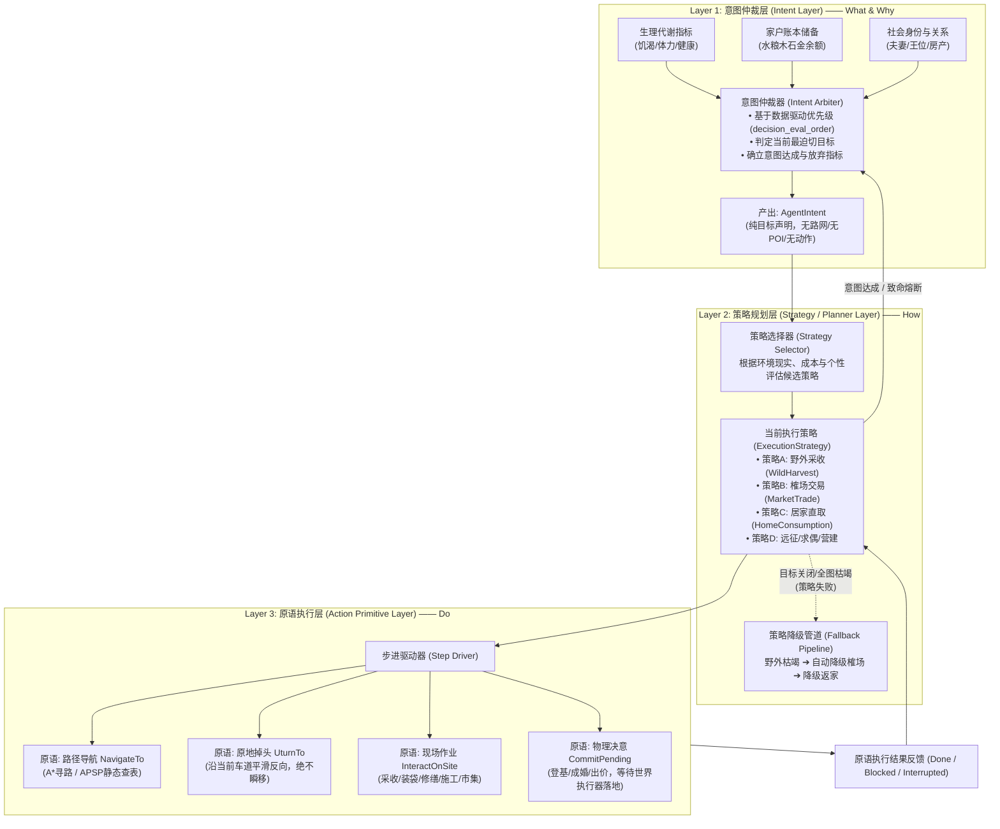
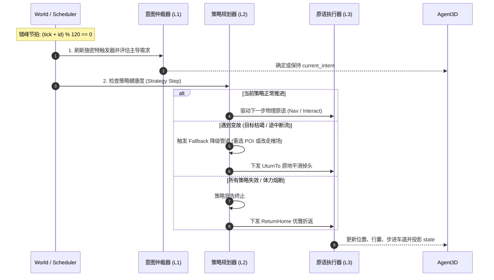
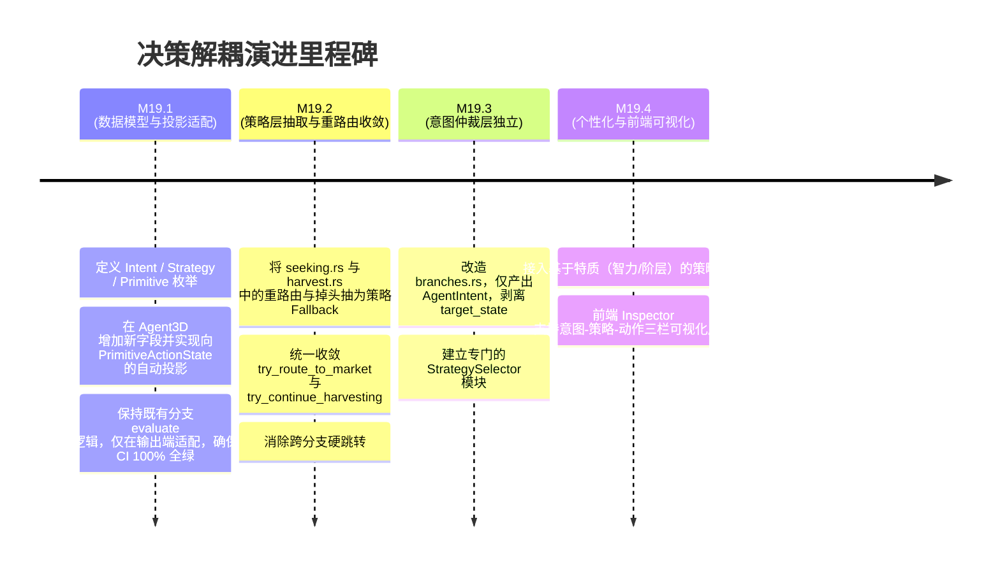

# 🧠 部落民 AI 决策架构重构规划：意图与执行策略解耦 (Intent-Strategy Decoupling Plan)

> **状态**：**规划态 / 核心架构设计稿 (M19)**
>
> **定位**：阐明如何将《Flow & Accord》部落民现行的“马斯洛需求-状态机强耦合”模型，重构解耦为“**意图仲裁层 (Intent) — 策略规划层 (Strategy) — 原语执行层 (Primitive)**”三层架构。在严格保持内核**强确定性（Determinism）、零堆分配极速吞吐（Zero Allocations）与 120 Tick 错峰节拍**的前提下，彻底消除途中打补丁与逻辑扩散，赋能多策略涌现与个性化社会行为。
>
> **版本基准**：v1.46.5 · **主要源码关联**：`crates/sim_core/src/spatial/decisions/`、`crates/sim_core/src/spatial/agent.rs`
>
> **关联文档**：
> - [19-1-spec-intent-strategy-split-result.md](./19-1-spec-intent-strategy-split-result.md) (详细技术规格书与预期拆分结果清单)
> - [06-motivation-ai.md](./current/06-motivation-ai.md) (当前马斯洛决策状态机现状)
> - [24-three-core-systems-fsm.md](./current/24-three-core-systems-fsm.md) (三大核心系统状态机全景)
> - [07-agent-ai-analysis.md](./07-agent-ai-analysis.md) (部落民 AI 深度拆解)
> - [16-plan-performance-optimization.md](./16-plan-performance-optimization.md) (内核性能优化规划)

---

## 1. 现状痛点与重构动机

当前 `decisions/` 模块在经过 M1~M4 账本革命、断流赴榷场、夺位远征及单趟多品类采收等多次机制演进后，暴露出深层次的**结构性耦合**：

```
【当前架构】：
[马斯洛分支评估] ──直接产出──> Need { target_state: PrimitiveActionState::SeekingWater }
                                            │
                                            ▼ (强耦合：意图即物理动作)
[途中遇变故/断流] ──局部打补丁──> seeking.rs::try_route_to_market (强行覆写 state = SeekingMarket)
                                            │
                                            ▼ (跳板穿透：采收现场重新迭代分支)
[采收完成连环转] ──现场侵入──> harvest.rs::try_continue_harvesting (强行重新 dispatch)
```

### 1.1 核心结构痛点

1. **“意图（What & Why）”与“物理动作（How & Do）”强绑定**：
   - 现有 `BranchId::evaluate()` 命中时，直接产出 `Need { kind, target_state }`，把“想要满足口渴”与“迈开双腿奔向水泉”一步定死。
   - 实际上，“口渴”是**意图（Intent）**；“去水泉采水”、“去榷场买水”、“在私宅喝家庭账本存水”或“让配偶分水”是**策略（Strategy）**；而“寻路走车道”、“掉头”、“现场饮水”才是**执行原语（Action Primitive）**。
2. **异常响应与降级逻辑碎片化（打补丁式蔓延）**：
   - 当资源点枯竭或施密特触发器关闭时，重路由逻辑散落在 `seeking.rs`（`decide_seeking_material`、`decide_seeking_survival`、`decide_seeking_throne`、`decide_seeking_courtship`）和 `harvest.rs` 中，到处存在相似又微异的掉头与状态重置逻辑。
   - “断流改赴榷场”逻辑被硬编码在 `seeking.rs` 和 `harvest.rs` 的各处局部分支中，违背“单一权责”原则。
3. **复合任务与连续规划脆弱**：
   - v1.35.0 的“单趟多品类连续采收”目前是在 `harvest.rs` 采收完毕瞬间，强行迭代 `branch_order` 寻找下一个满足条件的采收分支并立即 `dispatch`。由于缺乏策略级流水线（Pipeline），任务无法中途暂停、无法做跨品类容量统筹，容易在边缘条件下产生预期外状态。
4. **社会个性与多策略演化受限**：
   - 在现有体系下，所有族人面对同一种需求只能走完全相同的执行路径。无法实现“富商优先赴市采购、农夫倾向野外采集”、“高智力族人优先规划最短环路”、“勇者冒险涉远、懦者就近求全”等基于基因（智力/力量/资本）的个性化策略选择。

---

## 2. 全新三层解耦架构模型

新架构将部落民的认知与行动划分为正交的三层：



### 2.1 各层职责与边界契约

| 层级 | 名称 | 核心关注点 | 输入 | 输出 | 关键不变量与禁忌 |
| :--- | :--- | :--- | :--- | :--- | :--- |
| **Layer 1** | **意图仲裁层**<br/>(Intent) | **What & Why**<br/>（我想要什么、为什么想要、何时满足） | 自身生理、家户账本、亲族关系、社会地位 | `AgentIntent` | **绝对禁止触碰空间路网与 POI**。不关心目标在何处、不关心怎么去。 |
| **Layer 2** | **策略规划层**<br/>(Strategy) | **How**<br/>（我通过什么方案达成目标、遇阻如何降级） | `AgentIntent`、环境 POI 施密特可用性、市场价格、随身行囊 | `ExecutionStrategy` 及阶段状态 | **负责弹性应变**。单点受阻时在策略内重选；整体受阻时降级备选策略。 |
| **Layer 3** | **原语执行层**<br/>(Primitive) | **Do**<br/>（当前物理微步与运动学状态） | 目标车道、速度、交互计时器、待结标记 | 动力学运动、现场交互吞吐、`CommitPending` | **绝对保证物理连续性**。掉头必走原车道平滑回走，静止必须清车道；严禁跨层篡改意图。 |

---

## 3. 核心数据模型设计 (Rust Data-Oriented Design)

> 遵循零堆分配原则：全部采用定长栈枚举与结构体，零动态 `Box<dyn Any>` 分配，保证 10 万级 TPS 满载吞吐。

### 3.1 Layer 1: 意图层数据结构

```rust
use crate::spatial::house::HouseTier;
use crate::spatial::ledger::journal::ResourceKind;

/// 意图类别：仅表达纯粹目标与诉求，不含任何执行手段
#[derive(Debug, Clone, Copy, PartialEq, Eq)]
pub enum IntentKind {
    /// 生理生存自救 (水 / 食物)
    SatisfySurvival(SurvivalResource),
    /// 为家户账本补充物资储备 (水/粮/木/石/金)
    StockHousehold(ResourceKind),
    /// 营建/晋升私宅至目标等级
    UpgradeHome { target_tier: HouseTier },
    /// 修缮私宅耐久度至 100%
    RepairHome,
    /// 成年自立门户，选址创立新仓库
    FoundNewHome,
    /// 寻找配偶成婚
    SeekCourtship,
    /// 养育小孩并促成配偶受孕
    RaiseChild,
    /// 参与二手在售房屋拍卖出价
    BidAuctionHouse,
    /// 远征争夺无主营地王位
    ClaimThrone,
    /// 疲劳归巢休养生息
    RestAndRecover,
}

#[derive(Debug, Clone, Copy, PartialEq, Eq)]
pub enum SurvivalResource {
    Water,
    Food,
}

/// 意图实例：挂载于 Agent 实体上
#[derive(Debug, Clone, Copy, PartialEq)]
pub struct AgentIntent {
    pub kind: IntentKind,
    pub level: MaslowLevel,          // 马斯洛层级（⓪瞬发 或 ①~⑤）
    pub satisfy_threshold: f32,     // 意图达成目标（如渴度恢复至 45.0，或搬回 50 木材）
    pub critical_abort_stamina: f32,// 体力下限熔断阈值（低于此值立即放弃当前意图转入休息）
}
```

### 3.2 Layer 2: 策略规划层数据结构

```rust
use super::super::graph::NodeId;
use super::super::poi::PoiId;

/// 执行策略：达成意图的具体方案
#[derive(Debug, Clone, Copy, PartialEq)]
pub enum ExecutionStrategy {
    /// 策略 1：野外 POI 采收与回搬
    WildHarvest {
        pool: NodePool,
        target_poi_id: Option<PoiId>,
        stage: HarvestStage,
    },
    /// 策略 2：榷场商贸远程换购
    MarketTrade {
        resource: ResourceKind,
        target_market_node: NodeId,
        stage: TradeStage,
    },
    /// 策略 3：居家直取消耗（若已在家门口，直接从家户账本结算，免跑图）
    HomeDirectConsume {
        resource: SurvivalResource,
    },
    /// 策略 4：定向奔赴与提交（夺位远征、求偶追赶、返家育儿）
    ExpeditionCommit {
        target_node: NodeId,
        commit_type: PendingCommitKind,
    },
    /// 策略 5：选址与安家营建
    SurveyAndSettle {
        candidate_pos: Vec3,
        target_node: NodeId,
    },
    /// 策略 6：原地静止施工作业（修缮、升级）
    StationaryWork {
        work_type: StationaryWorkKind,
    },
    /// 策略 7：返家归巢
    ReturnHome {
        target_door_node: NodeId,
    },
}

#[derive(Debug, Clone, Copy, PartialEq, Eq)]
pub enum HarvestStage {
    NavigatingToPoi,      // 奔赴资源点
    HarvestingOnSite,     // 现场采收
    ReturningHomeToUnload,// 返家卸货入账
}

#[derive(Debug, Clone, Copy, PartialEq, Eq)]
pub enum TradeStage {
    NavigatingToMarket,   // 奔赴榷场
    TradingOnSite,        // 现场交易与结算
    ReturningHomeToUnload,// 返家
}

/// 策略执行状态与失败诊断
#[derive(Debug, Clone, Copy, PartialEq, Eq)]
pub enum StrategyStatus {
    Running,
    Completed,
    Failed(StrategyFailureReason),
}

#[derive(Debug, Clone, Copy, PartialEq, Eq)]
pub enum StrategyFailureReason {
    TargetPoiDepleted,      // 目标 POI 被施密特触发器关闭
    AllPoiExhausted,        // 全图同类 POI 全部断流
    InsufficientFunds,      // 家户金币不足以支付市场采购
    TargetUnavailable,      // 目标女性已婚 / 王位已被抢占
    StaminaExhausted,       // 体力告警熔断
}
```

### 3.3 Layer 3: 原语执行层数据结构

```rust
/// 原子动作原语：驱动物理、动力学与微步结算的最小单元
#[derive(Debug, Clone, Copy, PartialEq)]
pub enum ActionPrimitive {
    /// 1. 沿路网奔向目标节点
    NavigateTo {
        target_node: NodeId,
        arrival_radius: f32,
    },
    /// 2. 原地掉头沿原车道反向平滑往回走（严格杜绝坐标闪现）
    UturnTo {
        target_node: NodeId,
    },
    /// 3. 现场作业与资源交互
    InteractOnSite {
        poi_id: PoiId,
    },
    /// 4. 驻留静止劳作（清空车道，停在原地）
    StationaryHold,
    /// 5. 提交结算决意（当 tick 写入 pending，等待 world 执行器原子物理落地）
    CommitPending(PendingCommitKind),
}

#[derive(Debug, Clone, Copy, PartialEq, Eq)]
pub enum PendingCommitKind {
    Coronation { camp_id: u32 },
    Courtship { target_female_id: AgentId },
    RaiseChild,
    AuctionBids,
    FoundHomeSite { site_pos: Vec3 },
}
```

### 3.4 实体字段升级与快照向下兼容映射

在 `Agent3D` 中引入新字段，同时**保留 `state: PrimitiveActionState` 作为对外投影值**，实现对 Canvas 渲染管线、FABS 二进制快照编码器以及前端 Inspector 的**零破坏兼容**：

```rust
pub struct Agent3D {
    // ... 既有生理、账本、路网循迹、遗传基因等字段保持不变 ...

    // ===== 新解耦架构状态机 =====
    /// 【意图层】当前追求的目标（None 表示无特定任务，处于怠速休养）
    pub current_intent: Option<AgentIntent>,
    /// 【策略层】当前采用的实现策略及其阶段
    pub current_strategy: Option<ExecutionStrategy>,
    /// 【原语层】当前正在执行的物理原语
    pub active_primitive: ActionPrimitive,

    // ===== 向下兼容投影字段 =====
    /// 对外依然投递此枚举，由 active_primitive + current_strategy 自动派生投影！
    pub state: PrimitiveActionState,
}
```

#### 投影映射方程 (`project_to_primitive_action_state`)

```rust
impl Agent3D {
    /// 将内部细粒度策略与原语，确定性投影为外部契约状态
    pub fn update_projected_state(&mut self) {
        self.state = match self.active_primitive {
            ActionPrimitive::NavigateTo { .. } | ActionPrimitive::UturnTo { .. } => {
                match self.current_strategy {
                    Some(ExecutionStrategy::WildHarvest { pool, .. }) => match pool {
                        NodePool::Water => PrimitiveActionState::SeekingWater,
                        NodePool::Food => PrimitiveActionState::SeekingFood,
                        NodePool::Wood => PrimitiveActionState::SeekingWood,
                        NodePool::Stone => PrimitiveActionState::SeekingStone,
                        NodePool::Gold => PrimitiveActionState::SeekingGold,
                    },
                    Some(ExecutionStrategy::MarketTrade { .. }) => PrimitiveActionState::SeekingMarket,
                    Some(ExecutionStrategy::ExpeditionCommit { commit_type, .. }) => match commit_type {
                        PendingCommitKind::Coronation { .. } => PrimitiveActionState::SeekingThrone,
                        PendingCommitKind::Courtship { .. } => PrimitiveActionState::SeekingCourtship,
                        PendingCommitKind::RaiseChild => PrimitiveActionState::RaiseChild,
                        _ => PrimitiveActionState::RestingAtCamp,
                    },
                    Some(ExecutionStrategy::ReturnHome { .. }) => PrimitiveActionState::ReturningToCamp,
                    _ => PrimitiveActionState::RestingAtCamp,
                }
            }
            ActionPrimitive::InteractOnSite { poi_id: _ } => {
                // 根据当前策略投射为现场作业态
                match self.current_strategy {
                    Some(ExecutionStrategy::WildHarvest { pool, .. }) => match pool {
                        NodePool::Water => PrimitiveActionState::DrinkingAtWater,
                        NodePool::Food => PrimitiveActionState::ForagingFood,
                        NodePool::Wood => PrimitiveActionState::GatheringWood,
                        NodePool::Stone => PrimitiveActionState::MiningStone,
                        NodePool::Gold => PrimitiveActionState::MiningGold,
                    },
                    Some(ExecutionStrategy::MarketTrade { .. }) => PrimitiveActionState::BuyingAtMarket,
                    _ => PrimitiveActionState::RestingAtCamp,
                }
            }
            ActionPrimitive::StationaryHold => {
                match self.current_strategy {
                    Some(ExecutionStrategy::StationaryWork { work_type }) => match work_type {
                        StationaryWorkKind::Repair => PrimitiveActionState::RepairingHouse,
                        StationaryWorkKind::Construct => PrimitiveActionState::ConstructingHouse,
                    },
                    _ => PrimitiveActionState::RestingAtCamp,
                }
            }
            ActionPrimitive::CommitPending(..) => PrimitiveActionState::RestingAtCamp,
        };
    }
}
```

---

## 4. 运行时生命周期与降级流水线 (Fallback Pipeline)

### 4.1 错峰决策主干流转



### 4.2 核心策略回退表 (Fallback Matrix)

不再在代码各处穿插 `if market ...` 补丁，策略规划器统一根据下表进行**确定性策略路由与降级**：

| 意图 (`IntentKind`) | 首选策略 (`Primary`) | 失败触发条件 | 降级策略 (`Fallback 1`) | 次级降级 (`Fallback 2`) | 最终保底 (`Abort`) |
| :--- | :--- | :--- | :--- | :--- | :--- |
| **`SatisfySurvival(Water)`** | `WildHarvest(Water)` (就近水泉) | 目标单点枯竭 | 切换至下一处可用水泉继续采水 | 全图水泉断流 ➔ 户主且有金 ➔ `MarketTrade(Water)` | 强制返家休息，等待天降甘霖 |
| **`SatisfySurvival(Food)`** | `HomeDirectConsume` (若在宅门口且粮仓充足) | 粮仓见底或离家过远 | `WildHarvest(Food)` (就近果丛) | 全图果丛断流 ➔ 户主且有金 ➔ `MarketTrade(Food)` | 强制返家休息 |
| **`StockHousehold(Wood)`** | `WildHarvest(Wood)` | 全图林木枯竭 | 户主且账本金币达标 ➔ `MarketTrade(Wood)` | — | 立即停止采伐，返家卸载已有物资 |
| **`SeekCourtship`** | `ExpeditionCommit(Courtship)` (奔赴目标) | 目标女性中途成婚/身故 | 重选全图下一位魅力最高单身女性 | 全图无可用合格单身女性 | 清除求偶意图，返回归宿营地 |
| **`ClaimThrone`** | `ExpeditionCommit(Coronation)` (远征) | 目标营地中途易主 | 原地掉头改赴下一个空缺王位营地 | 全图无任何可夺位营地 | 放弃出征，平滑返家恢复常规生活 |

---

## 5. 关键用例推演与架构重构收益

### 5.1 场景 A：口渴寻水遇干涸，改道榷场

* **旧架构现状**：
  在 `seeking.rs` 的 `decide_seeking_survival` 中，检测到无可用水泉后，调用 `try_route_to_market`；该函数不仅判定资格、还直接改写 `agent.state = PrimitiveActionState::SeekingMarket` 并执行寻路。如果又没钱，又在当前方法里塞回 `ReturningToCamp`。**寻路、业务状态、商业逻辑、生理判定死缠在一起**。
* **新架构表现**：
  1. **意图层**：维持 `AgentIntent { kind: SatisfySurvival(Water) }` 不动；
  2. **策略层**：
     - 原语层上报目标水泉关闭（`TargetPoiDepleted`）；
     - 策略器检测全图水泉可用节点为空（`AllPoiExhausted`）；
     - 策略器查询降级管道：切换为 `ExecutionStrategy::MarketTrade(Water)`；
  3. **原语层**：策略器指令原语层下达 `ActionPrimitive::UturnTo(MarketNode)`，原地平滑掉头奔向榷场；
  4. **收益**：意图清晰纯粹，策略状态切换由规则表驱动，彻底消灭孤岛跳转代码。

### 5.2 场景 B：单趟多品类连续采收流水线 (Multi-Harvest Pipeline)

* **旧架构现状**：
  v1.35.0 的 `try_continue_harvesting` 是在现场采收完毕后，强行跨函数调用 `branch.evaluate()` 尝试找下一个可采分支。如果命中，直接在局部 `dispatch` 出去。
* **新架构表现**：
  1. **意图层**：意图仲裁器支持组合意图 `IntentKind::StockHousehold(Batch([Wood, Food]))`；
  2. **策略层**：规划为复合流水线策略 `ExecutionStrategy::PipelineHarvest`，持有待采品类队列；
  3. **执行流**：
     - 伐木完成 ➔ 策略自驱动：行囊未满、体力充足 ➔ 自动装配下一任务（采摘果丛）；
     - 下达 `ActionPrimitive::NavigateTo(BerryNode)`；
     - 全部品类装满或体力跌破安全线 ➔ 统一流转至 `ReturnHomeToUnload`；
  4. **收益**：彻底消除跨分支穿透调用，多品类采收具备完备的流水线生命周期。

### 5.3 场景 C：社会行为个性化涌现（基于特质的分流）

在旧架构中，所有族人的分支与执行逻辑整齐划一。在新架构下，**同样的意图可以根据族人禀赋选择不同策略**：

```rust
impl StrategySelector {
    pub fn select_survival_food_strategy(agent: &Agent3D, ctx: &DecisionContext) -> ExecutionStrategy {
        let is_wealthy = agent.is_household_head && agent.family_gold >= 100.0;
        let is_intelligent = agent.intelligence > 115.0;

        // 特质 1：富裕户主且智力高者，不愿亲自涉险采摘，优先赴榷场购买
        if is_wealthy && is_intelligent && ctx.market_has_food() {
            return ExecutionStrategy::MarketTrade { resource: ResourceKind::Food, ... };
        }

        // 特质 2：普通族人优先就近野外采收
        ExecutionStrategy::WildHarvest { pool: NodePool::Food, ... }
    }
}
```
* **收益**：无缝支持部落社会的“社会阶层分化”与“职业倾向涌现”。

---

## 6. 前端表现层升级：认知三栏 Inspector

重构后，前端族人观察面板（Inspector）可从原来简陋的一行标签 `current_need: "Physiological·QuenchThirst"` 升级为**三层认知面板**，极大提升模拟游戏的可读性与观赏深度：

```
┌────────────────────────────────────────────────────────┐
│  🧑 族人 #12 李铁柱 (成年男性 · 32岁)                   │
├────────────────────────────────────────────────────────┤
│  🎯 核心动机 (Intent):                                 │
│     [ 生理层 · 迫切口渴 ] (指标: 14.2 / 50.0)          │
│                                                        │
│  📋 执行策略 (Strategy):                               │
│     [ 榷场商贸换购 ] (野外水泉已干涸，已自动降级赴市)  │
│     • 备选方案: 强制返家休养 (若资金不足)             │
│                                                        │
│  ⚡ 当前动作 (Action):                                  │
│     [ 沿车道 #84 奔赴榷场 ] (距离 12.8m，无瞬移)       │
└────────────────────────────────────────────────────────┘
```

---

## 7. 分阶段实施路线图 (Milestones)

为确保整个过程不破坏现有 6 大测试套件与确定性矩阵，建议分四期平稳落地：



---

## 8. 验收门禁与核心不变量

任何阶段的代码提交均须遵守以下门禁，杜绝架构回退：

1. **确定性定理保持**：
   - 必须通过 `node tools/test-determinism.js`（6 套矩阵测试全通）；
   - 策略选择排序必须严格使用确定性规则（距离升序 + ID 升序打破并列），严禁出现集合迭代随机性。
2. **零堆内存分配**：
   - 热路径 `tick_decisions()` 内严禁出现任何 `Box<dyn Strategy>`、动态 `Vec` 扩展；
   - 必须通过 `node tools/profile-benchmark.js`，稳态单拍耗时不得增加超过 2 µs。
3. **坐标连续性禁令**：
   - 策略降级导致的航向变更，必须百分之百走 `ActionPrimitive::UturnTo`（`turn_around_and_route_to`）在原车道平滑掉头，严禁坐标闪现；
   - 静止态转换必须通过 `enter_stationary_state()` 清空车道。
4. **快照与自动化门禁**：
   - `node tools/test-snapshot-bin.js`（FABS 帧快照比对无漂移）；
   - `node tools/config-check.js` 与 `node tools/frontend-check.js` 全绿。
