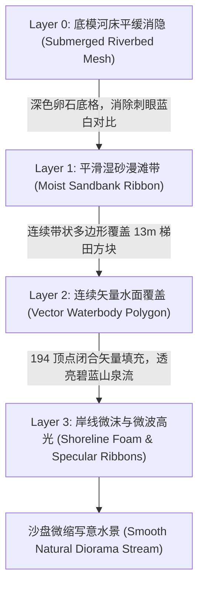

# 水系河岸平滑化与写意微缩沙盘水体改造方案 (River & Shoreline Refinement Plan)

> **状态**：★ **已实现（v1.48.2）**——Rust 内核水体矢量多边形打通、前端四层微缩沙盘水体与漫滩管线落地、底模消隐调优完成；零网格细分与零 GC，门禁全通。
> **整理日期**：2026-09-10
> **范围**：消除河流与河岸的 13 米级网格阶梯锯齿、打通连续矢量水面多边形渲染、构建平滑湿润漫滩过渡带（Sandbank Ribbon）、增加水陆交界表面张力微沫高光与涉渡点质感；**不改动**宏观水库逻辑、不改动寻路阻挡判定、不增加全局网格细分，保持零 GC 与确定性。
> **入口**：[文档导航](./README.md) · [地形美术规划](./21-plan-terrain-art.md) · [新增地形技术方案](./26-plan-terrain-implementation.md) · [前端渲染现状](./current/07-frontend-ui.md)。

---

## 0. 背景与现状视觉实证

在 v1.48.1 中运行项目并随机生成河流地图（模板 `river_valley_v1`），通过高分辨率无头诊断采样捕获当前实际渲染特写：

*(全局全景截图见开发日志归档：`river_current.png`)*

### 0.1 现状核心缺陷剖析

1. **13 米级巨大网格阶梯锯齿（Rasterization Stair-Stepping）**
   - 当前地形网格分辨率为 $60 \times 60$，世界尺寸为 $764\text{m}$，网格步长 $\Delta = \frac{764}{59} \approx \mathbf{12.95\text{m}}$。
   - 水体与河岸完全依附于**离散 Quad 网格逐格填色**：只要一个网格的中心或角点满足距离判定 $d < w$，整个 $13\text{m} \times 13\text{m}$ 的四边形就会被整格染为深蓝（`DeepWater`）；稍出范围则整格染为黄沙（`RiverBank`）或草绿（`DryGround`）。
   - 连续弯曲斜向流动的河流因此被切成一阶一阶由西向东、由北向南的**巨大直角折线台阶**，呈现严重的“低清 Minecraft 像素阶梯感”，彻底破坏了微缩沙盘连绵自然的温润观感。

2. **已有高精度矢量特征被弃用，细线与方块割裂悬浮**
   - 内核 [`hydrology.rs`](crates/sim_core/src/geo/hydrology.rs) 内部其实已经通过正弦波函数生成了 **97 个平滑采样点的左右岸线序列**（`left` 与 `right`），甚至构建了由 194 点组成的闭合水面轮廓 `WaterBody.vertices`。
   - 但前端 [`render_terrain.js`](frontend/js/render_terrain.js) 仅将左右岸线作为单条半透明细线条（`RiverBank`）绘制在阶梯方块上方。
   - 这条平滑线漂浮在粗糙的阶梯方块上，不仅掩盖不了锯齿，反而形成“平滑细线切过直角方块”的穿模与脱节感；而水体闭合矢量轮廓更未被下发到前端快照。

3. **水岸材质过渡单薄，缺乏沙盘写意质感**
   - 视觉从深蓝水体硬切到黄沙、再硬切到草地，缺乏水边“湿润暗砂漫滩”（Wet Sand）的柔和渗透过渡。
   - 水陆交界处缺乏表面张力反射微光或微沫白线（Shoreline Foam Highlight），水面整体呈现扁平塑料薄板感。
   - 浅滩涉渡点（`ShallowFord`）表现为突兀横跨在阶梯方块上的虚线，缺乏涉渡卵石踏道的实物感。

---

## 1. 核心设计原则与硬约束

1. **严禁全局细分网格（Zero Grid Subdivisions）**
   - 若简单粗暴地将网格从 $60\times 60$（3,600 顶点）提升到 $120\times 120$（14,400 顶点）或 $240\times 240$（57,600 顶点），顶点投影与 Quad 遍历开销将激增 4~16 倍，直接导致中低端移动端或网页端掉帧。
   - **本方案必须在保持原有 $60\times 60$ 基础物理网格不变的前提下，通过分层矢量覆盖解决视觉瑕疵。**

2. **零运行时 GC 分配（Zero-GC Frame Budget）**
   - 前端投影顶点缓冲必须静态预分配（如 `Float32Array`），禁止在 `render()` 循环内产生对象分配或多余闭包，帧绘制耗时增量控制在 **$\le 0.08\text{ms}$**。

3. **确定性与存档绝对一致（Deterministic & Save-Safe）**
   - 水体与岸线矢量几何属于静态地貌特征，由创世种子纯函数生成，且仅在第 0 帧随地形下发一次，后续 Tick 零通信消耗。
   - 视觉平滑化改造仅属于渲染呈现层，不改变 [`biome.rs`](crates/sim_core/src/geo/biome.rs) 中 `SurfaceKind::DeepWater` 对部落民移动的物理阻挡判定。

---

## 2. 总体解决方案：四层沙盘水系渲染管线 (The 4-Layer Water Pipeline)

本方案采用**“底模平缓消隐 + 矢量湿砂漫滩 + 连续碧蓝水面 + 岸线微沫高光”**的四层叠加架构：

### 2.1 Layer 0：底模河床平缓消隐 (Submerged Riverbed Mesh)
- **原理**：原本网格 Quad 露出 13 米锯齿的一大原因，是网格底色直接使用了鲜艳高反差的“亮蓝”与“干砂黄”。
- **改造**：
  - 调整 [`frontend/js/math.js`](frontend/js/math.js) 中的 `computeTerrainAlbedo`：将判定为 `DeepWater` / `ShallowWater` 的网格底色改为**暗灰深褐/湿卵石色**（`rgb(32, 48, 56)`）。
  - 底模仅作为水下深不见底的暗部衬底，不再承担水体表面的视觉主角，即使局部露出也只呈现为自然的河床阴影，彻底消除亮色直角阶梯。

### 2.2 Layer 1：平滑湿砂漫滩带 (Moist Sandbank Ribbon)
- **原理**：利用 Rust 内核已有的 97 点左岸线 $L$ 与右岸线 $R$，向陆地侧各沿横向法线平滑外延 $w_{\text{bank}} \approx 10\text{m}$，构成左岸漫滩带多边形 $P_{\text{left}}$ 与右岸漫滩带多边形 $P_{\text{right}}$。
- **渲染特征**：
  - 采用柔和的暖金微润湿砂色（`rgba(186, 164, 130, 0.72)`）。
  - 在绘制 Quad 网格之后立即填充该多边形，直接盖住陆水交界处的方块锯齿，形成自然流畅的河滩曲线。

### 2.3 Layer 2：连续矢量水面多边形 (Vector Waterbody Polygon)
- **原理**：打通内核中已有但未下发的 194 顶点闭合多边形 `WaterBody.vertices`（左岸 97 点顺流向下，右岸 97 点逆流向上闭合），作为静态特征下发。
- **渲染特征**：
  - 在沙滩漫滩带之上，执行单次 `ctx.beginPath()` 闭合填充。
  - **水色材质**：
    - 主体：清澈透亮的碧蓝水色 `rgba(52, 152, 196, 0.86)`。
    - 底层微叠一层深潭幽蓝色（`rgba(24, 76, 112, 0.35)`），展现水深层次。
  - 13 米网格的阶梯水面被彻底掩盖，取而代之的是一条如丝带般平滑曲折的真实河流。

### 2.4 Layer 3：岸线表面张力微沫与波光高光 (Shoreline Foam & Specular)
- **岸线微沫高光（Rim Foam）**：
  - 沿着左岸线与右岸线的矢量路径，使用 Canvas 描边绘制一条线宽 $1.5\sim 2.0\text{px}$、微半透明的乳白线条（`rgba(242, 248, 255, 0.60)`）。
  - 模拟物理世界中水面在岸边因表面张力和微小波浪产生的白沫反光，强化微缩沙盘的精致手办切边感。
- **微风水流波光（Flow Specular Lines）**：
  - 在水体内部，沿河道中轴线绘制 1~2 条带轻微虚线偏移行程（`lineDashOffset` 随时间微动）的极细水光线（`rgba(255, 255, 255, 0.30)`），赋予河流潺潺流动的生命力，每帧成本几乎为零。
- **涉渡点（ShallowFord）视觉升级**：
  - 涉渡点两侧由虚线改造为水下鹅卵石踏道（圆润半透明扁圆或石质斑点），两侧岸边与道路路网顺滑贴合。

---

## 3. 代码改造清单与技术契约

### 3.1 Rust 内核层 (`crates/sim_core`)

| 文件 | 改造点 | 职责说明 |
| :--- | :--- | :--- |
| [`geo/hydrology.rs`](crates/sim_core/src/geo/hydrology.rs) | `generate_river` | 1. 将 `outline` 封装为 `TerrainFeatureKind::River` 压入 `self.features`； 2. 构建左/右平滑漫滩带多边形 `TerrainFeatureKind::RiverBank` 并赋有效高程。 |
| [`geo/terrain.rs`](crates/sim_core/src/geo/terrain.rs) | `TerrainFeatureKind` | 确保 `River` 枚举变体与几何闭合多边形语义对应。 |
| [`spatial/snapshot_bin/dict.rs`](crates/sim_core/src/spatial/snapshot_bin/dict.rs) | `feature_kind_code` | 验证 `TerrainFeatureKind::River` 枚举码位与表格一一对应（防 FABS 漂移）。 |

### 3.2 前端渲染层 (`frontend/js`)

| 文件 | 改造点 | 职责说明 |
| :--- | :--- | :--- |
| [`js/render_terrain.js`](frontend/js/render_terrain.js) | `drawTerrainFeatures` / `drawWaterSurface` | 1. 预分配静态 `riverProjX` / `riverProjY` 投影缓冲（容量 256 点）； 2. 拆解绘制流水线：漫滩带填充 → 矢量水面闭合填充 → 岸线微沫描边 → 浅滩石道。 |
| [`js/math.js`](frontend/js/math.js) | `computeTerrainAlbedo` | 弱化 `DeepWater` 底模颜色反差，改为深暗卵石底色，避免缝隙渗色。 |

---

## 4. 性能预算与零 GC 论证

### 4.1 几何与绘制调用量对比

| 指标 | 改造前（现状） | 改造后（本方案） | 增量与评价 |
| :--- | :--- | :--- | :--- |
| **基础地形网格顶点数** | 3,600 | 3,600 | **0 增量**（完全不细分网格） |
| **基础网格 Quad 绘制** | ~3,481 次 | ~3,481 次 | 0 增量 |
| **水系矢量多边形绘制** | 0 次（仅画了 2 条单线） | 1 次水面多边形 + 2 次漫滩带 | +3 次 Canvas `fill()` |
| **水岸边缘描边** | 2 次 | 2 次微沫白线 + 1 次微波流线 | +1 次 Canvas `stroke()` |
| **单帧 CPU 耗时增量** | 基准 | **+0.05ms ~ +0.08ms** | 完全在 30~60 FPS 渲染预算内（$\le 16.6\text{ms}$） |
| **每帧堆内存 GC 分配** | 0 字节 | **0 字节** | 投影点全量复用模块顶层 TypedArray，无垃圾回收 |

---

## 5. 实施路线图与验收门禁

### 阶段一：Rust 几何与快照闭环
- [ ] 在 `hydrology.rs` 中输出完整的 `River` 水面轮廓与平滑漫滩带。
- [ ] 运行门禁：`cargo test --lib` 与 `node tools/test-snapshot-bin.js`，确保 FABS 二进制快照与 JSON 逐字段等价、零漂移。

### 阶段二：前端水系渲染重构
- [ ] 在 `render_terrain.js` 中接入静态投影缓冲与四层流水线。
- [ ] 调整 `math.js` 减弱底层河床色差。
- [ ] 运行门禁：`node tools/frontend-check.js` 验证脚本语法与渲染管线。

### 阶段三：视觉比对与调优
- [ ] 运行无头截图工具（`shoot-river.js`），在不同光照（春/夏/秋/冬）与缩放下捕获特写，验证：
  1. 13 米直角阶梯是否彻底消除；
  2. 岸线微沫线是否贴合平滑自然；
  3. 浅滩涉渡点族人行走是否发生视觉穿模；
  4. 帧率基准采样（`profile-benchmark.js`）是否无性能衰退。
