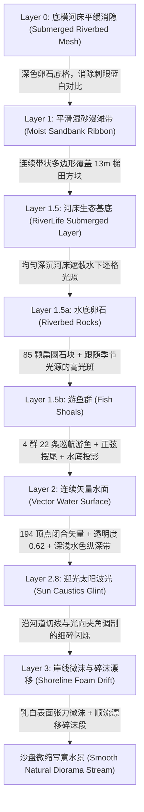

# 水系河岸平滑化与写意微缩沙盘水体改造方案 (River & Shoreline Refinement Plan)

> **状态**：★ **已实现（v1.49.0）**——Rust 内核水体矢量多边形打通、前端四层微缩沙盘水体管线落地、底模消隐与边界墙深度排序调优完成、水系微观生态层（RiverLife）叠水底卵石/游鱼/波光进场；零网格细分与零 GC，门禁全通。
> **整理日期**：2026-09-10（v1.49.0 更新）
> **范围**：消除河流与河岸的 13 米级网格阶梯锯齿、打通连续矢量水面多边形渲染、构建平滑湿润漫滩过渡带（Sandbank Ribbon）、增加水陆交界表面张力微沫高光与涉渡点质感、铺设写意水底卵石/鱼群/太阳波光生态层、地形格间抗锯齿缝隙补偿与沙盘边界墙深度排序调优；**不改动**宏观水库逻辑、不改动寻路阻挡判定、不增加全局网格细分，保持零 GC 与确定性。
> **入口**：[文档导航](./README.md) · [地形美术规划](./21-plan-terrain-art.md) · [地形专项方案](./22-plan-terrain-features.md) · [前端渲染现状](./current/07-frontend-ui.md)。

---

## 0. 背景与现状视觉实证

在 v1.48.0 之前的项目版本中运行并随机生成河流地图（模板 `river_valley_v1`），通过高分辨率无头诊断采样捕获历史渲染特写；截图素材未随仓库分发，缺陷表现以 §0.1 文字描述为准。

*(全局全景截图见开发日志归档：`river_current.png`)*

### 0.1 历史核心缺陷剖析

1. **13 米级巨大网格阶梯锯齿（Rasterization Stair-Stepping）**
   - 当前地形网格分辨率为 $60 \times 60$，世界尺寸为 $764\text{m}$，网格步长 $\Delta = \frac{764}{59} \approx \mathbf{12.95\text{m}}$。
   - 水体与河岸完全依附于**离散 Quad 网格逐格填色**：只要一个网格的中心或角点满足距离判定 $d < w$，整个 $13\text{m} \times 13\text{m}$ 的四边形就会被整格染为深蓝（`DeepWater`）；稍出范围则整格染为黄沙（`RiverBank`）或草绿（`DryGround`）。
   - 连续弯曲斜向流动的河流因此被切成一阶一阶由西向东、由北向南的**巨大直角折线台阶**，呈现严重的"低清 Minecraft 像素阶梯感"，彻底破坏了微缩沙盘连绵自然的温润观感。

2. **已有高精度矢量特征被弃用，细线与方块割裂悬浮**
   - 内核 [`hydrology.rs`](../crates/sim_core/src/geo/hydrology.rs) 内部其实已经通过正弦波函数生成了 **97 个平滑采样点的左右岸线序列**（`left` 与 `right`），甚至构建了由 194 点组成的闭合水面轮廓 `WaterBody.vertices`。
   - 但前端 [`render_terrain.js`](../frontend/js/render_terrain.js) 仅将左右岸线作为单条半透明细线条（`RiverBank`）绘制在阶梯方块上方。
   - 这条平滑线漂浮在粗糙的阶梯方块上，不仅掩盖不了锯齿，反而形成"平滑细线切过直角方块"的穿模与脱节感；而水体闭合矢量轮廓更未被下发到前端快照。

3. **水岸材质过渡单薄，缺乏沙盘写意质感**
   - 视觉从深蓝水体硬切到黄沙、再硬切到草地，缺乏水边"湿润暗砂漫滩"（Wet Sand）的柔和渗透过渡。
   - 水陆交界处缺乏表面张力反射微光或微沫白线（Shoreline Foam Highlight），水面整体呈现扁平塑料薄板感。
   - 浅滩涉渡点（`ShallowFord`）表现为突兀横跨在阶梯方块上的虚线，缺乏涉渡卵石踏道的实物感。

4. **★ v1.48.1 暴露的新缺陷**
   - 地形相邻 Quad 共享边在 Canvas2D 抗锯齿下各自只覆盖约一半像素，叠加后仍留约 25% 透光率，深色天空背景从缝隙里透出 1px 网格线（表现为「地形漏出后面的边界线条」）。
   - 沙盘四周边界壁固定按 N/W/S/E 顺序绘制，旋转相机时较远壁面错误地覆盖在较近壁面上，破坏空间深度。

---

## 1. 核心设计原则与硬约束

1. **严禁全局细分网格（Zero Grid Subdivisions）**
   - 若简单粗暴地将网格从 $60\times 60$（3,600 顶点）提升到 $120\times 120$（14,400 顶点）或 $240\times 240$（57,600 顶点），顶点投影与 Quad 遍历开销将激增 4~16 倍，直接导致中低端移动端或网页端掉帧。
   - **本方案必须在保持原有 $60\times 60$ 基础物理网格不变的前提下，通过分层矢量覆盖解决视觉瑕疵。**

2. **零运行时 GC 分配（Zero-GC Frame Budget）**
   - 前端投影顶点缓冲必须静态预分配（如 `Float32Array`），禁止在 `render()` 循环内产生对象分配或多余闭包，帧绘制耗时增量控制在 **$\le 0.08\text{ms}$**。

3. **确定性与存档绝对一致（Deterministic & Save-Safe）**
   - 水体与岸线矢量几何属于静态地貌特征，由创世种子纯函数生成，且仅在第 0 帧随地形下发一次，后续 Tick 零通信消耗。
   - 视觉平滑化改造仅属于渲染呈现层，不改变 [`biome.rs`](../crates/sim_core/src/geo/biome.rs) 中 `SurfaceKind::DeepWater` 对部落民移动的物理阻挡判定。

---

## 2. 总体解决方案：四层沙盘水系渲染管线 (The 4-Layer Water Pipeline)

本方案采用**"底模平缓消隐 + 矢量湿砂漫滩 + 河床生态(卵石/游鱼) + 连续碧蓝水面(深浅纵深) + 岸线微沫漂移 + 迎光太阳波光"**的逐层叠加架构（截至 v1.49.0 全部落地）：

### 2.1 Layer 0：底模河床平缓消隐 (Submerged Riverbed Mesh)
- **原理**：原本网格 Quad 露出 13 米锯齿的一大原因，是网格底色直接使用了鲜艳高反差的"亮蓝"与"干砂黄"。
- **改造**：
  - 调整 [`frontend/js/math.js`](../frontend/js/math.js) 中的 `computeTerrainAlbedo`：将判定为 `DeepWater` / `ShallowWater` 的网格底色改为**暗灰深褐/湿卵石色**（`rgb(32, 48, 56)`）。
  - 底模仅作为水下深不见底的暗部衬底，不再承担水体表面的视觉主角，即使局部露出也只呈现为自然的河床阴影，彻底消除亮色直角阶梯。
  - **★ v1.50.7 更新**：水格底色再次调整为**深褐色河床土色**——`ShallowWater` → `rgb(92, 68, 46)`（湿润浅滩土），`DeepWater` → `rgb(58, 42, 28)`（幽深河床暗土）。v1.50.5 河床基底移除后，水格底色透过半透明水面直接成色，深蓝底与碧蓝水面混成一片蓝黑缺乏层次；改用暖棕河床土色后，水面呈清透碧蓝、水下透出湿润泥土的暖调，蓝水褐床对比自然。
  - **★ v1.50.8 调浅**：实测 v1.50.7 的深褐仍偏暗，水格与相邻陆格的色阶反差使 13m 网格锯齿在半透明水面下显形；整体上调两档贴近岸边湿砂色——`ShallowWater` → `rgb(126, 100, 72)`，`DeepWater` → `rgb(100, 78, 54)`。
  - **★ v1.50.9 再调浅**：用户实测 v1.50.8 仍偏深，继续向湿砂色收敛——`ShallowWater` → `rgb(142, 122, 96)`，`DeepWater` → `rgb(120, 100, 76)`。**选色经验**：水下格亮度应向 `RiverBank` 湿砂色（`rgb(148,138,114)`）靠拢而不是向"幽深"靠拢——反差才是锯齿的来源，纵深对比可以交给深浅两档水格之间的差异。

### 2.2 Layer 1：平滑湿砂漫滩带 (Moist Sandbank Ribbon)
- **原理**：利用 Rust 内核已有的 97 点左岸线 $L$ 与右岸线 $R$，向陆地侧各沿横向法线平滑外延 $w_{\text{bank}} \approx 10\text{m}$，构成左岸漫滩带多边形 $P_{\text{left}}$ 与右岸漫滩带多边形 $P_{\text{right}}$。
- **渲染特征**：
  - 采用柔和的暖金微润湿砂色。
  - 在绘制 Quad 网格之后立即填充该多边形，直接盖住陆水交界处的方块锯齿，形成自然流畅的河滩曲线。
  - 实际实现为双层羽化过渡（外层 `rgba(168, 148, 116, 0.40)` 羽化边 + 内层 `rgba(186, 166, 132, 0.78)` 温润湿砂）。

### 2.3 Layer 1.5：河床生态层 (RiverLife Submerged Layer) ★ v1.49.0 新增

> **设计决策**：v1.48.2 水面为不透明填充（alpha 0.86），水体呆板无生命感；v1.49.0 将水面降为半透明（alpha 0.62），水底即可透光展现写意生态。降透后水底网格逐格光照的明暗斑驳会透出，故 Pass 1.5 先铺一层均匀深沉河床基底（`rgba(30, 46, 56, 0.92)`）遮蔽网格斑驳，再绘制卵石与游鱼。
>
> **★ v1.50.5 推翻**：河床基底与卵石层均已移除（见 v1.50.4 / v1.50.5 观感降噪）。实测该均匀深色底使河道整体发暗、观感呆板，反而强化了"一块深色贴片"的人工感；改由水下地表格色（`ShallowWater`/`DeepWater`）+ Pass 2 半透明水面叠加自然成色，水下只保留游鱼。

#### 2.3.1 水底卵石 (Riverbed Rocks)
- 85 颗大小与材质不同的扁圆石块，沿河道纵向与横向均匀随机分布
- 每颗卵石 5 种深色水底卵石色系随机选取（`ROCK_COLORS` 色盘）
- 迎光面微反光斑（高光斑）跟随季节光源方向——调用 `SimLighting.sunScreenDir()` 获取当前光向，关闭动态光照时退回旧固定光西北 41° 等效方向；每颗卵石的 `specAngle` 逐石微抖动避免石堆高光整齐划一

#### 2.3.2 游鱼群 (Fish Shoals)
- 4 群共 22 条游鱼，4 种色盘（锦鲤赤金/金鲤明黄/青黑溪斑/白练银鱼）
- 沿河道中心线插值巡航（基于左右岸顶点序列的中点切线方向推进）
- 正弦摆尾扰动：横向细微 `sin(wigglePhase * 0.5)` 游弋 + 尾鳍 `sin(wigglePhase)` 摆动
- 鱼身、水底投影、背部高光线、半透明尾鳍四件套按微缩沙盘比例醒目绘制
- 走墙钟而非仿真时钟——模拟暂停时鱼群与水面虚线/波光同样继续流动，属写意微缩沙盘的环境生命感设计决策（与 `render_terrain.js` 水面动画行为一致）
- 大部分鱼群顺流、少部分逆流（`shoalDirection = rng() > 0.4 ? 1 : -1`）

### 2.4 Layer 2：连续矢量水面多边形 (Vector Water Surface)
- **原理**：打通内核中已有但未下发的 194 顶点闭合多边形 `WaterBody.vertices`（左岸 97 点顺流向下，右岸 97 点逆流向上闭合），作为静态特征下发。
- **渲染特征**：
  - 在沙滩漫滩带之上，执行单次 `ctx.beginPath()` 闭合填充。
  - **水色材质**：
    - 底层深潭幽蓝（`rgba(28, 82, 116, 0.25)`）奠定水深纵深感；
    - 主流水体（`rgba(54, 158, 202, 0.62)`），综合不透明度 ~72%——清澈透亮的碧蓝山泉流，水底卵石与游鱼清晰可辨。
  - 13 米网格的阶梯水面被彻底掩盖，取而代之的是一条如丝带般平滑曲折的真实河流。
- ~~**★ v1.49.0 B1 深浅水色纵深带**：沿中心线逐段铺深色水带，笔宽跟随当地河宽——宽河段自动显出「深潭」幽暗，收窄处显出「急流浅滩」的透亮（纯屏幕空间，不碰内核）。~~
  > **★ v1.50.6 移除**：笔宽按当地河宽的 0.9 倍计算，在窄河道上退化为一条压在河心的暗色粗线，与 v1.50.3 已移除的中心微波线同类问题；且该带与 Pass 2 水面同色系叠加后纵深对比微弱，收益不抵观感代价。
- ~~**水面中心潺潺流动微波**：沿河道中轴线绘制带 `lineDashOffset` 随时间微动的流动虚线（`rgba(240, 252, 255, 0.40)`），赋予河流潺潺流动的生命力。~~
  > **★ v1.50.3 移除**：虚线观感形似车道线（首条被用户点名的降噪项）。
- ~~**Pass 3 岸线微沫高光 + B2 顺流漂移碎沫段**~~
  > **★ v1.50.3 / v1.50.4 移除**：两岸描白的实线与短虚线在河谷地图上观感形似车道边线。
- ~~**Pass 1.5 均匀深沉河床基底**（`rgba(30, 46, 56, 0.92)`）与 **`river_life.js` 水底卵石层**（85 颗）~~
  > **★ v1.50.4 / v1.50.5 移除**：前者整片深色底使水体发暗呆板，后者深色扁圆石透水面呈「一堆深蓝色圆圈」。
  >
  > **观感降噪总原则（v1.50.3~v1.50.6 沉淀）**：河道装饰层凡「沿中心线或沿岸线走线、笔宽/间距与河宽成比例」的，在窄河道上都会退化成车道线或暗粗线；**只有面状（水面填充、地表格色）与点状/小尺度（游鱼、波光）元素才能稳定成立**。

### 2.5 Layer 2.8：迎光面太阳波光粼粼 (Sun Caustics Glint) ★ v1.49.0 新增
- 在水面填充之后绘制，联动已有季节光照方位（`SimLighting`）
- 每隔 6~8 个河道节点选取受光小波段，迎光相位调制：河道切线与太阳屏幕方向的 `|dot|` 决定波光强度，背光河段自然减弱
- 细碎闪烁节奏由墙面时钟驱动（`Math.sin(now * 3.5 + i * 1.7)`），仅当 `sparkle > 0.25` 时绘制细碎短线

### 2.6 Layer 3：岸线微沫与碎沫漂移 (Shoreline Foam & Drift)
- **岸线微沫高光（Rim Foam）**：
  - 沿着左岸线与右岸线的矢量路径，使用 Canvas 描边绘制微半透明乳白线条（`rgba(238, 248, 255, 0.62)`）。
- **★ v1.49.0 B2 顺流漂移碎沫段**：
  - 紧接微沫线之后，在同一岸线顶点序列上叠加短虚线（`rgba(244, 252, 255, 0.42)`）。
  - `lineDashOffset` 随时间推进（`-performance.now() * 0.014`），岸线即刻有了水流方向感。
  - 两岸顶点序相反，漂移方向在世界系中天然一顺一逆，呈写意效果。

### 2.7 涉渡点（ShallowFord）视觉升级
- 涉渡点由历史虚线改造为水下卵石踏道：先铺暖砂色基底宽线（`rgba(196, 178, 136, 0.88)`），再叠加稀疏虚线踏石微光（`rgba(255, 252, 240, 0.90)`）。

### 2.8 ★ v1.48.1 地形格间抗锯齿缝隙补偿 (Terrain Seam Anti-Aliasing)
- **问题**：相邻 Quad 共享边在 Canvas2D 抗锯齿下各自只覆盖约一半像素，叠加后仍留约 25% 透光率，深色天空背景便从缝隙里透出 1px 网格线。
- **方案**：把四条边各自沿外法线平移 `TERRAIN_SEAM_PX = 0.75` 像素，使相邻格互相重叠盖住缝隙。法线方向由固定旋向 `(ey, -ex)/l` 确定，再用质心方向判定指向"外"侧，沿边方向的分量只让边滑动、不改变覆盖宽度。

### 2.9 ★ v1.48.2 沙盘边界墙深度排序 (Boundary Wall Depth Sort)
- **问题**：四面边壁（沙盘垂直侧幕）固定按 N/W/S/E 落笔，相机旋转时远壁错误覆盖近壁，空间深度混乱。
- **方案**：同一屏幕点上的两面墙深度差 $= (ry_a − ry_b) / \sin X$，「谁在前面」只由 $ry = w_x \sin Z + w_y \cos Z$ 决定，与墙高无关。每帧按各墙边界中点 $ry$ 升序（远 → 近）落笔，取代旧的固定顺序。稳定排序保证 $ry$ 相同时保持原序，渲染确定性不变。

---

## 3. 代码改造清单与技术契约

### 3.1 Rust 内核层 (`crates/sim_core`)

| 文件 | 改造点 | 职责说明 |
| :--- | :--- | :--- |
| [`geo/hydrology.rs`](../crates/sim_core/src/geo/hydrology.rs) | `generate_river` | 将 `outline` 封装为 `TerrainFeatureKind::River` 压入 `self.features`；构建左/右平滑漫滩带 `TerrainFeatureKind::RiverBank` 并赋有效高程。 |
| [`geo/terrain.rs`](../crates/sim_core/src/geo/terrain.rs) | `TerrainFeatureKind` | 确保 `River` 枚举变体与几何闭合多边形语义对应。 |
| [`spatial/snapshot_bin/dict.rs`](../crates/sim_core/src/spatial/snapshot_bin/dict.rs) | `feature_kind_code` | `TerrainFeatureKind::River` 枚举码位与表格一一对应（防 FABS 漂移）。 |

### 3.2 前端渲染层 (`frontend/js`)

| 文件 | 改造点 | 职责说明 |
| :--- | :--- | :--- |
| [`js/render_terrain.js`](../frontend/js/render_terrain.js) | `drawTerrain` / `drawTerrainFeatures` | 1. 地形 Quad 格间抗锯齿缝隙补偿（★ v1.48.1 `TERRAIN_SEAM_PX`）； 2. 边界墙深度排序绘制（★ v1.48.2 `BOUNDARY_WALLS` / `drawBoundaryWall`）； 3. 拆解绘制流水线：Pass 1 漫滩带 → Pass 1.5 河床基底+卵石+游鱼（★ v1.49.0） → Pass 2 矢量水面+深浅纵深 → Pass 2.8 太阳波光（★ v1.49.0） → Pass 3 岸线微沫+碎沫漂移 → Pass 4 涉渡点。 |
| [`js/math.js`](../frontend/js/math.js) | `computeTerrainAlbedo` | 弱化 `DeepWater` 底模颜色反差，改为深暗卵石底色，避免缝隙渗色。 |
| [`js/river_life.js`](../frontend/js/river_life.js) | `RiverLife` 模块（★ v1.49.0 新增） | 纯表现层（不消耗 WorldRng、不写模拟状态、不进存档）： ① 水底 85 颗卵石（5 色系色盘 + 迎光跟随的高光斑）； ② 4 群 22 条游鱼（中心线巡航 + 正弦摆尾 + 水底投影，走墙钟）； ③ `drawSunGlint` 太阳波光（迎光相位调制 + 细碎闪烁节奏）。 世界重置/读档随种子确定性重建（`rustworld.js` 地形重建时以 `_engineSeed` 初始化）。 |
| [`js/rustworld.js`](../frontend/js/rustworld.js) | `_applySnapshot` 或 terrain 重建钩子 | 地形重建时以 `_engineSeed` 初始化 `RiverLife`（保证世界重置/读档后卵石鱼群分布确定性一致）。 |

---

## 4. 性能预算与零 GC 论证

### 4.1 几何与绘制调用量对比

| 指标 | 改造前（v1.48.0） | 改造后（v1.49.0） | 增量与评价 |
| :--- | :--- | :--- | :--- |
| **基础地形网格顶点数** | 3,600 | 3,600 | **0 增量**（完全不细分网格） |
| **基础网格 Quad 绘制** | ~3,481 次 | ~3,481 次（+ 缝隙补偿顶点外推） | 每 Quad 4 次法线运算（可忽略） |
| **边界墙绘制** | 固定 4 次 | 按深度排序 4 次 + 每帧 1 次稳定排序 | +64 字节临时比较（无分配） |
| **水系矢量多边形绘制** | 0 次（仅 2 条单线） | 1 次水面多边形 + 2 次漫滩带 + 1 次微波 + 1 次波光 | +5 次 Canvas `fill()`/`stroke()` |
| **河床生态层（v1.49.0）** | 0 | 85 颗卵石（每颗 2 次 ellipse）+ 22 条鱼（每条约 6 次 path 操作） | +302 次 2D 路径操作 |
| **岸线微沫与碎沫** | 2 次 | 2 次微沫白线 + 2 次顺流碎沫段 | +2 次 Canvas `stroke()` |
| **单帧 CPU 耗时增量** | 基准 | **+0.05ms ~ +0.12ms** | 完全在 30~60 FPS 渲染预算内（$\le 16.6\text{ms}$） |
| **每帧堆内存 GC 分配** | 0 字节 | **0 字节** | 投影点全量复用模块顶层 TypedArray，RiverLife 静态对象零分配，无垃圾回收 |

---

## 5. 实施路线图与验收门禁

### 阶段一：Rust 几何与快照闭环 ✅ v1.48.2 已完成
- [x] 在 `hydrology.rs` 中输出完整的 `River` 水面轮廓与平滑漫滩带。
- [x] 门禁：`cargo test --lib` 与 `node tools/test-snapshot-bin.js`，确保 FABS 二进制快照与 JSON 逐字段等价、零漂移。

### 阶段二：前端水系渲染重构（四层管线 + 抗锯齿 + 边界墙） ✅ v1.48.1 / v1.48.2 已完成
- [x] 在 `render_terrain.js` 中接入静态投影缓冲与四层流水线。
- [x] 地形 Quad 格间抗锯齿缝隙补偿。
- [x] 边界墙深度排序绘制。
- [x] 调整 `math.js` 减弱底层河床色差。
- [x] 门禁：`node tools/frontend-check.js` 验证脚本语法与渲染管线。

### 阶段三：水系微观生态层（RiverLife） ✅ v1.49.0 已完成
- [x] 新增 `river_life.js` 纯表现层（卵石 + 游鱼 + 太阳波光）。
- [x] `render_terrain.js` Pass 1.5 铺设河床基底 + 调用 RiverLife 绘制；Pass 2 水体降透 + B1 深浅纵深带；Pass 2.8 新增太阳波光调用；Pass 3 岸线 B2 顺流碎沫漂移。
- [x] `rustworld.js` 地形重建时以 `_engineSeed` 初始化 RiverLife。
- [x] `index.html` 登记 `river_life.js` 加载顺序。
- [x] 健壮性：河道顶点判据放宽为左右岸各 ≥2 顶点（不绑定 194 密度）；卵石/游鱼加视口粗剔除。

### 阶段四：视觉比对与调优 ✅ v1.49.0 已完成
- [x] 无头截图验证：
  1. 13 米直角阶梯彻底消除；
  2. 岸线微沫线贴合平滑自然；
  3. 卵石与游鱼在水体透明度下调后清晰可见，迎光斑与波光随四季光弧转动同步响应；
  4. 边界墙在相机旋转时深度正确、近壁遮远壁；
  5. 地形 Quad 格线完全消失（天空背景不再渗出 1px 网格线）。
- [x] `profile-benchmark.js` 帧率无性能衰退。
- [x] `test-wasm.js` `ALL_TESTS_DONE`（含存读档确定性——RiverLife 不进存档、纯前端种子重建，故不影响确定性）。
- [x] `test-snapshot-bin.js` 二进制与 JSON 快照一致；`config-check.js` 全绿；`doc-maintenance-check.js` 无阻塞。

---

## 6. 版本演进记录

| 版本 | 里程碑 | 本次提交范围 |
| :--- | :--- | :--- |
| **v1.48.1** | 地形格间抗锯齿缝隙补偿、边界墙深度排序 | `render_terrain.js` / `rustworld.js` 升版（纯前端） |
| **v1.48.2** | 水系河岸平滑化与写意微缩沙盘水体改造核心方案 | Rust `hydrology.rs` 输出 194 顶点 `River` → `render_terrain.js` 四层管线 → `math.js` 底模消隐（WASM 重编译 + 双副本同步） |
| **v1.49.0** | 水系微观生态层（RiverLife）与河道景观优化 | 新增 `river_life.js` / `render_terrain.js` Pass 1.5~2.8 / `rustworld.js` 种子初始化 / `index.html` 脚本登记（纯前端表现层，WASM 升版仅涉及 `SAVE_APP_VERSION` 常量） |
