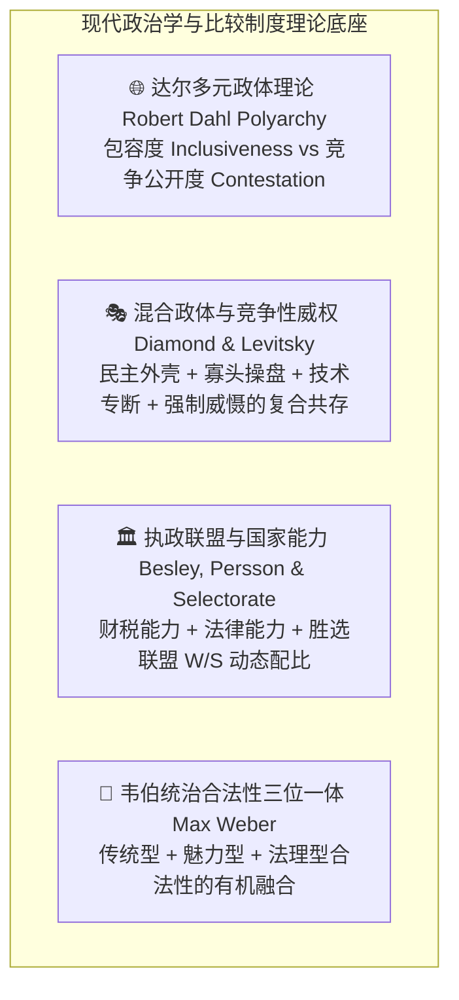
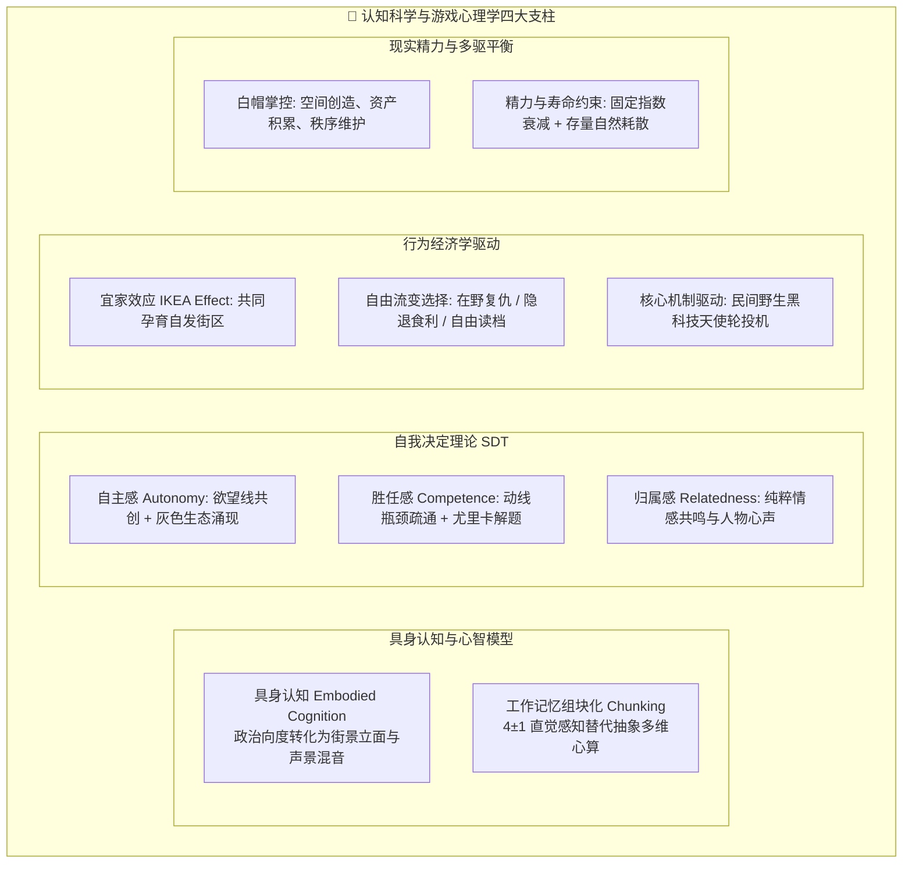
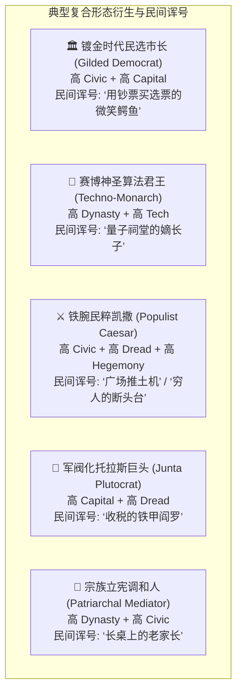
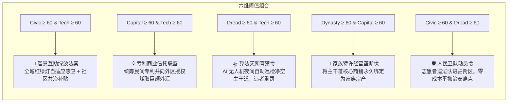
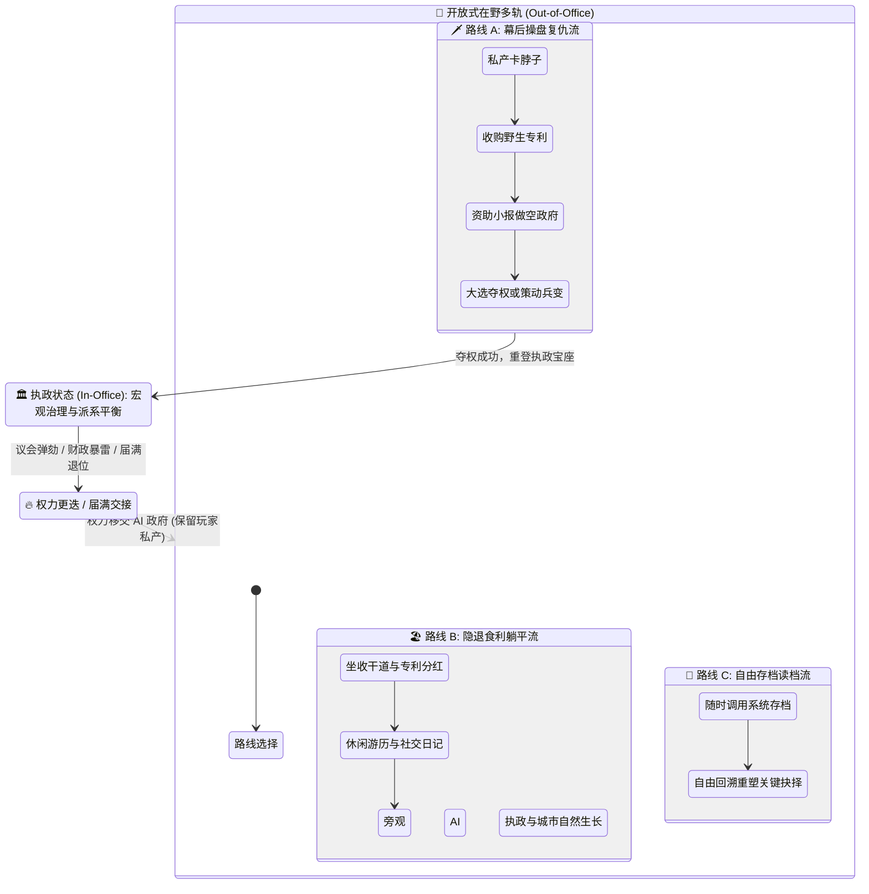
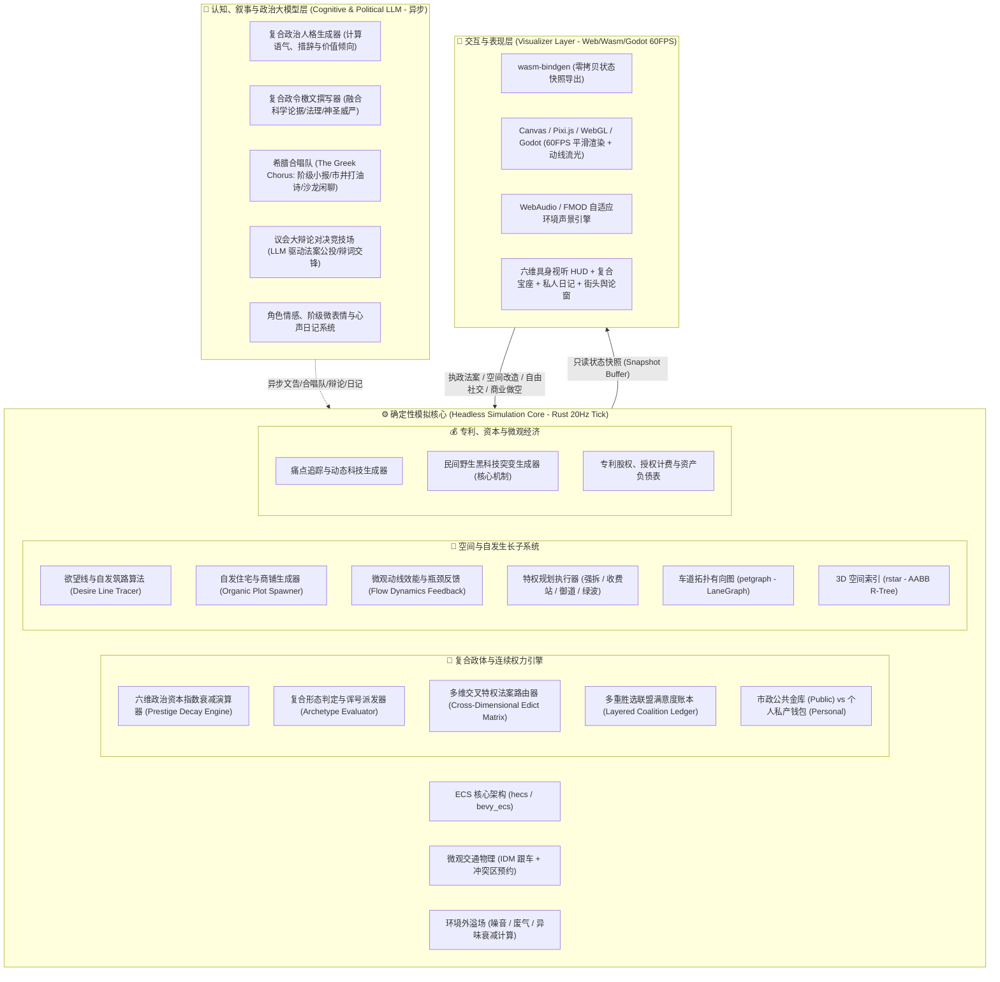
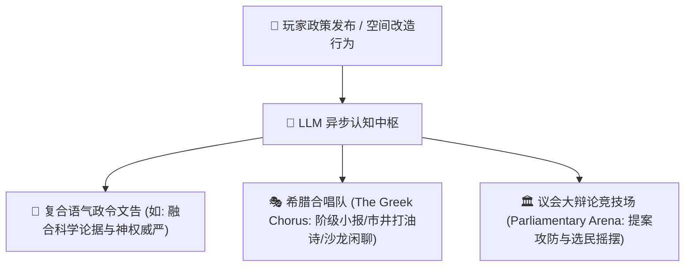
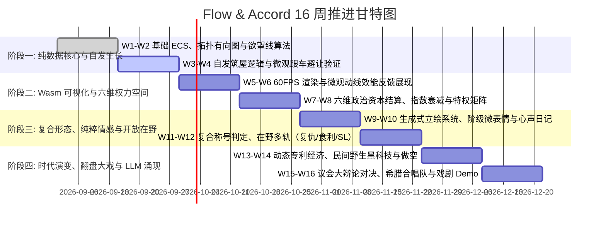

# 🌊 Flow & Accord（流动公约）项目计划书
> **原项目代号**：Project OmnisCity  
> **核心定位**：社区尺度空间自发生长 × 微观动线与动态专利经济 × 现代混合政体光谱（兼具民主/技术/寡头/军阀/宗法/霸权复合形态） × 具身认知与生成式社交恋爱引擎  
> **架构范式**：纯数据无头核心（Headless Core） + 表现层完全解耦 + 确定性 Tick 驱动 + 异步认知大模型驱动  

> ⚠️ **项目计划定位与现状说明（愿景 vs 现状）**：  
> 本文档记录了项目的**宏观愿景、政治学/认知科学理论框架与 16 周长程演进排期规划**。  
> - **当前实际落地状态**：项目已完成确定性 Rust 原始生态演化引擎（30Hz 物理步进、(tick_counter + agent.id) % 15 == 0 错峰决策、21 处有限生态 POI、5 阶私宅进阶、随身行囊真实搬运与代际继承大闭环），详见 [CURRENT.md](file:///c:/Users/Lima/RustroverProjects/FlowAndAccord/docs/CURRENT.md) 与 [AGENTS.md](file:///c:/Users/Lima/RustroverProjects/FlowAndAccord/AGENTS.md)。  
> - **本文档内容（混合政体、六维政治资本、LLM 希腊合唱队、动态专利经济等）均为长程演进愿景**，请勿将规划特性误认为当前已有功能。

---

## 目录
1. [项目愿景与认知政治学设计哲学](#1-项目愿景与认知政治学设计哲学)
   - 1.1 [核心玩法体验愿景](#11-核心玩法体验愿景)
   - 1.2 [现代混合政体与国家能力理论框架（Hybrid Regimes & State Capacity）](#12-现代混合政体与国家能力理论框架hybrid-regimes--state-capacity)
   - 1.3 [认知科学与游戏心理学理论指导框架（Cognitive Science & Game Psychology）](#13-认知科学与游戏心理学理论指导框架cognitive-science--game-psychology)
   - 1.4 [政体流转与社会演化大闭环（Core Gameplay Loop）](#14-政体流转与社会演化大闭环core-gameplay-loop)
2. [六维权力空间与复合统治者形态库](#2-六维权力空间与复合统治者形态库)
   - 2.1 [六维连续政治资本模型、现实精力寿命衰减与具身视听表征](#21-六维连续政治资本模型现实精力寿命衰减与具身视听表征)
   - 2.2 [非互斥复合统治者形态与民间诨号系统（Hybrid Archetypes & Emergent Monikers）](#22-非互斥复合统治者形态与民间诨号系统hybrid-archetypes--emergent-monikers)
   - 2.3 [多维特权法案组合解锁机制（Multi-Dimensional Edict Matrix）](#23-多维特权法案组合解锁机制multi-dimensional-edict-matrix)
   - 2.4 [跨时代经济契合与复合制度演进谱系（Era Alignment）](#24-跨时代经济契合与复合制度演进谱系era-alignment)
   - 2.5 [执政与在野流变：开放式多轨体验（复仇操盘 / 隐退食利 / 自由读档）](#25-执政与在野流变开放式多轨体验复仇操盘--隐退食利--自由读档)
3. [系统架构与关键子系统设计](#3-系统架构与关键子系统设计)
   - 3.1 [分层架构设计](#31-分层架构设计)
   - 3.2 [空间自发生长与微观动线效能反馈（Organic Growth & Flow Dynamics）](#32-空间自发生长与微观动线效能反馈organic-growth--flow-dynamics)
   - 3.3 [痛点动态专利与民间黑科技投机（Patent & Equity Subsystem - 核心机制）](#33-痛点动态专利与民间黑科技投机patent--equity-subsystem---核心机制)
   - 3.4 [生成式立绘社交、阶级微表情与心声日记（纯粹情感与道德羁绊，去功利数值化）](#34-生成式立绘社交阶级微表情与心声日记纯粹情感与道德羁绊去功利数值化)
   - 3.5 [LLM 认知层：希腊合唱队、议会大辩论与意识形态涌现](#35-llm-认知层希腊合唱队议会大辩论与意识形态涌现)
   - 3.6 [关键技术栈](#36-关键技术栈)
4. [16周阶段里程碑与排期规划](#4-16周阶段里程碑与排期规划)
5. [核心风险与应对策略（工程 + 认知心理与复合博弈）](#5-核心风险与应对策略工程--认知心理与复合博弈)
6. [首周启动行动清单（Sprint 1 Action Items）](#6-首周启动行动清单sprint-1-action-items)

---

## 1. 项目愿景与认知政治学设计哲学

### 1.1 核心玩法体验愿景

《Flow & Accord》构筑了一个**微观空间动线、自发生态演化、微观专利经济与现代混合政体光谱深度交织的社区尺度微型社会**。

- **空间与微观自治**：居民（NPC）依据生活通勤“欲望线”自发筑屋拓路，痛点倒逼发明并持有专利股权。
- **权力向度的非互斥性（Non-Binary Hybrid Regimes）**：告别传统游戏非黑即白的政体标签（“纯民主” vs “纯独裁”）。在现代政治学中，统治者往往**兼具多种统治手段与合法性来源**——你可以既是受市民投票拥戴的“民选市长”，又是手握全城关键干道专利的“商业巨鳄”，同时依靠强力防暴特勤铁腕压制局部暴乱，甚至背靠古老宗族血统获得宗法尊崇。
- **双重节奏体验**：
  - **微观动线秩序建构**：观察居民在空地上踩出蜿蜒小径、疏通交通瓶颈、解锁发明专利时的秩序建构与效率反馈；
  - **宏观政治权衡与流变**：在有限寿命与精力约束下，于多方派系利益撕裂中运筹帷幄；在执政登顶与在野流变中，体验极高自由度的社会演变。

---

### 1.2 现代混合政体与国家能力理论框架（Hybrid Regimes & State Capacity）

本系统深度融入现代比较政治学与国家能力理论四大基石：



1. **混合政体理论（Hybrid Regimes & Competitive Authoritarianism - Diamond, Levitsky & Way）**：
   - 现代真实政体多处于完全民主与封闭独裁之间的广阔灰色光谱。
   - 统治者可以**同时动用合法选举（民主）、算法管网优化（技术）、专利垄断收益（寡头）、防暴特勤执法（威慑）与家族威望（宗族）**来维系统治秩序。
2. **国家能力与法理治理（State Capacity - Besley & Persson）**：
   - 治理不仅关乎意识形态，更关乎**基建规划落地能力、税收汲取效率与产权保护质量**。
3. **多重胜选联盟叠加（Layered Winning Coalitions）**：
   - 玩家的执政合法性不是单一群体的赋予，而是由**普通选民、极客工程师、商会股东、宗族长老与军警部队**等多方满意度加权合成。

---

### 1.3 认知科学与游戏心理学理论指导框架（Cognitive Science & Game Psychology）

为了让复杂的政治模拟变得极致好玩且直觉易懂，系统引入四大认知与心理学支柱：



1. **具身认知（Embodied Cognition）与心智模型（Mental Models）**：
   - 人脑倾向于通过感官经验理解抽象概念。系统将六维抽象政治指标完全映射为**建筑形制、道路光效、NPC 行为与环境音效**，让玩家通过“看街景、听声音”直接调动 **System 1 直觉系统**。
2. **自我决定理论（Self-Determination Theory - SDT）三支柱深化**：
   - **自主感（Autonomy）**：拒绝线性任务链。玩家的统治哲学与空间改造会催生不可预测的灰色副产物（如私立收费站催生黑市走私小径）；
   - **胜任感（Competence）**：微观层面的“拥堵瓶颈疏通”提供强烈的秩序正反馈，宏观层面的多方利益调和带来巨大的“尤里卡成就感”；
   - **归属感（Relatedness）**：剥离纯数值 Buff 功利绑定，聚焦 NPC 的独立人格、阶级微表情与心声日记，建立纯粹真实的情感共鸣与道德抉择。
3. **行为经济学与核心博弈机制（Behavioral Economics & Mechanics）**：
   - **宜家效应（IKEA Effect）**：居民踩出的欲望线经玩家手铺设为大道，形成强烈的“共创培育感”；
   - **开放式在野流变（Open Inactive Agency）**：下台不设强制复仇倾向——爱复仇的去幕后操盘，爱躺平的收租当寓公看戏，爱读档的随时自由 SL；
   - **民间野生黑科技（Wild Disruptive Patents - 核心机制）**：民间黑科技具有高回报但高风险的突变潜力，激发玩家发掘“野生黑天鹅”的探索与天使轮投机博弈。
4. **现实精力与寿命约束（Attention & Lifespan Constraints）**：
   - 顺应现实社会“领导人精力有限、人无完人”规律，引入各维度固定年化指数自然衰减（如每年减少 8%），高存量与多向度自然导致总损耗剧增，杜绝“全知全能数值全满”，强化策略取舍。

---

### 1.4 政体流转与社会演化大闭环（Core Gameplay Loop）

```mermaid
flowchart TD
    subgraph SpatialLoop [🏡 空间微观演进 (动线与秩序循环)]
        A[NPC 欲望线自发筑屋 & 动线生成] --> B[交通拥堵 / 噪音废气 / 痛点积聚 (视觉炎症)]
        B --> C[民间黑科技研发 / 玩家特权规划疏通 (动线效率提升)]
        C --> D[专利股权确权与资产分红]
    end

    subgraph RulerSpectrum [👑 复合权力向度调配 (现实精力与寿命约束)]
        D --> E[⚖️ 统治者复合权力向度演进<br>民意 ⨂ 技术 ⨂ 资本 ⨂ 强制 ⨂ 宗法 ⨂ 意识形态<br>⚠️ 各维度每年固定指数衰减 8% / 寿命精力自然折损]
        E --> F{🏛️ 复合形态执政特权施展}
        F -->|镀金市长| F1[私人出资建公园 + 专利高额分红]
        F -->|算法君王| F2[神圣血统 + 量子动线中枢管制]
        F -->|民粹凯撒| F3[选民狂热拥戴 + 铁血推平违建]
        F -->|托拉斯军阀| F4[私立收费公路 + PMC 镇压罢工]
    end

    SpatialLoop <--> RulerSpectrum

    subgraph CrisisAndTransition [⚡ 权力更迭与开放式在野流变]
        F1 & F2 & F3 & F4 -.->|多维利益冲突/财政暴雷/寿命更迭| G[🔥 统治危机或权力交接]
        G -->|成功调和维稳| E
        G -->|离开执政席位| H{🎩 开放式下台分支选择}
        H -->|选择 1: 幕后操盘复仇| I1[私产卡脖子 / 垄断专利收租 / 扶植代理人 / 策划翻盘]
        H -->|选择 2: 隐退食利躺平| I2[退出政界 / 坐收核心道路地皮与专利分红 / 旁观 AI 执政]
        H -->|选择 3: 随时自由读档| I3[自由加载历史存档 / 回溯重塑决策]
        I1 -->|东山再起| E
    end
```

---

## 2. 六维权力空间与复合统治者形态库

### 2.1 六维连续政治资本模型、现实精力寿命衰减与具身视听表征

玩家在社区中的权力形态由**六维连续政治资本向量** $\vec{\mathcal{P}}$ 实时表征（每项取值范围 $0 \sim 100$）：

$$\vec{\mathcal{P}} = \langle \mathcal{P}_{\text{civic}}, \mathcal{P}_{\text{tech}}, \mathcal{P}_{\text{capital}}, \mathcal{P}_{\text{dread}}, \mathcal{P}_{\text{dynasty}}, \mathcal{P}_{\text{hegemony}} \rangle$$

#### ⏳ 现实社会规则：固定指数级自然衰减与寿命限制（Exponential Decay & Lifespan）
现实社会中领导人受限于生理寿命与精力，绝无“全知全能、全维拉满”的超人。系统采用简洁优雅的**固定指数衰减与代际生命周期机制**：

1. **固定年化指数自然衰减（Fixed Exponential Decay）**：
   - 每个维度 $\mathcal{P}_i$ 均随时间以**固定的年化比率进行指数级自然衰减**（例如基准设定为每年减少 $\delta = 8\%$）：
   $$\frac{d\mathcal{P}_i}{dt} = -\delta \cdot \mathcal{P}_i + \text{Inflow}_i$$
   *(其中 $\delta = 0.08/\text{year}$ 为固定衰减系数，$\text{Inflow}_i$ 为执政政策、建筑投资与环境正向流入)*。
   - **自然自洽的精力耗散效果**：
     - 单项维度的绝对损耗量与当前存量成正比（存量越高，自然蒸发越多）；
     - **使用的维度越多、数值越高，全城每年总衰减量（$\sum \delta \cdot \mathcal{P}_i$）越大**。要同时维持多项高维度，玩家必须持续投入成倍的财政、特权法令与精力去填补损耗，自然达成“想兼顾越多，总衰减越快”的现实博弈约束。

2. **统治者生理寿命与执政代际（Lifespan & Succession）**：
   - 统治者拥有自然年龄与精力上限，随时间推移将面临衰老与退休/退位；
   - 玩家需在有限寿命内完成历史使命，或通过培养继承人/政治盟友实现资本代际交接。

---

#### 👁️ 具身视听表征矩阵（Embodied Sensory Matrix）
为了避免抽象数值导致的认知过载，六维向度具备高度感官化的**具身视听表征矩阵**：

| 权力向度 | 空间建筑与视觉表征（System 1 视觉感知） | 声景混音与环境音效（Soundscape） | 市民微观动态行为 |
| :--- | :--- | :--- | :--- |
| **民意 Civic** | 街角遮阳伞、公共长椅、街头手绘涂鸦、无围墙公共绿地、社区饮水机 | 欢声笑语、吉他弹唱、喷泉水流、白鸽扑棱声 | 市民在广场席地野餐、闲聊驻足、主动维护公物 |
| **技术 Tech** | 悬空自适应导轨、发光导流地砖、规整极简几何建筑、自适应红绿灯 | 规律的低频蜂鸣、伺服电机运转、清脆电子交互音 | 无死锁极速流动、配送无人机穿梭、极客在长椅调试终端 |
| **资本 Capital** | 巨幅霓虹广告牌、私立金库、抬杆收费卡口、金碧辉煌的商会立面 | 报税喇叭广播、收银机清脆打字声、高频商业电子播报 | 高级轿车穿梭、穿着考究的经纪人疾行、路边设卡收费 |
| **强制 Dread** | 铁丝网、混凝土路障、防暴警戒线、探照灯塔、装甲巡逻车 | 警报低鸣、皮靴整齐踏步声、防暴犬吠、直升机低空盘旋 | 行人低头疾走、宵禁哨声响起迅速清空街道、避开岗哨 |
| **宗法 Dynasty** | 飞檐宗祠、族徽石坊、挂满红绸的古槐树、青石板御道、红木门楼 | 祠堂浑厚钟鸣、古琴民乐、戒尺叩击声、老人摇扇声 | 宗族晚辈向长辈行礼、节庆舞狮舞龙、宗族互助护院 |
| **意识形态 Hegemony** | 高耸的领袖铜像、统一样式的巨幅标语横幅、遍布灯杆的广播扩音器 | 激昂的演讲回音、雄壮赞美诗合唱、巡回宣传车号角 | 市民佩戴统一徽章、定期在广场举行宣誓集会、狂热呼喊口号 |

---

### 2.2 非互斥复合统治者形态与民间诨号系统（Hybrid Archetypes & Emergent Monikers）

当多项维度同时达到高阈值时，系统动态激活**复合称号、组合被动**，并由 LLM 根据市民的复杂情感赋予具有讽刺或崇敬色彩的**民间诨号（Emergent Monikers）**：



| 复合统治者形态 | 主导向度组合 | 复合执政专属收益 | 核心矛盾与撕裂点 | 民间诨号与社会评价（LLM 动态生成） |
| :--- | :--- | :--- | :--- | :--- |
| **🏛️ 镀金民选市长**<br>*(Gilded Democrat)* | $\mathcal{P}_{\text{civic}} \ge 60$<br>$\mathcal{P}_{\text{capital}} \ge 60$ | **政商双轨护航**：<br>大选支持率稳固，同时坐享私人专利帝国暴利。 | **利益输送暴雷**：若私有收费站被爆出侵害公共利益，民意断崖下跌。 | *“施善者还是大盗？他的支票买下了全城的良心。”* |
| **🤖 赛博算法君王**<br>*(Techno-Monarch)* | $\mathcal{P}_{\text{dynasty}} \ge 60$<br>$\mathcal{P}_{\text{tech}} \ge 70$ | **全域极速调度**：<br>市民信服神圣血统与算法效率，道路改造阻力 -80%。 | **传统与革新冲突**：老派宗族遗老与前沿技术极客在继承人路线上决裂。 | *“他的血管里流淌着古老王血与超导冷却液。”* |
| **⚔️ 铁腕民粹凯撒**<br>*(Populist Caesar)* | $\mathcal{P}_{\text{civic}} \ge 65$<br>$\mathcal{P}_{\text{dread}} \ge 60$<br>$\mathcal{P}_{\text{hegemony}} \ge 60$ | **绝对行动权威**：<br>0 补偿强拆阻碍主干道的建筑不仅不扣民意，反而大幅提高民粹狂热度。 | **法治崩塌与暴民政治**：一旦经济遭遇硬着陆，狂热民意迅速演化为暴乱噬主。 | *“他推平了富人的豪宅，也把枪口对准了每一个敢质疑他的人。”* |
| **🏢 军阀化托拉斯巨头**<br>*(Junta Plutocrat)* | $\mathcal{P}_{\text{capital}} \ge 70$<br>$\mathcal{P}_{\text{dread}} \ge 65$ | **极致财政汲取**：<br>私库利润最大化，任何罢工企图均被迅速物理平息。 | **全城窒息与武装起义**：资本与人才大逃亡，底层组织策划高烈度市政厅爆破。 | *“这做城市连空气都标了价，保镖的枪管就是他的收银机。”* |
| **🌾 宗族立宪调和人**<br>*(Patriarchal Mediator)* | $\mathcal{P}_{\text{dynasty}} \ge 60$<br>$\mathcal{P}_{\text{civic}} \ge 60$ | **极高道德粘性**：<br>社区居民忠诚度极高，自发维护公物与道路整洁。 | **宗派裙带与排外**：外来新移民难以融入，引发新老居民空间权利对立。 | *“他用家规代替法律，在祠堂长桌上分摊了全城的利益。”* |

---

### 2.3 多维特权法案组合解锁机制（Multi-Dimensional Edict Matrix）

特权法案（Edicts）依据**六维政治向度的阈值交叉组合**解锁：



---

### 2.4 跨时代经济契合与复合制度演进谱系（Era Alignment）

在不同历史时代，六维向度的表现载体与复合形态自然契合时代的生产力与经济形态：

| 时代阶段 | 生产力与经济基础 | 典型复合形态 A（包容/技术向） | 典型复合形态 B（寡头/强制向） | 典型复合形态 C（宗法/神权向） |
| :--- | :--- | :--- | :--- | :--- |
| **🌾 农耕时代** | 水权、土地、牛马车队、宗法宗祠 | **水利乡约公社**（Civic + Tech）<br>修渠筑坝，乡绅自治议事 | **坞堡粮帮霸主**（Capital + Dread）<br>私设过路关卡，家丁武装护粮 | **神圣宗族世袭族长**（Dynasty + Hegemony）<br>宗祠族规，祖训御赐水权 |
| **🏭 工业时代** | 煤铁、蒸汽机车、铁路路权、工会 | **市政工程师议会**（Civic + Tech）<br>标准公制道路，平价公共交通 | **铁路托拉斯军政长官**（Capital + Dread）<br>垄断铁路线路，私家骑警镇压工运 | **立宪君主重工世家**（Dynasty + Capital）<br>王室持股巨型矿业，特许专营 |
| **🏙️ 现代社区** | 沥青路网、燃油/电车、物业产权 | **智慧社区管委会**（Civic + Tech）<br>APP 民主报修，绿波算法自适应 | **物业安保联合财阀**（Capital + Dread）<br>高额停车抬杆费，特勤驱逐抗议者 | **名门家族信托理事长**（Dynasty + Capital）<br>老钱家族控股街区商业街与学校 |
| **🌌 赛博巨构** | 悬浮航线、算力矩阵、义体安保 | **网络全域 DAO 调度者**（Civic + Tech）<br>量子算力实时公投，动态分配空域 | **义体 PMC 财阀最高执政官**（Capital + Dread）<br>高空快速路专属通行权，机甲封锁底层 | **基因神圣克隆算力君主**（Dynasty + Tech）<br>纯血始祖基因库，算力神权网络 |

---

### 2.5 执政与在野流变：开放式多轨体验（复仇操盘 / 隐退食利 / 自由读档）

系统彻底摒弃单向强制引导，充分尊重玩家的不同动机与心态。当玩家因任期届满、弹劾或政变离开执政席位时，**保留个人名下的土地与专利私产**，并自由选择以下分支：



- **三大平行分支体验**：
  1. **🗡️ 路线 A【幕后操盘·复仇翻盘流】**（适合追求权力对抗的玩家）：
     - **私产卡脖子**：新市长想要拓宽道路，但关键路权仍在玩家名下，玩家可选择高价敲竹杠或坚决不让；
     - **野生专利收割**：天使轮注资底层黑天鹅科技，以商业垄断威胁市政；
     - **舆论与政变**：买下传媒抹黑新政府，策划议会质询、商业做空或武装兵变夺回权力。
  2. **🏖️ 路线 B【隐退食利·包租公躺平流】**（适合追求安逸与观察生态的玩家）：
     - 彻底远离政治内耗，凭借早期积累的核心路段地皮与专利股权**躺平收租**；
     - 以市民/富豪的自由视角漫步街区，翻阅 NPC 心声日记，欣赏城市在 AI 治理下的自发生态演化。
  3. **💾 路线 C【自由回溯·随心 SL 流】**（适合追求完美规划的玩家）：
     - 系统原生提供完备的多档位存档系统，玩家可随时无缝读档，回溯到任何决策点重新推演，不设任何“惩罚性强制铁人模式”。

---

## 3. 系统架构与关键子系统设计

### 3.1 分层架构设计



---

### 3.2 空间自发生长与微观动线效能反馈（Organic Growth & Flow Dynamics）

```rust
// 六维政治向度与特权判定
pub struct GovernanceSpectrum {
    pub civic: f32,      // 0.0 ~ 100.0 (民意)
    pub tech: f32,       // 0.0 ~ 100.0 (技术)
    pub capital: f32,    // 0.0 ~ 100.0 (资本)
    pub dread: f32,      // 0.0 ~ 100.0 (强制)
    pub dynasty: f32,    // 0.0 ~ 100.0 (宗法)
    pub hegemony: f32,   // 0.0 ~ 100.0 (意识形态)
}

impl GovernanceSpectrum {
    pub fn can_instant_demolish(&self) -> bool {
        self.dread >= 60.0 || (self.civic >= 70.0 && self.hegemony >= 60.0) // 军阀或民粹凯撒
    }
    
    pub fn can_build_private_toll(&self) -> bool {
        self.capital >= 60.0 // 具备资本寡头实力
    }
    
    pub fn can_auto_sync_greenwave(&self) -> bool {
        self.tech >= 60.0 // 具备技术官僚实力
    }

    pub fn can_declare_royal_reserve(&self) -> bool {
        self.dynasty >= 60.0 // 具备宗法王室法统
    }
}
```

- **动线效能与瓶颈直观反馈（Flow Dynamics）**：
  - **拥堵与炎症预警**：交通堵塞或痛点积聚时，路段泛起暗红色的呼吸警示波纹，伴随急躁的鸣笛底噪与排队车辆堆积；
  - **畅通流线与效率反馈**：当玩家规划或政策使路段恢复畅通（无等待通过率 $>90\%$），路面呈现青绿色的高流畅流光导轨，车辆匀速有序流动，通行吞吐量（Throughput）与区域通勤满意度稳步上升。

---

### 3.3 痛点动态专利与民间黑科技投机（Patent & Equity Subsystem - 核心机制）

- **常规标准化专利**：痛点倒逼发明（如红绿灯自适应传感器、沥青降噪涂层）。
- **民间野生黑科技（Wild Disruptive Patents - 不可动摇的核心体验）**：
  - 底层居民可能突变发明具有**极高商业回报但伴随治理副作用**的野生黑天鹅科技（如“下水道高压蒸汽穿梭车”、“楼宇间轻量飞索滑椅”）；
  - **天使轮风险投机机制**：玩家可动用私有钱包（`PersonalWallet`）低价注资野生发明家。落地成功可获取全区垄断分红；若引发安全事故需承担治理舆论冲击，带来极具张力的博弈快感。

---

### 3.4 生成式立绘社交、阶级微表情与心声日记（纯粹情感与道德羁绊，去功利数值化）

#### ① 强化 2D 生成式立绘与阶级微表情
- **分层微表情渲染**：立绘根据 NPC 阶层、基因种子动态装配服装与饰品，并根据玩家政策与个人遭遇实时切换**细腻的微表情**（如：被拆迁居民的含泪不甘、工人收到分红时的释怀微笑、贵族千金的矜持打量、失业极客的落寞自嘲）。
- **立绘即性格**：立绘不仅仅是静态插画，而是作为承载其阶级记忆与个人命运的情感具象。

#### ② 剥离功利数值加成，深化纯粹情感与道德羁绊
- **去工具化原则**：彻底剔除“与工会千金恋爱直接加 20 点 Civic”、“与军官恋爱直接减 50% 军费”等纯数值买卖设计，避免 NPC 沦为数值 Buff 挂件。
- **纯粹的心灵共鸣与立场冲突**：
  - 玩家与 NPC 的关系基于**真实的价值观认同、日常互动与陪伴**；
  - **情感与政治立场的现实撕裂**：
    - *工会领袖*：真心钦佩你的抱负，但在你为了全区财政而向财阀妥协时，会在私密日记中写下对你“既心疼又失望”的复杂矛盾；
    - *安保千金*：会在动荡之夜默默守护你的安全，但在其家族特权被改革削弱时陷入两难煎熬；
    - *专利极客/贵族名流*：在个人理想、阶层利益与对你的情感依恋中展现血肉丰满的灵魂。
- **私人心声日记（Private Journals）**：
  - 玩家翻阅日记获得的是**剧情的深度代入与情绪共鸣**，窥见时代浪潮下普通人在大历史夹缝中的悲欢离合。

---

### 3.5 LLM 认知层：希腊合唱队、议会大辩论与意识形态涌现

分层 LLM 不仅生成官方文告，更承担**微观社会的“希腊悲剧合唱队”与“议会质询战场”**：



1. **希腊合唱队（The Greek Chorus）**：
   - **《晨报头条》**：以尖锐笔触点评你的政策矛盾；
   - **酒馆市井打油诗**：街头小人唱诵关于你的顺口溜；
   - **贵族沙龙茶话**：名流们背地里对你的血统或财富冷嘲热讽。
2. **议会大辩论竞技场（Parliamentary Arena）**：
   - 在重大法案推行或大选投票日前夕，触发微型议会辩论对决。玩家可根据六维向度打出不同特权论据（“掏出私账利诱”、“搬出宗族祖训”、“展示量子超算报告”、“拍桌军管威慑”），实时观察各派系代表在立场轴上的摇摆与倾斜。

---

### 3.6 关键技术栈

| 模块 | 技术选型 | 选用理由与体验支撑 |
| :--- | :--- | :--- |
| **Core 逻辑核心** | **Rust** (`hecs`/`bevy_ecs`, `petgraph`, `rstar`, `serde`) | **极致性能与确定性**：无 GC 停顿，支撑六维连续权力空间、复合特权动态路由与 20Hz 微观物理仿真。 |
| **Hybrid Political Engine** | **Rust 连续向量空间 + 固定年化指数衰减模型** | 毫秒级计算六维向度自然衰减（年化8%）、法案组合生效与政变动员率。 |
| **Generative Avatar & UI** | **Canvas 2D / WebGL 模块化分层合成 + WebAudio 声景引擎** | 极速拼装阶级立绘与微表情，流光导轨渲染与环境声景混音。 |
| **Cognitive / LLM** | **Local GGUF (轻量模型) / Cloud API + 严格 JSON Schema** | **复合语气与多角色生成**：精准合成政令、希腊合唱队小报、心声日记与议会辩论词。 |

---

## 4. 16周阶段里程碑与排期规划



---

### 阶段一：纯数据核心、拓扑骨架与自发生长算法（Weeks 1 – 4）
> **体验目标**：建立自发空间演化的物理数学基础，验证“人走多了自然成为路”的生命感与宜家效应。

#### 📅 W1 – W2：基础数据结构与欲望线追踪（Headless）
- [ ] 初始化 Rust Cargo Workspace（`sim_core`, `sim_wasm`, `sim_cli`）。
- [ ] 定义基础 ECS 组件：`Position3D`, `MotionState`, `AgentIdentity`, `AvatarGenome`, `PersonalWallet`, `PublicTreasury`。
- [ ] 抽象 `LaneGraph`（基于 `petgraph`）与 3D AABB 空间索引（基于 `rstar`）。
- [ ] 实现 **Desire Line 算法**：记录无道路区域的行走热度网格，热度超标自动衍生基础土路拓扑边。

#### 📅 W3 – W4：自发筑屋逻辑与交通冲突区预约
- [ ] 实现 NPC 自发选址与建筑生成逻辑（`OrganicPlotSpawner`）。
- [ ] 实现微观跟车（IDM）与路口冲突区预约系统（Reservation FIFO），保证自生路网下的无死锁通行。
- [ ] **自动化测试验收**：编写单测模拟 50 个 NPC 在空地上自发踩出路网并自建 20 栋房屋，交通运转 10,000 Tick 无崩溃。

---

### 阶段二：Wasm 可视化与六维权力空间（Weeks 5 – 8）
> **体验目标**：所见即所得的微观社区生活画卷，体验动线疏通的效率反馈与特权法案施展。

#### 📅 W5 – W6：Wasm 状态导出与动线效能视听渲染
- [ ] 导出核心快照（房屋轮廓、道路等级、车辆/行人位置与航向）。
- [ ] 前端（Vite + TypeScript + Canvas/Pixi.js）实现社区视口漫游与 60 FPS 平滑插值。
- [ ] 实现 **动线效能视听反馈**：拥堵路段泛红呼吸警示，畅通绿波路段呈现高流速导流光效。

#### 📅 W7 – W8：六维政治资本结算、指数衰减与特权法案矩阵
- [ ] 实现 **六维政治资本演算引擎（PrestigeVectorEngine）**：集成固定年化指数衰减公式（每年8%）与寿命限制。
- [ ] 实现 **特权法案组合解锁器（EdictUnlockMatrix）**：多维阈值交叉解锁智慧绿波、私立收费站、人民卫队、王家御道等指令。

---

### 阶段三：复合形态、纯粹情感与开放在野（Weeks 9 – 12）
> **体验目标**：让社区充满真实的情感羁绊与多维权谋，体验高自由度的执政与在野人生。

#### 📅 W9 – W10：生成式立绘系统、阶级微表情与心声日记
- [ ] 实现基于基因种子的 **生成式 2D 立绘合成管线**，支持动态服饰与政策响应微表情。
- [ ] 建立 NPC 交互面板：展示立绘、履历、派系、好感度与 **私人心声日记**。
- [ ] 编写纯粹情感羁绊系统（剔除数值 Buff，聚焦立场矛盾与剧情分支）。

#### 📅 W11 – W12：复合形态诨号演化与开放式在野多轨闭环
- [ ] 实现复合统治者称号与民间诨号判定机（镀金市长、算法君王、民粹凯撒等）。
- [ ] 完善下台后的**开放式三轨机制**：
  - 路线 A：幕后操盘复仇工具箱（私产卡脖子、收野生专利、做空市政）；
  - 路线 B：隐退食利包租公模式（坐收红利、街区闲逛看戏）；
  - 路线 C：原生无损 SL 读档支持。

---

### 阶段四：时代演变、翻盘大戏与 LLM 涌现（Weeks 13 – 16）
> **体验目标**：打通跨时代复合制度演化与权谋翻盘大戏，体验“专利商战 $\rightarrow$ 议会大辩论 $\rightarrow$ 铁血兵变 $\rightarrow$ 算法加冕”的完整史诗。

#### 📅 W13 – W14：动态专利经济、民间野生黑科技与做空
- [ ] 痛点聚类自动合成科技方案，支持 NPC 众筹。
- [ ] 引入 **民间野生黑科技突变机制** 与天使轮风险注资玩法。
- [ ] 专利确权写入股东资产表，支持在野做空收购、垄断收费或特权征用。

#### 📅 W15 – W16：议会大辩论对决与 LLM 希腊合唱队 Demo
- [ ] **多轨翻盘系统**：实现民主大选注资拉票、商业做空围猎、武装政变占领等多种重夺政权路径。
- [ ] **LLM 异步复合政令与社会镜像**：
  - 自动生成符合当前复合向度的文告。
  - 生成 **希腊合唱队** 街头小报头条、酒馆打油诗与名流沙龙议论。
  - 落地 **议会大辩论竞技场**，实现大选与公投前的语言攻防对决。
- [ ] **交付物与展示**：打包输出完整 Demo，呈现从农耕水利公社到赛博算法王国的波澜壮阔演进全貌。

---

## 5. 核心风险与应对策略（工程 + 认知心理与复合博弈）

| 风险类别 | 风险表现 | 心理学/体验与工程后果 | 应对与规避策略 |
| :--- | :--- | :--- | :--- |
| **六维心算导致认知超载** | 玩家被 6 个频繁变动的数值吓退，不知道该看什么。 | 出现选择瘫痪与习得性无助，放弃策略思考。 | **具身视听表征 + 聚类感知**：<br>1. 弱化界面纯数值罗列，强化街景立面与声景混音直觉感知；<br>2. UI 采用“主导复合形态卡片”，只高亮当前最接近的 1~2 个突破维度。 |
| **下台导致挫败与厌恶** | 强制引导复仇与玩家保护城市的心理冲突。 | 产生严重认知失调与被剥夺感。 | **开放式多轨自由度**：<br>1. 不强制复仇，玩家可选择当食利包租公躺平看戏；<br>2. 完全尊重玩家习惯，提供随时自由读档（SL）机制。 |
| **维度全满导致数值通胀** | 玩家在中后期把六维属性全刷满，成为“全知全能神”。 | 丧失权衡（Trade-off）乐趣，游戏体验扁平化。 | **现实精力耗散与寿命约束**：<br>1. 引入固定年化指数衰减（每年8%），高存量与多向度自然导致维持成本激增；<br>2. 统治者受限于生理寿命与执政周期，迫使玩家代际交接。 |
| **恋爱社交沦为数值买卖** | 恋爱直接送强力 Buff，NPC 物化为工具人。 | 同理心枯竭，心声日记沦为跳过文本。 | **纯粹情感羁绊与立场冲突**：<br>剥离纯数值 Buff 绑定，强化 2D 分层微表情与日记中的真实心理挣扎。 |
| **LLM 复合语气紊乱** | LLM 在处理多重身份时产生逻辑自相矛盾或语言错乱。 | 破坏角色扮演沉浸感。 | **结构化 Prompt 多权重插值**：明确指定主辅基调（如 70% 严谨科学论述 + 30% 皇家威严祈使句）。 |

---

## 6. 首周启动行动清单（Sprint 1 Action Items）

> [!TIP]
> 第一周核心聚焦于建立干净、高性能的 Rust 数据基础结构，同时在 Agent 与空间网格中预留“六维政治资本与指数衰减”、“欲望线热度”、“私产/公库隔离”与“生成式立绘种子”接口。

- [ ] **环境与工程脚手架**
  - [ ] 初始化 Cargo 工作区 `sim_core`，配置最新稳定版 Rust 工具链。
  - [ ] 配置核心依赖项：`hecs = "0.10"`, `petgraph = "0.6"`, `rstar = "0.12"`, `serde = { version = "1.0", features = ["derive"] }`。
- [ ] **核心数据模型定义（预留六维权力空间、私产与社交接口）**
  - [ ] 定义基础强类型 ID：`LaneId(u64)`, `IntersectionId(u64)`, `AgentId(u64)`, `PlotId(u64)`, `PatentId(u64)`。
  - [ ] 定义六维政治资本组件：
    ```rust
    pub struct GovernanceSpectrum {
        pub civic: f32,      // 民意协商
        pub tech: f32,       // 技术理性
        pub capital: f32,    // 资本寡头
        pub dread: f32,      // 铁腕强制
        pub dynasty: f32,    // 宗法传承
        pub hegemony: f32,   // 意识形态
    }
    ```
  - [ ] 定义基础 Agent 组件：
    - `Position3D`、`MotionState`（物理移动）
    - `AvatarGenome { seed: u64, gender: u8, style_traits: u32, class_rank: u8 }`（生成式立绘与阶级种子）
    - `PersonalityProfile`、`AffectionState`（性格与情感羁绊）
    - `PersonalWallet`（私有财富，下台不损失）、`PainRecord`（痛点记录）
  - [ ] 定义空间拓扑结构：`LaneNode`、`LaneEdge`、`DesireGrid`（欲望线热度网格）。
  - [ ] 定义政权实体组件：`RegimeEntity { spectrum: GovernanceSpectrum, treasury: u64 }`。
- [ ] **首个可运行单元测试（Unit Test）**
  - [ ] 编写测试用例 `test_desire_line_to_lane_generation`：模拟多个 Agent 在空地网格上频繁沿直线往返，验证热度累积达到阈值后自动在 `LaneGraph` 中插入新的车道拓扑边。
