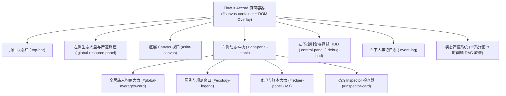
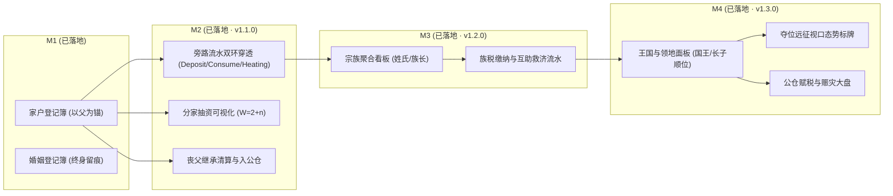
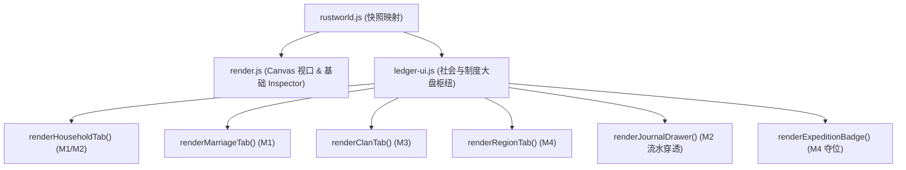
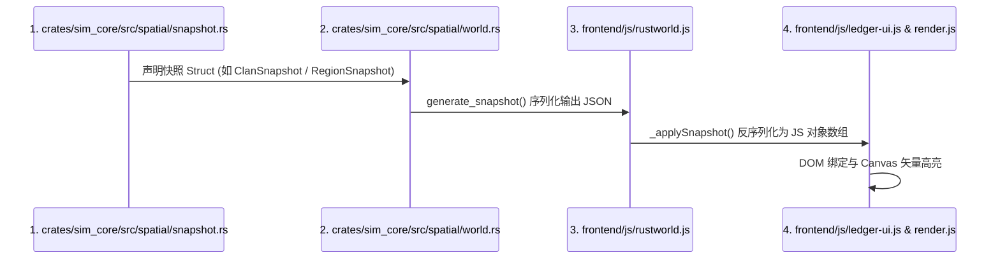
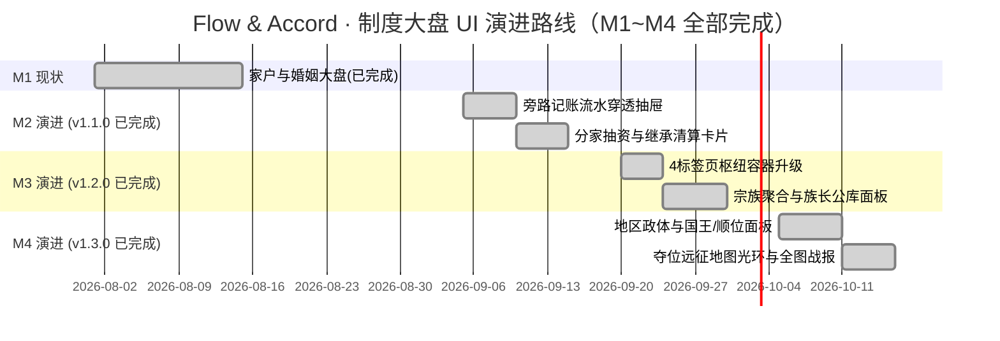

# Flow & Accord · UI 页面全景剖析、制度大盘界面实现与开发指南

> **版本**：v1.3.2 · **定位**：前端 UI 全景解剖说明书 + 制度经济学界面实现说明（M1~M4 全部落地）+ 模块开发落地指南  
> **关联规划**：[`docs/PLAN_LEDGER_REFACTOR.md`](./PLAN_LEDGER_REFACTOR.md) · [`docs/current/07-frontend-ui.md`](./current/07-frontend-ui.md) · [`docs/current/12-ledger-system.md`](./current/12-ledger-system.md)

---

## 目录 (Table of Contents)

1. [📖 第一篇：当前 UI 页面全景剖析（现状拆解）](#1-第一篇当前-ui-页面全景剖析现状拆解)
   - 1.1 [画布视口与 3D 渲染层 (Canvas Viewport)](#11-画布视口与-3d-渲染层-canvas-viewport)
   - 1.2 [顶部玻璃拟态状态栏 (.top-bar)](#12-顶部玻璃拟态状态栏-top-bar)
   - 1.3 [左侧全局生态大盘与产速控制台 (.global-resource-panel)](#13-左侧全局生态大盘与产速控制台-global-resource-panel)
   - 1.4 [右侧动态观察堆栈 (.right-panel-stack)](#14-右侧动态观察堆栈-right-panel-stack)
   - 1.5 [底部生态时钟、控制台与调试监视器 (.control-panel & .debug-hud)](#15-底部生态时钟控制台与调试监视器-control-panel--debug-hud)
   - 1.6 [右下角重大历史事件滚动日志 (.event-log)](#16-右下角重大历史事件滚动日志-event-log)
   - 1.7 [模态弹窗系统 (Lineage Modal & Temporal DAG Family Tree)](#17-模态弹窗系统-lineage-modal--temporal-dag-family-tree)
2. [🎨 第二篇：制度大盘 UI 实现（M1~M4 全落地）](#2-第二篇制度大盘-ui-实现m1m4-全落地)
   - 2.1 [多标签页制度枢纽（Tabbed Society & Ledger Hub）](#21-多标签页制度枢纽-tabbed-society--ledger-hub)
   - 2.2 [M2 界面实现：家庭旁路记账 + 分家抽资 + 丧父继承清算](#22-m2-界面实现家庭旁路记账--分家抽资--丧父继承清算)
   - 2.3 [M3 界面实现：宗族公库 + 族长制 + 族税互助](#23-m3-界面实现宗族公库--族长制--族税互助)
   - 2.4 [M4 界面实现：地区政体 + 国王尊号 + 夺位远征 + 长子继承](#24-m4-界面实现地区政体--国王尊号--夺位远征--长子继承)
   - 2.5 [高保真 ASCII Wireframe 与视觉原型图](#25-高保真-ascii-wireframe-与视觉原型图)
3. [🛠️ 第三篇：新功能 UI 开发实施指南（开发落地指引）](#3-第三篇新功能-ui-开发实施指南开发落地指引)
   - 3.1 [前端架构扩展与模块化分工 (frontend/js/ledger-ui.js)](#31-前端架构扩展与模块化分工-frontendjsledger-uijs)
   - 3.2 [快照三处同步规范清单 (Rust -> Snapshot -> JS -> UI)](#32-快照三处同步规范清单-rust---snapshot---js---ui)
   - 3.3 [CSS 设计系统与组件库规范](#33-css-设计系统与组件库规范)
   - 3.4 [性能与渲染节流硬约束](#34-性能与渲染节流硬约束)
   - 3.5 [阶段性实施路线图与验收门禁](#35-阶段性实施路线图与验收门禁)

---

# 1. 第一篇：当前 UI 页面全景剖析（现状拆解）

当前系统基于纯原生 HTML5 Canvas 2D + DOM 玻璃拟态（Glassmorphism）构建，无任何打包工具（无 Webpack/Vite），采用暗黑赛博生态风格（`#050a12` 背景），兼顾 30FPS 实时渲染与高密度信息透出。



---

## 1.1 画布视口与 3D 渲染层 (Canvas Viewport)

- **容器与元素**：`<div id="canvas-container"><canvas id="sim-canvas"></canvas></div>`
- **坐标映射与投影管线**（`frontend/js/math.js` & `render.js`）：
  - 维持 3D 等轴斜视投影：RotX = 58°，RotZ = 45°；
  - 鼠标滚轮缩放（Zoom 0.25x ~ 3.5x）、右键拖拽或左键平移（PanX, PanY）；
  - **性能优化**：单次全网格顶点投影（`terrainProjX`/`terrainProjY` 预分配缓冲，3600 次投影），视口边界剔除裁剪，单次 `ctx.stroke()` 批处理绘制 60×60 地形网格线。
- **图层渲染顺序**：
  1. **等高线地形图**：低洼谷地（深蓝绿 `#064e3b`）、平缓原野（墨绿 `#065f46`）、高台峻岭（岩灰与山巅白）；
  2. **5 阶贝塞尔路网**：1 阶野径（土灰）、2 阶泥路（琥珀褐）、3 阶石子路（深石青）、4 阶夯土道（青蓝）、5 阶主干道（亮金蓝），恒定屏幕像素宽度，支持鼠标悬浮 Tooltip（`#road-hover-tooltip`）；
  3. **23 处 POI 生态地标**：避风营地（🏕️）、清泉（💧）、浆果丛（🍒）、茂林（🌲）、石矿（🪨）、金矿（🪙）。带外圈脉冲光晕与储量进度弧；
  4. **部落民族人（Agents）**：
     - 男性蓝色边框、女性粉色边框；
     - 状态色彩编码（静坐休养、运水、采果、伐木、采石、淘金、施工建房、修缮）；
     - 特效层：孕妇粉色粒子呼吸光环、分娩彩屑迸发、建房升级施工环进度、运动位移 4 节拖尾；
  5. **私产宅舍（Houses）**：0 级仓库（📦）、1 级茅草房（🛖）、2 级私宅（🏡）、3 级木石庄舍（🏯）、4 级家族大庄园（🏰）、绝嗣废墟（💀）。

---

## 1.2 顶部玻璃拟态状态栏 (`.top-bar`)

位于页面顶部，悬浮横贯，两端对齐，`pointer-events: none`（内部卡片 `pointer-events: auto`）。

### 1. 品牌与版本卡片 (`.brand-card`)
- 标题：`🍼 Flow & Accord · 流动公约` + 动态版本徽章 `<span class="version-tag">v1.3.2</span>`；
- 副标题：`确定性生态演算 · 马斯洛需求层级驱动 · 族群代际繁衍与社会演化`。

### 2. 全局实时态势仪表 (`.stats-card`)
以 10FPS 降频节流更新，在无头模式下依然常驻刷新：
- 活体人口 (`#stat-pop`)：存活部落民总数；
- 🏡 私产宅舍 (`#stat-houses`)：非废墟有效房屋总数；
- 生态地标 (`#stat-pois`)：全图 POI 节点数（固定 23 处）；
- 🏠 存续家户 (`#stat-households`)：M1 账本系统存续家户数（以男性户主为锚）；
- 💍 存续婚姻 (`#stat-marriages`)：M1 婚姻登记簿当前存续中的夫妻对数；
- 🤰 孕妇数 (`#stat-pregnant`)：正在妊娠期的女性数量；
- 🌸 四季与气温 (`#stat-season` & `#stat-temp`)：春夏秋冬 240s 周期与实时摄氏度；
- 👶 累计出生 (`#stat-births`)；
- 💀 累计死亡 (`#stat-deaths`)：带自然老死（☘️ `#stat-deaths-natural`）与饥渴非自然死亡（⚡ `#stat-deaths-unnatural`）分列；
- 🥀 累计流产 (`#stat-miscarriages`)。

---

## 1.3 左侧全局生态大盘与产速控制台 (`.global-resource-panel`)

与顶部品牌卡片等宽（385px）对齐，位于左侧 `top: 88px`：
1. **全图生态健康指示器** (`#global-eco-health`)：实时计算全图可用资源比例，展示「🌿 资源丰盛」、「⚡ 储量紧俏」、「⚠️ 资源枯竭危机」；
2. **5 类生态总余量进度条**：
   - 💧 全图清泉总水量（6 处，上限 360.0）；
   - 🍒 全图成熟浆果量（6 处，上限 360.0）；
   - 🌲 全图林木木材量（3 处，上限 180.0）；
   - 🪨 全图石矿石料量（2 处，上限 120.0）；
   - 🪙 全图金矿黄金量（1 处，上限 60.0）；
3. **5 组玩家产速动态调控滑块**（0.0x ~ 5.0x 步进 0.1）：支持免重编译热更新 WASM 资源再生速率，带「🔄 重置为默认产速」按钮。

---

## 1.4 右侧动态观察堆栈 (`.right-panel-stack`)

右侧垂直流式排列，支持独立折叠/展开与联动追踪：

### 1. 全局族人均值大盘 (`#global-averages-card`)
- 默认折叠，展开后展示：
  - ❤️健康、🍖饱食、💧水分、⚡体力 4 项全图存活均值进度条；
  - ⏳平均年龄、🏃平均移速、👥性别比、🏡有房率、💘成年单身、💑结发夫妻对数；
  - 🎒 随身行囊均值（水、食、木、石、金 5 项）；
  - 🧬 先天禀赋六维均值（智力、力量、魅力、消化、睡眠、寿命，基准 100）。

### 2. 图例与规则窗口 (`#ecology-legend`)
- 默认折叠，展示 23 处 POI 职能、1~5 阶道路等级、冬季供暖柴火门槛（<10 木禁孕）、房屋 0~4 级升级建材要求。

### 3. 家户与账本大盘 (`#ledger-panel`，M1 已落地)
- 默认折叠，徽章实时显示存续家户数（`X户`）；
- 展开后展示：
  - **概览统计行**：存续家户、已解散家户、存续婚姻、累计登记婚姻；
  - **🏠 家户列表**：家户 ID、户主姓名（【姓氏】👑）、成员数、账面总财富、分项 5 资源余额（💧🍒🌲🪨🪙），点击户主名字直接传送并选中对应族人；
  - **💍 婚姻登记簿**：婚姻 ID、丈夫与妻子芯片、婚龄、存续状态（💍存续 / 🕊️丧偶离异）。

### 4. 动态 Inspector 检查器 (`#inspector-card`)
选中目标（族人 / 房屋 / POI）时弹出，支持 `Esc` 或右上角 `✕` 关闭并停止镜头跟随：
- **族人视图 (`#insp-agent-view`)**：
  - **马斯洛需求意图卡片**：展示当前处于 ①生理需求 / ②安全需求 / ③归属与爱 / ④尊重需求 / ⑤自我实现，以及底层具体决策动因文案；
  - **2×2 生存健康指标网格**：❤️健康、⚡体力、🍖饱食、💧水分；
  - **🎒 随身 5 格行囊胶囊**：水(50)、食(50)、木(50)、石(50)、金(无限)，以及实时搬运物流动向（如 `🚚 动向: 前往 🏡 #3 卸货入库`）；
  - **🏠 家户归属卡片**：显示家户 ID、户主、角色（👑户主 / 💍配偶 / 👶子女）、分家来源（分家自 #X）、账面 5 资源余额、最近 5 条家户大事记；
  - **💍 婚姻登记卡片**：存续状态、丈夫/妻子、婚龄、历史多段婚姻列表；
  - **生理状态条**：🤰 妊娠进度条（900s 孕期百分比）、🥀 流产调养倒计时；
  - **底部动作栏**：🎥 镜头跟随开关、🏠 定位私宅、📜 详情 ↗（唤起世系族谱弹窗）。
- **房屋视图 (`#insp-house-view`)**：
  - 🏛️ 房屋耐久度进度条与风化/修缮状态；
  - 5 项独立私有储备仓储（💧水、🍒粮、🌲木、🪨石、🪙金）；
  - 👑 户主确权芯片（点击直接跳转户主）、所属聚落、建筑形态等级、👶 生育激活状态指示（木材供暖与水粮门槛）。
- **地标视图 (`#insp-poi-view`)**：
  - 储量余量进度条与产出速率；
  - 营地专属：行政区升级进度条（营地 0~5 房 / 村 6~11 房 / 乡 12~17 房 / 镇 18~23 房 / 县 24+ 房）。

---

## 1.5 底部生态时钟、控制台与调试监视器 (`.control-panel` & `.debug-hud`)

- **控制台面板**（左下角）：
  - ⏸️ 暂停/继续模拟（空格键快捷触发，带焦点隔离保护）；
  - 🏕️ 重演生态（重新播撒 20 位始祖族人）；
  - 🧠 **无头模式 (Headless Mode)**：只推进 Rust 内核模拟与顶栏数据，跳过全部画布渲染，供长程快速演化；
  - 视图开关：👤 隐藏部落民、🛣️ 隐藏路网、🐞 调试监视器；
  - ⚡ 模拟演化倍速下拉选框（1x ~ 1024x 八档，WASM 同帧多步步进）。
- **🐞 调试监视器 HUD (`#debug-hud`)**：
  - 模拟 Tick、每秒真实 Tick 推进速率（含倍速加成）、渲染 FPS；
  - 内核步进耗时（`tickMs`）、快照解析耗时（`snapMs`）、渲染耗时（`renderMs`）、整帧耗时与 CPU 占用率；
  - JS 堆内存占用与 WASM 线性内存大小。

---

## 1.6 右下角重大历史事件滚动日志 (`.event-log`)

实时滚动播报部落重大演化历史（定居立宅、结发成婚、怀胎受孕、瓜熟分娩、房屋扩建升级、冻馁丧生、老病仙逝等），最多保留 8 条，带色彩标签（`camp`/`house`/`death` 等）。

---

## 1.7 模态弹窗系统 (Lineage Modal & Temporal DAG Family Tree)

### 1. 部落民世系详情弹窗 (`#lineage-modal`)
- 族人核心档案、马斯洛状态徽章；
- 🧬 先天六维禀赋雷达数据网格；
- 关系网四宫格：👴 父亲、👩 母亲、💍 配偶、🏠 私宅，以及 👶 全部后代子嗣列表（点击亲眷芯片可无缝切换视角）。

### 2. 直系血脉确定性时间轴 DAG 族谱 (`#full-dag-modal` & `dag-standalone.js`)
自 v0.9.64 起采用**确定性时间轴布局**，彻底废除不可控的力导向算法：
- **Y 严格线性映射出生时刻**：`Y = (birthTick - tickMin) * PX_PER_TICK`，先辈必在上，后代必在下；
- **X 坐标横向拓扑冲突消解**：父系主脉居中，核心家庭分组居中，整数列探测与两轮局部松弛；
- **视口虚拟化 + 3 档 LOD 分级渲染**：仅挂载可视区域卡片，缩放 <0.45 纯色块、0.45~0.75 简档、>0.75 全功能卡片；
- **左侧自适应时间刻度尺**：季/年/5/10/25/50/100 年自适应切换；
- **直系血脉单图**：仅展示焦点族人的递归祖先链与递归后代链，杜绝千人全图节点爆炸；
- **新标签页独立打开**：支持将族谱单独在新浏览器 Tab 渲染，与主地图主副双屏联动。

---

# 2. 第二篇：制度大盘 UI 实现（M1~M4 全落地）

在 [`docs/PLAN_LEDGER_REFACTOR.md`](./PLAN_LEDGER_REFACTOR.md) 中，M1~M4 已全部完成（M1 团体基类/婚姻登记/家户体系/胎儿 Agent 身份 → M4 地区王国）。本篇对 **M2（旁路记账与分家继承）、M3（宗族与族长制）、M4（地区团体与国王政体）** 的 UI/UX 实现架构与视觉交互进行完整说明——以下界面均已落地于 `frontend/js/ledger-ui.js`。



---

## 2.1 多标签页制度枢纽 (Tabbed Society & Ledger Hub)

### 为什么是多标签页？
右侧面板容器在 M1 只有一个折叠式的 `ledger-panel`，仅能罗列家户与婚姻两条简单列表。演进至 M2~M4 后：
1. **信息维度剧增**：新增了宗族（Clan）、行政领地/王国（Region）、公仓金库、王位顺位链、分家世系；
2. **纵向滚动失控**：如果在单一面板内垂直无限堆叠列表，会导致用户频繁上下拖动，交互体验崩溃；
3. **职责隔离清晰**：家户（私有血缘家庭）、婚姻（两性契约）、宗族（同姓父系联盟）、地区（地缘政体与公权力）属于四个不同层级的社会制度。

### 实现方案：4 标签页「🏛️ 社会与经济制度大盘」
将 `ledger-panel` 重构为带有分段选项卡（Tab Switcher）的制度大盘容器（已落地于 `ledger-ui.js`）：

| 标签页 ID | 名称 | 图标 | 主题色彩 | 核心展示内容 | 对应里程碑 |
| :--- | :--- | :--- | :--- | :--- | :--- |
| `tab-household` | **家户** | 🏠 | 琥珀金 `#f59e0b` | 存续/已解散家户、分家支系树、账面余额、流水穿透抽屉 | M1 / M2 |
| `tab-marriage` | **婚姻** | 💍 | 浪漫粉 `#ec4899` | 存续中婚姻、终身多段历史留痕、平均婚龄、离异/丧偶率 | M1 |
| `tab-clan` | **宗族** | 🛡️ | 翡翠青 `#10b981` | 同姓宗族聚合、世袭族长、族库金库、族税征缴、互助基金 | M3 (v1.2.0) |
| `tab-region` | **王国** | 👑 | 皇家金 `#fbbf24` | 5 大营地王国、当朝国王、长子顺位链、夺位远征中族人、公仓与赋税救济 | M4 (v1.3.0) |

---

## 2.2 M2 界面实现：家庭旁路记账 + 分家抽资 + 丧父继承清算

### 1. 旁路双环记账流水穿透抽屉 (Double-Entry Journal Viewer)
- **触发位置**：点击任一家户卡片或 Agent Inspector 的「📒 账面余额」区域；
- **展示形态**：向下滑出抽屉式流水列表（从环形缓冲区拉取最近 32 笔）：
  - `Deposit`（📥 成员运货回填）：`[Tick 1420] 成员 #3 存入 💧+15.0 (运水回宅)`
  - `Consume`（🍽️ 生活消耗）：`[Tick 1500] 成员 #1 消耗 🍒-2.5 (就餐)`
  - `Heating`（🔥 冬季采暖）：`[Tick 1800] 冬季供暖消耗 🌲-0.12/s`
  - `Construction` / `Maintenance`（🔨 营建修缮）：`[Tick 2100] 茅草房升级私宅 🌲-25.0`
  - `Split`（✂️ 分家出资）：`[Tick 3200] 子代 #5 成年分家 支出份额 [💧-4.2, 🍒-6.0, 🌲-3.1]`
  - `Inheritance`（⚰️ 丧父清算）：`[Tick 4500] 户主 #1 离世，家产平分予 3 位子女各 1/3`

### 2. 分家抽资（$W = 2 + n$）可视化弹窗/卡片
- 当男性族人满足 `age >= 1800`（成年）或父亲亡故触发自主分家时，产生分家事件。
- **UI 交互表现**：
  - 在家户大事记与事件播报中高亮提示：`✂️ 部落民 #5 自立门户（新家户 #8），分得原家户 #2 资产的 1/4（权重比 2:1:1:1）`；
  - 鼠标悬浮分家标记时弹出公式气泡：
    $$\text{总权重 } W = 2(\text{父}) + 1(\text{长子}) + 1(\text{次子}) + 1(\text{胎儿}) = 5 \implies \text{抽资比例 } 20\%$$
  - 在族谱 DAG 图上，分家节点旁出现分支图标 `🌱`，点击可直接展开新家户档案。

### 3. 丧父继承清算与入公仓档案
- 户主去世时：
  - **有在世子一代**：家产等额平分流水明细，家户状态打上 `[已解散 · 遗赠分配完毕]` 灰色标签；
  - **绝嗣（无在世子女）**：家产全额并入公仓流水：`🏛️ 绝嗣清算：家户 #4 剩余资产全部充入 【桃源营地】公仓`。

---

## 2.3 M3 界面实现：宗族公库 + 族长制 + 族税互助

### 1. 宗族聚合看板 (`tab-clan`)
- **宗族卡片**：
  - 族徽与宗族名号：如 `🛡️「姬」氏宗族`、`🛡️「姜」氏宗族`；
  - **👑 族长尊号**：显示同姓在世最年长男性头像与 ID（如 `族长: Agent #3 (72岁/始祖)`）；
  - **宗族规模**：涵盖家户数（`8 户`）、族人总数（`24 人`）；
  - **宗族公库储备仪表**：💧水 / 🍒食 / 🌲木 / 🪨石 / 🪙金 5 类资源族库总额；
  - **族长顺位列表**：展开查看排名前 3 的顺位继承人（按年龄降序、男性、健在、并列取 ID 小者）。

### 2. 族税与互助流水监控
- **族税征收进度条**：各家庭按 `config.clan_tribute_rate` 向宗族公库上缴比例；
- **互助救济动态气泡**：当某成员家庭粮食/木材枯竭时，族长自动签发 `MutualAid` 救济，界面跳出绿色救济流向动画：`🛡️ 宗族救济: 「姬」氏族库拨付 🍒+15.0 -> 极贫家户 #6`。

---

## 2.4 M4 界面实现：地区政体 + 国王尊号 + 夺位远征 + 长子继承

### 1. 地区/王国政体面板 (`tab-region`)
- **5 大行政区卡片**（对应 5 处营地）：
  - 行政等级徽章：🏕️ 原始营地 → 🏘️ 村落 → 🏬 乡集 → 🏙️ 集镇 → 🏛️ 县邑/王国；
  - **👑 国王/领主头像卡片**：展示国王名号、登基时刻、在位年限；
  - **到达时序表 (Arrival Order)**：始祖播撒序与新生儿出生序列；
  - **长子继承顺位树**：国王直系长子 → 长孙 → 幼子 → 元老到达顺位；
  - **地区公仓储备**：大宗公仓物资及周期性税收流水（`Tax`）与赈灾拨付（`Relief`）。

### 2. ⚔️ 夺位远征视口地图动态标牌
- 当王位空悬（无主营地）时，由决策分支 `B14SeekThrone`（生理层最高档）驱动：在世成年男性非国王且存在空缺王位营地（有房者仅夺自家房屋所在营地、无房/废墟可夺任意）时，决策器选定最近可夺位营地发起夺位远征；
- **地图视口动态效果**：
  - 夺位者头顶浮现金色战盔标牌：`⚔️ 冲刺夺位中 -> 桃源营地`；
  - 画布上自夺位者脚下向目标营地绘制金色虚线光束；
  - 率先抵达者登基瞬间，视口炸开金色礼花，全图播报：`👑 胜者为王：部落民 #8 率先抵达，登基为【桃源王国】第一任国王！`。

---

## 2.5 高保真 ASCII Wireframe 与视觉原型图

### 1. 制度枢纽 4 标签页大盘布局 (Society & Ledger Hub)

```text
+-------------------------------------------------------------------+
| 🏛️ 社会与经济制度大盘 (Society & Ledger Hub)              [ - ] [ X ] |
+-------------------------------------------------------------------+
| [ 🏠 家户(12) ]  [ 💍 婚姻(8) ]  [ 🛡️ 宗族(3) ]  [ 👑 王国(5) ]    |  <-- Tab Switcher
+-------------------------------------------------------------------+
| 📌 宗族大盘视图 (TAB: 🛡️ 宗族)                                      |
| +---------------------------------------------------------------+ |
| | 🛡️「姬」氏宗族                      👑 族长: Agent #3 (68岁)   | |
| | 👥 辖属 6 户 (18人)                 💰 族库总额: 186.5 单位    | |
| | ------------------------------------------------------------- | |
| | 💧 45.0  | 🍒 62.0  | 🌲 50.0  | 🪨 20.0  | 🪙 9.5           | |
| | [ 族内互助基金: 充足 🟢 ]            [ 族税征缴率: 5% / 季 ]     | |
| | 📜 近期流向:                                                   | |
| |  · [Tick 3200] 互助救济 -> 家户 #4 (🍒+15.0 过冬度荒)           | |
| |  · [Tick 2900] 族税上缴 <- 家户 #2 (🪙+2.0 贡金)               | |
| +---------------------------------------------------------------+ |
| +---------------------------------------------------------------+ |
| | 🛡️「姜」氏宗族                      👑 族长: Agent #7 (54岁)   | |
| | 👥 辖属 4 户 (11人)                 💰 族库总额: 94.0 单位     | |
| | 💧 20.0  | 🍒 35.0  | 🌲 25.0  | 🪨 10.0  | 🪙 4.0           | |
| +---------------------------------------------------------------+ |
+-------------------------------------------------------------------+
```

### 2. 地区与王权面板布局 (TAB: 👑 王国)

```text
+-------------------------------------------------------------------+
| 🏛️ 桃源王国 (5阶 县邑/王国)              🏛️ 辖区私宅: 26 间       |
+-------------------------------------------------------------------+
| 👑 当朝国王: 部落民 #1【姬】(在位 12年)  ⚔️ 王权状态: 稳固统治    |
| 📜 王位顺位: ① 长子 #9  ② 长孙 #21  ③ 幼子 #14  ④ 元老 #2(按序)    |
+-------------------------------------------------------------------+
| 🏛️ 国库公仓总储量 (公共赈灾与修路基金)                             |
| 💧 120.0     🍒 150.0     🌲 85.0      🪨 60.0      🪙 32.0       |
+-------------------------------------------------------------------+
| 📜 王权政令与大宗流水:                                            |
|  · [Tick 4100] 普发冬赈: 公仓拨付 🌲-20.0 救济受冻贫民家户        |
|  · [Tick 3800] 征收公仓税: 全境 26 户共计纳粮 🍒+26.0             |
|  · [Tick 3100] 先王仙逝，长子 #1 依长子继承制登基为王             |
+-------------------------------------------------------------------+
```

---

# 3. 第三篇：制度大盘 UI 开发实施总结（开发落地指引）

本篇章记录了 M1~M4 制度大盘前端界面的落地过程与规范，为后续新增社会制度 UI（M5+ 专利经济、M6 六维政体等）提供可复用的模块化分工、快照同步清单与性能硬约束。

---

## 3.1 前端架构扩展与模块化分工 (`frontend/js/ledger-ui.js`)

根据 **AGENTS.md §4.6「单文件严控在 800 行以内」** 的规范，`render.js` 已达 2000+ 行，M2~M4 复杂 UI 逻辑已抽离至独立模块：

### 已实施的拆分方案
新建 `frontend/js/ledger-ui.js`（818 行），将社会制度与账本大盘 UI 从 `render.js` 中抽离：



- **`frontend/js/ledger-ui.js` 职责（已实现）**：
  1. 管理 4 标签页的切换状态（`activeTab`）；
  2. 渲染 家户/婚姻/宗族/王国 四大面板及列表 DOM；
  3. 渲染流水穿透抽屉与分家计算器（W=2+n）；
  4. 渲染地图视口上的夺位远征光束、金色战盔标牌与登基礼花粒子。
- **`index.html`** 已新增对应面板容器与 `<script>` 标签；**`style.css`** 已扩展 927+ 行暗黑赛博玻璃拟态样式。

---

## 3.2 快照三处同步规范清单 (Rust -> Snapshot -> JS -> UI)

新增任何账本、宗族或政体字段时，**必须且只能严格按照三处同步规范**（根 AGENTS.md §4.5）：



### M2~M4 快照结构体（已落地，与 `snapshot.rs` 实际定义一致）

> 以下为 v1.3.0 实际落地的快照结构（注意：`TransferRecordSnapshot.from/to` 为字符串化主体标识，非整数；`ClanSnapshot` 用 `member_ids` 而非家户 ID 列表）。完整字段见 [`docs/current/12-ledger-system.md`](./current/12-ledger-system.md)。

#### 1. M2 账本流水快照 (`TransferRecordSnapshot`)
```rust
// snapshot.rs
#[derive(Debug, Clone, Serialize, Deserialize)]
pub struct TransferRecordSnapshot {
    pub tick: u64,
    pub resource: String,   // "Water" / "Food" / "Wood" / "Stone" / "Gold"
    pub amount: f32,
    pub from: String,       // 付出方主体（字符串化，如 Personal(3) / Family(2) / Clan("姬") / Region(1)）
    pub to: String,         // 接收方主体（字符串化）
    pub reason: String,     // "Deposit" / "Consume" / "Split" / "Inheritance" 等
}
```

#### 2. M3 宗族快照 (`ClanSnapshot`)
```rust
// snapshot.rs
#[derive(Debug, Clone, Serialize, Deserialize)]
pub struct ClanSnapshot {
    pub surname: String,
    pub leader_id: Option<AgentId>,  // None = 无主账本冻结
    pub member_count: u32,
    pub member_ids: Vec<AgentId>,
    pub balances: Vec<LedgerBalanceSnapshot>,
    pub recent_journal: Vec<TransferRecordSnapshot>,
    pub recent_events: Vec<String>,
}
```

#### 3. M4 地区/政体快照 (`RegionSnapshot`)
```rust
// snapshot.rs
#[derive(Debug, Clone, Serialize, Deserialize)]
pub struct RegionSnapshot {
    pub camp_id: u32,
    pub camp_name: String,
    pub king_id: Option<AgentId>,
    pub regime: String,            // "Kingdom"
    pub succession: String,        // "Primogeniture"
    pub member_count: u32,
    pub arrival_order: Vec<AgentId>,       // 到达时序前10
    pub heir_candidates: Vec<AgentId>,     // 顺位前3继承人
    pub balances: Vec<LedgerBalanceSnapshot>,
    pub recent_journal: Vec<TransferRecordSnapshot>,
    pub recent_events: Vec<String>,
    pub active_expedition_agents: Vec<AgentId>, // 正在冲向该营地夺位的族人
}
```

---

## 3.3 CSS 设计系统与组件库规范

所有新 UI 组件必须使用项目现有的暗黑赛博玻璃拟态（Dark Glassmorphism）设计语言，严禁引入未经定义的亮色大底色。

### 1. 配色规范
- **背景底色**：`rgba(10, 18, 30, 0.96)`；
- **边框与阴影**：`border: 1px solid rgba(255, 255, 255, 0.12); box-shadow: 0 8px 32px rgba(0, 0, 0, 0.6);`；
- **业务语义色彩**：
  - 🏠 家户主题：琥珀金 `#f59e0b` / `rgba(245, 158, 11, 0.2)`
  - 💍 婚姻主题：浪漫粉 `#ec4899` / `rgba(236, 72, 153, 0.2)`
  - 🛡️ 宗族主题：翡翠绿 `#10b981` / `rgba(16, 185, 129, 0.2)`
  - 👑 王权主题：皇家金 `#fbbf24` / `rgba(251, 191, 36, 0.2)`
  - 💧 水资源：`#38bdf8`
  - 🍒 粮食资源：`#10b981`
  - 🌲 木材资源：`#d97706`
  - 🪨 石料资源：`#94a3b8`
  - 🪙 黄金资源：`#fbbf24`

### 2. 交互芯片 (`.lineage-chip` 体系)
任何出现族人 ID 的位置，必须包装为 `.lineage-chip`，绑定 `data-agent-id`：
- 支持鼠标悬浮高亮；
- 支持点击直接将主地图视口平移并选中该族人；
- 死亡族人自动附加 `.dead` 类，显示为灰暗删除线风格。

---

## 3.4 性能与渲染节流硬约束

1. **DOM 更新必须降频节流**：
   - 制度大盘（Households/Clans/Regions）与顶栏一样，必须在 `render.js` 主循环中以 **10FPS（每 100ms 一次）** 节流更新，严禁随 30FPS Canvas 每帧操作 DOM。
2. **面板折叠状态跳过渲染**：
   - 当 `.ledger-panel` 处于 `.minimized` 折叠态时，除了更新标题栏的简单计数徽章外，**必须直接 return**，跳过内部复杂的 DOM 拼接与 Diff。
3. **列表虚拟化与截断保护**：
   - 超过 20 条的列表必须进行截断显示（如 `... 另有 X 户未展示`），或采用轻量级虚拟列表，避免几百代演化后 DOM 节点数突破数千导致浏览器掉帧卡死。
4. **确定性与零额外 RNG**：
   - 前端所有排序展示（如族长顺位、继承人顺位）必须与 Rust 内核确定性算法保持一致（如并列时按 ID 从小到大排序），禁止在 JS 端使用非稳定排序。

---

## 3.5 阶段性实施路线图与验收门禁



### 交付门禁（每次代码提交前必检）
1. **配置一致性校验**：`node tools/config-check.js` 必须 163/163 字段完全匹配；
2. **WASM 与引擎确定性测试**：`node tools/test-wasm.js` 必须输出 `ALL_TESTS_DONE`（0 越界、0 NaN、同种子逐字节一致）；
3. **WASM 双副本同步**：`frontend/rust/sim_wasm.wasm` 与 `frontend/sim_wasm.wasm` 必须同步更新；
4. **版本号自增与文档同步**：同步更新 `index.html`、`AGENTS.md`、`docs/current/11-changelog.md`。

> ✅ M1~M4 界面已全部按此路线落地（`ledger-ui.js` 4 标签页枢纽 + Canvas 夺位特效），上述 gantt 中的任务均已 `done`。
