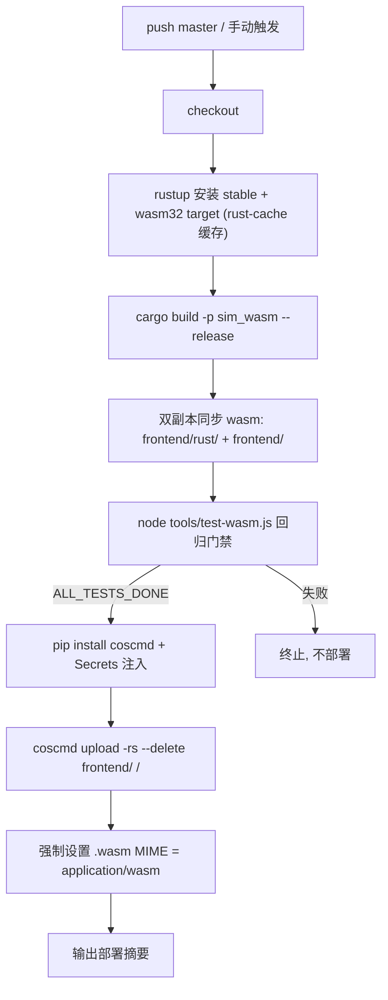

# CI/CD 自动部署指南（GitHub Actions → 腾讯云 COS）

> 本指南说明 Flow & Accord 的自动化部署流程：push 到 `master` 分支后，GitHub Actions 自动完成 **WASM 编译 → 回归测试 → 上传 `frontend/` 静态产物到腾讯云对象存储（COS）**。
> 工作流文件：[`.github/workflows/deploy.yml`](../.github/workflows/deploy.yml)

---

## 1. 流水线概览

| 环节 | 说明 |
| :--- | :--- |
| 触发条件 | `push` 到 `master`；`test` 分支推送**不会**触发部署；支持在 Actions 页面手动 `Run workflow` |
| 构建 | CI 使用标准 rustup（非本机 `.toolchain/` 便携链），`Swatinem/rust-cache` 加速增量编译 |
| 门禁 | `node tools/test-wasm.js`（同种子逐字节确定性 + 长程稳定），不通过则不上线 |
| 上传 | 腾讯云官方 `coscmd`（pip 安装），`--delete` 增量同步整目录 |
| 并发控制 | 同分支连续 push 自动取消旧的进行中部署 |

---

## 2. 你需要配置的环境变量（GitHub Secrets）

配置入口：**GitHub 仓库页面 → Settings → Secrets and variables → Actions → `New repository secret`**，逐条添加以下 4 个 Secret：

| Secret 名称 | 必填 | 说明 | 示例 |
| :--- | :--- | :--- | :--- |
| `COS_SECRET_ID` | ✅ | 腾讯云 API 密钥 **SecretId**（[控制台 - API 密钥管理](https://console.cloud.tencent.com/cam/capi) 获取） | `AKIDxxxxxxxxxxxxxxxx` |
| `COS_SECRET_KEY` | ✅ | 腾讯云 API 密钥 **SecretKey** | `xxxxxxxxxxxxxxxx` |
| `COS_BUCKET` | ✅ | 桶名（完整格式为 `名称-APPID`，在桶的概览页可见） | `flow-and-accord-1250000000` |
| `COS_REGION` | ✅ | 桶所在地域简称 | `ap-guangzhou`、`ap-shanghai`、`ap-beijing` 等 |

> ⚠️ **安全建议**：
> - 不要使用主账号密钥，建议在 [CAM 子账号](https://console.cloud.tencent.com/cam) 创建专用子用户，仅授予该桶的 `cos:*`（或至少 `PutObject / DeleteObject / ListBucket`）权限；
> - Secrets 在 Actions 日志中会被自动脱敏，但请勿将密钥写入代码、文档或本地提交。

> ⚠️ **格式要求（实测踩坑）**：
> - `COS_BUCKET` 必须为**全小写** `名称-APPID`（如 `flow-and-accord-1250000000`）——COS 访问域名仅支持小写字母/数字/连字符，**含大写字母的桶名会导致 DNS 解析失败**（`Failed to resolve ... myqcloud.com`）；
> - 勿填完整域名或 `https://` 前缀，勿用下划线或中文；
> - `COS_REGION` 填地域**简称**（如 `ap-guangzhou`），不是中文名（"华南"）；
> - 所有值**首尾不要带空格或引号**（流水线预检步骤会自动去空白并做格式 + DNS 预解析校验，错误时秒级报出中文指引）。

### 可选：修改触发行为

- 想改为「push test 也部署」：在 `deploy.yml` 的 `on.push.branches` 中加入 `test`；
- 想只在代码变更时部署（忽略文档改动）：在 `on.push` 下添加 `paths-ignore: ['docs/**', '**.md']`。

---

## 3. COS 侧一次性准备（控制台操作）

部署仅上传文件，页面访问需在桶上开启静态网站，请在腾讯云控制台完成以下设置：

1. **创建/选择桶**：私有读写即可部署上传，但**静态网站访问需设为"公有读私有写"**（或在静态网站设置中开启公开访问）；
2. **开启静态网站**：桶 → 基础配置 → 静态网站 → 开启；
   - **索引文档**：`index.html`
   - **错误文档**：`index.html`（单页应用兜底）
3. 记下分配的**静态网站域名**（形如 `https://flow-and-accord-1250000000.cos-website.ap-guangzhou.myqcloud.com`），这就是访问地址；
4. （可选但推荐）若要绑定自定义域名 + HTTPS，需另配 CDN，本项目当前不纳入范围。

---

## 4. `.wasm` MIME 说明

浏览器加载 WebAssembly 模块时要求响应头 `Content-Type: application/wasm`，否则流式编译会失败。

- 工作流在上传后会**强制覆写**两个 wasm 副本（`/rust/sim_wasm.wasm` 与 `/sim_wasm.wasm`）的 Content-Type 为 `application/wasm`，通常无需手动处理；
- 若仍遇到 `CompileError: Invalid WebAssembly`，请在 COS 控制台对应对象 → 设置自定义 Header `Content-Type: application/wasm` 检查。

---

## 5. 使用方式

| 操作 | 方法 |
| :--- | :--- |
| 自动部署 | 合并/推送代码到 `master`，Actions 自动运行 |
| 手动部署 | 仓库 Actions 页 → 选 `Deploy to COS` → `Run workflow` |
| 查看进度 | 仓库 Actions 页查看各 Job 日志；成功后 Job Summary 显示部署版本与桶信息 |
| 版本确认 | 打开静态网站域名，页面右上角版本徽章应与 `frontend/index.html` 一致 |

> 💡 **刷新提示**：COS 与浏览器均有缓存，更新后如页面未变化，浏览器按 `Ctrl + F5` 强刷；如需彻底避免静态资源缓存问题，可在 COS 控制台为 `index.html` 设置 `Cache-Control: no-cache`。

---

## 6. 故障排查

| 现象 | 可能原因与处理 |
| :--- | :--- |
| `test-wasm.js` 门禁失败 | 确定性/越界/NaN 回归未通过，属代码问题，修复后再推送；日志中的 `DETERMINISM FAILED` / `NAN FOUND` 等关键词定位 |
| `coscmd` 403 / 签名错误 | 检查 4 个 Secrets 是否齐全、密钥是否有效、子账号是否有该桶写权限、`COS_BUCKET` 是否为 `名称-APPID` 完整格式 |
| **exit 253 + `please make sure [y/N]`**（实测 v0.9.68） | `coscmd upload --delete` 在删除远端多余文件前会交互确认，runner 无 stdin 导致失败；已在 workflow 的 upload 命令中加 `-y`（Skip confirmation）修复，勿移除 |
| **`Failed to resolve *.cos.*.myqcloud.com`（DNS 解析失败）**（实测 v0.9.68） | 几乎必为 Secret 值格式错误（myqcloud.com 全球可解析），按序检查：① 桶名含大写字母/下划线；② 缺 `-APPID` 后缀或误填完整域名/https 前缀；③ 地域填了中文或错误码；④ 值首尾带空格/引号。v0.9.69 起流水线在上传前做「格式正则 + DNS 预解析」预检，失败时直接给出中文指引，无需等逐文件报错 |
| 页面 404 | 静态网站未开启，或索引文档未设为 `index.html` |
| 页面能开但模拟器不运行（wasm 报错） | 见第 4 节 MIME 排障；另确认 `rust/sim_wasm.wasm` 已上传 |
| 页面是旧版本 | 取消的并发部署可能未完成；在 Actions 页确认最新一次运行成功，浏览器强刷 |
| 编译缓慢 | 首次构建无缓存属正常，后续 `Swatinem/rust-cache` 会命中缓存 |
