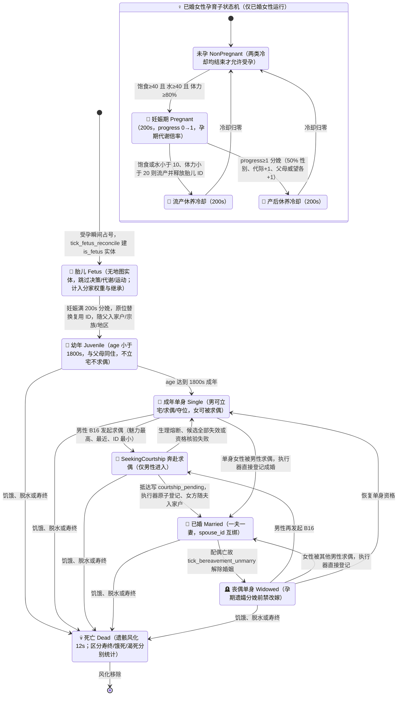

# 4. 🧬 部落民生理代谢、繁衍与寿命 (`agent`)

> **模块索引**：[← 返回 current.md 全景索引](../current.md) · 主要源码：`crates/sim_core/src/spatial/agent.rs`、`birth.rs`、`housing_system/marriage.rs`

---

## 模块定位

部落民个体的生理状态机、生命周期与繁衍系统。涵盖健康/饱食/水分/体力四项生理指标的代谢结算、年龄两性分化、婚姻改嫁与孕育分娩、先天禀赋遗传，以及死亡后的尸体风化。

## 核心机制

### 生理基础指标

| 指标 | 容量 | 代谢速率 | 归零后果 |
| :--- | :--- | :--- | :--- |
| ❤️ 健康 (`health`) | = 先天寿命 | 0.02/s 自然衰减（不可补充） | 寿终正寝 |
| 🍖 饱食 (`hunger`) | 0~50.0 | 0.10/s（孕期 0.125/s） | 饿死 |
| 💧 水分 (`thirst`) | 0~50.0 | 0.10/s（孕期 0.125/s） | 渴死 |
| ⚡ 体力 (`stamina`) | 0~100% | 劳作/移动消耗，休息恢复 | 无法劳作 |

- 初始族人按开局年龄折减初始健康，寿命约 5000s（150,000 ticks）。
- 新生始祖饱食/水分基线提升至 45.0，并随身携带满额水粮；新生儿仍按独立的新生儿参数初始化。

### 随身行囊（真实搬运）
- 水/粮/木/石：每类独立容量 50.0，互不共享；回家休整时按 10.0/s 卸货存入家宅仓库。
- 黄金：容量无限，单趟运满 20 回宅，卸货 5.0/s。
- 无家宅者不装包，只在现场就地自饮自食。
- ★ v1.26.3 调试口径：`Agent3D.cumulative_mined`（合计）+ `cumulative_mined_water/food/wood/stone/gold`（分品种）累计本 agent 一生装载入行囊的资源总量（市场购买与就地自饮自食不计入），随快照下发供调试模式分品种展示，不参与任何行为结算。
- 详见根 AGENTS.md §4.4。

### 年龄与两性分化
- 0~1800s 为幼年期，未成年子女与父母同住共享私宅。
- ≥1800s 为成年期；初始 20 名始祖（10男10女）开局年龄 1800s。
- 只有成年男性可拥有房屋；女性（含遗孀、女儿）不能拥有私宅，丧偶或未婚时住营地或改嫁入驻有房男性私宅。

### 婚姻、改嫁与繁衍
- 拥有 1 级以上私宅的成年单身/丧偶男性自动就近迎娶营地中的成年单身/丧偶女性。成婚由 `housing_system/marriage.rs` 每 tick 扫描匹配，与建房/升级事件解耦。
- **受孕门槛（★ v1.28.0）**：由男性户主在 `B18RaiseChild` 分支发起养育行动并令配偶受孕，条件为——① 男方（户主）名下须有 **≥1 级私宅**（0 级仓库与无房者不生育）；② 妻子为成年已婚女性且饱食 ≥ 40.0、水分 ≥ 40.0、体力 ≥ 80%；③ 流产后休养冷却 200s、**分娩后产后休养冷却 200s**，两类冷却期内禁止再次受孕。
- **妊娠期 200s**：孕妇头顶显示孕育进度环与粉色光晕。
- **分娩**：在家庭私宅诞生新生儿（50%男/50%女），代际 = max(父代, 母代) + 1，始祖为第 1 代。
  - ★ M2/M3/M4 出生归属钩子：新生儿随父入父亲家户（无家户则先为父立户）、随父姓入宗族、入父亲所在地区；`arrival_tick` = 出生时 tick。
- **孕期禁改嫁**：丈夫在妊娠期内离世，怀孕女性在分娩前不可改嫁；新生儿继承真实生父 ID，分娩后母亲恢复单身待改嫁资格。
- 婚姻登记的完整权责记录见 [12-ledger-system.md](./12-ledger-system.md)。

### 生命周期与孕育状态机

> 状态与阈值对照源码 `agent.rs::tick_metabolism`、`birth.rs::resolve_newborns`、`decisions/branches.rs`（B16）与 `scheduler.rs::execute_pending_courtships`；时间常量权威定义在 `config.rs`（成年 1800s、孕期 200s、流产/产后冷却各 200s、遗骸风化 12s）。求偶/成婚的动作层状态见 [06-motivation-ai.md](./06-motivation-ai.md) 的行动状态机总图。

### 先天禀赋（6 项）
每位族人携带：🧠智力 / 💪力量 / ❤️‍🔥魅力 / 🍽️消化效率 / 😴睡眠效率 / ⏳预期寿命。
- 始祖代按 N(100, 20) 正态分布 roll，clamp 10~190。
- 新生儿各属性取父母均值再叠加 ±[0,10] 均匀偏移。
- **消化效率**参与代谢结算：饱食消耗速率 = 0.10/s / (消化效率/100)，高消化效率者耐饿。
- **睡眠效率**参与休息结算：体力恢复速率 = 8.0%/s × (睡眠效率/100)。
- **力量**影响行走速度：速度 = 默认速度 × 道路等级系数 × (力量/100)。

### 尸体风化
饥荒或脱水死亡后遗骸保留 12s 逐渐风化消散，配偶自动恢复单身。死亡区分自然死亡（寿终）与非自然死亡（饿死/渴死），顶栏分别统计。

## 关键不变量
- 健康值不可通过进食或休息补充，仅随时间线性衰减。
- 只有男性可拥有房屋；女性改嫁后随夫入家户（家庭跟着男人走）。
- 胎儿在受孕时即建 agent 实体（v1.3.5 `is_fetus=true`），未出生孩子计入分家权重与**继承分配**；胎儿无需求消耗、无地图实体、跳过决策，出生原位替换复用 ID。
- 初始族人为 20 名（10男10女），非 12 名。
- ★ 新生儿出生即入父亲家户 / 宗族 / 地区，`arrival_tick` 随出生登记（始祖 = 0）。

## 与其他模块接口
- `decisions/`：读取生理指标驱动马斯洛需求评估（含 ★M4 夺位远征）。
- `ecology.rs`：POI 采收装载、回家卸货、仓库自饮自食；始祖播撒入宗族/地区。
- `birth.rs`：妊娠结算与分娩，新生儿属性遗传 + 家户/宗族/地区归属。
- `housing_system/marriage.rs`：成婚匹配与丧偶改嫁。
- `ledger/`：婚姻登记、家户、宗族、地区王国的权责记录。
- `bookkeeping.rs`：出生后分家/继承等家户经济规则。
- `snapshot.rs`：生理指标、行囊、禀赋、家户/宗族/地区归属随快照下发。

## 调参入口
生理代谢、容量、繁衍门槛、遗传参数、行囊容量等见 [config-reference.md](../config-reference.md) 第 2、3 分区。
