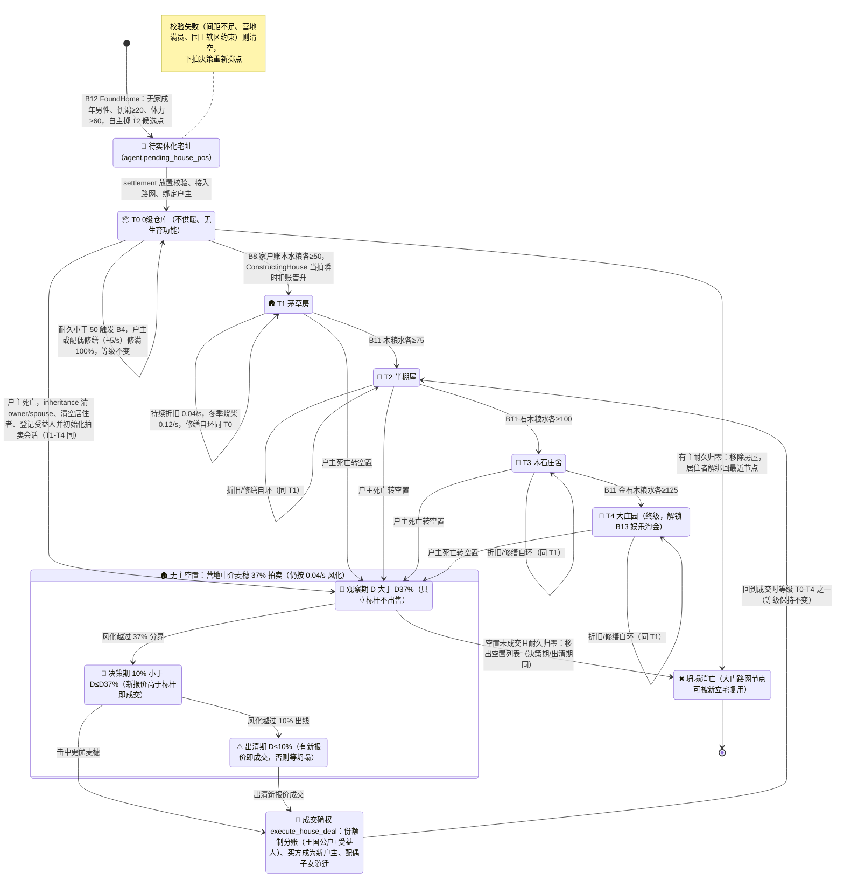

# 5. 🏡 多级私产房屋与建材升级体系 (`house`)

> **模块索引**：[← 返回 01-current.md 全景索引](../01-current.md) · 主要源码：`crates/sim_core/src/spatial/house.rs`、`housing_system/`（6 子模块）

> ⚡ **M6（v1.4.0）机制更新**：房屋已**完全去仓储化**——`House.pantry_*/max_pantry_*`、`is_pantry_full`、`is_fertility_active` 全部删除，家庭物资唯一真相源是**家户账本**（`Household.group.ledger`）；房屋回归纯建筑角色（等级/耐久/位置/户主/代际）。升级改为**瞬时化**：`BuildHouse` 决策就绪后一次性扣账晋升、无体力无工时；房屋每晋升一级户主威望（prestige）+1（v1.18.0 新增担任国王与宗族长老各 +3 威望）。婚姻已**去房屋化**（无房可婚）；生育在 ★ v1.28.0 重新挂钩住宅等级——男方（户主）名下须有 ≥1 级私宅方可生育（0 级仓库不生育）。
>
> ⚡ **M7（v1.5.0）机制更新**：去采货与房屋等级**彻底脱钩**——有房（含 0 级）即可采，家庭储备由**施密特触发器**驱动（余额 <100 去采、补到 ≥200 停，五类统一）；**升级就绪 = 家户账本可付该次一次性材料成本**（`needs::upgrade_material_cost`），不再按等级目标。
>
> ⚡ **M8（v1.6.0）机制更新**：升级材料成本改**固定矩阵**（20 超参，权威值在 `config.house-upgrade-cost.js`）：升 1 级水/粮各 50、2 级木/粮/水各 75、3 级石/木/粮/水各 100、4 级金/石/木/粮/水各 125（该级不消耗品类填 0，扣账自动跳过、就绪不阻塞）；**0→1 不再"无材料恒就绪"**——需账本水≥50 且粮≥50。原按「等级容量×比率」推导的 14 个字段（`houseCapacityTier0..4`、`houseUpgradeTier{0..3}*Ratio`、`houseFertilityStockRatio`）已删除；房屋储备条改**纯数值展示**（无容量上限、无百分比分母）。本文件以下历史描述如需对照旧版请结合 git 历史阅读。

---

## 模块定位

部落民的耐用资本品、独立分品类仓储与繁衍避风港。房屋从 0 级仓库到 4 级大庄园共 5 级，每级提升仓储容量并解锁新功能。建房/升级/修缮均为 Agent 自主决策，系统只执行物理规则。

## 核心机制

### 5 级建筑形态

| 等级 | 名称 | 图标 | 各品类仓储容量 | 升级门槛 | 特殊功能 |
| :--- | :--- | :---: | :---: | :--- | :--- |
| 0 | 仓库 | 📦 | 20.0 | 水粮各 90% | 单身成年男性立项，无生育功能 |
| 1 | 茅草房 | 🛖 | 40.0 | 木材 85% + 水粮 50% | 自动迎娶，水粮木 ≥50% 激活生育 |
| 2 | 半棚屋 | 🏡 | 80.0 | 石料 85% + 其余 50% | 私产大屋，允许采石积累升级建材 |
| 3 | 木石庄舍 | 🏯 | 120.0 | 黄金 85% + 石料 85% + 其余 50% | 激活前往金矿淘金动机 |
| 4 | 大庄园 | 🏰 | 160.0 | 终极形态 | 超大规模独立储备，允许娱乐淘金 |

- 升级施工计时：0→1 级 30s、1→2 级 45s、2→3 级 60s、3→4 级 90s。
- 3 级木石庄舍图标为 🏯，与营地县级行政区 🏛️ 不重复。

### 三条自主决策链路
系统只当"物理规则执行者"，一切"盖不盖、何时盖、在哪盖"来自 agent 自身的 `evaluate_needs`：
1. **立宅（0级仓库）**：**生理层最后一档**的 `NeedKind::FoundHome`——无家成年男性且饥渴 ≥ 20、体力 ≥ 60 时必然触发，agent 自主掷 12 个候选点选址并沿路网走到分配地点；候选与实体化均避让非营地 POI 交互范围，抵达后系统才做放置校验、路网接入与房产绑定。
   - **★ v1.9.0（Task7）无房国王盖房约束**：若立宅人为**现任国王且无房**，候选点必须落在其**王国营地** `poiMinDistance`(70m) 半径内；实体化（`settlement.rs::materialize_founded_houses`）时 `camp_id` 优先取王国营地（`region.group.leader == Some(owner_id)` 的地区），否则最近营地兜底——国王宅邸挂靠王国辖区。
2. **升级施工**：仓满（各等级门槛）+ 男户主在家满体力时，户主自身决策相位触发 `ConstructingHouse`。
3. **修缮**：耐久 < 50% 时户主/配偶自身决策相位触发 `RepairingHouse`。

详见根 AGENTS.md §4.11。

### 房屋全生命周期状态机

> 状态与转移对照源码 `house.rs::HouseTier`、`housing_system/`（settlement 立宅、construction 瞬时晋升、maintenance 折旧修缮、inheritance 空置登记、auction 麦穗拍卖）。修缮只回耐久不跨级，拍卖成交保持成交时等级不变。

### 自然折旧与修缮
- 房屋随房龄缓慢折旧，实际速率为 `config.house_depreciation_rate × 2`（默认 0.02 × 2 = **0.04/s**）；**有主与无主房屋统一速率，无加速风化**（v1.10.0 起）。
- 耐久度 < 50% 时触发修缮欲望，修缮速率 5.0/s；**仅 `owner_id`/`spouse_id` 匹配的族人可修缮**，无主空置房无人修缮、持续损耗直至坍塌。
- 冬季或气温 < 5℃ 时，非 0 级有主房屋每秒消耗 0.12 木材供暖；无主房不供暖。木材 < 10 时禁孕。

### 空置房登记（v1.10.0 取代父系继承）
- 户主死亡当拍由 `tick_vacant_house_tracking` 检测：房屋 `owner_id`/`spouse_id` 置空，登记到所属营地的 `vacant_houses` 列表，附带受益人（户主在世子女 + 在世配偶，按 agent.id 升序去重）。
- 无主空置房正常风化（与有主同速率），坍塌后从营地空置列表移除，其大门路网节点可被新立宅复用。
- 房屋转让/继承逻辑留待后续迭代（如买房机制）；当前空置房仅登记，不自动分配给继承人。

### housing_system 子模块（7 个）

| 文件 | 职责 |
| :--- | :--- |
| `mod.rs` | 房屋系统 tick 管线入口 |
| `maintenance.rs` | 冬季供暖与耐久修缮结算（★M2 修缮完工记入家户团体事件） |
| `construction.rs` | 瞬时升级结算（★M6 一次性从户主家户账本扣除建材，瞬时晋升） |
| `marriage.rs` | 自动成婚与丧偶改嫁匹配（★M6 去房屋化成婚） |
| `settlement.rs` | 立宅选址校验、路网接入、空置节点复用 |
| `inheritance.rs` | 空置房登记（户主死亡→无主空置→营地 vacant_houses 列表+受益人），取代原父系继承 |
| `auction.rs` | ★ v1.26.0 决策相位出价执行器、麦穗 37% 竞价、份额制分账与成交交割（估价机制已删除）；★ v1.27.0 世界级拍卖累计统计（`auction_started` / `auction_sold`） |

### 二手房屋竞价与营地中介麦穗拍卖 (v1.26.0 重构)

v1.28.3 起，拍卖大盘的“辖区意向买家/换家家户池”卡片仅展示统一 Agent 跳转链接、家户金币与当前房屋等级（无房亦明确标注），不再显示定位按钮或邻境移入提示。

#### v1.26.6 改善型换房

有房男性户主也可自主竞买更高等级的在售房屋。候选目标只按等级差降序、同差按房屋 ID 升序；报价为当前等级到目标等级的升级资源差乘市场基准价格所得成本价，不设置安全储备。麦穗决策期采用 `bid >= benchmark_bid` 成交。目标房成交完成后，原房屋才清空所有权并在下一阶段创建新的空置拍卖会话；主动出售的后续成交款归原户主家户，不走遗产受益人分账。详细需求与技术方案见 [13-plan-house-upgrade-auction.md](../13-plan-house-upgrade-auction.md)。

1. **出价下沉到决策引擎**：无房成年男性或已有房屋的户主在自己的决策相位（`(tick+id)%30==0`）命中 `B17BidHouse` 分支，按目标等级差降序、同差房屋 ID 升序选择在售房屋，写下 `pending_bid_house_id` 与资源差成本价（不改变运动状态）；世界物理执行器 `execute_pending_bids` 校验后落地，出价后进入 `houseAuctionBidCooldownTicks`(300) 全局冷却。
2. **麦穗 37% 最优停止博弈**（成交判定只看新报价，不回溯历史）：
   - **观察期 ($D > D_{37\%}$)**：只收集报价、刷新最高标杆价（`benchmark_bid`），绝不出售；
   - **决策期 ($10.0\% < D \le D_{37\%}$)**：新报价 $\text{bid} \ge \text{benchmark\_bid}$ 即成交；
   - **出清期 ($D \le 10.0\%$)**：有新报价即成交（无人出价则挂到耐久归零坍塌，接受该兜底缺失）。
3. **报价流水绑定拍卖会话**：`HouseAuctionState.bids_history` 为环形缓冲（容量 `houseAuctionBidHistoryCapacity`=128），挂牌时新建空队列、成交时随会话归档消失，不跨场次。
4. **份额制分账**：王国公户（`LedgerRef::Region`，权重 `houseAuctionCrownShareWeight`=1）与遗产受益人（在世配偶 1 份 + 每个在世子女 1 份）按权重共分全额成交价，失效受益人份额并入王国公户（无人类受益人时王国独得，零特判）；流水 `TransferTax`（王室）与 `EstateShare`（受益人）。
5. **交易交割与确权入住**：买方家户 `debit` 全额黄金 → 分账 → 过户 → 买家与配偶/子女迁入、清出残留旧住户 → `deal_history` 沉淀（`total_bids_count` 取自会话队列长度）；买方搬入后耐久度若不足 50% 自然激活修缮欲望恢复私宅。

#### v1.27.0 拍卖累计统计

世界级三个累计计数器随存档持久化，与快照/前端同步：

- `auction_started`：每次新建拍卖会话 +1（继承挂牌与改善型换房挂牌均计入）；
- `auction_sold`：每次成交 +1；
- `auction_flopped`：拍卖中房屋因自然风化耐久归零坍塌 +1（`maintenance.rs` 在坍塌结算时判定）。

前端拍卖大盘按「已结束 = sold + flopped」计算**流拍率**（正在拍卖的场次不进分母），状态徽章与在售房源条常驻展示；在售房源条按房屋 ID 增量更新固定节点（内容快照缓存），高倍速下点击切换不再失效。
5. **大地图在售图标与专属拍卖大盘 (v1.15.0)**：
   - **大地图在售图标**：无主在售房屋周围呈现金色呼吸光晕环，上方悬浮金边深色亚克力拍卖标牌（`🔨 🌾摸底/🎯竞价/⚠️出清 · XX.XG`），带有朝下指针与阶段色标；
   - **拍卖交易所模态大盘 (`auction-ui.js`)**：
     - **麦穗 37% 博弈时间轴**：双色分段标尺（前 37% 观察期只立标杆不出售 / 后 63% 决策期高于标杆即成交 / 10% 出清线），配合当前耐久移动指针动态走动；
     - **意向买家池**：实时扫描辖区内无房成年男性户主及其家庭黄金储备与出资意向，支持点击镜头追踪；
     - **实时报价流水**：按时间轴滚动呈现族人竞拍出价卡片与营地中介的裁决判定；
     - **交互入口**：顶部栏「🏛️ 拍卖 (N)」、Inspector 卡片「🔨 查看实时竞价与麦穗博弈大盘」、双击在售房屋均可直接开启。

## 关键不变量
- 只有男性可拥有房屋；女性不能成为户主。
- 0 级仓库不扣生活水粮、不扣供暖木材、无生育功能。
- 建房/升级/修缮严禁系统扫描指挥，必须来自 agent 自主决策。
- 房屋升级门槛各等级不同，以 `is_pantry_full()` 判定。
- ★ M2 升级/修缮仅**追加账本流水**（Construction/Maintenance），不扣物理库存（只记账不扣货）。

## 与其他模块接口
- `agent.rs`：户主/配偶状态、行囊卸货入仓、仓库自饮自食。
- `decisions/`：`FoundHome` / `BuildHouse` / `RepairHouse` 需求触发。
- `ecology.rs`：POI 采收后回家卸货存入仓库。
- `ledger/`：家户体系以男性户主为锚，房屋与家户解耦但通过户主关联；★M2 升级竣工/修缮完工写入家户账本流水。
- `graph.rs`：立宅时接入路网或复用空置节点。
- `snapshot.rs`：房屋等级、耐久、仓储随快照下发。

## 调参入口
房屋容量、升级门槛、施工时长、折旧修缮、供暖参数、立宅选址参数等见 [06-config-reference.md](../06-config-reference.md) 第 6 分区。
