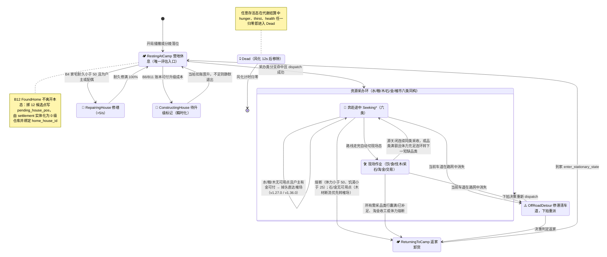
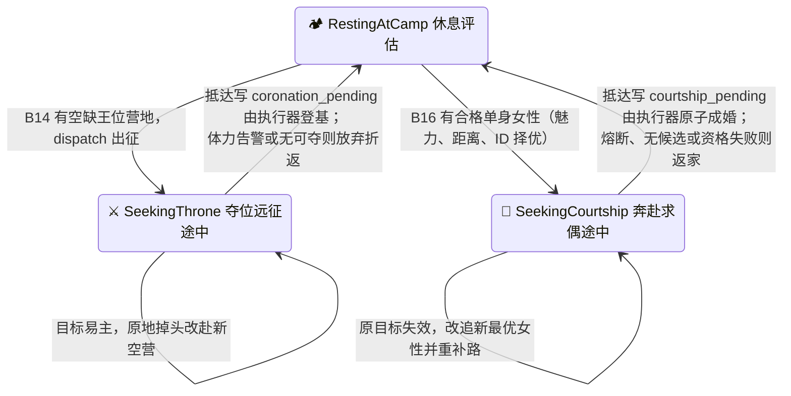

# 6. 🧠 马斯洛需求层次与行动状态机 (Motivation AI)

> **模块索引**：[← 返回 01-current.md 全景索引](../01-current.md) · 主要源码：`crates/sim_core/src/spatial/decisions/`（模块地图见局部 AGENTS）· 深度拆解见 [`docs/07-agent-ai-analysis.md`](../07-agent-ai-analysis.md)

---

## 模块定位

部落民的层次化动机决策引擎，基于马斯洛需求层次驱动行为状态机。低层级需求绝对优先阻断高层任务，决策执行保持确定性（立宅选址按固定顺序消费共享 RNG），决策节拍错峰均摊以保证帧率均匀。

## 意图-策略-原语三层架构与生命周期收口 (M19)

M19 架构实现了意图仲裁 (L1)、策略规划 (L2) 与原语执行 (L3) 的分层解耦：
- `agent.active_task: Option<ActiveTask>` 作为进行中持续任务的单一真相源，由 `transition.rs` 统一管理安装、推进与退出；
- `agent.state` 降级为向后兼容的只读投影视图，与 `ActiveTask` 保持强一致；
- L1 持续任务仲裁（`arbitrate_sustained_task`）、瞬发通道（`arbitrate_instant_needs`）与连续采收候选仲裁（`arbitrate_continuous_harvest_candidate`）职责清晰解耦；
- L2 策略派发（`dispatch_task`）与节拍策略推进（`step_in_progress_task`）收口执行链路；
- 存档结构 `SAVE_FORMAT_VERSION = 6`，完整持久化 `ActiveTask`；版本 6 对应 16 条活动 Branch。
- ★ **M19.4a 表现层透视**：`AgentSnapshot` 扩充 `active_task: Option<ActiveTaskSnapshot>`（四处同步：snapshot.rs / world_snapshot.rs / snapshot_bin/encode.rs / snapshot-bin.js），前端 Inspector 呈现「🧠 决策行动中枢」三栏看板（🎯 意图 / 🧭 策略 / ⚡ 原语）与瞬发待结微光 Pill（`coronation_pending` / `courtship_pending` / `raise_child_pending` / `pending_bids` / `pending_house_pos`）。
- ★ **M19.4b 分级任务抢占**（`preemption.rs`）：按当前任务与抢占意图裁决中断；积累财富、建材采收和争取王位分别受不同生存与安全危机约束，抢占沿原车道连续掉头并保全行囊。
- ★ **M19.4c 禀赋与家资个性化**：力量调节重体力采收装载速率与轻体力偏好；智力权衡「路途耗时 vs 榷场现货牌价」并偏好低磨损通衢；家户金币 ≥ `market_wealthy_family_gold` 的户主 80% 几率赴市现货采买、免于亲自挖矿伐木，平民家户则亲力亲为。
- ★ **M19.4d 多品类预排采收行程**：`Agent3D::harvest_queue: [Option<BranchId>; 4]` 定长预排队列 + `plan_harvest_itinerary` 最近邻贪心（TSP 启发式）链路优化；出发即排最多 4 站「顺路多品类」行程，现场采满一站后消费队列转下一站，候选项失效自动跳过并回退 `branch_order` 兜底；`ActiveTaskSnapshot::itinerary`（如 `💧备水 → 🌲备木 → 🍒备粮`）透传至 Inspector。
- 领域词汇、只读观察接口与 FSM 转换契约详见 [26-intent-observation.md](./26-intent-observation.md) 与 [24-three-core-systems-fsm.md](./24-three-core-systems-fsm.md)。

## 核心机制

### 6 层需求层次

```
⓪ 瞬间行为 (竞购住宅 / 在宅改善 / 近距求偶 / 在宅生育)
⑤ 自我实现 (积累财富)
④ 尊重需求 (改善住宅 / 发展储备 / 争取王位)
③ 归属与爱 (求偶成家 / 生育后代)
② 安全需求 (基本储备 / 建立家宅 / 修缮住宅)
① 生理需求 (饮水解渴 / 进食充饥 / 恢复体力)
```

默认策展顺序先处理个人生存，再处理家庭保障、关系与发展。建立家宅属于安全需求；争取王位属于尊重需求，不再压过饮水、进食与恢复体力。

> ⚡ **⓪ 瞬间行为通道**：每拍先检查 b8 在宅改善、b16 近距求偶、b17 竞购住宅和 b18 在宅生育。异地改善、求偶和生育仍生成持续任务；需求层级与能否立即提交分别表达。

> 👑 **争取王位**：b14 属尊重需求。成年男性在存在符合房籍约束的空缺王位时前往最近目标；抵达后写加冕提交，由世界执行器二次校验并结算。

### 核心决策原则

**原则 1：体力 50% 以下才寻求休息**
- 体力 ≥ 50% 时全力响应外出采收、建房、修缮或高层任务。
- 仅当体力 < 50% 时，休养进入生理需求队列，引导归巢恢复至 100%。

**原则 2：低层级绝对优先**
- 仓库水/粮/过冬木柴低于 50% 时优先搬运填满，比盖房更优先。
- 房屋耐久 < 50% 时产生修缮欲望，开工后一路修缮至 100%。
- 区分「储备资金」（`StockGold`，冷却 45s）与「积累财富」（`GoldWealth`，冷却 180s）；淘金是当前共用策略，显示以活动任务来源为准。

**原则 3：私有施密特触发器 + 连续采收 + 断流重路由 + 断流直达榷场 + 单趟多品类连续采收**
详见根 AGENTS.md §4.2。要点：
- 每个 Agent 维护 `poi_seekability` 私有锁存（开启 ≥50% / 关闭 <10%，v1.26.9 起开启阈值由 30% 提升至 50%）。
- 采收现场未满时自动前往下一处自身触发器已开放的同类 POI 继续采收。
- ★ v1.35.0 单趟多品类连续采收：现场采收某品类完成（行囊装满、家宅补足或该源断流）后，若族人拥有私宅且体力 ≥ `decision_work_stamina_threshold`（默认 50%），由马斯洛引擎按当前编排顺序依次检索家宅短缺的其他品类（`b5/b6/b7/b9/b10`，分支内置行囊余量自检），有短缺且背包有余量则直接派发前往下一处 POI 继续采收，实现单趟出门连续多品类满载回宅；无短缺或体力不足时平滑返家。
- 途中发现目标触发器关闭时，通过 `turn_around_and_route_to` 原地掉头平滑重路由，绝不瞬移。
- ★ v1.27.0 / v1.36.0 断流直达榷场：**水/粮/木**采集链路中断（目标触发器关闭且无任何同类可用 POI）时，若为家户户主、家户账本金币 ≥ `market_min_family_gold` 且体力 ≥ 阈值，可直接原地掉头赴最近榷场交易——市场支付用家户账本**远程结算**，户主无需先回家、不要求随身携带金币；石/金采集不享受该兜底。

**原则 4：执行中生理熔断**
- 外出任何高层任务途中，饥渴 < 25.0 或体力 < 50.0 时立即中断并降级折返。

### 行动状态机总图（`PrimitiveActionState` · 20 态）

> 状态集权威定义在 `agent.rs::PrimitiveActionState`（共 20 态）；转移由 `evaluate.rs::decide` 按状态分发、`agent.rs::advance_to_next_lane` 在路线走完时自动切换、世界执行器（scheduler / housing_system）完成登基/成婚/升级等物理结算。移动唯一由 `current_lane_id.is_some()` 驱动，移动态→静止态必须走 `enter_stationary_state()`（根 AGENTS.md §4.16）。

**图 A · 主行为环（18 态：休息 / 六类采办 12 态 / 返家 / 建造 / 修缮 / 越野 / 死亡）**。六类采办同构：奔赴态 = `SeekingWater/Food/Wood/Stone/Gold/Market`，现场态 = `DrinkingAtWater/ForagingFood/GatheringWood/MiningStone/MiningGold/BuyingAtMarket`。



**图 B · 社会行为链（新增 2 态 `SeekingThrone` / `SeekingCourtship`，休息态与图 A 共用；均由休息态评估发起、结算后回到休息态）**



### 错峰决策节拍
- 每个引擎 tick = 1/60 游戏小时，agent 每 120 tick（2.0 游戏小时）决策一次。
- 错峰相位：`(tick_counter + agent.id) % 120 == 0`，全员相位均摊错开。
- `world.tick()` 内部顺序：POI 再生 → 代谢/繁衍 → POI 交互(装卸) → 房屋系统 → 道路衰减 → 运动 → 决策及提交结算 → 账本 → 清理。卸货发生在决策之前，决策读取卸货后的家户账本和本 tick 运动后的位置。
- 详见根 AGENTS.md §4.3。

### 分支评估顺序（数据驱动，v1.3.6 起）
- 16 条活动分支抽为 `branches.rs` 注册表；b11 合并入 b8「改善住宅」，b15 下沉为水粮木资源意图的采购策略。
  每条分支是**自包含条件函数**，
  因此任意排列都语义安全。
- `evaluate_needs` 不再硬编码优先级，而是**按配置顺序迭代注册表，首个命中即返回**。
- **Rust 层无顺序**：`decision_eval_order` / `decision_eval_levels` 默认空（未注入）时按 `BranchId::ALL`
  声明序中性兜底；策展优先级权威默认值在 `frontend/js/config.decision-order.js`，
  启动时合并进 `SIM_CONFIG` 经 `applyConfig` 注入；用户调整保存到 `flowaccord.decision-order.v3`，旧 v2 顺序按 ID 自动迁移。
- ★ v1.19.0 生产策展序将 `b16`（男性求偶成婚）提升至 `b5/b6/b7/b9/b10`（收集资源入家户账本）之前：避免单身男性被安全/备料分支长期占满决策、求偶极少触发导致人口无法自我更替；决策序唯一真相源仍为 `config.decision-order.js`。

### decisions 子模块（9 个）
| 文件 | 职责 |
| :--- | :--- |
| `mod.rs` | 决策子模块入口与重新导出 |
| `branches.rs` | 16 条活动分支注册表：`BranchId`、自包含条件、顺序解析与层级覆盖 |
| `needs.rs` | 需求定义（MaslowLevel/NeedKind）、节点池、家宅缺口计算、`state_need_label_with_agent` 层级覆盖 |
| `evaluate.rs` | Decisioner 结构体、decide/evaluate_needs（数据驱动）/fulfill_resting_need + ★ v1.29.0 ⓪瞬间层 evaluate_instant_needs/apply_instant_need |
| `routing.rs` | 导航/寻路/原地掉头/返家/POI 触发器可用性 |
| `seeking.rs` | 途中熔断与平滑重路由（含 `decide_seeking_throne` 夺位远征与 `decide_seeking_courtship` 奔赴求偶途中状态机）；★ v1.27.0 `try_route_to_market`（水/粮断流时户主直接改道榷场） |
| `market.rs` | 采购策略：判断水粮木能否采购、在采集与采购间选策，并处理市场途中与现场阶段 |
| `harvest.rs` | 现场采收判定 + 仓储满额查询；★ v1.27.0 水/粮目标关闭时优先转 `try_route_to_market` 再折返 |
| `scheduler.rs` | tick_decisions 调度 + ★M4 登基物理执行器 `execute_pending_coronations` + ★求偶结婚执行器 `execute_pending_courtships` / build_decision_context |

## 关键不变量
- 所有决策为确定性执行，无概率掷骰（v0.9.44 起全部收敛）。
- 决策节拍默认 120 tick；`simulation_dt` 固定为 1/60，不得修改。
- 共享 RNG 按 agents 顺序依次消费，新增任何随机消耗必须保持确定性。
- 中途掉头必须通过 `turn_around_and_route_to` 保持坐标连续性，严禁闪现瞬移。
- ★ M4 夺位远征由决策分支 `B14SeekThrone` 在马斯洛引擎内驱动（生理层最高档），不消耗 `WorldRng`；登基由世界物理执行器 `execute_pending_coronations` 完成，夺位者登基/放弃后恢复正常决策。
- ★ v1.16.0 结婚由决策分支 `B16Courtship` 在马斯洛引擎内驱动（第三层：归属与爱），仅成年单身男性发起，以「魅力 libido 最高优先 → 距离最近 → ID 升序」选定单身女性目标；成婚由世界物理执行器 `execute_pending_courtships` 完成原子登记与女方转入男方家户。

## 与其他模块接口
- `frontend/js/decision-viz*.js` + `config.decision-order.js`：决策引擎可视化视图拖动卡片/分界线 → ★ v1.27.0 起保存到浏览器 localStorage（★ v1.29.0 起键 `flowaccord.decision-order.v2`，旧键 v1 启动时自动迁移 0→6）→ `rustWorld.applyConfig()` 热注入本模块 `decision_eval_order`（顺序+层级覆盖）。
- `agent.rs`：读取生理指标与行囊状态，写入 agent.state（含 `SeekingThrone`）与路径。
- `ecology.rs`：采收与卸货的物理执行。
- `housing_system/`：FoundHome/BuildHouse/RepairHouse 的物理执行。
- `graph.rs`：A\* 寻路与路径规划。
- `ledger/region.rs`：登基/迁籍读写 `region_registry`（`set_king` 旧王入档 `history_kings`）；夺位远征目标营地记录在 `agent.expedition_target_camp`。
- `world.rs`：tick_decisions 调度，错峰相位控制。

## 调参入口
决策阈值、施密特触发器、淘金冷却、立宅门槛、体力作业门槛等见 [06-config-reference.md](../06-config-reference.md) 第 5 分区。
