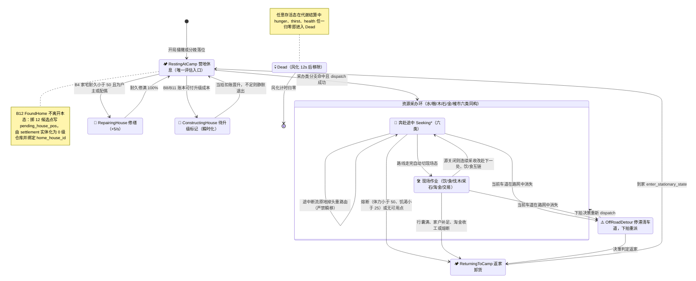
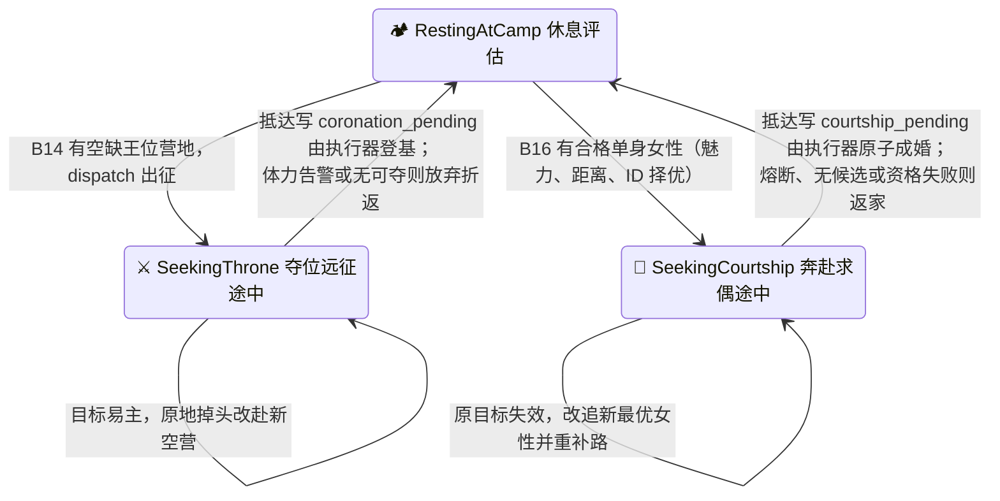

# 6. 🧠 马斯洛需求层次与行动状态机 (Motivation AI)

> **模块索引**：[← 返回 current.md 全景索引](../current.md) · 主要源码：`crates/sim_core/src/spatial/decisions/`（7 子模块）· 深度拆解见 [`docs/agent-ai-analysis.md`](../agent-ai-analysis.md)

---

## 模块定位

部落民的层次化动机决策引擎，基于马斯洛需求层次驱动行为状态机。低层级需求绝对优先阻断高层任务，所有决策为确定性执行（无概率掷骰），决策节拍错峰均摊以保证帧率均匀。

## 核心机制

### 5 层需求层次

```
⑤ 自我实现 (大庄园备金/娱乐淘金)
④ 尊重需求 (建房施工/采石备料)
③ 归属与爱 (0级仓库仓满升级成家/家庭供给)
② 安全需求 (房屋修缮/私宅水粮储备)
① 生理需求 (解渴/觅食/体力休养/末档立宅)
```

低层级需求未满足时绝对阻断高层任务，严禁越级。生理层内部按「**夺位远征(最高档) → 解渴 → 觅食 → 体力休养 → 立宅(末档)**」短路判定：无家成年男性在饥渴 ≥ 20、体力 ≥ 60 的生理稳定态下，将 `FoundHome` 作为生理层最后一档必然触发自立门户（归属层不再承载建仓，仅保留 0 级仓库升级成家）。

> ⚔️ **★ M4 夺位远征（v1.9.0 起决策引擎驱动，生理层最高档）**：不再由世界系统前置扫描触发，而是作为第 14 条决策分支 `B14SeekThrone`（`NeedKind::SeekThrone`，生理层最高档、策展序/兜底序均置首）在马斯洛引擎内评估——在世成年男性、非现任国王、且存在空缺王位营地（有房者只能夺自家房屋所在营地、无房可夺任意）时，决策器自主选定最近可夺位营地写入 `expedition_target_camp` 并 `dispatch` 为 `SeekingThrone` 冲向目标（可中断施工/修缮，进度冻结不回滚；途中目标易主原地掉头重定向，无可夺则放弃）；抵达且王位仍空缺 → 写 `coronation_pending`，由世界物理执行器 `execute_pending_coronations` 校验后登基。

### 核心决策原则

**原则 1：体力 50% 以下才寻求休息**
- 体力 ≥ 50% 时全力响应外出采收、建房、修缮或高层任务。
- 仅当体力 < 50% 时，休养进入生理需求队列，引导归巢恢复至 100%。

**原则 2：低层级绝对优先**
- 仓库水/粮/过冬木柴低于 50% 时优先搬运填满，比盖房更优先。
- 房屋耐久 < 50% 时产生修缮欲望，开工后一路修缮至 100%。
- 区分盖房淘金（`StockGold`，冷却 45s）与娱乐淘金（`GoldWealth`，冷却 180s）；4 级大庄园竣工前绝不娱乐淘金。

**原则 3：私有施密特触发器 + 连续采收 + 断流重路由**
详见根 AGENTS.md §4.2。要点：
- 每个 Agent 维护 `poi_seekability` 私有锁存（开启 ≥30% / 关闭 <10%）。
- 采收现场未满时自动前往下一处自身触发器已开放的同类 POI 继续采收。
- 途中发现目标触发器关闭时，通过 `turn_around_and_route_to` 原地掉头平滑重路由，绝不瞬移。

**原则 4：执行中生理熔断**
- 外出任何高层任务途中，饥渴 < 25.0 或体力 < 50.0 时立即中断并降级折返。

### 行动状态机总图（`PrimitiveActionState` · 20 态）

> 状态集权威定义在 `agent.rs::PrimitiveActionState`（共 20 态）；转移由 `evaluate.rs::decide` 按状态分发、`agent.rs::advance_to_next_lane` 在路线走完时自动切换、世界执行器（scheduler / housing_system）完成登基/成婚/升级等物理结算。移动唯一由 `current_lane_id.is_some()` 驱动，移动态→静止态必须走 `enter_stationary_state()`（根 AGENTS.md §4.16）。

**图 A · 主行为环（18 态：休息 / 六类采办 12 态 / 返家 / 建造 / 修缮 / 越野 / 死亡）**。六类采办同构：奔赴态 = `SeekingWater/Food/Wood/Stone/Gold/Market`，现场态 = `DrinkingAtWater/ForagingFood/GatheringWood/MiningStone/MiningGold/BuyingAtMarket`。



**图 B · 社会行为链（新增 2 态 `SeekingThrone` / `SeekingCourtship`，休息态与图 A 共用；均由休息态评估发起、结算后回到休息态）**



### 错峰决策节拍
- 每个引擎 tick = 1/30 模拟秒，agent 每 30 tick（1.0 模拟秒）决策一次。
- 错峰相位：`(tick_counter + agent.id) % 30 == 0`，全员相位均摊错开。
- `world.tick()` 内部顺序：POI 再生 → 代谢/繁衍 → POI 交互(装卸) → 房屋系统 → 决策 → 道路衰减 → 运动。卸货发生在决策之前，决策看到的是卸货后的仓库状态。
- 详见根 AGENTS.md §4.3。

### 分支评估顺序（数据驱动，v1.3.6 起）
- 16 条分支抽为 `branches.rs` 注册表（`BranchId::B14SeekThrone` + `B1QuenchThirst .. B13GoldWealth` + `B15MarketTrade` + `B16Courtship` ↔ 字符串 ID `"b1".."b16"`），
  每条分支是**自包含条件函数**（无家守卫、b13 的「4 级庄园万事俱备」门禁、b5/b6/b7 的 `family_level` 动态默认、b14 的夺位守卫、b15 的榷场商贸守卫、b16 的男性求偶守卫全部内建），
  因此任意排列都语义安全。
- `evaluate_needs` 不再硬编码优先级，而是**按配置顺序迭代注册表，首个命中即返回**。
- **Rust 层无顺序**：`decision_eval_order` / `decision_eval_levels` 默认空（未注入）时按 `BranchId::ALL`
  声明序中性兜底；策展优先级的唯一真相源是前端持久化文件 `frontend/js/config.decision-order.js`，
  启动时合并进 `SIM_CONFIG` 经 `applyConfig` 注入（拖动决策卡后热注入 + 落盘，详见 §与其他模块接口）。
- ★ v1.19.0 生产策展序将 `b16`（男性求偶成婚）提升至 `b5/b6/b7/b9/b10`（收集资源入家户账本）之前：避免单身男性被安全/备料分支长期占满决策、求偶极少触发导致人口无法自我更替；决策序唯一真相源仍为 `config.decision-order.js`。

### decisions 子模块（9 个）
| 文件 | 职责 |
| :--- | :--- |
| `mod.rs` | 决策子模块入口与重新导出 |
| `branches.rs` | 16 条分支注册表：`BranchId`（字符串互转/中性声明序 `ALL`）、自包含条件函数 `evaluate`、顺序解析 `resolve_order`、层级覆盖 `level_override_for` |
| `needs.rs` | 需求定义（MaslowLevel/NeedKind）、节点池、家宅缺口计算、`state_need_label_with_agent` 层级覆盖 |
| `evaluate.rs` | Decisioner 结构体、decide/evaluate_needs（数据驱动）/fulfill_resting_need |
| `routing.rs` | 导航/寻路/原地掉头/返家/POI 触发器可用性 |
| `seeking.rs` | 途中熔断与平滑重路由（含 `decide_seeking_throne` 夺位远征与 `decide_seeking_courtship` 奔赴求偶途中状态机） |
| `market.rs` | 外部商贸决策子模块：`evaluate_market_trade`（B15 自包含判定）+ 途中可用性检查与现场交易完成返家 |
| `harvest.rs` | 现场采收判定 + 仓储满额查询 |
| `scheduler.rs` | tick_decisions 调度 + ★M4 登基物理执行器 `execute_pending_coronations` + ★求偶结婚执行器 `execute_pending_courtships` / build_decision_context |

## 关键不变量
- 所有决策为确定性执行，无概率掷骰（v0.9.44 起全部收敛）。
- 决策节拍固定 30 tick，不得修改 `simulation_dt`（=1/30）。
- 共享 RNG 按 agents 顺序依次消费，新增任何随机消耗必须保持确定性。
- 中途掉头必须通过 `turn_around_and_route_to` 保持坐标连续性，严禁闪现瞬移。
- ★ M4 夺位远征由决策分支 `B14SeekThrone` 在马斯洛引擎内驱动（生理层最高档），不消耗 `WorldRng`；登基由世界物理执行器 `execute_pending_coronations` 完成，夺位者登基/放弃后恢复正常决策。
- ★ v1.16.0 结婚由决策分支 `B16Courtship` 在马斯洛引擎内驱动（第三层：归属与爱），仅成年单身男性发起，以「魅力 libido 最高优先 → 距离最近 → ID 升序」选定单身女性目标；成婚由世界物理执行器 `execute_pending_courtships` 完成原子登记与女方转入男方家户。

## 与其他模块接口
- `frontend/js/decision-viz*.js` + `config.decision-order.js`：决策引擎可视化视图拖动卡片/分界线 →
  POST 落盘顺序文件 → `rustWorld.applyConfig()` 热注入本模块 `decision_eval_order`（顺序+层级覆盖）。
- `agent.rs`：读取生理指标与行囊状态，写入 agent.state（含 `SeekingThrone`）与路径。
- `ecology.rs`：采收与卸货的物理执行。
- `housing_system/`：FoundHome/BuildHouse/RepairHouse 的物理执行。
- `graph.rs`：A\* 寻路与路径规划。
- `ledger/region.rs`：登基/迁籍读写 `region_registry`（`set_king` 旧王入档 `history_kings`）；夺位远征目标营地记录在 `agent.expedition_target_camp`。
- `world.rs`：tick_decisions 调度，错峰相位控制。

## 调参入口
决策阈值、施密特触发器、淘金冷却、立宅门槛、体力作业门槛等见 [config-reference.md](../config-reference.md) 第 5 分区。
