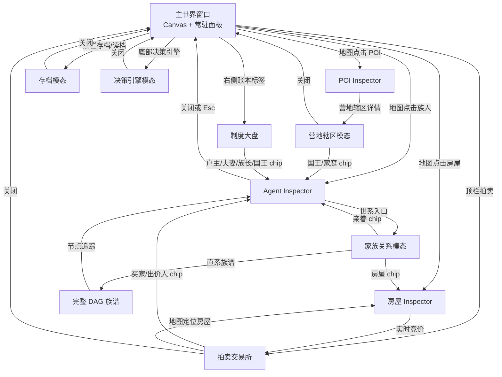

# 前端窗口结构与跳转关系

> **用途**：为 UI/交互方案设计提供当前前端的信息架构、窗口层级、入口与返回关系参考。
> 本文描述的是现有实现（单页静态前端），不是待实现的产品原型；新增页面或重构交互时，应先确认是否能复用现有窗口与选择态。
> **相关文档**：[07-frontend-ui.md](./07-frontend-ui.md) · [09-ui-spec-and-ledger-design.md](../09-ui-spec-and-ledger-design.md) · [15-save-load.md](./15-save-load.md)

## 1. 总体模型：一个世界窗口，四类附属窗口

当前前端没有 URL 路由器，也没有多页面应用的页面栈。浏览器打开 `index.html` 后，所有主要功能都在同一文档中运行：

```text
浏览器标签页
└─ 主世界窗口（index.html）
   ├─ 世界视口：Canvas 地图 + 顶栏 + 左/右常驻面板 + 底部控制台 + 事件日志
   ├─ 观察窗口：右侧 Inspector（Agent / 房屋 / POI 三种对象态）
   ├─ 数据窗口：账本大盘、全局均值、生态总余量、图例（右侧可折叠面板）
   ├─ 模态窗口：族谱、完整族谱 DAG、决策引擎、存档、营地辖区、房屋拍卖
   └─ 独立窗口：完整族谱可另开一个浏览器标签页
```

设计时应把“窗口”理解为三种不同的视觉层：

1. **世界层**：地图持续存在，是所有定位和追踪动作的最终落点。
2. **面板层**：不阻断地图交互，负责实时指标、筛选和对象详情。
3. **模态层**：带遮罩、阻断底层操作；通过关闭按钮、点击遮罩或 `Esc` 返回世界层。模态内部可以继续打开更深一层的详情，但应避免同时堆叠多个全屏模态。
4. **启动门禁层（★ v1.27.0）**：页面加载后的阻塞式启动层 `#startup-save-gate`（z-index 最高），必须先建立/连接可写 `.json` 存档文件才解除（save-ui.js `releaseStartupGate`）；此层不属于模态（不可关闭），模拟在其解除前保持暂停。

## 2. 主世界窗口（World Shell）

### 2.1 区域布局

| 区域 | 现有容器/关键 ID | 主要内容 | 交互性质 |
|---|---|---|---|
| 顶栏左侧 | `.brand-card` | 产品名、版本徽章、描述 | 固定展示 |
| 顶栏中央 | `.stats-card` | 人口、房屋、POI、家户、婚姻、孕妇、季节温度、出生/死亡/流产 | 只读实时统计 |
| 顶栏右侧 | `.save-bar-card` | `💾 存档`、`📂 读档`、`🏛️ 拍卖 (N)` | 打开模态窗口 |
| 左侧 | `.global-resource-panel` | 全图水/粮/木/石/金余量、五类产速倍率滑块 | 面板内调参，不离开世界 |
| 中央 | `#canvas-container` / `#sim-canvas` | 地形、路网、POI、房屋、族人、拍卖标牌 | 地图拾取、缩放、平移、跟随 |
| 右侧上部 | `#global-averages-card` | 存活族人均值、行囊均值、基尼指数、遗传禀赋均值 | 可折叠，只读 |
| 右侧中部 | `#ecology-legend` | POI、道路等级、房屋等级、升级规则图例 | 可折叠，只读 |
| 右侧下部 | `#ledger-panel` | 家户/婚姻/宗族/王国四标签页 | 可折叠、列表穿透 |
| 右侧浮层 | `#inspector-card` | 当前选中 Agent、房屋或 POI | 选择态驱动，可关闭 |
| 底部 | `.control-panel` | 暂停、决策引擎、重演生态、无头模式、显隐开关、倍速 | 全局控制 |
| 左下/底部 | `.event-log` / `#log-list` | 建房、婚姻、生育、死亡、继承、登基等事件播报 | 只读时间流 |
| 调试浮窗 | `#debug-hud` | Tick、FPS、耗时、CPU、JS/WASM 内存 | 默认隐藏，由调试开关显示 |

### 2.2 主世界的选择态

地图点击会把全局选择态设为 `selectionType = agent | house | poi`，并更新 Inspector；同一时间只应有一个主对象被选中。

- **Agent 选中**：Inspector 显示生理指标、马斯洛主导需求、行囊、婚姻/家户/宗族/王国归属、族谱入口；默认开启镜头跟随。
- **房屋选中**：Inspector 显示等级、耐久、建造/升级者、户主、所属营地、报价/成交档案；可跳转拍卖大盘。
- **POI 选中**：Inspector 显示库存、产速和类型；营地 POI 额外显示“辖区详情”入口，可打开营地详情模态。
- **关闭 Inspector**：点击 `✕` 或按 `Esc` 会取消选择、关闭镜头跟随，并关闭已打开的族谱内嵌模态，回到纯世界视图。

## 3. 窗口与面板清单

### 3.1 右侧常驻面板（非模态）

#### 全局均值大盘 `#global-averages-card`

默认折叠。展开后按“基础生理与生存 → 行囊 → 财富不平等 → 六维禀赋”排列。它不改变选择态，也没有独立详情页；设计上适合承载趋势、对比和健康度概览。

#### 生态图例 `#ecology-legend`

默认折叠。只解释地图符号、道路等级、房屋等级和升级材料，不承载对象详情。POI 的实时数值仍应从地图点击进入 POI Inspector。

#### 社会与经济制度大盘 `#ledger-panel`

这是右侧面板中的“数据枢纽”，有四个同级标签页：

| 标签页 | 容器 | 主要内容 | 可继续跳转 |
|---|---|---|---|
| 家户 | `#tab-household-content` | 存续/解散家户、户主、账面五资源、家户流水、继承档案、公仓 | 点击户主/成员 chip → Agent Inspector；点击余额/流水 → 当前卡片内展开抽屉 |
| 婚姻 | `#tab-marriage-content` | 存续婚姻、累计登记、平均婚龄、丧偶/离异、多段历史 | 点击丈夫/妻子 → Agent Inspector |
| 宗族 | `#tab-clan-content` | 姓氏、族长、成员、族库、族税/互助、族长顺位 | 点击族长/顺位候选 → Agent Inspector；流水在卡片内展开 |
| 王国 | `#tab-region-content` | 营地王国、国王、继承顺位、到达时序、公仓、远征 | 点击国王/继承人/远征者 → Agent Inspector；公仓流水在卡片内展开 |

面板内的 `.lineage-chip[data-agent-id]` 统一使用全局 `focusOnAgent()`：把地图镜头移到该 Agent 并打开角色 Inspector。标签切换只改变当前面板内容，不创建新窗口。

### 3.2 Agent / 房屋 / POI Inspector `#inspector-card`

Inspector 是世界层之上的观察面板，不是独立页面。它的标题和内容随选择类型切换：

```text
地图拾取或列表 chip
        ↓
设置 selectionType + selectedAgentId/selectedHouseId/selectedPoiId
        ↓
右侧 Inspector 更新
        ├─ Agent：打开族谱模态 / 跳转所属房屋 / 点击亲眷穿梭
        ├─ 房屋：展开报价档案 / 打开拍卖大盘
        └─ 营地 POI：打开辖区详情模态
```

Inspector 内的关系 chip 可跳转父亲、母亲、配偶、子女、户主、国王等 Agent；房屋 chip 则切换为房屋选择并定位地图。胎儿没有地图实体，只做一次定位且不保持镜头跟随。

## 4. 模态窗口结构

所有模态都采用“遮罩 + 内容卡片/窗口”的方式，默认 `display:none`，打开时通常设为 `display:flex`。关闭路径统一包括右上角 `✕`、点击遮罩（若实现支持）或 `Esc`；`Esc` 按当前最深层窗口优先关闭。

### 4.1 家族关系卡 `#lineage-modal`

**入口**：Agent Inspector 的“查看完整世系族谱”按钮。

**内容**：当前族人核心卡、六维先天禀赋、父亲/母亲/配偶/私宅/子女关系网、威望。

**内部跳转**：

- 点击亲眷 `.lineage-chip[data-agent-id]`：切换焦点 Agent、移动镜头、更新 Inspector 选择态（模态保持打开）。
- 点击房屋 `.lineage-chip[data-house-id]`：关闭族谱模态，切换到房屋 Inspector 并定位地图。
- 点击“🌐 直系族谱”：进入完整 DAG 族谱（优先独立新标签页，浏览器阻止弹窗时回退到内嵌 DAG 模态）。

### 4.2 完整直系族谱 DAG `#full-dag-modal`

**入口**：家族关系卡的“直系族谱”；也可由 `FlowDag.openModal()` 直接打开。

**窗口内部**：时间轴画布、时间密度滑块、适应窗口、100% 缩放、新标签页按钮、节点详情浮层 `#dag-inspector-panel`。

**节点行为**：点击节点只在 DAG 窗口内打开节点详情；详情中的“切换世界镜头追踪此人”会设置世界选择态、定位镜头并关闭 DAG 模态。

**离开方式**：关闭按钮或 `Esc` 关闭 DAG；不会自动关闭世界 Inspector，除非用户通过追踪按钮主动回到世界对象。

**独立标签页**：`在新标签页打开`生成独立 HTML，拥有自己的 DAG 画布和“定位焦点/适应窗口/重置”工具；它不是主页面路由，关闭浏览器标签页即退出。

### 4.3 马斯洛决策引擎 `#decision-viz-overlay`

**入口**：底部控制台“🧠 决策引擎”。

**三栏结构**：左侧操作指引；中央 Branch 分支卡与分界线画布；右侧图元检查器。

**核心交互**：点击图元查看详情；拖卡片调整评估顺序；拖分界线重划层级；滚轮缩放、空白处平移；“适应窗口”和“重置顺序”。拖动松手后立即热注入当前 WASM 实例，并尝试写入 `config.decision-order.js`，失败时提示仅保存在 localStorage。

**离开方式**：右上角关闭或 `Esc`。它是全屏模态，但不应被理解为离开模拟；底层模拟实例仍在运行（除非用户另行暂停）。

### 4.4 存档管理 `#save-modal-backdrop`

**入口**：顶栏“存档”或“读档”按钮；入口决定默认激活“保存”或“读取”标签。

**内部结构**：保存/读取两个标签、三个槽位卡片、状态提示、导入 JSON、下载当前存档；支持浏览器存储和 File System Access API 文件直写两种模式。

**关键副作用**：读档成功后模拟自动暂停，界面指标与地图由新快照重建；关闭窗口不会恢复读档前的运行状态。导入/导出是模态底部动作，不跳转到其他页面。

### 4.5 营地辖区详情 `#camp-detail-backdrop`

**入口**：选中营地 POI 后，POI Inspector 中的“查看辖区详情”。

**内容**：现任国王、继承人、历史国王、管辖家庭、按空置/已有人居住分组的全部房屋、王国公仓五资源与流水。选中营地时，地图同步以特殊虚线连接营地与所属房屋。

**内部跳转**：国王、继承人和历史国王均可通过 Agent chip 回到世界 Agent Inspector 并定位镜头；管辖家庭与空置房屋当前主要是只读清单，受益人 chip 仍可追踪对应 Agent，但房屋编号本身不承担跳转。

### 4.6 房屋拍卖交易所 `#house-auction-backdrop`

**入口**：顶栏“拍卖”、房屋 Inspector 的“查看实时竞价与麦穗博弈大盘”、双击地图在售房屋。

**内部标签/区域**：正在拍卖与历史成交两个标签；房产横向选择条；当前房屋估价 Hero；37% 麦穗博弈时间轴；辖区意向买家池；实时竞价流水；历史成交公证书。

**内部跳转**：

- 买家、出价人、买受户主 chip → 聚焦该 Agent 并打开 Agent Inspector。
- “地图定位该房屋” → 退出大盘后切换房屋选择态并定位地图。
- 房产条切换 → 只更换当前拍卖房屋，不离开拍卖窗口。

**空态**：无在售房产时显示“暂无在售房产”，不使用任意房屋占位；历史成交为空时显示空提示。

## 5. 主要跳转关系图



## 6. 设计方案时应保留的交互契约

v1.28.3 起，所有跨窗口 Agent/房屋引用统一由 `frontend/js/entity-link.js` 捕获阶段路由；默认回到世界并刷新 Inspector，族谱等需保留上下文的链接必须显式声明 `keepContext`。

1. **地图是最终落点**：任何“查看某人/某房屋”的列表动作都应能回到地图定位，而不是只在列表中改变选中样式。
2. **对象选择互斥**：Agent、房屋、POI 共用一个 Inspector，不要同时显示两个主对象详情。
3. **关系 chip 语义统一**：带 `data-agent-id` 的 chip 进入 Agent 视角；带 `data-house-id` 的 chip 进入房屋视角。新列表应复用这一语义。
4. **模态关闭不改变模拟**：关闭窗口只退出视图；暂停/继续由控制台或空格键控制。读档是例外，会在成功后自动暂停。
5. **深层窗口优先响应 Esc**：先关闭 DAG/族谱等最深层窗口，再关闭 Inspector；避免一次按键穿透关闭多个层级。
6. **高频内容要稳定**：账本、拍卖、Inspector 等高频更新区域应使用内容快照缓存，避免重建 DOM 破坏 hover、click 和拖动。
7. **新窗口先判断是否真的需要**：如果只是筛选、展开、查看流水，优先在当前面板内完成；只有跨对象类型、需要大画布或需要阻断底层操作时，才新增模态窗口。

## 7. 实现映射速查

| 设计对象 | HTML | 主要 JS |
|---|---|---|
| 主世界与控制台 | `frontend/index.html` | `main.js`、`render_canvas.js`、`render_world.js`、`render_agents.js` |
| Inspector | `#inspector-card` | `render_inspector.js` |
| 账本大盘 | `#ledger-panel` | `ledger-ui.js`、`render_hud.js` |
| 家族关系卡 | `#lineage-modal` | `main.js`、`render_inspector.js`、`dag.js` |
| 完整 DAG | `#full-dag-modal` | `dag.js`、`dag-view.js`、`dag-layout.js` |
| DAG 独立页 | 新标签页 HTML | `dag-standalone.js` |
| 决策引擎 | `#decision-viz-overlay` | `decision-viz.js`、`decision-viz-view.js`、`decision-viz-data.js` |
| 存档管理 | `#save-modal-backdrop` | `save-ui.js`、`rustworld.js` |
| 营地详情 | `#camp-detail-backdrop` | `render_inspector.js` |
| 拍卖交易所 | `#house-auction-backdrop` | `auction-ui.js` |
