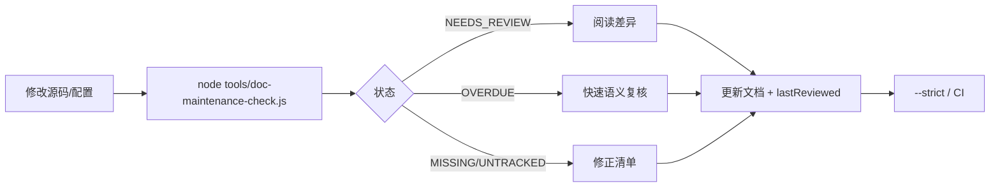

# 文档维护发现机制

## 1. 目标

项目文档容易出现两种“看起来存在、实际上失养”的状态：源码已经变化但机制文档没有复核，或文档存在却没有明确维护责任、源码范围和最近复核时间。

本项目采用“维护清单 + 自动体检 + 人工确认”的轻量机制。它不试图判断自然语言是否绝对正确，而是把责任和可观测证据固定下来，让“需不需要更新”和“有没有被维护”变成可扫描的问题。

## 2. 维护清单

清单文件为 [`docs/doc-maintenance.json`](../doc-maintenance.json)。每条记录包含：

| 字段 | 含义 |
|---|---|
| `id` | 稳定标识，不随标题修改 |
| `path` | 文档路径 |
| `owner` | 维护责任域/团队 |
| `sources` | 文档描述的源码、配置或工具范围，支持 `*` / `**` |
| `lastReviewed` | 最近一次人工确认“文档与实现相符”的日期 |
| `reviewIntervalDays` | 可选，覆盖全局复核周期 |

`sources` 应尽量精确，避免写整个仓库；建议把文档自身也列入来源，防止文档刚修改后被误报为落后。新建 `docs/current/*.md` 时必须登记，纯历史记录才放入 `ignoreDocs`。

## 3. 自动体检器

```bash
node tools/doc-maintenance-check.js
node tools/doc-maintenance-check.js --json
node tools/doc-maintenance-check.js --strict
```

检查器只读工作区，依据文件更新时间和清单日期输出：

| 状态 | 含义 | 处理 |
|---|---|---|
| `OK` | 文档和来源存在、文档不落后、复核未过期 | 保持 |
| `NEEDS_REVIEW` | 关联源码晚于文档 | 阅读源码差异，必要时更新文档 |
| `OVERDUE` | 超过复核周期没有人工确认 | 做一次快速语义复核 |
| `MISSING_DOC` | 清单登记的文档不存在 | 修正路径或补回文档 |
| `MISSING_SOURCE` | 来源通配没有匹配文件 | 修正清单，防止监控失效 |
| `UNTRACKED_DOC` | `docs/current` 中有未登记文档 | 登记责任，或明确加入忽略列表 |

源码和文档使用工作区修改时间，因此未提交的改动也会触发 `NEEDS_REVIEW`。`--json` 供 CI、仪表盘或 IDE 集成；`--strict` 在有任何问题时返回退出码 1。

## 4. 推荐工作流



完成一次维护后，维护者应更新文档内容（如有变化）、把 `lastReviewed` 改为当天，并在机制变化时追加 `11-changelog.md`。推荐日常运行普通模式，发布前或 CI 运行 `--strict`。

## 5. 判断“有没有被维护”的标准

“被维护”不等于文件最近改过。较可靠的证据组合是：来源范围明确、责任域明确、`lastReviewed` 新鲜、源码领先告警已处理、机制变化有 changelog 记录。自动工具负责发现风险，语义正确性仍由责任域人工确认。

## 6. 后续扩展

- 在 Pull Request 中发布 `--json` 摘要，只展示新增或变红文档；
- 为高风险文档增加必备章节检查；
- 通过 Git 历史区分源码提交时间和工作区时间；
- 在 IDE 或文档页显示健康徽章并直达待维护文档。

