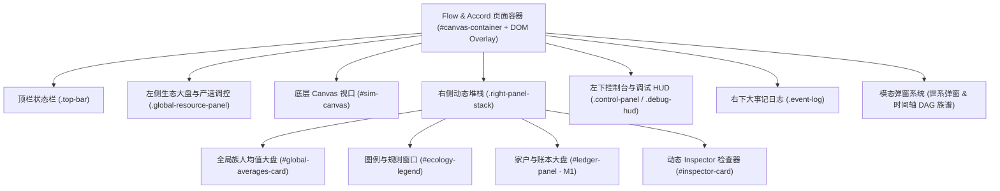
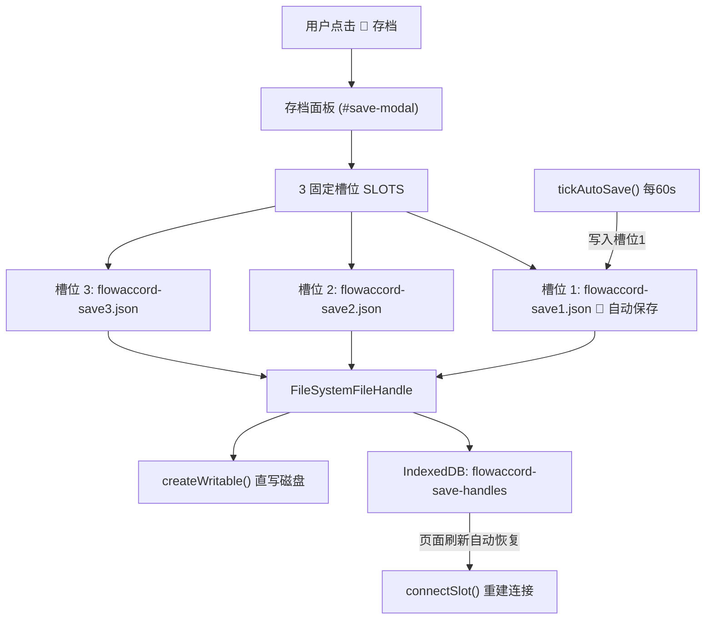

# 21. 🖥️ UI 页面全景剖析 (`frontend`)

> **模块索引**：[← 返回 01-current.md 全景索引](../01-current.md) · 主要源码：`frontend/index.html`、`frontend/style.css`、`frontend/js/render_canvas.js`、`render_hud.js`、`render_world.js`、`render_agents.js`、`render_inspector.js`、`save-ui.js` 等
> **关联文档**：[07-frontend-ui.md](./07-frontend-ui.md)（模块总览）· [22-society-ledger-ui.md](./22-society-ledger-ui.md)（制度大盘界面实现）· [23-ui-dev-guide.md](./23-ui-dev-guide.md)（前端开发实施指南）
> **定位**：当前 UI 页面全景解剖说明书——画布视口、顶栏、生态大盘、观察堆栈、控制台、事件日志、模态弹窗系统与存档管理面板的现状拆解。

当前系统基于纯原生 HTML5 Canvas 2D + DOM 玻璃拟态（Glassmorphism）构建，无任何打包工具（无 Webpack/Vite），采用暗黑赛博生态风格（`#050a12` 背景），兼顾 30FPS 实时渲染与高密度信息透出。

---

## 1.1 画布视口与 3D 渲染层 (Canvas Viewport)

- **容器与元素**：`
<canvas id="sim-canvas"></canvas>
`
- **坐标映射与投影管线**（`frontend/js/math.js` & `render_world.js`）：
  - 维持 3D 等轴斜视投影：RotX = 58°，RotZ = 45°；
  - 鼠标滚轮缩放（Zoom 0.25x ~ 3.5x）、右键拖拽或左键平移（PanX, PanY）；
  - **性能优化**：单次全网格顶点投影（`terrainProjX`/`terrainProjY` 预分配缓冲，3600 次投影），视口边界剔除裁剪，单次 `ctx.stroke()` 批处理绘制 60×60 地形网格线。
- **图层渲染顺序**：
  1. **等高线地形图**：低洼谷地（深蓝绿 `#064e3b`）、平缓原野（墨绿 `#065f46`）、高山峻岭（岩灰与山巅白）；
  2. **5 阶贝塞尔路网**：1 阶野径（土灰）、2 阶泥路（琥珀褐）、3 阶石子路（深石青）、4 阶夯土道（青蓝）、5 阶主干道（亮金蓝），恒定屏幕像素宽度，支持鼠标悬浮 Tooltip（`#road-hover-tooltip`）；
  3. **贴地图元补充层**：选中营地的辖区虚线连线 + 23 处 POI 的贴地底座与营地暖光（避风营地 🏕️、清泉 💧、浆果丛 🍒、茂林 🌲、石矿 🪨、金矿 🪙、榷场互市 🏪），先于立体实体落笔，暖光不会糊在近处建筑上；
  4. **★ v1.47.9 世界立体实体统一深度绘制**：POI 标记（图标 + 门牌 + 储量进度弧）、私产宅舍（0 级仓库 📦 / 1 级茅草房 🛖 / 2 级私宅 🏡 / 3 级木石庄舍 🏯 / 4 级家族大庄园 🏰，无主空置房半透明 +「空」标签）、部落民族人（男性蓝框 / 女性粉框、状态色编码、孕妇光环与拖尾等特效）合并为**单一绘制队列**，按相机深度**远 → 近**依次落笔，近处实体压住远处实体（★ v1.47.8 先修复房屋层，v1.47.9 扩展到 POI 与族人）；
  5. **登基礼花特效层**：全屏粒子特效，最后绘制；

---

## 1.2 顶部玻璃拟态状态栏 (`.top-bar`)

位于页面顶部，悬浮横贯，两端对齐，`pointer-events: none`（内部卡片 `pointer-events: auto`）。

### 1. 品牌与版本卡片 (`.brand-card`)
- 标题：`🍼 Flow & Accord · 流动公约` + 动态版本徽章 `v1.45.x`；
- 副标题：`确定性生态演算 · 马斯洛需求层级驱动 · 族群代际繁衍与社会演化`。

### 2. 全局实时态势仪表 (`.stats-card`)
以 10FPS 降频节流更新，在无头模式下依然常驻刷新：
- 活体人口 (`#stat-pop`)：存活部落民总数；
- 🏡 私产宅舍 (`#stat-houses`)：有效房屋总数；
- 🏠 存续家户 (`#stat-households`)：M1 账本系统存续家户数（以男性户主为锚）；
- 💍 存续婚姻 (`#stat-marriages`)：M1 婚姻登记簿当前存续中的夫妻对数；
- 🤰 孕妇数 (`#stat-pregnant`)：正在妊娠期的女性数量；
- 🌸 四季与气温 (`#stat-season` & `#stat-temp`)：春夏秋冬 240s 周期与实时摄氏度；
- 👶 累计出生 (`#stat-births`)；
- 💀 累计死亡 (`#stat-deaths`)：带自然老死（☘️ `#stat-deaths-natural`）与饥渴非自然死亡（⚡ `#stat-deaths-unnatural`）分列；
- 🥀 累计流产 (`#stat-miscarriages`)。

---

## 1.3 左侧全局生态大盘与产速控制台 (`.global-resource-panel`)

与顶部品牌卡片等宽（385px）对齐，位于左侧 `top: 88px`：
1. **全图生态健康指示器** (`#global-eco-health`)：实时计算全图可用资源比例，展示「🌿 资源丰盛」、「⚡ 储量紧俏」、「⚠️ 资源枯竭危机」；
2. **5 类生态总余量进度条**：
   - 💧 全图清泉总水量（6 处，上限 1200.0）；
   - 🍒 全图成熟浆果量（6 处，上限 1200.0）；
   - 🌲 全图林木木材量（3 处，上限 600.0）；
   - 🪨 全图石矿石料量（2 处，上限 400.0）；
   - 🪙 全图金矿黄金量（1 处，上限 200.0）；
3. **5 组玩家产速动态调控滑块**（0.0x ~ 5.0x 步进 0.1）：支持免重编译热更新 WASM 资源再生速率，带「🔄 重置为默认产速」按钮。

---

## 1.4 右侧动态观察堆栈 (`.right-panel-stack`)

右侧垂直流式排列，支持独立折叠/展开与联动追踪：

### 1. 全局族人均值大盘 (`#global-averages-card`)
- 默认折叠，展开后展示：
  - ❤️健康、🍖饱食、💧水分、⚡体力 4 项全图存活均值进度条；
  - ⏳平均年龄、🏃平均移速、👥性别比、🏡有房率、💘成年单身、💑结发夫妻对数；
  - 🎒 随身行囊均值（水、食、木、石、金 5 项）；
  - 🧬 先天禀赋六维均值（智力、力量、魅力、消化、睡眠、寿命，基准 100）。

### 2. 图例与规则窗口 (`#ecology-legend`)
- 默认折叠，展示 23 处 POI 职能、1~5 阶道路等级、冬季供暖柴火门槛（<10 木禁孕）、房屋 0~4 级升级建材要求。

### 3. 家户与账本大盘 (`#ledger-panel`，M1 已落地)
- 默认折叠，徽章实时显示存续家户数（`X户`）；
- 展开后展示：
  - **概览统计行**：存续家户、已解散家户、存续婚姻、累计登记婚姻；
  - **🏠 家户列表**：家户 ID、户主姓名（【姓氏】👑）、成员数、账面总财富、分项 5 资源余额（💧🍒🌲🪨🪙），点击户主名字直接传送并选中对应族人；
  - **💍 婚姻登记簿**：婚姻 ID、丈夫与妻子芯片、婚龄、存续状态（💍存续 / 🕊️丧偶离异）。

### 4. 动态 Inspector 检查器 (`#inspector-card`)
选中目标（族人 / 房屋 / POI）时弹出，支持 `Esc` 或右上角 `✕` 关闭并停止镜头跟随：
- **族人视图 (`#insp-agent-view`)**：
  - **🧠 决策行动中枢看板 (M19.4a)**：包含需求层级徽章与动因、⚡ 瞬发待结微光 Pill（出价/求偶/育儿等）、以及「🎯 意图（分支/层级/判据）- 🧭 策略（模式/目标/阶段）- ⚡ 原语（动作/详情/状态）」三栏透视；
  - **2×2 生存健康指标网格**：❤️健康、⚡体力、🍖饱食、💧水分；
  - **🎒 随身 5 格行囊胶囊**：水(50)、食(50)、木(50)、石(50)、金(无限)，以及实时搬运物流动向（如 `🚚 动向: 前往 🏡 #3 卸货入库`）；
  - **🏠 家户归属卡片**：显示家户 ID、户主、角色（👑户主 / 💍配偶 / 👶子女）、分家来源（分家自 #X）、账面 5 资源余额、最近 5 条家户大事记；
  - **💍 婚姻登记卡片**：存续状态、丈夫/妻子、婚龄、历史多段婚姻列表；
  - **生理状态条**：🤰 妊娠进度条（200s 孕期百分比）、🥀 流产调养倒计时；
  - **底部动作栏**：🎥 镜头跟随开关、🏠 定位私宅、📜 详情 ↗（唤起世系族谱弹窗）。
- **房屋视图 (`#insp-house-view`)**：
  - 🏛️ 房屋耐久度进度条与风化/修缮状态；
  - 🧱 修建/升级者历史确权（修建者 Agent ID + 最近升级者 ID，不随继承改变）；
  - 👑 户主确权芯片（点击直接跳转户主，无主房显示「🏚️ 无主空置房」灰色标签 + 受益人登记提示）、所属聚落、建筑形态等级；
  - 家庭储备以**家户账本**为唯一真相源（M6 起房屋仓库已删除），吃喝/冬季烧柴从账本真实扣减；
  - 👶 生育激活状态：★ v1.28.0 起需男方（户主）名下住宅 ≥1 级（0 级仓库不生育），且女方身体指标达标、流产/产后冷却结束。
- **地标视图 (`#insp-poi-view`)**：
  - 非营地 POI（清泉/果丛/森林/石矿/金矿/榷场）：储量余量进度条与产出速率、地形与辖区描述文本；
  - **营地专属（v1.12.0 重构）**：一级卡片精简为三要素——
    1. **👑 现任国王**：国王芯片（点击跳转），王位空悬时显示灰色「王位空悬」；
    2. **辖区晋升进度条**：标题行整合等级名称（原始营地/村落/乡集/集镇/县邑）+ 辖房数 + 空置数，进度条展示距下一级所需房屋数（0→6→12→18→24）；
    3. **📜 查看辖区详情** 按钮：点击弹出营地详情模态框（见 §1.7.3）；
  - 营地已移除：标题右侧 state-badge、底部 poi-info-badge（产出速率/地形/辖区标签）、描述文本（仅对营地生效，非营地 POI 保留）。

---

## 1.5 底部生态时钟、控制台与调试监视器 (`.control-panel` & `.debug-hud`)

- **控制台面板**（左下角）：
  - ⏸️ 暂停/继续模拟（空格键快捷触发，带焦点隔离保护）；
  - 🏕️ 重演生态（重新播撒 20 位始祖族人）；
  - 🧠 **无头模式 (Headless Mode)**：只推进 Rust 内核模拟与顶栏数据，跳过全部画布渲染，供长程快速演化；
  - 视图开关：👤 隐藏部落民、🛣️ 隐藏路网、🐞 调试监视器；
  - ☀️ **动态季节光照开关**（★ v1.48.0，`#chk-dynamic-light`，默认开启，`L` 键快捷切换）与 🧭 当前光位读数（`#stat-sun`，显示方位 + 高度角）；
  - ⚡ 最大模拟演化倍速下拉选框（1x ~ 1024x 八档，WASM 同帧多步步进）与 ⏱️ 实际演化倍速实时显示。
- **🐞 调试监视器 HUD (`#debug-hud`)**：
  - 模拟 Tick、每秒真实 Tick 推进速率（含倍速加成）、渲染 FPS；
  - 内核步进耗时（`tickMs`）、快照解析耗时（`snapMs`）、渲染耗时（`renderMs`）、整帧耗时与 CPU 占用率；
  - ★ v1.48.0 光照重着色耗时（`#dbg-light-ms`）与光相/光档（`#dbg-light-phase`，供性能验收取证）；
  - JS 堆内存占用与 WASM 线性内存大小。

---

## 1.6 右下角重大历史事件滚动日志 (`.event-log`)

实时滚动播报部落重大演化历史（定居立宅、结发成婚、怀胎受孕、瓜熟分娩、房屋扩建升级、冻馁丧生、老病仙逝等），最多保留 8 条，带色彩标签（`camp`/`house`/`death` 等）。

---

## 1.7 模态弹窗系统 (Modal System)

### 1. 部落民世系详情弹窗 (`#lineage-modal`)
- 族人核心档案、马斯洛状态徽章；
- 🧬 先天六维禀赋雷达数据网格；
- 关系网四宫格：👴 父亲、👩 母亲、💍 配偶、🏠 私宅，以及 👶 全部后代子嗣列表（点击亲眷芯片可无缝切换视角）。

### 2. 直系血脉确定性时间轴 DAG 族谱 (`#full-dag-modal` & `dag-standalone.js`)
自 v0.9.64 起采用**确定性时间轴布局**，彻底废除不可控的力导向算法：
- **Y 严格线性映射出生时刻**：`Y = (birthTick - tickMin) * PX_PER_TICK`，先辈必在上，后代必在下；
- **X 坐标横向拓扑冲突消解**：父系主脉居中，核心家庭分组居中，整数列探测与两轮局部松弛；
- **视口虚拟化 + 3 档 LOD 分级渲染**：仅挂载可视区域卡片，缩放 <0.45 纯色块、0.45~0.75 简档、>0.75 全功能卡片；
- **左侧自适应时间刻度尺**：季/年/5/10/25/50/100 年自适应切换；
- **直系血脉单图**：仅展示焦点族人的递归祖先链与递归后代链，杜绝千人全图节点爆炸；
- **新标签页独立打开**：支持将族谱单独在新浏览器 Tab 渲染，与主地图主副双屏联动。

### 3. 营地辖区详情模态框 (`#camp-detail-backdrop`，v1.12.0 新增)
点击营地一级卡片的「📜 查看辖区详情」按钮弹出，遮罩半透明背景，支持 Esc / 点击遮罩 / 右上角 ✕ 三种关闭方式。模态框每帧实时刷新（`window._campDetailTick` 挂入主循环），包含 6 个分区：

| 分区 | DOM ID | 展示内容 |
| :--- | :--- | :--- |
| 👑 现任国王 | `#camp-detail-king` | 国王芯片 + 登基时刻 + 在位时长（tick/60 换算模拟秒） |
| 👤 继承人 | `#camp-detail-heir` | 顺位前 3 继承人芯片（长子→长孙→幼子→元老） |
| 📜 历史国王 | `#camp-detail-hist-kings` | 历任国王列表，含在位起止时长与死因（寿终正寝/饿死/渴死等） |
| 🏠 管辖家庭 | `#camp-detail-governed` | 紧凑格式 `🏠#id(N人·户主#X)`，点击跳转房屋 |
| 🏚️ 空置房屋 | `#camp-detail-vacant` | 无主房屋列表 + 受益人芯片（子女+配偶） |
| 💰 王国公仓账本 | `#camp-detail-ledger-*` | 5 类资源余额（水/粮/木/石/金）+ 最近 6 笔流水 |

- **在位时长换算**：60 tick = 1 游戏小时（`config.simulationDt=1/60`）；Agent 默认每 120 tick（2 游戏小时）决策一次；
- **死因来源**：内核 `HistoryKing.death_cause`，被废黜/夺位则为 None（显示「退位」）；
- **样式族**：`.camp-detail-backdrop` / `.camp-detail-modal` / `.camp-detail-section` / `.camp-detail-king-row` 等，皇家金 `#fbbf24` 主题色。

### 4. 存档管理面板 (`#save-modal`，v1.12.0 重构)
顶栏「💾 存档」按钮打开，详见 §1.8。

### 5. 房屋拍卖交易所与实时竞价大盘 (`#house-auction-backdrop` / `#house-auction-modal`，v1.15.0 新增)
专用于二手房屋市场挂牌流转、麦穗 37% 最优停止博弈全过程透视与买方报价竞逐的全景大盘。由 `frontend/js/auction-ui.js` 驱动，渲染循环每帧调用 `window._auctionUiTick` 保证数据毫秒级同步。

#### 呼出方式（三入口）
1. **顶栏常驻徽章按钮**：`.top-bar .save-bar-card #btn-open-auction-modal`（显示当前挂牌在售房屋总数，有在售房产时激活金色呼吸脉冲光晕）；
2. **房屋 Inspector 专属按钮**：选中在售房屋时，Inspector 卡片内显示 `🔨 查看实时竞价与麦穗博弈大盘 ↗`；
3. **主画布双击**：双击游戏视口中带有悬浮拍卖标牌与金色光晕的在售房屋，直接展开对应房产大盘。

#### 核心面板布局与视觉图元
- **资产基本面卡片 (Hero Card)**：建筑等级图标（🛖/🏡/🏯/🏰）、所属营地、修建者 Agent、修缮耐久度、房龄与按榷场物化成本折算的当前市场估价，动态高亮营地闲置土地状态（土地充盈则估价为自建成本上限；土地告罄则显示稀缺供需溢价）；
- **🌾 麦穗 37% 最优停止博弈标尺 (核心可视化)**：
  - 双色渐变分段轴：以房屋起拍耐久度至 10% 出清线为全博弈区间，前 37% 为**🌾 观察摸底期**（只树立最高出价标杆不出售），后 63% 为**🎯 决策窗口期**（买方出价超过标杆即成交），$\le 10\%$ 为**⚠️ 强制出清线**（选历史最高报价强制交割防风化坍塌）；
  - 动态走动指针：白色高亮指针与气泡标签随房屋风化损耗（$-0.04\%/\text{s}$）实时向左游走，直观呈现博弈推进；
- **👥 辖区意向买家池**：实时扫描辖区内符合出价条件的单身/无房成年男性户主，呈现家庭黄金储备与意向标签（资金充裕/尽力出资/微薄无金），附带「定位 🔍」一键追踪族人；
- **⚡ 实时竞价流水**：展示每 3 秒一轮的买方族人报价卡片（出价人、金额、阶段），附带营地中介仲裁判定（确立新标杆/击中更优麦穗成交/低于标杆等）；
- **📜 历史成交档案库**：Tab 切换浏览全图已交割房屋公证书档案与资金划转凭证。

---

## 1.8 存档管理面板 (Save Panel，v1.12.0 重构)

> v1.12.0 彻底删除 localStorage 三槽位体系，改为 **3 个固定文件槽位 + IndexedDB 持久化句柄**架构。仅支持 Chrome / Edge（File System Access API）。

### 架构概览

### 槽位卡片三态

| 状态 | 渲染 | 交互 |
| :--- | :--- | :--- |
| **未连接** | 灰色卡片 + 「🔗 连接文件」按钮 | 点击弹出 `showSaveFilePicker`，默认文件名 `flowaccord-saveN.json` |
| **已连接** | 文件名 + 最后保存时间 + Tick/人口/体积元信息 + 「💾 保存」「📂 读取」「🔌 断开」按钮 | 保存直写磁盘无需重复弹窗；读取校验 `format_version` |
| **不兼容** | 红色卡片 + 「⚠️ 浏览器不支持 File System Access API，请使用 Chrome / Edge」 | 全部操作禁用 |

### 关键机制

1. **IndexedDB 持久化句柄**：数据库 `flowaccord-save-handles` / objectStore `handles` / keyPath `slotId`，存储 `{slotId, handle, fileName, savedAt}`。页面刷新后初始化时从 IDB 恢复全部槽位句柄并异步从文件头读取元信息。
2. **自动保存**：`tickAutoSave()` 每 60 秒写入槽位 1（未连接则跳过），UI 标注「🤖 自动保存」徽章。
3. **元信息缓存**：已连接槽位的元信息（Tick/人口/体积/保存时间）缓存在内存，刷新时从文件头提取，无需全量读取。
4. **存档格式版本**：`SAVE_FORMAT_VERSION = 5`（v1.12.0 因 `history_kings` 升到 3；v1.44.7 因新增帝国登记簿升至 4；M19.2 因持久化 `ActiveTask` 控制器升至 5，不兼容旧档），读档时版本不兼容即拒绝加载且不污染当前世界。
5. **权限失效处理**：写入/读取捕获 `NotAllowedError`，自动断开连接并提示重新授权。
6. **旧导入按钮已隐藏**：`input[type=file]` 导入入口移除，统一走文件槽位体系。

### 实现文件
- `frontend/js/save-ui.js`（完整重写，约 450 行）
- `frontend/index.html`（存档面板 DOM）
- `frontend/style.css`（`.save-slot-*` 样式族）
