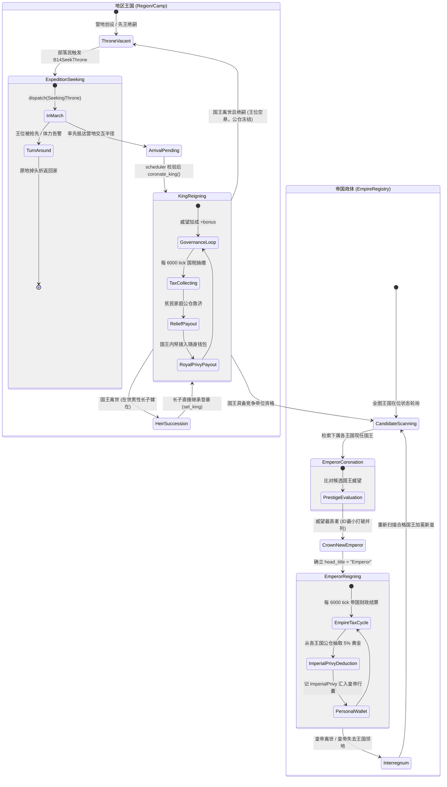

# 🔄 三大核心系统状态机架构全景 (Three Core Systems FSM)

> **文档定位**：系统性阐述《Flow & Accord》内核三大核心子系统（马斯洛动机决策引擎、私产房屋与归宿拓扑、王国与帝国政治演化）的有限状态机 (FSM) 架构、状态转移方程、守卫条件与生命周期闭环。
> **版本基准**：**v1.45.2**（内核同步更新，含私宅大门归宿保护与榷场死锁防御）。
> **代码对应**：
> - 动机与动作：`crates/sim_core/src/spatial/decisions/` (`evaluate.rs`, `branches.rs`, `seeking.rs`, `market.rs`, `harvest.rs`, `routing.rs`)
> - 私宅与归宿：`crates/sim_core/src/spatial/housing_system/` (`settlement.rs`, `construction.rs`, `maintenance.rs`, `auction.rs`, `inheritance.rs`, `marriage.rs`), `house.rs`
> - 王国与帝国：`crates/sim_core/src/spatial/ledger/` (`region.rs`, `empire.rs`), `decisions/scheduler.rs`

---

## 目录

- [1. 系统一：马斯洛需求决策与部落民动作执行状态机](#1-系统一马斯洛需求决策与部落民动作执行状态机)
  - [1.1 架构分层与错峰节拍](#11-架构分层与错峰节拍)
  - [1.2 状态机图元与核心转移 (Mermaid FSM)](#12-状态机图元与核心转移-mermaid-fsm)
  - [1.3 关键转移守卫与断流掉头机制 (v1.45.2 加固)](#13-关键转移守卫与断流掉头机制-v1452-加固)
- [2. 系统二：私产房屋全生命周期、归宿拓扑与竞拍流转状态机](#2-系统二私产房屋全生命周期归宿拓扑与竞拍流转状态机)
  - [2.1 房屋形态与归宿拓扑架构](#21-房屋形态与归宿拓扑架构)
  - [2.2 房屋生命周期状态机 (Mermaid FSM)](#22-房屋生命周期状态机-mermaid-fsm)
  - [2.3 麦穗拍卖、时限交割与归宿门节点保护 (v1.45.2)](#23-麦穗拍卖时限交割与归宿门节点保护-v1452)
- [3. 系统三：王国地区与帝国政体演化、税赋公帑状态机](#3-系统三王国地区与帝国政体演化税赋公帑状态机)
  - [3.1 两级政体与权力金字塔](#31-两级政体与权力金字塔)
  - [3.2 政治演化与加冕继承状态机 (Mermaid FSM)](#32-政治演化与加冕继承状态机-mermaid-fsm)
  - [3.3 财政循环：国税、公仓救济、国王内帑与帝国公帑](#33-财政循环国税公仓救济国王内帑与帝国公帑)
- [4. 三大系统交互契约与跨系统不变量矩阵](#4-三大系统交互契约与跨系统不变量矩阵)

---

## 1. 系统一：马斯洛需求决策与部落民动作执行状态机

### 1.1 架构分层与错峰节拍

马斯洛需求决策系统是驱动部落民个体微观行为的中央引擎，严格遵守**错峰决策**与**分层响应**原则：

1. **时间节拍与错峰调度**：
   - 全局仿真步长 `dt = 1/60` 游戏小时（1 tick）。
   - 个体决策相位严格固定为 `(tick_counter + agent.id) % 120 == 0`（v1.46.4 起默认 120 tick = 2 游戏小时），实现全员相位均匀平铺（均摊 A* 寻路算力，杜绝群体同步共振抢点）。
2. **⓪ 瞬间行为层 (Instantaneous Level)**：
   - 处于决策相位的 Agent，在进入常规状态机之前**首先遍历瞬间分支**（`B16Courtship` 近距成婚、`B17BidHouse` 麦穗竞拍出价、`B18RaiseChild` 宅门受孕）。
   - 瞬发分支仅写决心标志位（`*_pending`），不移动、不改物理运动状态、不耗 RNG，命中后继续推进后续常规判定。
3. **①~⑤ 常规需求逐级评估与 M19 任务控制器**：
   - 包含 16 条活跃具名分支（稳定 ID 为 `b1`~`b18`，其中 `b11`、`b15` 已合并留空），按注入顺序检索，首个命中即派发调度。
   - M19 架构下，`agent.active_task: Option<ActiveTask>` 为进行中持续任务单一真相源，`agent.state` 为严格一致的兼容投影。
   - 移动态一律经由 `dispatch(agent, start, target, state)` 规划 A* 路径并通过 `transition::install_task` 安装任务；静止态与退出一律调用 `transition::finish_task` / `agent.enter_stationary_state(state)` 清除运动残留。

### 1.2 状态机图元与核心转移 (Mermaid FSM)

```mermaid
stateDiagram-v2
    [*] --> RestingAtCamp : 出生/初始化

    %% 休整与决策中心
    state RestingAtCamp {
        [*] --> Evaluating : 错峰相位触发
        Evaluating --> InstantPhase : evaluate_instant_needs()
        InstantPhase --> MaslowScan : 瞬发决心写入完毕
        MaslowScan --> Dispatched : 命中需求分支
        MaslowScan --> IdleCheck : 无常规需求
        IdleCheck --> Homebound : 有私宅且远离门节点 (v1.45.2)
        IdleCheck --> StayRest : 在私宅门前/营地休息
    }

    RestingAtCamp --> SeekingWater : QuenchThirst / StockWater
    RestingAtCamp --> SeekingFood : SateHunger / StockFood
    RestingAtCamp --> SeekingWood : StockWood
    RestingAtCamp --> SeekingStone : StockStone
    RestingAtCamp --> SeekingGold : StockGold / GoldWealth
    RestingAtCamp --> SeekingMarket : MarketTrade (榷场采购)
    RestingAtCamp --> SeekingThrone : SeekThrone (夺位远征)
    RestingAtCamp --> SeekingCourtship : Courtship (远距寻偶)
    RestingAtCamp --> RepairingHouse : RepairHouse (修缮私宅)
    RestingAtCamp --> ConstructingHouse : BuildHouse (营建/升级)
    RestingAtCamp --> RaiseChild : RaiseChild (自宅育儿)

    %% 移动途中的熔断与重路由
    state "途中移动状态 (Seeking*)" as InTransit {
        note right of InTransit
            每拍可用性检测：
            - 私有施密特触发器关闭
            - 体力低于预警阈值
            - 目标被抢占
        end note
    }

    SeekingWater --> InTransit
    SeekingFood --> InTransit
    SeekingWood --> InTransit
    SeekingStone --> InTransit
    SeekingGold --> InTransit
    SeekingMarket --> InTransit
    SeekingThrone --> InTransit
    SeekingCourtship --> InTransit

    InTransit --> ReturningToCamp : 目标断流/体力告警折返
    InTransit --> SeekingMarket : 水/粮/木断流直达榷场 (try_route_to_market)
    InTransit --> InTransit : 就近同类POI平滑重路由 (turn_around_and_route_to)

    %% 现场交互状态
    SeekingWater --> DrinkingAtWater : 抵达水源 POI
    SeekingFood --> ForagingFood : 抵达果丛 POI
    SeekingWood --> GatheringWood : 抵达林木 POI
    SeekingStone --> MiningStone : 抵达石矿 POI
    SeekingGold --> MiningGold : 抵达金矿 POI
    SeekingMarket --> BuyingAtMarket : 抵达榷场互市 (或起步近邻)
    SeekingThrone --> RestingAtCamp : 抵达且王位空缺 (coronation_pending)
    SeekingCourtship --> RestingAtCamp : 抵达且女方单身 (courtship_pending)

    %% 现场采收完成与连续采收
    state "现场作业完成" as HarvestDone
    DrinkingAtWater --> HarvestDone : 自饮饱足 / 行囊装满
    ForagingFood --> HarvestDone : 自食饱腹 / 行囊装满
    GatheringWood --> HarvestDone : 采伐装满
    MiningStone --> HarvestDone : 开采料满
    MiningGold --> HarvestDone : 淘金装满
    BuyingAtMarket --> HarvestDone : 购足水粮木 / 金币耗尽

    HarvestDone --> InTransit : try_continue_harvesting() 单趟跨品类连续采收
    HarvestDone --> ReturningToCamp : 家宅需求已足 / 体力消耗达标

    %% 返航与卸货
    ReturningToCamp --> RestingAtCamp : 抵达私宅门节点 / 营地中心
    RepairingHouse --> RestingAtCamp : 耐久修缮恢复至 100%
    ConstructingHouse --> RestingAtCamp : 升级施工进度 100%
    RaiseChild --> RestingAtCamp : 受孕判定结束/产后恢复
```

### 1.3 关键转移守卫与断流掉头机制 (v1.45.2 加固)

- **私有施密特滞回触发器 (Schmidt Trigger)**：
  - 开启门槛：POI 储量比率 $\ge 0.50$ (`decisionPoiSeekMinStockRatio`)；
  - 关闭门槛：POI 储量比率 $< 0.10$ (`decisionPoiAbandonStockRatio`)；
  - 触发器状态私有于每名 Agent，避免全局临界点发生群体抖动。
- **断流直达榷场 (`try_route_to_market`)**：
  - 采集水、粮、木途中遭遇全图同类野外点关闭时，若族人为家户户主且家户公库金币 $\ge 5.0$、体力充沛，立即在当前车道反向掉头赴榷场采购，结算走家户账本远程扣款。
- **v1.45.2 榷场死锁防御与安全回退**：
  - `fulfill_resting_need` 在派发 `MarketTrade` 前首先检测距离：若小人已处于榷场交互半径内，直接无缝切入 `BuyingAtMarket` 静止交易态；
  - 若处于远距离，仅当 `self.dispatch` 真实寻路成功时才记录 `current_need = "Physiological·MarketTrade"`；若无可用路径，立即重置 `current_need = None`，杜绝“小人想买但卡在原地”的幽灵僵死。
  - 现场交易时，任一待购资源的行囊剩余空间不足一笔 `marketSettlementStep` 即返家；该守卫与生态层的整步成交门槛对齐，避免无交易可执行时停滞在榷场。
- **v1.45.2 私宅闲置回巢保障**：
  - 决策休整（`Physiological·Rest`）时，若 Agent 持有私宅且与自家大门节点距离 $> \text{poiInteractionRadius}$（例如完成夺位加冕后滞留营地），强制触发 `return_home()` 返回私宅，保障家庭团聚与育儿条件。

---

## 2. 系统二：私产房屋全生命周期、归宿拓扑与竞拍流转状态机

### 2.1 房屋形态与归宿拓扑架构

私宅系统将物理空间建筑形态与社会组织家户紧密绑定：
- **建筑形态进化**：
  - `Tier0Warehouse` (仓储仓库，无主孤儿建宅首发形态，不能生育)；
  - `Tier1Cottage` (茅屋) $\to$ `Tier2LogCabin` (木屋) $\to$ `Tier3Homestead` (砖瓦宅院) $\to$ `Tier4Manor` (大庄园)；
  - 升级成本由权威 4×5 数值矩阵定义（水、粮、木、石、金全要素消耗），直接自所属家户账本扣除。
- **归宿拓扑契约 (Home Topology)**：
  - 每一栋房屋在实体化时接入路网，生成唯一的房屋大门节点 `door_node_id`；
  - 居住者（户主、配偶及未自立子女）的 `home_house_id` 指向该房屋；
  - 寻路系统的 `home_target(agent)` 以 `houses.find(agent.home_house_id).door_node_id` 为**第一真相源**。

### 2.2 房屋生命周期状态机 (Mermaid FSM)

```mermaid
stateDiagram-v2
    [*] --> SiteReserved : B12FoundHome 选址命中 (确定 pending_house_pos)
    
    SiteReserved --> UnderConstruction : 抵达宅址，materialize_founded_houses() 实体化
    
    state UnderConstruction {
        [*] --> Tier0Warehouse : 接入路网，生成 door_node_id，户主入住
    }

    state ActiveOccupied {
        state "Tier0 仓库" as T0
        state "Tier1 茅屋" as T1
        state "Tier2 木屋" as T2
        state "Tier3 宅院" as T3
        state "Tier4 庄园" as T4

        T0 --> T1 : 升级耗水50/粮50
        T1 --> T2 : 升级耗水75/粮75/木75
        T2 --> T3 : 升级耗水100/粮100/木100/石100
        T3 --> T4 : 升级耗水125/粮125/木125/石125/金125

        note right of ActiveOccupied
            日常损耗循环：
            - 自然风化折旧衰减
            - 气温 < 8℃ 冬季壁炉烧柴 (0.12/s)
            - 耐久 < 50% 触发 B4RepairHouse
        end note
    }

    UnderConstruction --> ActiveOccupied : 实体化完成

    ActiveOccupied --> Repairing : 户主/配偶就地施工修缮
    Repairing --> ActiveOccupied : 修缮完成 (耐久=100%)

    %% 户主去世与空置拍卖
    ActiveOccupied --> VacantAuction : 户主离世 (owner_id 置空，清空旧住户)
    
    state VacantAuction {
        [*] --> ObservationPhase : 新建拍卖会话 HouseAuctionState
        ObservationPhase --> BiddingPhase : 达到 37% 麦穗时限 (基准价锁定)
        
        note right of VacantAuction
            清退机制：
            遗孀遗孤 home_house_id 置 None，
            home_camp_node 回归最近营地
        end note
        
        BiddingPhase --> DealSettled : 击中更高报价 (且高于基准价)
        BiddingPhase --> DealSettled : 房屋耐久降至 10% 强平触发新报价交割
    }

    VacantAuction --> Collapsed : 拍卖期间耐久降至 0% (坍塌风化)
    ActiveOccupied --> Collapsed : 极度荒废耐久归零

    DealSettled --> ActiveOccupied : 产权交割 (新买家扣金，设置新 owner_id，入驻新门节点)
    
    Collapsed --> [*] : 从全图房屋列表移除，大门节点释放可复用
```

### 2.3 麦穗拍卖、时限交割与归宿门节点保护 (v1.45.2)

1. **营地二手房麦穗拍卖算法 (37% Secretary Problem)**：
   - 户主故去瞬间，房屋立即挂牌空置（`owner_id = None`, `spouse_id = None`），清空所有旧住户（遗孀遗孤无家可归，回最近营地重新寻宅）；
   - 前 37% 时间窗口为“观察期”，仅记录各买家报价并形成最高基准报价 `benchmark_bid`；
   - 后 63% 时间窗口为“择优决策期”，首个超过 `benchmark_bid` 的合法报价立即成交；若无人超标但耐久跌至 10% 临界线，触发保底强平成交。
2. **v1.45.2 归宿门节点保护定理**：
   - **历史痛点**：国王夺位加冕时，`coronate_king` 曾强制将加冕者的 `home_camp_node` 覆写为营地中心 POI 节点。若加冕者本身已拥有私宅（如 3 级宅院），此覆写导致其返家目标与私宅大门脱钩，不仅造成夫妻分居，更使皇帝因与宅门脱节而丧失生育和休整能力；
   - **加固实现**：
     ```rust
     // scheduler.rs: 仅无房流浪者才在加冕时绑定营地中心
     if agent.home_house_id.is_none() {
         if let Some(node) = camp_node {
             agent.home_camp_node = node;
         }
     }
     ```
     并在 `routing.rs::home_target()` 中强化私宅大门节点优先原则：
     ```rust
     if let Some(house_id) = agent.home_house_id {
         if let Some(h) = self.houses.iter().find(|h| h.id == house_id) {
             return h.door_node_id; // 绝对权威大门真相源
         }
     }
     ```

---

## 3. 系统三：王国地区与帝国政体演化、税赋公帑状态机

### 3.1 两级政体与权力金字塔

《Flow & Accord》构建了自下而上的二级政治结构体系：

```
       👑 帝国上层政体 (EmpireRegistry)
      ┌──────────────────────────────────┐
      │  皇帝 (Emperor) · 最高威望国王出任  │
      │  帝国公帑 (ImperialPrivy) 5% 抽成 │
      └─────────────────┬────────────────┘
                        │ 统辖 4 大王国营地
        ┌───────────────┼───────────────┐
        ▼               ▼               ▼
   👑 卢龙王国      👑 金堂王国      👑 弥勒王国 ...
 ┌─────────────┐ ┌─────────────┐ ┌─────────────┐
 │ 国王在位统治 │ │ 国王在位统治 │ │ 国王在位统治 │
 │ 营地公仓税收 │ │ 营地公仓税收 │ │ 营地公仓税收 │
 │ 贫困家庭救济 │ │ 贫困家庭救济 │ │ 贫困家庭救济 │
 │ 国王随身内帑 │ │ 国王随身内帑 │ │ 国王随身内帑 │
 └─────────────┘ └─────────────┘ └─────────────┘
```

### 3.2 政治演化与加冕继承状态机 (Mermaid FSM)



### 3.3 财政循环：国税、公仓救济、国王内帑与帝国公帑

政治制度的维系依托于四层严格的现金流转移（零和守恒与虚空闭环）：
1. **地区国税 (Regional Taxes)**：
   - 每 6000 tick 周期，下属有效家户账本向营地公仓缴纳比例税金（`Family(hid) → Region(camp_id)`）；
2. **公仓救济 (Regional Relief)**：
   - 营地公仓按期扫描贫困极度匮乏家户（水/粮不足且无自救能力），拨付纾困物资（`Region(camp_id) → Family(hid)`）；
3. **国王内帑 (Royal Privy)**：
   - 每 120 游戏小时（7200 tick），从营地公仓各品类存货中提取 1% 作为王室俸禄，注入国王家户私库（若无家户则进入随身行囊，`Region(camp_id) → Family(hid) / Personal(king_id)`）；
4. **帝国公帑 (Imperial Privy)**：
   - 帝国财政引擎每 120 游戏小时（7200 tick）从每个下属营地公仓各品类存货中抽取 0.5%，记入 `ImperialPrivy` 并注入皇帝家户私库（若无家户则进入随身行囊）；皇帝在位期间若威望被下属国王超越，皇位在下一轮结算平滑禅让更替。

---

## 4. 三大系统交互契约与跨系统不变量矩阵

三大状态机不是孤立运作的齿轮，而是通过严格的状态引用与不变量紧密耦合：

| 交互维度 | 马斯洛决策状态机 (系统一) | 私产房屋与归宿 (系统二) | 王国与帝国政体 (系统三) |
| :--- | :--- | :--- | :--- |
| **归宿锚定 (Home)** | 决策返家直接读取房屋门节点 `door_node_id`；闲置休整强制回宅。 | 房屋通过路网双向边锚定大门节点，持有唯一门牌拓扑。 | 国王/皇帝加冕不得篡改既有门节点；无房者才挂靠营地。 |
| **物资与开销** | 吃喝、烧柴从家户账本真实扣减；采集与榷场采购向家户入账。 | 营建升级直接消耗家户账本；冬季壁炉按 0.12/s 扣减家户木材。 | 国税向家户账本征收；公仓向极贫家户注入救济资金。 |
| **空间冲突守卫** | 选址立宅避开资源 POI 半径与营地核心区。 | 国王立宅只能选在自己统治的营地辖区半径内 (`king_camp_pos`)。 | 夺位远征只能由成年男性发起；有房者限定自家营地夺位。 |
| **生育与代际传承** | `B18RaiseChild` 要求男女双方同在自宅门口且男方拥有 $\ge 1$ 级私宅。 | 房屋为核心繁衍资产，户主故去触发遗产继承或二级市场拍卖。 | 王位遵循男性长子优先世袭，绝嗣则退化为全图远征争夺。 |

### 🔒 核心不变量集中约束

1. **唯一归宿不变量**：任何在世 Agent 在同一时刻有且仅有一个合法返航节点（有私宅走 `door_node_id`，无私宅走所属营地 `camp_node`），加冕、结婚、分家必须保证原子重定向。
2. **坐标连续不变量**：任何状态转移引发的寻路重定向（如采集中途断流直达榷场、远征王位易主掉头）严禁坐标瞬间闪现，必须沿当前车道平滑反向掉头。
3. **派发原子不变量**：仅当 `self.dispatch` 成功返回 `true`（且路径非空）时才允许进入对应的移动态与需求展示；寻路失败必须安全回退至静止态并清除幽灵标签。
