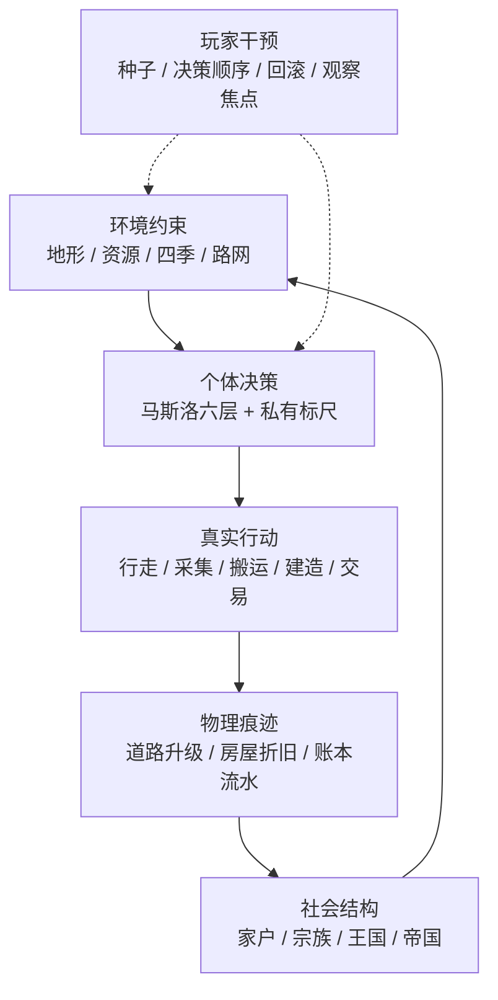

# 01. 产品总览：定位、核心循环与看点

> **本层定位**：`docs/current/design/` 回答「玩家看到什么、规则是什么、为什么这样设计」。
> 实现细节（状态机、数据流、同步契约）一律下沉到 [`../tech/`](../tech/)，本文只给链接，不复制。

---

## 1. 一句话定位

> **玩家规划一个社会，居民自主活出一段可以回放、比较和分享的家族史。**

Flow & Accord 不是「你操作角色」的模拟经营。20 名始祖、一片起伏的荒野、23 处储量有限的资源点与一座榷场互市，
没有任务清单、没有鼠标指挥、没有「下一步该干什么」的提示——只有一部由他们自己走出来、盖出来、生出来、争出来的千年族谱。

系统只扮演**物理规则执行者**：放置校验、路网接入、施工结算、交易交割。
至于「盖不盖、何时盖、盖在哪、娶不娶、夺不夺位」——那是他们自己的事。

- 面向玩家的完整介绍见 [`README.md`](../../../README.md)（营销口径，含三分钟上手与操作指南）。
- 长期方向与未落地里程碑见 [`../../plan/design/01-roadmap.md`](../../plan/design/01-roadmap.md)。

---

## 2. 三条设计哲学（所有玩法的判据）

| 哲学 | 含义 | 违反的代价 |
| :--- | :--- | :--- |
| **确定性是因果实验** | 同种子 + 同配置 + 同 Tick + 同干预 ⇒ 逐字节同一结果。玩家可保存、回滚、分支、复演 | 回滚与分享失去意义，「如果当时做了另一个选择」无法比较 |
| **玩家规划，Agent 自治** | 玩家只改变环境、公共规则和观察焦点；禁止系统扫描全图替居民派发任务 | 从「观察一个社会」退化成「指挥一队单位」 |
| **家族故事是主线** | 资源、道路、账本、政治最终都要回答「哪个人、哪个家庭、哪个世代因此改变」 | 系统很多但没有记忆点，玩家记不住任何人 |

配套两条体验原则：

- **信息逐步展开**：首局只呈现生存、房屋、关系；玩家产生兴趣后再打开账本、王国、决策编排与经济分析。
- **历史可比较**：回滚不是调试按钮，而是玩家比较分支历史的核心玩法。

---

## 3. 核心循环

循环的关键在于**每一步都留痕**：走过留下路、盖过留下房、交易留下账本流水、死亡留下空置房与族谱节点。
下一代继承的不是数值，而是这些痕迹构成的具体处境。

---

## 4. 八个值得盯着看的理由

| # | 看点 | 玩家能观察到的 | 规则与实现 |
| :--- | :--- | :--- | :--- |
| 1 | 真·自主 AI | Inspector 里「他此刻最想要什么、为什么想要」；决策顺序可拖拽热重排 | [03 生命与社会规则](./03-life-and-society.md) · [11 决策引擎](../tech/11-decision-engine.md) |
| 2 | 路是自己踩出来的 | 荒野小径 → 紫金帝国大道，没人走的路衰减回荒野 | [02 世界与地图规则](./02-world-rules.md) · [14 地形与路网](../tech/14-terrain-and-network.md) |
| 3 | 一间仓库到一座大庄园 | 五级形态、瞬时升级、自然折旧、无主房麦穗 37% 拍卖 | [03 生命与社会规则](./03-life-and-society.md) · [13 房屋系统](../tech/13-housing-system.md) |
| 4 | 四季会咬掉柴火 | 240s 一年、-3~31℃、冬季账本烧柴、低温受孕红线 | [02 世界与地图规则](./02-world-rules.md) · [15 四季与气候](../tech/15-seasons-climate.md) |
| 5 | 生死、遗传与六维禀赋 | 四项生理指标；智/力/魅/消化/睡眠/寿限六项禀赋代际漂移 | [10 生命周期](../tech/10-agent-life-cycle.md) |
| 6 | 家户 → 宗族 → 王国 | 成婚合并账本、分家继承、族税互助、长子继承王位、夺位远征 | [04 经济与资源规则](./04-economy.md) · [07 账本与政体](../tech/07-ledger-and-polity.md) |
| 7 | 千年族谱时间轴 | Y 轴严格映射出生时刻，主干优先落位，已故胎儿亦入谱 | [05 观察与交互设计](./05-observation-ux.md) |
| 8 | 时光倒流与永久存档 | Tick 回滚、1x~1024x 快进、本地文件直写、双主题 | [06 快照与存档](../tech/06-snapshot-and-save.md) |

补充看点：**动态季节光照**（光位一年扫 360°，春东/夏南/秋西/冬北，快捷键 `L` 开关）、
**写意微缩沙盘地形**（T2 两岸河谷静态水系 + D-A 装饰系统）、**水系微观生态层**（游鱼与波光）、
**地图图鉴独立页 + 世界种子分享**（`?seed=<n>`）。实现见 [`51 季节光照`](../tech/17-seasonal-lighting.md)
与 [`52 水体渲染`](../tech/18-water-rendering.md)。

---

## 5. 首局体验：十个不容错过的瞬间

| ⏱️ | 看点 | 去哪看 |
| :--- | :--- | :--- |
| 开局 1 分钟 | 第一条小径：营地与最近水源之间颜色最浅的虚线 | 地图路网 |
| 开局 3 分钟 | 第一间仓库：某个成年男性突然停下，在半山腰选址打桩 | 地图 + 房屋面板 |
| 第 1 个冬天 | 柴火考验：谁家账本木柴在供暖季见底 | 顶栏气温 + 房屋面板 |
| 绝境时刻 | 断流直达榷场：户主揣家户黄金直扑榷场买水买粮 | 地图榷场 + Inspector 金价流水 |
| 变故时刻 | 麦穗博弈二手房拍卖：无主私宅挂金色呼吸标牌 | 地图标牌 + 顶栏报价大盘 |
| 权力更迭 | 夺位远征：老国王咽气一刻，有人扔下工地狂奔营地 | 事件日志 + 营地王冠标牌 |
| 景物观察 | 季节光影与微观生态：太阳罗盘转向、水面波光、鱼群穿梭 | 地形/水体 + 顶栏当前光位 |
| 造物体验 | 世界种子与地图图鉴：同一整数种子复刻同一局演化 | 控制台世界种子 + 地图图鉴页 |
| 历史重温 | 时光倒流巡检：拉动滑块或输入 Tick 穿越回历史刻 | 顶栏/控制台倒流模态框 |
| 长程沉淀 | 人去楼空与族谱巨树：废墟地基留给后人复用 | 族谱时间轴 + 地图空置节点 |

**验收信号**：新玩家能在首局说出一个家族的名字、当前目标和最近一次转折，并愿意继续运行或重新打开游戏。

---

## 6. 玩家边界：什么能改，什么不能改

| 玩家能做 | 玩家不能做 |
| :--- | :--- |
| 选择世界种子、预览地形模板 | 直接下令某个族人去某地、做某事 |
| 拖拽 18 条决策分支与层级分界线（热注入并持久化） | 修改单个 Agent 的生理、行囊、账本 |
| 时光倒流到任意 Tick 并继续分支 | 凭空生成资源、取消已结算的交易 |
| 调整全部数值超参（免重编译，刷新即生效） | 关闭确定性或绕过放置/通行校验 |
| 选择观察焦点（族人 / 房屋 / 家户 / 宗族 / 王国） | 替居民决定婚姻、继承与夺位 |

超参与配置入口见 [`13 配置系统`](../tech/04-config-system.md) 与 [`14 配置速查`](../tech/05-config-reference.md)。
