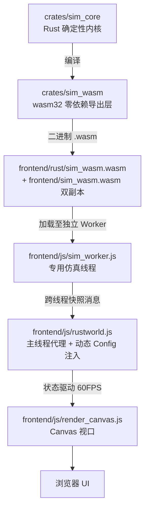
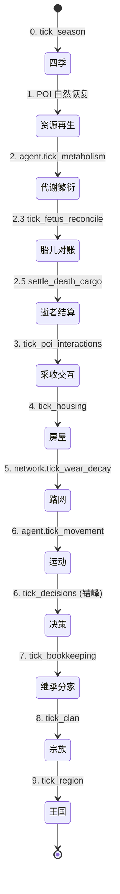

# 01. 引擎总体架构与数据流

> **层级**：总体层。向下串联 [`1x` 基座](#1文档地图)、[`2x` 上层](#1文档地图)、[`3x` 中层](#1文档地图)、
> [`4x` 下层](#1文档地图)、[`5x` 表现层](#1文档地图)、[`6x` 工程层](#1文档地图)。
> 产品视角见 [`../design/01-product-overview.md`](../design/01-product-overview.md)；
> 硬约束清单见 [`66 不变量`](./28-invariants.md)，改动影响面见 [`67 影响矩阵`](./29-impact-matrix.md)。

---

## 1. 三层解耦架构

**Rust 确定性计算内核 + WebAssembly 桥接 + Canvas 前端可视化**，三层之间只通过明确契约通信：



| 层 | 职责 | 边界 |
| :--- | :--- | :--- |
| `crates/sim_core` | 决策状态机、生态采收与随身搬运、路网寻路、私宅营建与空置房登记、经济账本 | 纯 Rust、无 JS 依赖、无浮点非确定性来源 |
| `crates/sim_wasm` | 线性内存 JSON 序列化、FABS 二进制帧快照、tick 步进、JS 动态配置注入 | 不承载业务逻辑 |
| `frontend/` | 原生静态前端（无构建步骤），Worker 仿真线程 + 主线程渲染 | 不存在独立的 JS 移植版仿真逻辑 |

> **双副本铁律**：`sim_wasm.wasm` 必须同时复制到 `frontend/rust/` 与 `frontend/` 两处，缺一不可。

---

## 2. 目录职责与文档地图

`tech/` 内文档**由上层到下层**排列，编号为**目录内顺序号**（从 `01` 起连续，跨层不重置）：

| 层 | 文档 |
| :--- | :--- |
| 总体与基座 | [02 核心系统状态机全景](./02-core-systems-fsm.md) · [03 确定性](./03-determinism.md) · [04 配置系统](./04-config-system.md) · [05 配置速查](./05-config-reference.md) · [06 快照与存档](./06-snapshot-and-save.md) |
| 上层 · 社会与经济 | [07 账本与政体](./07-ledger-and-polity.md) · [08 生态与 POI](./08-ecology-and-poi.md) · [09 市场与定价](./09-market-pricing.md) |
| 中层 · 个体与行为 | [10 生命周期](./10-agent-life-cycle.md) · [11 决策引擎](./11-decision-engine.md) · [12 M19 决策架构](./12-m19-architecture.md) · [13 房屋系统](./13-housing-system.md) |
| 下层 · 世界与物理 | [14 地形与路网](./14-terrain-and-network.md) · [15 四季与气候](./15-seasons-climate.md) |
| 表现层 | [16 前端总览](./16-frontend-overview.md) · [17 季节光照](./17-seasonal-lighting.md) · [18 水体渲染](./18-water-rendering.md) · [19 UI 实现](./19-ui-implementation.md) · [20 制度大盘 UI](./20-society-ledger-ui.md) · [21 前端开发指南](./21-frontend-dev-guide.md) |
| 工程层 | [22 构建与运行](./22-build-and-run.md) · [23 工具箱](./23-tools-guide.md) · [24 无头诊断](./24-diagnostics.md) · [25 性能基准](./25-benchmarking.md) · [26 CI/CD](./26-cicd.md) · [27 浏览器自动化](./27-browser-automation.md) · [28 不变量](./28-invariants.md) · [29 影响矩阵](./29-impact-matrix.md) · [30 工作流](./30-workflow.md) |
| 附录 | [31 代码地图](./31-code-map.md) |

**依赖方向**：上层依赖下层，下层不知道上层。改上层不应要求改下层的内部实现；改下层必须回头核对上层消费者。

---

## 3. 一个 Tick 的内部顺序

> 完整版与不变量见 [`67 影响矩阵 §二`](./29-impact-matrix.md)。**顺序即语义，任何调整都可能破坏确定性。**



**关键不变量**

- **卸货入账在决策之前**（3 在 6 之前）：决策读到的是卸货后的家户账本余额。
- **道路衰减在运动之前**（5 在 6 之前）：运动踩踏的是衰减后的路网。
- **决策在运动之后**：决策基于本 tick 运动后的位置与状态。
- **制度结算在决策之后**（7/8/9）：使用决策后的最终状态。
- **胎儿跳过**：代谢、运动、决策均跳过 `is_fetus` 的 agent。

---

## 4. 数据流：Rust → 前端

```text
SimConfig (config.rs + config.*.js)
    │ 序列化注入
    ▼
sim_wasm.wasm (world_create / world_tick / world_apply_config)
    │ FABS 二进制帧（主链路） / JSON（调试回退）
    ▼
snapshot 解码 (frontend/js/snapshot-bin.js)
    │
    ▼
rustworld.js::_applySnapshot()
    ├─→ this.agents / houses / pois / households / marriages / clans / regions
    ├─→ this.network (lanes / nodes)
    └─→ this.terrain (cells)
             ├─→ render_*.js  （Canvas 渲染）
             ├─→ main.js      （事件绑定）
             ├─→ ledger-ui.js （制度大盘）
             ├─→ decision-viz-view.js（决策引擎视图）
             └─→ dag-view.js  （族谱时间轴）
```

> **快照字段四处同步**（M4 起）：`snapshot.rs` → `world_snapshot.rs` → `snapshot_bin/encode.rs`
> → `snapshot-bin.js` + `rustworld.js`。回归兜底是 `test-wasm.js` / `test-determinism.js`（JSON 对拍门禁已于 v1.50.33 随 JSON 快照通道移除）。
> 详见 [`15 快照与存档`](./06-snapshot-and-save.md)。

---

## 5. 配置注入

全部可调超参由 `frontend/js/config.js` 及拆分配置（`config.house-upgrade-cost.js` /
`config.decision-order.js` / `config.lighting.js` / `config.render.js`）驱动，
经 `rustworld.js::applyConfig` 注入 Rust WASM 内存，**免重新编译热调优**。

- **前端 JS 是唯一数值真相源**（v1.44.9 起内核常量已清零），Rust 逻辑层一律通过 `self.config.<字段>` 引用，禁止散落字面量。
- 字段/类型/默认值/中文说明见 [`14 配置速查`](./05-config-reference.md)（由 `tools/config-check.js` 自动生成）。
- Rust↔JS 字段契约由 `node tools/config-check.js` 校验（含「空转参数」检测：两端口径一致但内核从不读取）。

---

## 6. 单文件与组织规范

| 规范 | 说明 |
| :--- | :--- |
| 单文件 ≤ 800 行 | 前端与 Rust 均遵守；超出按职责拆分并为新目录补局部 `AGENTS.md` |
| 目录级 `AGENTS.md` | 每个复杂目录维护一份，聚焦职责边界、文件清单与局部易踩坑 |
| 持久化测试禁令 | 不提交临时单元测试；长期验证走 `test-wasm.js` / `test-determinism.js` / `config-check.js` / `frontend-check.js` |
| 文档纪律 | 规划不写入现状文档；机制落地后才更新 `docs/current/`、局部 AGENTS、changelog 与版本 |

完整约定见 [`66 不变量`](./28-invariants.md) 与 [`68 工作流`](./30-workflow.md)。
