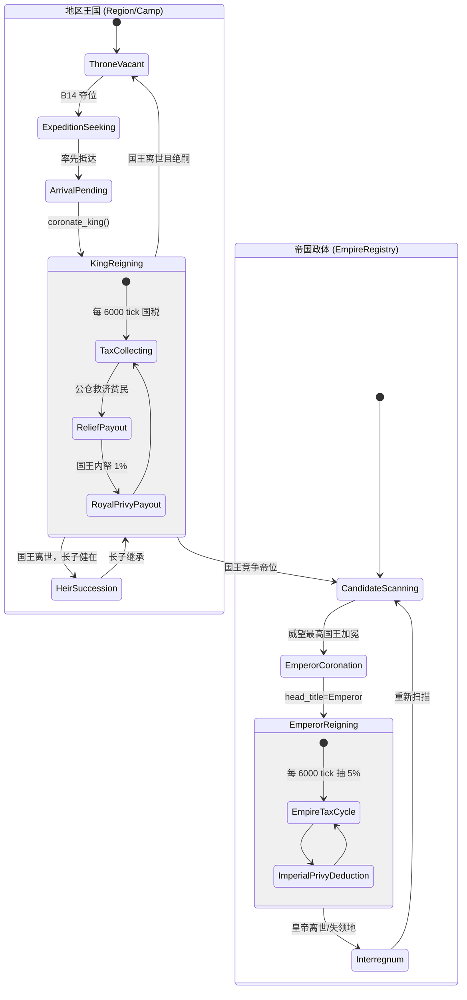

# 02. 三大核心系统状态机全景

> **文档定位**：跨系统导读。一张图看懂"个体决策 / 私宅房屋 / 王国政体"三大状态机如何咬合。各系统的机制细节、数值阈值与守卫条件以对应模块文档为权威：
> - 个体决策 → [11-decision-engine.md](./11-decision-engine.md) · [12-m19-architecture.md](./12-m19-architecture.md)
> - 私宅房屋 → [13-housing-system.md](./13-housing-system.md)
> - 王国与账本 → [07-ledger-and-polity.md](./07-ledger-and-polity.md)
>
> 本文**不**重复上述文档的阈值与守卫，只提供跨系统视角与不变量。

---

## 1. 系统一：马斯洛需求决策状态机

个体行为由 `Decisioner::arbitrate_sustained_task` 按错峰相位（`(tick + agent.id) % agent_decision_interval_ticks`，默认 120）驱动；M19 三层解耦后，`ActiveTask` 是持续任务单一真相源，`agent.state` 为只读投影。⓪ 瞬发分支（近距求偶、竞拍、门前育儿）只写 pending 不占持续任务槽位。

```mermaid
stateDiagram-v2
    [*] --> RestingAtCamp : 出生/初始化

    state RestingAtCamp {
        [*] --> Evaluating : 错峰相位触发
        Evaluating --> InstantPhase : 瞬发分支遍历（只写 pending）
        InstantPhase --> MaslowScan : 按 config 顺序评估持续分支
        MaslowScan --> Dispatched : 命中需求 → L2 选策略 → L3 安装导航
        MaslowScan --> IdleCheck : 无常规需求
        IdleCheck --> Homebound : 有私宅且远离门节点
        IdleCheck --> StayRest : 在私宅门前/营地休息
    }

    RestingAtCamp --> SeekingResource : 水/粮/木/石/金 采收
    RestingAtCamp --> SeekingMarket : 榷场采购
    RestingAtCamp --> SeekingThrone : 夺位远征
    RestingAtCamp --> SeekingCourtship : 远距寻偶
    RestingAtCamp --> RepairingHouse : 修缮私宅
    RestingAtCamp --> ConstructingHouse : 营建/升级
    RestingAtCamp --> RaiseChild : 自宅育儿

    state "途中 (Seeking*)" as InTransit {
        note right of InTransit
            每拍熔断：
            - 私有施密特触发器关闭
            - 体力低于预警
            - 目标被抢占
        end note
    }

    RestingAtCamp --> InTransit
    InTransit --> ReturningToCamp : 目标断流/体力告警折返
    InTransit --> SeekingMarket : 水/粮/木断流直达榷场
    InTransit --> InTransit : 就近同类 POI 平滑重路由

    SeekingResource --> HarvestDone : 抵达现场作业
    HarvestDone --> InTransit : 连续采收（含 4 站 TSP 预排队列）
    HarvestDone --> ReturningToCamp : 需求已足/体力消耗达标
    ReturningToCamp --> RestingAtCamp : 抵达门节点/营地
```

> 分支守卫、施密特阈值、断流直达榷场、衰弱守卫等细节见 [11-decision-engine.md](./11-decision-engine.md) §3 与 `decisions/AGENTS.md`。

---

## 2. 系统二：私产房屋生命周期

房屋五级形态 `Tier0 仓库 → Tier1 茅屋 → Tier2 木屋 → Tier3 宅院 → Tier4 庄园`；每栋房屋实体化时接入路网生成唯一大门节点 `door_node_id`，居住者 `home_house_id` 指向该房屋。升级成本按 4×5 矩阵由家户账本扣除（阈值权威在 `config.js`，不在此硬编码）。

```mermaid
stateDiagram-v2
    [*] --> SiteReserved : B12 立宅选址（pending_house_pos）
    SiteReserved --> UnderConstruction : 抵达宅址实体化
    UnderConstruction --> ActiveOccupied : 接入路网、生成 door_node_id、户主入住

    state ActiveOccupied {
        [*] --> T1
        T0 --> T1 : 升级
        T1 --> T2 : 升级
        T2 --> T3 : 升级
        T3 --> T4 : 升级
        note right of ActiveOccupied
            日常循环：自然风化折旧、
            冬季烧柴、耐久<50% 触发修缮
        end note
    }

    ActiveOccupied --> Repairing : 户主就地修缮
    Repairing --> ActiveOccupied : 耐久恢复

    ActiveOccupied --> VacantAuction : 户主离世（清退旧住户）
    state VacantAuction {
        [*] --> ObservationPhase : 37% 麦穗观察期
        ObservationPhase --> BiddingPhase : 基准价锁定
        BiddingPhase --> DealSettled : 首个超标报价 / 耐久<10% 强平
    }
    DealSettled --> ActiveOccupied : 产权交割，新户主入住

    ActiveOccupied --> Collapsed : 极度荒废耐久归零
    VacantAuction --> Collapsed : 拍卖期耐久归零
    Collapsed --> [*] : 房屋移除，门节点释放
```

> 升级门槛、修缮触发、麦穗拍卖 37% 规则、归宿门节点保护见 [13-housing-system.md](./13-housing-system.md)。

---

## 3. 系统三：王国与帝国政体演化

两级政体：下层为各营地的地区王国（公仓税收 + 贫民救济 + 国王内帑），上层为帝国（从各王国公仓抽成 5% 入皇帝公帑）。王位按男性长子世袭，绝嗣则空悬并开放远征争夺。



> 税率、抽成、继承规则、公仓账簿字段见 [07-ledger-and-polity.md](./07-ledger-and-polity.md)。

---

## 4. 跨系统交互契约与不变量矩阵

三大状态机通过状态引用与不变量耦合：

| 交互维度 | 马斯洛决策（系统一） | 私产房屋（系统二） | 王国与帝国（系统三） |
| :--- | :--- | :--- | :--- |
| **归宿锚定** | 返家读取房屋门节点 `door_node_id`；休整强制回宅 | 房屋经路网锚定大门节点，唯一门牌拓扑 | 加冕不得篡改既有门节点；无房者才挂靠营地 |
| **物资与开销** | 吃喝烧柴从家户账本扣减；采集采购入家户账 | 升级修缮扣家户账；冬季壁炉按速率扣木材 | 国税向家户账征收；公仓向极贫家户注入救济 |
| **空间冲突** | 立宅避开 POI 半径与营地核心 | 国王立宅限自家营地辖区 | 夺位由成年男性发起；有房者限自家营地 |
| **生育与传承** | 育儿要求双方在自宅门口且男方有 ≥1 级私宅 | 房屋为繁衍资产，户主故去触发继承或拍卖 | 王位男性长子世袭，绝嗣退化为远征争夺 |

### 4.1 核心不变量

1. **唯一归宿**：任何在世 Agent 同一时刻有且仅有一个合法返航节点（有私宅走 `door_node_id`，无房走 `camp_node`）；加冕/结婚/分家原子重定向。
2. **坐标连续**：任何寻路重定向（断流直达榷场、王位易主掉头）严禁瞬移，必须沿当前车道平滑反向掉头。
3. **派发原子**：仅当 `self.dispatch` 成功（路径非空）才进入移动态与需求展示；寻路失败安全回退静止态，清除幽灵标签。

> 跨系统硬约束全集见 [28-invariants.md](./28-invariants.md)。
