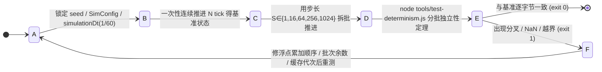
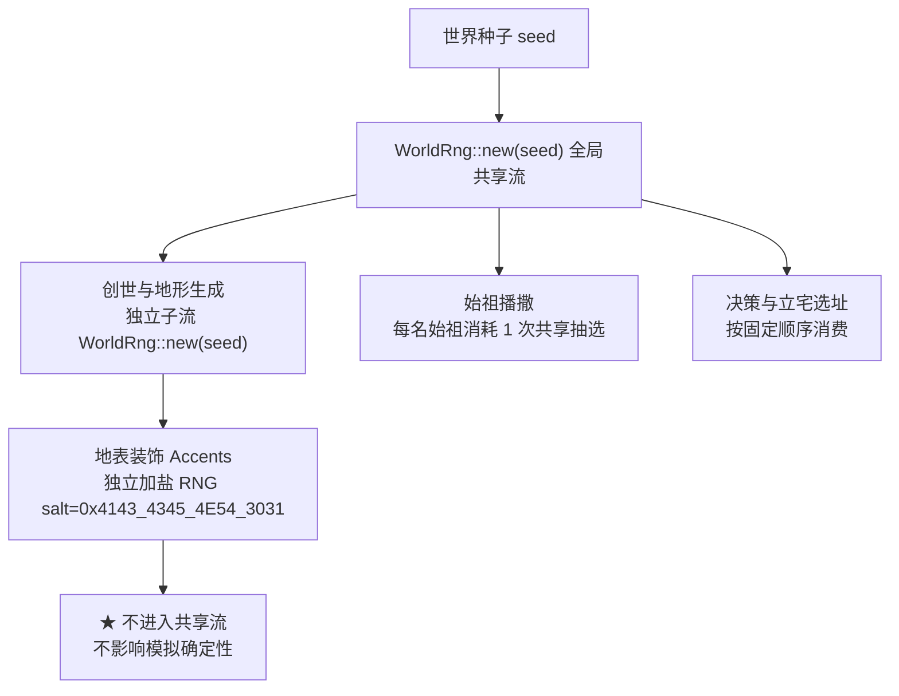

# 03. 确定性：为什么它是本项目的第一约束

> **层级**：总体与基座层。
> 本文讲**原理与机制**；可直接勾选的硬约束清单见 [`66 不变量`](./28-invariants.md)，
> 性能与确定性回归工具见 [`63 性能基准`](./25-benchmarking.md)。

---

## 状态机

本状态机描述「一批 tick 的推进与确定性验证」：在锁定同一种子、同一配置、同一 `simulationDt` 的前提下，把同一段历史分别用连续推进与步长 {1, 16, 64, 256, 1024} 分批推进，结果必须经 `test-determinism.js` 的「分批独立性」定理验证为逐字节一致，否则回退修复。边界是时光倒流、快进与种子分享能成立的前提（§4 / §5）。

| 状态 | 含义 | 进入条件 | 退出条件 |
| :--- | :--- | :--- | :--- |
| A | 准备批次 | 锁定同一种子、同一 SimConfig、同一 `simulationDt` | 配置冻结，开始推进 |
| B | 连续基准 | 配置已锁定 | 一次性连续推进 N tick 完成 |
| C | 分批推进 | 连续基准已产出 | 按某步长拆分推进完成 |
| D | 确定性校验 | 分批结果已产出 | `test-determinism.js` 跑完 |
| E | 验证通过 | 逐字节一致 | 进入终态 |
| F | 回退修复 | 出现分叉 / NaN / 越界 | 修复后回到 A 重测 |

**不变量**（违反即出 bug）：
- 新增 RNG 消费点必须走全局 `WorldRng`，禁止 `rand::thread_rng()` 等外部熵源，否则同种子逐字节一致性被破坏（§2 / D4）。
- 分批推进结果必须与连续推进逐字节一致，否则 `test-determinism.js` 的分批独立性定理判定失败（§4）。
- `simulationDt`（1/60 模拟小时）严禁改动；改 dt 等价于破坏确定性基准，所有时间相关参数失效（§3 / D5）。

## 1. 确定性意味着什么

> 同一种子、同一配置、同一 Tick 数、同一组玩家干预 ⇒ 世界状态**逐字节一致**。

这不是洁癖，而是核心玩法的前提：

| 玩法 | 依赖的确定性 |
| :--- | :--- |
| 时光倒流（Checkpoint + Replay） | 回滚到 Tick N 后重放，必须得到与历史完全相同的结果 |
| 世界种子分享（`?seed=<n>`） | 别人打开同一链接必须看到同一局演化 |
| 分支比较（如果当时做了另一个选择） | 分叉点之前的历史必须一致，比较才有意义 |
| Bug 复现与无头诊断 | 指定 seed + tick 必须稳定重现现场 |

**代价**：任何性能优化（算法剪枝、数据并行、缓存、多线程）只要破坏时钟相位、RNG 消费顺序或浮点累加顺序，
都会导致全图演化灾难性分叉。因此优化必须走
「**基准留痕 → 代码优化 → 确定性矩阵验证 → 加速比回归**」闭环。

---

## 2. RNG 分域：谁可以掷点

全局共享 `WorldRng`，但不同领域必须走**独立子流**，避免新增消费者打乱既有消费顺序：

| 领域 | 规则 |
| :--- | :--- |
| 创世/地形 | 沿独立 `WorldRng::new(seed)` 派生的固定子流；候选搜索、同成本排序、重试次数、修复顺序全部固定 |
| 装饰（Accents） | 由世界坐标 + 稳定对象 ID + 视觉种子派生，**不消费共享模拟 RNG** |
| 记忆形成/衰减/淘汰 | 首期明确不消耗 RNG |
| 只读报价与观察 | 只读路径不得消费 RNG、不得写入任何状态 |
| 新增随机 | 一律走 `WorldRng`，禁止 `rand::thread_rng()` 等外部熵源 |

---

## 3. 时间与节拍

| 项 | 值 | 说明 |
| :--- | :--- | :--- |
| `simulationDt` | 1/60 模拟小时 | 单个 tick 的模拟时长，**严禁改动** |
| `agentDecisionIntervalTicks` | 120 | 错峰决策相位 `(tick + id) % 120 == 0`，平均 2 游戏小时决策一次 |
| 一年 | 240 模拟秒 | 四季年轮，也是季节光照光弧的周期 |

**错峰的意义**：把决策均摊到 120 个 tick 上，避免每 tick 全人口决策造成帧率尖峰。
新增决策分支不得绕过错峰相位，也不得按需求层级再错峰（会破坏既有相位）。

---

## 4. 分批推进必须与连续推进等价

同一段历史用 1 / 16 / 64 / 256 / 1024 步长分批推进，结果必须与一次性连续推进**逐字节一致**。
这是 `test-determinism.js` 的核心定理之一，也是时光倒流与快进能成立的前提。

**常见破坏方式**

- 在批次边界做「每 N tick 才执行一次」的优化而没考虑余数；
- 用挂钟时间（`Date.now()`）而非 tick 数驱动状态；
- 浮点累加顺序随批次长度变化；
- 缓存键不含世界实例代次，换世界后残留旧缓存。

---

## 5. 确定性门禁矩阵

| 门禁 | 覆盖 |
| :--- | :--- |
| `node tools/test-wasm.js` | 同种子逐字节、防越界、防 NaN、长程稳定、存读档 |
| `node tools/test-determinism.js` | 6 大定理：多种子 / 分批独立性 / 快照无副作用 / 存读档 / … |
| `node tools/test-snapshot-bin.js` | FABS 二进制帧 ≡ JSON 快照同构 |
| `node tools/config-check.js` | Rust `SimConfig` ↔ 前端 `config.js` 字段/类型/默认值零漂移 |
| `node tools/cross-doc-check.js` | 跨文档事实指纹一致（避免文档间口径冲突） |
| `node tools/bump-version.js --check` | 版本号定义点零漂移 |

> **持久化测试禁令**：不提交临时单元测试；临时验证脚本/断言用后即删，长期验证一律进上述门禁。

---

## 6. 存档与确定性的关系

- `SAVE_FORMAT_VERSION` 仅在结构不兼容时升级；`SAVE_APP_VERSION` 变更会**按设计自动废弃旧存档**。
- 读档**不得**重新规划、重新掷点、重发启动资本或丢失半段任务。
- 地形 `TERRAIN_GENERATOR_VERSION` 变更同样触发旧存档拒绝（生成器形态变了，历史不可复现）。

详见 [`15 快照与存档`](./06-snapshot-and-save.md)。

---

## 7. 不变量的存放位置

本文只解释「为什么」。可直接勾选的硬约束（确定性、数据一致性、行为语义、构建部署、代码组织、前端 DOM 六大类，
每条标注来源章节与违反后果）统一收敛在 [`66 不变量`](./28-invariants.md)，
避免同类约束在多个文档里各写一遍而逐渐漂移。
