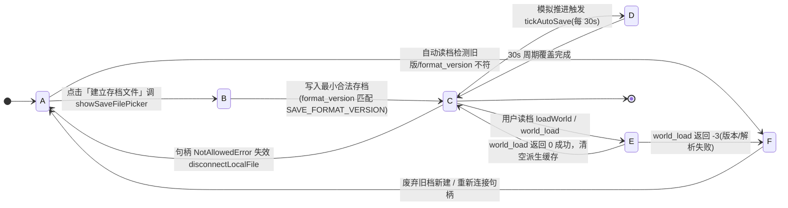
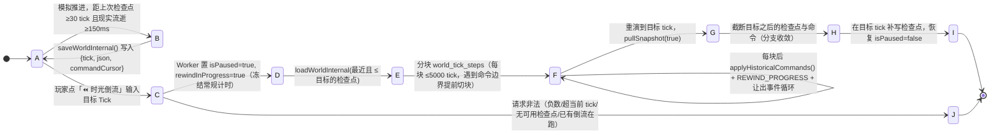

# 06. 💾 读档 / 存档系统 (v1.11.0)

> **模块索引**：[← 返回 ../README.md 全景索引](../README.md)
> **主要源码**：`crates/sim_core/src/spatial/world_save.rs` + `crates/sim_wasm/src/lib.rs` + `frontend/js/save-ui.js`
> 相关文档：[./29-impact-matrix.md](./29-impact-matrix.md)（跨模块影响）· [./28-invariants.md](./28-invariants.md)（确定性硬约束）· `crates/sim_core/src/spatial/AGENTS.md` · `frontend/AGENTS.md`

---

## 状态机

存档从「启动阻塞未建档 → 建立并授权句柄 → 已挂载」流转，运行中在自动保存与读取间切换；`SAVE_APP_VERSION` 不匹配直接拒绝读档并保持原世界不变。



| 状态 | 含义 | 进入条件 | 退出条件 |
| :--- | :--- | :--- | :--- |
| A 未建档 | 启动门禁 `#startup-save-gate` 阻塞，模拟默认暂停 | 世界创建 | 建立或连接存档句柄 |
| B 建立并授权 | `showSaveFilePicker` 获得 `FileSystemFileHandle` | 用户手势点击建立 | 写入最小合法存档 |
| C 已挂载 | 句柄可用，门禁解除，模拟恢复 | 存档文件合法 | 自动保存/读取/失效 |
| D 自动保存中 | `tickAutoSave` 每 30s 直写本地文件或 localStorage 三槽位 | 模拟推进 | 周期覆盖完成 |
| E 读取中 | `world_load` 载入存档覆盖世界 | 用户读档 | 成功(0)/失败(-3) |
| F 版本不匹配拒绝 | `app_version != SAVE_APP_VERSION` 或解析失败，保持原世界不变 | world_load 返回 -3 | 废弃旧档或重连 |

**不变量**（违反即出 bug）：
- `save.app_version != SAVE_APP_VERSION` 直接 Err 拒绝读档，版本变更旧档自动废弃（Test 4 守卫：当前世界快照不变）。
- `format_version` 与 `SAVE_FORMAT_VERSION` 必须同改（Rust `world_save.rs` 与前端 `save-ui.js` 两处）。
- 可重建字段（`terrain` 按 seed+profile、`agent_index` 读档重建）不入库；读档续演须与连续跑到同 tick 逐字节一致（Test 3）。

## 1. 定位与设计红线

存档系统把「内核全量世界状态」序列化为 JSON，支持两种持久化后端：
1. **浏览器槽位**：三槽位落 `localStorage`，适合中小存档；
2. **本地文件直写**（v1.11.0）：用户通过 File System Access API 连接一个本地 `.json` 文件后，存档直写用户磁盘，**不受浏览器存储配额限制**，适合长时间运行后的大存档。

> 🔴 **浏览器要求**：本地文件直写依赖 **Chrome / Edge 的 File System Access API**（Firefox / Safari 无 `showSaveFilePicker`）；且 ★ v1.27.0 起启动存档门禁要求先建立/连接可写存档才解除模拟暂停——**一切浏览器测试能用 Chrome 必须优先用 Chrome**，否则门禁无法通过。

**三条设计红线**：

1. **强确定性**：读档后继续 tick 的演化，必须与「从不中断连续跑到同一 tick」**逐字节一致**。由 `tools/test-wasm.js` 的 Test 3 长期守卫。
2. **可重建字段不入库**：`terrain` 按种子重建、`agent_index` 读档重建，省体积且不引入冗余真相源。
3. **版本不兼容即拒绝**：`format_version` 不符时返回错误并**保持原世界不变**，绝不静默降级加载（Test 4 守卫）。

---

## 2. 内核层：存档契约 `WorldSave`

文件：`crates/sim_core/src/spatial/world_save.rs`（~200 行）

```
World3DEngine
  ├─ to_save()                  逐字段填充 WorldSave（clone 语义，不移动所有权）
  ├─ serialize_save(&world)     → Result<String>   JSON
  └─ deserialize_save(&str)     → Result<World3DEngine>
                                  ① 校验 format_version
                                  ② 校验 grid_res / world_size
                                  ③ 校验 agent id 唯一（防脏档让 agent_index 错乱）
                                  ④ 校验 terrain_generator_version / terrain_profile
                                  ⑤ TerrainMap::new + generate_with_profile(seed, terrain_profile) 重建地形
                                  ⑥ rebuild_agent_index() 重建派生索引
```

### 2.1 入库字段清单

| 分组 | 字段 |
| :--- | :--- |
| 元信息 | `format_version` / `app_version` |
| 重建参数 | `seed` / `grid_res` / `world_size` / `terrain_generator_version` / `terrain_profile` |
| 基础实体 | `network` / `pois` / `houses` / `agents` |
| 发号器 | `next_agent_id` / `next_house_id`（各登记簿的 `next_id` 内嵌在自身结构里） |
| 计数器 | `total_births` / `total_deaths` / `total_deaths_natural` / `total_deaths_unnatural` / `total_miscarriages` / `auction_started` / `auction_sold` / `auction_flopped` |
| 环境 | `season_timer` / `current_season` / `temperature` |
| **确定性核心** | `rng`（`WorldRng` 内部 `state: u64`） |
| 生态倍率 | `water/berry/wood/stone/gold_regen_multiplier` |
| 时钟 | `tick_counter` / `last_event` / `last_royal_payout_tick` |
| 配置 | `config`（`SimConfig` 全量，**读档沿用存档时的配置**） |
| 社会制度 | `marriage_registry` / `household_registry` / `clan_registry` / `region_registry` / `public_granary` |
| 冷却表 | `mutual_aid_cooldown` / `relief_cooldown`（均 BTreeMap 保序） |

每名 agent 的私有状态（`poi_seekability` 施密特触发器 / `family_stock_active` / `gold_mining_cooldown` / `miscarriage_cooldown_timer` / `postpartum_cooldown_timer` / `route` 等）随 `Agent3D` 整体序列化，**无需单独处理**。夺位远征目标（`expedition_target_camp` / `coronation_pending`）为瞬态不落档，读档后重置为空，下一决策相位重新评估（v1.9.0）。

### 2.2 显式排除的字段

| 字段 | 排除理由 | 恢复方式 |
| :--- | :--- | :--- |
| `terrain` | 地形网格与 T1 特征由 seed + profile 确定性重建，入库仍属可重建数据 | `TerrainMap::generate_with_profile(seed, terrain_profile)` |
| `agent_index` | `AgentId → Vec 下标` 的派生索引，入库即冗余真相源 | `rebuild_agent_index()` |

### 2.3 序列化能力补齐

| 类型 | 处理 |
| :--- | :--- |
| `WorldRng` | 补 `Serialize/Deserialize`（仅一个私有 `state: u64`） |
| `LaneGraph3D` | **手写** serde：只持久化「按插入顺序的节点/车道扁平列表 + 两个发号器」，反序列化按同序重建 `graph`/`node_map`/`edge_map`。正确性前提是路网从不删除节点/车道（`housing_system/AGENTS.md` §4.2），因此邻接表边序与原图逐条一致，A* 结果保持确定性 |
| `PrimitivePoi` 的 `current_stock` / `max_stock` / `regen_rate` | 走 `finite_f32` 助手：非有限值用字符串哨兵（`Infinity` / `-Infinity` / `NaN`）编码。**营地储量恒为 `INFINITY`**，若按 serde_json 默认的 `null` 编码，反序列化 f32 会直接报错导致「能存不能读」 |

---

## 3. WASM 桥接层

文件：`crates/sim_wasm/src/lib.rs`。沿用现有「线性内存 JSON 缓冲区」约定，新增静态 `SAVE_BUF` 与 `ERROR_BUF`。

| 导出 | 语义 |
| :--- | :--- |
| `world_save_ptr()` / `world_save_len()` | 导出当前世界存档 JSON；失败时缓冲清空（len=0） |
| `world_save_buf_ptr(len)` | 准备可写缓冲，返回指针 |
| `world_load(len) -> i32` | 载入缓冲中的存档并覆盖世界：`0` 成功 / `-1` 长度越界 / `-2` 非 UTF-8 / `-3` 解析或校验失败（含版本不兼容） |
| `world_last_error_ptr()` / `world_last_error_len()` | 最近一次失败原因文本（成功时长度 0） |

---

## 4. 前端层

### 4.1 适配层 `rustworld.js`（★ v1.38.0 Web Worker 消息桥接）

| 方法 | 说明 |
| :--- | :--- |
| `saveWorld()` | 向 `sim_worker.js` 发送 `SAVE` 请求，返回 `Promise<string|null>` 异步解析为 JSON 字符串 |
| `loadWorld(jsonStr, meta?)` | 向 `sim_worker.js` 发送 `LOAD` 请求，Worker 执行 `world_load` 并回传重构快照；成功后清空前端派生缓存（`_trails` / `agentArchive` / `_lastEvent` / `_terrainCached`、`deselect()`），返回 `Promise<{ok, error}>` |
| `readSaveError()` | 读取 Worker 最近一次内核错误文本 |

**读档后不重新注入 `window.SIM_CONFIG`**——存档自带 `SimConfig`，重注入会让前端热调参覆盖存档时的运行参数、破坏续演语义。

### 4.2 UI 层 `save-ui.js`（~620 行）

- **三槽位**：自动槽（每 30 秒覆盖，世界未推进则跳过；重置生态开启新档时亦自动更新保存）/ 手动槽 1 / 手动槽 2。
- **存储键**：正文 `flowaccord.save.v1.<slotId>`，元信息统一放索引键 `flowaccord.save.v1.__index`（避免正文重复占用配额）。
- **元信息**：`tick` / 存活人口 / 存续家户数 / 保存时间 / 种子 / 体积 / `app_version`，仅在保存或导入时解析一次。
- **面板**：顶栏「💾 存档」「📂 读档」两个按钮打开同一面板，切换保存/读取标签；槽位卡片支持覆盖保存、读取、导出、删除（二次确认）；底部支持导入 `.json` 文件（校验 `format_version` 后直接载入）。
- **读档后自动暂停**并同步顶栏暂停按钮文案，便于核对世界状态。
- **Esc 关闭**走捕获阶段拦截，避免同时触发 Inspector 关闭逻辑。

#### 4.2.1 本地文件存档（v1.11.0，File System Access API）

- **连接**：`connectLocalFile()` 调 `showSaveFilePicker()` 让用户选择/新建一个 `.json` 文件，获得 `FileSystemFileHandle` 后存入 `localFileHandle`。
- **写入**：`saveToLocalFile()` 经 `handle.createWritable()` → `write(json)` → `close()` 直写磁盘，无需重复弹窗。
- **读取**：`loadFromLocalFile()` 从已连接文件读取；`loadFromLocalFilePicker()` 支持不先连接、直接 `showOpenFilePicker()` 打开任意存档文件。
- **自动保存切换**：已连接本地文件时，`tickAutoSave()` 每 30 秒直写本地文件而非 localStorage，彻底规避大存档的 `QuotaExceededError`。重置生态开启新档时同样触发自动更新。
- **兼容性降级**：`supportsLocalFileAPI()` 检测 `showSaveFilePicker`/`showOpenFilePicker`；不支持时（Firefox 等）隐藏连接按钮，读取标签下的「选择存档文件」降级到传统 `input[type=file]`，底部提示引导使用 Chrome/Edge。
- **权限失效**：写入/读取捕获 `NotAllowedError`，自动 `disconnectLocalFile()` 并提示重新连接。
- **句柄不持久化**：页面刷新后 `localFileHandle` 失效（浏览器安全策略），需用户重新连接。

#### 4.2.2 启动存档文件门禁（v1.27.0）与自动读档（★ v1.28.0，v1.28.1 权限加固）

- **启动即暂停**：`main.js` 构造世界后立即置 `sim.isPaused = true`，页面叠加阻塞式启动层（`#startup-save-gate`），模拟画布不可操作。
- **必须先建档**：点击「建立存档文件」调用 `showSaveFilePicker()` 创建/连接 `.json` 文件，写入最小合法存档（`format_version` 匹配 `SAVE_FORMAT_VERSION`）后才解除门禁恢复模拟。**★ v1.28.0 自动读档**：已连接自动槽（默认目录 + 默认文件名 `flowaccord-save1.json`，句柄经 IndexedDB 恢复，无需用户手势）时，打开游戏直接读取其内容续演（自动解除暂停、同步暂停按钮文案），**不再开新世界等自动保存覆盖旧档**；读取失败（权限失效/文件损坏/版本不兼容）保持阻断并回退手动连接。**★ v1.28.1**：句柄权限未持久化时不再自动断开/删除 IndexedDB 记录——启动时先静默重授（授权已持久化立即成功），失败则提供「🔓 授权并读取上次存档」按钮（点击 = 用户手势内 `requestPermission` 弹授权）；保存/读取遇 `NotAllowedError` 亦就地重授后重试一次，仅显式「断开」才删除句柄记录。
- **取消/失败即阻断**：用户取消、权限拒绝、写入失败或格式版本不符时保持暂停，提示原因并允许重试——**绝不静默降级**到不落盘的运行态。
- **`?nogate=1` 门禁旁路（★ v1.50.8）**：URL 携带 `nogate` query 参数（任意值均可，惯例 `?nogate=1`）时 `bootstrapStartupGate` 直接隐藏门禁弹窗并解除暂停，**不连接任何存档文件**。供截图/演示/自动化预览等无需持久化存档的场景；该模式下自动保存因无句柄静默跳过（`tickAutoSave` 对空句柄 no-op），仅内存演算，刷新页面世界回到初始态。
- **浏览器兼容**：仅支持 File System Access API（Chrome/Edge）；Firefox 等不兼容浏览器显示阻断提示，不提供 localStorage 降级启动，也不创建世界。
- **`app_version` 强制门禁与自动废弃（★ v1.37.1，★ v1.44.1 自动同步）**：`world_save.rs` 的 `SAVE_APP_VERSION` 随版本发布更新（当前 **1.50.33**）。`deserialize_save` 中作为内核硬性门禁校验（`save.app_version != SAVE_APP_VERSION` 直接返回 Err 拒绝），版本变更时旧档**自动废弃**。**★ v1.44.1 起该常量由 `node tools/bump-version.js --patch` 自动同步**（唯一真相源 = `index.html` 版本徽章），**禁止手工编辑**；改完必须重编译 WASM 并同步双副本，否则内核里仍是旧版本号。`node tools/bump-version.js --check` 是防漂移门禁。
- **启动门禁废弃引导（★ v1.37.1）**：`bootstrapStartupGate` 检测到旧版本存档时拦截自动续演，提示旧版本存档已废弃，并将按钮切换为「🆕 废弃旧档并新建世界」，引导覆盖写入当前版本初始世界开始模拟。
- **面板卡片废弃标识与禁用（★ v1.37.1）**：存档列表中旧版本卡片展示 `⚠️ 已废弃 (v旧版本)` 徽章并禁用「📂 读取」按钮（保留「覆盖保存」与「断开」）；本地导入时亦同步拦截非当前版本文件。

---

## 5. 验证

`tools/test-wasm.js`（长期唯一自动化验证）：

| 用例 | 断言 |
| :--- | :--- |
| Test 3 存档读档确定性 | 同种子跑到存档点 → 存档 → 续演；对照组新建同种子世界跑到存档点 → 读档 → 续演同一步数，两组快照 JSON **逐字符串相等**；且读档后 `tick` 与存档时刻一致 |
| Test 4 版本门禁 | 篡改 `format_version` 或 `app_version` 后 `world_load` 均返回 `-3`，且**当前世界快照不变**（失败不污染内存） |

当前实测：初始世界（60×60、20 名族人、无房屋）存档体积 **约 392 KB**；长时间运行后人口增长、账本流水累积，存档可达数 MB 甚至更大，可能超出 localStorage 5 MB 配额。**大存档请使用本地文件直写模式**（v1.11.0），存档直接写入用户磁盘，无配额限制。

---

## 6. 易踩坑

1. **新增引擎字段必须同步 `WorldSave`**：`World3DEngine` 加字段后若忘记加进契约，读档会静默丢状态（编译器不会报错，因为 `deserialize_save` 是逐字段构造）。Test 3 的确定性对比能捕获大部分漏存，但不是全部——**加字段时同步改 `world_save.rs` 的三个位置**：结构体字段、`to_save()` 填充、`deserialize_save()` 构造。
2. **非有限浮点必须走 `finite_f32`**：任何可能为 `INFINITY`/`NaN` 的入库 f32 字段都要加 `#[serde(with = "finite_f32")]`，否则存得进、读不回。
3. **读档必须重建 `agent_index`**：遗漏会导致 `agent_by_id()` 返回错误下标或 panic。
4. **读档必须强制重建地形快照**：不同种子的档地形不同，`_terrainCached` 不清会沿用旧地形。
5. **`format_version` 与 `SAVE_FORMAT_VERSION` 必须同改**：Rust 常量在 `world_save.rs`，前端常量在 `save-ui.js`，二者一致才能正确提示版本不兼容。该常量是**结构版本**（**当前 7**；v1.46.8 M19.2 持久化 `ActiveTask` 升至 5，v1.46.12 因 `BranchId` 收敛为 16 条升至 6，v1.47.5 T2 共享水池聚合升至 7），仅在存档结构或持久化枚举不兼容时手工 +1，**不随应用版本自增**（`tools/bump-version.js --check` 会打印其当前值供核对）。
6. **本地文件句柄不跨页面刷新持久化**（v1.11.0）：`FileSystemFileHandle` 仅在当前页面生命周期内有效，刷新后必须重新连接；不可假设句柄持久化，也不要尝试把句柄存入 localStorage（它不可序列化）。
7. **`showSaveFilePicker`/`showOpenFilePicker` 必须在用户手势中调用**：不能在 `setInterval` 或异步回调中间接触发，否则浏览器会报 `SecurityError`。`connectLocalFile()` 和 `loadFromLocalFilePicker()` 均由按钮点击直接触发。
8. **自动保存切换本地文件后不再写 localStorage**：已连接本地文件时 `tickAutoSave()` 直写磁盘，localStorage 自动槽不再更新——这是有意行为（避免双倍写入且大存档会撑爆 localStorage），断开连接后自动恢复 localStorage 模式。
9. **版本比较前必须 `normalizeVer()` 归一化（★ v1.44.2 事故）**：内核 `SAVE_APP_VERSION` 与存档 `app_version` **没有 `v` 前缀**，而前端兜底串历史写法带 `v`（`'v1.38.0'`）。`save-ui.js` 若直接 `meta.appVersion === curVer`，在 Worker READY 前必然不等 → 启动门禁 100% 误报「旧档已废弃」；等引擎就绪后同一判定又变 true → 点「废弃旧档并新建」反而把旧档读进来。**新增任何版本比较点都必须用 `normalizeVer()`（去空白 + 去 `v` 前缀），且决策前先 `await waitEngineReady()`**；`v` 只在 UI 文案里拼接显示。

---

## 7. 快照帧通道（★ M4 FABS 二进制帧 · 四处同步）

> 本节是「**运行时快照下发**」的权威描述（与上文「存档 JSON」是两条不同链路）。导航登记见 [`../README.md`](../README.md) 第 06 项。

### 7.1 四处同步链（新增字段必改）

| # | 位置 | 职责 |
|---|---|---|
| ① | `crates/sim_core/src/spatial/snapshot.rs` | 快照结构体**定义** |
| ② | `crates/sim_core/src/spatial/world_snapshot.rs::generate_snapshot()` | 从世界状态**赋值** |
| ③ | `crates/sim_core/src/spatial/snapshot_bin/encode.rs::write_snapshot_binary()` | **FABS 定长二进制编码**（生产唯一通道，字段顺序/枚举码位须与 ①② 等价） |
| ④ | `frontend/js/snapshot-bin.js`（解码）+ `frontend/js/rustworld.js::_applySnapshot()`（映射） | 前端消费，产物须与 ①② **逐字段同构** |

- **同步核对**：`node tools/snapshot-check.js`（静态核对 ①②④）+ `test-wasm.js` / `test-determinism.js` 回归（JSON 对拍门禁 `test-snapshot-bin.js` 已于 v1.50.33 随 JSON 快照通道移除）。遗漏任何一处都会导致前端读到 `undefined` 或展示旧值。
- **枚举口径**：二进制帧的闭集枚举（state / poiType / roadClass / houseTier / resourceKind / season / householdRole / gender / transferReason）以 u8 码位传输，名称表由 `snapshot_bin/dict.rs` 生成并经 `world_enum_table_ptr/len` 下发——**新增枚举变体必须同步 `dict.rs` 的 `*_code()`（穷尽 match 编译报错兜底）与 `*_table()`**。
- **★ v1.50.30 D-B1-4**：`FORMAT_VERSION` 2 → 3，新增 `SectionKind::TerrainSubFeatures = 22`（地图模板子特征，JSON 字段 `terrain_sub_features`；静态地形脏帧才输出，本阶段恒空数组，注入自阶段二起）；`dict.rs` 同步注册 `terrainSubFeatureKind` 名称表（`TerrainSubFeatureKind` 8 变体与 `TerrainFeatureKind` 是两套编号空间）。
- **★ v1.50.33 通道收敛完成**：JSON 快照通道彻底移除——T1（v1.46.0）曾将其收敛为 test-only 真值源（`world_snapshot_json_debug_ptr/len`）供 `test-snapshot-bin.js` 对拍；现该导出与门禁脚本均已删除，生产与工具链路只剩 FABS 一条通道（`tools/` 统一走 `tools/snapshot-reader.js`）。
- 前端 DOM ID 必须与 `render_inspector.js` / `main.js` 中的 `getElementById` 完全匹配（见 `frontend/AGENTS.md` §四）。

### 7.2 🔴 跨世界必须让驻留表缓存失效（★ T1 缺陷修复，v1.46.0）

FABS 的**字符串驻留表（`STR_TAB`）在前端解码器里永久缓存**（`snapshot-bin.js` 的 `_strCache`），靠增量 `start_index` 续喂。判定「这是不是一张全新的驻留表」的**唯一正确判据是 `STR_TAB.start_index == 0`**：

- ❌ **不能用 `epoch` 判断换世界**——`StrTab::new()` 的 `epoch` 对任何新世界 / 读档重建都从 `0` 起步，恒为 0，用它做判据会**继续复用上一个世界的 `strid → string` 映射**，表现为重置模拟后地名/人名全部串味（`test-wasm` 的 `SAVE_LOAD_DETERMINISM_FAILED` 就是这样暴露的）。
- ❌ **也不能改成「全局单调递增 epoch」**——那会让同种子两个世界的帧字节不再相等，直接击穿确定性矩阵。
- ✅ 工具侧（`snapshot-reader.js`）在 `world_load` / `world_create` 之后必须显式 `reader.resetCaches()`；浏览器侧由 `start_index == 0` 自动清空（`rustworld.js` 已在处理 READY / LOAD_RESULT / REWIND_RESULT / REWIND 时调用 `SnapshotBin.resetCaches()`）。

**回归验证** = `node tools/test-determinism.js` 存读档套件（原 `test-snapshot-bin.js` 场景 [4/4] 换世界后曾捕获 129 处串味，该门禁已随 JSON 通道移除）。

---

# 附篇 · 时光倒流（Checkpoint + Replay）

> **主要源码**：`frontend/js/sim_worker.js`（`recordHistoryCheckpoint` / `rewindToTickInternal` / `case 'REWIND'`）· `frontend/js/rustworld.js`（`rewindToTick` / `getRewindInfo` / `_applyRewindMeta`）· `frontend/js/main.js`（倒流控制器 UI）· `index.html`（`#rewind-modal` 一族 DOM）
> **落地版本**：v1.33.0 引入控制器；v1.42.0 补现实时间守卫与分块重演；**v1.46.1 修复为可审计的分支语义**（本节即其唯一权威描述，此前只散落在 changelog 中）。
> **本质**：不是「状态快照回放」，而是**检查点 + 确定性重演 + 命令日志重注入**——因为内核在「同种子 + 同配置 + 同 Tick」下逐字节确定（见 [./03-determinism.md](./03-determinism.md)），所以只需要存「某一刻的世界」再重跑若干 tick，就能精确回到任意历史 Tick。

## 状态机



| 状态 | 含义 | 进入条件 | 退出条件 |
| :--- | :--- | :--- | :--- |
| A 记录中 | 常规模拟，后台按节奏落检查点 | 引擎就绪 | 触发落点或玩家发起倒流 |
| B 落检查点 | `saveWorldInternal()` 导出世界并记下命令游标 | 距上次 ≥30 tick 且现实 ≥150ms（**首档/genesis 不受限**） | 压入 `historyCheckpoints` |
| C 待命 | 倒流弹窗打开，滑块范围取自 `getRewindInfo()` | 点击 `#btn-open-rewind-ctrl` | 点击执行 / 关闭 |
| D 冻结 | Worker 同步置暂停标志，常规计时循环不再插入 tick | 收到 `REWIND` 消息 | 进入加载 |
| E 加载 | 载入 ≤ 目标 tick 的最近检查点 | 命中检查点 | 进入重演 |
| F 重演 | 分块推进并重放命令，回传进度 | 加载成功 | 距目标剩 0 tick |
| G 取快照 | 强制重取快照（`forceTerrain`） | 重演完成 | 进入截断 |
| H 截断分支 | 丢弃目标 tick 之后的检查点与命令 | 快照就绪 | 补写目标检查点 |
| I 完成 | 世界回滚且停在目标 tick，弹出成功日志 | 补写完成 | 终态（玩家需手动继续） |
| J 拒绝 | 参数非法 / 无检查点 / 并发倒流 | 校验失败 | 终态，世界不变 |

## 1. 为什么能倒流：确定性重演而非状态快照回放

倒流**不是**把每一帧世界都存下来倒着放，那样内存撑不住。实际做法只有三步：

1. **找一个不晚于目标的检查点**（一份完整 `WorldSave` 序列化文本）；
2. **把世界载入回那一刻**（走与普通读档完全相同的 `world_load` 通路）；
3. **原样重跑剩余 tick**——`world_tick_steps(n, 1/60)`。

第 3 步之所以可信，是因为内核满足确定性硬约束：同种子 + 同配置 + 同 Tick 数 ⇒ 逐字节相同状态（[./03-determinism.md](./03-determinism.md)、[./28-invariants.md](./28-invariants.md)）。`test-determinism.js` 的「多点倒流存读档严格一致」套件就是这条前提的守卫。

## 2. 检查点记录策略（`recordHistoryCheckpoint`）

| 规则 | 值 | 理由 |
| :--- | :--- | :--- |
| Tick 间距下限 | 30 tick | 1 游戏小时（60 tick）落 1~2 档，回滚最多重跑 30 tick |
| 现实时间下限 | 150 ms | 1024x 倍速下一游戏秒可推进数百 tick，无此守卫会每秒导出几十份数百 KB 文本触发 GC 停顿 |
| 首档豁免 | genesis 不受上述两条限制 | 保证「回到最早」永远可用（`lastCheckpointTick < 0` 即 genesis） |
| 同 tick 去重 | 是 | 同一 tick 只留一份 |
| 容量上限 | 160 份（≈6 MB） | 超限后**保留首档 + 近程 60 份 + 中间每 6 份取 1 份**，形成「近密远疏」的历史分布 |

每份检查点记录 `{ tick, json, commandCursor }`——**命令游标**是关键：它记住该时刻已经应用过多少条外部干预命令，重演时才知道从哪条开始补。

> 副作用（预期行为，非缺陷）：随历史增长，最早已可回滚 Tick（`minTick`）会**向前移动**——因为中间的历史被稀疏化裁掉了。

## 3. 命令日志（外部干预的按序重注入）

检查点只存「世界本身」，**不存玩家/Kernel 之外注入的干预**——这些单独记为命令日志 `historyCommands`，每条带发生时的 `tick`：

| 命令 | 触发场景 | 重演时如何重放 |
| :--- | :--- | :--- |
| `{type:'CONFIG'}` | 控制台热改超参（`applyConfigInternal`） | 在**同一 tick** 重新注入同一份配置 |
| `{type:'SET_REGEN'}` | 调整生态再生倍率（`world_set_regen_multiplier`） | 同上，按 `which`/`mult` 重放 |

**顺序即语义**：重演严格按日志原序重放（与检查点的 `commandCursor` 配合），这样「先改配置 A 再改配置 B」和「反过来」才会得到各自正确的结果。命令日志在重置 / 初始化 / 整档读入（`INIT` / `RESET` / `LOAD`）时**整体清空**——时间线换了，旧干预不再适用。

## 4. 回滚算法（`rewindToTickInternal(targetTick, reqId)`）

1. **校验**：目标须为非负整数，且 `≤ currentTick`（不允许倒流到未来）；
2. **选点**：从最新往回扫，取第一个 `tick ≤ target` 的检查点；一个都没有 → 报「未找到合适的历史检查点」；
3. **加载**：`loadWorldInternal(bestCp.json)`，失败则原样返回错误**且世界不变**；
4. **对齐游标**：`currentTick = bestCp.tick`，`commandCursor = bestCp.commandCursor`；
5. **补齐命令**：先把游标之后、`tick ≤ currentTick` 的命令全部重放（存在游标处的命令可能早于检查点时刻）；
6. **分块重演**：`chunkSize = 5000`，但同时受「下一条命令的 tick」约束——**命令永远正好落在它自己的 tick 上，不会被跨块的批量推进跳过**；每块之后回传 `REWIND_PROGRESS` 并 `await setTimeout(0)` 让出事件循环（否则长距离回放会冻住 Worker）；
7. **取快照**：`pullSnapshot(true)` 强制重取（含地形），作为回滚后的首帧；
8. **分支截断**：`historyCheckpoints` 与 `historyCommands` 滤掉所有 `tick > targetTick` 的条目——**回滚后当前时间线成为唯一有效分支**，避免从历史分叉后又误用旧未来；
9. **补写检查点**：若目标 tick 上还没有检查点，就地补一份，并把 `lastCheckpointTick` / `lastCheckpointRealTime` 重置到此刻；
10. **回传**：`{ok, snapshot, minTick, checkpointCount}`。

## 5. 前端协议与 UI

- 入口：控制台按钮 `#btn-open-rewind-ctrl`（`⏪ 时光倒流`）→ 打开 `#rewind-modal`；
- 滑块范围来自 `sim.getRewindInfo()` → `{currentTick, minTick, maxTick, checkpointCount}`；**`minTick` 取 Worker 回传的真实最早检查点**（v1.46.1 起不再虚报 Tick 0，读入中途存档后同样正确）；
- 执行：`sim.rewindToTick(target)` 返回 Promise，内部发 `{type:'REWIND', reqId, targetTick}` 并按 `reqId` 配对响应；
- 进度：Worker 发 `REWIND_PROGRESS` → `rustworld.onRewindProgress` → 弹窗进度条；
- 完成：`REWIND_RESULT` 携带 `snapshot`（**FABS 二进制帧，经 transferable 转移 `ArrayBuffer`**，零拷贝）、`tick`（二进制帧主线程读不到 tick，由 Worker 附带）、`rewind` 元信息；成功后主线程强制置暂停并输出 `⏪ 时光倒流：世界已成功回滚至 Tick N（第 X.X 游戏小时）`。

## 6. 不变量与易踩坑

1. **Worker 必须在 `REWIND` 消息入口同步暂停**（`isPaused = true`），否则正常计时循环会在加载与重演之间插 tick，重演结果与目标 tick 错位——这是 v1.46.1 修掉的核心缺陷之一。
2. **重演期间不得混入常规推进**：`rewindInProgress` 期间再次收到 `REWIND` 直接拒绝（`已有时光倒流正在重演，请等待完成`），不做排队。
3. **命令必须按 tick 落点重放**，不得为了分块对齐而提前或延后应用；`untilNextCommand` 是硬边界。
4. **回滚后必须截断未来**：不截断会让 UI 显示不存在的可回滚范围，并在下一次回滚时拿到「旧未来」的检查点。
5. **`rewindToTickInternal` 必须是 `async`**：函数体内有 `await`，去掉 `async` 会导致整个 Worker 脚本语法错误、仿真完全起不来（`frontend-check.js` 的 `node --check` 会拦截）。
6. **`ArrayBuffer` 转移后主线程才可读**：`REWIND_RESULT` 用 transferable 移交 `snapshotBuf.buffer`，转移后 Worker 侧引用即失效，不得再读。
7. **倒流不消耗 `WorldRng`、不改变确定性承诺**：它只是「回到过去某个确定状态」，不是新的随机源。

## 7. 当前限制（已知，未排期）

1. **检查点参数是源码常量**：30 tick / 150 ms / 160 份 / 5000 tick 块均硬编码在 `sim_worker.js`，尚未抽到独立配置文件（现有先例为 `config.lighting.js` / `config.render.js` / `config.poi-rates.js`）。调参需改源码并刷新页面。
2. **可回滚范围随历史推进而收缩**：受「近密远疏」裁剪策略影响，`minTick` 会逐渐前移；长时间运行后无法回到非常早期的时刻。
3. **检查点仅在内存中**：页面刷新即清空历史（存档文件只保存「当前世界」，不含检查点序列），刷新后只能从当前存档点继续。
4. **跨存档不连续**：读入中途存档即开启新的历史段（命令日志清空、新检查点从读档时刻开始）。
