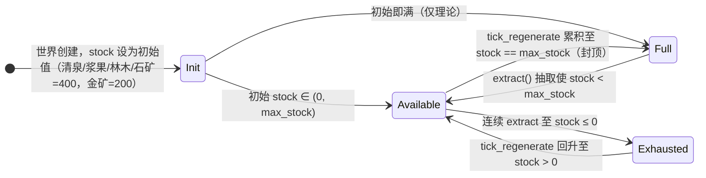

# 08. 🌲 全局有限生态与 POI 资源体系 (`poi`)

> **模块索引**：[← 返回 ../README.md 全景索引](../README.md) · 主要源码：`crates/sim_core/src/spatial/poi.rs`、`ecology/`

> ⚡ **v1.9.0（Task4）出生地**：开局始祖不再落在 POI/营地节点，而是随机落在**普通道路节点**（`road_nodes` = `countTerrainTransitionNodes`(17) 个地形过渡 `GroundIntersection` 节点，非 POI），每名始祖消耗 1 次共享 `WorldRng` 确定性抽选；`home_camp` = 离出生地最近的营地（保证 `home_camp_node` 与地区归属一致）。
> ⚡ **v1.21.1 始祖出生地去营地化**：播撒始祖时先过滤出**距离任何营地 POI 均 ≥ 安全距离**（`max(poi_interaction_radius, poi_min_distance × 0.5)`，默认 35m）的普通道路节点候选集 `valid_spawn_nodes`，每名始祖仍消耗 1 次共享 `WorldRng` 确定性抽选；无候选集（极端/无道路节点）时在远离营地的野外坐标生成道路交叉节点（`make_far_spawn_node` 就近接入路网），**严禁任何始祖直接出生于营地节点或营地建筑范围内**。

> ⚡ **M6（v1.4.0）机制更新**：随身搬运链路保留（行囊 `carried_*` 仍为物理背包层），但 `RestingAtCamp` 时行囊按卸货速率**直接卸入户主家户账本**（Deposit 流水）并即时入账，家中吃喝从家户账本真实扣减（Consume）——已无房屋仓库中间层。
>
> ⚡ **M7（v1.5.0）追加**：是否去 POI 采货由家庭库存施密特触发器驱动（有房含 0 级即可采：账本余额 <100 触发、补到 ≥200 停，水/粮/木/石/金统一；无房者仍不装袋）。本文件以下旧描述如按"卸入私宅仓库/独立仓储/按等级备货目标"阅读时请注意此变更。

---

## 状态机

本状态机刻画**单个生态 POI 的物理储量**，由世界 tick 每拍推进：每 tick 按 `regen_rate × dt × 倍率` 再生、被 Agent `extract()` 抽取而下降。注意 **POI 可用性由每个 Agent 的私有施密特触发器判定（开启≥50%/关闭<10%），不存在全局 POI 可用性状态**——本机只描述物理库存，路由/重路由只读 Agent 触发器结论。

| 状态 | 含义 | 进入条件 | 退出条件 |
| :--- | :--- | :--- | :--- |
| Init 初始化 | POI 刚创建，stock 设定初值 | 世界 reset / 创世 | stock 落入 (0,max) 或满 |
| Full 满额 | stock == max_stock，再生封顶 | 再生累积至上限 | 被 extract 抽离上限 |
| Available 可采 | 0 < stock < max，可被抽取并持续再生 | 初值/再生回升/被抽离满额 | 抽至≤0 或再生至满 |
| Exhausted 枯竭 | stock ≤ 0，停止抽取仅再生 | 连续 extract 采空 | 再生回升至 >0 |

**不变量**（违反即出 bug）：
- POI 储量上限 `stock_max` 固定（200 或 400），`tick_regenerate` 每 tick 按 `regen_rate × dt × 倍率` 推进，封顶不超过 max，不产生 NaN/通胀。
- 施密特触发器是 Agent 私有的，不存在全局 POI 可用性状态；本机仅刻画物理储量，路由/重路由只读 Agent 触发器结论。
- 营地储量无限不参与竞争；榷场三库存独立再生且不纳入 `NodePool`、不设公共触发器，仅由 B15 专用派发。

## 1. 模块定位

全图有限生态地标（POI）的生成、储量管理与再生系统。所有资源点储量有限、可再生，是部落民生存与建造的物质来源。POI 可用性通过 Agent 私有施密特触发器解耦瞬时库存与决策。

## 2. 核心机制

### 2.1 POI 总量与分布
全图共 **23 处**生态地标，采用空间排斥算法保证全局 ≥ 70m 间距：

| 地标类型 | 数量 | 储量上限 | 再生速率 | 核心作用 |
| :--- | :---: | :---: | :---: | :--- |
| 部族营地 (`Camp`) | 4 | ∞ | — | 县级行政区地名，随辖内房屋数自动升级行政级别 |
| 天然清泉 (`Water`) | 6 | 400.0 | 2.0/s | 产出水资源 |
| 缓坡浆果 (`Berry`) | 6 | 400.0 | 2.0/s | 产出食物资源 |
| 茂密林木 (`Wood`) | 3 | 200.0 | 2.0/s | 产出木材，冬季供暖与建筑材料 |
| 嶙峋石矿 (`Stone`) | 2 | 200.0 | 2.0/s | 产出石料，纯建筑材料 |
| 璀璨金矿 (`Gold`) | 1 | 200.0 | 1.8/s | 产出黄金，终极建筑材料 |
| 榷场互市 (`Market`) | 1 | 400.0(水) / 400.0(粮) / 400.0(木) | 2.0/s(水) / 2.0/s(粮) / 2.0/s(木) | 外部商贸枢纽，承载水、粮、木三套独立库存与再生，黄金动态计价兑换 |

### 2.2 有限储量与再生
- 所有自然资源点具备 `extract`（抽取）与 `tick_regenerate`（周期再生）机制。
- 外部市场具备主库存（水）、次级库存（粮）与第三库存（木）的三库存独立再生机制，不纳入 `NodePool`，不设施密特触发器（由 B15 专用派发，或野外断流直达）。
- 营地储量无限，不参与资源竞争。

### 2.3 产速倍率与生效产速（v1.22.6）
- 上表「再生速率」为**基准值**，来自 `SimConfig` 的 `regen_base_*` / `market_regen_base_*`；内核每 tick 将 `poi.regen_rate` 覆写为基准值，再按 `dt × 倍率` 推进再生（见 `world_tick.rs`）。
- 因此**快照 `regen_rate` 只含基准值，不含倍率**；UI 展示的「产出速率」必须是生效值＝`regen_rate × 对应倍率`。
- 倍率槽位映射：水→`water`、浆果→`berry`、林木→`wood`、石矿→`stone`、金矿→`gold`。
  **⚠ 榷场特例**：清水走 `water` 槽位，**粮食再生复用 `berry` 槽位**，**木材再生复用 `wood` 槽位**。
- 倍率唯一真相源为 `World3DEngine` 的 5 个 `*_regen_multiplier`（随存档持久化），经快照下发为前端 `sim.regenMultipliers`；生态大盘滑块与 POI 卡片均消费同一份数据。
- **创世复现配置（v1.46.2）**：生态大盘滑块的五类倍率另以浏览器 `localStorage` 键 `flowaccord.poi-regen-rates.v1` 保存。`config.poi-rates.js` 在 `rustworld.js` 创建 Worker 前读取并随 `INIT`/`RESET` 发送；Worker 在 `world_create` 完成后、首个快照及任何 tick 之前写入内核。因此新世界的确定性输入为「世界种子 + 这组 POI 产速倍率」。读档仍以存档自身保存的倍率为准，不受本地偏好覆盖。

### 2.4 Agent 私有施密特触发器
每名 Agent 在自身决策相位观察 POI 库存，维护 `poi_seekability` 私有锁存：
- 库存升至 ≥ 50% 才开放；
- 已开放点仅在跌破 < 10% 时关闭；
- 10%~50% 中间带保持该 Agent 的前态。

相同 POI 可被不同 Agent 判为不同可用性，路由与重路由只读取 Agent 的触发器结论，不直接依赖瞬时库存。详见根 AGENTS.md §4.2。

### 2.5 营地 5 级行政升级
以辖内绑定有效房屋数量为界，四个升级门槛由 `SimConfig` 的
`campLevelVillageMinHouses`、`campLevelTownshipMinHouses`、
`campLevelTownMinHouses`、`campLevelCountyMinHouses` 配置。
等级 → 名称/图标映射（营地 → 村 → 乡 → 镇 → 县）与各阶位门槛数值的权威表述已移至
[`../design/02-world-rules.md`](../design/02-world-rules.md) §4，本文只保留机制与配置字段。

每座私宅选址时自动绑定最近营地（`house.camp_id`），达成门槛时全图广播晋升。

## 3. 关键不变量
- POI 数量由 `config.rs` COUNT_* 常量控制，改数量须同步 `ecology/` 与前端面板文案。
- 储量上限 stock_max 均为 200.0（config.rs），不存在 60.0 的旧值。
- 施密特触发器是 Agent 私有的，不存在全局 POI 可用性状态。

## 4. 与其他模块接口
- `agent.rs` / `decisions/`：读取触发器结论进行选点与重路由。
- `ecology/`：POI 初始化、采收装载、回家卸货。
- `housing_system/settlement.rs`：房屋绑定最近营地。
- `snapshot.rs`：POI 储量与产速随快照下发。

## 5. 调参入口
POI 数量、储量、再生速率、间距、施密特阈值等见 [./05-config-reference.md](./05-config-reference.md) 第 4、5 分区。
