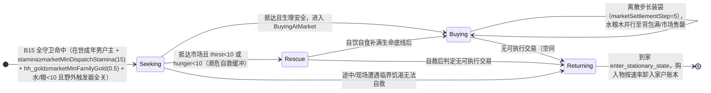

# 09. 🏪 外部市场与动态价格系统 (`market`)

> **模块索引**：[← 返回 ../README.md 全景索引](../README.md) · 主要源码：`crates/sim_core/src/spatial/poi.rs`、`decisions/market.rs`、`ecology/`、`ledger/journal.rs`

---

## 状态机

本状态机刻画**单个家户户主的一次榷场赴市交易行程**，由 `B15MarketTrade` 守卫触发、由 `ecology/tick.rs::tick_poi_interactions` 每拍结算推进；黄金从家户账本单向流入 `LedgerRef::Void` 闭环。



| 状态 | 含义 | 进入条件 | 退出条件 |
| :--- | :--- | :--- | :--- |
| Seeking 奔赴榷场 | 户主 dispatch 为 SeekingMarket 冲向市场 | B15 守卫全中 | 抵达（自救或交易）或途中临界放弃 |
| Rescue 现场自救 | 濒死线优先自饮自食保命 | 抵达时 thirst<10 或 hunger<10 | 补满生命底线转交易 |
| Buying 装袋购入 | BuyingAtMarket，按 step 离散购入 | 生理安全抵达 | 无可成交项/体力告警/求生抢占 |
| Returning 返航卸货 | ReturningToCamp，平滑返家 | 上述退出条件任一 | 到家 enter_stationary_state |

**不变量**（违反即出 bug）：
- 黄金单向流失：交易黄金必须进入 `LedgerRef::Void`（家户账本 Market 流水 + 随身黄金自减），严禁转给其他 Agent 或营地，形成通缩闭环。
- 市场不进入 `NodePool`、不设公共施密特触发器，仅由 B15 专用派发，杜绝部落民跨图蹭吃蹭喝。
- 幂律单价纯由物理库存函数 `market_unit_price` 推导（P0=0.1, k=2.0, floor=1.0），不消耗 WorldRng，单价封顶 1000 金杜绝 NaN。

## 1. 模块定位

随着部落人口增长、代际更替与氏族/王国社会分层形成，内部生态面临季节性或长期资源短缺危机。**外部市场（榷场互市）与幂律动态价格系统**为部落经济注入外部流通性与终极生存安全垫：
1. **外部商贸地标**：建立常驻的榷场互市 POI，提供外部输入的水、粮与木材储备；
2. **幂律动态计价**：根据市场存量实时推导黄金兑换单价，形成供需自调节的价格机制；
3. **生死兜底 AI**：部落民在野外采集点枯竭、家境绝望时自主携带黄金前往榷场采购救命物资；
4. **黄金流失闭环**：黄金从家户账本流出至系统虚空（`LedgerRef::Void`），回收流通货币，杜绝经济恶性通胀。

v1.27.0 起采水/采粮断流直达榷场；**v1.36.0** 起木材正式加入榷场互市供应物资，外部森林衰竭或采木途中/现场断流时，**家户户主**（家户账本金币 ≥ `market_min_family_gold` 且体力 ≥ `decision_work_stamina_threshold`）可直接原地掉头改道榷场采购木材；交易从家户账本**远程结算**，石/金采集不享受该兜底。

---

## 2. 核心机制

### 2.1 外部市场 POI 与三级库存设计

全图生成 **1 处**常驻外部市场地标（`PoiType::Market`，ID 60 段位，全图 POI 总数 23 处）：

```
┌────────────────────────────────────────────────────────────────────────┐
│                        榷场互市 (Market, ID 60)                         │
├──────────────────────────┬──────────────────────────┬──────────────────┤
│ 主库存: 清水 (Water)      │ 次级库存: 粮食 (Food)     │ 第三库存: 木料(Wood)
│ 储量上限: 400.0          │ 储量上限: 400.0          │ 储量上限: 400.0  │
│ 自然产速: 2.0/秒         │ 自然产速: 2.0/秒         │ 自然产速: 2.0/秒 │
│ 提取接口: extract()      │ 提取接口: extract_sec()  │ 提取: extract_ter()
└──────────────────────────┴──────────────────────────┴──────────────────┘
```

#### 2.1.1 实体多库存字段兼容
`PrimitivePoi` 结构体维护独立的三级库存字段：
- `current_stock` / `max_stock` / `regen_rate`（主库存清水）
- `secondary_stock` / `secondary_max_stock` / `secondary_regen_rate`（次级库存粮食）
- `tertiary_stock` / `tertiary_max_stock` / `tertiary_regen_rate`（★ v1.36.0 第三库存木料）

次级与第三级字段均打上 `#[serde(default)]` 特性，保证旧版本存档反序列化时零破坏、自动赋零平滑过渡。

#### 2.1.2 市场物理隔离原则（防公地悲剧）
外部市场是**需要支付黄金的贸易点**，而非免费野外公地：
- **不进入 `NodePool`**：`build_decision_context` 将市场节点单独收集至 `ctx.market_nodes`，不混入 `ctx.water_nodes` 或 `ctx.food_nodes`。
- **不设公共施密特触发器**：常规寻水/觅食/建材储备 AI 绝不将市场视为免费可采点；市场仅受专用的 B15 商贸分支派发，杜绝部落民跨图蹭吃蹭喝。

---

## 3. 幂律动态价格算法

市场的清水与粮食价格采用纯函数 `market_unit_price(stock, max_stock, config)` 计算，完全由当前库存比例动态决定：

$$P(S) = P_0 \times \left(\frac{S_{max}}{\max(S, S_{floor})}\right)^k$$

| 变量 | 物理含义 | 权威超参 / 默认值 |
| :--- | :--- | :--- |
| $P(S)$ | 当前品类单位资源黄金单价 | 纯函数计算返回值 |
| $P_0$ | 满库存时的基准起步单价 | `marketPriceBase = 0.1` (金/单位) |
| $S_{max}$ | 该品类库存容量上限 | `marketStockMaxWater / Food = 200.0` |
| $S$ | 当前实际物理库存量 | `poi.current_stock` / `secondary_stock` |
| $k$ | 幂律弹性指数 | `marketPricePowerExponent = 2.0` (平方反比敏感度) |
| $S_{floor}$ | 计价库存安全钳制下限 | `marketPriceFloorStock = 1.0` (防除以零与价格封顶) |

### 3.1 价格量级校验示例

按上式取 $S_{max} = 200$、$P_0 = 0.10$、$k = 2$：满库存 0.10、半库存 0.40、存量 20 时 10.00 金/单位；
$S$ 逼近 $S_{floor}$ 时触发 1000 金硬封顶，杜绝 NaN 与无穷大。**玩家视角的价格直觉（四档感受）见**
[`../design/04-economy.md`](../design/04-economy.md) §4 —— 本文只保留算法与量级校验。

---

## 4. B15 榷场商贸决策分支 (`B15MarketTrade`)

决策层位于 `crates/sim_core/src/spatial/decisions/market.rs`，注册为第 15 条自包含条件分支 `BranchId::B15MarketTrade`（字符串 ID `"b15"`）。

### 4.1 评估位置与层级
- **马斯洛层级**：生理层（`MaslowLevel::Physiological`），置于 B2 觅食与 B3 休息之间。
- **定位**：**极端生存危机的绝境兜底**。当野外公域彻底断流且家中存货枯竭时，购买维生水粮的优先级高于回巢休眠。

### 4.2 自包含守卫条件
1. **在世成年男性**：`agent.is_alive && agent.gender == Male && agent.age >= adult_age`；
2. **家户户主锚定**：家庭跟着男人走，仅家户 leader 有权支配全家金库并出资采购；
3. **体力起步门槛**：`agent.stamina >= marketMinDispatchStamina`(15.0)，防止半路虚脱力竭倒毙；
4. **黄金支付底线**：`hh_gold >= marketMinFamilyGold`(0.50)，过滤无支付能力的空跑与高频微量寻路；
5. **OR 逻辑绝境守卫**（严格生存断流检查）：
   - 水荒短缺：家户水 $< 10.0$ 且 **野外所有水源对该 Agent 的私有施密特触发器均已关闭**；
   - 粮荒短缺：家户粮 $< 10.0$ 且 **野外所有浆果丛对该 Agent 的私有施密特触发器均已关闭**；
   - **判定**：满足任一短缺（OR 逻辑）即可触发商贸，不必等待双绝境，允许在大旱但浆果尚存时自主赴市买水保命。

---

## 5. 现场交易、自救缓冲与黄金流出

族人抵达市场后进入 `PrimitiveActionState::BuyingAtMarket` 状态，由 `ecology/tick.rs::tick_poi_interactions` 执行每拍结算：

### 5.1 现场濒危自救缓冲（先吃喝保命）
如果出发赶路的户主在途中体能严重消耗，抵达市场时处于濒死线（`thirst < 10.0` 或 `hunger < 10.0`）：
- 优先从市场抽取资源直接注入户主自身生理槽，现场就地自饮/自食补满生命底线；
- 扣减对应黄金。绝不发生「手握清水却因装袋规则渴死在货架前」的反直觉悲剧。

### 5.2 离散步长装袋购入（★ v1.33.0 / v1.36.2）
自救满足后，族人按固定结算步长（`market_settlement_step = 5.0` 单位）离散购入物资装入行囊：
- **三重离散约束**：`buy_amount = step (5.0)`，当且仅当 `剩余背包空间 >= step`、`市场实际库存 >= step` 且 `家户剩余黄金 >= step * 单价` 时触发结算；
- 弃用原本每 tick 微量浮点（`rate_res * dt` ~0.333 单位）交易，避免高频微额流水充斥环形缓冲；
- 水粮木并行装袋，互不冲突，直至背包满额（50.0）、市场售罄或黄金不足。

### 5.3 黄金流失与记账闭环
- **协同结算（★ v1.46.13）**：交易优先消耗家户账本黄金（远程结算），若家户不足则由随身携带黄金（`carried_gold`）差额补足；
- **真实扣减与流向虚空**：从家户账本扣除的黄金生成记账凭证 `TransferRecord`（`from: LedgerRef::Family`, `to: LedgerRef::Void`, `reason: TransferReason::Market`），随身黄金直接自减并流向虚空，保持通缩闭环；
- **宏观效应**：黄金作为一般等价物向外部大世界流失，沉淀了货币蓄水池，为后续由营地中介驱动的二手房屋竞价交易提供了紧缩锚。

### 5.4 平滑返航与防滞留守卫（★ v1.46.13）
当族人在现场面临以下任一情况时，决策器平滑切换为 `PrimitiveActionState::ReturningToCamp` 启程返家（`Safety·ReturnHome`）：
1. **无可执行交易**：水、粮、木三个品类中没有任何一项同时满足「有需求且空间足够（$\ge \text{step}$）且市场有货（$\ge \text{step}$）且总可用资金能够支付一笔结算（$\text{available\_gold} \ge \text{step} \times \text{单价}$）」；
2. **体力告警**：`agent.stamina < decision_work_stamina_threshold`（返回休整 `Physiological·Rest`）；
3. **紧急求生抢占**：在途中或在现场遭遇临界饥渴且无法在现场自救时，立即抢占转向野外自然点或返家。
彻底根除了以往因「家财或随身资金不足以支持一整步结算、但未达到旧 0.05 枯竭线」而卡死在榷场的 Bug。回家休整时，购入的物资按正常物理速率卸入家户账本。

### 5.5 交易流水环形缓冲（★ v1.28.0）

榷场自带**交易流水环形缓冲** `PrimitivePoi.market_trades: VecDeque<MarketTradeRecord>`，四个成交写入点（濒危自救的水/粮、连续装袋的水/粮）各追加一条：

| 字段 | 含义 |
| :--- | :--- |
| `tick` | 成交时的世界 tick |
| `agent_id` | 采购人（赴市的家户户主） |
| `household_id` | 采购人家户 ID |
| `resource` | `"Water"` / `"Food"` / `"Wood"` |
| `amount` | 成交数量 |
| `unit_price` | 成交时单价（金/单位） |
| `gold_cost` | 本次支出黄金总额 |

- **容量复用** `config.ledger_journal_capacity`（64，**未新增超参**），超容量淘汰最旧（`PrimitivePoi::push_market_trade`）；
- **只留痕、不记账**：黄金流出仍走家户账本 `TransferReason::Market` 流水，买入的水/粮/木仍走行囊 → 回家 `Deposit` 链路，杜绝账面与库存二次入账；
- **随档持久化**：`world_save.rs` 全量克隆 `pois`，字段带 `#[serde(default)]`，旧档零破坏；
- **确定性**：`VecDeque` 保序、不消耗 `WorldRng`、不新增决策相位；
- **旧缺陷**：此前前端扫描全部家户流水并过滤 `reason === 'MarketTrade'`，而内核序列化为 `"Market"`，且家户账本只记黄金、水粮无记录——面板恒显示"暂无交易记录"。现改为直接读 POI 自带流水。

---

## 6. 快照三处同步与前端呈现

### 6.1 快照字段定义与同步
| 字段名 | 类型 | 说明 | 同步位置 |
| :--- | :--- | :--- | :--- |
| `secondary_stock` | `f32` | 外部市场当前粮食储量 | `snapshot.rs` / `world_snapshot.rs` / `rustworld.js` |
| `secondary_max_stock` | `f32` | 外部市场粮食储量上限 | `snapshot.rs` / `world_snapshot.rs` / `rustworld.js` |
| `secondary_regen_rate`| `f32` | 外部市场粮食每秒再生速度 | `snapshot.rs` / `world_snapshot.rs` / `rustworld.js` |
| `tertiary_stock` | `f32` | ★ v1.36.0 外部市场当前木料储量 | `snapshot.rs` / `world_snapshot.rs` / `rustworld.js` |
| `tertiary_max_stock` | `f32` | ★ v1.36.0 外部市场木料储量上限 | `snapshot.rs` / `world_snapshot.rs` / `rustworld.js` |
| `tertiary_regen_rate`| `f32` | ★ v1.36.0 外部市场木料每秒再生速度 | `snapshot.rs` / `world_snapshot.rs` / `rustworld.js` |
| `water_price` | `f32` | 外部市场清水当前实时单价 | `snapshot.rs` / `world_snapshot.rs` / `rustworld.js` |
| `food_price` | `f32` | 外部市场粮食当前实时单价 | `snapshot.rs` / `world_snapshot.rs` / `rustworld.js` |
| `wood_price` | `f32` | ★ v1.36.0 外部市场木料当前实时单价 | `snapshot.rs` / `world_snapshot.rs` / `rustworld.js` |
| `cumulative_sold_water` | `f32` | ★ v1.37.0 外部市场历史累计出售清水总量 | `snapshot.rs` / `world_snapshot.rs` / `rustworld.js` |
| `cumulative_sold_food` | `f32` | ★ v1.37.0 外部市场历史累计出售粮食总量 | `snapshot.rs` / `world_snapshot.rs` / `rustworld.js` |
| `cumulative_sold_wood` | `f32` | ★ v1.37.0 外部市场历史累计出售木料总量 | `snapshot.rs` / `world_snapshot.rs` / `rustworld.js` |
| `cumulative_revenue` | `f32` | ★ v1.37.0 外部市场历史累计收款总额（黄金） | `snapshot.rs` / `world_snapshot.rs` / `rustworld.js` |
| `market_trades` | `Vec<MarketTradeSnapshot>` | ★ v1.28.0 榷场最近 8 笔交易流水（从新到旧） | `snapshot.rs` / `world_snapshot.rs` / `rustworld.js` |

### 6.2 前端可视化渲染
- **Canvas 视口** (`render_world.js`)：
  - 绘制 🏪 图标；
  - 绘制蓝（水库存比）、红（粮库存比）与棕（木库存比）同心三指示环。
- **Inspector 侧边栏** (`render_inspector.js` ★ v1.37.0 全面重构)：
  - 标题栏状态徽章精简为「🏪 边境榷市」，彻底消除文本溢出与截断问题；
  - **经营数据总览卡片**：展示历史累计出售总量（支持水/粮/木分项明细）与累计收款总额（黄金货币回收总量）；
  - **三商品行情牌价网格**：清水、粮食、木料 3 个独立商品卡片，实时高亮展示各自当前幂律单价（如 `0.41 金`）、库存进度条、储量数字与产出速率；
  - 底部保留实时交易流水（最近 8 笔流水记录）。
- **马斯洛决策引擎视图** (`decision-viz-*.js`)：
  - 支持拖动编排 `b15`（榷场商贸）卡片；
  - FSM 状态机芯片支持 `SeekingMarket`（奔赴榷场）与 `BuyingAtMarket`（榷场交易）。

---

## 7. 超参数速查表

全部由 `frontend/js/config.js` 统一驱动：

| 超参名称 | 默认值 | 物理含义与设计考量 |
| :--- | :---: | :--- |
| `countMarkets` | `1` | 全图生成外部市场 POI 数量 |
| `marketStockMaxWater` | `400.0` | 外部市场清水储备容量上限 |
| `marketStockMaxFood` | `400.0` | 外部市场粮食储备容量上限 |
| `marketStockMaxWood` | `400.0` | ★ v1.36.0 外部市场木材储备容量上限 |
| `marketRegenBaseWater` | `2.0` | 外部市场清水每秒自然恢复速率 |
| `marketRegenBaseFood` | `2.0` | 外部市场粮食每秒自然恢复速率 |
| `marketRegenBaseWood` | `2.0` | ★ v1.36.0 外部市场木材每秒自然恢复速率 |
| `marketPriceBase` | `0.1` | 满库存时的水/粮基础单价（黄金/单位） |
| `marketPriceBaseWood` | `0.15` | ★ v1.36.0 满库存时的木材基础单价（黄金/单位） |
| `marketPricePowerExponent` | `2.0` | 幂律定价指数（$k=2.0$ 平方反比敏感度） |
| `marketPriceFloorStock` | `1.0` | 计价库存钳制下限（防除零，单价封顶 1000 金） |
| `marketEmergencyFamilyStockThreshold` | `10.0` | 家户水或粮的绝境警戒阈值 |
| `marketMinFamilyGold` | `0.5` | 户主出发前往市场的家财起步门槛 |
| `marketMinDispatchStamina` | `15.0` | 户主出发前往市场的体能最低门槛 |
| `marketSettlementStep` | `5.0` | ★ v1.36.2 外部市场单次交易结算步长（单位） |

---

## 8. 关键不变量

1. **确定性保证**：市场价格纯由物理库存函数推导，不消耗任何伪随机数生成器（`WorldRng`）。
2. **定长数组联动铁律**：内核与前端决策分支数组定长为 18（`BranchId::ALL: [BranchId; 18]`、`resolve_order`、`seen = [false; 18]`、`DEFAULT_ORDER`）。
3. **资金单向流失**：外部市场交易黄金必须进入 `LedgerRef::Void`，严禁转给其他 Agent 或营地，确保生态存在通缩调节机制。
4. **自包含分支铁律**：`evaluate_market_trade` 内部封装全部守卫与断流条件，在决策引擎中可安全拖动至任意优先级次序而不破坏代码语义。
